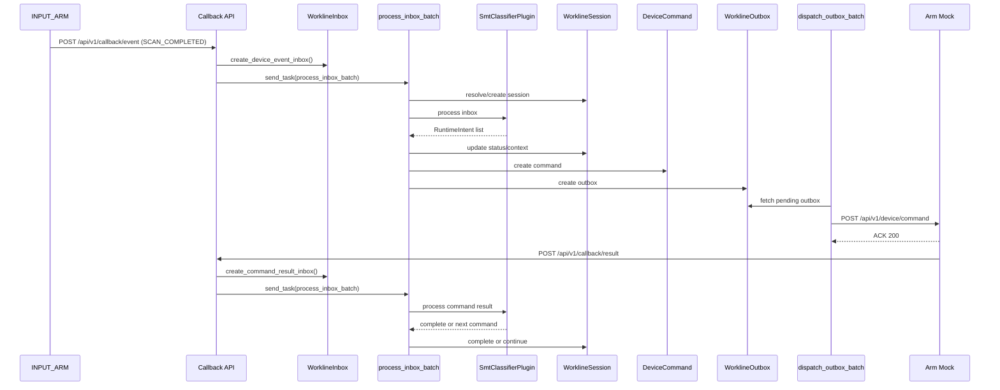

# SMT Classifier Runtime Data Flow

**最后更新**: 2026-03-30

本文档说明 `smt_classifier` 插件与 `tests/mock/smt_classifier` 模拟设备在当前仓库中的完整运行链路，重点覆盖：

- 一条设备事件如何进入 WES，并转为 `WorklineInbox`
- `process_inbox_batch` 如何解析 `Session`、调用插件并落库
- `dispatch_outbox_batch` 如何把命令派发到模拟设备
- 模拟设备如何回调结果，再次进入编排
- `WorklineInbox / WorklineSession / DeviceCommand / WorklineOutbox / WorklineTimeline` 在每一步的关键字段变化
- 当前 mock 与插件协议之间的已知差异

相关代码：

- 编排任务入口: `src/celery_app/tasks/workline.py`
- SMT 插件: `src/workline_plugins/smt_classifier/plugin.py`
- Session 归属解析: `src/workline_runtime/session_resolver.py`
- 设备回调入口: `src/app/callback/v1/callback.py`
- Inbox Service: `src/app/workline/services/inbox_service.py`
- Mock 设备导出入口: `tests/mock/smt_classifier/__init__.py`
- 流水线 Mock: `tests/mock/smt_classifier/pipeline_mock.py`
- 机械臂 Mock: `tests/mock/smt_classifier/arm_mock.py`
- 库位分配 Mock: `tests/mock/smt_classifier/allocation_mock.py`
- AGV Mock: `tests/mock/smt_classifier/agv_mock.py`

## 1. 参与者与职责

### 1.1 工作线设备角色

`smt_classifier` 插件要求工作线至少配置三类设备角色：

| 角色 | 含义 |
|------|------|
| `INPUT_ARM` | 进料机械臂，负责 NG 抓取放置 |
| `CONVEYOR` | 流水线，负责 OK 物料传输 |
| `OUTPUT_ARM` | 出料机械臂，负责最终出料 |

角色声明见 `src/workline_plugins/smt_classifier/plugin.py`。

### 1.2 Mock 设备职责

`tests/mock/smt_classifier/__init__.py` 本身只是导出层，不包含业务流程。

当前 mock 的接口分层约定如下：

- 正式接口按供应商/WES 对接协议实现，统一挂在 `/api/v1/device/*`
- 调试接口保留在同一个服务中，但统一使用单独前缀 `/debug/*`
- `/debug/*` 只用于本地开发和 E2E 联调时主动模拟硬件动作，不代表供应商正式协议
- 当前约定下，`/debug/*` 默认对本地开发环境开放，不额外鉴权

真实行为分布在两个模块中：

- `pipeline_mock.py`
  - 提供正式设备接口：`POST /api/v1/device/command`、`GET /api/v1/device/status`、`POST /api/v1/device/cancel`
  - 提供开发调试接口：`POST /debug/execute`、`POST /debug/auto/start`、`POST /debug/auto/stop`、`GET /debug/executions`
- `arm_mock.py`
  - 提供正式设备接口：`POST /api/v1/device/command`、`GET /api/v1/device/status`、`POST /api/v1/device/cancel`
  - 提供开发调试接口：`POST /debug/execute`、`POST /debug/scan-completed`、`POST /debug/inspection-completed`、`POST /debug/auto/start`、`POST /debug/auto/stop`、`GET /debug/executions`
  - 正式命令执行完成后会异步回调 `POST /api/v1/callback/result`
- `allocation_mock.py`
  - 提供正式业务接口：`POST /api/v1/bin-allocation/allocate`、`GET /api/v1/bin-allocation/status`
  - 提供调试接口：`POST /debug/reset`、`POST /debug/mode`、`GET /debug/requests`
  - 默认模式为 `agv_required_then_allocated`，同一 `business_key` 第一次请求返回 `AGV_REQUIRED`，第二次返回 `ALLOCATED`
- `agv_mock.py`
  - 提供正式设备接口：`POST /api/v1/device/command`、`GET /api/v1/device/status`、`POST /api/v1/device/cancel`
  - 提供调试接口：`POST /debug/execute`、`POST /debug/mode`、`GET /debug/executions`
  - 正式命令执行完成后会异步回调 `POST /api/v1/callback/external`

### 1.3 WES 端职责分层

| 组件 | 职责 |
|------|------|
| `callback.py` | 接收设备 HTTP 回调，转为 `WorklineInbox`，commit 后触发 Celery |
| `workline.py` | 消费 `Inbox`，加载上下文，调用插件，落库状态、命令和 outbox |
| `dispatch_outbox_batch` | 读取 `Outbox` 并真正请求设备接口 |

## 2. 涉及的核心表与关键字段

### 2.1 WorklineInbox

关键字段：

| 字段 | 含义 |
|------|------|
| `kind` | 消息类型，如 `DEVICE_EVENT`、`COMMAND_RESULT` |
| `payload_json` | 原始业务负载 |
| `device_id` | 归属设备 |
| `command_id` | 归属命令 |
| `session_id` | 归属会话 |
| `workline_id` | 归属工作线 |
| `correlation_id` | 业务链路关联 ID |
| `status` | `NEW / PROCESSING / PROCESSED / FAILED` |
| `idempotency_key` | 幂等键 |

### 2.2 WorklineSession

关键字段：

| 字段 | 含义 |
|------|------|
| `session_code` | 业务会话编号 |
| `business_key` | 业务主键，设备事件通常优先取 `data.LotCode`，缺失时再回退到其他 Six-In-One 字段 |
| `status` | `NEW / RUNNING / WAITING_* / COMPLETED / FAILED / CANCELLED` |
| `context_json` | 插件上下文快照 |
| `current_wait_type` | 当前等待类型 |
| `deadline_at` | 当前等待的截止时间 |
| `awaiting_command_id` | 当前等待的命令 ID |
| `failure_domain / failure_code / failure_message` | 失败归因 |
| `last_inbox_id` | 最后处理的 Inbox |

### 2.3 DeviceCommand

关键字段：

| 字段 | 含义 |
|------|------|
| `command_code` | 全局唯一命令编码 |
| `device_id` | 目标设备 |
| `task_type` | 保存插件/设备协议任务类型，如 `MEASUREMENT_REEL`、`MOVE_FORWARD`、`PICK_AND_PUT` |
| `params` | 业务参数 |
| `status` | 命令状态 |
| `correlation_id` | 串联链路 |
| `session_id` | 字符串形式 session 标识 |
| `workline_id` | 归属工作线 |

### 2.4 WorklineOutbox

关键字段：

| 字段 | 含义 |
|------|------|
| `dispatch_type` | `DEVICE_COMMAND / EXTERNAL_HTTP / INTERNAL_SIGNAL` |
| `target_code` | 目标设备编码或地址 |
| `payload_json` | 真正派发的请求体 |
| `status` | `NEW / DISPATCHING / SENT / FAILED ...` |
| `attempt_count` | 派发次数 |
| `last_error` | 最近一次错误 |

### 2.5 CallbackLog

关键字段：

| 字段 | 含义 |
|------|------|
| `callback_type` | `event` 或 `result` |
| `device_id` | 回调请求里的 `device_code` 字符串 |
| `request_body` | 原始请求体 |
| `request_id` | 回调请求唯一标识 |
| `response_status` | WES 返回给设备的 HTTP 状态码 |
| `response_time_ms` | 回调处理耗时 |
| `error_message` | 回调处理异常或幂等重复说明 |

### 2.6 三台设备写表对照

下表描述的是“设备参与一条 SMT 粗分机运行时链路时，会直接或间接在 WES 中留下哪些表记录”。

| 设备 | 角色 | 会写哪些表 | 触发时机 | 备注 |
|------|------|------------|----------|------|
| `ARM01` | `INPUT_ARM` | `callback_logs`、`workline_inbox`、`device_commands`、`workline_outbox`、`workline_sessions`、`workline_timelines` | 1. 上报 `SCAN_COMPLETED` 时，WES 写 `CallbackLog + DEVICE_EVENT Inbox`；2. WES 为其创建 `PICK_AND_PUT` 指令时写 `DeviceCommand + Outbox`；3. 它回 `callback/result` 时写 `CallbackLog + COMMAND_RESULT Inbox`，并更新 `DeviceCommand / Session / Timeline` | `ARM01` 是当前主链路唯一稳定的 `callback/event` 来源 |
| `PIPELINE01` | `CONVEYOR` | `callback_logs`、`workline_inbox`、`device_commands`、`workline_outbox`、`workline_sessions`、`workline_timelines` | 仅在 OK 主链路中，WES 给流水线下发 `MOVE_FORWARD` 时写 `DeviceCommand + Outbox`；流水线执行完成回 `callback/result` 时写 `CallbackLog + COMMAND_RESULT Inbox`，并推动 `Session / Timeline` 前进 | 不再单独写设备事件事实表 |
| `ARM02` | `OUTPUT_ARM` | `callback_logs`、`workline_inbox`、`device_commands`、`workline_outbox`、`workline_sessions`、`workline_timelines` | 仅在 OK 主链路尾段，WES 给其下发出料 `PICK_AND_PUT` 时写 `DeviceCommand + Outbox`；它回 `callback/result` 时写 `CallbackLog + COMMAND_RESULT Inbox`，并结束 `Session / Timeline` | 主要承担结果回传，不主动发业务事件 |

进一步说明：

- `callback_logs` 同时覆盖 `callback/event`、`callback/result` 与 `callback/external`
- `workline_inbox` 是统一编排入口，所以事件和结果最终都会变成一条 Inbox
- `device_commands` 和 `workline_outbox` 是 WES 对设备的“下行副作用”
- `workline_sessions` 和 `workline_timelines` 是整条工作线的会话状态与轨迹，不是某一台设备独占的数据

### 2.7 WorklineTimeline

当前 `workline.py` 会在这些节点写 timeline：

- 插件做出决策: `DECISION_MADE`
- 准备派发命令: `COMMAND_SENT`
- 开始等待: `WAIT_STARTED`
- 会话失败: `SESSION_FAILED`
- 会话完成: `SESSION_COMPLETED`
- 人工取消: `SESSION_CANCELLED`

## 3. Session 是如何创建或恢复的

逻辑位于 `src/workline_runtime/session_resolver.py`。

### 3.1 DEVICE_EVENT

规则：

1. 优先取 `payload_json.business_key`
2. 没有则尝试 `payload_json.data.LotCode`
3. `LotCode` 缺失时，再按 `DateCode / ProductNo / MfrPN / PONumber / Qty` 顺序回退
4. 还没有则生成 `auto_<uuid>`
5. 按 `workline_id + business_key` 查找打开中的 session
6. 找不到就创建新 session

因此，扫码事件通常会因为携带 `LotCode` 而自动以 `LotCode` 作为 `business_key`。

### 3.2 COMMAND_RESULT

规则：

1. 根据 `command_code` 找 `DeviceCommand`
2. 按 `awaiting_command_id == command.id` 找打开中的 session
3. 找不到再按 `correlation_id` 回溯

这意味着只要前一轮把 `awaiting_command_id` 写对，命令回调就能可靠回到原会话。

## 4. 总体时序图



## 5. 路径 A: 扫码 NG -> INPUT_ARM 放 NG -> Session 完成

这条链路和集成测试 `tests/integration/workline_runtime/test_smt_classifier_runtime_integration.py` 最接近。

### 5.1 假设环境

假设工作线 `WL-SMT-001` 上有三台设备：

| 角色 | device_code | 说明 |
|------|-------------|------|
| `INPUT_ARM` | `ARM01` | 进料机械臂 |
| `CONVEYOR` | `PIPELINE01` | 流水线 |
| `OUTPUT_ARM` | `ARM02` | 出料机械臂 |

假设本次物料主批次码（`LotCode`）为 `SMTLOT20260327001`。

### 5.2 Step 1: INPUT_ARM 上报扫码 NG

按当前运行时集成测试和插件语义，`SCAN_COMPLETED` 应视为由 `INPUT_ARM` 侧上报。

对应参考：

- 插件注释：`INPUT_ARM` 用于“扫码后抓取和 NG 放置”
- 运行时集成测试 `tests/integration/workline_runtime/test_smt_classifier_runtime_integration.py` 中，`SCAN_COMPLETED` 的 `device_code` 就是 `INPUT_ARM`

因此本文主链路采用如下请求体：

```json
{
  "device_code": "ARM01",
  "event_type": "SCAN_COMPLETED",
  "timestamp": 1710000000000,
  "data": {
    "LotCode": "SMTLOT20260327001",
    "DateCode": "20260327",
    "Qty": "100",
    "ProductNo": "PN001",
    "MfrPN": "MFR002",
    "PONumber": "PO20260327001",
    "location": "SCAN",
    "result": "NG"
  }
}
```

### 5.3 Step 2: `/callback/event` 创建 DEVICE_EVENT Inbox

`callback_event()` 判断这是绑定到 workline 的设备后，会创建一条 `DEVICE_EVENT Inbox`。

典型 `WorklineInbox` 记录：

| 字段 | 值 |
|------|----|
| `kind` | `DEVICE_EVENT` |
| `status` | `NEW` |
| `device_id` | `ARM01` 对应设备 ID |
| `workline_id` | 通过设备归属回填 |
| `session_id` | 初始为空 |
| `payload_json.message_type` | `DEVICE_EVENT` |
| `payload_json.event_type` | `SCAN_COMPLETED` |
| `payload_json.data.LotCode` | `SMTLOT20260327001` |
| `payload_json.data.result` | `NG` |

随后：

- `db.commit()`
- `send_task("src.celery_app.tasks.workline.process_inbox_batch")`

### 5.4 Step 3: Celery 处理第一条 Inbox

`process_inbox_batch()` 对该消息执行：

1. `mark_as_processing()`
2. `_load_related_entities()`
3. 如果没有 session，则 `session_resolver.resolve_or_create()`
4. `OrchestratorService.process_inbox()`
5. `_apply_orchestrator_effects()`
6. `mark_as_processed()`

### 5.5 Step 4: SessionResolver 创建 Session

由于这是 `DEVICE_EVENT` 且 `data.LotCode` 存在：

- `business_key = "SMTLOT20260327001"`
- 当前 workline 若无同业务键 open session，则创建新 session

典型新 `WorklineSession`：

| 字段 | 值 |
|------|----|
| `session_code` | `SES_<uuid>` |
| `workline_id` | 当前工作线 ID |
| `plugin_key` | `smt_classifier` |
| `business_key` | `SMTLOT20260327001` |
| `status` | `NEW` |
| `correlation_id` | 若 Inbox 无值则自动生成 `corr_<uuid>` |
| `context_json.device_id` | `ARM01` 对应设备 ID |
| `context_json.initial_payload` | 原始 DEVICE_EVENT payload |
| `started_at` | 当前时间 |

### 5.6 Step 5: SMT 插件处理扫码 NG

插件分支：

- `event_type == SCAN_COMPLETED`
- `scan_result == NG`
- 进入 `_handle_ng_flow()`

返回的 `RuntimeIntent` 关键内容：

```json
{
  "transition": "scan_ng",
  "context_patch": {
    "stage": "WAITING_PICK_PLACE",
    "barcode": "SMTLOT20260327001",
    "last_barcode": "SMTLOT20260327001",
    "scan_result": "NG",
    "location_id": "SCAN",
    "context_schema_version": "1.0",
    "ng_reason": "SCAN_NG",
    "source_type": "INPUT_PLATFORM",
    "target_type": "NG_PLATFORM"
  },
  "commands": [
    {
      "target_device_id": "<input_arm_id>",
      "action": "PICK_AND_PUT",
      "parameters": {
        "source_type": "INPUT_PLATFORM",
        "target_type": "NG_PLATFORM",
        "reason": "SCAN_NG"
      }
    }
  ],
  "wait": {
    "wait_type": "COMMAND_RESULT",
    "wait_token": "ng_pick_place_<session_id>",
    "deadline_seconds": 300
  }
}
```

### 5.7 Step 6: `workline.py` 落库副作用

#### 5.7.1 Session 更新

| 字段 | 更新后值 |
|------|----------|
| `status` | `WAITING_DEVICE_RESULT` |
| `context_json.stage` | `WAITING_PICK_PLACE` |
| `context_json.barcode` | `SMTLOT20260327001` |
| `context_json.ng_reason` | `SCAN_NG` |
| `current_wait_type` | `COMMAND_RESULT` |
| `awaiting_command_id` | 新命令 ID |
| `deadline_at` | `now + 300s` |
| `last_inbox_id` | 当前 DEVICE_EVENT Inbox ID |

#### 5.7.2 DeviceCommand 新记录

`DeviceCommand` 保留插件动作 `PICK_AND_PUT`，避免设备 mock 和命令结果路由看到旧的通用任务类型。

```json
{
  "command_code": "CMD-20260327-PICK_AND_PUT-AB12CD34",
  "device_id": 101,
  "task_type": "PICK_AND_PUT",
  "priority": 5,
  "timeout_ms": 300000,
  "params": {
    "source_type": "INPUT_PLATFORM",
    "target_type": "NG_PLATFORM",
    "reason": "SCAN_NG",
    "action": "PICK_AND_PUT"
  },
  "correlation_id": "corr_...",
  "session_id": "5001",
  "workline_id": 88,
  "status": "PENDING"
}
```

#### 5.7.3 WorklineOutbox 新记录

```json
{
  "session_id": 5001,
  "workline_id": 88,
  "dispatch_type": "DEVICE_COMMAND",
  "dispatch_key": "device-command:CMD-20260327-PICK_AND_PUT-AB12CD34",
  "target_type": "DEVICE",
  "target_code": "ARM01",
  "payload_json": {
    "command_code": "CMD-20260327-PICK_AND_PUT-AB12CD34",
    "task_type": "PICK_AND_PUT",
    "priority": 5,
    "timeout": 300000,
    "params": {
      "source_type": "INPUT_PLATFORM",
      "target_type": "NG_PLATFORM",
      "reason": "SCAN_NG",
      "action": "PICK_AND_PUT"
    }
  },
  "status": "NEW"
}
```

#### 5.7.4 Timeline 新记录

至少会新增三类 timeline：

- `DECISION / DECISION_MADE`
- `DISPATCH_PREPARE / COMMAND_SENT`
- `WAITING / WAIT_STARTED`

### 5.8 Step 7: Outbox 派发到 ARM01

`dispatch_outbox_batch()` 会请求：

- URL: `http://<ARM01.host>:<ARM01.port>/api/v1/device/command`

请求体：

```json
{
  "command_code": "CMD-20260327-PICK_AND_PUT-AB12CD34",
  "task_type": "PICK_AND_PUT",
  "priority": 5,
  "timeout": 300000,
  "params": {
    "source_type": "INPUT_PLATFORM",
    "target_type": "NG_PLATFORM",
    "reason": "SCAN_NG",
    "action": "PICK_AND_PUT"
  }
}
```

ARM mock 设备行为：

1. 立即 ACK
2. 异步执行
3. 调用 `/api/v1/callback/result`

### 5.9 Step 8: ARM01 回调命令结果

典型回调体：

```json
{
  "command_code": "CMD-20260327-PICK_AND_PUT-AB12CD34",
  "device_code": "ARM01",
  "result": "SUCCESS",
  "finish_time": 1710000005000,
  "data": {
    "actual_source": "POLE_A",
    "actual_target": "NG_CACHE_01"
  }
}
```

`callback_result()` 会：

1. 根据 `command_code` 找 `DeviceCommand`
2. 从 `DeviceCommand.task_type` 推导 `command_type = PICK_AND_PUT`
3. 调用 `create_command_result_inbox()`
4. commit 后再次投递 `process_inbox_batch`

新 `COMMAND_RESULT Inbox` 关键内容：

| 字段 | 值 |
|------|----|
| `kind` | `COMMAND_RESULT` |
| `command_id` | 关联到前一步命令 |
| `payload_json.command_code` | `CMD-20260327-PICK_AND_PUT-AB12CD34` |
| `payload_json.result` | `SUCCESS` |
| `payload_json.command_type` | `PICK_AND_PUT` |
| `status` | `NEW` |

### 5.10 Step 9: Celery 再处理命令结果，结束 Session

此时插件看到：

- `command_type == PICK_AND_PUT`
- `session.context_json.ng_reason == SCAN_NG`

于是 `_handle_pick_place_completed()` 返回：

```json
{
  "transition": "ng_handled",
  "context_patch": {
    "stage": "COMPLETED",
    "ng_handled": true,
    "ng_reason": "SCAN_NG"
  },
  "complete": true
}
```

最终 `WorklineSession`：

| 字段 | 最终值 |
|------|--------|
| `status` | `COMPLETED` |
| `current_wait_type` | `null` |
| `awaiting_command_id` | `null` |
| `ended_at` | 当前时间 |
| `context_json.stage` | `COMPLETED` |
| `context_json.ng_handled` | `true` |
| `context_json.ng_reason` | `SCAN_NG` |

## 6. 路径 B: 扫码 OK -> 检测 OK -> 流水线前进 -> OUTPUT_ARM 出料 -> 完成

这是插件设计上的主业务路径。

### 6.1 阶段 1: INPUT_ARM 上报扫码 OK

按当前运行时主链路，扫码事件来源设备仍视为 `INPUT_ARM`：

```json
{
  "device_code": "ARM01",
  "event_type": "SCAN_COMPLETED",
  "timestamp": 1710000100000,
  "data": {
    "LotCode": "SMTLOT20260327002",
    "DateCode": "20260327",
    "Qty": "100",
    "ProductNo": "PN001",
    "MfrPN": "MFR002",
    "PONumber": "PO20260327002",
    "location": "SCAN",
    "result": "OK"
  }
}
```

插件返回：

```json
{
  "transition": "scan_ok",
  "context_patch": {
    "stage": "WAITING_INSPECTION",
    "barcode": "SMTLOT20260327002",
    "last_barcode": "SMTLOT20260327002",
    "scan_result": "OK",
    "location_id": "SCAN",
    "context_schema_version": "1.0"
  }
}
```

这一步不会创建 `DeviceCommand` 和 `Outbox`，只会把 session 推到等待检测。

### 6.2 阶段 2: 检测 OK

插件预期收到的事件类型是 `INSPECTION_COMPLETED`：

```json
{
  "device_code": "PIPELINE01",
  "event_type": "INSPECTION_COMPLETED",
  "timestamp": 1710000102000,
  "data": {
    "LotCode": "SMTLOT20260327002",
    "location": "DETECT",
    "result": "OK"
  }
}
```

插件返回：

```json
{
  "transition": "inspection_ok",
  "context_patch": {
    "stage": "WAITING_CONVEYOR",
    "inspection_result": "OK",
    "source_type": "PIPELINE_PLATFORM",
    "target_type": "PIPELINE_PLATFORM"
  },
  "commands": [
    {
      "target_device_id": "<conveyor_id>",
      "action": "MOVE_FORWARD",
      "parameters": {
        "source_type": "PIPELINE_PLATFORM",
        "target_type": "PIPELINE_PLATFORM"
      }
    }
  ],
  "wait": {
    "wait_type": "COMMAND_RESULT",
    "wait_token": "conveyor_transfer_<session_id>",
    "deadline_seconds": 300
  }
}
```

系统因此会：

- 把 `Session.status` 切到 `WAITING_DEVICE_RESULT`
- 创建 `DeviceCommand(task_type=MOVE_FORWARD)` 和目标为 `PIPELINE01` 的 `Outbox`

### 6.3 阶段 3: 流水线命令执行成功

如果流水线设备能像机械臂一样回调命令结果，这条 `COMMAND_RESULT Inbox` 应类似：

```json
{
  "message_type": "COMMAND_RESULT",
  "command_code": "CMD-20260327-MOVE_FORWARD-EEFF0011",
  "device_code": "PIPELINE01",
  "result": "SUCCESS",
  "finish_time": 1710000105000,
  "data": {},
  "command_type": "MOVE_FORWARD"
}
```

插件检测到 `MOVE_FORWARD` 成功后，会生成出料机械臂命令：

```json
{
  "transition": "conveyor_complete",
  "context_patch": {
    "stage": "WAITING_OUTPUT",
    "source_type": "PIPELINE_PLATFORM",
    "target_type": "BIN",
    "pick_place_reason": "OUTPUT"
  },
  "commands": [
    {
      "target_device_id": "<output_arm_id>",
      "action": "PICK_AND_PUT",
      "parameters": {
        "source_type": "PIPELINE_PLATFORM",
        "target_type": "BIN",
        "reason": "OUTPUT"
      }
    }
  ],
  "wait": {
    "wait_type": "COMMAND_RESULT",
    "wait_token": "output_<session_id>",
    "deadline_seconds": 300
  }
}
```

于是系统会创建第二条 `DeviceCommand` 和第二条 `Outbox`，目标设备变为 `ARM02`。

#### 6.3.1 料箱格调度与换架补料恢复约定

当前实现中，`MOVE_FORWARD SUCCESS` 之后不会立即默认下发 `OUTPUT_ARM`，而是先执行料箱格调度：

- 若目标料箱中已有相同 `DateCode / LotCode` 的占用格，则优先合并到该格，避免同批次物料被拆散。
- 若 `DateCode / LotCode` 不同，则只能选择空格，不能混放到已有不同批次的格位。
- 若当前货架/料箱不满足上述分配条件，WES 发起 `SMT_RACK_EXCHANGE_AND_SUPPLY` 外部请求，等待 WMS/RCS 完成换架或补料。

换架补料回调的运行时约定如下：

- `WMS_RACK_EXCHANGE_PROGRESS` 只更新等待上下文，用于记录外部系统进度，不触发出料命令。
- `WMS_RACK_EXCHANGE_FAILED` 会阻断当前物料，Session 进入人工阻断/人工介入态，避免继续占用流水线下游资源。
- `WMS_RACK_ARRIVED` 表示可用货架/料箱已到位；Runtime 会基于最新上下文重新执行料箱格分配，只有重新分配成功后才下发 `OUTPUT_ARM` 的 `PICK_AND_PUT`。
- 重复或迟到的 `WMS_RACK_ARRIVED` 回调不会再次下发出料命令；若当前物料已经失败、完成，或已存在有效出料等待上下文，回调只按幂等结果处理。

出料命令必须携带明确的目标格位：

- `params.bin_cell_location` 是 `OUTPUT_ARM` 执行出料放置的必需字段。
- payload 现在显式携带 `bin_id / bin_type / bin_cell_location`，用于表达目标料箱和格位。
- `target_loc` 仍保留为兼容字段，供旧 mock 或旧设备适配层继续读取，但业务语义以 `bin_cell_location` 为准。

### 6.4 阶段 4: OUTPUT_ARM 回调成功，Session 完成

`ARM02` 完成 `PICK_AND_PUT` 后回调成功，插件再次处理 `COMMAND_RESULT`：

- `command_type == PICK_AND_PUT`
- 原因语义为 `OUTPUT`

插件返回：

```json
{
  "transition": "output_handled",
  "context_patch": {
    "stage": "COMPLETED"
  },
  "complete": true
}
```

最终 Session 结束。

### 6.5 2026-03-29 实际联调验证结果

2026-03-29 在本地开发环境完成了一次真实运行链路验证，关键结果如下：

- 扫码业务键：`PKG1_20260329_OK_03`
- `workline_sessions.id = 61`
- `device_commands.id = 20 / 21 / 22` 分别对应 `ARM01 / PIPELINE01 / ARM02`
- `workline_inbox.id = 96 / 97 / 98 / 99` 依次对应 `DEVICE_EVENT + 3 条 COMMAND_RESULT`
- 最终 `session 61` 状态为 `COMPLETED`

本次联调也验证了一个关键事实：

- `ARM02` 正式出料命令的 `target_type` 必须使用 `BIN`
- 若仍发送旧值 `OUTPUT_PLATFORM`，出料机械臂 mock 会 ACK 成功，但后台执行会因目标位类型不合法而不回调结果

### 6.5 OK 路径的阶段推进

`context_json.stage` 的典型变化：

```text
IDLE
-> WAITING_INSPECTION
-> WAITING_CONVEYOR
-> WAITING_OUTPUT
-> COMPLETED
```

## 7. 当前 Mock 与插件协议的差异与约定

这部分是当前仓库里最容易误判的地方。

### 7.0 说明零: `/debug/*` 是开发辅助接口，不是协议偏差

当前 mock 设计不是“只保留正式接口并删除所有调试能力”，而是：

- 正式接口保留在 `/api/v1/device/*`
- 调试接口保留在同一服务内，但统一放在 `/debug/*`
- E2E 和本地联调可以通过 `/debug/*` 主动模拟硬件动作

因此，`/debug/scan-completed`、`/debug/inspection-completed`、`/debug/execute` 属于设计内能力，不应被视为 mock 偏离协议本身。

### 7.1 说明一: 当前主链路的扫码事件来源仍按 `INPUT_ARM` 建模

但从当前仓库中更贴近“运行时真实主链路”的证据看：

- 插件注释把 `INPUT_ARM` 描述为“扫码后抓取和 NG 放置”
- 运行时集成测试 `tests/integration/workline_runtime/test_smt_classifier_runtime_integration.py` 明确用 `INPUT_ARM` 作为 `SCAN_COMPLETED` 来源设备

因此本文档将两者区分为：

- `ARM01 /debug/scan-completed`：开发联调时主动注入扫码事件的便捷入口
- `INPUT_ARM -> SCAN_COMPLETED`：本文用于描述当前运行时主链路的数据流假设

### 7.2 差异二: 流水线检测事件名不一致

插件监听：

- `SCAN_COMPLETED`
- `INSPECTION_COMPLETED`

但当前 mock 侧开发辅助入口发送的是：

- `PROCESS_COMPLETED`

结果：

- 直接使用当前开发辅助入口时
- `smt_classifier` 插件不会把它识别为 `INSPECTION_COMPLETED`
- 所以“扫码 OK -> 检测 OK -> 流水线前进”这条链路在当前 mock 下不是天然闭环

### 7.3 差异三: 插件下发 `source_type/target_type`，机械臂 mock 消费 `source_loc/target_loc`

插件生成命令参数时使用：

- `source_type`
- `target_type`

而机械臂 mock 执行 WES 命令时读取：

- `params.source_loc`
- `params.target_loc`

结果：

- 编排控制流仍然能跑通，因为命令发送和成功回调不依赖这两个字段完全对齐
- 但 mock 实际使用的是默认物理位置，而不是插件表达的逻辑位置类型

## 8. 表级别数据流摘要

### 8.1 扫码 NG 路径

| 步骤 | 输入 | 表变化 |
|------|------|--------|
| 1 | `POST /callback/event` with `SCAN_COMPLETED + NG` | 新增 `WorklineInbox(kind=DEVICE_EVENT)` |
| 2 | `process_inbox_batch` | 新增或恢复 `WorklineSession` |
| 3 | 插件返回 `scan_ng + command + wait` | 更新 `Session`；新增 `Timeline`；新增 `DeviceCommand`；新增 `Outbox` |
| 4 | `dispatch_outbox_batch` | `Outbox.status: NEW -> SENT` |
| 5 | `POST /callback/result` from `ARM01` | 新增 `WorklineInbox(kind=COMMAND_RESULT)`；更新 `DeviceCommand.status` |
| 6 | `process_inbox_batch` 再消费 | `Session.status -> COMPLETED`；清空等待字段；新增完成 `Timeline` |

### 8.2 扫码 OK 路径

| 步骤 | 输入 | 表变化 |
|------|------|--------|
| 1 | `SCAN_COMPLETED + OK` | 新增 `DEVICE_EVENT Inbox` |
| 2 | 插件返回 `scan_ok` | 更新 `Session.context_json.stage = WAITING_INSPECTION` |
| 3 | `INSPECTION_COMPLETED + OK` | 新增第二条 `DEVICE_EVENT Inbox` |
| 4 | 插件返回 `inspection_ok + MOVE_FORWARD + wait` | 新增 `DeviceCommand(MOVE_FORWARD)` + `Outbox(CONVEYOR)` |
| 5 | 流水线回调 `MOVE_FORWARD SUCCESS` | 新增 `COMMAND_RESULT Inbox` |
| 6 | WES 同步调用 allocation 正式接口 | 不写 `Outbox`；更新 `Session.context_json.allocation_*` |
| 7A | allocation = `ALLOCATED` | 插件返回 `conveyor_complete + PICK_AND_PUT + wait`；新增第二条 `DeviceCommand` + 第二条 `Outbox(OUTPUT_ARM)` |
| 7B | allocation = `AGV_REQUIRED` | 插件返回 `agv_requested + EXTERNAL_HTTP wait`；新增 `Outbox(EXTERNAL_HTTP)` 指向 AGV |
| 8B | `AGV` 异步回调 `/callback/external` | 新增 `EXTERNAL_HTTP Inbox` |
| 9B | WES 再次同步调用 allocation | 若返回 `ALLOCATED`，才新增 `ARM02` 的 `DeviceCommand + Outbox` |
| 10 | `ARM02` 回调成功 | 新增第二条 `COMMAND_RESULT Inbox` |
| 11 | 插件返回 `complete=True` | `Session.status -> COMPLETED` |

## 9. 结论

在当前实现里，`smt_classifier` 工作线的完整控制闭环是：

1. 设备只负责上报事件或结果
2. 所有输入统一先落为 `WorklineInbox`
3. 所有业务决策统一由插件产出 `RuntimeIntent`
4. 所有运行态变化由 Runtime 写回 `WorklineSession`
5. 所有副作用统一写入 `WorklineOutbox`
6. 真正的外发由 `dispatch_outbox_batch` 完成
7. `MOVE_FORWARD SUCCESS` 后先做同步库位分配，只有拿到完整 `target_bin` 才允许创建 `ARM02` 命令
8. 若 allocation 返回 `AGV_REQUIRED`，则通过 `EXTERNAL_HTTP Outbox -> /callback/external` 闭环恢复 Session

这保证了：

- 设备输入和业务决策解耦
- 外部副作用和数据库事务解耦
- Session 可以按 `business_key` 或 `awaiting_command_id` 恢复
- 整条链路可追溯到 `Inbox / Session / Command / Outbox / Timeline`

当前仓库里，OK 主流程的 mock 组成已经扩展为：

1. `ARM01 / PIPELINE01 / ARM02` 三台设备 mock
2. 一个同步 `allocation_mock`
3. 一个异步 `agv_mock`

因此，`smt_classifier` 的 OK 主链路现在分为“设备命令闭环”和“allocation/agv 外部系统闭环”两段运行时路径。
