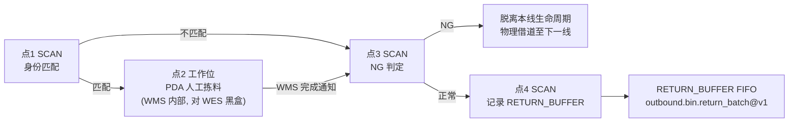

# WMS / WES 人工出库拣料交互要求

## 1. 文档定位

本文是 Phase 12 人工出库拣料线（现场编号 Line3）的联合评审基线，只定义**人工出库线相对自动出库线唯一的差异点**：
工作位（点2）任务由人工经 PDA 完成，而不是由机械臂执行 `PICK_AND_PUT`。

本文不是一份独立合同。人工出库线的任务下发、资源计算、货架搬运、料箱投料、扫码身份匹配、退料回库，
与
[`wms-outbound-picking-task-integration-requirements.md`](wms-outbound-picking-task-integration-requirements.md)（下称"出库合同"）
定义的自动出库场景完全一致，直接复用其 operation 闭集，不重复定义、不建立第二套字段表达。

系统尚未发布。本文不提供旧接口、兼容字段或新旧路径并存。

## 2. 与出库合同的边界

### 2.1 复用出库合同的部分（零新增）

- 任务发布与队列：`outbound.picking_task.issued@v1`、`outbound.picking_task.queue_changed@v1`；
- 任务准备与计划增量：`outbound.picking_task.prepare@v1`、`outbound.picking_task.plan_delta@v1`；
- 五层货架入站分批：`outbound.bin.inbound_batch@v1`；
- 退箱：`outbound.bin.return_batch@v1`，`RETURN_BUFFER` FIFO；
- 货架离场：`outbound.rack.departure_decide@v1`；
- 任务状态确认：`outbound.picking_task.completion_confirm@v1`；
- Transport 四个通用搬运方法（`move_rack` / `rotate_rack` / `move_bins` / `exchange_bins`）与其提交、回调合同；
- `BinExecution`、`PositionProjection` 等既有执行域对象与不变量。

上述接口的字段、条件必填、响应联合、错误码、幂等和重试语义完全以出库合同为准，本文不重复摘录，也不允许出现与出库合同
不一致的实现。

### 2.2 人工出库线独有的部分（本文新增）

- 工作位（点2）任务由人工经 PDA 完成，PDA 是 WMS 侧功能，不在 WES 集成范围内（详见第 4 节）；
- WMS 向 WES 上报工作位任务完成结果的新 operation：`outbound.manual_bin.work_completed@v1`（详见第 5 节）；
- 人工出库线不使用出库合同 `outbound.bin.work_plan@v1`：工作位任务的可执行范围（拣哪些 Cell）完全由 WMS/PDA
  内部决定，WES 不查询、不持有、不校验该范围。

## 3. 现场物理拓扑

一条自动出库产线的滚筒线上有 4 个扫码工位，依次记为点1～点4（现场设备编码 `STATION_SCANn ~ STATION_SCAN(n+3)`，
具体编号由部署配置提供，不在本文固定）。人工出库线在物理构造上与自动线相同，唯一差异是点2旁挂一个人工工作位，
由工人持 PDA 完成拣料，取代自动线上目标机械臂的 `PICK_AND_PUT`。



### 3.1 点1：身份匹配

料箱到达点1后，WES 比对本地已冻结的 `BIN_MOVE` 目标 `bin_id`（由 `outbound.bin.inbound_batch@v1` → `move_bins()`
链路创建，见出库合同 §9.2.1）：

| 扫码结果 | WES 动作 |
| --- | --- |
| 身份匹配当前冻结目标 | 下发 `MOVE_RIGHT`，料箱转入点2工作位 |
| 身份不匹配（含条码不可读/异常、其他线借道路过、任何非本线任务） | 下发 `MOVE_FORWARD`，料箱直接流向点3，不做二次判断 |

条码读不出或识别异常本身即视为 NG（见第 6 节），与"不匹配"走同一物理路径，点1不需要为其单独判断或记录。

### 3.2 点2：人工工作位（PDA，对 WES 黑盒）

料箱进入点2后，工人通过 PDA 完成拣料操作。PDA 的呼叫、Cell 分配、拣料确认等内部流程完全由 WMS 负责，
WES 不集成、不查询、不持有其中任何字段（对照 §2.2）。

WES 在点2的唯一职责是：

1. 把身份匹配的料箱送入点2（点1的动作）；
2. 等待 WMS 发送工作位任务完成通知（第 5 节）；
3. 收到通知后，下发 `MOVE_FORWARD` 把料箱送回主线到点3，并将通知携带的业务结果按料箱身份暂存，供点3读取。

### 3.3 点3：NG 判定

点3只判断一件事：这个料箱是否携带 NG 结果。

| 情形 | NG 结果来源 | 点3动作 |
| --- | --- | --- |
| 经过点2（本线任务） | 第 5 节通知 payload 里的业务结果 | 结果为 NG → `MOVE_LEFT`；结果为 NORMAL → `MOVE_FORWARD` |
| 未经过点2（点1判定不匹配、含条码异常/借道路过） | 视为 NG（见第 6 节） | `MOVE_LEFT` |

一旦料箱在点1（条码异常）或点3（NG 结果）被判定 NG，其工作线生命周期立即终结：WES 不再为其创建或更新任何执行记录，
不产生新的 WMS 业务交互，后续只是物理搬运（借道至下一线，最终到达现场 `NGZone`，由人工处理）。

### 3.4 点4：记录退料队列

点4不做任何判断，只把经过的正常料箱计入本 Epoch 的 `RETURN_BUFFER` FIFO 队尾。WES 按出库合同 §9.2.2 从队首取候选，
调用 `outbound.bin.return_batch@v1` 请求目标货架，创建 `move_bins()` 搬回货架。

## 4. PDA 边界声明

PDA（人工拣料操作终端）是 WMS 侧功能，不属于 WES 集成范围：

- WES 不向 PDA 发送任何请求，也不接收 PDA 的直接回调；
- WES 不知道、也不需要知道点2内部具体拣了哪个 Cell、拣了几次、耗时多久；
- WES 与人工拣料结果的唯一交互点是第 5 节定义的完成通知。

本文对照 [`wes-wms-interface-requirements.md`](../integration/wes-wms-interface-requirements.md) §6「不提供 PDA、
打印和未批准的人工业务接口」这条既有边界：本文不违反该边界，因为 WES 侧确实不提供、不消费任何 PDA 接口，
PDA 全部内部逻辑归属 WMS。

## 5. 新增 operation：工作位任务完成通知

### 5.1 `outbound.manual_bin.work_completed@v1`

| 项 | 值 |
| --- | --- |
| 方向 | WMS 到 WES |
| 端点 | `POST {{WES_BASE_URL}}/api/v1/wms/events` |
| 触发条件 | 点2工作位的人工拣料任务（含 PDA 内部流程）已经形成确定结果 |
| 首次成功响应 | `202 / RECEIVED` |

请求信封复用出库合同公共信封（`operation_id + operation + timestamp + data`），`data` 字段草案：

```json
{
  "operation_id": "<uuid7>",
  "operation": "outbound.manual_bin.work_completed@v1",
  "timestamp": 1788390000000,
  "data": {
    "task_id": "PICK-20260902-001",
    "bin_id": "BIN-001",
    "result": "NORMAL",
    "reason_code": null,
    "completed_at": 1788389999000
  }
}
```

| 字段 | 必填 | 说明 |
| --- | --- | --- |
| `data.task_id` | 是 | 当前 PickingTask，来自出库合同既有身份 |
| `data.bin_id` | 是 | 完成任务的料箱身份，必须命中当前任务某次 `inbound_batch` 已返回的 Bin |
| `data.result` | 是 | `NORMAL \| NG`；本线点3判定去向的唯一依据 |
| `data.reason_code` | 条件 | `result=NG` 时是否必填、允许哪些取值，**待联合评审**（见第 7 节确认项 C2） |
| `data.completed_at` | 是 | 人工拣料任务确定完成的时间，UTC Unix 毫秒 |

WES 收到后先持久化（先持久化再 ACK，遵循出库合同公共协议既有规则），再按 `bin_id` 暂存 `result`，供该料箱到达点3时读取。

### 5.2 待联合评审事项

`outbound.manual_bin.work_completed@v1` 是本文唯一新增的 operation，其严格 DTO、幂等、重复提交处理和错误响应联合
未在本文冻结，需按出库合同 §4 的公共信封规则参照补齐，并纳入第 7 节确认项。

## 6. 明确非目标

- WES 不集成 PDA 的任何接口（第 4 节）；
- WES 不为人工出库线单独定义 `work_plan` 等价 operation：工作位可执行范围完全是 WMS/PDA 内部决定；
- WES 不维护跨 WorkLine 的料箱 NG 状态查询或同步机制：NG 判定后料箱工作线生命周期立即终结，不存在"跨线读取上一线 NG 状态"的需求；
- 本文不定义 NG 料箱到达 `NGZone` 后的上报 operation：现场共识是 NG 判定即终结 WES 业务生命周期，后续物理处置和 NGZone
  接收由人工处理，不产生 WMS/WES 交互；
- 不新增第二套 Transport、Device、Evidence、Confirmation 或插件 runtime；
- 不复用出库合同以外的其它业务字段表达；
- 不提供旧接口、兼容字段或数据迁移。

## 7. 正式实施前确认项

| ID | 确认项 | 主要责任方 | 状态 |
| --- | --- | --- | --- |
| C1 | WMS、WES 联合审批本文，状态由 `ReviewRequired` 变为 `Approved` | 联合 | PENDING |
| C2 | 冻结 `outbound.manual_bin.work_completed@v1` 完整严格 DTO：`reason_code` 闭集、幂等身份、重复提交处理、错误响应联合 | WMS、WES | PENDING |
| C3 | 确认现场扫码设备（`STATION_SCAN*`）条码不可读/异常事件的具体载荷形态，供点1/点3实现引用 | ECS、WES | PENDING |
| C4 | 确认人工出库线现场设备编码与四个扫码点位的绑定关系（部署配置，不写入本文业务字段） | WES、现场 | PENDING |
| C5 | 确认 NGZone 现场人工处理 SOP，与本文"NG 判定即终结工作线生命周期"的边界衔接 | 现场、WMS | PENDING |

只有 C1～C5 全部为 `APPROVED`，本文才构成代码实施授权。
