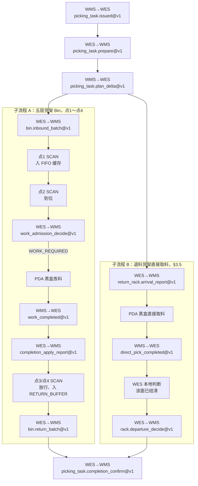
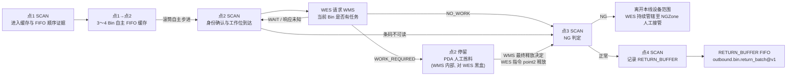

# WMS / WES 人工出库拣料交互要求 {#wms-wes}

## 1\. 文档定位 {#1}

本文是 Phase 12 人工出库拣料线（现场编号 Line3）的联合评审基线，只定义**人工出库线相对自动出库线的差异点**：
工作位（点2）Bin/Cell 拣料，以及退料货架直接取料，均由人工经 PDA 完成，而不是由机械臂执行 `PICK_AND_PUT`。

本文不是一份独立合同。人工出库线的任务下发、资源计算、货架搬运、料箱投料、扫码与位置事实、退料回库，
与
[`wms-outbound-picking-task-integration-requirements.md`](wms-outbound-picking-task-integration-requirements.md)（下称“出库合同”）
定义的自动出库场景完全一致。本文只增加人工线的 point2 任务准入、最终释放决定、应用结果报告，以及退料货架直接取料完成通知
四个 operation（详见第 5 节），不建立第二套通用字段表达。

系统尚未发布。本文不提供旧接口、兼容字段或新旧路径并存。

### 1\.1 一次任务的端到端示例（模拟数据） {#11-e2e-example}

本节用一个模拟任务，把第 2～6 节涉及的全部 operation 按时间顺序串成一条线，方便第一次读这份合同的人先建立整体画面，再去查各节的严格字段定义。示例里的 `task_id`、`bin_code`、`rack_id` 与第 5 节的 JSON 示例是同一套编号，两边可以对照阅读。

任务 `PICK-20260902-001`（`task_type=MANUAL`）同时包含两类来源：五层货架 `RACK-5F-001`（Bin `BIN-001`，走传送带点1～点4）和退料货架 `RETURN-RACK-01`（精确储位 `A-03`，走 §3.5 的直接取料路径）。两条子流程物理上并行、互不阻塞，最终都汇入转运货架 `TRANSFER-RACK-01`。



**任务下发与计划**

| \# | 发起方 → 接收方 | Operation | 关键字段 | 结果 |
| --- | --- | --- | --- | --- |
| 1 | WMS → WES | `outbound.picking_task.issued@v1` | `task_id=PICK-20260902-001` | `202/RECEIVED` |
| 2 | WES → WMS | `outbound.picking_task.prepare@v1` | 选中该任务和 WorkLine `LINE3` | `202/PREPARE_ACCEPTED` |
| 3 | WMS → WES | `outbound.picking_task.plan_delta@v1`（revision 1） | `target_rack=TRANSFER-RACK-01/A`；`added_bin_source_racks=[RACK-5F-001/A]`；`added_direct_picks=[RETURN-RACK-01/A/A-03]` | `202/RECEIVED` |

**子流程 A：五层货架 Bin，走点1～点4（§3.1～§3.4）**

| \# | 发起方 → 接收方 | Operation / 事件 | 关键字段 | 结果 |
| --- | --- | --- | --- | --- |
| 4A | WES → WMS | `outbound.bin.inbound_batch@v1` | `rack_id=RACK-5F-001, rack_face=A` | `READY`，`bin_code=BIN-001` |
| 5A | 设备 → WES | 点1 SCAN | `BIN-001` 进入点1→点2 FIFO 缓存 | 保存 FIFO 顺序 |
| 6A | 设备 → WES | 点2 SCAN | `BIN-001` 到达工作位 | 保存到位事实 |
| 7A | WES → WMS | `outbound.manual_bin.work_admission_decide@v1` | `bin_code=BIN-001`，`scanned_at=1788389899900` | `WORK_REQUIRED`，`task_id=PICK-20260902-001` |
| — | PDA（黑盒） | 人工按 WMS 指示拣料 | 具体拣了哪个 Cell，WES 不知道、不查询 | — |
| 8A | WMS → WES | `outbound.manual_bin.work_completed@v1` | `task_id + bin_code=BIN-001`，`result=NORMAL`，`completed_at=1788389999000` | `202/RECEIVED` |
| 9A | WES → WMS | `outbound.manual_bin.completion_apply_report@v1` | `apply_result=APPLIED` | `200/RECORDED`，point2 下发 `MOVE_FORWARD` |
| 10A | 设备 → WES | 点3 SCAN | `NORMAL` | `MOVE_FORWARD`，放行 |
| 11A | 设备 → WES | 点4 SCAN | 计入 `RETURN_BUFFER` | 入队尾 |
| 12A | WES → WMS | `outbound.bin.return_batch@v1` | `BIN-001` 从队首取出 | `READY`，搬回五层货架 |

**子流程 B：退料货架直接取料，与 A 并行（§3.5）**

| \# | 发起方 → 接收方 | Operation | 关键字段 | 结果 |
| --- | --- | --- | --- | --- |
| 4B | WES → WMS | `outbound.return_rack.arrival_report@v1` | `RETURN-RACK-01` 到达工作位 | `200/RECORDED` |
| — | PDA（黑盒） | 人工按 `added_direct_picks[]` 取 `A-03` 放至 `TRANSFER-RACK-01` | WES 不下发 DeviceCommand，不知道具体取货细节 | — |
| 5B | WMS → WES | `outbound.manual_rack.direct_pick_completed@v1` | `task_id=PICK-20260902-001, rack_id=RETURN-RACK-01, rack_face=A`，`completed_at=1788390099000` | `202/RECEIVED` |
| 6B | WES（本地判断） | 该面 `added_direct_picks[]` 已全部结清，无其它未结明细 | — | 满足 `outbound.rack.departure_decide@v1` 的发起条件 |
| 7B | WES → WMS | `outbound.rack.departure_decide@v1` | `rack_id=RETURN-RACK-01` | `READY`，货架搬离工作位 |

**任务收尾**

| \# | 发起方 → 接收方 | Operation | 关键字段 | 结果 |
| --- | --- | --- | --- | --- |
| 13 | WES → WMS | `outbound.picking_task.completion_confirm@v1` | 子流程 A、B 及转运货架清点均满足本地完成前提 | `COMPLETED` |

**变体（NG）**：若人工在 point2 判定 `BIN-001` 不合格，第 8A 步的 `work_completed@v1` 改为 `result=NG`；WES 应用后仍创建唯一 point2 释放命令，但第 10A 步 point3 按 §3.3 的表格走 `MOVE_LEFT`，该 Bin 不进入 `RETURN_BUFFER`（不影响子流程 B）。

四个新增 operation（`work_admission_decide`、`work_completed`、`completion_apply_report`、`direct_pick_completed`）的严格字段定义在第 5 节；本节只负责把顺序和因果关系讲清楚，不重复摘录字段表。

## 2\. 与出库合同的边界 {#2}

### 2\.1 复用出库合同的部分（零新增） {#21}

- 任务发布与队列：`outbound.picking_task.issued@v1`、`outbound.picking_task.queue_changed@v1`；
  人工任务使用同一个 PickingTask 实体和队列，发布时固定 `data.task_type=MANUAL`，不建立人工任务表或人工任务业务键；
- 任务准备与计划增量：`outbound.picking_task.prepare@v1`、`outbound.picking_task.plan_delta@v1`（含 `added_direct_picks[]`
  退料货架直接取料明细与 `added_bin_source_racks[]` 五层货架来源面；人工任务与自动任务字段零差异，人工线两类来源均可能出现）；
- 退料货架到位事实：`outbound.return_rack.arrival_report@v1`；WMS/RCS 的通用 Transport 结果由 WES 业务模块识别后，复用同一事实
  上报更新当前 PickingTask 的退料货架到位状态；
- 五层货架入站分批：`outbound.bin.inbound_batch@v1`；
- 退箱：`outbound.bin.return_batch@v1`，`RETURN_BUFFER` FIFO；
- 货架离场：`outbound.rack.departure_decide@v1`；
- 任务状态确认：`outbound.picking_task.completion_confirm@v1`；
- Transport 四个通用搬运方法（`move_rack` / `rotate_rack` / `move_bins` / `exchange_bins`）与其提交、回调合同；
- WorkLine 准入、`PositionProjection` 等基础能力与不变量；
- `WmsConfirmation` 的可靠派发、重试和结果证据；其中立关联一次收敛为料盘、PickingTask 或 WorkLine 恰好一个，不新增第二套 outbox。

上述接口的字段、条件必填、响应联合、错误码、幂等和重试语义完全以出库合同为准，本文不重复摘录，也不允许出现与出库合同
不一致的实现。

### 2\.2 人工出库线独有的部分（本文新增） {#22}

- 工作位（点2）任务由人工经 PDA 完成，PDA 是 WMS 侧功能，不在 WES 集成范围内（详见第 4 节）；
- point2 扫描实际 Bin 后，WES 向 WMS 请求是否存在人工任务的新 operation：
  `outbound.manual_bin.work_admission_decide@v1`（详见第 5 节）；
- WMS 在原子持久化 PDA 子任务和业务结果后，向 WES 上报 Bin 级最终释放决定的新 operation：
  `outbound.manual_bin.work_completed@v1`（详见第 5 节）；
- WES 把完成决定的异步应用结果可靠上报 WMS：`outbound.manual_bin.completion_apply_report@v1`（详见第 5 节）；
- 退料货架直接取料同样由 PDA 完成；WMS 用新 operation `outbound.manual_rack.direct_pick_completed@v1`
  上报面级完成事实（详见 §3.5、第 5.5 节）；
- 人工出库线不使用出库合同 `outbound.bin.work_plan@v1`：工作位任务的可执行范围（拣哪些 Cell）完全由 WMS/PDA
  内部决定，WES 不查询、不持有、不校验该范围。

## 3\. 现场物理拓扑 {#3}

一条自动出库产线的滚筒线上有 4 个扫码工位，依次记为点1～点4（现场设备编码 `STATION_SCANn ~ STATION_SCAN(n+3)`，
具体编号由部署配置提供，不在本文固定）。点1与点2之间是可容纳 3～4 个料箱的单向 FIFO 滚筒缓存；料箱经过点1后由
ECS/PLC 控制滚筒线自主步进到点2，WES 不为每个料箱下发从点1进入点2的方向命令。人工出库线在物理构造上与自动线相同，
唯一差异是点2旁挂一个人工工作位，由工人持 PDA 完成拣料，取代自动线上目标机械臂的 `PICK_AND_PUT`。



### 3\.1 点1与上游缓存：进入证据和 FIFO 顺序 {#31-1-fifo}

料箱到达点1后，WES 只保存进入本线缓存的设备证据，并按可靠到达顺序冻结点1至点2缓存中的 FIFO 身份顺序。point1 的
扫码结果不表示料箱已经到达人工工作位，也不触发 WES 下发 `MOVE_RIGHT` 或其它逐箱推进命令。滚筒线在 ECS/PLC 的容量和
安全互锁下自主步进；点2释放当前料箱后，FIFO 队首自动补位。

WES 对上游供箱只按已确认的缓存容量、FIFO 顺序和出库合同的准入条件控制；不以软件中的 point2 占用锁代替 ECS/PLC 的滚筒
步进和防撞互锁。缓存已满、顺序或位置不确定时停止新料箱入线，但不干预已经进入缓存的自主 FIFO 推进。

### 3\.2 点2：人工工作位（PDA，对 WES 黑盒） {#32-2pda-wes}

FIFO 队首自动进入 point2 后，point2 SCAN 设备扫码并由 ECS 上报 WES。该扫码和到位证据是当前实际料箱身份及“已到人工工作位”的
权威事实；point1 证据不能替代它。WES 不把扫码 Bin 与计划中的预期 Bin 做错箱比较，只使用实际 `bin_code` 请求 WMS 判断当前是否
存在人工任务。PDA 的呼叫、Cell 分配、拣料确认等内部流程完全由 WMS 负责，WES 不集成、不查询、不持有其中任何字段（对照 §2.2）。

WES 在点2的唯一职责是：

1. 接收并保存 point2 实际扫码和到位事实；
2. 调用 `outbound.manual_bin.work_admission_decide@v1` 请求 WMS 判断当前 `bin_code` 是否有任务；
3. `WORK_REQUIRED` 时保存 WMS 返回的 `task_id`，保持料箱停留并等待 Bin 级最终释放决定；`NO_WORK` 时把该 Bin 标记为正常直通并
   创建 point2 释放命令；`WAIT` 或响应未知时保持 point2 占用并按第 5 节重试；
4. 收到 `WORK_REQUIRED` 对应的完成决定后，把业务结果和释放权限原子绑定到当前 WorkLine 内正在 point2 等待的唯一
   `task_id + bin_code`；绑定成功后才向 point2
   下发 `MOVE_FORWARD` 释放当前料箱。料箱由滚筒线自动流向点3，后一个料箱自动进入 point2 并重新触发扫码上报。

point2 条码不可读时保留当前工位待处理动作与不可读证据，按确定 Bin NG 路径释放至 point3；不得请求 WMS 任务准入。合法且
可识别的任意实际 `bin_code` 都交由 WMS 返回 `WORK_REQUIRED | NO_WORK | WAIT`，本插件不建立错箱分支。

### 3\.3 点3：NG 判定 {#33-3ng}

point3 读取与当前物理到位关联的已保存处置决定。point2 到 point3 的承接必须由设备合同已确认的移交关联或可靠物理队列证明，
不能凭该条码历史结果或预期条码猜测当前料箱。不可读码也必须能关联本次待处理动作；无法证明对应关系时停止自动推进并保存拒绝证据，
不创建默认方向命令。该设备关联合同是人工线激活的前置条件，具体字段在插件实施前冻结。

| 当前处置 | 决定来源 | point3 动作 |
| --- | --- | --- |
| point2 `WORK_REQUIRED` 且人工任务完成 | 与当前待处理动作匹配的 WMS 完成结果 | NG → `MOVE_LEFT`；NORMAL → `MOVE_FORWARD` |
| point2 `NO_WORK` 正常直通 | 当前任务准入决定 | `MOVE_FORWARD` |
| point2 条码不可读且未进入人工业务 | 本次不可读码证据及已保存 NG 决定；实际 bin\_code 可空 | `MOVE_LEFT` |
| 当前到位无法关联已有处置，或关联后仍无确定结果 | 原始事件和关联检查结果 | 停止自动推进并进入 `RECONCILING`，零命令 |

料箱 NG 作为独立分支保存实际原因、实际扫码、原决定与命令关联，不填充预期条码冒充实际码。
插件通过 DeviceCommand 完成必要分流，不发送 NG 出口报告，不等待 WMS 人工处理完成。正常业务结束不删除有效位置或解除未决物理动作。
匹配的权威离位/释放事实解除当前工位等待，同箱后续合法到位才建立新的处理关联。

### 3\.4 点4：记录退料队列 {#34-4}

点4不做任何判断，只把经过的正常料箱计入本 WorkLine 的 `RETURN_BUFFER` FIFO 队尾。WES 按出库合同 §9.2.2 从队首取候选，
调用 `outbound.bin.return_batch@v1` 请求目标货架，创建 `move_bins()` 搬回货架。

### 3\.5 退料货架直接取料 {#35-direct-pick}

退料货架直接取料是人工出库线的第二条物理路径，完全独立于 §3.1～§3.4 的传送带（点1～点4），不经过任何 SCAN 设备。
货架搬运和到位复用出库合同 §9.1（`outbound.return_rack.arrival_report@v1`，零改动）；差异只在取货动作本身：
自动线由机械臂执行 `PICK_AND_PUT` 并通过 DeviceCommand 结果自证完成，人工线由工人持 PDA 直接取货放至转运货架，
对 WES 是黑盒（对照 §4）。WES 因此没有本地信号判断货架面是否取完，需要 §5.5 新增的完成通知才能继续既有的
`outbound.rack.departure_decide@v1` 换面/退场判断。

## 4\. PDA 边界声明 {#4-pda}

PDA（人工拣料操作终端）是 WMS 侧功能，不属于 WES 集成范围：

- WES 不向 PDA 发送任何请求，也不接收 PDA 的直接回调；
- WES 不知道、也不需要知道点2内部具体拣了哪个 Cell、拣了几次、耗时多久；
- WES 与人工拣料结果的唯一交互点是第 5 节定义的完成通知。

本文对照 [`wes-wms-interface-requirements.md`](../integration/wes-wms-interface-requirements.md) §6「不提供 PDA、
打印和未批准的人工业务接口」这条既有边界：本文不违反该边界，因为 WES 侧确实不提供、不消费任何 PDA 接口，
PDA 全部内部逻辑归属 WMS。

## 5\. 新增 operations：任务准入、完成释放、应用结果与退料货架完成通知 {#5-operations}

### 5\.1 `outbound.manual_bin.work_admission_decide@v1` {#51-outboundmanual_binwork_admission_decidev1}

| 项 | 值 |
| --- | --- |
| 方向 | WES 到 WMS |
| 端点 | `POST {{WMS_BASE_URL}}/api/v1/wes/decisions` |
| 触发条件 | point2 SCAN 和到位证据已可靠保存，且读取到合法实际 `bin_code` |
| 成功响应 | `200 / DECIDED` |

请求信封复用出库合同公共信封（`operation_id + operation + timestamp + data`）：

```json
{
  "operation_id": "<uuid7>",
  "operation": "outbound.manual_bin.work_admission_decide@v1",
  "timestamp": 1788389900000,
  "data": {
    "bin_code": "BIN-001",
    "scanned_at": 1788389899900
  }
}
```

| 字段 | 必填 | 类型/格式 | 说明 |
| --- | --- | --- | --- |
| `data.bin_code` | 是 | 出库合同 Identifier | point2 SCAN 读取的当前实际料箱；WES 不发送预期 Bin，也不在本地做错箱比较 |
| `data.scanned_at` | 是 | positive integer / UTC Unix 毫秒 | point2 有效扫码和到位事实的设备发生时间；不得晚于信封 `timestamp` |

`data` 读取上述两个必填字段，忽略冗余字段；Identifier、已定义字段的 `null`、空字符串、错误类型和时间约束复用出库合同的规则。条码不可读时
禁止发送请求，按 §3.2 的 Bin NG 路径处理。

`200 / DECIDED` 的 `data` 是严格联合：

| `data.result` | 必填字段 | 接收时忽略字段 | WES 动作 |
| --- | --- | --- | --- |
| `WORK_REQUIRED` | `task_id` | `retry_after_ms` | 原子保存当前 `bin_code + task_id` 关联，保持 point2 占用并允许 WMS/PDA 开始人工操作 |
| `NO_WORK` | 无 | `task_id`、`retry_after_ms` | 原子保存正常直通决定并创建唯一 point2 释放命令 |
| `WAIT` | `retry_after_ms` | `task_id` | 当前料箱停留 point2；到期或新业务事件唤醒后使用新 `operation_id` 重求值 |

`task_id` 复用出库合同 Identifier；`retry_after_ms` 复用出库合同正整数边界。WMS 根据其业务主账判断实际 Bin 当前是否有任务；
WES 不查询 Cell、不验证预期 Bin，也不把 `NO_WORK` 解释为 NG。

原 `operation_id` 和原请求重放必须返回首次完整响应。同 ID 内容漂移返回 `409 / CONFLICT`；响应未知或
`503 / UNAVAILABLE` 时，WES 保持当前 Bin、point2 占用和原 operation identity 重试，不以新 ID 猜测结果。只有已收到并可靠保存
`WORK_REQUIRED | NO_WORK | WAIT` 才能推进相应状态；HTTP 响应本身不表示任何设备动作已发生。

### 5\.2 `outbound.manual_bin.work_completed@v1` {#52-outboundmanual_binwork_completedv1}

| 项 | 值 |
| --- | --- |
| 方向 | WMS 到 WES |
| 端点 | `POST {{WES_BASE_URL}}/api/v1/wms/events` |
| 触发条件 | WMS 已在同一持久化事务中提交该 Bin 相关的 PDA 子任务和业务结果，并形成 Bin 级最终释放决定 |
| 首次成功响应 | `202 / RECEIVED` |
| `ack_mode` | `EVIDENCE_ACCEPTED` |
| `ack_commit_facts` | 完成释放决定的 `InboundEvidence` 及消息接收身份；不包含插件工位等待或任务结果的业务应用 |

ACK 模式遵循[公共回调合同](wms-async-callback-envelope-contract.md#6-每个业务-operation-还要说明什么)，业务应用仍按下述异步流程完成。

请求信封复用出库合同公共信封（`operation_id + operation + timestamp + data`），`data` 严格字段如下：

```json
{
  "operation_id": "<uuid7>",
  "operation": "outbound.manual_bin.work_completed@v1",
  "timestamp": 1788390000000,
  "data": {
    "task_id": "PICK-20260902-001",
    "bin_code": "BIN-001",
    "result": "NORMAL",
    "completed_at": 1788389999000
  }
}
```

| 字段 | 必填 | 类型/格式 | 说明 |
| --- | --- | --- | --- |
| `data.task_id` | 是 | 出库合同 Identifier | 必须等于 point2 `WORK_REQUIRED` 响应冻结的 PickingTask |
| `data.bin_code` | 是 | 出库合同 Identifier | 必须等于该 `WORK_REQUIRED` 请求中的实际扫码 Bin；应用时还必须命中当前 WorkLine 内正在 point2 等待的同一 task 和料箱 |
| `data.result` | 是 | enum | `NORMAL \| NG`；`NORMAL` 授权离开点2进入正常回库路径，`NG` 授权离开点2进入 NG 路径 |
| `data.completed_at` | 是 | positive integer / UTC Unix 毫秒 | 人工拣料任务形成最终决定的时间；不得早于该 Bin 的 point2 `work_admission.scanned_at`，也不得晚于同一信封的 `timestamp` |

`data` 读取上述四个必填字段，忽略冗余字段；已定义字段不接受非法 `null`、空字符串、错误类型或枚举外取值。`task_id` 和
`bin_code` 复用出库合同 §4.4 的 `[A-Za-z0-9][A-Za-z0-9._:/-]{0,99}` 约束，不得为人工线放宽或定义别名。
`completed_at` 必须保存到第 9.1 节的 per\-Bin 最终结果记录，只用于审计和对账；不得用远端业务时间决定消息处理顺序、
DeviceCommand deadline 或自动超时。

WES 收到后先把原始消息持久化为 `InboundEvidence`，再按出库合同公共协议 ACK。全局唯一的 `operation_id` 是消息重试身份，完整
请求内容用于检测同一 ID 的内容冲突；
`task_id + bin_code` 是本 operation 的业务终态身份，同一业务身份只能形成一个最终结果，后到消息不得覆盖。

`work_completed` 同时表示业务完成和物理释放授权，不是“PDA 步骤已操作”的进度通知。WMS 不得在相关子任务与业务
结果持久化事务提交前发送该消息。WES 返回 `202 / RECEIVED` 只证明 evidence 已可靠接收，不证明料箱已移动；只有该决定成功
应用到当前点2的活动执行时，WES 才能创建放行设备命令。

WES 可靠保存 `WORK_REQUIRED` 后，以部署配置的人工处理 SLA 监测完成通知等待时间。超过阈值只触发告警并
停止新料箱进入本线；当前 Bin 保持 `WAITING_EXTERNAL`、point2 占用和原待处理动作，已进入点1至点2缓存的料箱保持原 FIFO
顺序。超时不得自动释放、改判 NG、关闭执行或创建新命令身份。收到可关联的完成通知后仍按同一执行继续处理。

WMS 的内部人工拣料原因不跨系统传输；`result=NG` 已是本 operation 的完整业务决定。WES 将该决定持久化为人工拣料 NG
证据，原因记为 `MANUAL_PICK_NG`，由独立 NG 分支执行设备分流。

应用 evidence 时，人工业务模块必须先按 `(task_id, bin_code)` 查询既有最终结果。若相同 `result` 已成功应用，新 evidence 直接标记为
已应用的业务幂等 no\-op，不再检查料箱是否仍在 point2，也不再创建设备命令；若既有结果不同，则 evidence 与受影响执行进入
`RECONCILING`。只有尚无最终结果的首次应用才继续在同一事务中锁定 WorkLine 生命周期、当前 point2 待处理动作及位置，确认
其 `task_id + bin_code` 与消息一致且仍在等待 WMS 结果，验证通过后保存结果并创建设备命令。首次消息早到或晚到、找不到唯一当前
等待、料箱不在 point2 或 WorkLine 已停用时进入 `RECONCILING`，不得暂存后自动补绑，也不得下发默认方向命令。

### 5\.3 完成通知的接收、重试与应用边界 {#53}

`outbound.manual_bin.work_completed@v1` 复用出库合同 §4 的公共接收语义：

| 情形 | HTTP / `code` | 处理 |
| --- | --- | --- |
| 新 `operation_id` 且严格 DTO 合法 | `202 / RECEIVED` | 可靠持久化 evidence；不表示业务已应用或料箱已移动 |
| 原 `operation_id` 和完整请求重放 | `200 / DUPLICATE` | 返回第一次响应的 `timestamp + data` |
| 原 `operation_id`、但完整请求不同 | `409 / CONFLICT` | `data.reason_code=IDEMPOTENCY_CONFLICT` |
| 严格 DTO 或公共信封不合法 | 出库合同 §4 的 `400 / 413 / 422` 联合 | 不进入业务应用 |
| 当前无法可靠持久化 | `503 / UNAVAILABLE` | WMS 使用原 `operation_id` 和原请求重试 |

共享 HTTP 入口不读取人工线当前工位或任务等待来同步判定业务冲突。换新 `operation_id` 的合法消息仍先返回
`202 / RECEIVED`；`task_id + bin_code` 单终态和当前执行状态由人工业务模块在异步应用 evidence 时判定。

### 5\.4 `outbound.manual_bin.completion_apply_report@v1` {#54-outboundmanual_bincompletion_apply_reportv1}

| 项 | 值 |
| --- | --- |
| 方向 | WES 到 WMS |
| 端点 | `POST {{WMS_BASE_URL}}/api/v1/wes/facts` |
| 触发条件 | 一条 `work_completed@v1` 或 `direct_pick_completed@v1`（详见第 5.5 节）evidence 首次进入 `APPLIED` 或 |
| `RECONCILING`，以及后续人工对账使状态发生确定变化 | {} |
| 首次成功响应 | `200 / RECORDED` |

`data` 是严格条件联合：

| 字段 | `APPLIED` | `RECONCILING` | 说明 |
| --- | --- | --- | --- |
| `completion_operation_id` | 必填 | 必填 | 触发本次应用的原 operation\_id（`outbound.manual_bin.work_completed@v1` |
| 或 `outbound.manual_rack.direct_pick_completed@v1`） | {} | {} | {} |
| `task_id` / `bin_code` | 必填 | 必填 | 原完成决定的业务身份；`direct_pick_completed@v1` 触发时 `bin_code` 字段留空， |
| 改用该决定的 `rack_id + rack_face` | {} | {} | {} |
| `apply_revision` | 必填 | 必填 | 从 1 开始严格递增的应用状态修订 |
| `apply_result` | `APPLIED` | `RECONCILING` | 本次确定应用状态 |
| `reason_code` | 发送方不携带；接收方忽略 | 必填 | `RESULT_CONFLICT \| FIRST_COMPLETION_OUT_OF_WINDOW \| POINT2_BINDING_MISMATCH \| WORKLINE_NOT_ACTIVE \| COMPLETED_AT_INVALID \| DEVICE_COMMAND_IDENTITY_CONFLICT` |
| `occurred_at` | 必填 | 必填 | WES 形成该应用状态的 UTC Unix 毫秒时间，不晚于信封 `timestamp` |

`APPLIED` 只证明最终结果已持久化（Bin 场景下还包括 point2 释放 DeviceCommand 已在同一事务创建），不证明命令已发送、
ECS 已接纳或物理动作已完成。`RECONCILING` 不撤销 WMS 已形成的业务结果，也不授权 WMS 重发不同结果或 WES 换身份重创命令；
双方按相同 `completion_operation_id` 对账。人工对账形成后续确定状态时使用新的 operation identity 和下一连续
`apply_revision` 上报，不得覆盖历史修订或跳号。

每个报告修订使用稳定 `operation_id` 可靠发送；响应未知或 `503 / UNAVAILABLE` 时使用原 ID 和原内容重试。WMS 对同一报告 ID
同内容返回 `DUPLICATE`、内容漂移返回 `409 / CONFLICT`，并按 `completion_operation_id + apply_revision` 原子保存状态和告警。

### 5\.5 `outbound.manual_rack.direct_pick_completed@v1` {#55-outboundmanual_rackdirect_pick_completedv1}

| 项 | 值 |
| --- | --- |
| 方向 | WMS 到 WES |
| 端点 | `POST {{WES_BASE_URL}}/api/v1/wms/events` |
| 触发条件 | WMS 已确认某 PickingTask 在指定退料货架面上的全部 `added_direct_picks[]` 人工直接取料完成 |
| 首次成功响应 | `202 / RECEIVED` |
| `ack_mode` | `EVIDENCE_ACCEPTED` |
| `ack_commit_facts` | 本次完成事实的 `InboundEvidence` 及消息接收身份；不包含插件对货架面本地明细的业务应用 |

ACK 模式与接收、重试、幂等语义与 §5.2～§5.3 一致，复用同一公共入口和 `WmsConfirmation` 生命周期，不新增第二套
Evidence/Confirmation。

请求信封复用出库合同公共信封（`operation_id + operation + timestamp + data`），`data` 严格字段如下：

```json
{
  "operation_id": "<uuid7>",
  "operation": "outbound.manual_rack.direct_pick_completed@v1",
  "timestamp": 1788390100000,
  "data": {
    "task_id": "PICK-20260902-001",
    "rack_id": "RETURN-RACK-01",
    "rack_face": "A",
    "completed_at": 1788390099000
  }
}
```

| 字段 | 必填 | 类型/格式 | 说明 |
| --- | --- | --- | --- |
| `data.task_id` | 是 | 出库合同 Identifier | 必须命中该任务已接收的 `plan_delta.added_direct_picks[]` 中尚未结束的退料货架面 |
| `data.rack_id` / `data.rack_face` | 是 | string \+ code / 出库合同 Identifier | 必须等于 `added_direct_picks[].source_locator` |
| 中当前尚未结束的退料货架和面 | {} | {} | {} |
| `data.completed_at` | 是 | positive integer / UTC Unix 毫秒 | WMS 确认该货架面全部直接取料完成的时间；不得晚于信封 |
| `timestamp` | {} | {} | {} |

`data` 读取上述四个必填字段，忽略冗余字段；已定义字段不接受非法 `null`、空字符串或错误类型。`task_id + rack_id + rack_face` 是本
operation 的业务终态身份——同一物理货架面被多个不同 `task_id` 使用（例如前一个任务的直接取料先结束、同一面随后又被
另一个任务的 `added_direct_picks[]` 引用）时，各自独立上报和收敛，不得因货架面相同而互相视为已完成。

本 operation 不携带逐 slot 取货结果：退料货架没有 NG 出口，缺料、损耗等业务异常完全由 WMS/PDA 内部处理，对 WES 保持
黑盒（对照 §2.2、§4）。WES 应用该事实后，只把 `task_id + rack_id + rack_face` 标记为本地明细已结清，供既有
`outbound.rack.departure_decide@v1` 的发起条件和换面（`RACK_ROTATE`）判断复用；换面还是彻底退场仍由 WES 按出库合同
§9.2.1/§9.4 既有逻辑自主决定，本 operation 不参与、不影响该决定本身。

## NOT in scope {#not-in-scope}

- WES 不集成 PDA 的任何接口（第 4 节）；
- WES 不使用自动线 `outbound.bin.work_plan@v1`：`outbound.manual_bin.work_admission_decide@v1` 只返回当前实际 Bin 是否有
  人工任务，不返回 Cell 或 PDA 工作内容；
- point2 不建立“预期 Bin 与实际 Bin”错箱分支；合法实际 Bin 是否有任务完全由 WMS 返回 `WORK_REQUIRED | NO_WORK | WAIT`；
- `outbound.manual_rack.direct_pick_completed@v1` 不携带逐 slot 取货结果；退料货架没有 NG 出口，缺料、损耗等业务异常
  由 WMS/PDA 内部消化，对 WES 保持黑盒；
- 换面（`RACK_ROTATE`）还是彻底退场不由新 operation 决定，仍是 WES 按出库合同 §9.2.1/§9.4 既有逻辑的本地判断；
- `RETURN_BUFFER` 在停线/切换时选择排空货架面的 decision wire 已记录在 `TODOS.md`，不在本期实现；该 wire 获批前，非空
  `RETURN_BUFFER` 的停线/切换保持 WorkLine 原插件及配置并禁止自动换面、换架或退箱；
- WES 不维护永久条码级 NG 状态或全程料箱生命周期；下游处置必须由已确认的移交关联或可靠物理队列承接，无法关联则拒绝自动推进；
- 不提供料箱 NG 出口上报；人工 NG 记录和分流属于插件分支，WMS 人工业务自行完成；
- 不新增第二套 Transport、Device、Evidence、Confirmation 或插件 runtime；
- 不复用出库合同以外的其它业务字段表达；
- 不提供旧接口、兼容字段或旧业务数据迁移；
- 供应商私有 ECS/PLC payload、滚筒步进算法和硬件互锁由设备侧拥有，本文只使用统一 SCAN/命令证据；
- 本机 Mock、HTTP ACK、健康检查和自动化测试不等于真实设备、现场流程或 WMS 业务验收。

## 6\. 当前批准状态 {#6-approval-status}

C1～C7（point2 任务准入、完成释放、应用结果三个 operation 及其相关现场确认项）已于 2026\-09\-03 通过联合初审，
本文构成当前基线的代码实施授权。

退料货架直接取料完成通知 `outbound.manual_rack.direct_pick_completed@v1`（§3.5、第 5.5 节）尚未进入联合评审，不在
已批准范围内；获批前不构成代码实施授权。

后续发现细节需要优化时，应通过合同变更评审更新本文及对应机器合同；在变更获批前，不静默改变当前已批准语义。

## 8. 实施验收与测试所有权

本文修订是人类可读合同，不为文档正文新增 pytest。C1～C7 获批后，生产实现必须按下列唯一测试 owner 与合同分支完成验收。

### 8.1 WMS wire 合同

| 测试 owner | 必须覆盖 |
| --- | --- |
| `tests/contracts/wms_adapter/test_inbound_wire_acceptance.py` | `NORMAL` 与 `NG` 合法 DTO；未知字段、`null`、空字符串、错误类型、枚举外值和 `completed_at > timestamp` 全部拒绝 |
| `tests/contracts/wms_adapter/test_inbound_openapi.py` | OpenAPI 只暴露四个必填 data 字段、封闭对象、字段约束和完整 ACK/错误响应联合 |
| `tests/contracts/wms_adapter/` 的 Event handler 合同测试 | 激活验收目标：唯一静态接收路由不随业务 owner 安装状态变化；零消费者仍可靠接收且业务应用 fail closed；新 ID 持久化后 `202`；同 ID 同内容 `200`；同 ID 不同内容 `409`；持久化失败 `503` 且无虚假 ACK |
| `tests/integration/wms_adapter/test_manual_bin_event_receipts.py` | 使用真实 PostgreSQL 验证并发重放只有一个收据 owner、digest 冲突、evidence/ACK 事务回滚与失败后原 identity 可重试 |
| `tests/contracts/wms_adapter/test_outbound_openapi.py` | OpenAPI 的 `reason_code` 闭集包含 `MANUAL_PICK_NG`，并准确表达各 reason 的条件联合，不把插件业务判断写入 schema |
| `workline_plugins/manual_bin_processing/tests/test_work_admission.py` | point2 合法实际 Bin 构造严格两字段请求；`WORK_REQUIRED/NO_WORK/WAIT` 条件联合；不发送预期 Bin；条码不可读时零请求；`NO_WORK` 是正常直通而非 NG |
| `workline_plugins/manual_bin_processing/tests/integration/test_work_admission_postgresql.py` | 扫码到位事实与 `WmsConfirmation` 原子声明；原 ID 恢复响应未知；`WORK_REQUIRED` 冻结返回的 `task_id`；`NO_WORK` 最多一个 point2 释放命令；`WAIT` 零命令且新 ID 重求值 |
| `workline_plugins/manual_bin_processing/tests/test_completion_apply_report.py` | `APPLIED/RECONCILING` 严格条件联合、封闭 reason code、连续 revision；`APPLIED` 不冒充设备发送或物理移动完成 |
| `workline_plugins/manual_bin_processing/tests/integration/test_completion_apply_delivery_postgresql.py` | 应用状态与可靠报告义务原子声明；响应未知保留原 ID；WMS ACK 闭合当前 revision；对账后的下一 revision 不覆盖历史 |

前六项核心测试不导入 `manual_bin_processing` 插件，只证明共享 completion ingress、可靠接收、路由与 NG wire；任务准入与应用结果
两类 outbound operation 的请求数据及其因果恢复由后四项插件测试承接，底层 HTTP/JSON 继续复用共享 `WmsClient`，不在插件内重造传输。

`tests/runtime/execution/test_wms_confirmation_service.py` 负责共享 `WmsConfirmation` 回归：既有
`material_execution_id` 消费者行为不变；数据库与 Service 要求 MaterialExecution、PickingTask 或 WorkLine 恰好一个 owner；相同
operation identity 和 payload 保持幂等，载荷冲突、发送未知和原 identity 恢复语义不变。对应 migration 必须在干净 PostgreSQL
验证料盘、任务及 WorkLine owner 写入，零 owner 或多 owner 均拒绝。

### 8.2 人工业务决策与 evidence 应用

| 测试 owner | 必须覆盖 |
| --- | --- |
| `workline_plugins/manual_bin_processing/tests/test_work_completed_decision.py` | 纯 Decision 只依赖 SDK 不可变 Fact/Snapshot；`NORMAL` 和 `NG` 各返回封闭决策，不读数据库、HTTP、Celery 或 Repository |
| `workline_plugins/manual_bin_processing/tests/test_external_wait_policy.py` | `WORK_REQUIRED` 保存后启动人工处理 SLA；阈值内保持 `WAITING_EXTERNAL`；超时只告警并停止新入线，不释放 point2、不改 NG、不改 FIFO、不换执行或命令身份 |
| `workline_plugins/manual_bin_processing/tests/test_work_completed_application.py` | `task_id + bin_code` 命中冻结的 `WORK_REQUIRED`、当前启用的 WorkLine、point2 当前 task 和料箱等待 后，原子保存 `completed_at` 与结果并只创建一个 point2 `MOVE_FORWARD` 释放命令；`completed_at < work_admission.scanned_at` 进入 `RECONCILING`；已成功应用后换新 ID 的同结果消息即使料箱已离开 point2 仍为 no-op；冲突结果以及首次消息早到、晚到、错点位、无唯一等待或 WorkLine 已停用均进入 `RECONCILING` 且零命令 |
| `workline_plugins/manual_bin_processing/tests/integration/test_work_completed_postgresql.py` | 真实 PostgreSQL 下按固定顺序锁定 WorkLine、点2待处理动作和当前位置；并发同结果最多一个 `MANUAL_BIN_POINT2_RELEASE` 命令；并发冲突结果 fail closed；任一写入失败时整个业务应用回滚 |

核心 `tests/runtime/` 继续只证明 `InboundEvidence`、WorkLine 准入、`PositionProjection`、`DeviceCommand` 和静态绑定的中立不变量，
不导入人工插件，不代替上述业务测试。

### 8.3 扫码、物理分支与生命周期

| 测试 owner | 必须覆盖 |
| --- | --- |
| `workline_plugins/manual_bin_processing/tests/test_scan_decisions.py` | point1 只记录缓存进入和 FIFO 顺序且零方向命令；point2 对任意合法实际 Bin 请求 WMS 任务准入，不比较预期 Bin；条码不可读保留执行并释放至 point3 NG 分支；point3 无法证明当前处置关联时零命令并拒绝，匹配时按 `NO_WORK` 或已绑定的 `NORMAL/NG` 创建方向命令；缺业务结果进入 `RECONCILING`；point4 不重复校验；同一阶段的重复扫码只取得原 DeviceCommand，载荷漂移时 fail closed |
| `workline_plugins/manual_bin_processing/tests/test_bin_lifecycle.py` | `NORMAL` 经点4加入 `RETURN_BUFFER`；退料严格从 FIFO 队首取连续前缀；NG 独立保存实际原因且不发送出口报告；正常业务无需等待人工取走；工位等待由匹配的权威离位/释放事实闭合 |
| `workline_plugins/manual_bin_processing/tests/integration/test_manual_bin_flow_postgresql.py` | 真实 PostgreSQL 下验证 FIFO 并发不越过未闭合队首、冲突分支零命令、NG 未决物理动作和有效占用持续阻塞冲突动作，以及权威终态应用的原子性 |

上述自动化测试只证明 WES 决策、事务和命令边界；不把 Mock 命令成功当作真实物理完成，也不代替 ECS/设备一致性验收与现场业务验收。

### 8.4 真实 worker 端到端装配

`workline_plugins/manual_bin_processing/tests/e2e/test_business_loop.py` 必须使用真实 PostgreSQL、broker 和 Celery worker，
安装并通过宿主静态 composition 激活真实 `manual_bin_processing` 插件，至少覆盖：

- point2 扫描实际 Bin → `work_admission_decide`；`WORK_REQUIRED` 停留并开放人工操作，`NO_WORK` 正常直通，`WAIT` 停留重求值，响应未知时用原 identity 重试；
- `NORMAL`：公共 WMS Event 入口 → evidence → worker → 插件应用 → 唯一 DeviceCommand → 正常返库路径；
- `NG`：同一公共入口和 worker 链路 → `MANUAL_PICK_NG` 证据 → NG 物理路径，不提前关闭执行；
- completion evidence 的 `APPLIED/RECONCILING` 均形成可靠 `completion_apply_report`，WMS ACK 丢失时用原 identity 重试；
- 原 `operation_id` 重放与换新 ID 的同结果业务重复均不产生第二个 DeviceCommand；
- worker 在 evidence 已提交后重启，仍使用原 evidence 和原执行身份继续收敛，不丢消息、不换身份重发。

ECS 在该 E2E 中使用 WES 公共 wire mock，不引入供应商私有协议。该绿灯只证明应用、队列和装配路径，不表示真实设备或现场业务验收通过。

### 8.5 代码路径与现场流程覆盖图

下图的 `[GAP]` 表示当前仅有合同和插件骨架，尚无 Phase 12 生产实现及对应绿灯；箭头后的章节是已指定的实施测试 owner。

```text
CODE PATHS                                              USER / ONSITE FLOWS
[+] WMS work admission                                  [+] point2 任务判断
  ├── [GAP→8.1] strict request / response union           ├── [GAP→8.1/8.4] WORK_REQUIRED -> 停留并开放 PDA
  ├── [GAP→8.1] original identity retry                   ├── [GAP→8.1/8.4] NO_WORK -> 正常直通
  ├── [GAP→8.1] WORK_REQUIRED / NO_WORK / WAIT            ├── [GAP→8.1/8.4] WAIT -> 停留后新 ID 重求值
  └── [GAP→8.1] response conflict -> RECONCILING          └── [GAP→8.1/8.4] 响应未知 -> 原 ID 重试

[+] Shared WMS ingress                                  [+] WMS 提交最终释放决定
  ├── [GAP→8.1] NORMAL DTO                              ├── [GAP→8.1/8.4] NORMAL 首次发送
  ├── [GAP→8.1] NG DTO                                  ├── [GAP→8.1/8.4] NG 首次发送
  ├── [GAP→8.1] unknown / null / empty / type / enum     ├── [GAP→8.1/8.4] ACK 丢失后原 ID 重试
  ├── [GAP→8.1] completed_at > timestamp                 └── [GAP→8.1]     同 ID 内容漂移被拒绝
  ├── [GAP→8.1] static owner / owner missing
  ├── [GAP→8.1] new ID -> 202
  ├── [GAP→8.1] same ID + same body -> 200
  ├── [GAP→8.1] same ID + different body -> 409
  └── [GAP→8.1] persistence failure -> 503

[+] Completion apply report                             [+] WMS 观察异步应用
  ├── [GAP→8.1] APPLIED / RECONCILING union               ├── [GAP→8.1/8.4] APPLIED 不冒充物理完成
  ├── [GAP→8.1] closed reason_code                        ├── [GAP→8.1/8.4] RECONCILING 触发双方对账
  ├── [GAP→8.1] monotonic apply_revision                  └── [GAP→8.1/8.4] ACK 丢失后原 ID 重试
  └── [GAP→8.1] report response conflict

[+] Plugin evidence application                          [+] point1→point2 自主 FIFO
  ├── [GAP→8.2] bind point2 execution + NORMAL            ├── [GAP→8.3] point1 仅记录进入与顺序
  ├── [GAP→8.2] bind point2 execution + NG                ├── [GAP→8.3] point2 实际 Bin 请求 WMS 判断
  ├── [GAP→8.2] new ID + same result -> applied no-op      └── [GAP→8.3] point2 不可读进入 Bin NG
  ├── [GAP→8.2] completed_at before scan -> RECONCILING
  ├── [GAP→8.2] conflicting result -> RECONCILING
  ├── [GAP→8.2] first early / late / no unique execution   [+] 点3到最终物理去向
  ├── [GAP→8.2] wrong point / inactive WorkLine                  ├── [GAP→8.3/8.4] NORMAL -> 点4 -> RETURN FIFO
  ├── [GAP→8.2] concurrent same result -> one command      ├── [GAP→8.3/8.4] NG -> 分流命令 -> 权威离位事实
  └── [GAP→8.2] concurrent conflict -> fail closed          ├── [GAP→8.3] 当前处置关联无法证明时零命令
                                                          ├── [GAP→8.3] 关联匹配但缺结果时停止推进
                                                          ├── [GAP→8.2] 人工 SLA 超时只告警并停止新入线
                                                          ├── [GAP→8.3] ACK 不代表物理分流完成
[+] Runtime / composition                                └── [GAP→8.3] 权威离位/释放事实解除当前等待
  ├── [GAP→8.4] public ingress -> broker -> real worker
  ├── [GAP→8.4] installed static plugin -> DeviceCommand   [+] 故障与恢复
  ├── [GAP→8.4] duplicate delivery -> no second command     ├── [GAP→8.4] worker 在 evidence 提交后重启
  └── [GAP→8.4] worker restart -> same identity              └── [GAP→8.2/8.3] 异常时保留 identity/证据/管辖权
```

新功能当前实现覆盖为 0（尚未进入 Task 2～7）；第 8.1～8.4 已为图中每个分支指定测试 owner。既有核心测试的绿灯只能复用为基础不变量证据，不计为人工线业务分支已覆盖。

## 9. 性能与并发边界

### 9.1 Bin 级最终结果的有界查找

Task 2 必须在 `manual_bin_processing` 业务所有权内建立一条窄的 per-Bin 最终结果记录，至少显式保存：

- `task_id`；
- `bin_code`；
- `result`；
- WMS 形成最终决定的 `completed_at`；
- 首次成功应用的 `source_evidence_id`；
- 当前 WorkLine 和首次到位 Evidence，以及原释放命令关联。

数据库必须使用 `(task_id, bin_code)` 唯一约束直接保证单终态，并通过该唯一索引完成重复与冲突查找。不得扫描
`InboundEvidence.normalized_payload` JSON 重建当前业务状态，人工任务字段只存于插件，也不为该单行索引查询增加缓存。

该记录的 SQLModel、Repository 和业务查询位于 `workline_plugins/manual_bin_processing/` 应用层。建表、唯一约束和索引仍通过根仓库
`migrations/versions/` 的单一 Alembic revision 交付；迁移工具显式登记插件模型 metadata，但生产 `src/` 不导入具体插件。宿主只在
静态 composition 安装该插件时注入数据库 Session、基础 Service 端口和 Repository 依赖。migration 及插件模型路径必须同步加入
`docs/architecture/heavy-test-impact.toml` 的精确 mapping，并在干净临时 PostgreSQL 逻辑库验证 base → head。

### 9.2 有界锁事务与外部 I/O

evidence 的业务应用事务只允许数据库操作：

1. 复用既有 Repository/Service 的固定锁顺序，依次围栏当前 WorkLine、工位待处理动作和当前位置；
2. 插入或锁定第 9.1 节的 per-Bin 最终结果记录，完成业务幂等或冲突判定；
3. 在同一事务中更新 evidence 并创建唯一 `DeviceCommand`；
4. 提交后才通过既有派发入口唤醒命令执行。

锁事务内禁止 ECS/WMS HTTP、broker 发布或其它外部 I/O。远程调用必须由既有可靠 `DeviceCommand`/worker 链路在提交后执行。
不得拆成“先保存释放授权、后创建命令”的两个业务事务，也不得为缩短表面延迟而在锁内直接发送物理命令。

### 9.3 DeviceCommand 物理义务身份

人工线的命令身份关联当前工位待处理动作和物理阶段。同一次到位的重复扫码、重复 WMS 完成消息均复用该动作已经关联的命令，
不得为每个新扫码消息生成新动作，也不以 bin_code 作为跨多次经过的永久命令身份。

| 物理义务 | `execution_ref_type` | 稳定关联 |
| --- | --- | --- |
| point2 释放当前料箱 | `MANUAL_BIN_POINT2_RELEASE` | 当前待处理动作的首次到位 Evidence |
| point3 执行 NG/正常分流 | `MANUAL_BIN_POINT3_ROUTE` | 当前待处理动作的首次到位 Evidence |

插件在当前工位记录中关联原 DeviceCommand。相同身份与相同载荷只取得原命令，载荷漂移是冲突；命令可能已送达或结果未知时保留
原身份等待权威终态。只有匹配的物理离位/释放事实才结束本次动作，不新增全程料箱生命周期。

### 9.4 `WmsConfirmation` 中立业务 owner 关联

WmsConfirmation 使用 `material_execution_id`、`picking_task_id` 或 `workline_id` 恰好一个非空的显式 owner 约束，
复用既有可靠生命周期；不新增 Bin owner 或另一套 outbox。无 task 的扫码准入由 WorkLine 承担；已取得 task 的完成应用报告关联原 PickingTask。
插件决定触发时机与完整 data；宿主同事务保存 owner、operation identity、payload digest 和可靠义务，并负责派发、领取、重试及响应 Evidence。

`outbound.picking_task.prepare@v1` 继续关联已在同一事务中从 `QUEUED` 领取为 `PREPARING` 的 PickingTask。
PickingTask 保存业务状态和 WorkLine 绑定，不复制 operation、payload、attempt 或 Evidence 字段；响应沿既有
`WmsConfirmation.response_evidence_id` 追溯。所有未闭合义务及待应用 Evidence 阻止 WorkLine 停用或切换。

当前临时联调台仅绑定 WorkLine `KT16`，发送 prepare 时 WES 工作线代码与 WMS 请求中的
`data.workline_code` 均默认为 `KT16`。prepare 进入 `RECONCILING` 时，WMS 团队须先按原 `operation_id`
作废或清理原请求，并确认该请求不会再计算或发送 `plan_delta`。管理员确认后，WES 保留旧请求及响应 Evidence，
将旧 WmsConfirmation 标记为 `SUPERSEDED`，并使用新的 UUIDv7 `operation_id` 发送当前完整正文；即使参数未变化也不得复用旧身份。
C# WMS 必须以 `(operation, operation_id)` 做幂等，同一身份不得接受不同正文。

共享模型不增加人工结果、point2 或 PDA 字段。当前工位等待、`task_id + bin_code` 最终结果和动作关联仍由插件拥有，
数据库约束和事务验证由共享 owner 测试承接，人工业务测试不重复基础可靠机制矩阵。

## What already exists

| 既有能力 | 本计划的处理 |
| --- | --- |
| `WmsClient` 与严格 HTTP/JSON 边界 | 直接复用；插件只提供 operation DTO 与解释，不重造传输 |
| `InboundEvidence`、冲突证据和持久化后 ACK | 直接承接 `work_completed`；共享入口不读取人工业务状态 |
| `WmsConfirmation` 可靠派发与结果恢复 | 复用生命周期，使用 `material_execution_id | picking_task_id | workline_id` 恰好一个的显式 owner 约束 |
| WorkLine 准入与 `PositionProjection` | 承载当前插件准入、有效位置与对象冲突检查；不塞入 PDA/人工任务字段 |
| `DeviceCommand`、统一 ECS Adapter、ACK/CALLBACK | 直接复用；按当前待处理动作与物理阶段提供稳定命令身份 |
| `outbound.bin.return_batch@v1` 与 `RETURN_BUFFER` FIFO | 正常运行直接复用；停线/切换排空 decision 留在 `TODOS.md` |
| `manual_bin_processing` 插件骨架 | 在原包内补齐模型、Decision、应用与测试；不新建动态 runtime 或 registry |

## 10. Failure modes

| 新代码路径 | 生产失败方式 | 测试 owner | 处理与用户可见性 |
| --- | --- | --- | --- |
| point1 缓存进入 | 事件丢失或 FIFO 顺序不确定 | `test_scan_decisions.py`、PostgreSQL flow | 停止新入线并告警；不干预已在滚筒缓存中的物理步进，明确可见 |
| point2 扫码 | 条码不可读 | `test_scan_decisions.py`、`test_bin_lifecycle.py` | 保留执行证据，以 `BIN_CODE_UNREADABLE` 单次释放至 NG，明确告警 |
| 任务准入请求 | 请求可能已送达但响应未知 | `test_work_admission_postgresql.py` | point2 保持占用，用原 operation identity 重试；Confirmation 状态与告警可见 |
| 任务准入响应 | `WAIT` 长期持续或响应结构非法 | `test_work_admission.py`、E2E | `WAIT` 用新 ID 按期重求值；非法响应进入对账，均不释放料箱 |
| `WORK_REQUIRED` 外部等待 | 人工处理超过 SLA | `test_external_wait_policy.py` | 只告警并停止新入线；当前 Bin 与上游 FIFO 不改向、不改身份 |
| `NO_WORK` 直通 | 并发重放创建两条释放命令 | `test_work_admission_postgresql.py` | 稳定 `MANUAL_BIN_POINT2_RELEASE` 身份保证最多一条，冲突 fail closed |
| completion ingress | DTO 非法或 evidence 无法落库 | 核心 wire、receipt integration | 返回确定 4xx 或 `503`；不产生虚假 `202`，WMS 可见 |
| completion 应用 | 首次消息早到/晚到、结果冲突或绑定不唯一 | `test_work_completed_application.py` | 零方向命令，进入 `RECONCILING` 并可靠发送 apply report |
| completion 重放 | 已成功应用后料箱已离开 point2 | `test_work_completed_application.py` | 相同业务结果为 no-op；不同结果进入对账，不重复命令 |
| DeviceCommand | ACK/结果未知或重复扫码 | scan/application integration | 保留原命令身份和资源围栏，等待权威终态；禁止换 ID 重发 |
| point3 分流 | 当前处置关联无法证明 | `test_scan_decisions.py` | 保存拒绝证据并停止自动推进，零命令 |
| point3 正常路径 | 关联匹配但缺少确定业务处置 | `test_scan_decisions.py` | 停止自动推进并进入 `RECONCILING`，不猜测默认方向 |
| NG 分支 | WMS 已形成 NG 结果但分流命令未闭合 | 插件命令关联测试、E2E | 正常业务退出，原物理命令和资源保留至权威结果 |
| 停线/切换排空 | `RETURN_BUFFER` 非空且排空 wire 未获批 | 合同/运行态门禁 | WorkLine 保持原插件及配置并阻止自动换面、换架或退箱；P1 TODO 对现场可见 |

上述路径均具有指定测试、fail-closed 处理和可观察状态；本次 Review 未留下“无测试、无处理且静默”的 critical gap。

## 11. Worktree parallelization strategy

| Step | Modules touched | Depends on |
| --- | --- | --- |
| T1 合同与机器合同冻结 | `docs/contracts/`、WMS/WES OpenAPI | — |
| T2 模型与单一 migration | `src/app/execution/`、`workline_plugins/manual_bin_processing/application/`、`migrations/` | T1 |
| T3 共享 wire 与任务准入 | `src/app/wms_adapter/`、`tests/contracts/wms_adapter/`、插件 WMS request 层 | T1、T2 |
| T4 completion 决策与应用 | 插件 Decision/application、shared ingress tests | T1、T2 |
| T5 扫码、分流、NG 与 RETURN 生命周期 | 插件 scan/lifecycle、plugin integration tests | T1、T2 |
| T6 静态装配和真实 worker E2E | 宿主 composition、插件入口、plugin E2E、HEAVY mapping | T3、T4、T5 |

Lane A：T1 → T2（顺序执行；共同冻结 schema 与唯一 migration）。

Lane B：T3（T2 后独立处理共享 WMS wire）。

Lane C：T4 → T5（T2 后顺序执行；共享插件 application 与测试 fixture）。
T2 完成后可并行启动 Lane B 与 Lane C；两者合并并通过聚焦测试后，再顺序执行 T6。

冲突标记：T2、T4、T5 都涉及插件 application，必须顺序；所有 migration、`plugin.py`、composition 和
`heavy-test-impact.toml` 都由 T6 前的单一 owner 收口，不允许多个 worktree 并发编辑。

实施时只在非显然路径保留短 ASCII 注释：`application/work_admission.py` 标注
`SCAN2 → WMS decision → HOLD/RELEASE`；`application/work_completed.py` 标注“先查业务终态，再按 WorkLine → 当前工位等待 → point2
位置锁定”的事务顺序；`src/app/execution/models/wms_confirmation.py` 标注物料/任务/WorkLine owner XOR。不在简单 DTO 或静态映射旁重复合同正文。

## Implementation Tasks

Synthesized from this review's findings. Each task derives from a specific finding above. Run with Claude Code or Codex; checkbox as you ship.

- [ ] **T1 (P1, human: ~1d / CC: ~2h)** — 合同 — 联合冻结三条人工 Bin operation 与机器合同
  - Surfaced by: Architecture / Outside Voice — point2 实际 Bin 任务准入、completion 异步应用反馈和 NG enum 必须形成闭合 wire。
  - Files: `docs/contracts/wms-manual-outbound-picking-integration-requirements.md`、`docs/contracts/wms-outbound-picking-task-integration-requirements.md`、`src/app/wms_adapter/` 的 OpenAPI schema。
  - Verify: C1～C7 均为 `APPROVED`；运行 WMS wire/OpenAPI 聚焦测试和 `git diff --check`。
- [ ] **T2 (P1, human: ~1.5d / CC: ~3h)** — 数据层 — 建立 Bin 可靠义务关联与人工结果唯一记录
  - Surfaced by: Performance / Claude — 禁止 JSON 扫描，且现有 `WmsConfirmation` 只能关联料盘。
  - Files: `src/app/execution/models/wms_confirmation.py`、execution Repository/Service、`workline_plugins/manual_bin_processing/src/manual_bin_processing/application/`、`migrations/versions/`、`docs/architecture/heavy-test-impact.toml`。
  - Verify: WmsConfirmation 料盘/料箱 XOR、`(task_id, bin_code)` 唯一约束、干净 PostgreSQL base → head migration 与相关回归通过。
- [ ] **T3 (P1, human: ~1.5d / CC: ~3h)** — point2 准入 — 实现实际 Bin 的 `WORK_REQUIRED | NO_WORK | WAIT` 决策
  - Surfaced by: 用户现场澄清 — point2 不做错箱比较，只向 WMS 确认当前料箱是否有任务。
  - Files: `src/app/wms_adapter/`、`workline_plugins/manual_bin_processing/src/manual_bin_processing/`、对应 contracts/integration tests。
  - Verify: `uv run pytest workline_plugins/manual_bin_processing/tests/test_work_admission.py workline_plugins/manual_bin_processing/tests/integration/test_work_admission_postgresql.py -q`。
- [ ] **T4 (P1, human: ~2d / CC: ~4h)** — completion — 实现最终结果应用、稳定释放命令与 apply report
  - Surfaced by: Code Quality / Claude — 业务幂等优先级、`completed_at`、异步失败反馈和 DeviceCommand identity 必须闭合。
  - Files: `src/app/wms_adapter/` completion ingress、插件 Decision/application、point2 release、apply-report tests。
  - Verify: `uv run pytest tests/contracts/wms_adapter workline_plugins/manual_bin_processing/tests/test_work_completed_decision.py workline_plugins/manual_bin_processing/tests/test_work_completed_application.py workline_plugins/manual_bin_processing/tests/integration/test_work_completed_postgresql.py -q`。
- [ ] **T5 (P1, human: ~2d / CC: ~4h)** — 物理生命周期 — 实现自主 FIFO、point3 分流、NG 独立分支与正常退料
  - Surfaced by: Architecture / Test Review — 现场拓扑、point3 当前处置关联校验和 NGZone 管辖边界必须由证据驱动。
  - Files: 插件 scan/lifecycle application、DeviceCommand 接口、`RETURN_BUFFER`/NG tests。
  - Verify: `uv run pytest workline_plugins/manual_bin_processing/tests/test_scan_decisions.py workline_plugins/manual_bin_processing/tests/test_bin_lifecycle.py workline_plugins/manual_bin_processing/tests/integration/test_manual_bin_flow_postgresql.py -q`。
- [ ] **T6 (P1, human: ~1.5d / CC: ~3h)** — 装配与门禁 — 完成静态 composition、真实 worker E2E 与最终验证
  - Surfaced by: Test Review — 公共入口、broker、真实插件、PostgreSQL、设备 mock 和可靠恢复尚无纵向绿灯。
  - Files: 宿主 composition、`workline_plugins/manual_bin_processing/tests/e2e/`、插件配置、`docs/architecture/heavy-test-impact.toml`。
  - Verify: plugin E2E、聚焦 FAST、migration、QUALITY、staged selector HEAVY 全部通过；真实设备/现场/WMS 验收单独记录。
- [ ] **T7 (P2, human: ~30min / CC: ~10min)** — 测试治理 — 用结构化断言替换插件源码字符串黑名单
  - Surfaced by: Claude — `registry/discover/PhaseN` 文本搜索会误伤注释且不能证明静态装配。
  - Files: `workline_plugins/manual_bin_processing/tests/test_plugin_package.py`、宿主 composition tests。
  - Verify: 插件 AST 依赖、pyproject 无 entry point、唯一静态 handler 映射和 owner 缺失 fail-closed 测试通过。

## GSTACK REVIEW REPORT

| Review | Trigger | Why | Runs | Status | Findings |
| --- | --- | --- | --- | --- | --- |
| CEO Review | `/plan-ceo-review` | Scope & strategy | 0 | — | 未运行 |
| Codex Review | Claude outside voice | Independent 2nd opinion | 1 | CLEAR via Claude | 17 findings；12 项折叠进计划，5 项经现场事实或 diff 核对后驳回 |
| Eng Review | `/plan-eng-review` | Architecture & tests (required) | 1 | CLEAR | 14 issues，0 critical gaps，0 unresolved |
| Design Review | `/plan-design-review` | UI/UX gaps | 0 | — | 后端合同不适用 |
| DX Review | `/plan-devex-review` | Developer experience gaps | 0 | — | 未运行 |

### Completion Summary

- Step 0: Scope Challenge — 按现场事实缩减：移除 point2 错箱判断，`RETURN_BUFFER` 停线排空留在 TODO。
- Architecture Review: 3 issues found。
- Code Quality Review: 5 issues found。
- Test Review: diagram produced，4 gaps identified。
- Performance Review: 2 issues found。
- NOT in scope: written。
- What already exists: written。
- TODOS.md updates: 1 item proposed and added。
- Failure modes: 14 paths reviewed，0 critical gaps flagged。
- Outside voice: Claude ran；12 findings folded，5 rejected after independent verification。
- Parallelization: 3 lanes，2 parallel after schema freeze，1 sequential integration lane。
- Lake Score: 29/29 final decisions chose a complete, explicit behavior。

**VERDICT:** ENG + OUTSIDE VOICE CLEARED；C1～C7 INITIAL REVIEW APPROVED — 可按当前合同基线进入生产实现，后续细节调整须另行评审。

NO UNRESOLVED DECISIONS
