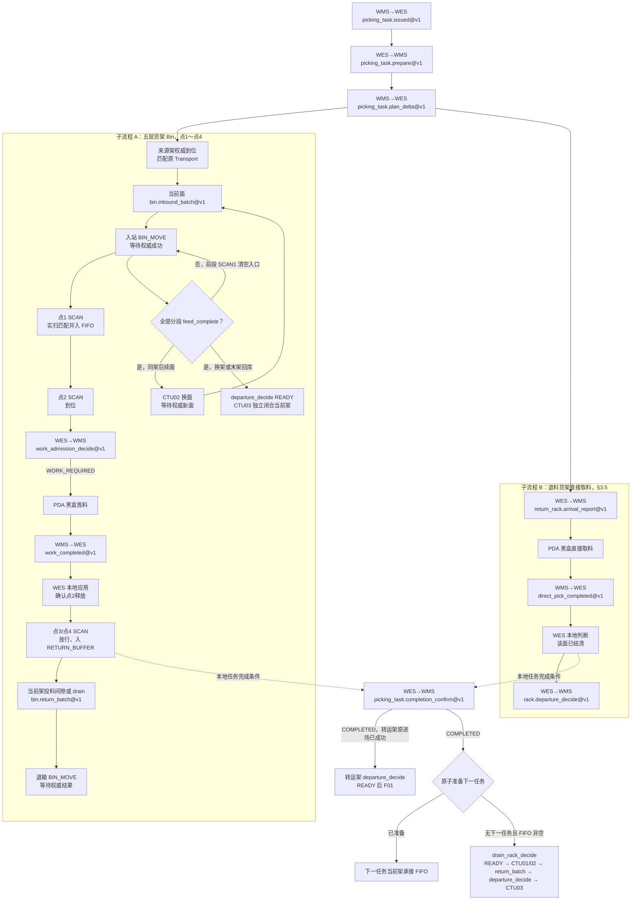
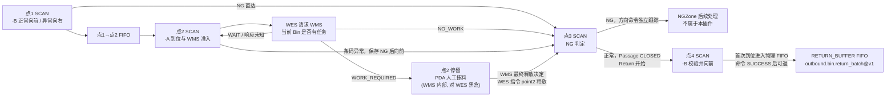

# WMS / WES 人工出库拣料交互要求 {#wms-wes}

## 1\. 文档定位 {#1}

本文是 Phase 12 人工出库拣料线（现场编号 Line3）的联合评审基线，只定义**人工出库线相对自动出库线的差异点**：
工作位（点2）Bin/Cell 拣料，以及退料货架直接取料，均由人工经 PDA 完成，而不是由机械臂执行 `PICK_AND_PUT`。

本文不是一份独立合同。人工出库线的任务下发、资源计算、货架搬运、料箱投料、扫码与位置事实、退料回库，
与
[`wms-outbound-picking-task-integration-requirements.md`](wms-outbound-picking-task-integration-requirements.md)（下称“出库合同”）
定义的自动出库场景完全一致。本文只增加人工线的 point2 任务准入、最终释放决定、本地应用，以及退料货架直接取料完成通知
四个 operation（详见第 5 节），不建立第二套通用字段表达。

> **直接取料状态：** 本文前言对退料货架直接取料及 `direct_pick_completed` 的描述已获批并完成实施：该 operation、其触发/接收
> 语义及后续离场前提均已落地，自动化验收 owner 见第 8 节。

系统尚未发布。本文不提供旧接口、兼容字段或新旧路径并存。

开发联调允许按[插件顶层设计 §7.13](../superpowers/specs/2026-07-31-wes-minimal-execution-architecture-convergence-design.md#713-声明先行与渐进业务接入)
逐步接入 SCAN1、SCAN1+SCAN2 等业务范围，无需所有节点同时上线。未接入节点保持 PLC 既有行为，WES 对合法事件仅留证；
已接入步骤仍遵守本文的业务关联、幂等、命令及结果合同，不把执行失败当作未接入，也不由 WES 自动补发默认放行命令。
下述完整流程定义最终业务验收，不作为静态声明、工作线装配或部分业务联调的前置条件；本说明不修改 operation 的 wire 合同。

### 1\.1 一次任务的端到端示例（模拟数据） {#11-e2e-example}

本节用一个模拟任务，把第 2～6 节涉及的全部 operation 按时间顺序串成一条线，方便第一次读这份合同的人先建立整体画面，再去查各节的严格字段定义。示例里的 `task_id`、`bin_code`、`rack_id` 与第 5 节的 JSON 示例是同一套编号，两边可以对照阅读。

任务 `PICK-20260902-001`（`task_type=MANUAL`）同时包含两类来源：五层货架 `RACK-5F-001`（Bin `A000000001`，走传送带点1～点4）和退料货架 `RETURN-RACK-01`（精确储位 `A-03`，走 §3.5 的直接取料路径）。两条子流程物理上并行、互不阻塞，最终都汇入转运货架 `TRANSFER-RACK-01`。

> **状态：** 下方子流程 B（直接取料）及其 `direct_pick_completed` 已获批并完成实施；子流程 A、B 物理并行、互不阻塞由第 8 节回归测试验证。



**任务下发与计划**

| \# | 发起方 → 接收方 | Operation | 关键字段 | 结果 |
| --- | --- | --- | --- | --- |
| 1 | WMS → WES | `outbound.picking_task.issued@v1` | `task_id=PICK-20260902-001, workline_code=LINE3` | `202/RECEIVED` |
| 2 | WES → WMS | `outbound.picking_task.prepare@v1` | 选中该任务和 WorkLine `LINE3` | `202/PREPARE_ACCEPTED` |
| 3 | WMS → WES | `outbound.picking_task.plan_delta@v1`（revision 1） | `target_rack=TRANSFER-RACK-01/A`；`added_bin_source_racks=[RACK-5F-001/[90,270]]`；`added_direct_picks=[RETURN-RACK-01/A/A-03]` | `202/RECEIVED` |

**子流程 A：五层货架 Bin，走点1～点4（§3.1～§3.4）**

| \# | 发起方 → 接收方 | Operation / 事件 | 关键字段 | 结果 |
| --- | --- | --- | --- | --- |
| 4A-0 | RCS/ECS → WES | 五层来源货架到位 | `RACK-5F-001/90`；原进场 Transport `SUCCEEDED`，投影位置与面向匹配 | 才允许当前面申请批次 |
| 4A | WES → WMS | `outbound.bin.inbound_batch@v1` | `plan_revision=1, rack_id=RACK-5F-001, rack_face=90` | `READY`，`bin_code=A000000001`；空面可为最终 `RACK_FACE_DONE` |
| 4A-1 | RCS/ECS → WES | 入站 `BIN_MOVE` | WMS 返回的精确来源储位、`A000000001` | 原 Transport `SUCCEEDED` 后等待点1实扫匹配 |
| 4A-2 | WES/RCS/ECS | `feed_complete` 后立即换面或换架（与 5A～12A-1 解耦） | 同架下一面 `270` 用 `CTU02`；同架无下一面先请求 `departure_decide`，READY 后用 `CTU03` | CTU02 成功代表已旋转并返回工作位；后续架凭自己的原 Transport、成员结果及精确在位投影回到 4A，不等待旧 CTU03 终态 |
| 5A | 设备 → WES | 点1 SCAN | `A000000001-B` | `MOVE_FORWARD` 成功后进入点1→点2 FIFO |
| 6A | 设备 → WES | 点2 SCAN | `A000000001-A` 到达工作位 | 校验本次经过并保存到位事实 |
| 7A | WES → WMS | `outbound.manual_bin.work_admission_decide@v1` | `task_id=PICK-20260902-001`，`bin_code=A000000001`，`scanned_at=1788389899900` | `WORK_REQUIRED`，`task_id=PICK-20260902-001` |
| — | PDA（黑盒） | 人工按 WMS 指示拣料 | 具体拣了哪个 Cell，WES 不知道、不查询 | — |
| 8A | WMS → WES | `outbound.manual_bin.work_completed@v1` | `task_id + bin_code` 指向当前等待完成的料箱任务，`result=NORMAL`，`completed_at=1788389999000` | `202/RECEIVED` |
| 9A | WES 本地执行 | 应用完成事实并释放 point2 | 匹配原 completion evidence | 按稳定命令身份执行 `MOVE_FORWARD`，分别记录应用与物理结果 |
| 10A | 设备 → WES | 点3 SCAN | `A000000001-B`，本次正常授权 | Passage `CLOSED`、Return `NONE` 同事务交接；后续 `MOVE_FORWARD` 由 Return 负责 |
| 11A | 设备 → WES | 点4 SCAN | `A000000001-B`，前序正常放行 | 首次到位进入物理 FIFO 并冻结顺序；`MOVE_FORWARD` 匹配 ECS `SUCCESS` 后具备批次资格 |
| 12A | WES → WMS | `outbound.bin.return_batch@v1` | 工作线 `RETURN_BUFFER` FIFO 队首 `A000000001`；目标为请求时权威当前 rack/face，可不同于原 `RACK-5F-001/90` | `READY` 冻结目标；候选可来自不同 PickingTask |
| 12A-1 | RCS/ECS → WES | 退箱 `BIN_MOVE` | 按原 `return_batch` 的目标储位 | 核对原 Transport 和冻结 OUTLET 来源后，明确 `ACCEPTED` 即闭合 Return；不等待可选 `SOURCE_PICKED`，不伪造物理取走。后续 Transport 独立履约 |

上述表格按业务节点编号，不表示回架后才可换面。`feed_complete` 只要求冻结面全部 inbound 分段及成员权威成功、结果发布、
终点为绑定 HANDOFF_POSITION；不等待 SCAN、人工业务或回架。已有可靠义务先闭合，未完成投料的分段间隙最多一次机会式回架。
`workline_positions.capacity` 是基础层按目标点维护的滚动 CTU01 下发窗口，按物理货架的进场生命周期计数。货架到位后仍占窗；业务完成且对应 CTU03 获得 `ACCEPTED` 后释放名额，并从 pending 补发下一架。RCS 负责物理排队、自主进位和工作位互斥；真实当前架仍由原 Transport 成功成员及精确 rack/face 到位事实确认，不按提交先后推断。

CTU03 的执行准入独立于 Return 派发队列：本轮 `departure_decide=READY` 只表示取得业务离场决定。
离场请求持久化提交后立即唤醒 WMS confirmation 派发；确定响应提交后立即唤醒现有 PickingTask/Plan driver。
driver 在原 owner 与当前执行依赖下重新判断，满足条件即创建 CTU03，Transport 提交后由现有唤醒立即派发。
唤醒不携带业务快照，可重复或丢失；同一确认身份、原离场决定关联及 Transport 幂等防止重复请求和动作。
现有 10 秒扫描保持不变，只作为漏通知、worker 异常或重启后的恢复兜底，事务回滚不得发送唤醒。
来源货架与 drain 货架在创建 CTU03 前，均检查当前进站 Transport 创建以来、本 WorkLine 中以该 rack 为来源或目标的 `BIN_MOVE` 成员。
仍为 `PENDING`、`ACCEPTED`、`RECONCILING` 且没有确定放置事实的成员暂缓离场；不能把 Return 在 `ACCEPTED` 后退出队列当成放箱完成。
成员确定 `TARGET_PLACED` 或 Transport 明确终态解除该执行依赖；旧进站轮次记录、其他货架和其他工作线不参与本次检查。
暂缓不丢弃本轮 `READY + destination`，后续位置事实通过 Transport 事务提交后的唤醒、最终结果通过插件结果发布唤醒重新评估，
并由现有每 10 秒的 plan driver 周期复查兜底。仍有效的 `READY` 直接复用，不因等待依赖重复请求 WMS，不新增货架忙闲状态。
明确未接纳或终位在目标点外的失败进场任务释放名额；终位仍在目标点的重试沿用原名额。离场明确未接纳后重新请求 WMS 离场决定；已接纳离场失败且留在目标点、当前面向缺失时的恢复要求仍待确认，见 [Transport 履约合同 §5.3](transport-fulfillment-contract.md#53-搬运最终结果)。
同一任务的同架同面若由更高 `plan_revision` 再次安排，须按[出库合同 §6.1](wms-outbound-picking-task-integration-requirements.md)作为新的来源成员与 `inbound_batch` 义务处理；请求必须携带该成员的 `plan_revision`，不能以旧成员的动作或结果为新成员结案。若该架的原进场生命周期仍占窗，新成员关联原 CTU01，不重复下发或占窗。

`CTU03` 返回 `ACCEPTED`，或发送结果为 `DELIVERY_UNKNOWN` 时，WES 立即把被移动货架在 KT16 的确定位置投影标为
`position_unknown=true`，但不推定它已经离位、目标区已到达或工作位已经腾空。匹配原 CTU03 身份的成功最终位置回调是该五层架的权威终态：
实际库位 `RACK_POSITION` 必须满足原 departure READY 冻结的 `ZONE \| RACK_POSITION`，其原 Transport 与位置投影据此闭合；回调缺失时该货架保持 unknown，
不阻塞另一货架凭自身匹配的进场 `SUCCEEDED` 继续执行。

**子流程 B：退料货架直接取料，与 A 并行（§3.5）**

| \# | 发起方 → 接收方 | Operation | 关键字段 | 结果 |
| --- | --- | --- | --- | --- |
| 4B | WES → WMS | `outbound.return_rack.arrival_report@v1` | `RETURN-RACK-01` 到达工作位 | `200/RECORDED` |
| — | PDA（黑盒） | 人工按 `added_direct_picks[]` 取 `A-03` 放至 `TRANSFER-RACK-01` | WES 不下发 DeviceCommand，不知道具体取货细节 | — |
| 5B | WMS → WES | `outbound.manual_rack.direct_pick_completed@v1` | `task_id=PICK-20260902-001, plan_revision=1, rack_id=RETURN-RACK-01, rack_face=A`，`completed_at=1788390099000` | `202/RECEIVED` |
| 6B | WES（本地判断） | 该面 `added_direct_picks[]` 已全部结清，无其它未结明细 | — | 满足 `outbound.rack.departure_decide@v1` 的发起条件 |
| 7B | WES → WMS | `outbound.rack.departure_decide@v1` | `rack_id=RETURN-RACK-01` | `READY` 后使用 `F01` 搬离工作位 |

**任务收尾**

| \# | 发起方 → 接收方 | Operation | 关键字段 | 结果 |
| --- | --- | --- | --- | --- |
| 13 | WES → WMS | `outbound.picking_task.completion_confirm@v1` | 子流程 A、B 的本地任务明细满足 §13 完成前提 | `COMPLETED`；已完成任务的退箱与货架离场继续按原身份执行，不以全部回库作为确认前提 |
| 14 | WES → WMS | `outbound.rack.departure_decide@v1` | `rack_id=TRANSFER-RACK-01`，当前任务已获第 13 步完成确认、转运架原进场成功且当前在位 | 即使五层架 CTU03 仍未返回终态，也可请求；`READY` 冻结 WMS 给出的去向 |
| 15 | WES/RCS/ECS | 转运架离场 `F01` | `RACK=TRANSFER-RACK-01` 到原 `rack_destination` | 保留第 14 步的原 operation/binding 与最终位置结果 |

**变体（NG）**：若人工在 point2 判定 `A000000001` 不合格，第 8A 步的 `work_completed@v1` 改为 `result=NG`；WES 应用后仍创建唯一 point2 释放命令，但第 10A 步 point3 按 §3.3 的表格走 `MOVE_LEFT`，该 Bin 不进入 `RETURN_BUFFER`（不影响子流程 B）。

三个新增 operation（`work_admission_decide`、`work_completed`、`direct_pick_completed`）的严格字段定义在第 5 节；本节只负责把顺序和因果关系讲清楚，不重复摘录字段表。

## 2\. 与出库合同的边界 {#2}

### 2\.1 复用出库合同的部分（零新增） {#21}

- 任务发布、队列与取消：`outbound.picking_task.issued@v1`、`outbound.picking_task.queue_changed@v1`、
  `outbound.picking_task.cancel@v1`；人工任务使用同一个 PickingTask 实体和队列，发布时固定 `data.task_type=MANUAL` 并指定不可变
  `data.workline_code`，不建立人工任务表或人工任务业务键；
- 任务准备与计划增量：`outbound.picking_task.prepare@v1`、`outbound.picking_task.plan_delta@v1`（含 `added_direct_picks[]`
  退料货架直接取料明细与 `added_bin_source_racks[]` 五层来源货架；后者的 `rack_face` 是非空数组，WES 按面展开；人工任务与自动任务字段
  零差异，人工线两类来源均可能出现）；
- 退料货架到位事实：`outbound.return_rack.arrival_report@v1`；WMS/RCS 的通用 Transport 结果由 WES 业务模块识别后，复用同一事实
  上报更新当前 PickingTask 的退料货架到位状态；
- 五层货架入站分批：`outbound.bin.inbound_batch@v1`；
- 退箱：`outbound.bin.return_batch@v1`，WorkLine 级跨任务 `RETURN_BUFFER` FIFO；任务完成后先原子准备下一任务，无下一任务且 FIFO 非空才调用 `workline.return_buffer.drain_rack_decide@v1`（出库合同 §9.2.3）；
- 所有业务货架离场去向：`outbound.rack.departure_decide@v1`；五层来源架、drain 架 READY 后使用 `CTU03`，转运架、直接取料退料架 READY 后使用 `F01`，
  禁止固定 `WH01` 或从其它 operation 猜测 destination；
- 任务状态确认：`outbound.picking_task.completion_confirm@v1`；
- Transport 四个通用搬运方法（`move_rack` / `rotate_rack` / `move_bins` / `exchange_bins`）与其提交、回调合同；
- WorkLine 准入、`PositionProjection` 等基础能力与不变量；
- `WmsConfirmation` 的可靠派发、重试和结果证据；其中立关联一次收敛为料盘、PickingTask 或 WorkLine 恰好一个，不新增第二套 outbox。

上述接口的字段、条件必填、响应联合、错误码、幂等和重试语义完全以出库合同为准，本文不重复摘录，也不允许出现与出库合同
不一致的实现。

### 2\.2 人工出库线独有的部分（本文新增） {#22}

> **直接取料状态：** 下方退料货架直接取料条目已获批并完成实施；`direct_pick_completed`、其接收语义及换面/离场前提
> 均已落地，并由第 8 节回归测试覆盖该分支。

- 工作位（点2）任务由人工经 PDA 完成，PDA 是 WMS 侧功能，不在 WES 集成范围内（详见第 4 节）；
- point2 扫描实际 Bin 后，WES 向 WMS 请求是否存在人工任务的新 operation：
  `outbound.manual_bin.work_admission_decide@v1`（详见第 5 节）；
- WMS 在原子持久化 PDA 子任务和业务结果后，向 WES 上报 Bin 级最终释放决定的新 operation：
  `outbound.manual_bin.work_completed@v1`（详见第 5 节）；
- WES 本地保存完成决定的应用状态和释放证据，不再二次上报 WMS（详见第 5.4 节）；
- 退料货架直接取料同样由 PDA 完成；WMS 用新 operation `outbound.manual_rack.direct_pick_completed@v1`
  上报面级完成事实（详见 §3.5、第 5.5 节）；
- 人工出库线不使用出库合同 `outbound.bin.work_plan@v1`：工作位任务的可执行范围（拣哪些 Cell）完全由 WMS/PDA
  内部决定，WES 不查询、不持有、不校验该范围。

## 3\. 现场物理拓扑 {#3}

人工出库线依次有四个扫码工位，具体设备编码由 WorkLine 的 `SCAN1`～`SCAN4` 角色绑定提供，不写入业务代码。
现场 KT16 当前绑定为 `STATION_SCAN9`～`STATION_SCAN12`。点1→点2是单通道 FIFO；点3同时接收点1 NG 直达和点2释放的料箱，不能用该 FIFO 推断点3身份。
点2旁的 PDA 拣料属于 WMS 内部流程，WES 只负责到位报告、最终决定和可靠放行。
每条 WorkLine 各有一条独立回程通道，WorkLine 之间不共用；点3后紧接点4（SCAN4），点4后约有三个各容纳一个料箱的滚筒位，再到唯一出料口。正常运行时，点3→点4→出料口无旁路，料箱不会超车。因此本线的回程 FIFO 作用域是该 WorkLine 的独立回程通道，SCAN4 实际触发顺序是该通道的物理准入顺序。人工移箱等干预属于异常物理事实，不能仅凭软件状态重排或释放队首；仍须取得权威退出事实。

`ManualPickingPassage` 只负责 INLET/SCAN1→SCAN3，首次 SCAN3 到位时 `CLOSED`；已识别正常箱同事务创建 `BinLineReturn` 接管 SCAN3→OUTLET，点3 `MOVE_FORWARD` 属于 Return Action。NG 箱不创建 Return，其方向 Command 独立跟踪结果。Return 在首次有效 SCAN4 到位时进入物理 FIFO；原 Transport 明确接纳后完成本线冻结 OUTLET 来源的执行权交接并关闭 Return，不宣称物理取走。OUTLET→Rack Slot 的 Transport 在 `TARGET_PLACED`/最终成功后独立完成。Passage `CLOSED` 不代表该 bin 全程完成，已闭合 Passage/Return 历史不参与当前运行。



### 3\.1 点1与上游缓存：进入证据和 FIFO 顺序 {#31-1-fifo}

点1读取 ECS `SCAN_COMPLETED.data.bin_code`，实际值带方向后缀。仅形如 `A00000xxxx-B` 的本点有效箱码创建 `MOVE_FORWARD`；
不可读、箱码格式错误或后缀不为 `-B` 时记录本次 NG 并创建 `MOVE_RIGHT`，由点1直达点3，不向 WMS 发送猜测的箱码。
SCAN1 放行不依赖目标货架到位，只校验本箱的任务、当前轮次、计划来源和入站位置/Transport 等必要依据。
目标货架与料箱同时就绪由实际人工拣料的 WMS/PDA 作业准入负责，不提前串联到 SCAN1 或点2到位上报。
`MOVE_FORWARD` 的匹配物理结果闭合后，按实际可靠到达顺序冻结点1→点2 FIFO 身份；不能把命令创建或 ACK 当作到达。
本线前一个点1方向命令未取得权威成功结果时，不为后一个扫码下发方向命令；同一未闭合料箱重扫也不建立第二次经过。
本条按点1设备的未闭合命令判断，不因其料箱已在下游标记 `CLOSED` 就越过原命令。

WES 对上游供箱只按已确认的缓存容量、FIFO 顺序和出库合同的准入条件控制；不以软件中的 point2 占用锁代替 ECS/PLC 的滚筒
步进和防撞互锁。缓存已满、顺序或位置不确定时停止新料箱入线，但不干预已经进入缓存的自主 FIFO 推进。

### 3\.2 点2：人工工作位（PDA，对 WES 黑盒） {#32-2pda-wes}

FIFO 队首进入点2后，设备扫码并由 ECS 上报 WES。点2只接受本点 `-C` 后缀，去后缀的正常 `bin_code` 必须与点1冻结的本次经过一致。
该扫码是当前料箱到达人工工作位的事实；点1证据不能替代它。WES 不把实际料箱与计划预期料箱做错箱比较，使用冻结的 `task_id` 与实际正常 `bin_code` 请求 WMS 判断是否
存在人工任务。PDA 的呼叫、Cell 分配、拣料确认等内部流程完全由 WMS 负责，WES 不集成、不查询、不持有其中任何字段（对照 §2.2）。

WES 在点2的唯一职责是：

1. 接收并保存 point2 实际扫码和到位事实；
2. 调用 `outbound.manual_bin.work_admission_decide@v1` 请求 WMS 判断当前 `bin_code` 在指定 `task_id` 下是否有人工任务；
3. `WORK_REQUIRED` 时校验 WMS 返回的 `task_id` 与请求一致并保存绑定，保持料箱停留并等待 Bin 级最终释放决定；`NO_WORK` 时把该 Bin 标记为正常直通并
   创建 point2 释放命令；`WAIT` 或响应未知时保持 point2 占用并按第 5 节重试；
4. 收到 `WORK_REQUIRED` 对应的完成决定后，按原准入 `operation_id` 把业务结果和释放权限原子绑定到本次 Passage；
   校验 `task_id + bin_code` 与冻结请求一致，绑定成功后才向 point2
   下发 `MOVE_FORWARD` 释放当前料箱。料箱由滚筒线自动流向点3，后一个料箱自动进入 point2 并重新触发扫码上报。

点2不可读、后缀错误、箱码无效或与当前 FIFO 身份不符时，先要求队首点1方向命令取得匹配 ECS `SUCCESS`；否则只留证对账、零命令。
满足前序物理结果后，不请求 WMS，创建 `MOVE_FORWARD` 到点3；
若存在队首，其原身份与顺序被冻结，不被异常码覆盖，后续点2扫码不得越过该队首，直到现场对账明确物理身份。
与 WMS 交互只使用去后缀的正常 `bin_code`。

### 3\.3 点3：NG 判定 {#33-3ng}

点3独立校验实际扫码的 `-B` 后缀，并用正常箱码唯一关联本线尚未闭合的本次经过；不按点1→点2 FIFO 队首猜测身份。未经过点2且能唯一关联的直达箱，以点3当前有效 `-B` 决定正常向前；点1的非 `-B` 分流决定不能永久标记该箱为 NG。经过点2的箱仍须按其 WMS 确定结果决定方向。
不可读、后缀错误、身份不唯一或当前经过点2但缺少确定正常授权时创建 `MOVE_LEFT`，不停箱，也不伪造 WMS NG。
若无法识别有效正常箱码、无法关联任何经过且本点已有未闭合方向命令，新扫码先留证对账，不另下发第二条物理命令；“不停箱”不允许越过结果未知的原命令。
已关联当前经过的料箱只等待自身因果前置；另一料箱在同设备的未闭合命令不构成业务门禁，物理接纳由 ECS 裁决。
已取得 WMS 确定正常授权的料箱到达点3，点2方向命令即使未取得确定结果，点3到位 Evidence 仍使 Passage 结束，并同事务创建 Return 与点3正常方向 Command；点2 Command 迟到终态只保留原命令审计，不再驱动回程状态机。WMS 业务决定未决是另一种情况：原点3 Evidence 等待该决定，不能据此猜 NG、创建正常 Return 或下发方向 Command。

| 当前处置 | 决定来源 | point3 动作 |
| --- | --- | --- |
| point2 `WORK_REQUIRED` 且人工任务完成 | 与当前待处理动作匹配的 WMS 完成结果 | NG → `MOVE_LEFT`；NORMAL → `MOVE_FORWARD` |
| point2 `NO_WORK` 正常直通 | 当前任务准入决定 | `MOVE_FORWARD` |
| 未经过 point2 的已识别直达箱，point3 当前扫码有效 `-B` | point3 本次实际扫码及唯一料箱身份 | `MOVE_FORWARD`；不沿用 point1 的历史 NG 判断 |
| point2 条码不可读且未进入人工业务 | 本次不可读码证据及已保存 NG 决定；实际 bin\_code 可空 | `MOVE_LEFT` |
| 当前无 Passage/Return，独立从 SCAN3 重新投入且 `-B` 有效 | 当前真实扫码；同箱没有活跃 BIN_MOVE | `MOVE_FORWARD`，创建新 Return；不依赖已闭合历史 |
| 当前条码无效或已有处置不允许正常放行 | 原始扫码和当前处置 | `MOVE_LEFT`；保留异常证据 |

料箱 NG 作为独立分支保存实际原因、实际扫码、原决定与命令关联，不填充预期条码冒充实际码。
插件通过 DeviceCommand 完成必要分流，不发送 NG 出口报告，不等待 WMS 人工处理完成。正常业务结束不删除有效位置或解除未决物理动作。
匹配的权威离位/释放事实解除当前工位等待，同箱后续合法到位才建立新的处理关联。
点3首次有效到位是 Passage 的闭合点；正常箱在同一事务创建 Return，NG 箱只由原 DeviceCommand 跟踪分流结果，NGZone 后续人工处理不属于本插件。重复投递同一 Evidence 不创建新命令。

SCAN3 也是独立回程准入点：有效 `-B` 扫码且没有当前 Passage/Return 时，直接创建新的 Return 和 `MOVE_FORWARD`，不读取旧 `EXITED`/`VOIDED` Return 或 CLOSED Passage 作为准入依据。当前同箱 `BIN_MOVE` 仍为 `PENDING`、`ACCEPTED`、`RECONCILING` 时保留直接执行依赖并延迟；明确终态的历史任务不阻塞。已有 Passage 的 WMS 人工作业/NG 处置继续按原规则执行，不因重扫绕过。该准入只允许进入回程通道，最终储位分配仍由 WMS 决定。已经执行过 `MOVE_LEFT` 的旧扫码不重放为相反方向，须以新的现场扫码建立新动作。

SCAN3 同时是 SCAN3/SCAN4 异常回程的重新投入点：同箱当前 Return 尚未派发回架 Transport，且其当前方向命令为 `FAILED`、`TIMED_OUT` 或 `RECONCILING` 时，新的有效 `-B` 扫码可开启新轮次。扫码发生时间须晚于旧轮次 SCAN3 及已有 SCAN4 到位时间；同事务将旧 Return 标记为 `VOIDED`，保留原事件、命令和异常，创建以新 SCAN3 Evidence 为身份的 Return 与 `MOVE_FORWARD`。这项明确的重新投入事实结束旧轮次对当前回程的约束，不伪造旧命令成功；已派发的回架搬运仍按原 Transport 身份执行。新轮次等待自己的 SCAN4 到位与放行结果形成批次资格，重新冻结 FIFO 顺序，不继承旧 SCAN4 顺序、命令或批次。旧扫码重放与旧命令迟到结果不得修改新轮次；正常在途的重复扫码继续等待当前命令，不重复下发。

### 3\.4 点4：实际到位后进入物理 FIFO {#34-4}

点4独立校验实际扫码的 `-B` 后缀，并唯一关联当前未退出的 Return。不可读、后缀错误或身份不确定时保持点位占用，不创建 `MOVE_FORWARD`，也不伪造 FIFO admission。已识别正常箱首次有效 SCAN4 到位即冻结 Evidence 和设备扫码发生时间并进入本线物理 FIFO；若前序 SCAN3 放行尚未确定，只延迟后续 Action。匹配 SCAN4 `MOVE_FORWARD` 的 ECS `SUCCESS` 使当前 Return 具备批次资格；ACK 和本地命令创建均不能代替到位或放行事实。尚未派发的候选按首次到位顺序进入
`outbound.bin.return_batch@v1`；已派发箱缺少取走回调不阻塞后续独立候选；目标货架分配及搬回货架仍按出库合同 §9.2.2 执行。
点4首次扫码冻结 FIFO admission/order，重复投递同一 Evidence 不重复建命令；当前命令未到终态时等待其结果，明确 `FAILED`/`TIMED_OUT` 且目标事实尚未满足时，真实重扫可为同一 Requirement 创建新 Command 并更新 Command pointer，但不得改变首次 SCAN4 Evidence 和顺序时间。
**SCAN4 首次实际到位决定物理 FIFO 顺序；匹配的 `MOVE_FORWARD` ECS `SUCCESS` 决定批次资格。** `return_batch` 只选已具备资格的 `READY` Return，按首次 SCAN4 到位顺序组成候选列表，WMS 对该列表返回连续前缀；不得按命令完成顺序重排。`MOVE_PENDING` 仍等待本箱放行结果，不参与本次候选，也不阻塞其他已具备资格的箱；`RETURN_REQUESTED` 已有冻结批次与搬运身份，不再占据待派发队列，不重复分配，也不因缺少回调阻塞后续独立批次。原 Transport 明确 `ACCEPTED` 即闭合对应 Return；扫描晚于接纳时，原 Transport 的明确终态、已有 ACK 后的对账或已应用权威结果仍可证明交接。发送未知、拒绝不能证明交接。`SOURCE_PICKED` 是可选物理证据；Return 闭合不改写物理位置，不删除 Transport，后续失败与位置未知继续按原 Transport 对账。

### 3\.5 退料货架直接取料 {#35-direct-pick}

> **APPROVED：** 本节的 wire 和业务定义已获批并完成实施；对应 operation、handler、路由均已创建，自动化验收 owner 见第 8 节，现场验收状态见 §6。

退料货架直接取料是人工出库线的第二条物理路径，完全独立于 §3.1～§3.4 的传送带（点1～点4），不经过任何 SCAN 设备。
货架搬运和到位复用出库合同 §9.1（`outbound.return_rack.arrival_report@v1`，零改动）；差异只在取货动作本身：
自动线由机械臂执行 `PICK_AND_PUT` 并通过 DeviceCommand 结果自证完成，人工线由工人持 PDA 直接取货放至转运货架，
对 WES 是黑盒（对照 §4）。WES 因此没有本地信号判断货架面是否取完，需要 §5.5 新增的完成通知才能继续既有的
`outbound.rack.departure_decide@v1` 换面/退场判断。

## 4\. PDA 边界声明 {#4-pda}

PDA（人工拣料操作终端）是 WMS 侧功能，不属于 WES 集成范围：

- WES 不向 PDA 发送任何请求，也不接收 PDA 的直接回调；
- WES 不知道、也不需要知道点2内部具体拣了哪个 Cell、拣了几次、耗时多久；
- WES 与人工拣料结果的唯一交互点是第 5 节定义的完成通知。

本文对照 [`wes-wms-interface-requirements.md`](../integration/wes-wms-interface-requirements.md) §6「不提供 PDA、
打印和未批准的人工业务接口」这条既有边界：本文不违反该边界，因为 WES 侧确实不提供、不消费任何 PDA 接口，
PDA 全部内部逻辑归属 WMS。

## 5\. Operations wire：人工线新增接口与复用排空决定 {#5-operations}

### 5\.1 `outbound.manual_bin.work_admission_decide@v1` {#51-outboundmanual_binwork_admission_decidev1}

| 项 | 值 |
| --- | --- |
| 方向 | WES 到 WMS |
| 端点 | `POST {{WMS_BASE_URL}}/api/v1/wes/decisions` |
| 触发条件 | point2 SCAN 和到位证据已可靠保存，且读取到合法实际 `bin_code` |
| 成功响应 | `200 / DECIDED` |

请求信封复用出库合同公共信封（`operation_id + operation + timestamp + data`）：

```json
{
  "operation_id": "<uuid7>",
  "operation": "outbound.manual_bin.work_admission_decide@v1",
  "timestamp": 1788389900000,
  "data": {
    "task_id": "PICK-20260902-001",
    "bin_code": "A000000001",
    "scanned_at": 1788389899900
  }
}
```

| 字段 | 必填 | 类型/格式 | 说明 |
| --- | --- | --- | --- |
| `data.task_id` | 是 | 出库合同 Identifier | 当前执行上下文已绑定的任务；必须与 WorkLine/PickingTask 关联一致，不根据实际料箱猜测任务 |
| `data.bin_code` | 是 | 出库合同 Identifier | point2 SCAN 读取的当前实际料箱；WES 不发送预期 Bin，也不在本地做错箱比较 |
| `data.scanned_at` | 是 | positive integer / UTC Unix 毫秒 | point2 有效扫码和到位事实的设备发生时间；不得晚于信封 `timestamp` |

`data` 读取上述三个必填字段，忽略冗余字段；Identifier、已定义字段的 `null`、空字符串、错误类型和时间约束复用出库合同的规则。条码不可读时
禁止发送请求，按 §3.2 的 Bin NG 路径处理。

`200 / DECIDED` 的 `data` 是严格联合：

| `data.result` | 必填字段 | 接收时忽略字段 | WES 动作 |
| --- | --- | --- | --- |
| `WORK_REQUIRED` | `task_id` | `retry_after_ms` | 校验返回 `task_id` 等于请求任务后原子保存当前 `bin_code + task_id` 关联，保持 point2 占用并允许 WMS/PDA 开始人工操作 |
| `NO_WORK` | 无 | `task_id`、`retry_after_ms` | 原子保存正常直通决定并创建唯一 point2 释放命令 |
| `WAIT` | `retry_after_ms` | `task_id` | 当前料箱停留 point2；到期或新业务事件唤醒后使用新 `operation_id` 重求值 |

`task_id` 复用出库合同 Identifier；`retry_after_ms` 复用出库合同正整数边界。WMS 根据其业务主账判断实际 Bin 在指定任务下是否有人工任务；
WES 不查询 Cell、不验证预期 Bin，也不把 `NO_WORK` 解释为 NG。

原 `operation_id` 和原请求重放必须返回首次完整响应。同 ID 内容漂移返回 `409 / CONFLICT`；响应未知或
`503 / UNAVAILABLE` 时，WES 保持当前 Bin、point2 占用和原 operation identity 重试，不以新 ID 猜测结果。只有已收到并可靠保存
`WORK_REQUIRED | NO_WORK | WAIT` 才能推进相应状态；HTTP 响应本身不表示任何设备动作已发生。

响应 `WORK_REQUIRED.task_id` 与冻结请求不一致时进入对账，不绑定其他任务，也不放行料箱。缺失、空值或非法
`task_id` 属于非法请求，不回退为按料箱查询。

联调升级：已冻结的不含 `task_id` 的旧请求不得原地补字段或沿用原 `operation_id` 发送新正文。先停止原可靠义务的重试，
核对 WMS 原请求未形成有效业务决定；按明确的人工恢复流程保留原请求及响应证据、关联替换关系，再以新 identity
发出包含 `task_id` 的请求。响应未知或已有有效决定时不得据此换 ID 重发；该替换入口尚未实现。

### 5\.2 `outbound.manual_bin.work_completed@v1` {#52-outboundmanual_binwork_completedv1}

| 项 | 值 |
| --- | --- |
| 方向 | WMS 到 WES |
| 端点 | `POST {{WES_BASE_URL}}/api/v1/wms/events` |
| 触发条件 | WMS 已持久化当前料箱任务的 PDA 子任务和最终业务结果 |
| 首次成功响应 | `202 / RECEIVED` |
| `ack_mode` | `EVIDENCE_ACCEPTED` |
| `ack_commit_facts` | 完成通知的 `InboundEvidence` 及消息接收身份；不包含插件业务应用或物理放行 |

ACK 模式遵循[公共回调合同](wms-async-callback-envelope-contract.md#6-每个业务-operation-还要说明什么)。WMS 通知当前料箱任务已完成，通知数据为 `task_id + bin_code + result + completed_at`。

请求示例：

```json
{
  "operation_id": "019f12d0-58d7-7b4d-a23a-1b90aa5d4472",
  "operation": "outbound.manual_bin.work_completed@v1",
  "timestamp": 1790203807500,
  "data": {
    "task_id": "A7541FE9CFDD04A0C87584A0DA42711D4",
    "bin_code": "A000002097",
    "result": "NORMAL",
    "completed_at": 1790203807437
  }
}
```

首次接收响应示例：

```json
{
  "operation_id": "019f12d0-58d7-7b4d-a23a-1b90aa5d4472",
  "code": "RECEIVED",
  "timestamp": 1790203807550,
  "data": {}
}
```

| 字段 | 必填 | 类型/格式 | 说明 |
| --- | --- | --- | --- |
| `data.task_id` | 是 | 出库合同 Identifier | WMS 当前料箱任务所属 PickingTask |
| `data.bin_code` | 是 | 出库合同 Identifier | WMS 当前已完成任务的实际料箱号 |
| `data.result` | 是 | enum | `NORMAL \| NG`；分别授权正常或 NG 路径 |
| `data.completed_at` | 是 | positive integer / UTC Unix 毫秒 | WMS 完成料箱任务的时间；不得晚于通知的 `timestamp` |

`data` 只要求上述四个字段；冗余字段按公共严格 DTO 规则处理。`task_id`、`bin_code` 复用出库合同 §4.4 的 Identifier 约束。WES 将 `completed_at` 保存为 WMS 的业务完成时间，不用它选择 Passage 或决定设备动作。

WMS 顶层 `(operation, operation_id)` 是通知本身的可靠重试身份；相同身份必须重放相同完整内容。WES 先可靠保存 `InboundEvidence` 再返回 ACK。接收后，插件仅在执行任务所属 WorkLine 内查找唯一的当前 point2 同 `task_id + bin_code` Passage；它必须已经收到 `WORK_REQUIRED` 且仍在等待完成。无唯一匹配、结果冲突或不再等待时保留 Evidence 并进入 `RECONCILING`，不得放行。WES 本地保留 `admission_operation_id` 作为准入 Action 身份，WMS 通知无需携带它。

`work_completed` 是 WMS 已形成的最终业务决定，同时授权 WES 按当前 Passage 创建放行命令；`202 / RECEIVED` 只证明通知已可靠接收，不证明已应用或料箱已移动。`NG` 的本地原因记为 `MANUAL_PICK_NG`，由 NG 分支执行设备分流。WMS 内部人工拣料原因不跨系统传输。

WES 可靠保存 `WORK_REQUIRED` 后保持 point2 占用和等待；超时不得自动释放、改判 NG、关闭执行或创建新命令身份。

### 5\.3 完成通知的接收、重试与应用边界 {#53}

`outbound.manual_bin.work_completed@v1` 复用出库合同 §4 的公共接收语义：

| 情形 | HTTP / `code` | 处理 |
| --- | --- | --- |
| 新 `operation_id` 且严格 DTO 合法 | `202 / RECEIVED` | 可靠持久化 evidence；不表示业务已应用或料箱已移动 |
| 原 `operation_id` 和完整请求重放 | `200 / DUPLICATE` | 返回第一次响应的 `timestamp + data` |
| 原 `operation_id`、但完整请求不同 | `409 / CONFLICT` | `data.reason_code=IDEMPOTENCY_CONFLICT` |
| 严格 DTO 或公共信封不合法 | 出库合同 §4 的 `400 / 413 / 422` 联合 | 不进入业务应用 |
| 当前无法可靠持久化 | `503 / UNAVAILABLE` | WMS 使用原 `operation_id` 和原请求重试 |

共享 HTTP 入口不读取人工线当前工位或任务等待来同步判定业务冲突。换新 `operation_id` 的合法消息仍先返回
`202 / RECEIVED`；当前 `task_id + bin_code` 是否唯一匹配等待完成的 Passage、结果是否已应用或冲突，由人工业务模块在异步应用 evidence 时判定。

### 5.4 完成事实的本地应用 {#54-completion-local-application}

> **直接取料状态：** 本节涉及的 `direct_pick_completed` 已获批并完成实施。其可靠接收、幂等、ACK、
> 货架面应用及后续换面/离场前提均已落地，并由第 8 节回归测试覆盖。

取消 `outbound.manual_bin.completion_apply_report@v1`，WES 不再向 WMS 二次报告完成事实的应用结果。
对已批准的 `work_completed`，可靠接收、幂等和 `202 / RECEIVED` ACK 语义保持不变；ACK 不表示物理释放完成。

WES 校验完成 Evidence 的 `task_id + bin_code` 与当前工作位等待完成的料箱，保存本地应用状态。无唯一匹配或结果冲突进入本地
`RECONCILING`，保留通知身份与证据，不下发方向命令，也不创建额外上报义务；已应用的相同结果不重复创建设备命令。

插件自动执行分别记录完成事实应用、稳定命令创建和物理完成；`NO_WORK` 按释放结果推进，不要求完成通知。

已有旧阶段 Run 和未闭合上报义务应在升级前逐项核对；接口退役不允许覆盖历史证据或重新触发物理动作。

### 5\.5 `outbound.manual_rack.direct_pick_completed@v1` {#55-outboundmanual_rackdirect_pick_completedv1}

> **APPROVED：** 本 operation 的 wire 文本已获批并完成实施；代码 operation 已注册，自动化验收结果见第 8 节。

| 项 | 值 |
| --- | --- |
| 方向 | WMS 到 WES |
| 端点 | `POST {{WES_BASE_URL}}/api/v1/wms/events` |
| 触发条件 | WMS 已确认某 PickingTask 在指定退料货架面上的全部 `added_direct_picks[]` 人工直接取料完成 |
| 首次成功响应 | `202 / RECEIVED` |
| `ack_mode` | `EVIDENCE_ACCEPTED` |
| `ack_commit_facts` | 本次完成事实的 `InboundEvidence` 及消息接收身份；不包含插件对货架面本地明细的业务应用 |

ACK 模式与接收、重试、幂等语义与 §5.2～§5.3 一致，复用同一公共入口和 `WmsConfirmation` 生命周期，不新增第二套
Evidence/Confirmation。

请求信封复用出库合同公共信封（`operation_id + operation + timestamp + data`），`data` 严格字段如下：

```json
{
  "operation_id": "<uuid7>",
  "operation": "outbound.manual_rack.direct_pick_completed@v1",
  "timestamp": 1788390100000,
  "data": {
    "task_id": "PICK-20260902-001",
    "plan_revision": 1,
    "rack_id": "RETURN-RACK-01",
    "rack_face": "A",
    "completed_at": 1788390099000
  }
}
```

| 字段 | 必填 | 类型/格式 | 说明 |
| --- | --- | --- | --- |
| `data.task_id` | 是 | 出库合同 Identifier | 必须命中该任务已接收的 `plan_delta.added_direct_picks[]` 中尚未结束的退料货架面 |
| `data.plan_revision` | 是 | positive integer | 被结清的直接取料来源成员 revision；不得取当前最高 revision 代替 |
| `data.rack_id` | 是 | string，出库合同 Identifier | 必须等于 `added_direct_picks[].source_locator.rack_id`；不得为空或含未批准格式 |
| `data.rack_face` | 是 | string，出库合同 Identifier | 必须等于 `added_direct_picks[].source_locator.rack_face`；不得为空或含未批准格式 |
| `data.completed_at` | 是 | positive integer，UTC Unix 毫秒 | WMS 确认该货架面全部直接取料完成的时间，且 `completed_at <= timestamp` |
| `timestamp` | 是 | positive integer，UTC Unix 毫秒 | 信封生成时间；必须为正整数，且不得早于 `data.completed_at` |

`data` 是严格对象，只接受上述五个字段；未知字段、缺失字段、`null`、空字符串和错误类型均拒绝，不忽略额外字段。`task_id`、
`rack_id`、`rack_face` 必须满足出库合同 Identifier 约束。跨 revision 复用同一货架面时，业务终态身份须包含该来源成员的 `plan_revision`；同一物理
货架面在不同 `task_id` 或不同 revision 中分别上报和收敛。严格 DTO 已要求成员 revision；`task_id + rack_id + rack_face` 不构成跨 revision 的终态身份。

本 operation 不携带逐 slot 取货结果：退料货架没有 NG 出口，缺料、损耗等业务异常完全由 WMS/PDA 内部处理，对 WES 保持
黑盒（对照 §2.2、§4）。完成事件只能结清其明确指向的 revision 成员，供既有
`outbound.rack.departure_decide@v1` 的发起条件和换面（`RACK_ROTATE`）判断复用；换面还是彻底退场仍由 WES 按出库合同
§9.2.1/§9.4 既有逻辑自主决定，本 operation 不参与、不影响该决定本身。

### 5\.6 `workline.return_buffer.drain_rack_decide@v1`（复用） {#56-worklinereturn_bufferdrain_rack_decidev1}

本 operation 不是人工线新增接口；其权威合同仍为[出库合同 §9.2.3](wms-outbound-picking-task-integration-requirements.md#923-return-buffer-drain)。
本节补充人工线联调所需的完整 wire/payload，字段含义不得与出库合同或
[`return_buffer_drain/wire.py`](../../src/app/wms_adapter/return_buffer_drain/wire.py) 分叉。

| 项 | 值 |
| --- | --- |
| 方向 | WES 到 WMS |
| 端点 | `POST {{WMS_BASE_URL}}/api/v1/wes/decisions` |
| 人工线触发条件 | 当前 PickingTask 完成后先原子准备下一任务；没有可准备任务且 WorkLine `RETURN_BUFFER` FIFO 非空 |
| 生命周期上下文 | 任务完成、停线或插件切换原因只保存在 WES 本地，不进入 wire payload |
| 成功响应 | `200 / DECIDED`，`data.result=READY \| WAIT` |
| 可靠 owner | 当前 `workline_id`；owner 不进入 wire payload |

首次请求示例：

```json
{
  "operation": "workline.return_buffer.drain_rack_decide@v1",
  "operation_id": "019f3406-2200-7b03-8b01-000000000003",
  "timestamp": 1788390200000,
  "data": {
    "workline_code": "LINE3",
    "required_slot_count": 4
  }
}
```

| JSON Path | 必填 | 类型/格式 | 规则 |
| --- | --- | --- | --- |
| `operation` | 是 | literal | 固定 `workline.return_buffer.drain_rack_decide@v1` |
| `operation_id` | 是 | UUIDv7 | 本次决定身份；技术重试保持原值，`WAIT` 后重求值必须生成新值 |
| `timestamp` | 是 | nonnegative int64 / UTC Unix 毫秒 | 技术重试保持原时间戳和完整请求内容 |
| `data.workline_code` | 是 | Identifier | 当前冻结 WorkLine 的业务编码 |
| `data.required_slot_count` | 是 | positive integer | 请求时 WorkLine `RETURN_BUFFER` 中已确认可回料 Bin 数量；不包含在途、工作位、NG 或位置未知成员，且不得超过该位置配置容量 |

Identifier 使用 `[A-Za-z0-9][A-Za-z0-9._:/-]{0,99}`。请求信封和 `data` 均为严格对象，额外字段、错误类型和非法 `null` 全部拒绝。
Bin 身份、FIFO 顺序、插件身份和生命周期原因由 WES 本地持有；WMS 只根据 WorkLine 和总容量需求选择承接货架面计划。

`READY` 表示 WMS 已选择满足总容量需求的有序货架和货架面计划：

```json
{
  "operation_id": "019f3406-2200-7b03-8b01-000000000003",
  "code": "DECIDED",
  "timestamp": 1788390200100,
  "data": {
    "result": "READY",
    "racks": [
      {"rack_id": "RACK-5F-002", "rack_face": ["90", "270"]},
      {"rack_id": "RACK-5F-003", "rack_face": ["90"]}
    ]
  }
}
```

`WAIT` 表示当前没有可用承接货架；本次决定已经闭合，到期重求值不是对原请求的技术重试：

```json
{
  "operation_id": "019f3406-2200-7b03-8b01-000000000003",
  "code": "DECIDED",
  "timestamp": 1788390200100,
  "data": {
    "result": "WAIT",
    "reason_code": "NO_DRAIN_RACK_AVAILABLE",
    "retry_after_ms": 1000
  }
}
```

`READY` 只允许 `result + racks`；`racks[]` 非空有序、`rack_id` 不重复，每项 `rack_face[]` 非空有序且同架不重复；总面数在
`1..required_slot_count` 且每面至少承担一个预留槽位。`WAIT` 只允许
`result + reason_code=NO_DRAIN_RACK_AVAILABLE + retry_after_ms`，其中 `retry_after_ms` 为 `1～60000` 的整数。响应
`operation_id` 必须匹配请求，响应对象同样拒绝额外字段。

WMS 内部按 `(workline_code, drain_operation_id)` 保存每线唯一活动容量 reservation；后续普通 `return_batch` 按当前 rack/face 消费，
未知物理结果不释放，本次数量全部权威回库后关闭。该内部关联不增加 wire 字段。
当前面至少一个 READY 批次后的 `NO_BATCH` 才推进下一面；首批 `NO_BATCH`、越序 rack/face 或末面耗尽后数量仍未闭合进入对账。

`503 / UNAVAILABLE`、响应未知或单次收发失败时，WES 使用原 `operation_id`、原时间戳和原 payload 重试；`409 / CONFLICT` 或
`422 / REJECTED` 进入对账，不换 identity 猜测结果。只有已可靠保存的 `READY` 才允许继续创建货架进场 Transport；HTTP 成功、
WMS 决定或 Transport ACK 都不替代货架精确到面及后续退箱的权威物理结果。WES 按 `racks[]` 和 `rack_face[]` 顺序推进；
同架换面等待精确到位后复用 `RACK_ROTATE`，跨架在旧架 departure `ACCEPTED` 后可提交下一架进场并由 RCS 排队。

## NOT in scope {#not-in-scope}

- WES 不集成 PDA 的任何接口（第 4 节）；
- WES 不使用自动线 `outbound.bin.work_plan@v1`：`outbound.manual_bin.work_admission_decide@v1` 只返回当前实际 Bin 在指定任务下是否有
  人工任务，不返回 Cell 或 PDA 工作内容；
- point2 不建立“预期 Bin 与实际 Bin”错箱分支；合法实际 Bin 是否有任务完全由 WMS 返回 `WORK_REQUIRED | NO_WORK | WAIT`；
- `outbound.manual_rack.direct_pick_completed@v1` 不携带逐 slot 取货结果；退料货架没有 NG 出口，缺料、损耗等业务异常
  由 WMS/PDA 内部消化，对 WES 保持黑盒；
- 换面（`RACK_ROTATE`）还是彻底退场不由新 operation 决定，仍是 WES 按出库合同 §9.2.1/§9.4 既有逻辑的本地判断；
- drain wire 已按出库合同 §9.2.3 冻结，当前实现 `PICKING_TASK_COMPLETED` 与 `WORKLINE_STOPPING` 触发；
  `WORKLINE_STOPPING` 由 `WorkLineConfigurationService._trigger_plugin_drain` 在停线前主动触发全量排空；
- WES 不维护永久条码级 NG 状态或全程料箱生命周期；下游处置必须由已确认的移交关联或可靠物理队列承接，无法关联则拒绝自动推进；
- 不提供料箱 NG 出口上报；人工 NG 记录和分流属于插件分支，WMS 人工业务自行完成；
- 不新增第二套 Transport、Device、Evidence、Confirmation 或插件 runtime；
- 不复用出库合同以外的其它业务字段表达；
- 不提供旧接口、兼容字段或旧业务数据迁移；
- 供应商私有 ECS/PLC payload、滚筒步进算法和硬件互锁由设备侧拥有，本文只使用统一 SCAN/命令证据；
- 本机 Mock、HTTP ACK、健康检查和自动化测试不等于真实设备、现场流程或 WMS 业务验收。

## 6\. 当前批准状态 {#6-approval-status}

下表是 C1～C7 的唯一状态矩阵。四列分别独立描述合同批准、代码实施、自动化验收和现场验收；`PLANNED` 或 `NOT ACCEPTED`
不是通过结果。直接取料不属于 C1～C7；§1.1、§3.5 和 §5.5 描述均已获批并完成代码实施，自动化验收 owner 见第 8 节，现场验收仍为 `NOT ACCEPTED`。

| ID | 具体 operation / 行为 | 合同批准 | 代码实施 | 自动化验收 | 现场验收 |
| --- | --- | --- | --- | --- | --- |
| C1 | point2 实扫实际 Bin 后提交 `work_admission_decide`，接收 `WORK_REQUIRED / NO_WORK / WAIT` | `APPROVED` | `PARTIAL` | `PARTIAL`（MOCK owner 已存在；真实 worker wiring 另行验收） | `NOT ACCEPTED` |
| C2 | `work_completed` 完成事实进入公共 Event ingress，并持久化 Evidence/ACK | `APPROVED` | `PARTIAL` | `PARTIAL`（wire/receipt 与 MOCK owner 已存在；真实 worker wiring 另行验收） | `NOT ACCEPTED` |
| C3 | 本地应用完成事实，按 `NORMAL / NG` 释放 point2，创建稳定命令 | `APPROVED` | `PARTIAL` | `PARTIAL`（NORMAL/NG 已由 MOCK owner 验收；真实 worker wiring 另行验收） | `NOT ACCEPTED` |
| C4 | SCAN1～SCAN4 因果校验、point3 NG 分流和正常放行 | `APPROVED` | `PARTIAL` | `PARTIAL`（现有扫码测试；完整 owner 见 §8） | `NOT ACCEPTED` |
| C5 | point4 首次有效到位进入物理 FIFO；匹配 ECS `SUCCESS` 后具备 `return_batch` 资格 | `APPROVED` | `PARTIAL` | `PARTIAL`（现有扫码测试；完整 owner 见 §8） | `NOT ACCEPTED` |
| C6 | 任务完成确认、下一任务原子准备及无下一任务时 drain | `APPROVED` | `PARTIAL` | `PARTIAL`（现有 completion/drain 测试；完整 owner 见 §8） | `NOT ACCEPTED` |
| C7 | 静态 composition、worker wiring 与人工 Bin 主链路 E2E 接受 | `APPROVED` | `PLANNED` | `PLANNED`（owner 见 §8） | `NOT ACCEPTED` |

`APPROVED` 仅表示合同范围获批，不表示已有代码、自动化绿灯或现场通过。任何实现或验收必须同时满足本表对应列和 §8 的 owner 约束。

退料货架直接取料完成通知 `outbound.manual_rack.direct_pick_completed@v1`（§3.5、第 5.5 节）不在 C1～C7 内；已完成联合评审获批和代码实施，自动化验收 owner 见第 8 节，现场验收仍为 `NOT ACCEPTED`。

后续发现细节需要优化时，应通过合同变更评审更新本文及对应机器合同；在变更获批前，不静默改变当前已批准语义。

## 8. 实施验收与测试所有权

本文修订是人类可读合同，不为文档正文新增 pytest。下列 owner 均指当前仓库中已存在的测试文件和命名行为；未列出的未来测试不得被描述为已通过。

### 8.1 计划准入、共享 ingress 与 allowlist

| 测试 owner | 必须覆盖 |
| --- | --- |
| `tests/contracts/wms_adapter/outbound_picking/test_plan_delta_service.py::test_plan_admission_rejects_direct_picks_before_member_persistence` | 共享准入拒绝机制：policy 返回 REJECT 时在成员写入前拒绝，不写入 `DirectPickExecution`。用例里的 `MANUAL_PICKING_DIRECT_PICK_UNSUPPORTED` 只是 stub policy 的 reason code 样本，不再对应任何线上代码路径。 |
| `tests/contracts/wms_adapter/outbound_picking/test_plan_delta_service.py::test_plan_admission_rejects_mixed_bin_and_direct_plan_before_member_persistence` | 混合 Bin source 与 direct-pick 的计划在 policy 返回 REJECT 时同样拒绝，且不写入成员；同为共享机制门禁，非 manual-picking 当前行为。 |
| `tests/contracts/wms_adapter/outbound_picking/test_plan_delta_service.py::test_plan_admission_replay_returns_first_reason_without_reinvoking_policy`、`::test_rejected_identity_payload_drift_returns_idempotency_conflict` | 同 identity 重放返回首次 reason；payload drift 返回 `IDEMPOTENCY_CONFLICT`，不再次调用 policy。 |
| `tests/contracts/wms_adapter/outbound_picking/test_plan_delta_service.py::test_direct_pick_remains_shared_behavior_without_a_policy`、`::test_outbound_picking_runtime_exposes_only_wms_event_handlers` | 未安装准入 policy 时保留共享 plan-delta ingress；共享 handler 集合不因插件 owner 缺席而变化。 |
| `tests/contracts/wms_adapter/outbound_picking/test_plan_delta_event_handler.py` | 公共 Event receipt 的持久化、重复、冲突和 fail-closed ACK；不按当前插件动态注册路由。 |
| `tests/integration/wms_adapter/outbound_picking/test_plan_delta_postgresql.py::test_custom_admission_reason_replays_and_drift_stays_idempotency_conflict`、`::test_payload_drift_before_admission_rejection_does_not_hide_plugin_reason`、`::test_admission_policy_exception_rolls_back_evidence_task_and_members` | 真实 PostgreSQL 下验证重放/drift、等待中的 drift 以及 policy 异常事务回滚；拒绝后 `DirectPickExecution` 不持久化。 |
| `workline_plugins/manual-picking/tests/test_plan_admission.py` | manual-picking 准入：含 direct picks 与纯 Bin 计划一律 ACCEPT（§5.5 已支持直接取料），决定稳定且 policy 无 I/O。 |
| `workline_plugins/manual-picking/tests/test_declaration.py::test_manual_picking_deployment_assembles_prepare_policy_without_device_handlers`、`::test_disabled_manual_plugin_has_no_business_consumer` | 静态 `business_wms_operations` allowlist；明确不包含 `outbound.manual_rack.direct_pick_completed@v1`；插件禁用时无业务 consumer，但共享 ingress 仍由宿主拥有。 |
| `tests/contracts/wms_adapter/return_buffer_drain/test_contract.py` | `drain_rack_decide` 严格请求/响应联合、FIFO 前缀、直接前驱、额外字段拒绝、identity 匹配与公共错误映射。 |

核心共享 wire/receipt owner 不导入 `manual-picking` 插件；任务准入 policy 和 allowlist 由上述插件 owner 承接，底层 HTTP/JSON 继续复用共享 `WmsClient`。direct-pick completion operation（`outbound.manual_rack.direct_pick_completed@v1`）已获批并完成实施：wire、handler 与 service 位于宿主共享 `src/app/wms_adapter/outbound_picking/` 与 `src/app/wms_integration/outbound_picking/`，不进入插件 `business_wms_operations` allowlist（见上表），回归 owner 见 `workline_plugins/manual-picking/tests/test_return_rack_progression.py`。

`tests/runtime/execution/test_wms_confirmation_service.py` 负责共享 `WmsConfirmation` 回归：既有
`material_execution_id` 消费者行为不变；数据库与 Service 要求 MaterialExecution、PickingTask 或 WorkLine 恰好一个 owner；相同
operation identity 和 payload 保持幂等，载荷冲突、发送未知和原 identity 恢复语义不变。对应 migration 必须在干净 PostgreSQL
验证料盘、任务及 WorkLine owner 写入，零 owner 或多 owner 均拒绝。

### 8.2 人工 Bin 决策与 evidence 应用

| 测试 owner | 必须覆盖 |
| --- | --- |
| `workline_plugins/manual-picking/tests/test_scan_flow.py::test_scan1_then_scan2_freezes_passage_and_typed_wms_admission`、`::test_no_work_result_releases_point2_without_material_execution`、`::test_work_required_waits_for_matching_wms_completion` | MOCK 业务 owner：实扫 Bin 后的 `WORK_REQUIRED/NO_WORK` 分支、准入绑定和 point2 释放前提。 |
| `workline_plugins/manual-picking/tests/test_scan_flow.py::test_wms_completion_arriving_before_admission_result_never_autobinds`、`::test_wms_completion_before_actual_scan_is_not_released`、`::test_same_completed_result_with_new_event_id_is_noop`、`::test_wait_creates_new_due_admission_without_releasing_point2` | 早到、未实扫、重复完成和 WAIT 重求值均 fail closed，不自动补绑或重复释放。 |
| `workline_plugins/manual-picking/tests/test_completion_flow.py`、`workline_plugins/manual-picking/tests/test_completion_repository.py`、`workline_plugins/manual-picking/tests/test_scan_flow.py::test_ng_work_completion_persists_manual_pick_reason_code` | MOCK 业务 owner：completion 本地终态、`NORMAL/NG` 结果解释、确认义务、未完成 WMS work/source 的阻塞和 target transport 前提。 |

`tests/runtime/` 的共享测试只证明 `InboundEvidence`、`WmsConfirmation`、`PositionProjection` 和 `DeviceCommand` 中立不变量，不代替上述插件业务 owner。

### 8.3 扫码、物理分支与生命周期

| 测试 owner | 必须覆盖 |
| --- | --- |
| `workline_plugins/manual-picking/tests/test_scan_handlers.py` | 四点 `-B/-C/-B/-B` 校验；point3 未知左行、point4 未知保持占用。 |
| `workline_plugins/manual-picking/tests/test_scan_flow.py` | point1→point2 FIFO、point3 双来源/NG 与 Passage→Return 交接、point4 首次到位冻结 FIFO 顺序及匹配 ECS `SUCCESS` 后的批次资格；drain ingress 校验。 |
| `workline_plugins/manual-picking/tests/test_passage_model.py` | passage 唯一身份、未闭合计数与退箱 READY 候选顺序与未就绪箱隔离。 |
| `workline_plugins/manual-picking/tests/test_batch_flow.py`、`test_batch_repository.py`、`test_batch_transport.py` | Bin inbound/return batch 的 FIFO、冻结 rack face、WMS 结果应用和 transport 绑定。 |
| `workline_plugins/manual-picking/tests/test_drain_flow.py`、`test_drain_repository.py`、`test_transport_outcome.py` | drain 决定、READY 保留、逐面推进和权威 transport outcome。 |

上述自动化测试只证明 WES 决策、事务和命令边界；不把 Mock 命令成功当作真实物理完成，也不代替 ECS/设备一致性验收与现场业务验收。

### 8.4 真实 worker 端到端装配

`workline_plugins/manual-picking/tests/test_business_loop.py` 是真实 PostgreSQL、broker 和 Celery worker 的 integration owner。
当前文件已覆盖 drain、下一任务准备和来源离位补位；人工 Bin `NORMAL/NG` 业务语义由 §8.2 的 MOCK owner 验收，
真实 worker 只证明装配和 wiring，且不得把 integration 未启用时的 `skipped` 计为通过。若执行真实 worker，仍应覆盖：

- point2 扫描实际 Bin → `work_admission_decide`；`WORK_REQUIRED` 停留并开放人工操作，`NO_WORK` 正常直通，`WAIT` 停留重求值，响应未知时用原 identity 重试；
- `NORMAL`：公共 WMS Event 入口 → evidence → worker → 插件应用 → 唯一 DeviceCommand → 正常返库路径；
- `NG`：同一公共入口和 worker 链路 → `MANUAL_PICK_NG` 证据 → NG 物理路径，不提前关闭执行；
- completion evidence 的 `APPLIED/RECONCILING` 保存在 WES；插件应用完成事实时不创建 WMS 上报义务；
- 原 `operation_id` 重放与换新 ID 的同结果业务重复均不产生第二个 DeviceCommand；
- worker 在 evidence 已提交后重启，仍使用原 evidence 和原执行身份继续收敛，不丢消息、不换身份重发。

ECS 在该 E2E 中使用 WES 公共 wire mock，不引入供应商私有协议。该绿灯只证明应用、队列和装配路径，不表示真实设备或现场业务验收通过。

## 9. 性能与并发边界

### 9.1 Passage 级最终结果的有界查找

Task 2 必须在 `manual-picking` 业务所有权内建立一条窄的 Passage 最终结果记录，至少显式保存：

- `task_id`；
- `bin_code`；
- WES 本地准入 `admission_operation_id`（不在 WMS 完成通知中传输）；
- `result`；
- WMS 形成最终决定的 `completed_at`；
- 首次成功应用的 `source_evidence_id`；
- 当前 WorkLine 和首次到位 Evidence，以及原释放命令关联。

数据库以唯一 `admission_operation_id` 标识本地准入 Action；完成通知按当前 WorkLine 的 `task_id + bin_code` 查找唯一等待完成的 Passage，且每个 Passage 仅应用一个最终结果。不得保留跨 Passage 的 `(task_id, bin_code)` 终态唯一约束。不得扫描
`InboundEvidence.normalized_payload` JSON 重建当前业务状态，人工任务字段只存于插件，也不为该单行索引查询增加缓存。

该记录的 SQLModel、Repository 和业务查询位于 `workline_plugins/manual-picking/` 应用层。建表、唯一约束和索引仍通过根仓库
`migrations/versions/` 的单一 Alembic revision 交付；迁移工具显式登记插件模型 metadata，但生产 `src/` 不导入具体插件。宿主只在
静态 composition 安装该插件时注入数据库 Session、基础 Service 端口和 Repository 依赖。migration 及插件模型路径必须同步加入
`docs/architecture/heavy-test-impact.toml` 的精确 mapping，并在干净临时 PostgreSQL 逻辑库验证 base → head。

### 9.2 有界锁事务与外部 I/O

evidence 的业务应用事务只允许数据库操作：

1. 复用既有 Repository/Service 的固定锁顺序，依次围栏当前 WorkLine、工位待处理动作和当前位置；
2. 插入或锁定第 9.1 节的 per-Bin 最终结果记录，完成业务幂等或冲突判定；
3. 在同一事务中更新 evidence 并创建唯一 `DeviceCommand`；
4. 提交后才通过既有派发入口唤醒命令执行。

锁事务内禁止 ECS/WMS HTTP、broker 发布或其它外部 I/O。远程调用必须由既有可靠 `DeviceCommand`/worker 链路在提交后执行。
不得拆成“先保存释放授权、后创建命令”的两个业务事务，也不得为缩短表面延迟而在锁内直接发送物理命令。

### 9.3 DeviceCommand 物理义务身份

人工线的命令身份关联当前工位待处理动作和物理阶段。同一次到位的重复扫码、重复 WMS 完成消息均复用该动作已经关联的命令，
不得为每个新扫码消息生成新动作，也不以 bin_code 作为跨多次经过的永久命令身份。

四点方向命令都使用宿主中立的 `WORKLINE_BUSINESS` 执行引用类型，`execution_ref_id` 固定为
`manual-picking:{evidence_id}:{role}`；`evidence_id` 是创建该命令时冻结的原扫码 Evidence，`role` 为
`SCAN1`～`SCAN4`。插件在本次经过中保存对应命令编码，点2的 WMS 结果也只使用原点2扫码 Evidence 创建释放命令，
不为插件增加宿主命令引用类型。

插件在当前 execution 中关联原 DeviceCommand：SCAN1/SCAN2 使用未闭合 Passage，SCAN3/SCAN4 的回程动作使用未退出 Return；CLOSED Passage 不再承担回程运行判断。相同身份与相同载荷只取得原命令，载荷漂移是冲突；命令可能已送达或结果未知时保留
原身份等待权威终态；上述 SCAN3 异常重新投入按新扫码建立新 Return，原命令保留在旧轮次，不再作为新轮次依赖。不得把重新投入伪装为原命令物理成功，不新增全程料箱生命周期。

未关联任何当前未闭合 Passage/Return 或 DeviceCommand 的历史扫码 Evidence 仅供诊断。无论其 `published_at` 是否为空，都不构成
`SCAN1`～`SCAN4`、批次推进或任务完成门禁；当前未闭合 execution、明确 FIFO 队首和已冻结未闭合命令仍按原顺序规则处理。
SCAN3 已识别料箱（含无 Passage 的独立重新投入）的后继动作只等待该料箱自身的因果前置；同设备其他料箱的未闭合命令不构成业务门禁，物理接纳由 ECS 裁决。
SCAN4 已识别料箱的首次到位 Evidence 同样不等待其他料箱的设备命令；首次到位时间和 Evidence 身份按实际 SCAN4 事实冻结。
若本料箱点3方向命令仍未确定，首次 SCAN4 到位时间仍须先冻结；仅后继方向 Action 等待原 Evidence 重领后的重新判断。同一 Evidence 重领不得改写首次时间或重复建命令；明确失败后的真实重扫按原重试准入创建新 Evidence/Command，仍不改写首次到位时间。
同样，未被当前 `WmsConfirmation.response_evidence_id` 精确引用的历史 WMS batch Evidence 不构成批次门禁；匹配当前确认的
未应用结果、当前确认义务和当前 Transport 仍必须闭合。

### 9.4 `WmsConfirmation` 中立业务 owner 关联

WmsConfirmation 使用 `material_execution_id`、`picking_task_id` 或 `workline_id` 恰好一个非空的显式 owner 约束，
复用既有可靠生命周期；不新增 Bin owner 或另一套 outbox。扫码准入必须携带冻结的 task_id，由既有 WorkLine/PickingTask owner 校验；完成事实应用不创建额外上报义务。
插件决定触发时机与完整 data；宿主同事务保存 owner、operation identity、payload digest 和可靠义务，并负责派发、领取、重试及响应 Evidence。

`outbound.picking_task.prepare@v1` 继续关联已在同一事务中从 `QUEUED` 领取为 `PREPARING` 的 PickingTask。
PickingTask 保存业务状态和 WorkLine 绑定，不复制 operation、payload、attempt 或 Evidence 字段；响应沿既有
`WmsConfirmation.response_evidence_id` 追溯。所有未闭合义务及待应用 Evidence 阻止 WorkLine 停用或切换。

prepare 进入 `RECONCILING` 时保留原请求与 Evidence，继续按原身份对账；未经 WMS 权威作废证据和新身份授权，
不得将旧 WmsConfirmation 标记为 `SUPERSEDED` 或换 ID 重发。C# WMS 必须以 `(operation, operation_id)` 做幂等，
同一身份不得接受不同正文。

共享模型不增加人工结果、point2 或 PDA 字段。当前工位等待、按原准入 Action 关联的 Passage 最终结果仍由插件拥有，
数据库约束和事务验证由共享 owner 测试承接，人工业务测试不重复基础可靠机制矩阵。

## What already exists

| 既有能力 | 本计划的处理 |
| --- | --- |
| `WmsClient` 与严格 HTTP/JSON 边界 | 直接复用；插件只提供 operation DTO 与解释，不重造传输 |
| `InboundEvidence`、冲突证据和持久化后 ACK | 直接承接 `work_completed`；共享入口不读取人工业务状态 |
| `WmsConfirmation` 可靠派发与结果恢复 | 复用生命周期，使用 `material_execution_id | picking_task_id | workline_id` 恰好一个的显式 owner 约束 |
| WorkLine 准入与 `PositionProjection` | WorkLine 承载当前插件准入；位置投影只提供有效位置诊断，不作为跨任务对象冲突授权；不塞入 PDA/人工任务字段 |
| `DeviceCommand`、统一 ECS Adapter、ACK/CALLBACK | 直接复用；按当前待处理动作与物理阶段提供稳定命令身份 |
| `outbound.bin.return_batch@v1` 与 `RETURN_BUFFER` FIFO | 正常回架和任务完成 drain 共用；停线/切换触发留在 `TODOS.md` |
| `manual-picking` 插件骨架 | 在原包内补齐模型、Decision、应用与测试；不新建动态 runtime 或 registry |

## 10. Failure modes

| 新代码路径 | 生产失败方式 | 测试 owner | 处理与用户可见性 |
| --- | --- | --- | --- |
| point1 缓存进入 | 事件丢失或 FIFO 顺序不确定 | `test_scan_flow.py`、PostgreSQL flow | 保留原身份与队头围栏，不以 ACK 或命令创建作为物理入队事实 |
| point2 扫码 | 条码不可读 | `test_scan_handlers.py`、`test_scan_flow.py` | 保留异常证据，不请求 WMS，按本次 NG 决定向前进入点3 |
| 任务准入请求 | 请求可能已送达但响应未知 | `test_manual_bin_adapters.py`、`test_manual_bin_admission_scheduler.py`、`test_scan_flow.py` MOCK owner | point2 保持占用，用原 operation identity 重试；Confirmation 状态与告警可见 |
| 任务准入响应 | `WAIT` 长期持续或响应结构非法 | `test_manual_bin_wire.py`、`test_scan_flow.py` MOCK owner | `WAIT` 用新 ID 按期重求值；非法响应进入对账，均不释放料箱 |
| `WORK_REQUIRED` 外部等待 | 人工处理超过 SLA | 当前阶段不纳入自动 SLA 治理，无独立 owner | 仅保持 point2 占用并 fail closed；不宣称已实现自动告警或停新入线 |
| `NO_WORK` 直通 | 并发重放创建两条释放命令 | `test_scan_flow.py`、共享 `test_confirmation_owner.py` | 稳定 `MANUAL_BIN_POINT2_RELEASE` 身份保证最多一条，冲突 fail closed |
| completion ingress | DTO 非法或 evidence 无法落库 | `test_manual_bin_wire.py`、`test_manual_bin_completed_handler.py`、`test_manual_bin_completed_postgresql.py` | 返回确定 4xx 或 `503`；不产生虚假 `202`，WMS 可见 |
| completion 应用 | 准入响应前收到同一经过的完成事实 | `test_scan_flow.py` | 先持久保存结果，待 `WORK_REQUIRED` 与当前任务一致后才向前；扫描前完成、冲突或绑定不唯一仍进入 `RECONCILING` 且零命令 |
| completion 重放 | 已成功应用后料箱已离开 point2 | `test_scan_flow.py`、`test_completion_flow.py`、`test_completion_repository.py` | 相同业务结果为 no-op；不同结果进入对账，不重复命令 |
| DeviceCommand | ACK/结果未知或重复扫码 | `test_scan_flow.py`、计划中的 `test_business_loop.py` | 保留原命令身份、证据和当前步骤的依赖，等待权威终态；禁止换 ID 重发 |
| point3 分流 | 当前处置关联无法证明 | `test_scan_handlers.py`、`test_scan_flow.py` | 保存异常证据，创建一次 `MOVE_LEFT`，不停箱 |
| point3 正常路径 | 关联匹配但缺少确定业务处置 | `test_scan_handlers.py` | 不能授予正常放行，创建一次 `MOVE_LEFT` |
| NG 分支 | WMS 已形成 NG 结果但分流命令未闭合 | 插件命令关联测试、E2E | 正常业务退出，原物理命令和资源保留至权威结果 |
| 停线/切换排空 | drain wire 已冻结，但这两种触发尚未实现 | 合同/运行态门禁 | WorkLine 保持原插件及配置，已有义务继续可靠闭合；P1 TODO 对现场可见 |

FAST/共享 owner 已存在；人工 Bin `NORMAL/NG` 的 MOCK owner 已完成验收，真实 worker wiring 仍受独立运行环境约束，
`WORK_REQUIRED` 外部等待 SLA 当前不纳入本阶段。MOCK 通过不等于真实设备、现场或 WMS 业务验收，现场仍为 `NOT ACCEPTED`。

## 11. Worktree parallelization strategy

| Step | Modules touched | Depends on |
| --- | --- | --- |
| T1 合同与机器合同冻结 | `docs/contracts/`、WMS/WES OpenAPI | — |
| T2 模型与单一 migration | `src/app/execution/`、`workline_plugins/manual-picking/application/`、`migrations/` | T1 |
| T3 共享 wire 与任务准入 | `src/app/wms_adapter/`、`tests/contracts/wms_adapter/`、插件 WMS request 层 | T1、T2 |
| T4 completion 决策与应用 | 插件 Decision/application、shared ingress tests | T1、T2 |
| T5 扫码、分流、NG 与 RETURN 生命周期 | 插件 scan/lifecycle、plugin integration tests | T1、T2 |
| T6 静态装配和真实 worker E2E | 宿主 composition、插件入口、plugin E2E、HEAVY mapping | T3、T4、T5 |

### 11.1 测试 owner 对齐

路径以当前仓库为准；表中 `EXISTS` 只表示 owner 和命名行为已经存在，不表示本轮命令已通过。直接取料 admission/allowlist
属于当前已交付的 plan-delta 门禁测试；`direct_pick_completed`（§3.5/§5.5）已获批并完成实施，回归 owner 见 §8.1 与
`test_return_rack_progression.py`。

| 验收域 | 当前 owner | 状态 |
| --- | --- | --- |
| C1 point2 实扫与准入 | `tests/contracts/wms_adapter/outbound_picking/test_manual_bin_wire.py`、`test_manual_bin_adapters.py`、`test_manual_bin_admission_scheduler.py`；`workline_plugins/manual-picking/tests/test_scan_flow.py`、`test_plan_admission.py` | `EXISTS`；plan-delta admission tests 是独立 direct-pick 门禁，不冒充 C1；未由本表推定现场通过 |
| C2 completion ingress 与 Evidence/ACK | `tests/contracts/wms_adapter/outbound_picking/test_manual_bin_wire.py`、`test_manual_bin_completed_handler.py`、`tests/integration/wms_adapter/outbound_picking/test_manual_bin_completed_postgresql.py`；`workline_plugins/manual-picking/tests/test_scan_flow.py`、`test_completion_flow.py`、`test_completion_repository.py` | `EXISTS`；plan-delta event/service tests 是独立共享 ingress 门禁，不冒充 C2；PostgreSQL owner 需显式 integration 环境 |
| C3 NORMAL/NG 本地应用与释放 | `test_scan_flow.py`、`test_completion_flow.py`、`test_completion_repository.py` | `EXISTS`；不替代真实设备结果 |
| C4 SCAN1～SCAN4、NG 分流 | `test_scan_handlers.py`、`test_scan_flow.py` | `EXISTS` |
| C5 ECS SUCCESS 后 RETURN_BUFFER FIFO | `test_scan_flow.py`、`test_batch_flow.py`、`test_batch_repository.py` | `EXISTS` |
| C6 完成确认、下一任务与 drain | `test_completion_flow.py`、`test_completion_repository.py`、`test_drain_flow.py`、`test_drain_repository.py`、`test_rack_cycle_postgresql.py` | `EXISTS`；PostgreSQL/worker 需显式 integration 环境 |
| C7 静态 composition、worker wiring 与主链路 | `test_declaration.py`、`test_business_loop.py` | `EXISTS`；E2E 需 PostgreSQL、Redis、Celery，现场仍 `NOT ACCEPTED` |
| 共享准入拒绝机制、replay/drift、no-member persistence | `test_plan_delta_service.py`、`test_plan_delta_postgresql.py`、`test_plan_admission.py` | `EXISTS`；manual-picking 已改为 direct-pick 一律 ACCEPT，拒绝用例只覆盖共享机制；`direct_pick_completed` 完成通知已获批并完成实施，另见 §8.1 与 `test_return_rack_progression.py` |
| plugin-disabled shared ingress 与 operation allowlist | `test_declaration.py`、`test_plan_delta_service.py` | `EXISTS`；禁用插件不关闭宿主共享 ingress |

本轮 focused 命令只产生 FAST/插件证据；PostgreSQL、真实 worker E2E 和 ECS/现场验收分别受环境与 §8.4 边界约束，不能用单元测试绿灯替代。

Lane A：T1 → T2（顺序执行；共同冻结 schema 与唯一 migration）。

Lane B：T3（T2 后独立处理共享 WMS wire）。

Lane C：T4 → T5（T2 后顺序执行；共享插件 application 与测试 fixture）。
T2 完成后可并行启动 Lane B 与 Lane C；两者合并并通过聚焦测试后，再顺序执行 T6。

冲突标记：T2、T4、T5 都涉及插件 application，必须顺序；所有 migration、`plugin.py`、composition 和
`heavy-test-impact.toml` 都由 T6 前的单一 owner 收口，不允许多个 worktree 并发编辑。

实施时只在非显然路径保留短 ASCII 注释：`application/work_admission.py` 标注
`SCAN2 → WMS decision → HOLD/RELEASE`；`application/work_completed.py` 标注“先查业务终态，再按 WorkLine → 当前工位等待 → point2
位置锁定”的事务顺序；`src/app/execution/models/wms_confirmation.py` 标注物料/任务/WorkLine owner XOR。不在简单 DTO 或静态映射旁重复合同正文。

## Implementation Tasks

当前执行方案已收敛为四个最小切片，详见
[已完成实施方案](../../../archive_docs/wes_backend/docs/superpowers/plans/2026-09-19-manual-picking-owner-convergence.md)：

1. 收敛 §8/§10 的测试 owner、状态与真实验收边界；
2. 将 drain outcome fixture 全部对齐为 `rack_face`；
3. 使用既有 MOCK owner 完成人工 Bin `NORMAL/NG` 业务验收；真实 worker 仅作为独立 wiring 验证；
4. 运行最终聚焦门禁并更新 §6/§8 的实现状态。

不再保留历史评审中已经失真的 T1–T7 未来式任务；已实施能力以本合同当前四态矩阵、代码事实和验证证据为准。

## GSTACK REVIEW REPORT

| Review | Trigger | Why | Runs | Status | Findings |
| --- | --- | --- | --- | --- | --- |
| CEO Review | `/plan-ceo-review` | Scope & strategy | 0 | — | 未运行 |
| Codex Review | Claude outside voice | Independent 2nd opinion | 1 | CLEAR via Claude | 17 findings；12 项折叠进计划，5 项经现场事实或 diff 核对后驳回 |
| Eng Review | `/plan-eng-review` | Architecture & tests (required) | 1 | CLEAR | 14 issues，0 critical gaps，0 unresolved |
| Design Review | `/plan-design-review` | UI/UX gaps | 0 | — | 后端合同不适用 |
| DX Review | `/plan-devex-review` | Developer experience gaps | 0 | — | 未运行 |

### Completion Summary

- Step 0: Scope Challenge — 按现场事实缩减：移除 point2 错箱判断，`RETURN_BUFFER` 停线排空留在 TODO。
- Architecture Review: 3 issues found。
- Code Quality Review: 5 issues found。
- Test Review: diagram produced，4 gaps identified。
- Performance Review: 2 issues found。
- NOT in scope: written。
- What already exists: written。
- TODOS.md updates: 1 item proposed and added。
- Failure modes: 14 paths reviewed，0 critical gaps flagged。
- Outside voice: Claude ran；12 findings folded，5 rejected after independent verification。
- Parallelization: 3 lanes，2 parallel after schema freeze，1 sequential integration lane。
- Lake Score: 29/29 final decisions chose a complete, explicit behavior。

**VERDICT（历史评审记录）：** ENG + OUTSIDE VOICE CLEARED；C1～C7 INITIAL REVIEW APPROVED。该记录保留原始评审结论，当前可执行状态以 §6 四态矩阵为准；直接取料已获批并完成实施，回归验收见 §6 与 §8。

NO UNRESOLVED DECISIONS
