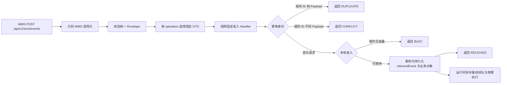
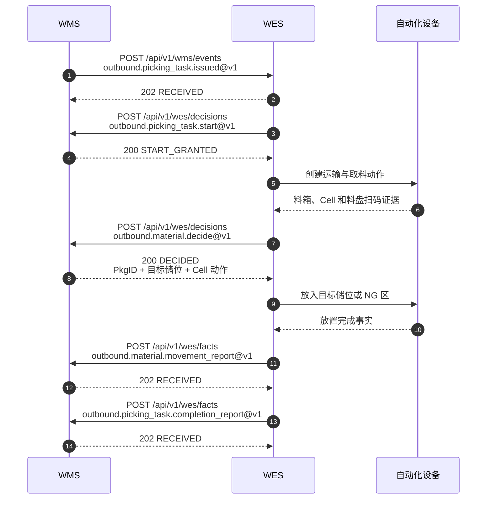
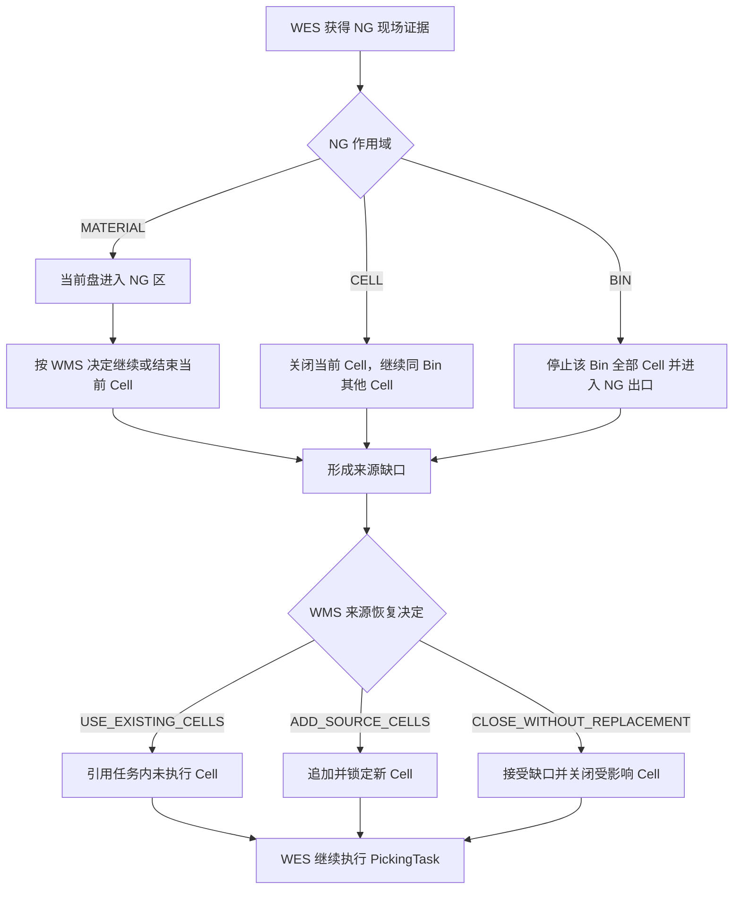

# WMS / WES 自动出库 PickingTask 交互草案

## 1. 文档定位

本文面向 WMS、WES 和联调开发人员，给出自动出库 PickingTask 的推荐 HTTP API、调用方向、JSON Payload、同步决定、
异步事实和异常恢复方式。WMS 内部继续自行负责订单、波次、库存校验和来源分配，WES 从本文定义的 PickingTask 开始执行。

本文初步冻结：

- 调用方、接收方、HTTP 方法和推荐路径。
- 统一 JSON 信封、HTTP 状态和幂等规则。
- PickingTask、启动锁、逐盘决定、NG、补充来源和执行事实的上下文 Payload。
- 正常流程、NG 恢复、结果未知和联调验收方式。

本文状态为双方评审草案。推荐路径和 Payload 可直接用于接口评审；认证方式、超时、Payload 上限、正式 JSON Schema 和
部署地址由双方书面确认后进入实施。

## 2. 五分钟接入概览

双方按以下顺序完成一次 PickingTask：

1. WMS 向 WES 发布 PickingTask，WES 原子持久化入站事件与 PickingTask，并返回接收 ACK。
2. WES 在工作线可启动时请求 WMS 锁定完整来源 Cell，WMS 返回启动决定。
3. 自动化设备扫码后，WES 请求 WMS 返回物料身份、目标储位和当前 Cell 的后续动作。
4. WES 完成每盘放置后向 WMS 报告位置变化事实。
5. NG 发生时，WES 报告现场证据，WMS 决定引用任务内 Cell、追加来源 Cell 或关闭缺口。
6. 全部已接纳 Cell 闭合后，WES 报告 PickingTask 本地执行完成事实。

### 2.1 参与方与职责

| 参与方 | 负责的事实 | 在本文中的动作 |
| --- | --- | --- |
| WMS | PickingTask、来源 Cell、来源锁、库存、`PkgID`、SixInOne、目标储位和 NG 业务决定 | 发布任务事件；响应启动、扫码和空取决定；接收执行事实 |
| WES | 工作线队列、执行对象、设备/位置证据、资源仲裁和可靠外部义务 | 接收任务；请求业务决定；执行授权动作；报告稳定事实 |
| RCS/AGV/CTU | 运输调度和运输终态 | 通过独立 Transport 合同与 WES 协作 |
| ECS/PLC/设备 | 扫码、抓取、放置、输送、安全互锁和设备终态 | 向 WES 提供现场证据，由 WES 转换为 WMS 业务请求或事实 |

WMS 向 WES 交付可执行的 PickingTask 和来源 Cell；WES 依据这些权威事实驱动物理执行。出库单、波次单和库存重新分配
继续留在 WMS 内部。

### 2.2 WMS Business Event 的处理模型

WMS 将业务事件发送到 `POST /api/v1/wms/events`。该入口是强类型事件接入网关，按版本化 `operation` 选择固定 DTO 和
准入 Handler。Handler 在同一事务内完成幂等、本地准入、入站证据和业务对象持久化后返回 ACK；后续排队和物理执行由
运行时异步推进。



`operation` 同时表达业务动作和合同版本。例如 `outbound.picking_task.issued@v1` 唯一映射到
`PickingTaskIssuedV1` DTO 和 `PickingTaskIssuedHandler`。入口使用代码中显式声明的封闭映射，不根据 Payload 反射调用方法。

WMS Business Event 使用 `operation + request_id + data.event_id` 建立业务身份；真实设备事件继续使用
`device_code + event_id + event_type` 和设备回调入口。`workline_code` 表达工作线路由，不承担设备身份职责。

## 3. 推荐 API 端点

### 3.1 端点矩阵

路径均相对于接收方的 Base URL。

- HTTP 消息使用 UTF-8 JSON；POST 设置 `Content-Type: application/json`，双方返回 `Content-Type: application/json`。
- GET 使用 path 参数且不发送 body。
- 接收方通过部署地址、网络边界和批准的认证配置识别调用方；Payload 只承载协议和业务字段。
- 每个接收方独立配置超时和最大 Payload，具体值在部署 profile 中确认。

| 发起方 | 接收方 | 方法 | 推荐路径 | 交互模式 | 承载内容 |
| --- | --- | --- | --- | --- | --- |
| WMS | WES | `POST` | `/api/v1/wms/events` | Event + 同步 ACK | PickingTask 发布、队列更新、来源恢复决定 |
| WMS | WES | `GET` | `/api/v1/wms/requests/{request_id}` | 结果查询 | 查询 WES 对原 WMS 请求保存的不可变响应 |
| WES | WMS | `POST` | `/api/v1/wes/decisions` | 同步决定 | 启动授权、逐盘扫码决定、空取决定 |
| WES | WMS | `POST` | `/api/v1/wes/facts` | 可靠事实 + 同步 ACK | Bin NG、逐盘位置变化、PickingTask 本地执行完成 |
| WES | WMS | `GET` | `/api/v1/wes/requests/{request_id}` | 结果查询 | 查询 WMS 对原 WES 请求保存的不可变响应 |

首版业务交互使用 `POST` 和 `GET`。`POST` 表达带幂等身份的事件、决定请求和事实报告；`GET` 读取既有请求的不可变响应
快照，并保持任务和执行状态不变。

### 3.2 Operation 与端点路由

| operation | POST 端点 |
| --- | --- |
| `outbound.picking_task.issued@v1` | WES `/api/v1/wms/events` |
| `outbound.picking_task.queue_changed@v1` | WES `/api/v1/wms/events` |
| `outbound.picking_task.source_recovery_decided@v1` | WES `/api/v1/wms/events` |
| `outbound.picking_task.start@v1` | WMS `/api/v1/wes/decisions` |
| `outbound.material.decide@v1` | WMS `/api/v1/wes/decisions` |
| `outbound.cell.empty_decide@v1` | WMS `/api/v1/wes/decisions` |
| `outbound.bin.ng_report@v1` | WMS `/api/v1/wes/facts` |
| `outbound.material.movement_report@v1` | WMS `/api/v1/wes/facts` |
| `outbound.picking_task.completion_report@v1` | WMS `/api/v1/wes/facts` |

### 3.3 HTTP 状态与业务结果

| HTTP 状态 | 使用场景 | 响应信封中的典型 `code` |
| --- | --- | --- |
| `200 OK` | 同步决定、重复请求、GET 结果查询 | `START_GRANTED`、`DECIDED`、`DUPLICATE`、`FOUND` |
| `202 Accepted` | Event 或 Fact 首次可靠接纳 | `RECEIVED` |
| `400 Bad Request` | JSON 或统一 Envelope 无法解析 | `REJECTED` |
| `404 Not Found` | GET 查询的 `request_id` 不存在 | `NOT_FOUND` |
| `409 Conflict` | 同一幂等 ID 对应不同 Payload | `CONFLICT` |
| `422 Unprocessable Entity` | operation、版本或专属 DTO 校验失败 | `REJECTED` |
| `429 Too Many Requests` | 接收队列瞬时背压 | `BUSY`，同时返回 `Retry-After` |
| `503 Service Unavailable` | 接收方暂时无法可靠处理 | `UNAVAILABLE` |

业务否决属于有效业务决定。例如 `START_REJECTED` 或物料 `REJECT` 使用 `200 OK`，调用方读取响应信封中的 `code` 和
`data` 执行后续动作。

### 3.4 请求结果查询

调用方在 POST 结果未知时，使用原 `request_id` 查询接收方保存的不可变响应：

```http
GET /api/v1/wms/requests/REQ-PICK-000001
```

```json
{
  "request_id": "REQ-PICK-000001",
  "code": "FOUND",
  "message": "Original response found",
  "timestamp": 1786060805000,
  "data": {
    "original_request_id": "REQ-PICK-000001",
    "operation": "outbound.picking_task.issued@v1",
    "response": {
      "request_id": "REQ-PICK-000001",
      "code": "RECEIVED",
      "message": "PickingTask persisted",
      "timestamp": 1786060800123,
      "data": {
        "event_id": "EVT-PICK-000001",
        "task_id": "PICK-20260807-001",
        "task_version": 1
      }
    }
  }
}
```

查询结果只返回原请求的接收或决定快照，不返回 PickingTask、Cell、运输或设备的当前运行状态。

## 4. 统一 JSON 信封

### 4.1 请求信封

```json
{
  "request_id": "REQ-20260807-000001",
  "operation": "outbound.picking_task.issued@v1",
  "timestamp": 1786060800000,
  "data": {}
}
```

| 字段 | 规则 |
| --- | --- |
| `request_id` | 一次逻辑请求的稳定幂等 ID；重试继续使用原值 |
| `operation` | 接收方已声明支持的 operation 名和版本 |
| `timestamp` | UTC Unix 毫秒 |
| `data` | operation 专属闭集 DTO；所有业务字段均放在该对象内 |

请求 Payload 是闭集，顶层只允许上述四个字段。WMS provider 身份属于服务端接入上下文，不作为可由调用方任意声明的
Payload 字段。

### 4.2 响应信封

```json
{
  "request_id": "REQ-20260807-000001",
  "code": "RECEIVED",
  "message": "Event persisted",
  "timestamp": 1786060800123,
  "data": {}
}
```

调用方同时读取 HTTP 状态与 `code`：HTTP 状态表达传输和协议处理结果，`code` 表达接收或业务决定。消息首次接纳返回
`202 / RECEIVED`；相同 `request_id` 和相同 Payload 重放返回 `200 / DUPLICATE`，接收方复用原处理结果；相同
`request_id` 与不同 Payload 返回 `409 / CONFLICT`。瞬时背压返回 `429 / BUSY`，调用方稍后使用原身份重试。

### 4.3 通用接收 ACK

| `code` | 含义 |
| --- | --- |
| `RECEIVED` | 首次可靠接收并持久化 |
| `DUPLICATE` | 相同业务 ID 和相同 Payload 已接收，复用原处理结果 |
| `REJECTED` | envelope、operation 或 DTO 校验失败，本次消息未形成有效业务输入 |
| `CONFLICT` | 相同业务 ID 对应不同 Payload |
| `BUSY` | 瞬时背压，消息尚未接纳；返回 `retryable=true`、`retry_after_ms` 和 HTTP `Retry-After` |

## 5. Operation 总览

| operation | 方向 | 模式 | 作用 |
| --- | --- | --- | --- |
| `outbound.picking_task.issued@v1` | WMS → WES | Event + 同步 ACK | 提前发布一张可排队 PickingTask |
| `outbound.picking_task.queue_changed@v1` | WMS → WES | Event + 同步 ACK | 更新未开始任务的排队参数 |
| `outbound.picking_task.start@v1` | WES → WMS | 同步决定 | 原子锁定来源 Cell 并授权开始 |
| `outbound.material.decide@v1` | WES → WMS | 同步决定 | 根据扫码证据返回物料、目标、Cell 后续动作或 NG |
| `outbound.cell.empty_decide@v1` | WES → WMS | 同步决定 | 根据可靠空取证据决定重试、等待或结束 Cell |
| `outbound.bin.ng_report@v1` | WES → WMS | 可靠事实 + 同步 ACK | 报告整箱不可执行及受影响 Cell |
| `outbound.picking_task.source_recovery_decided@v1` | WMS → WES | Event + 同步 ACK | 引用现有 Cell 或追加并锁定新的补充 Cell |
| `outbound.material.movement_report@v1` | WES → WMS | 可靠事实 + 同步 ACK | 报告逐盘确定位置变化或 NG 落点 |
| `outbound.picking_task.completion_report@v1` | WES → WMS | 可靠事实 + 同步 ACK | 报告全部已接纳 Cell 的本地执行已闭合 |

所有 operation 使用 `POST`，并按第 3.2 节选择端点。WMS、WES 分别在自己的 ingress 中根据 `operation` 选择固定 DTO，
完成验证后交给具名业务 Handler。

## 6. 主要交互时序

### 6.1 正常执行



### 6.2 NG 与来源恢复



## 7. PickingTaskIssued Event

调用：WMS → WES，`POST /api/v1/wms/events`。

### 7.1 WMS 请求 Payload

```json
{
  "request_id": "REQ-PICK-000001",
  "operation": "outbound.picking_task.issued@v1",
  "timestamp": 1786060800000,
  "data": {
    "event_id": "EVT-PICK-000001",
    "task_id": "PICK-20260807-001",
    "task_version": 1,
    "dispatch_sequence": 1024,
    "issued_at": 1786060799000,
    "not_before": 1786064400000,
    "workline_code": "SMT_OUTBOUND_01",
    "pick_cells": [
      {
        "cell_execution_id": "CELL-EXEC-001",
        "source_locator": {
          "type": "BIN_CELL",
          "rack_id": "RACK-5F-001",
          "rack_face": "A",
          "bin_id": "BIN-001",
          "cell_id": "CELL-01"
        }
      },
      {
        "cell_execution_id": "CELL-EXEC-002",
        "source_locator": {
          "type": "RACK_SLOT",
          "rack_id": "RETURN-RACK-001",
          "rack_face": "A",
          "slot_id": "SLOT-03"
        }
      },
      {
        "cell_execution_id": "CELL-EXEC-003",
        "source_locator": {
          "type": "BIN_CELL",
          "rack_id": "RACK-5F-001",
          "rack_face": "A",
          "bin_id": "BIN-001",
          "cell_id": "CELL-02"
        }
      }
    ]
  }
}
```

任务发布 Payload 只携带任务身份、排队参数、工作线和来源 Cell。`PkgID`、SixInOne、目标储位在逐盘决定阶段返回；
AGV/CTU 任务和缓存状态由 WES 本地执行对象管理。Cell 在启动授权阶段锁定，因此发布 Payload 不携带
`cell_lock_generation`。

`dispatch_sequence` 是 WMS 给出的同一工作线无歧义总序，WES 不再叠加本地优先级。`not_before` 可省略；存在时只表示
最早允许尝试启动，不是准点执行承诺。队首任务尚未到达 `not_before` 时保持等待，除非 WMS 后续显式授权尝试下一任务。

### 7.2 WES 接收 ACK

```json
{
  "request_id": "REQ-PICK-000001",
  "code": "RECEIVED",
  "message": "PickingTask persisted",
  "timestamp": 1786060800123,
  "data": {
    "event_id": "EVT-PICK-000001",
    "task_id": "PICK-20260807-001",
    "task_version": 1
  }
}
```

WES 同步校验信封、字段闭集、版本、身份唯一性、locator 结构、幂等冲突和本地工作线/队列容量。库存和来源业务资格沿用
WMS 已完成的校验结果，接收 ACK 即为该事件的准入结果。

接入网关识别 WMS provider 后按 `operation` 选择 PickingTask DTO，全程使用 WMS 业务上下文。真实设备上下文只在后续
创建并执行 `DeviceCommand` 时解析。

工作线队列已满时返回 `429 / BUSY`、`reason_code=WORKLINE_QUEUE_FULL`、`retryable=true`、`retry_after_ms` 和
`Retry-After`；该事件保持待提交，WMS 使用相同请求/事件 ID 和相同 Payload 重试。接收方只在事件转为 `RECEIVED` 后
建立稳定幂等结果。

## 8. 多任务队列与任务控制

队列更新调用：WMS → WES，`POST /api/v1/wms/events`。

- WMS 可以提前向 WES 下发多张 PickingTask。
- 不同工作线可以并行执行不同任务。
- 同一工作线可以有多张 `QUEUED` 任务，但同一时刻只允许一张任务处于 `STARTING | EXECUTING`。
- WMS 使用 `dispatch_sequence` 为同一工作线提供无歧义总序；WES 处理总序中的首个未开始任务。
- 队首任务未到 `not_before` 时阻塞同线后续任务；只有 WMS 显式授权时才可尝试下一任务。
- 任务进入启动阶段后锁定 Cell；获得 `START_GRANTED` 后创建该任务的机械臂动作和 CTU 投箱动作。
- 下一任务仍需通过设备、缓存、目标架和活动运输对象的本地准入检查。

未开始任务的 `dispatch_sequence` 或 `not_before` 只通过
`outbound.picking_task.queue_changed@v1` 更新，并携带稳定 `event_id + queue_revision`。任务载荷本身保持不可变；队列更新
只作用于 `QUEUED` 任务，执行中的任务继续运行到闭合。

```json
{
  "request_id": "REQ-QUEUE-000001",
  "operation": "outbound.picking_task.queue_changed@v1",
  "timestamp": 1786061000000,
  "data": {
    "event_id": "EVT-QUEUE-000001",
    "task_id": "PICK-20260807-001",
    "task_version": 1,
    "queue_revision": 2,
    "dispatch_sequence": 900,
    "not_before": 1786062600000,
    "changed_at": 1786060999900
  }
}
```

暂停、恢复和取消采用独立控制命令表达“请求已接收”和“现场已安全生效”两个时点。双方批准控制命令、结果报告和不可取消
窗口后再启用这三类操作；队列更新事件继续只负责 `dispatch_sequence` 和 `not_before`。

## 9. Start 同步锁定与启动

WES 本地准备就绪后请求 WMS 原子锁定任务的完整初始 Cell 集合。成功响应既是来源锁事实，也是任务启动授权，不再额外发送
`picking_task.started` 回调。

调用：WES → WMS，`POST /api/v1/wes/decisions`。

### 9.1 WES 请求

```json
{
  "request_id": "REQ-START-000001",
  "operation": "outbound.picking_task.start@v1",
  "timestamp": 1786064500000,
  "data": {
    "start_request_id": "START-REQ-000001",
    "source_event_id": "EVT-PICK-000001",
    "task_id": "PICK-20260807-001",
    "task_version": 1,
    "execution_id": "EXEC-PICK-000001",
    "workline_code": "SMT_OUTBOUND_01"
  }
}
```

### 9.2 WMS 授权

```json
{
  "request_id": "REQ-START-000001",
  "code": "START_GRANTED",
  "message": "Source cells locked",
  "timestamp": 1786064500100,
  "data": {
    "start_request_id": "START-REQ-000001",
    "task_id": "PICK-20260807-001",
    "task_version": 1,
    "execution_id": "EXEC-PICK-000001",
    "cell_set_revision": 1,
    "lock_generation": 1,
    "locked_cell_execution_ids": ["CELL-EXEC-001", "CELL-EXEC-002", "CELL-EXEC-003"],
    "target_rack": {
      "rack_id": "TRANSFER-RACK-001",
      "capacity": 40,
      "face_sequence": ["A", "B"],
      "open_face": "A",
      "face_window_generation": 1
    },
    "transport_targets": {
      "source_rack_ids": ["RACK-5F-001"],
      "return_rack_ids": ["RETURN-RACK-001"],
      "target_rack_ids": ["TRANSFER-RACK-001"]
    },
    "granted_at": 1786064500050
  }
}
```

WES 只有收到 `START_GRANTED` 后才进入 `EXECUTING`，并创建任务专属运输和设备动作。

暂时无法锁定时返回 `START_WAIT`，其中 `queue_action` 只能是：

- `HOLD_QUEUE`：保持该任务为当前候选，后续任务继续等待。
- `TRY_NEXT`：WMS 显式授权 WES 尝试同一工作线总序中的下一张任务。

```json
{
  "request_id": "REQ-START-000001",
  "code": "START_WAIT",
  "message": "Source cells temporarily unavailable",
  "timestamp": 1786064500100,
  "data": {
    "start_request_id": "START-REQ-000001",
    "decision_id": "START-DECISION-000001",
    "queue_action": "TRY_NEXT",
    "reason_code": "SOURCE_LOCK_BUSY",
    "retry_after_ms": 5000
  }
}
```

不可启动时返回 `START_REJECTED` 和封闭 `reason_code`。同一 `start_request_id` 重复提交返回同一锁代际和同一决定；
`START_WAIT` 需要重新求值时使用新的 `start_request_id` 并通过 `previous_decision_id` 关联上一决定，原响应保持不可变。

## 10. 逐盘扫码决定

调用：WES → WMS，`POST /api/v1/wes/decisions`。

### 10.1 WES 请求

```json
{
  "request_id": "REQ-MATERIAL-000001",
  "operation": "outbound.material.decide@v1",
  "timestamp": 1786065000000,
  "data": {
    "decision_request_id": "MAT-DECISION-REQ-000001",
    "task_id": "PICK-20260807-001",
    "task_version": 1,
    "execution_id": "EXEC-PICK-000001",
    "cell_execution_id": "CELL-EXEC-001",
    "lock_generation": 1,
    "scan_evidence_id": "SCAN-EVIDENCE-000001",
    "scan_codes": [
      {
        "code_type": "REEL_BARCODE",
        "value": "REEL-20260807-0099"
      }
    ],
    "scanned_at": 1786064999900
  }
}
```

`scan_codes[].code_type` 是双方批准的闭集。设备上报字段必须足以让 WMS 唯一确定一盘 `PkgID`。

### 10.2 接受结果

```json
{
  "request_id": "REQ-MATERIAL-000001",
  "code": "DECIDED",
  "message": "Material accepted",
  "timestamp": 1786065000100,
  "data": {
    "decision_request_id": "MAT-DECISION-REQ-000001",
    "decision_id": "MAT-DECISION-000001",
    "decision_version": 1,
    "result": "ACCEPT",
    "pkg_id": "PKG-000099",
    "six_in_one_code": "SIX-000099",
    "material_version": 12,
    "target_locator": {
      "rack_id": "TRANSFER-RACK-001",
      "rack_face": "A",
      "slot_id": "SLOT-A-05",
      "face_window_generation": 1
    },
    "cell_action": "CONTINUE"
  }
}
```

`cell_action` 使用 `CONTINUE | CELL_DONE`。`CELL_DONE` 表示当前盘完成物理放置后关闭该 Cell；当前盘仍按目标动作继续执行
到设备终态。

### 10.3 WAIT 与终局

`WAIT` 是不可变的非终局快照。恢复条件满足后，WES 使用新的 `decision_request_id`、同一 `scan_evidence_id` 和
`previous_decision_id` 请求下一版本。相同请求 ID 重发必须返回原快照。

同一 `scan_evidence_id` 对应一个不可变终局 `ACCEPT` 或 `REJECT`。结果缺失、迟到、版本倒退、无法关联或出现两个终局时，
WES 保持当前对象和资源未决，进入对账或人工处置。

## 11. 三类 NG

每次 NG 决定都通过 `ng_scope` 明确作用对象，并分别给出料盘、Cell 和 Bin 动作。

料盘/Cell NG 沿用逐盘决定端点；Bin NG 事实使用 WES → WMS 的 `POST /api/v1/wes/facts`。

| `ng_scope` | 含义 | 当前对象动作 | 同 Bin 其他 Cell | Bin 最终去向 |
| --- | --- | --- | --- | --- |
| `MATERIAL` | 当前料盘 NG | 当前盘进入 NG 区；WMS 决定当前 Cell 是否继续 | 不受影响 | 正常退箱 |
| `CELL` | 当前 Cell 内容与需求不匹配 | 当前盘进入 NG 区；当前 Cell 关闭 | 继续执行 | 完成其他 Cell 后进入 NG 出口 |
| `BIN` | 方向、条码或身份异常导致整箱不可信 | 整箱进入 NG 流程；全部 Cell 不可执行 | 全部不可执行 | 立即进入 NG 出口 |

### 11.1 料盘 NG

`outbound.material.decide@v1` 可以返回：

```json
{
  "request_id": "REQ-MATERIAL-000002",
  "code": "DECIDED",
  "message": "Material rejected",
  "timestamp": 1786065100100,
  "data": {
    "decision_request_id": "MAT-DECISION-REQ-000002",
    "decision_id": "MAT-DECISION-000002",
    "decision_version": 1,
    "result": "REJECT",
    "ng_scope": "MATERIAL",
    "reason_code": "MATERIAL_QUALITY_NG",
    "material_action": "MOVE_TO_NG",
    "cell_action": "CONTINUE",
    "bin_action": "KEEP_WORKING",
    "source_recovery": "NOT_REQUIRED"
  }
}
```

当前盘可靠进入 NG 区后，`CONTINUE` 才允许同一 Cell 取下一盘。

### 11.2 Cell NG

```json
{
  "request_id": "REQ-MATERIAL-000003",
  "code": "DECIDED",
  "message": "Cell material mismatch",
  "timestamp": 1786065150100,
  "data": {
    "decision_request_id": "MAT-DECISION-REQ-000003",
    "decision_id": "MAT-DECISION-000003",
    "decision_version": 1,
    "result": "REJECT",
    "ng_scope": "CELL",
    "reason_code": "CELL_MATERIAL_MISMATCH",
    "material_action": "MOVE_TO_NG",
    "cell_action": "CLOSE_AS_NG",
    "bin_action": "CONTINUE_OTHER_CELLS_THEN_NG",
    "source_recovery": "PENDING"
  }
}
```

Cell NG 时，WES 分别维护工作资格和最终出口，使同 Bin 其他 Cell 可以继续执行：

```text
work_eligibility = PARTIAL
exit_route = NG_EXIT
```

当前 Cell 物理 NG 闭合后停止执行；同 Bin 其他未完成 Cell 继续执行，最后将 Bin 移入 NG 出口。

### 11.3 Bin NG

方向错误、条码异常或身份冲突等设备证据使整个 Bin 不可信时，WES 不等待 WMS 才执行安全的 NG 路由，但必须可靠报告：

```json
{
  "request_id": "REQ-BIN-NG-000001",
  "operation": "outbound.bin.ng_report@v1",
  "timestamp": 1786065200000,
  "data": {
    "report_id": "BIN-NG-REPORT-000001",
    "task_id": "PICK-20260807-001",
    "task_version": 1,
    "execution_id": "EXEC-PICK-000001",
    "bin_execution_id": "BIN-EXEC-001",
    "bin_id": "BIN-001",
    "ng_evidence_id": "BIN-NG-EVIDENCE-001",
    "reason_code": "BIN_BARCODE_INVALID",
    "affected_cell_execution_ids": ["CELL-EXEC-001", "CELL-EXEC-003"],
    "work_eligibility": "NONE",
    "exit_route": "NG_EXIT",
    "occurred_at": 1786065199900
  }
}
```

WMS 返回通用接收 ACK。所有受影响 Cell 保持未闭合，直到 WMS 的来源恢复决定明确其关闭结果和替代来源。

## 12. 空取决定

设备对指定 Cell 给出可靠“无料”终态且没有产生扫码证据时，WES 调用
`outbound.cell.empty_decide@v1`，携带 `source_observation_id`、任务/Cell/锁代际、设备命令终态和发生时间。

调用：WES → WMS，`POST /api/v1/wes/decisions`。

WMS 只返回：

- `RETRY`：允许重新执行同一来源。
- `WAIT`：保持 Cell 和相关资源未决。
- `CELL_DONE`：允许在没有未决物料动作后关闭该 Cell。

设备结果未知或无法关联时，WES 保持 Cell 未决并进入设备结果对账；获得可靠“无料”终态后再调用空取决定。

请求和响应示例：

```json
{
  "request_id": "REQ-EMPTY-000001",
  "operation": "outbound.cell.empty_decide@v1",
  "timestamp": 1786065250000,
  "data": {
    "decision_request_id": "EMPTY-DECISION-REQ-000001",
    "task_id": "PICK-20260807-001",
    "task_version": 1,
    "execution_id": "EXEC-PICK-000001",
    "cell_execution_id": "CELL-EXEC-001",
    "lock_generation": 1,
    "source_observation_id": "EMPTY-EVIDENCE-000001",
    "command_result_id": "CMD-RESULT-EMPTY-000001",
    "observed_at": 1786065249900
  }
}
```

```json
{
  "request_id": "REQ-EMPTY-000001",
  "code": "DECIDED",
  "message": "Cell may be closed",
  "timestamp": 1786065250100,
  "data": {
    "decision_request_id": "EMPTY-DECISION-REQ-000001",
    "decision_id": "EMPTY-DECISION-000001",
    "decision_version": 1,
    "result": "CELL_DONE"
  }
}
```

## 13. 来源恢复与追加式补料

WMS 通过 `outbound.picking_task.source_recovery_decided@v1` 对 MATERIAL/CELL/BIN NG 给出来源恢复结果：

调用：WMS → WES，`POST /api/v1/wms/events`。

- `USE_EXISTING_CELLS`：引用当前 PickingTask 中尚未执行的 Cell，成员数量保持不变。
- `ADD_SOURCE_CELLS`：追加并锁定新的来源 Cell。
- `CLOSE_WITHOUT_REPLACEMENT`：明确关闭受影响 Cell，不补充来源。

来源恢复通过引用既有 Cell 或追加新的 `CellExecution` 表达。已接纳成员保持不可变；新增来源明确到 Cell，并形成新的
成员和锁代际。

| `action` | 必填字段 | 约束 |
| --- | --- | --- |
| `USE_EXISTING_CELLS` | `close_affected_cell_execution_ids`、`selected_existing_cell_execution_ids` | 被引用 Cell 必须属于当前已接纳集合且尚未开始 |
| `ADD_SOURCE_CELLS` | `close_affected_cell_execution_ids`、`cell_set_revision`、`lock_generation`、`additional_cells` | 只允许追加全新 CellExecution |
| `CLOSE_WITHOUT_REPLACEMENT` | `close_affected_cell_execution_ids` | 成员数量保持不变，WMS 明确接受缺口闭合 |

新增来源示例：

```json
{
  "request_id": "REQ-RECOVERY-000001",
  "operation": "outbound.picking_task.source_recovery_decided@v1",
  "timestamp": 1786065300000,
  "data": {
    "event_id": "EVT-RECOVERY-000001",
    "supplement_id": "SUPPLEMENT-000001",
    "task_id": "PICK-20260807-001",
    "task_version": 1,
    "execution_id": "EXEC-PICK-000001",
    "cause_ng_evidence_ids": ["BIN-NG-EVIDENCE-001"],
    "action": "ADD_SOURCE_CELLS",
    "close_affected_cell_execution_ids": ["CELL-EXEC-001", "CELL-EXEC-003"],
    "cell_set_revision": 2,
    "lock_generation": 2,
    "additional_cells": [
      {
        "cell_execution_id": "CELL-EXEC-NEW-001",
        "replaces_cell_execution_ids": ["CELL-EXEC-001", "CELL-EXEC-003"],
        "source_locator": {
          "type": "BIN_CELL",
          "rack_id": "RACK-5F-009",
          "rack_face": "A",
          "bin_id": "BIN-042",
          "cell_id": "CELL-03"
        }
      }
    ]
  }
}
```

追加规则：

- `supplement_id` 幂等；同 ID 不同 Payload 必须冲突。
- `cell_set_revision` 只能递增，追加内容形成新的不可变成员代际。
- WMS 发布 `ADD_SOURCE_CELLS` 前必须原子锁定新增 Cell，并返回仅属于该补充集合的 `lock_generation`。
- 若 WES 返回 `REJECTED` 或 `CONFLICT`，WMS 必须解除本次未生效的新增锁；只有 `RECEIVED | DUPLICATE` 表示补充集合已被 WES 接纳。
- 每个 CellExecution 始终使用自己所属的锁代际；新代际与旧 Cell 的在途响应并行有效。
- 已存在于任务中的 Cell 通过 `USE_EXISTING_CELLS` 引用，新增成员使用全新的 `cell_execution_id`。
- 新货架或新 Bin 尚未到位时，WES 创建独立 TransportTask；PickingTask 本地执行完成继续只聚合 CellExecution。
- 受影响 Cell 只有在物理 NG 去向确定且 WMS 恢复决定已到达后，才以 NG outcome 闭合。

## 14. 逐盘位置事实

WES 每完成一盘的正常 PUT 或 NG 放置，就可靠发送 `outbound.material.movement_report@v1`：

调用：WES → WMS，`POST /api/v1/wes/facts`。

```json
{
  "request_id": "REQ-MOVE-000001",
  "operation": "outbound.material.movement_report@v1",
  "timestamp": 1786065500000,
  "data": {
    "fact_id": "MOVE-FACT-000001",
    "task_id": "PICK-20260807-001",
    "task_version": 1,
    "execution_id": "EXEC-PICK-000001",
    "cell_execution_id": "CELL-EXEC-001",
    "material_execution_id": "MAT-EXEC-000001",
    "scan_evidence_id": "SCAN-EVIDENCE-000001",
    "pkg_id": "PKG-000099",
    "from_locator": {
      "type": "BIN_CELL",
      "rack_id": "RACK-5F-001",
      "bin_id": "BIN-001",
      "cell_id": "CELL-01"
    },
    "to_locator": {
      "type": "RACK_SLOT",
      "rack_id": "TRANSFER-RACK-001",
      "rack_face": "A",
      "slot_id": "SLOT-A-05"
    },
    "command_result_id": "CMD-RESULT-000001",
    "occurred_at": 1786065499900
  }
}
```

未唯一识别的 NG 料盘使用执行 ID、扫码证据和 NG 落点关联，`pkg_id` 保持为空。WMS 返回通用接收 ACK；WES 本地位置事实
继续以设备终态为依据。

## 15. PickingTask 本地执行完成

完成报告调用：WES → WMS，`POST /api/v1/wes/facts`。

PickingTask 的成员集合为：

```text
初始 START_GRANTED 锁定的 Cell
+ 后续 ADD_SOURCE_CELLS 接纳的 Cell
```

每个 CellExecution 使用统一 `COMPLETED` 状态和独立 outcome，例如：

```text
SUCCESS | NG_REPLACED | NG_CLOSED | UNAVAILABLE_BY_BIN_NG
```

本地完成条件为：

```text
ALL(已接纳 CellExecution.status == COMPLETED)
AND 不存在未决 NG / 来源恢复决定
```

完成条件只聚合已接纳 CellExecution 及未决 NG/来源恢复决定。条件满足后，WES 把任务执行投影置为
`EXECUTION_COMPLETED`，并让 Rack、Bin、AGV、CTU、工作位和清场对象继续由各自 owner 闭环。WMS 根据完成事实管理自己的
业务终态。

逐盘位置事实必须先被 WMS 接收，WES 才可靠发送 `outbound.picking_task.completion_report@v1`：

```json
{
  "request_id": "REQ-COMPLETE-000001",
  "operation": "outbound.picking_task.completion_report@v1",
  "timestamp": 1786066000000,
  "data": {
    "completion_report_id": "COMPLETE-REPORT-000001",
    "task_id": "PICK-20260807-001",
    "task_version": 1,
    "execution_id": "EXEC-PICK-000001",
    "final_cell_set_revision": 2,
    "execution_completed_at": 1786065999900,
    "cell_results": [
      {
        "cell_execution_id": "CELL-EXEC-001",
        "outcome": "UNAVAILABLE_BY_BIN_NG"
      },
      {
        "cell_execution_id": "CELL-EXEC-002",
        "outcome": "SUCCESS"
      },
      {
        "cell_execution_id": "CELL-EXEC-003",
        "outcome": "UNAVAILABLE_BY_BIN_NG"
      },
      {
        "cell_execution_id": "CELL-EXEC-NEW-001",
        "outcome": "SUCCESS"
      }
    ]
  }
}
```

WMS 对本地执行完成事实返回通用接收 ACK。后续任务和运输指令使用各自独立合同；WMS 自身的业务终态继续由 WMS 管理。

## 16. 幂等、版本与失败恢复

- 同一请求/事件/事实 ID 和相同 Payload 重发时，接收方返回 `DUPLICATE` 并复用原处理结果。
- `BUSY` 表示消息仍在调用方一侧待提交；调用方按 `retry_after_ms` 使用原身份重试，直到获得稳定接收结果。
- 同一 ID 对应不同 Payload 时，接收方返回 `409 / CONFLICT` 并保留最初接纳的内容。
- PickingTask 同一 `task_version` 保持原始 Payload 不变；队列参数更新使用独立 `queue_revision`。
- `lock_generation` 只作用于它锁定的 Cell 集合，各代际按所属 Cell 并行关联。
- `WAIT` 后续求值创建新请求，并通过 `previous_decision_id` 关联原决定；每次响应都是不可变快照。
- 同一扫码证据或来源观察只形成一个不可变终局决定。
- 超时、交付未知、响应非法、版本倒退或无法关联时，WES 保持相关资源占用，并使用 GET 结果查询、业务对账或人工处置恢复。
- `WmsClient` 每次只执行一次 HTTP/JSON 访问；可靠重试、Outbox、因果排序和状态推进由具体业务 owner 负责。

### 16.1 集中校验与拒绝规则

正文描述正常接入动作；以下表格集中定义协议边界：

| 输入情况 | HTTP / `code` | 接收方处理 |
| --- | --- | --- |
| WMS Event 携带 `device_code`、`command_code` 或 `task_type` | `422 / REJECTED`，`reason_code=WMS_EVENT_DEVICE_FIELD_FORBIDDEN` | 记录合同拒绝，不建立 PickingTask 或设备上下文 |
| `operation` 未声明或版本未知 | `422 / REJECTED`，`reason_code=OPERATION_NOT_SUPPORTED` | 返回支持版本信息，等待调用方修正 |
| Envelope 或 JSON 无法解析 | `400 / REJECTED` | 返回字段错误位置，等待调用方修正 |
| 同一幂等 ID 对应不同 Payload | `409 / CONFLICT` | 保留原请求和原响应快照 |
| PickingTask 发送到设备 `/api/v1/callback/event` | 设备入口按自身合同返回 `4xx` | WMS 使用 `/api/v1/wms/events` 重新提交 |
| 接收队列达到容量上限 | `429 / BUSY` | 返回 `Retry-After`，调用方使用原身份重试 |
| POST 响应未知 | 无法确认 | 调用方先 GET 查询原响应；查无记录后按 operation 的安全重提规则处理 |

## 17. 联调验收清单

| 场景 | 预期结果 |
| --- | --- |
| WMS 连续下发同线多任务 | WES 全部可靠排队，同线只启动一个任务 |
| WMS 下发不同工作线任务 | 不同工作线可并行启动 |
| 同线队首任务尚未到 `not_before` | 保持当前总序；收到 WMS `TRY_NEXT` 后尝试下一任务 |
| 同一 Event 重复提交 | 返回 `DUPLICATE`，任务数量保持不变 |
| 同一 ID 不同 Payload | 返回 `CONFLICT` |
| WMS Event 携带设备身份字段 | 返回 `422 / WMS_EVENT_DEVICE_FIELD_FORBIDDEN`，由 WMS 修正 Payload 后重提 |
| PickingTask 误投 `/api/v1/callback/event` | 设备入口返回 `4xx`，WMS 改投 `/api/v1/wms/events` |
| 正常 WMS Event 接入 | 准入 Handler 建立 WMS 业务上下文并原子持久化 PickingTask，运行时随后异步推进执行 |
| 工作线接收队列瞬时已满 | 返回 `429 / BUSY` 和 `Retry-After`，WMS 使用原身份重试 |
| 启动前 Cell 可锁定 | 返回 `START_GRANTED` 后 WES 才创建任务专属物理动作 |
| 启动暂时等待且 `HOLD_QUEUE` | 保持当前候选，后续任务继续等待 |
| 启动暂时等待且 `TRY_NEXT` | 按 WMS 显式授权尝试总序中的下一张任务 |
| 料盘 NG 且 Cell 可继续 | 当前盘进入 NG 区后继续当前 Cell |
| Cell NG | 当前 Cell 关闭；同 Bin 其他 Cell 继续；Bin 最终进入 NG 出口 |
| Bin NG | 整箱所有 Cell 停止执行并进入 NG 出口 |
| 补充来源已在任务内 | 通过 `USE_EXISTING_CELLS` 引用现有 Cell，成员数量保持不变 |
| 补充来源不在任务内 | 追加新成员代际和独立锁代际 |
| WMS 决定超时或无法关联 | 保持对象未决，通过 GET 查询、对账或人工处置恢复 |
| 全部已接纳 Cell 闭合 | 进入 `EXECUTION_COMPLETED` 本地执行投影，只聚合 CellExecution 和未决恢复决定 |
| 逐盘事实尚未被 WMS 接收 | 完成报告保持等待，逐盘事实接收后再发送 |

## 18. 正式实施前双方确认项

- 第 3 节推荐的五个 relative path，以及每项 operation 的 HTTP 状态集合和响应 media type。
- 认证方式；当前隔离网络采用 `NONE` 时，在部署配置中明确记录。
- DTO 正式 JSON Schema、字符串长度、数组上限、Payload 上限和枚举闭集。
- 超时、可重试性、最大重试窗口和交付未知后的查询/对账方式。
- 业务 `reason_code` 字典、人工处置流程和 SLA。
- 暂停、恢复、取消的控制命令、结果报告和不可取消窗口。
- 双方共享的成功、WAIT、NG、冲突、迟到消息和来源补充 fixture。
- WMS ingress 合同测试覆盖：静态 operation 分发、设备字段拒绝、WMS 业务上下文、设备入口误投和结果查询。

双方批准上述内容后，以正式 JSON Schema、具名 DTO、静态 operation 映射和合同 fixture 启动实现。
