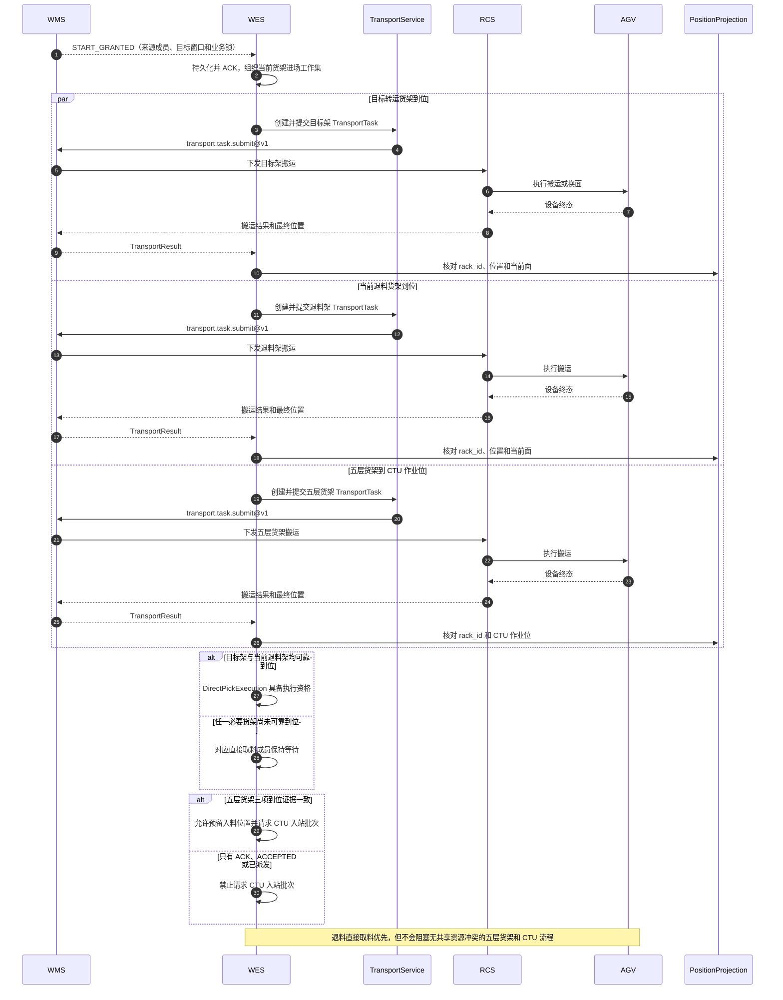
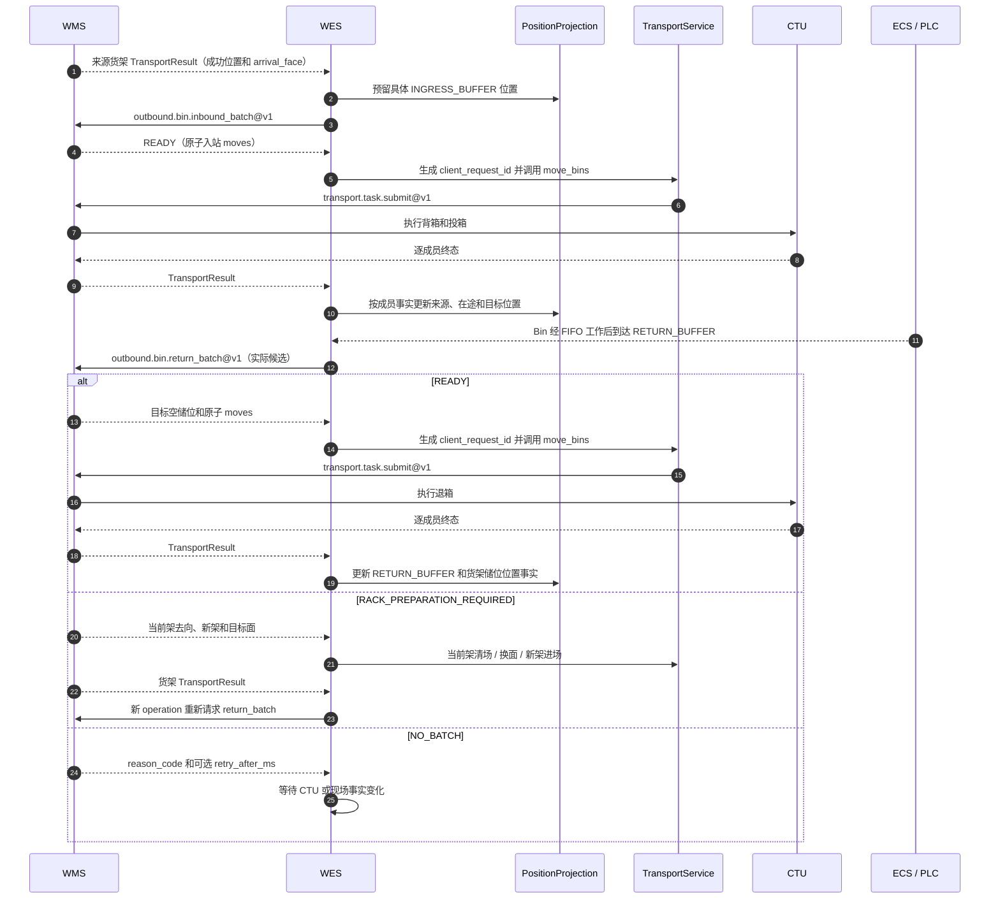

# WMS / WES 自动出库 PickingTask 交互要求

## 1. 文档定位

本文定义 WMS 与 WES 自动出库 PickingTask 的调用方向、推荐路径、Payload、幂等、异步启动和异常恢复。WMS 内部继续负责
订单、波次、库存、来源分配、转运货架容量和出库策略。WES 从 PickingTask 入队开始，负责工作线准入和物理执行。

本文是当前 wire 评审基线。系统尚未发布，本文不提供兼容字段或并行路径。

认证方式、字符串长度、数组上限和部署地址仍需双方在正式 JSON Schema 中确认；三个 POST relative path 的原始 Body 上限已
固定为 `256 KiB`。

## 2. 执行概览

一次 PickingTask 按以下顺序推进：

1. WMS 发布任务，WES 可靠入队，不分配来源和目标资源。
2. WES 从自动出库任务池选择当前最高优先级的可执行任务和一条就绪分拣机工作线，请求 WMS 启动。WMS 快速返回
   `START_ACCEPTED`。
3. WMS 异步计算并锁定五层货架、候选 Bin、退料货架 SLOT、目标转运货架和目标窗口；此时不计算货架动作或 CTU Bin 批次。
4. WMS 回调 `START_GRANTED | START_WAIT`。只有 `START_GRANTED` 允许 WES 创建运输和设备执行对象。
5. 目标转运货架、退料货架和五层货架按各自条件并行到位。五层货架到位后，WES 根据实际到达面和已预留入料位置请求 WMS
   计算一个 CTU 入站批次；退料直接取料优先，但不阻塞无资源冲突的 CTU 投箱。
6. CTU 可以乱序投箱。Bin 到达工作位并完成 SCAN2 后，WES 请求 WMS 返回该 Bin 的 Cell 工作计划。正常 Bin 到达
   `RETURN_BUFFER` 后，WES 再按实际候选请求 WMS 分配当前工作货架面的退箱批次和目标空储位。
7. WES 逐盘 PICK 和扫码，WMS 返回物料结果及精确目标 SLOT；需要换面或换架时，同一决定返回目标准备方案，WES 等待
   Transport 可靠到位后完成 PUT。
8. 全部直接取料成员和 Bin 工作成员闭合后，WES 报告本地任务完成。货架、Bin 和工作线继续独立清场。

### 2.1 参与方职责

| 参与方 | 负责内容 |
| --- | --- |
| WMS | PickingTask、任务池业务优先序、库存、来源分配、来源锁、转运货架容量、目标货架和 SLOT、物料资格、原子搬运批次、需求状态和来源恢复 |
| WES | 任务队列、本地准入、执行对象、位置和设备证据、共享资源仲裁、NG 物理范围和可靠回写 |
| RCS/AGV/CTU | 货架与 Bin 搬运、路径和运输终态 |
| ECS/PLC/设备 | 扫码、取放、滚筒输送、安全互锁和设备终态 |

WES 不接收出库单或波次，不计算库存和转运货架容量，也不为人工操作提供独立业务入口。WMS 人工操作通过任务发布和队列更新
进入正常流程。

自动出库的业务事实全部由 WMS 持有，包括搬运哪些业务对象以及一次搬运包含哪些成员。WES 持有本地执行事实，包括设备终态、
现场位置、缓存占用和 TransportTask 状态；这些事实用于执行门禁和回传，不能反向改写 WMS 业务决定。

## 3. 公共信封与幂等身份

三个方向统一使用以下请求顶层：

```json
{
  "operation_id": "019f12d0-58d7-7b4d-a23a-1b90aa5d4472",
  "operation": "outbound.picking_task.issued@v1",
  "timestamp": 1786060800000,
  "data": {}
}
```

响应顶层为：

```json
{
  "operation_id": "019f12d0-58d7-7b4d-a23a-1b90aa5d4472",
  "code": "RECEIVED",
  "timestamp": 1786060800123,
  "data": {}
}
```

请求和响应顶层都是严格闭集；字段生成方、时间口径和 ACK 规则统一遵守
[WMS 主动回调公共信封合同](wms-async-callback-envelope-contract.md)。operation 专属 `data` 只保留本合同中有明确事实来源和
程序消费者的字段，禁止透传自由扩展属性。

### 3.1 ID 分类、生成方与用途

ID 必须跟随事实所有权生成。生成方在 ID 首次离开本系统前，必须原子持久化该 ID、所属对象和不可变内容；接收方只能校验、
保存和引用，不能重新生成、按业务字段拼接或从 ID 反推语义。除本节明确规定为 UUIDv7 的字段外，ID 都是区分大小写的不透明
字符串，具体长度由正式 JSON Schema 统一约束。

`queue_revision`、`source_member_revision`、`source_lock_generation`、`face_window_generation` 和 `outcome_version` 是版本、顺序
或 fencing 计数，不是 ID。前四项由对应业务事实 owner 生成并通过相关 operation 传递；
`outcome_version` 由 WES Transport 在结果投影变化时生成，只能由 WES 请求引用或内部绑定，不由 WMS 回填。它们按各自
单调性规则校验，不能代替对象身份。

#### 3.1.1 消息交互与因果引用

| ID | 生成方 | 用途 | 规则 |
| --- | --- | --- | --- |
| `operation_id` | 原业务交互的发起方；WMS 主动事件由 WMS 生成，WES 请求和 Fact 由 WES 生成 | 标识一次请求、事件或 Fact 交互，并承担协议幂等 | 全局唯一 UUIDv7；首次发送前与 Payload 原子持久化；重试保持 ID 和 Payload 不变；关联型异步终局沿用上游请求 ID |
| `previous_operation_id` | 不生成新值，由重新求值请求引用直接前序 `operation_id` | 串联 `WAIT` 后的相邻重新求值 | 不是幂等身份；只能引用同 operation、同业务对象的直接前序请求，禁止跳号和跨对象引用 |
| `decision_operation_id` | 不生成新值，由 WES Fact 引用产生当前终局决定的 `operation_id` | 证明本次物料移动依据哪次 WMS 决定 | 不是新交互，也不参与 Fact 幂等；必须引用已接纳的终局决定 |

自动出库及其 Transport submit 的 WMS/WES 业务 JSON 都不定义 `event_id` 或 `request_id`。事件、同步决定、Fact 和 Transport
submit 统一只使用 `operation_id`。HTTP 中间件可以使用 `X-Request-ID` 记录一次访问，但该值不进入业务 Payload，也不参与幂等。

#### 3.1.2 任务、执行成员与现场证据

| ID | 生成方 | 用途 | 规则 |
| --- | --- | --- | --- |
| `task_id` | WMS | PickingTask 稳定业务身份 | 任务发布内容不可变；队列、来源成员、锁和目标窗口变化分别使用自己的 revision 或 generation，不增加恒为 `1` 的任务版本 |
| `execution_id` | WES | 当前 PickingTask 的一次本地执行实例 | 首次进入 `STARTING` 前生成并持久化；`START_WAIT` 后重新求值继续复用，WorkLine 绑定到 `START_GRANTED` 才冻结；不得跨任务复用 |
| `direct_pick_execution_id` | WMS | 一个退料货架 SLOT 的直接取料成员 | 在 `START_GRANTED` 或来源恢复中首次分配；与来源 locator 和锁代际一起不可变 |
| `bin_work_execution_id` | WMS | 一个候选 Bin 的业务取料成员 | 在 `START_GRANTED` 或来源恢复中首次分配；不能与物理 `bin_execution_id` 共用 |
| `bin_execution_id` | WES | 一次物理 Bin 进入工作线后的输送执行 | 建立物理 Bin 执行对象时生成；同一 Bin 再次进入工作线必须创建新执行实例 |
| `cell_execution_id` | WMS | SCAN2 后分配的一个 Cell 取料成员 | 在 `READY.cells[]` 中首次分配；绑定父 `bin_work_execution_id`、`cell_id` 和目标窗口后不可变 |
| `bin_scan_evidence_id` | WES | SCAN2 的 Bin 身份与到位证据 | 可靠扫码入账后生成；同一证据只能形成一个 `READY` 或 `NO_WORK` 终局 |
| `scan_evidence_id` | WES | 料盘扫码台的一次不可变六合一码证据 | 扫码快照可靠保存后生成；同一证据只能形成一个 `ACCEPT` 或 `REJECT` 终局 |
| `source_observation_id` | WES | 直接取料 SLOT 或 Cell 的一次可靠空取证据 | 与来源、位置和设备结果一起持久化；同一证据只能形成一个 `RETRY` 或 `SOURCE_DONE` 终局 |
| `bin_observation_id` | WES | 触发 Bin NG 的一次身份与方向准入观察 | 在 WES 原子保存 SCAN1/SCAN2 读码、已绑定身份和可靠方向结果后生成；同一观察不得复制第二个 ID，也不能在路由后改写 |
| `ng_evidence_id` | WES | 一次物理位置已确定的 NG 事实 | MATERIAL/CELL 在料盘可靠进入 `NG_ZONE` 后生成；Bin 每次可靠进入 `NG_EXIT` 时为该到位事实生成新的 ID。同一事实重试保持不变，不能改写作用域或影响成员 |
| `cause_ng_evidence_id` | 不生成新值，由 WES 复制已被 WMS 接纳的 `ng_evidence_id` | 把 CELL NG 后的 Bin 出口事实关联到前序料盘 NG 事实 | 只用于 `outbound.bin.ng_exit_report@v1` 的 `cause_scope=CELL` 分支；必须属于同一任务、Bin 和 Cell，不能引用未确认或物理去向未知的事实 |
| `command_result_id` | WES DeviceCommand 结果投影 | 引用支撑空取或位置变化的已接纳设备终态 | 只引用已经可靠持久化的结果；供应商原始回调幂等仍使用设备合同的 `source_event_id` |

`source_execution_id` 和 `cause.evidence_id` 都是对上述稳定 ID 的类型化引用，不产生新身份。判别字段必须先确定引用类型，
接收方不能仅凭字符串前缀猜测对象类型。

#### 3.1.3 WMS 业务决定与资源身份

| ID | 生成方 | 用途 | 规则 |
| --- | --- | --- | --- |
| `target_assignment_id` | WMS | 标识任务内一个不可变目标货架窗口 | 首次定义时绑定 `rack_id + rack_face + face_window_generation`；窗口变化必须生成新 ID，已有来源成员不被批量改写 |
| `rack_id`、`bin_id`、`cell_id`、`slot_id` | WMS 主数据 | 标识货架、Bin、Cell 和业务储位 | WES 只引用并结合 locator 校验，不生成、不解析字符串含义，也不从对象 ID 推导物理位置 |

WMS 的 `START_GRANTED`、同步决定或恢复事件以自身 `operation_id` 标识一份不可变业务决定。WES 在业务执行映射中引用该
`operation_id`，不再为决定内的每个货架或 Bin 搬运成员复制第二套 WMS 授权 ID。

#### 3.1.4 Transport 可靠执行身份

| ID | 生成方 | 用途 | 规则 |
| --- | --- | --- | --- |
| `client_request_id` | WES 自动出库业务 owner | WES 调用 Transport 的业务幂等号 | 首次形成一项确定搬运执行时生成全局唯一 UUIDv7，并与业务决定 `operation_id`、执行阶段、完整 Transport 输入原子持久化；重试和崩溃恢复不得换号 |
| `transport_task_id` | WES Transport 服务 | 标识可靠 TransportTask | 首次接纳 `client_request_id` 时生成；相同请求返回原 ID；运输 ACK、结果和恢复都引用该 ID |

自动出库不向 Transport DTO 增加 `correlation_id`；业务 owner 通过业务执行映射关联一张 PickingTask 下的多个
`transport_task_id`，Transport 继续只解释搬运对象。

Transport submit 同样使用第 3.1.1 节的 `operation_id`。WES Transport 在首次形成某个 TransportTask 的不可变提交时生成并
持久化该 ID；安全重提保持原 `operation_id` 和原 Payload。WMS 的每条 Transport evidence 使用各自新的 `operation_id`，并通过
`transport_task_id` 关联任务。详细规则以 Transport 履约合同为准。

### 3.2 operation_id 幂等规则

`operation_id` 是唯一消息交互身份：

- 发起方在首次提交前生成 UUIDv7，并与 Payload 一起持久化。
- 相同业务交互的超时、背压和未知响应重试使用原 ID 和原 Payload。
- 异步终局结果沿用原请求的 `operation_id`。
- WMS 主动发布的任务、队列更新、来源恢复和 Transport 恢复事件由 WMS 生成 `operation_id`。
- WES 发起的启动、CTU 入站/退箱批次、货架清场决定、Bin 计划、逐盘决定、空取、事实报告和 Transport submit 由 WES 生成
  `operation_id`。
- 幂等身份是 `operation + operation_id`。同身份同 Payload 按交互模式重放：同步决定和启动请求返回首次完整响应，Event、Fact
  和异步回调返回 `DUPLICATE`；同身份不同 Payload 返回 `CONFLICT`。

三个 POST relative path 的原始 Body 上限都固定为 `256 KiB`。请求不是合法 JSON，或无法提取合法 UUIDv7 `operation_id` 时，
接收方返回空响应体 `400`；原始 Body 超限时，在 JSON 解码前返回空响应体 `413`。两者均尚未建立消息关联，因此不使用响应
信封，也不能生成或猜测替代 ID。能够解析合法 `operation_id` 后，所有响应才使用第 3 节严格信封并原样回显该值。更小的
operation 专属限制只能作为 DTO 校验返回 `422 / REJECTED`。

以下同步请求支持 `WAIT` 后重新求值，`previous_operation_id` 固定放在请求 `data` 中：

| operation | 因果链身份 |
| --- | --- |
| `outbound.picking_task.start@v1` | `task_id + execution_id` |
| `outbound.bin.work_plan@v1` | `bin_scan_evidence_id` |
| `outbound.material.decide@v1` | `scan_evidence_id` |
| `outbound.source.empty_decide@v1` | `source_observation_id` |
| `outbound.rack.clearance_decide@v1` | `task_id + execution_id + rack_id + clearance_reason` |

首次请求禁止携带 `previous_operation_id`；收到 `WAIT` 后的下一次重新求值必须携带，并引用同一 operation、同一因果链身份的
直接前序请求。跳过中间请求、跨任务或跨证据引用均返回 `CONFLICT`。这五类请求的严格 `data` DTO 均把
`previous_operation_id` 定义为上述条件可选字段，其他 operation 禁止携带。

### 3.3 时间字段来源与用途

| 字段 | 生成方与生成时点 | 用途与规则 |
| --- | --- | --- |
| 顶层 `timestamp`（请求、Event、Fact） | 发送方在首次形成并可靠保存不可变交互时写入 WES 或 WMS 服务器的 UTC Unix 毫秒时间 | 只用于审计和链路诊断；重试保持原值，不参与业务排序、fencing、超时或设备事实判断 |
| 顶层 `timestamp`（同步响应） | 应答方在首次形成并可靠保存完整决定或 ACK 时写入服务器 UTC Unix 毫秒时间 | 幂等重放返回首次响应原值，不按 HTTP 尝试刷新；只用于审计和诊断 |
| `not_before` | WMS 在任务发布或队列调整时写入 UTC Unix 毫秒时间 | 可选最早启动门禁；参与任务池可执行性判断，不参与队列排序或消息幂等 |
| `scanned_at` | WES 在扫码证据可靠持久化时写入 WES 服务器时间 | 表示证据入账时间，不是扫码器原始时间，不参与业务排序或超时 |
| `observed_at` | WES 在空取观察可靠持久化时写入 WES 服务器时间 | 表示空取证据入账时间，不替代 `command_result_id` 的设备终态 |
| `occurred_at` | WES 接纳确定设备终态并形成规范化 Fact 时写入 WES 服务器时间 | 表示 WES 事实形成时间；供应商原始设备时间如有，保留在设备证据中，不复制到本业务 wire |
| `execution_completed_at` | WES 在任务聚合首次迁移为 `EXECUTION_COMPLETED` 时写入 WES 服务器时间 | 表示本地业务执行完成时间；重提完成报告保持原值，不包含退箱或清场完成含义 |

业务先后分别由 `dispatch_sequence`、revision、generation、已接纳事实和 Transport/Device 终态表达，不得比较上述时间戳推导
顺序。各 operation 不再增加与顶层 `timestamp` 同源且没有独立消费者的 `issued_at`、`changed_at` 或 `granted_at`。

### 3.4 业务编码与位置编码来源

| 字段 | 权威来源 | 使用规则 |
| --- | --- | --- |
| `workline_code` | WES 静态工作线拓扑，由双方配置并共同识别 | 只由 WES 在启动请求中填写本次候选执行线；WMS 据此使用该线关联的 STATION 和业务位置计算资源。任务发布和队列更新禁止携带 |
| `HANDOFF_POSITION.location_code` | WES 静态工作线拓扑和 `PositionProjection` | WES 只能提交当前工作线已配置的交接位；WMS 原样引用，不能生成临时位置编码 |
| `NG_ZONE.zone_code` | WES 静态工作线 NG 拓扑和 `PositionProjection` | WES 根据可靠物理去向报告；WMS 不根据业务异常码猜测 NG 区 |
| `RACK_POSITION.location_code` | WMS/RCS 全局货架位置事实，经 Transport evidence 投影到 WES `PositionProjection` | 初始进场时 WES 只读取当前可靠投影和 WorkLine 固定工作位；非固定清场去向由 WMS 同步决定给出，WES 不拼接或猜测编码 |
| `rack_id`、`bin_id`、`cell_id`、`slot_id` | WMS 货架、Bin、Cell 和储位主数据 | WES 只引用并结合判别联合校验，不从 ID 字符串反推物理位置 |

`reason_code` 由当前 operation 的决定方根据已经持久化的业务、资源或协议事实生成，必须使用该 operation 定义的稳定闭集值，
不能由接收方补写，也不能用自由文本替代。它只解释决定原因，不承担状态、幂等或恢复版本职责。

`source_locator`、`target_locator` 和批次成员位置即使可以通过对象关联查询，也必须保留为业务决定形成时的不可变位置快照。它们用于
跨系统 fail-closed 校验：对象身份正确但位置已变化时必须拒绝执行，不能只凭 ID 继续搬运。

## 4. API 端点

### 4.1 端点矩阵

| 发起方 | 接收方 | 方法和路径 | 模式 | 用途 |
| --- | --- | --- | --- | --- |
| WMS | WES | `POST {{WES_BASE_URL}}/api/v1/wms/events` | Event + ACK | 任务发布、队列更新、启动结果、来源恢复、Transport 恢复 |
| WES | WMS | `POST {{WMS_BASE_URL}}/api/v1/wes/decisions` | 决定或接纳 ACK | 启动、CTU 入站/退箱批次、货架清场去向、Bin 工作计划、逐盘决定、空取决定 |
| WES | WMS | `POST {{WMS_BASE_URL}}/api/v1/wes/facts` | 同步事实确认 | Bin NG 出口到位、逐盘位置、任务完成 |

`{{WES_BASE_URL}}` 和 `{{WMS_BASE_URL}}` 是当前环境的服务 Origin，末尾不带 `/`。应用实际注册相对路径。

### 4.2 Operation 总览

| operation | 方向 | 模式 | 作用 |
| --- | --- | --- | --- |
| `outbound.picking_task.issued@v1` | WMS 到 WES | Event + ACK | 发布可排队 PickingTask |
| `outbound.picking_task.queue_changed@v1` | WMS 到 WES | Event + ACK | 修改未开始任务的业务优先序或最早启动时间 |
| `outbound.picking_task.start@v1` | WES 到 WMS | 接纳 ACK | 请求 WMS 异步计算和锁定资源 |
| `outbound.picking_task.start_decided@v1` | WMS 到 WES | Event + ACK | 返回 `START_GRANTED` 或 `START_WAIT` |
| `outbound.bin.inbound_batch@v1` | WES 到 WMS | 同步决定 | 货架到位后，根据实际货架面和已预留入料位置返回一个 CTU 入站批次 |
| `outbound.bin.return_batch@v1` | WES 到 WMS | 同步决定 | 根据 `RETURN_BUFFER` 实际候选和当前工作货架空储位返回退箱批次或货架准备方案 |
| `outbound.rack.clearance_decide@v1` | WES 到 WMS | 同步决定 | 货架满足本地清场门禁后返回非固定业务去向，或暂时等待 |
| `outbound.bin.work_plan@v1` | WES 到 WMS | 同步决定 | 为实际到达 SCAN2 的 Bin 返回 Cell 工作计划 |
| `outbound.material.decide@v1` | WES 到 WMS | 同步决定 | 返回物料结果、精确目标 SLOT 和可选目标准备方案 |
| `outbound.source.empty_decide@v1` | WES 到 WMS | 同步决定 | 根据直接取料 SLOT 或 Cell 的可靠空取证据决定来源后续动作 |
| `outbound.bin.ng_exit_report@v1` | WES 到 WMS | 同步事实确认 | 报告 Bin 已可靠到达 `NG_EXIT`；区分 CELL NG 后的物理离场与 BIN NG |
| `outbound.picking_task.source_recovery_decided@v1` | WMS 到 WES | Event + ACK | 不追加来源或追加直接取料和候选 Bin |
| `outbound.picking_task.transport_recovery_decided@v1` | WMS 到 WES | Event + ACK | 为位置明确且确定失败的 Transport 下发可执行替代方案 |
| `outbound.material.movement_report@v1` | WES 到 WMS | 同步事实确认 | 报告一盘物料的确定位置变化 |
| `outbound.picking_task.completion_report@v1` | WES 到 WMS | 同步事实确认 | 报告 PickingTask 本地执行完成 |

### 4.3 HTTP 状态

| HTTP / `code` | 含义 |
| --- | --- |
| `200 / DECIDED` | 同步业务决定完成 |
| `200 / RECORDED` | Fact 首次提交已完成 operation 专属业务事务，不需要后续结果回调 |
| `200 / DUPLICATE` | Event、Fact 或异步回调的相同身份和相同 Payload 已可靠接纳 |
| `202 / RECEIVED` | Event 或异步回调首次可靠持久化，业务应用可以在 ACK 后继续 |
| `202 / START_ACCEPTED` | 启动请求已可靠持久化，资源计算尚未完成 |
| `400`，空响应体 | 请求不是合法 JSON，或无法提取合法 `operation_id` |
| `413`，空响应体 | 原始 Body 超过当前 POST relative path 的 `256 KiB` 上限，在解码前拒绝 |
| `422 / REJECTED` | 已有合法 `operation_id`，但信封其余字段、operation 或 DTO 不合法 |
| `409 / CONFLICT` | 相同身份对应不同 Payload，或违反不可变业务约束 |
| `429 / BUSY` | 暂时没有接收容量，`data.retry_after_ms` 给出重试延迟 |
| `503 / UNAVAILABLE` | 当前无法可靠持久化或处理 |

业务否决仍使用 `200 / DECIDED`。调用方读取 `data.result`，不能只根据 HTTP 状态判断业务结果。

重放结果按交互模式固定：同步决定使用原 `operation_id` 和原 Payload 重试时，接收方必须返回首次完整
`200 / DECIDED` 响应；启动请求重试必须返回首次完整 `202 / START_ACCEPTED` 响应。`DUPLICATE` 只用于不需要返回业务决定的
Event、Fact 和异步回调接收 ACK，不能替代 CTU 批次、Bin 工作计划、目标 SLOT 或空取结果。

### 4.4 同步决定与同步事实确认

`/wes/decisions` 由 operation 决定交互模式：只有 `outbound.picking_task.start@v1` 是接纳 ACK 加异步终局；CTU 入站批次、
CTU 退箱批次、货架清场去向、Bin 工作计划、逐盘扫码决定和来源空取决定都必须在当前 HTTP 响应中返回完整
`200 / DECIDED`。这些响应只形成不可变业务决定；WES 接纳后独立创建 TransportTask，物理搬运终态继续由 Transport result
回调表达，不增加批次执行回调。

`/wes/facts` 的三个 operation 都是同步事实确认。WMS 必须在返回 `200 / RECORDED` 前完成以下动作：

1. 校验信封、幂等身份、DTO、关联对象和不可变业务约束。
2. 在一个业务事务中保存规范化 Payload 摘要和 Fact，并提交该 operation 要求的 WMS 业务状态变化。
3. 保证后续同任务决定能够读取本次已提交事实，然后返回同步响应。

`RECORDED` 不表示存在后续异步结果。逐盘移动事实必须在响应前更新 WMS 权威物料位置及相关库存/目标占用状态；任务完成事实
必须在响应前形成 WMS 可读取的完成确认。Bin NG 出口 Fact 在响应前可靠入账，来源恢复仍由独立
`outbound.picking_task.source_recovery_decided@v1` Event 表达。WMS 内部与本次事实无关的统计、审计导出可以异步执行，但不能
影响后续业务决定的因果可见性。

WES 收到 `RECORDED | DUPLICATE` 后才允许推进依赖该 Fact 的下一业务动作。响应未知、`BUSY` 或 `UNAVAILABLE` 时保持现场事实
和资源占用，使用原 `operation_id`、原 Payload 重试；不等待另一个回调，也不创建新事实身份。

## 5. PickingTask 发布与队列

### 5.1 PickingTaskIssued

```json
{
  "operation_id": "019f12d0-58d7-7b4d-a23a-1b90aa5d4472",
  "operation": "outbound.picking_task.issued@v1",
  "timestamp": 1786060800000,
  "data": {
    "task_id": "PICK-20260807-001",
    "queue_revision": 1,
    "dispatch_sequence": 1024,
    "not_before": 1786064400000
  }
}
```

任务发布只携带身份和排队信息。禁止出现 `workline_code`、来源货架、候选 Bin、Cell、退料 SLOT、`PkgID`、目标货架、
目标 SLOT、容量、Transport 或设备字段。所有分拣机工作线物理结构相同并属于同一自动出库执行池，WMS 不在发布阶段指定
具体执行线。

WES 原子持久化入站证据和 PickingTask 后返回 `202 / RECEIVED`。队列已满时返回 `429 / BUSY`，WMS 使用原
`operation_id` 和原 Payload 重试。

任务发布固定建立 `queue_revision=1`。后续 `queue_changed` 必须从 `2` 开始连续递增。
同一 `task_id` 的首次接纳内容是唯一真源；使用另一 `operation_id` 重复发布同一任务，无论 Payload 是否相同，都返回
`409 / CONFLICT`。允许变化的排队字段只能通过 `queue_changed` 更新，当前合同不定义 PickingTask 内容修订。
`not_before` 省略表示没有 WMS 时间门禁。`queue_changed` 携带该字段时替换当前值，省略时保持不变；需要立即放行时，WMS
发送不晚于当前时间的新值，不使用 `null` 或额外清除字段。

### 5.2 队列规则

- 所有 `QUEUED` PickingTask 进入同一个自动出库任务池；`dispatch_sequence` 是该池内的 WMS 业务优先序。
- 任务池中的 `dispatch_sequence` 必须互不重复；发布或更新造成碰撞时返回 `409 / CONFLICT`，WES 不自建第二业务排序键。
- 每条分拣机工作线同一时刻最多绑定一张 `STARTING | EXECUTING` 任务；不同工作线可以并行启动和执行不同任务。
- WES 先过滤未到 `not_before`、已经被领取或当前没有任何就绪工作线可以准入的任务，再选择
  `dispatch_sequence` 最小的可执行任务。暂时不可执行的前序任务不阻塞后续可执行任务；`dispatch_sequence` 是优先级，不是
  跨任务完成依赖。
- WES 从无活动任务且通过设备、工作位、缓存和 Transport 准入的分拣机工作线中，按本地
  `available_since ASC → workline_code ASC` 选择候选执行线。`available_since` 是 WES 本地工作线就绪事实，不进入 WMS wire。
- 任务领取和工作线候选保留必须在一个事务中完成，保证同一任务不会被两条线领取、同一工作线不会同时保留两张任务。
- WMS 人工选择其他任务时，必须先更新其业务优先序或 `not_before`；WES 没有人工启动入口。

当前分拣机工作线具有相同物理结构和各自关联的 STATION，因此首版不增加 `workline_group_code`、能力标签、动态评分或通用
调度策略。业务将来出现真实的工作线能力差异时，再增加业务路由约束；WMS 仍不直接指定具体 WorkLine。

队列更新示例：

```json
{
  "operation_id": "019f12d1-1198-72cb-a980-d83af6ab9df8",
  "operation": "outbound.picking_task.queue_changed@v1",
  "timestamp": 1786061000000,
  "data": {
    "task_id": "PICK-20260807-001",
    "queue_revision": 2,
    "dispatch_sequence": 900,
    "not_before": 1786061000000
  }
}
```

`queue_revision` 必须连续递增。队列更新只作用于 `QUEUED` 任务，不能抢占 `STARTING | EXECUTING` 任务。
同一任务的 `queue_changed` 必须串行发布；前一 revision 取得稳定 `RECEIVED | DUPLICATE` 前，WMS 不得生成或发布下一
revision。`BUSY | UNAVAILABLE` 或响应未知期间只重提原 `operation_id` 和原 Payload。
除同一 `operation + operation_id + Payload` 的幂等重放外，`queue_revision <= current` 或 `> current + 1` 都返回
`409 / CONFLICT` 且不修改队列；字段类型、正整数范围或必填字段错误返回 `422 / REJECTED`。

## 6. 异步启动

### 6.1 WES 启动请求

WES 按第 5.2 节原子领取当前最高优先级的可执行任务并保留候选工作线后，持久化 `operation_id`，把任务迁移到
`STARTING`，然后发送：

```json
{
  "operation_id": "019f12d2-0d12-75e3-ae06-2b12316631e2",
  "operation": "outbound.picking_task.start@v1",
  "timestamp": 1786064500000,
  "data": {
    "task_id": "PICK-20260807-001",
    "execution_id": "EXEC-PICK-000001",
    "workline_code": "SMT_OUTBOUND_01"
  }
}
```

WMS 只在请求已可靠持久化后返回：

```json
{
  "operation_id": "019f12d2-0d12-75e3-ae06-2b12316631e2",
  "code": "START_ACCEPTED",
  "timestamp": 1786064500100,
  "data": {}
}
```

`START_ACCEPTED` 不是业务启动终局。WES 保持 `STARTING`，不能创建 TransportTask、DeviceCommand、DirectPickExecution、
BinWorkExecution 或 CellExecution。

启动请求的 `workline_code` 由 WES 从本地静态工作线拓扑读取，表示本次候选执行线。它在同一 `operation_id` 的请求、重试和
异步终局期间保持不变；WMS 使用该线关联的 STATION、货架工作位和交接位置计算资源，不能替换为另一条线。任务发布没有
`workline_code`，因此这里不存在对 WMS 发布值的回显或一致性比较。

`START_ACCEPTED` 后候选工作线继续保留，不能在等待异步终局时分配给其他任务。`START_GRANTED` 接纳事务把候选绑定冻结为
当前 `execution_id` 的正式 WorkLine；只有此后才能创建该线的业务成员、TransportTask 和 DeviceCommand。

### 6.2 WMS 资源计算

WMS 在后台完成：

- 当前任务的库存和出库策略计算。
- 根据启动请求中的 `workline_code` 选择该分拣机工作线关联的 STATION、货架工作位和交接位置。
- 一个或多个五层来源货架及候选 Bin 分配。
- 一个或多个退料货架、货架面和具体 SLOT 分配。
- 来源货架独占和来源成员锁定。
- 转运货架、目标面、尺寸兼容和容量预留。
- 初始目标窗口、来源成员和相关业务资源锁。

WMS 在启动阶段只冻结候选 Bin 及其来源位置，不生成 CTU 入站或退箱批次。CTU 批次必须等待五层货架实际到达面、WES
滚筒缓存预留、CTU 背篓可用量和退箱候选事实具备后，再通过第 7.2 节同步决定生成。

WMS 可以使用多个短事务完成内部编排，但不能向 WES 暴露半成品。`START_GRANTED` 表示完整业务快照已经生效，
`START_WAIT` 表示没有可执行的部分结果。货架如何进场、何时进场和并行到什么程度由 WES 在接纳启动结果后决定。

### 6.3 START_GRANTED

WMS 通过 WES 事件入口回调，并沿用启动请求的 `operation_id`：

```json
{
  "operation_id": "019f12d2-0d12-75e3-ae06-2b12316631e2",
  "operation": "outbound.picking_task.start_decided@v1",
  "timestamp": 1786064515000,
  "data": {
    "task_id": "PICK-20260807-001",
    "execution_id": "EXEC-PICK-000001",
    "result": "START_GRANTED",
    "source_member_revision": 1,
    "source_lock_generation": 1,
    "direct_picks": [
      {
        "direct_pick_execution_id": "DIRECT-PICK-001",
        "source_locator": {
          "type": "RACK_SLOT",
          "rack_id": "RETURN-RACK-001",
          "rack_face": "A",
          "slot_id": "SLOT-03"
        },
        "target_assignment_id": "TARGET-WINDOW-001"
      }
    ],
    "bin_works": [
      {
        "bin_work_execution_id": "BIN-WORK-001",
        "source_rack_face": "A",
        "source_locator": {
          "type": "RACK_BIN_SLOT",
          "rack_id": "RACK-5F-001",
          "slot_id": "SLOT-A-01"
        },
        "bin_id": "BIN-001"
      },
      {
        "bin_work_execution_id": "BIN-WORK-002",
        "source_rack_face": "A",
        "source_locator": {
          "type": "RACK_BIN_SLOT",
          "rack_id": "RACK-5F-001",
          "slot_id": "SLOT-A-02"
        },
        "bin_id": "BIN-002"
      }
    ],
    "target_assignments": [
      {
        "target_assignment_id": "TARGET-WINDOW-001",
        "rack_id": "TRANSFER-RACK-001",
        "rack_face": "A",
        "face_window_generation": 1
      }
    ]
  }
}
```

`direct_picks` 和 `bin_works` 都是条件可选字段；出现时必须包含 `1..N` 个成员，禁止发送空数组。两者至少出现一个。
没有任何来源成员的 `START_GRANTED` 返回 `422 / REJECTED`，不能依靠空集合直接完成任务。

`target_assignments` 必须包含 `1..N` 个初始目标窗口。WMS 在启动快照生效前已经为这些窗口完成目标货架、货架面和兼容容量
预留，不能发布“有来源、无目标”的 `START_GRANTED`。启动决定只分配并锁定业务资源，不携带货架搬运动作、Transport 输入、
清场去向或 TransportTask。WES 可靠接纳并返回 ACK 后，才依据当前 `PositionProjection`、WorkLine 固定工作位和本地资源门禁
组织初始货架进场。

WES 首批只为当前需要的目标转运货架、当前可执行退料货架和首个五层货架创建 TransportTask；其他已分配货架保持等待。货架
已经以批准面可靠位于对应工作位时直接准入，不得为形成任务而重复搬运。初始进场的来源位置必须取自 WMS/RCS 已确认并投影到
WES 的当前可靠位置，目标位置必须是当前 WorkLine 为该货架角色配置的固定工作位；任一位置未知都禁止创建 TransportTask。

`source_lock_generation` 冻结到本次创建的每个 `DirectPickExecution` 和 `BinWorkExecution`。后续来源恢复只为新增成员绑定
新的代际，不改写既有成员。Cell 继承父 `BinWorkExecution` 的代际，`READY.cells[]` 不重复该字段；工作计划、逐盘决定和空取
请求中的 `source_lock_generation` 必须与来源成员一致。

每个 `BinWorkExecution.source_locator` 是 WMS 冻结的精确 `RACK_BIN_SLOT`，WES 不从 `bin_id` 推导来源。`START_GRANTED` 只建立
候选来源成员、目标窗口和业务锁，不包含货架动作、`bin_batches`、`bin_returns` 或其他 Transport 执行对象。

`source_rack_face` 由 WMS 从货架与储位主数据读取，并在锁定 `source_locator` 时一并冻结，用于货架实际到位后的当前面准入。
它必须与该 `RACK_BIN_SLOT` 所属货架面一致；WES 只校验，不从 `slot_id` 字符串推导货架面。

WES 在创建每项货架或 Bin TransportTask 前，必须以“业务决定 `operation_id`、执行阶段、确定成员和方向”为业务唯一键，原子
保存完整 Transport 输入、新生成的 `client_request_id` 和待补写的 `transport_task_id`，然后调用 Transport。调用成功后只补写
`transport_task_id`；如果进程在调用后、补写前退出，恢复时仍以原 `client_request_id` 和原 Payload 重放，由 Transport 幂等
返回原任务。数据库唯一约束必须保证同一业务决定的同一执行阶段最多关联一个 TransportTask，不能用查询后插入代替。

目标窗口的首次接纳定义是唯一值真源。任务的初始可执行窗口必须来自 `START_GRANTED.target_assignments[]`；
`READY.target_assignments[]`、来源恢复的 `additional_target_assignments[]` 和第 10.2 节终局 `ACCEPT` 返回的新
`target_assignment_id + target_locator` 只允许增加因新增来源、实际 Cell 计划或实际扫码结果才确定的替代、扩展窗口，不能用来
补齐一个原本缺少初始目标的启动结果。
每个 ID 只能绑定一组不可变 `rack_id + rack_face + face_window_generation`；来源成员只引用 ID。同一 Payload 引用缺失返回
`422 / REJECTED`，重新定义 WES 已接纳的 ID 返回 `409 / CONFLICT`。目标窗口不包含容量字段，WMS 内部已经预留兼容容量；
精确 `slot_id` 在逐盘扫码决定中返回。

来源恢复新增直接取料成员时，可以通过 `additional_target_assignments[]` 原子增加目标窗口定义；新增成员只能引用任务内既有
定义或同一事件新增的定义。`NO_ADDITIONAL_SOURCES` 不携带目标窗口或 Transport 执行字段。

WES 可靠接纳回调后进入 `EXECUTING`。自动出库业务 owner 持久化启动决定 `operation_id`、业务执行阶段、
`client_request_id` 及 `transport_task_id` 的关联；TransportTask 和 Transport 提交 DTO 不增加 `authority_refs` 或业务链路字段。

### 6.4 START_WAIT

```json
{
  "operation_id": "019f12d2-0d12-75e3-ae06-2b12316631e2",
  "operation": "outbound.picking_task.start_decided@v1",
  "timestamp": 1786064515000,
  "data": {
    "task_id": "PICK-20260807-001",
    "execution_id": "EXEC-PICK-000001",
    "result": "START_WAIT",
    "reason_code": "SOURCE_LOCK_BUSY",
    "retry_after_ms": 5000
  }
}
```

WES 接纳 `START_WAIT` 后把任务迁回 `QUEUED`，释放本次候选工作线，不创建执行成员或设备动作。该工作线可以立即领取任务池
中的下一张可执行任务；当前任务下次重新求值时允许选择另一条就绪工作线，使用新的 `operation_id`，并在启动 Payload 中增加
`previous_operation_id`。`execution_id` 继续复用，原终局结果保持不变。
`START_GRANTED | START_WAIT` 都必须原样携带启动请求的 `task_id + execution_id`，任一不匹配返回
`409 / CONFLICT`。

## 7. 货架与 CTU 运输

收到 `START_GRANTED` 后，WES 先原子持久化业务资源快照并返回 ACK，再异步组织当前执行工作集。目标转运货架、当前可执行退料
货架和首个五层货架可以并行进场；其余已分配货架等待共享工作位和现场资源门禁。WES 根据当前可靠 `PositionProjection` 取得
来源，以 WorkLine 固定工作位作为目标，按第 6.3 节先保存执行映射和 `client_request_id`，再调用 Transport。

货架离场不在启动阶段预生成。只有第 11、16 节的清场条件满足，且同一货架前序 Transport 已终态后，WES 才按第 7.5 节请求
WMS 决定非固定清场去向；接纳完整决定后创建清场 TransportTask。

### 7.1 货架并行到位与执行准入



五层货架必须取得 Transport 权威成功终态、货架身份和批准位置三项一致证据，WES 才能根据实际到达面请求 CTU 入站批次。
ACK、`ACCEPTED` 或已派发不能替代到位事实。

### 7.2 事实驱动的 CTU 入站与退箱批次

CTU Bin 批次不属于 `START_GRANTED`。WES 必须先取得货架 Transport 成功终态、批准工作位和实际到达面，再以当前
`PositionProjection` 事实触发同步批次决定。WMS 返回不可变成员和位置决定，WES 随后创建 TransportTask；批次决定本身不表示 CTU 已
接纳、开始或完成。

`moves[1..N]` 是 WMS 形成并原子持久化的一次搬运成员闭集，也是 WES 单次调用 `move_bins()` 的完整
输入。入站成员的身份和 `source` 来自已冻结 `BinWorkExecution`，`target` 来自 WES 本次预留的入料位置；退箱成员的身份和
`source` 来自 WES 报告的实际候选，`target` 来自 WMS 本次预留的货架空储位。WES 不增删成员，也不重算或改写位置。

#### 7.2.1 入站批次

五层货架到达 CTU 作业位后，WES 先从 `INGRESS_BUFFER` 原子预留 `1..4` 个具体 `HANDOFF_POSITION`，再发送：

```json
{
  "operation_id": "019f12d3-2200-7b01-8b01-000000000001",
  "operation": "outbound.bin.inbound_batch@v1",
  "timestamp": 1786064700000,
  "data": {
    "task_id": "PICK-20260807-001",
    "execution_id": "EXEC-PICK-000001",
    "source_member_revision": 1,
    "rack_id": "RACK-5F-001",
    "rack_face": "A",
    "rack_transport_task_id": "TRANSPORT-RACK-ARRIVAL-001",
    "rack_outcome_version": 1,
    "reserved_ingress_positions": [
      {"type": "HANDOFF_POSITION", "location_code": "INGRESS_BUFFER_01"},
      {"type": "HANDOFF_POSITION", "location_code": "INGRESS_BUFFER_02"}
    ]
  }
}
```

WES 不向 WMS 复制候选 Bin 列表，也不计算 CTU 背篓容量。WMS 使用当前任务锁定的未关闭 `BinWorkExecution`、实际
`rack_id + rack_face`、任务需求、CTU 背篓可用量和 WES 已预留位置计算一次批次。`READY` 示例：

```json
{
  "operation_id": "019f12d3-2200-7b01-8b01-000000000001",
  "code": "DECIDED",
  "timestamp": 1786064700100,
  "data": {
    "result": "READY",
    "moves": [
        {
          "bin_work_execution_id": "BIN-WORK-001",
          "bin_id": "BIN-001",
          "source": {
            "type": "RACK_BIN_SLOT",
            "rack_id": "RACK-5F-001",
            "slot_id": "SLOT-A-01"
          },
          "target": {
            "type": "HANDOFF_POSITION",
            "location_code": "INGRESS_BUFFER_01"
          }
        },
        {
          "bin_work_execution_id": "BIN-WORK-002",
          "bin_id": "BIN-002",
          "source": {
            "type": "RACK_BIN_SLOT",
            "rack_id": "RACK-5F-001",
            "slot_id": "SLOT-A-02"
          },
          "target": {
            "type": "HANDOFF_POSITION",
            "location_code": "INGRESS_BUFFER_02"
          }
        }
    ]
  }
}
```

严格规则如下：

- `rack_transport_task_id + rack_outcome_version` 必须证明该货架以当前面可靠到达批准 CTU 作业位。仅有 ACK、已派发或目标面
  推测返回 `409 / CONFLICT`。
- `reserved_ingress_positions` 必须包含 `1..4` 个互不相同、当前属于本 operation 且状态为 `RESERVED` 的位置。只传可用数量、
  使用未预留位置或位置已被其他 operation 占用返回 `409 / CONFLICT`。
- WMS 只从当前 `source_member_revision` 下仍具备入站调度资格的成员中选择 `1..N` 个。成员必须位于该货架该面、WMS 当前
  权威位置仍等于冻结的 `source_locator`，并且尚未被任何已持久化的入站批次决定消费。业务上尚未关闭、但已经
  投入滚筒线或已经进入入站执行链的 Bin 不再属于入站候选。
- `N <= min(4, reserved_ingress_positions 数量, CTU 当前背篓可用量)`。返回成员不得重复，目标必须来自请求的预留集合。
- `source` 必须等于成员冻结的 `source_locator`。WES 不接受 WMS 临时替换来源 Bin、货架面或储位。
- `READY` 返回一个原子搬运决定。WES 原子保存决定，保留被选中的位置预留，释放未被选中的位置，生成并持久化新的
  `client_request_id` 后调用一次 `move_bins()`；禁止拆分、合并或部分执行。WMS 持久化 `READY` 时原子消费所选成员的入站
  调度资格；响应丢失只重放原决定，确定失败只通过第 7.4 节恢复，不得重新进入普通批次规划。
- 当前快照不能形成批次时返回 `NO_BATCH + reason_code + retry_after_ms?`，WES 释放本 operation 的全部位置预留。当前面在该
  `source_member_revision` 下已无尚待从该面投线的入站合格成员时返回 `FACE_DONE`，同样不携带 moves 并释放预留。已经投线但仍在
  执行 Cell 的 Bin 不阻止 `FACE_DONE`。
- `NO_BATCH | FACE_DONE` 是当前事实快照的终局，不使用 `previous_operation_id`。现场事实变化后创建新的 `operation_id`；同一
  operation 重试必须返回首次完整决定。来源恢复递增 `source_member_revision` 后，可以重新规划此前已 `FACE_DONE` 的货架面。

`入站调度资格` 是 WMS 内部派生状态，不新增 wire 字段或 WES 状态。WMS 以来源成员、当前权威位置和已持久化入站决定共同
判断；一旦 `READY` 被持久化，该成员对普通批次规划永久视为已消费。

入料位置预留必须随请求结果闭合：

| 结果 | WES 对本 operation 位置预留的处理 |
| --- | --- |
| `200 / DECIDED / READY` | 保留 `moves` 选中的位置，释放未选位置 |
| `200 / DECIDED / NO_BATCH` 或 `FACE_DONE` | 释放全部位置 |
| `400`、`413` 或 `422 / REJECTED` | 确认没有形成可执行决定；发送修正后的新 operation 前，原子释放全部位置，或把仍可复用的位置原子转属给新 operation，禁止旧终局 operation 残留预留 |
| `429 / BUSY`、`503 / UNAVAILABLE` 或响应未知 | 保留全部位置，使用原 `operation_id` 和原 Payload 重试 |
| `409 / CONFLICT` 或无法可靠关联的响应 | 保留全部位置并进入对账；只有证明不存在已接纳决定引用时才能释放或转属，禁止按超时自动释放 |

#### 7.2.2 退箱批次

正常 Bin 可靠到达 `RETURN_BUFFER` 后才成为退箱候选。WES 从位置投影读取实际候选及来源位置；不存在候选时不得调用。请求
示例：

```json
{
  "operation_id": "019f12d5-2200-7b03-8b01-000000000003",
  "operation": "outbound.bin.return_batch@v1",
  "timestamp": 1786065050000,
  "data": {
    "task_id": "PICK-20260807-001",
    "execution_id": "EXEC-PICK-000001",
    "rack_id": "RACK-5F-001",
    "rack_face": "A",
    "rack_transport_task_id": "TRANSPORT-RACK-ARRIVAL-001",
    "rack_outcome_version": 1,
    "return_candidates": [
      {
        "bin_work_execution_id": "BIN-WORK-001",
        "bin_execution_id": "BIN-EXEC-001",
        "bin_id": "BIN-001",
        "source": {"type": "HANDOFF_POSITION", "location_code": "RETURN_BUFFER_01"}
      },
      {
        "bin_work_execution_id": "BIN-WORK-002",
        "bin_execution_id": "BIN-EXEC-002",
        "bin_id": "BIN-002",
        "source": {"type": "HANDOFF_POSITION", "location_code": "RETURN_BUFFER_02"}
      }
    ]
  }
}
```

WMS 根据当前工作货架、实际到达面、权威空储位、CTU 背篓可用量和实际候选形成批次。`READY` 示例：

```json
{
  "operation_id": "019f12d5-2200-7b03-8b01-000000000003",
  "code": "DECIDED",
  "timestamp": 1786065050100,
  "data": {
    "result": "READY",
    "moves": [
        {
          "bin_work_execution_id": "BIN-WORK-001",
          "bin_execution_id": "BIN-EXEC-001",
          "bin_id": "BIN-001",
          "source": {
            "type": "HANDOFF_POSITION",
            "location_code": "RETURN_BUFFER_01"
          },
          "target": {
            "type": "RACK_BIN_SLOT",
            "rack_id": "RACK-5F-001",
            "slot_id": "SLOT-A-08"
          }
        }
    ]
  }
}
```

严格规则如下：

- `return_candidates[1..N]` 只包含已经可靠到达 `RETURN_BUFFER` 且未进入其他活动退箱决定执行链的正常 Bin。WES 不把 `NG_EXIT`、
  在途、位置未知或仍在工作位的 Bin 作为候选。
- WMS 从候选中选择 `1..N` 个成员，且 `N <= min(4, 当前候选数量, CTU 当前背篓可用量, 当前货架面可用空储位数)`；可以
  选择候选子集，未选成员留在 `RETURN_BUFFER` 等待下一次事实触发。
- 每个 `target` 必须是 WMS 在返回 `READY` 前原子预留的不同 `RACK_BIN_SLOT`，并属于当前可靠到位的
  `rack_id + rack_face`。退箱不要求回到原货架或原储位，WES 也不得自行寻找空储位。
- `READY` 返回一个原子搬运决定。WES 只冻结被选中的候选，生成并持久化新的 `client_request_id` 后调用一次 `move_bins()`；
  禁止拆分、合并或加入其他 Bin。
- 当前快照因 CTU 暂不可用或其他暂时条件不能形成批次时，返回 `NO_BATCH + reason_code + retry_after_ms?`，不携带部分目标
  预留或货架动作。条件变化后使用新的 `operation_id` 重新请求。
- 当前货架面没有足够目标空储位，并且 WMS 已形成可执行的换面或换架方案时，返回
  `RACK_PREPARATION_REQUIRED + source_rack_preparation`，不同时携带退箱 moves。`source_rack_preparation` 是闭集联合：

  | `mode` | 必填字段 | 固定执行顺序 |
  | --- | --- | --- |
  | `ROTATE` | `next_rack_face` | `ROTATE → 重新请求退箱批次` |
  | `REPLACE` | `clearance_target_location + next_rack_id + next_rack_face` | `CURRENT_RACK_CLEARANCE → NEXT_RACK_STARTUP → 重新请求退箱批次` |

  `ROTATE` 只表达 WMS 选择的新目标面；WES 根据当前可靠位置创建 `rotate_rack()`。`REPLACE.clearance_target_location` 是
  当前货架移出后的 WMS 业务去向；新货架来源取自当前可靠 `PositionProjection`，目标是当前 WorkLine 固定 CTU 作业位。新货架
  后续清场去向不在此时预生成。WMS 在返回前原子占用新货架和目标面；精确 Bin 目标储位仍在货架可靠到位后的下一次 `READY` 中分配和预留，WES
  不推导任何默认位置。新货架可以是任务内已经锁定的来源货架，也可以是 WMS 另行选择的五层货架：前者复用既有来源锁，
  后者建立与当前 PickingTask 绑定的退箱承接占用，不增加第二套 wire 锁 ID。
- `REPLACE.clearance_target_location` 已经完成当前五层货架的清场去向决定，WES 不再为同一货架和清场原因调用第 7.5 节接口。
- WES 原子保存 `source_rack_preparation`，并等待当前货架没有活动入站、退箱和本地位置依赖后按固定顺序执行。货架
  Transport 取得成功终态并核对新货架、批准工作位和实际到达面后，WES 使用新的 `operation_id` 重新请求退箱批次；旧响应
  不能直接生成 Bin TransportTask。
- WMS 尚不能形成安全换面或换架方案时返回 `NO_BATCH`。`NO_BATCH` 不授权 WES 把 Bin 退回原架、其他货架或任意空位。
- 同一 operation 同 Payload 重试返回首次完整决定；相同身份不同候选、来源位置、货架面或成员返回 `CONFLICT`。

#### 7.2.3 运输、乱序与再次触发



入站 Transport 成功后，WES 可以在能够预留新的空闲缓存位置，并且当前面仍有尚待投线的入站合格成员时请求下一入站批次。
退箱不是固定串在入站批次之后；任一正常 Bin 到达 `RETURN_BUFFER` 都会唤醒退箱规划，入站完成只是 CTU 可能重新可用的另一个
唤醒条件。两类批次是否并行由当前 CTU、缓存和货架面资源门决定，不新增全局串行阶段。

CTU 按原子 moves 搬运，但不保证批内 Bin 到达顺序。WES 不能把 WMS 成员顺序解释为滚筒执行顺序。进入 `WORK_BUFFER` 后仍保持
单向 FIFO；缓存背压只阻止新的入站决定执行，不能暂停或回退已经进入滚筒线的 Bin。

多个退料货架和货架面可以属于同一任务。WMS 给出来源，WES 按退料优先规则和现场资源选择实际货架与货架面顺序，但不要求
全部退料完成后才允许五层货架投箱或 Bin 工作。

### 7.3 时序不变量

- `START_GRANTED` 只建立业务资源分配和锁，不代表任何货架已经到位。
- Transport ACK、`ACCEPTED` 和已派发只表示请求阶段，不能代替权威成功终态和位置证据。
- 三类货架运输彼此独立。一个分支等待或失败时，不得撤销其他分支已经确认的物理事实。
- 五层货架未完成身份、批准位置、实际到达面和 Transport 成功终态核对前，不允许请求 CTU 入站批次。
- `START_GRANTED` 和来源恢复事件都不能包含 CTU 入站或退箱批次；批次只能由第 7.2 节的现场事实触发。
- CTU 只搬运一次 WMS 决定冻结的完整成员，WES 不拆分或合并；实际到达顺序不构成 PickingTask、BinWorkExecution 或
  CellExecution 的业务顺序。
- CTU 成员必须按 Transport 合同处理 `SOURCE_PICKED`、`TARGET_PLACED` 和 `POSITION_UNKNOWN`；不得从预留状态直接跳到到位。
- 每个 CTU 入站规划必须先取得具体 `INGRESS_BUFFER` 位置预留；位置未知与位置已占用等价地阻止新规划。
- 退箱只使用 `RETURN_BUFFER` 的实际正常 Bin；WMS 分配当前工作货架面的任意合法空储位，不要求原架原位。
- CTU 背压只阻止新的投箱任务，不能暂停或回退已经进入滚筒线的 Bin。
- `WORK_BUFFER` 是单向 FIFO。队首处于 `WAIT` 时，后续 Bin 不能绕行。
- 退料直接取料是共享资源的调度优先级，不是五层货架、CTU 或 Bin 工作的全局串行屏障。

### 7.4 Transport 非成功结果

`UNKNOWN` 表示物理结果不确定。WES 保持相关位置、货架、Bin 和业务步骤阻塞，不重放请求、不创建新 TransportTask，也不接受
替代方案。WMS/RCS 或人工核对只能通过同一 `transport_task_id` 的更高版本 Transport outcome 消歧；`UNKNOWN` 本身已经表达
Transport 核心的 `RECONCILING` 和业务等待，不再增加同义的人工对账事件或业务状态。

`REJECTED` 或位置全部明确的 `FAILED` 会终结原 TransportTask，但不能由 WES 自行改写业务来源、非固定目标或成员。WMS 只有
已经形成可执行替代方案时，才通过 `outbound.picking_task.transport_recovery_decided@v1` 下发一次恢复决定：

```json
{
  "operation_id": "019f12d5-75c0-7de0-a43e-41eff3f1d0a1",
  "operation": "outbound.picking_task.transport_recovery_decided@v1",
  "timestamp": 1786065100000,
  "data": {
    "task_id": "PICK-20260807-001",
    "execution_id": "EXEC-PICK-000001",
    "transport_task_id": "TRANSPORT-FAILED-001",
    "transport_outcome": "FAILED",
    "replacement_transport_plan": {
      "plan_type": "BIN_RETURN",
      "moves": [
        {
          "bin_work_execution_id": "BIN-WORK-002",
          "bin_execution_id": "BIN-EXEC-002",
          "bin_id": "BIN-002",
          "source": {
            "type": "HANDOFF_POSITION",
            "location_code": "RETURN_BUFFER_02"
          },
          "target": {
            "type": "RACK_BIN_SLOT",
            "rack_id": "RACK-5F-001",
            "slot_id": "SLOT-A-09"
          }
        }
      ]
    }
  }
}
```

严格规则如下：

- `transport_outcome` 是闭集 `REJECTED | FAILED`。它由 WMS 根据自己形成的 Transport ACK、结果 evidence 或人工核对事实填写，
  只用于限定本次恢复决定的适用前提；它必须等于 WES 已接纳的当前 Transport outcome，内容不一致返回
  `409 / CONFLICT`。WMS 不携带
  WES Transport 内部生成的 `outcome_version`。WES 首次接纳本事件时，在同一事务把事件绑定到当前内部
  `outcome_version`；并发处理中若版本已经变化，则重新校验当前 outcome，不能把旧决定套到新的确定结果。当前 outcome 为
  `UNKNOWN` 或 `SUCCEEDED` 时返回 `409 / CONFLICT`。
- 事件必须携带一个 `replacement_transport_plan`。operation 已经唯一表达“确定失败后的恢复决定”，不再增加
  只能取单一值的结果字段，也不定义没有可执行动作的恢复分支。
- 替代方案是闭集联合：`plan_type` 为 `RACK_MOVE | RACK_ROTATE | BIN_INBOUND | BIN_RETURN`。`RACK_MOVE` 必须携带一个
  `rack_id + source + target`，`RACK_ROTATE` 必须携带一个 `rack_id + position + target_face`；两类 Bin 方案的 `moves` 分别复用
  第 7.2.1、7.2.2 节的完整成员 DTO。`plan_type` 只作联合判别，不进入对应成员。
- 替代方案只覆盖原 TransportTask 中尚未成功且位置明确的对象。已成功对象、无关成员、位置未知对象或另一方向的 Bin 不得加入。
- `BIN_INBOUND` 只有成员仍在原 `source_locator` 时才能重新决定；`BIN_RETURN` 只有成员仍在批准的 `RETURN_BUFFER` 位置时才能
  形成替代方案。成员位于其他已知位置或任何未知位置时，不得发布本事件。
- WES 以 `transport_task_id` 找到原业务执行映射，原子终结旧任务的自动恢复链并接纳新决定；随后以“恢复决定
  `operation_id + plan_type + 执行阶段`”为业务唯一键持久化完整 Transport 输入和新生成的 `client_request_id`，再调用
  Transport。同一 `transport_task_id + WES 内部 outcome_version` 只能接纳一个恢复事件。同一事件重放返回 `DUPLICATE`，同一
  内部版本的不同替代方案返回 `CONFLICT`。这个内部幂等键不进入 WMS wire。
- 当前 outcome 为 `UNKNOWN` 时，Transport 核心继续保留资源绑定，WES 阻止依赖步骤。WMS 人工核对后只能通过既有
  `transport.task.resulted@v1` 为同一 `transport_task_id` 发布新的权威 result evidence：确认已完成时发布位置完整的
  `SUCCEEDED`；确认未完成但所有对象位置明确时发布位置完整的 `FAILED`；仍无法确认时保持 `UNKNOWN`。新 evidence 被 WES
  接纳后才形成更高的内部 `outcome_version`。禁止创建人工位置修正专用 operation，禁止直接改写 WES 投影。
- 当前 outcome 为确定终态 `REJECTED | FAILED`、但 WMS 尚未形成满足上述位置约束的替代方案时，WMS 不发布恢复事件。WES
  根据原业务执行映射继续阻止受影响的步骤并告警；WMS 完成人工核对或资源重算后，只有满足条件的替代方案才能触发本
  operation。若业务决定不再继续该 PickingTask，应由独立的任务终止合同处理；当前自动出库合同不以 Transport 恢复事件伪造
  任务终止、物料 NG 或位置事实。
- 只有从 `UNKNOWN/RECONCILING` 接纳的新证据才能形成更高内部版本。更高版本 `SUCCEEDED` 由 Transport 正常推进依赖步骤并
  关闭等待；更高版本 `FAILED` 关闭 UNKNOWN 版本的等待后，WMS 可以针对该确定终态发布一次恢复决定。先前 UNKNOWN
  版本不占用新版本的恢复决定名额。
- 任务已经进入 `EXECUTION_COMPLETED` 时，后续 Bin 返回或货架清场的失败及核对不能让 PickingTask 回退。自动出库业务
  owner 继续保持相关货架、Bin 和位置依赖，直到新的可靠物理事实满足第 16 节释放条件；Transport 核心资源绑定严格按
  `RECONCILING` 保留、按 `REJECTED | SUCCEEDED | FAILED` 释放，不能由业务恢复事件反向改写。

### 7.5 货架清场去向决定

初始进场目标是 WorkLine 固定工作位，WES 可以直接依据已接纳的业务资源和可靠位置投影创建 TransportTask；货架离场去向并非
固定执行拓扑，必须在真实清场条件成立后向 WMS 请求，不能在 `START_GRANTED` 中提前生成。第 10.2 节终局 `ACCEPT` 已通过
`target_preparation.mode=REPLACE` 给出当前目标架去向时，不再为同一清场重复调用本 operation。

WES 确认当前货架已经没有未决 PUT、未接收位置事实、关联设备动作和仍需使用该货架的本地业务成员后，发送：

```json
{
  "operation_id": "019f12d5-8300-7b05-8b01-000000000005",
  "operation": "outbound.rack.clearance_decide@v1",
  "timestamp": 1786065120000,
  "data": {
    "task_id": "PICK-20260807-001",
    "execution_id": "EXEC-PICK-000001",
    "rack_id": "TRANSFER-RACK-001",
    "current_location": {
      "type": "RACK_POSITION",
      "location_code": "OUTBOUND_TARGET_WORK_01"
    },
    "current_face": "A",
    "clearance_reason": "TARGET_REPLACED"
  }
}
```

WMS 返回 `READY` 时给出当前货架的业务去向：

```json
{
  "operation_id": "019f12d5-8300-7b05-8b01-000000000005",
  "code": "DECIDED",
  "timestamp": 1786065120100,
  "data": {
    "result": "READY",
    "clearance_target_location": {
      "type": "RACK_POSITION",
      "location_code": "TRANSFER_RACK_COMPLETED_01"
    }
  }
}
```

严格规则如下：

- `rack_id` 来自 WES 已接纳的来源成员或目标窗口，WMS 按本任务业务快照识别货架角色，不接收 WES 重复上报的 `rack_role`。
  `clearance_reason` 由 WES 当前执行生命周期生成，是 `TARGET_REPLACED | SOURCE_DONE | TASK_FINISHED`；它只解释本次清场触发，
  不决定 WES 执行顺序。
- `current_location + current_face` 必须来自 WES 当前可靠 `PositionProjection`。WMS 发现事实过期、货架仍有业务占用或暂时没有
  可执行去向时返回 `WAIT + reason_code + retry_after_ms`；`reason_code` 是 `CLEARANCE_NOT_READY | CLEARANCE_TARGET_BUSY`。
- `READY.clearance_target_location` 由 WMS 根据货架业务属性、后续用途和全局位置资源决定。WES 不推导默认库位，也不接受与
  `current_location` 相同的目标。
- WES 原子持久化完整决定，以“决定 `operation_id + rack_id + clearance_reason`”为业务唯一键生成 `client_request_id`，再创建
  一项 `move_rack()` TransportTask。同一决定不得拆分成多项货架搬运。
- `WAIT` 后的重新求值使用新的 `operation_id` 并引用 `previous_operation_id`；响应未知或同身份重试继续使用原请求和原 Payload。

## 8. Bin 工作计划

### 8.1 SCAN1、FIFO 与 SCAN2

SCAN1 负责 Bin 入线身份和方向校验。正常 Bin 进入单向 FIFO `WORK_BUFFER`，不能越过前方 Bin。Bin 到达料箱工作位后执行
SCAN2，WES 持久化实际 Bin 身份和位置证据，再请求工作计划。

CTU 乱序不影响业务。只要实际 Bin 属于当前已接纳且未关闭的候选集合，就可以按到达顺序请求 WMS。该集合由
`START_GRANTED` 初始成员和已接纳来源恢复事件的新增 `BinWorkExecution` 累积形成；请求必须使用该成员自身冻结的锁代际。

### 8.2 请求

```json
{
  "operation_id": "019f12d3-8cf2-750a-af59-43366bc44e20",
  "operation": "outbound.bin.work_plan@v1",
  "timestamp": 1786064800000,
  "data": {
    "task_id": "PICK-20260807-001",
    "execution_id": "EXEC-PICK-000001",
    "bin_work_execution_id": "BIN-WORK-002",
    "bin_execution_id": "BIN-EXEC-002",
    "bin_scan_evidence_id": "BIN-SCAN-002",
    "bin_id": "BIN-002",
    "source_lock_generation": 1,
    "scanned_at": 1786064799900
  }
}
```

### 8.3 READY

```json
{
  "operation_id": "019f12d3-8cf2-750a-af59-43366bc44e20",
  "code": "DECIDED",
  "timestamp": 1786064800100,
  "data": {
    "result": "READY",
    "target_assignments": [
      {
        "target_assignment_id": "TARGET-WINDOW-002",
        "rack_id": "TRANSFER-RACK-002",
        "rack_face": "A",
        "face_window_generation": 2
      }
    ],
    "cells": [
      {
        "cell_execution_id": "CELL-EXEC-021",
        "cell_id": "CELL-03",
        "target_assignment_id": "TARGET-WINDOW-001"
      },
      {
        "cell_execution_id": "CELL-EXEC-022",
        "cell_id": "CELL-07",
        "target_assignment_id": "TARGET-WINDOW-002"
      }
    ]
  }
}
```

WMS 只返回当前 Bin 的可执行业务成员，不返回机械臂动作队列、优先级或 Cell 依赖图。首版 `READY.cells[]` 不定义
`precedence_after`；数组顺序也不构成严格业务顺序。WES 根据共享资源、当前到位目标货架和物理门禁安排实际 Cell 顺序。
如果未来确有不可交换的业务先后关系，必须先给出可审计业务来源和失败处理，再单独扩展合同，不能预置通用 DAG。

`READY.cells[].target_assignment_id` 必须引用 `START_GRANTED` 已接纳的目标窗口，或同一 READY 响应
`target_assignments[]` 原子新增的目标窗口。新增 ID 的定义接纳后保持不可变；再次使用既有 ID 时不得重复定义另一份值。
同一 READY 新增目标货架时只返回业务目标窗口，不携带货架动作。WES 接纳后按第 6.3 节使用该货架当前可靠位置和 WorkLine
固定目标工作位组织进场；货架仍占用工作位时先按第 7.5 节取得清场去向。新目标货架位置未知或工作位尚未释放时，相关 Cell
可以进入本地等待，但不得提前 PUT。

`READY.cells` 必须包含 `1..N` 个成员。零成员必须返回 `NO_WORK`，不得用空 `READY` 触发
`BinWorkExecution` 的全成员完成判断。WMS 只有完成对应目标容量预留后才能把 Cell 放入 `READY` 计划；WES 不读取或保存
容量数值。

### 8.4 NO_WORK 与 WAIT

`NO_WORK` 表示该 Bin 不再需要取料，WES 关闭 `BinWorkExecution` 并让物理 Bin 继续进入 SCAN3 和退箱流程。

`WAIT` 是不可变非终局快照。WES 保持 Bin 占用工作位。条件变化后，WES 使用新的 `operation_id`、同一
`bin_scan_evidence_id` 和 `previous_operation_id` 请求下一版本。

同一 `bin_scan_evidence_id` 只能形成一个终局 `READY | NO_WORK`。结果冲突、版本倒退或无法关联时，WES 保持 Bin 未决并进入
合同对账。

## 9. 退料直接取料

每个 `DirectPickExecution` 只处理 WMS 指定的一个 `RACK_SLOT` 和一盘物料。一个 PickingTask 可以包含多个退料货架或
多个货架面。

WMS 锁定所有已授权退料货架和具体 SLOT。同一货架不能同时分配给其他工作线。WES 优先连续处理同货架同一面，减少换面和
换架。

直接取料与 Bin Cell 共用逐盘扫码和目标 PUT 合同。直接取料完成后，WMS 可以释放该 SLOT 的库存占用；整架仍有未完成来源
或尚未可靠离开工作位时，不能释放货架独占。

## 10. 逐盘扫码决定

### 10.1 请求

```json
{
  "operation_id": "019f12d4-b2cb-7080-b1cb-dc54d26f1a53",
  "operation": "outbound.material.decide@v1",
  "timestamp": 1786065000000,
  "data": {
    "task_id": "PICK-20260807-001",
    "execution_id": "EXEC-PICK-000001",
    "source_execution_type": "CELL",
    "source_execution_id": "CELL-EXEC-021",
    "source_locator": {
      "type": "BIN_CELL",
      "rack_id": "RACK-5F-001",
      "rack_face": "A",
      "bin_id": "BIN-002",
      "cell_id": "CELL-03"
    },
    "source_lock_generation": 1,
    "target_assignment_id": "TARGET-WINDOW-001",
    "scan_evidence_id": "SCAN-EVIDENCE-000001",
    "six_in_one": {
      "HHPN": "HHPN-001",
      "MfrPN": "MFRPN-001",
      "Qty": "1200",
      "DateCode": "202631",
      "LotCode": "LOT-001",
      "PkgID": "PKG-000099"
    },
    "scanned_at": 1786064999900
  }
}
```

`source_execution_type` 是 `DIRECT_PICK | CELL`。直接取料时 `source_execution_id` 引用 `DirectPickExecution`，
`source_locator.type` 使用 `RACK_SLOT`。

扫码器直接输出完整六合一码。WES 原样保存六个必填字符串，不根据内容判断业务资格。

| 字段 | 设备证据中的含义 | WES 规则 |
| --- | --- | --- |
| `HHPN` | 物料编码 | 从扫码器规范化结果原样复制，不查询物料主数据补写 |
| `MfrPN` | 制造商料号 | 从扫码器规范化结果原样复制，不做同义料号转换 |
| `Qty` | 当前包装数量 | 以字符串原样复制，数值合法性和业务数量由 WMS 判断 |
| `DateCode` | 日期码 | 从扫码器规范化结果原样复制，不在 WES 解析日期 |
| `LotCode` | 批次码 | 从扫码器规范化结果原样复制，不在 WES 合并批次 |
| `PkgID` | 当前料盘包装唯一标识 | 从扫码器规范化结果原样复制；WMS 负责业务唯一性和包装主数据 |

WMS 在返回该 `scan_evidence_id` 的首次完整决定前，必须原子保存请求 `operation_id`、完整 `six_in_one` 快照和完整决定结果。
同一 `scan_evidence_id` 携带不同六合一码返回 `409 / CONFLICT`。这份已保存快照是后续移动 Fact 使用的唯一包装身份来源。

### 10.2 ACCEPT

```json
{
  "operation_id": "019f12d4-b2cb-7080-b1cb-dc54d26f1a53",
  "code": "DECIDED",
  "timestamp": 1786065000100,
  "data": {
    "result": "ACCEPT",
    "target_assignment_id": "TARGET-WINDOW-001",
    "target_locator": {
      "type": "RACK_SLOT",
      "rack_id": "TRANSFER-RACK-001",
      "rack_face": "A",
      "slot_id": "SLOT-A-05",
      "face_window_generation": 1
    },
    "demand_state": "REMAINS"
  }
}
```

`ACCEPT` 必须返回有效 `target_assignment_id` 和唯一目标 SLOT。目标不变时，该 ID 等于请求值，`target_locator` 必须与既有
目标窗口一致；扫码物料需要新目标窗口时，WMS 可以在同一终局响应中返回新的 ID，并以 `target_locator` 中的
`rack_id + rack_face + face_window_generation` 原子定义该窗口。新 ID 接纳后不可改写，只绑定当前 `MaterialExecution` 的有效
目标，不改写 `DirectPickExecution`、`CellExecution` 或其他尚未取料成员的计划引用。精确 `slot_id` 已由 WMS 完成容量预留。

目标货架或货架面尚未就绪不改变 `ACCEPT` 的业务终局。需要物理准备时，响应额外携带可选 `target_preparation` 闭集联合：

| `mode` | 必填字段 | 固定执行顺序 |
| --- | --- | --- |
| `ROTATE` | 无附加字段 | `ROTATE → PUT` |
| `REPLACE` | `clearance_target_location` | `CURRENT_RACK_CLEARANCE → NEXT_RACK_STARTUP → PUT` |

`target_preparation` 只表达 WMS 业务准备结果，不下发 WES 动作。`ROTATE` 的目标货架和目标面来自本次
`target_locator`；`REPLACE.clearance_target_location` 是当前目标货架移出后的 WMS 业务去向。新货架身份和目标面来自本次
`target_locator`，其当前来源由 WES 从可靠 `PositionProjection` 读取，进场目标是 WorkLine 固定目标工作位。新货架后续清场
去向必须等真实清场条件成立后按第 7.5 节决定，不能在当前扫码决定中预生成。固定联合已经足以表达顺序，不增加通用动作 DAG。

换架决定示例：

```json
{
  "operation_id": "019f12d4-b2cb-7080-b1cb-dc54d26f1a53",
  "code": "DECIDED",
  "timestamp": 1786065000100,
  "data": {
    "result": "ACCEPT",
    "target_assignment_id": "TARGET-WINDOW-002",
    "target_locator": {
      "type": "RACK_SLOT",
      "rack_id": "TRANSFER-RACK-002",
      "rack_face": "A",
      "slot_id": "SLOT-A-01",
      "face_window_generation": 2
    },
    "target_preparation": {
      "mode": "REPLACE",
      "clearance_target_location": {
        "type": "RACK_POSITION",
        "location_code": "TRANSFER_RACK_COMPLETED_01"
      }
    },
    "demand_state": "REMAINS"
  }
}
```

`target_preparation` 还必须满足：

- `ROTATE` 只在当前目标货架等于 `target_locator.rack_id`、当前面不同于 `target_locator.rack_face` 时出现；WES 以固定目标工作位
  和目标面创建 `rotate_rack()`。
- `REPLACE` 的当前目标货架与 `target_locator.rack_id` 必须不同；`clearance_target_location` 不能等于当前目标工作位。
- `REPLACE.clearance_target_location` 已经是当前目标架在本次业务决定中的唯一清场去向；WES 不再为同一货架和清场原因调用
  第 7.5 节接口。
- WES 先以当前可靠目标工作位和 WMS 给出的 `clearance_target_location` 创建清场 TransportTask；成功后，再以新货架当前
  可靠位置和固定目标工作位创建进场 TransportTask。任一当前事实未知都禁止创建对应任务。
- 新货架进场 Transport 成功结果的 `arrival_face` 必须等于 `target_locator.rack_face`。WES 不推导业务清场去向，WMS 不复制
  WES 已持有的固定工作位或可靠货架来源位置。

WES 原子接纳 `ACCEPT`、有效目标窗口、精确 SLOT 和可选目标准备方案，把当前 `MaterialExecution` 迁移为本地
`WAIT_TARGET_READY`。当前料盘继续占用扫码台，不重新 PICK、扫码或请求物料决定。WES 按固定顺序创建 TransportTask；只有
Transport 成功终态、批准工作位、`rack_id`、货架面和代际全部一致后才允许 PUT。`UNKNOWN` 保持现场阻塞，确定失败进入第
7.4 节恢复链。新货架后续离场继续等待第 11、16 节清场门禁并按第 7.5 节取得去向。目标可靠就绪后直接继续 PUT，不再次调用
`outbound.material.decide@v1`。

`CELL` 来源的 `demand_state` 使用 `REMAINS | SATISFIED`；`DIRECT_PICK` 固定为 `SATISFIED`。

WES 把不可变六合一码绑定到 `MaterialExecution`。当前盘可靠 PUT 后，`REMAINS` 才允许同一 Cell 继续取盘，
`SATISFIED` 关闭当前来源成员。

### 10.3 REJECT 与 WAIT

`REJECT` 返回稳定业务分类和来源业务处置，不返回机械臂动作、NG 路由或 WES 状态迁移命令：

```json
{
  "operation_id": "019f12d4-b2cb-7080-b1cb-dc54d26f1a53",
  "code": "DECIDED",
  "timestamp": 1786065000100,
  "data": {
    "result": "REJECT",
    "business_exception_code": "MATERIAL_REJECTED",
    "source_disposition": "CONTINUE"
  }
}
```

`source_disposition` 是闭集：

- `CONTINUE`：仅用于 `CELL`；当前盘可靠进入 NG 区后，当前 Cell 可以继续 PICK。
- `CLOSE`：当前盘可靠进入 NG 区后关闭来源成员；WMS 只能在没有未决需求缺口时返回。
- `WAIT_RECOVERY`：当前盘可靠进入 NG 区后停止来源成员，WES 报告 NG 证据并等待来源恢复决定。

`business_exception_code` 是闭集，判定来源和作用域固定如下：

| `business_exception_code` | 允许来源 | 成立条件 | NG 作用域 | `source_disposition` |
| --- | --- | --- | --- | --- |
| `MATERIAL_REJECTED` | `DIRECT_PICK \| CELL` | 六合一码完整、来源绑定与 WMS 权威来源一致，但该盘不满足当前 PickingTask 的物料资格、需求或质量状态 | `MATERIAL` | `CONTINUE \| CLOSE \| WAIT_RECOVERY`；`CONTINUE` 只允许 `CELL` |
| `SOURCE_CELL_MISMATCH` | `CELL` | 六合一码完整，但物料身份与 WMS 为当前 `CellExecution` 维护的权威来源绑定冲突 | `CELL` | 固定 `WAIT_RECOVERY` |

WMS 不能把扫码不完整、设备失败、接口等待、目标容量不足或位置未知归类为上述业务异常。WES 依据闭集分类执行第 12.2 节的
物理隔离；`source_disposition` 只决定隔离完成后的来源业务状态，不是机械动作命令。

`WAIT` 用于 WMS 当前尚不能形成物料资格或精确目标的终局决定、当前架仍有正在闭合的短暂依赖，或者当前没有安全可执行的
目标货架方案。它表达“当前盘不能继续 PUT 且不能归类为物料或 Cell NG”，不表示 WES 可以自行改选目标。
`WAIT` 禁止携带 `target_assignment_id`、`target_locator` 或 `target_preparation`。响应必须携带稳定
`reason_code` 和正整数 `retry_after_ms`。WES 使用新的 `operation_id`、同一 `scan_evidence_id` 和
`previous_operation_id` 重新请求；相关可靠事实发生变化时立即重新求值，没有新事实时才按 `retry_after_ms` 兜底唤醒。

`reason_code` 是闭集：

| `reason_code` | 成立条件 | 重新求值触发 |
| --- | --- | --- |
| `TARGET_DECISION_BUSY` | WMS 尚未完成物料资格、需求或精确目标计算 | WMS 计算事实变化，或 `retry_after_ms` 到期 |
| `TARGET_RACK_DRAINING` | 当前目标架只被未确认 PUT、未接收位置事实或关联机械臂动作短暂占用 | 任一相关事实可靠闭合，或 `retry_after_ms` 到期 |
| `TARGET_RACK_UNAVAILABLE` | 当前目标架无法安全清场，且 WMS 尚无可执行替代货架或货架面 | WMS 形成新的安全目标方案，或 `retry_after_ms` 到期 |

料盘在 `WAIT` 期间继续占用扫码台，WES 不把等待解释为 NG。WMS 已经具备立即可执行换面或换架条件时必须返回
`ACCEPT + target_preparation`；目标架不能清场且当前没有安全方案时返回
`WAIT + reason_code=TARGET_RACK_UNAVAILABLE`。WES 可以为扫码台占用配置本地技术看门狗；超时只能暂停工作线、告警并进入
人工对账，不能替 WMS 生成业务 `REJECT`，也不能释放仍未闭合的物料或位置事实。

```json
{
  "operation_id": "019f12d4-b2cb-7080-b1cb-dc54d26f1a53",
  "code": "DECIDED",
  "timestamp": 1786065000100,
  "data": {
    "result": "WAIT",
    "reason_code": "TARGET_DECISION_BUSY",
    "retry_after_ms": 1000
  }
}
```

同一 `scan_evidence_id` 只能形成一个终局 `ACCEPT | REJECT`。多个终局或无法关联时，料盘保持扫码台占用并进入对账。

拆封退料经过 X-Ray 点数和重新贴码后，WMS 生成新的 `PkgID` 和 `Qty`。WES 把新扫码值视为新的包装快照，不修改既有
MaterialExecution，也不维护新旧包装血缘。

## 11. 转运货架换面和换架

WMS 维护容量和规格兼容。WES 不保存 7、13、15 寸容量、兼容矩阵、剩余容量或换架阈值。

`target_assignment_id` 引用以下不可变目标窗口：

```text
rack_id + rack_face + face_window_generation
```

来源成员保存计划目标 ID；第 10.2 节 `ACCEPT` 因实际扫码结果返回新 ID 时，只替换当前 `MaterialExecution` 的有效目标，不能
批量改写其他未取料成员。新 ID 的窗口定义仍遵守首次接纳后不可变。

真实换面不需要 WMS 下发动作 DTO。当前已扫码物料需要换面时，`target_preparation.mode=ROTATE`，目标货架和目标面由同一
`ACCEPT.target_locator` 唯一确定；尚未 PICK 的来源则由已接纳目标窗口确定下一可执行货架面。WES 按下一可执行目标处理：

- 同一货架同一面同一代际继续执行。
- 同一货架切换货架面时，使用固定工作位和目标窗口创建 `ROTATE` TransportTask。
- 同一货架同一面但代际递增时，只替换目标窗口，不创建 TransportTask。
- `rack_id` 变化时，先清场当前目标架，再把新目标架运入工作位。
- 目标窗口和容量预留已经接纳、扫码台为空且没有其他未决 MaterialExecution 时，可以预取并扫码一盘；新货架或货架面可靠
  到位前只禁止 PUT，不禁止这一次有界 PICK 和 SCAN。

`face_window_generation` 是工作线目标工作位上的单调窗口围栏，不是物理换面命令。应用新目标窗口时必须等于当前代际加一；
旧代际和跳号代际均返回 `CONFLICT`。只有 `rack_face` 确实变化时才能调用 `rotate_rack()`。

因此，大尺寸储位用完而 7 寸储位仍有空位时，WMS 可以在下一来源 PICK 前给出新目标窗口，也可以在当前盘扫码决定中通过
`ACCEPT + target_preparation` 触发换面或换架。WES 不读取现场空槽来推导业务容量。

WMS 只有确认当前目标货架可以立即清场时，才能对已经位于扫码台的物料返回 `mode=REPLACE`：当前架不得存在未确认 PUT、
未被 WMS 接收的位置事实、关联中的目标机械臂动作，或仍必须继续使用该架和当前面的其他未完成来源。不能立即清场时不得下发
必然互锁的换架方案。

如果阻塞只来自正在闭合的 PUT、位置事实或机械臂动作，WMS 返回
`WAIT + reason_code=TARGET_RACK_DRAINING`；料盘保持扫码台占用。相关 PUT、位置事实或机械臂终态一旦可靠闭合，WES 立即以新
operation 重新求值，不必等满 `retry_after_ms`；没有新事实时才由该间隔兜底唤醒。WMS 已经确认当前架仍被其他未完成来源
持续需要、无法安全清场或不存在可执行替代目标时，返回 `WAIT + reason_code=TARGET_RACK_UNAVAILABLE`。这类资源不可执行事实
不能伪装成物料质量 NG。WES 本地技术超时只触发暂停、告警和对账，不改变 WMS 业务决定。

每个目标货架可以在任务中途清场。清场前必须确认没有未完成来源继续使用该货架、逐盘位置事实已经被 WMS 接收，并且目标
机械臂没有相关未决动作。WMS 只在清场 TransportResult 确认物理离位和最终位置后释放目标架业务占用。

## 12. 空取和 NG

### 12.1 空取

设备对退料货架 `RACK_SLOT` 或 `BIN_CELL` 返回可靠无料终态时，WES 保存 `source_observation_id` 和设备结果，再调用
`outbound.source.empty_decide@v1`。请求中的来源是严格判别联合：

- `source_execution_type=DIRECT_PICK` 时，`source_execution_id` 引用 `DirectPickExecution`，`source_locator.type` 必须是
  `RACK_SLOT`。
- `source_execution_type=CELL` 时，`source_execution_id` 引用 `CellExecution`，`source_locator.type` 必须是 `BIN_CELL`。
- 两种分支都必须携带所属来源成员的 `source_lock_generation`。判别字段与 locator 结构不匹配返回 `422 / REJECTED`；与 WES
  已接纳的执行对象、冻结 locator 或锁代际冲突返回 `409 / CONFLICT`。

```json
{
  "operation_id": "019f12d5-01be-7e11-b265-10de42c881f0",
  "operation": "outbound.source.empty_decide@v1",
  "timestamp": 1786065100000,
  "data": {
    "task_id": "PICK-20260807-001",
    "execution_id": "EXEC-PICK-000001",
    "source_execution_type": "CELL",
    "source_execution_id": "CELL-EXEC-021",
    "source_locator": {
      "type": "BIN_CELL",
      "rack_id": "RACK-5F-001",
      "rack_face": "A",
      "bin_id": "BIN-002",
      "cell_id": "CELL-03"
    },
    "source_lock_generation": 1,
    "source_observation_id": "EMPTY-EVIDENCE-000001",
    "command_result_id": "CMD-RESULT-EMPTY-000001",
    "observed_at": 1786065099900
  }
}
```

WMS 返回：

- `RETRY`：允许重新执行同一来源。
- `WAIT`：保持当前来源执行对象和资源未决。
- `SOURCE_DONE`：没有未决需求缺口和物料动作时，允许关闭当前 `DirectPickExecution` 或 `CellExecution`。

```json
{
  "operation_id": "019f12d5-01be-7e11-b265-10de42c881f0",
  "code": "DECIDED",
  "timestamp": 1786065100100,
  "data": {
    "result": "SOURCE_DONE"
  }
}
```

`source_observation_id` 标识一次不可变空取证据，同一证据只能形成一个终局 `RETRY | SOURCE_DONE`。`WAIT` 是不可变非终局
快照；条件变化后，WES 使用新的 `operation_id`、同一 `source_observation_id` 和 `previous_operation_id` 请求下一决定。
同一 `operation_id` 的重试必须使用原 Payload，并返回首次决定。

WMS 只有确认当前来源没有未决需求缺口和物料动作时才能返回 `SOURCE_DONE`。关闭 Cell 后由父 `BinWorkExecution` 重新聚合；
关闭 DirectPickExecution 后直接参与 PickingTask 顶层成员聚合。需要来源恢复时返回 `WAIT`，对应恢复事件使用
`cause.type=SOURCE_OBSERVATION`，`cause.evidence_id` 等于本次 `source_observation_id`。恢复事件通过 `closed_sources`
关闭当前 `DIRECT_PICK | CELL`，或关闭 Cell 的父 `BIN_WORK` 后，本次空取因果链终止，不再调用 `empty_decide`；新来源由新执行
成员继续。只有没有被来源恢复事件关闭的临时 `WAIT`，才使用 `previous_operation_id` 重新求值，不能用 `SOURCE_DONE` 重复
关闭已结束对象。

设备结果未知时不调用空取决定，也不能把 SLOT 或 Cell 解释为空。

### 12.2 MATERIAL、CELL 与 BIN NG

NG 表示已经确定需要物理隔离的对象作用域，不是所有异常的统称。判定、动作和业务影响固定如下：

| NG 作用域 | 唯一判定来源 | WES 物理处理 | 允许影响的业务成员 |
| --- | --- | --- | --- |
| `MATERIAL` | `material.decide` 返回 `REJECT + MATERIAL_REJECTED` | 只把当前盘放入 `NG_ZONE` | 当前 `MaterialExecution`；来源成员按 `source_disposition` 继续、关闭或等待恢复 |
| `CELL` | `material.decide` 返回 `REJECT + SOURCE_CELL_MISMATCH` | 当前盘进入 `NG_ZONE`，当前 Cell 停止新 PICK；同 Bin 其他 Cell 可以继续，Bin 完成其余可执行 Cell 后进入 NG 出口 | 只允许当前 `CellExecution`；不能借此关闭同 Bin 其他 Cell |
| `BIN` | WES 的 Bin 身份或可靠方向证据命中第 12.3 节闭集原因 | 整个 Bin 停止取料并进入 `NG_EXIT` | 已关联候选 Bin 时覆盖对应 `BinWorkExecution` 及其未完成 Cell；未知物理 Bin 不直接影响任何候选成员 |

以下情况明确不是 NG：

- `RACK_SLOT` 或 `BIN_CELL` 可靠无料，按第 12.1 节空取处理；
- 六合一码尚未完整读出，保持扫码台占用并按设备合同重试、暂停或人工处置，不调用 `material.decide`；
- 机械臂、输送或扫码设备失败，或者 DeviceCommand/Transport/PUT 结果未知，保持受影响对象和位置阻塞；
- WMS 返回 `WAIT`、接口超时或暂时不可用，保持原事实重试或重新求值；
- 目标货架容量不足、换面、换架或清场等待，按目标窗口、WMS 业务决定和 Transport 流程处理。

WMS 只裁决物料资格、来源绑定和恢复方案；WES 根据业务分类、扫码和设备终态产生物理 NG 动作。任何一方都不能为了结束等待
把技术异常、资源暂态或未知结果升级成 NG。

MATERIAL/CELL NG 的料盘隔离不增加专用 Fact。当前盘可靠进入 `NG_ZONE` 后，WES 生成稳定 `ng_evidence_id`，并通过第 14 节
`outbound.material.movement_report@v1` 报告；`decision_operation_id` 唯一指向产生分类的 WMS 决定，
`source_execution_type + source_execution_id` 唯一指向受影响来源，因此 wire 不重复增加 `ng_scope`。CELL NG 后物理 Bin 的最终
离场位置使用第 12.3 节独立出口 Fact，不重复报告料盘动作。

### 12.3 Bin NG 出口到位报告

`outbound.bin.ng_exit_report@v1` 报告“Bin 已可靠到达 `NG_EXIT`”这一物理事实，不把所有出口到位都定义成 BIN NG。
`data.cause_scope` 是闭集判别字段：

- `CELL`：前序 CELL NG 已成立；当前 Bin 完成其他可执行 Cell 后进入 `NG_EXIT`。本 Fact 只补充 Bin 最终位置，不能把业务
  作用域扩大为 BIN NG，也不能关闭同 Bin 其他 Cell 或重新触发来源恢复。
- `BIN`：Bin 自身的身份或可靠方向异常成立；整个 Bin 停止取料并进入 `NG_EXIT`。

BIN NG 只允许以下闭集原因：

| `reason_code` | 成立条件 | `bin_identity_kind` |
| --- | --- | --- |
| `BIN_CODE_UNREADABLE` | 按设备合同完成允许的读取重试后仍不能形成合法 Bin 身份 | `UNMATCHED_PHYSICAL_BIN` |
| `BIN_NOT_CANDIDATE` | 读取到稳定 Bin 身份，但不属于当前任务已接纳且未关闭的候选集合 | `UNMATCHED_PHYSICAL_BIN` |
| `BIN_EXECUTION_IDENTITY_MISMATCH` | SCAN2 观察与该物理 `BinExecution` 在 SCAN1 已绑定的身份不一致 | `UNMATCHED_PHYSICAL_BIN` |
| `BIN_DIRECTION_INVALID` | 身份已关联候选 Bin，但可靠方向检测结果不符合当前工作线准入方向 | `KNOWN_CANDIDATE` |

一次读码不完整、设备超时或读取结果未知只是技术异常，不是 `BIN_CODE_UNREADABLE`。只有设备合同规定的重试已经结束，并形成
“无法建立合法身份”的可靠终态时，才能判定 BIN NG。轮廓、重量、箱体破损等当前流程没有可靠输入的原因不进入首版闭集；
后续只有硬件合同先提供可审计事实时才能增加。

无论 `cause_scope` 为何，只有设备终态已经证明 Bin 到达静态工作线拓扑中的 `NG_EXIT`，WES 才为本次出口到位生成新的
`ng_evidence_id` 并提交 Fact；路由结果未知时不能发送已完成事实。公共字段来源固定如下：

| 字段 | 来源 | 必要性 |
| --- | --- | --- |
| `task_id` | 当前 WMS PickingTask | 把物理事实限定到当前任务，防止跨任务串用 |
| `execution_id` | 当前 WES PickingTask 执行实例 | 隔离同一任务的不同本地执行实例 |
| `bin_execution_id` | WES 当前物理 Bin 执行对象 | 唯一定位本次进入工作线的物理输送生命周期 |
| `cause_scope` | WES 根据已接纳的 WMS CELL NG 决定或可靠 Bin 准入观察确定 | 判别 `CELL \| BIN` 两个闭集分支，禁止接收方猜测业务作用域 |
| `ng_evidence_id` | WES 在本次 Bin 到达 `NG_EXIT` 的设备终态可靠入账后生成 | 本 Fact 的稳定身份；重试保持不变 |
| `command_result_id` | WES DeviceCommand 结果投影 | 引用支撑 Bin 到达 `NG_EXIT` 的已接纳设备终态 |
| `ng_exit_code` | 当前 WorkLine 静态拓扑和可靠位置投影 | 给出实际到达的 NG 出口，WES 不临时生成位置 |
| `occurred_at` | 支撑本次到位的设备终态发生时间 | 表达物理事实时间，不使用 HTTP 发送时间代替 |

分支专属字段是严格闭集：

| `cause_scope` | 必填字段 | 禁止字段 |
| --- | --- | --- |
| `CELL` | `bin_work_execution_id + bin_id + cell_execution_id + cause_ng_evidence_id` | `bin_identity_kind`、`bin_observation_id`、`reason_code`、`observed_bin_code` |
| `BIN` | `bin_identity_kind + bin_observation_id + reason_code` | `cell_execution_id`、`cause_ng_evidence_id` |

`CELL.cause_ng_evidence_id` 必须引用 WMS 已以 `RECORDED | DUPLICATE` 确认的前序
`outbound.material.movement_report@v1`，其 WMS 决定必须是同一 `cell_execution_id` 的
`REJECT + SOURCE_CELL_MISMATCH`。该引用只解释为什么 Bin 最终走 NG 出口，不产生第二次 CELL NG 或来源恢复。

`BIN` 分支继续使用 `bin_identity_kind` 判别身份：

- `KNOWN_CANDIDATE`：必须携带 `bin_work_execution_id + bin_id`，禁止 `observed_bin_code`。WMS 根据自己维护的
  `BinWorkExecution → CellExecution` 关系计算尚未完成的 Cell，WES 不回传第二份影响成员清单。
- `UNMATCHED_PHYSICAL_BIN`：可以携带扫码设备实际读到的 `observed_bin_code`，但禁止
  `bin_work_execution_id + bin_id`；WES 不上报现场推测的候选成员，可选读码也不能被解释为已完成业务关联。

CELL NG 后的 Bin 出口示例：

```json
{
  "operation_id": "019f12d5-3a20-788d-b93d-d1a150a23b0d",
  "operation": "outbound.bin.ng_exit_report@v1",
  "timestamp": 1786065195000,
  "data": {
    "task_id": "PICK-20260807-001",
    "execution_id": "EXEC-PICK-000001",
    "bin_work_execution_id": "BIN-WORK-002",
    "bin_execution_id": "BIN-EXEC-002",
    "bin_id": "BIN-002",
    "cell_execution_id": "CELL-EXEC-022",
    "cause_scope": "CELL",
    "cause_ng_evidence_id": "MATERIAL-NG-EVIDENCE-002",
    "ng_evidence_id": "BIN-NG-EXIT-EVIDENCE-001",
    "command_result_id": "CMD-RESULT-BIN-NG-EXIT-001",
    "ng_exit_code": "NG_EXIT_01",
    "occurred_at": 1786065194900
  }
}
```

BIN NG 示例：

```json
{
  "operation_id": "019f12d5-3a20-788d-b93d-d1a150a23b0e",
  "operation": "outbound.bin.ng_exit_report@v1",
  "timestamp": 1786065200000,
  "data": {
    "task_id": "PICK-20260807-001",
    "execution_id": "EXEC-PICK-000001",
    "bin_identity_kind": "KNOWN_CANDIDATE",
    "bin_work_execution_id": "BIN-WORK-002",
    "bin_execution_id": "BIN-EXEC-002",
    "bin_id": "BIN-002",
    "bin_observation_id": "BIN-OBSERVATION-002",
    "cause_scope": "BIN",
    "ng_evidence_id": "BIN-NG-EVIDENCE-001",
    "reason_code": "BIN_DIRECTION_INVALID",
    "command_result_id": "CMD-RESULT-BIN-NG-001",
    "ng_exit_code": "NG_EXIT_01",
    "occurred_at": 1786065199900
  }
}
```

WMS 完成出口 Fact 事务后同步返回 `200 / RECORDED`。`cause_scope=CELL` 只更新 Bin 权威位置并闭合该物理离场事实，不改变
原 CELL NG 的业务作用域。`cause_scope=BIN + KNOWN_CANDIDATE` 的相关业务成员在来源恢复决定到达前保持未完成；
`UNMATCHED_PHYSICAL_BIN` 只形成物理隔离和告警，不关闭、完成或恢复任何候选成员。只有 WMS 后续通过人工或权威证据把该
`ng_evidence_id` 关联到一个确定候选成员后，才能发布来源恢复决定；完成关联前，候选来源锁保持不变。

## 13. 来源恢复

WMS 使用 `outbound.picking_task.source_recovery_decided@v1` 返回：

- `NO_ADDITIONAL_SOURCES`：不增加来源成员。
- `ADD_SOURCE_MEMBERS`：追加新的 DirectPickExecution、BinWorkExecution 或两者。

```json
{
  "operation_id": "019f12d6-811f-7250-b6b8-2b1c08057b20",
  "operation": "outbound.picking_task.source_recovery_decided@v1",
  "timestamp": 1786065300000,
  "data": {
    "task_id": "PICK-20260807-001",
    "execution_id": "EXEC-PICK-000001",
    "cause": {
      "type": "NG_EVIDENCE",
      "evidence_id": "BIN-NG-EVIDENCE-001"
    },
    "closed_sources": [
      {
        "source_execution_type": "BIN_WORK",
        "source_execution_id": "BIN-WORK-002"
      }
    ],
    "resolution": "ADD_SOURCE_MEMBERS",
    "source_member_revision": 2,
    "source_lock_generation": 2,
    "additional_bin_works": [
      {
        "bin_work_execution_id": "BIN-WORK-NEW-001",
        "source_rack_face": "A",
        "source_locator": {
          "type": "RACK_BIN_SLOT",
          "rack_id": "RACK-5F-009",
          "slot_id": "SLOT-A-04"
        },
        "bin_id": "BIN-042"
      }
    ]
  }
}
```

恢复规则：

- `cause.type` 是 `NG_EVIDENCE | SOURCE_OBSERVATION`，`evidence_id` 分别引用已被 WMS 接纳的 NG Fact 或空取证据；每个事件只
  处理一个原因。NG 证据必须来自 `movement_report` 的 MATERIAL/CELL NG，或
  `bin.ng_exit_report` 的 `cause_scope=BIN` 事实，不能引用仅在 WES 内部存在、物理去向未知或尚未被 WMS 记录的 ID。
  `cause_scope=CELL` 的 Bin 出口事实只闭合 Bin 位置，不是新的来源恢复原因；来源恢复继续引用其
  `cause_ng_evidence_id` 指向的原 CELL NG 事实。
- 同一 `cause.type + evidence_id` 只能接纳一个恢复终局。
- `closed_sources[1..N]` 明确关闭本次原因对应的原执行对象，类型是 `DIRECT_PICK | CELL | BIN_WORK`。对象必须属于当前任务并
  处于该证据导致的未决范围；关闭其他对象返回 `CONFLICT`。
- MATERIAL NG 且 `source_disposition=WAIT_RECOVERY` 时，只能关闭该盘所属的当前 `DIRECT_PICK | CELL`；CELL NG 只能关闭
  `SOURCE_CELL_MISMATCH` 对应的当前 `CELL`，关闭后由父 `BinWorkExecution` 重新聚合；BIN NG 才允许关闭对应 `BIN_WORK`，并
  同时关闭该 Bin NG 证据覆盖的未完成 Cell。物理 NG 去向未知时不能应用关闭。
- `ADD_SOURCE_MEMBERS` 中原来源关闭、`source_member_revision` 递增和新增来源接纳在同一事务生效，不能先关闭后追加或先追加
  后关闭；revision 必须等于当前值加一，旧代际和跳号代际返回 `CONFLICT`。
- 同一任务的 `ADD_SOURCE_MEMBERS` 必须按 `source_member_revision` 串行发布。前一新增成员事件取得稳定
  `RECEIVED | DUPLICATE` 前，WMS 不得生成或发布下一 revision；`BUSY | UNAVAILABLE` 或响应未知期间只能重提原
  `operation_id` 和原 Payload。
- WMS 在发布事件前锁定新增来源。该批新增候选锁按稳定接收结果处置：

  | WES 接收结果 | 新增候选锁处置 |
  | --- | --- |
  | `202 / RECEIVED`、`200 / DUPLICATE` | 转入已接纳新增来源成员的锁生命周期，后续按成员终局和整架规则释放 |
  | `429 / BUSY`、`503 / UNAVAILABLE`、响应未知 | 保留原锁、原 `operation_id` 和原 Payload，继续重提同一事件 |
  | `400`、`413`，空响应体 | 确认未接纳；原子释放候选锁，或在预校验并持久化修正后的新事件时原子转属给新 `operation_id`；禁止重试原非法或超限 Payload |
  | `422 / REJECTED` | 原事件未接纳；WMS 原子释放候选锁，或在持久化修正后的新事件时把同一批锁原子转属给新 `operation_id`，不得留下无事件归属的锁 |
  | `409 / CONFLICT` | 先对账 WES 已接纳的恢复终局；只释放未被任何已接纳成员引用的候选锁，无法确认时保持锁定并转人工对账，禁止盲目释放 |

- `additional_direct_picks` 和 `additional_bin_works` 都是条件可选字段；出现时必须包含 `1..N` 个成员，禁止发送空数组。
  `ADD_SOURCE_MEMBERS` 至少出现一个追加数组；没有新增来源时必须使用 `NO_ADDITIONAL_SOURCES`。
- `NO_ADDITIONAL_SOURCES` 仍必须原子应用 `closed_sources`，但来源成员集合没有新增，当前 `source_member_revision` 保持
  不变；Payload 不携带 revision、`source_lock_generation`、新增来源或目标窗口。
- `source_lock_generation` 只绑定本事件新增的来源成员，不覆盖既有成员的锁代际。
- 来源恢复不能直接追加尚未经过 SCAN2 的 Cell。Cell 由新增 Bin 的工作计划创建。
- 新来源引用此前未被任务接纳的货架时，事件只新增来源成员和所需业务锁，不携带货架动作。WES 接纳后按当前可执行顺序，使用
  该货架可靠位置和 WorkLine 固定工作位组织进场；其离场去向等清场事实成立后按第 7.5 节决定。新增候选 Bin 的 CTU 入站和
  退箱批次仍必须等待货架实际到位和现场缓存事实，再通过第 7.2 节同步决定生成；来源恢复事件禁止提前携带 Bin moves。

## 14. 逐盘位置事实

每盘正常 PUT 或 NG 放置形成确定设备终态后，WES 发送：

```json
{
  "operation_id": "019f12d7-f4a8-7247-98f0-8118dfb7f45e",
  "operation": "outbound.material.movement_report@v1",
  "timestamp": 1786065500000,
  "data": {
    "task_id": "PICK-20260807-001",
    "execution_id": "EXEC-PICK-000001",
    "source_execution_type": "CELL",
    "source_execution_id": "CELL-EXEC-021",
    "scan_evidence_id": "SCAN-EVIDENCE-000001",
    "decision_operation_id": "019f12d4-b2cb-7080-b1cb-dc54d26f1a53",
    "from_locator": {
      "type": "BIN_CELL",
      "rack_id": "RACK-5F-001",
      "rack_face": "A",
      "bin_id": "BIN-002",
      "cell_id": "CELL-03"
    },
    "to_locator": {
      "type": "RACK_SLOT",
      "rack_id": "TRANSFER-RACK-001",
      "rack_face": "A",
      "slot_id": "SLOT-A-05",
      "face_window_generation": 1
    },
    "command_result_id": "CMD-RESULT-000001",
    "occurred_at": 1786065499900
  }
}
```

`scan_evidence_id` 已唯一关联 WES 内部这一盘的扫码快照和 `MaterialExecution`，因此 wire 不再重复发送 WES 本地
`material_execution_id`。`decision_operation_id` 引用产生当前终局决定的 `operation_id`。WMS 从该决定已保存的请求读取
`six_in_one.PkgID` 并更新包装库存；移动 Fact 不再复制第二个包装身份字段。位置未知时不能发送已完成事实。`from_locator` 从
当前来源成员冻结的 `source_locator` 原样复制，用于 WMS 校验物料从哪个权威位置移出；WES 不得根据设备位置或当前主数据重新
构造另一份来源。

NG 放置的 `to_locator` 使用 `NG_ZONE(zone_code)`，并携带对应 `ng_evidence_id`。该 ID 只在 `command_result_id` 已证明当前盘
可靠落位后生成。WMS 通过已保存的 `decision_operation_id` 读取 `business_exception_code`，确定这是 MATERIAL 还是 CELL NG；
通过 `source_execution_type + source_execution_id` 校验影响成员，不接受 Payload 自报第二份作用域。

WMS 必须在返回 `200 / RECORDED` 前原子保存逐盘移动 Fact，并提交权威物料位置及本次移动影响的库存/目标占用状态。后续同任务
的 `material.decide`、目标容量判断和完成报告校验必须能够读取该事实。WES 在收到 `RECORDED | DUPLICATE` 前，不得开始依赖
该位置变化的下一盘 PICK，也不得提交 PickingTask 完成报告。

## 15. PickingTask 完成

### 15.1 完成条件

```text
ALL(DirectPickExecution.status == COMPLETED)
AND
ALL(BinWorkExecution.status == COMPLETED)
```

`BinWorkExecution` 只有在工作计划全部 Cell 完成、WMS 返回 `NO_WORK`，或 NG 和来源恢复已经闭合该成员后才完成。它不能在
SCAN2 尚未形成计划时因为 Cell 集合为空而完成。

完成条件不读取货架是否离位、物理 Bin 是否退回、Transport 是否清场或下一任务是否可以进入工作线。

### 15.2 完成报告

全部逐盘移动事实先被 WMS 以 `RECORDED | DUPLICATE` 确认后，WES 发送：

```json
{
  "operation_id": "019f12d8-e282-7672-82f5-322ed259f230",
  "operation": "outbound.picking_task.completion_report@v1",
  "timestamp": 1786066000000,
  "data": {
    "task_id": "PICK-20260807-001",
    "execution_id": "EXEC-PICK-000001",
    "final_source_member_revision": 2,
    "execution_completed_at": 1786065999900,
    "direct_pick_results": [
      {
        "direct_pick_execution_id": "DIRECT-PICK-001",
        "outcome": "COMPLETED"
      }
    ],
    "bin_work_results": [
      {
        "bin_work_execution_id": "BIN-WORK-001",
        "outcome": "COMPLETED"
      },
      {
        "bin_work_execution_id": "BIN-WORK-002",
        "outcome": "RECOVERY_CLOSED"
      },
      {
        "bin_work_execution_id": "BIN-WORK-NEW-001",
        "outcome": "COMPLETED"
      }
    ]
  }
}
```

WMS 在当前 HTTP 请求中提交任务完成确认并返回 `200 / RECORDED`，不发送完成结果回调。PickingTask 进入
`EXECUTION_COMPLETED` 后不因后续退箱或清场失败回退。

`final_source_member_revision` 是任务最后一次新增来源后的成员集合版本；只关闭旧来源的 `NO_ADDITIONAL_SOURCES` 不改变它。

完成结果是任务顶层来源成员的严格全集快照：

- `direct_pick_results[]` 必须把初始和来源恢复中曾接纳的每个 `DirectPickExecution` 精确列出一次，`outcome` 为
  `COMPLETED | RECOVERY_CLOSED`。
- `bin_work_results[]` 必须把初始和来源恢复中曾接纳的每个 `BinWorkExecution` 精确列出一次，`outcome` 为
  `COMPLETED | NO_WORK | RECOVERY_CLOSED`。
- `COMPLETED` 表示成员没有通过来源恢复关闭而完成；`NO_WORK` 只表示 SCAN2 工作计划明确返回 `NO_WORK`；
  `RECOVERY_CLOSED` 必须能关联到已接纳来源恢复事件的 `closed_sources`。
- `final_source_member_revision` 必须等于当前成员集合版本。同一 Payload 内重复成员返回 `422 / REJECTED`；成员缺失、额外成员、
  revision 或 outcome 与 WES 已接纳状态不一致时返回 `409 / CONFLICT`，不能接纳任务完成。

## 16. 锁释放和清场

WMS 拥有来源锁和目标货架业务占用：

- 来源锁不按超时自动释放。
- 单个直接取料 SLOT 或 Cell 可以在对应终局和位置事实被 WMS 接收后释放。
- 同一来源货架还有未完成成员或没有可靠离开工作位时，整架保持独占。
- 任务完成事实用于释放尚未逐项释放的剩余来源锁。
- 目标转运货架只有在清场 TransportResult 确认物理离位和最终位置后才能释放。
- 退箱换架选择任务内已有来源货架时复用其来源锁，不建立第二份货架占用。WMS 另行引入的五层货架使用任务级退箱承接占用；
  该占用在货架位于工作位、仍有已预留退箱 SLOT、活动退箱决定或未闭合位置事实时保持有效。
- 额外退箱承接货架只有在清场 TransportResult 确认物理离位和最终位置，并且没有未决退箱目标或位置依赖后才能释放。
  Transport `UNKNOWN`、确定失败后的恢复期间和人工对账期间都保持占用；替代方案复用原占用。人工核对只有通过同一任务
  新的、位置完整的 Transport result evidence 形成可靠物理事实，并由 WES 接纳为更高内部结果版本后，才能满足后续释放或
  恢复决定门禁。

WES 不调用通用 unlock API，也不根据沉默时长推断锁已释放。

## 17. 失败恢复

- `400 | 413` 是预关联失败，原 Payload 不得重试。普通请求和主动事件必须先完成 JSON、UUIDv7 和 `256 KiB` 编码长度预检，
  再以新 `operation_id` 提交修正后的新消息；沿用启动请求 ID 的 `start_decided@v1` 确认未接纳时，修正 Payload 后仍使用
  原因果 `operation_id`，拒绝内容不绑定幂等摘要。
- `BUSY`、`UNAVAILABLE` 或响应未知时，调用方使用原 `operation_id` 和原 Payload 重试。
- 启动请求或 `start_decided@v1` 交付未知时，WES 保持原候选工作线和任务领取，不得改派另一条线或让该线领取其他任务；只有
  稳定接纳 `START_WAIT` 才释放候选绑定，稳定接纳 `START_GRANTED` 才冻结正式绑定。
- 同步决定和启动请求的同身份同 Payload 重试返回首次完整响应；Event、Fact 和异步回调返回 `DUPLICATE`，均不重复副作用。
- 同身份不同 Payload 返回 `409 / CONFLICT` 并保留原内容。
- `WAIT` 后重新求值创建新的 `operation_id`，并引用 `previous_operation_id`。
- `REJECTED` 后停止重试原 Payload。普通请求和主动事件修正后创建新 `operation_id`；沿用启动请求 ID 的
  `start_decided@v1` 尚未被接纳时，修正 DTO 后继续使用原因果 `operation_id`。
- 合同非法、版本倒退、终局冲突或无法关联时停止自动推进，保留现场资源并进入对账。
- Transport `UNKNOWN` 只等待同一任务的更高版本 outcome，或由 WMS 明确转入人工对账；人工核对后仍通过标准 Transport
  result 发布更高版本确定结果。确定的 `REJECTED | FAILED` 只接受第 7.4 节 WMS 恢复决定，不复用已消费业务决定。
- `WmsClient` 每次只执行一次 HTTP/JSON 访问。可靠重试、Outbox、因果排序和状态推进由业务 owner 负责。

## 18. 联调验收清单

| 场景 | 预期结果 |
| --- | --- |
| WMS 发布任务 | Payload 不含 `workline_code`；WES 可靠加入自动出库任务池，不冻结来源、目标或执行线 |
| 同一发布消息重试 | 返回 `DUPLICATE`，任务数量不变 |
| 同一同步决定请求重试 | 返回首次完整 `DECIDED` 响应，不能退化为 `DUPLICATE` ACK |
| 同一 ID 不同 Payload | 返回 `CONFLICT` |
| WMS 人工选择其他任务 | WMS 先发布 `queue_changed`，WES 没有人工启动 API |
| 多条分拣机工作线同时就绪 | WES 按任务池优先序领取不同任务，并按 `available_since + workline_code` 稳定选线；同一任务和同一工作线都只能被领取一次 |
| 前序任务暂不可执行 | 不形成全局队首阻塞；其他工作线可以领取后续可执行任务，`dispatch_sequence` 不被解释为完成依赖 |
| 当前工作线已有执行任务 | 该线不提前启动后继任务，其他就绪工作线不受影响 |
| 启动请求已接纳 | 返回 `START_ACCEPTED`，任务和候选工作线保持 `STARTING` 保留，不创建设备或运输动作 |
| 异步启动成功 | `START_GRANTED` 一次接纳完整来源、目标窗口和业务锁，不包含货架动作或 CTU 批次 |
| 异步启动等待 | `START_WAIT` 使任务回到任务池并释放候选工作线，没有部分成员生效；下一次可以重新选线 |
| 启动结果交付未知 | 保持原任务领取和候选工作线，使用原 `operation_id` 对账，禁止换线或重复领取 |
| 启动结果没有来源成员 | 拒绝空 `START_GRANTED`，不能用两个空集合直接完成任务 |
| 启动结果没有初始目标窗口 | 返回 `422 / REJECTED`；不能先把来源搬到线边，再依赖 SCAN2 或逐盘决定补齐目标资源 |
| 多个退料货架或货架面 | WMS 锁定相关货架和 SLOT，WES 按物理条件安排顺序 |
| 退料和五层货架同时到位 | 退料直接取料优先，无共享资源冲突的 CTU 和 Bin 流继续推进 |
| 五层货架可靠到位 | WES 预留实际入料位置后请求批次；WMS 只从当前仍在冻结来源、且入站资格未消费的成员中按背篓容量返回原子 moves |
| 入站批次请求未被接纳或结果未知 | 确认未接纳时释放或原子转属位置；背压、未知和冲突时保持原 operation 预留并重试或对账 |
| `RETURN_BUFFER` 出现正常 Bin | WES 提交实际候选；WMS 按背篓可用量和当前货架面权威空储位返回原子退箱 moves |
| 退箱目标分配 | WMS 可分配当前工作货架面的任意合法空储位，不要求原货架或原储位 |
| 当前货架面没有退箱空储位 | WMS 返回 `NO_BATCH`，或以 `RACK_PREPARATION_REQUIRED` 给出当前架去向、新架和到达面；WES 从可靠位置投影读取新架来源，不自行寻找其他目标 |
| 退箱换架引入额外五层货架 | WMS 建立任务级退箱承接占用；只有清场终态、目标预留、退箱决定和位置事实全部闭合后释放 |
| CTU 乱序投箱 | 初始或来源恢复新增的未关闭候选 Bin 都可以按实际到达顺序请求工作计划 |
| CTU 创建 Bin TransportTask | 来源复制冻结的 `RACK_BIN_SLOT`，目标使用刚预留的具体 `HANDOFF_POSITION` |
| WMS 返回原子 Bin moves | 每次决定包含确定的 `1..4` 个成员；WES 完整执行或整项等待，不拆分、不合并 |
| 创建任一 TransportTask 时进程退出 | 调用前已经保存业务决定映射、完整 Transport 输入和 WES 生成的 `client_request_id`；恢复后取得原任务 |
| Transport 结果为 `UNKNOWN` | 保持资源和依赖步骤阻塞；WMS/RCS 或人工核对只通过同一任务的更高版本 outcome 消歧，禁止创建替代任务 |
| Transport 确定失败 | WMS 只有形成位置明确、可执行的替代方案后才发布恢复事件；否则不发空决定，WES 保持依赖步骤阻塞并告警 |
| 核对 `UNKNOWN` Transport 位置 | WMS 仍用同一 `transport_task_id` 发布新的、位置完整的 `SUCCEEDED \| FAILED` evidence；只有 `UNKNOWN/RECONCILING` 可以形成更高内部版本，不直接改写投影，也不新增位置修正 operation |
| FIFO 队首返回 `WAIT` | 后续 Bin 不能绕行，队首保持工作位占用 |
| Bin 返回 `NO_WORK` | BinWorkExecution 完成，物理 Bin 继续退箱 |
| Cell 尚未在 SCAN2 创建 | PickingTask 不会因空 Cell 集合提前完成 |
| 大尺寸目标容量不足 | WMS 返回新的目标货架或货架面窗口，WES 不计算容量 |
| 目标窗口引用 | 成员只携带 `target_assignment_id`；缺失引用或同 ID 不同定义失败关闭 |
| 新目标面未到位 | 允许扫码台单盘预取；新货架或货架面可靠到位前禁止 PUT |
| 精确目标 SLOT | 料盘扫码后由 WMS 返回，WES 校验后执行 PUT |
| 扫码后需要换面或换架 | `ACCEPT` 一次返回有效目标窗口、精确 SLOT 和完整目标准备联合；Transport 到位后直接 PUT |
| 换架时当前架存在短暂依赖或当前无安全目标 | 分别返回 `WAIT / TARGET_RACK_DRAINING` 或 `WAIT / TARGET_RACK_UNAVAILABLE`；事实变化后立即重新求值，WES 本地超时只暂停和告警 |
| Material NG | 完整扫码和来源绑定正确，WMS 返回 `MATERIAL_REJECTED`；只隔离当前盘 |
| Cell NG | WMS 返回 `SOURCE_CELL_MISMATCH`；当前 Cell 停止，其他 Cell 不受影响；Bin 最终到达 `NG_EXIT` 后以 `cause_scope=CELL` 只补充位置事实 |
| Bin NG | Bin 身份或可靠方向异常；整箱可靠到达 `NG_EXIT` 后以 `cause_scope=BIN` 报告 NG Fact |
| 空取、扫码不完整、设备失败或结果未知 | 不得升级为 NG，分别进入空取、重试、暂停或对账流程 |
| 逐盘 `REJECT` | 可靠 NG 落位后按 `source_disposition` 唯一决定继续、关闭或等待恢复 |
| 直接取料 SLOT 或 Cell 空取 | 使用来源级判别联合；`SOURCE_DONE` 关闭当前来源，存在需求缺口时通过来源恢复补充 |
| 空取 `WAIT` 后需要补充来源 | 来源恢复原因引用原 `SOURCE_OBSERVATION` 并关闭原 DirectPick、Cell 或 BinWork；不再重求值已关闭对象 |
| 需要补充来源 | 追加 DirectPickExecution 或 BinWorkExecution，不直接追加未扫码 Bin 的 Cell |
| 来源恢复事件被拒绝或冲突 | 新增候选锁按第 13 节矩阵转属、释放或进入对账，不产生无事件归属的悬挂锁 |
| 全部业务成员完成 | WES 报告任务完成，不等待货架、Bin 和工作线清场 |

## 19. 正式实施前确认项

- 三个 POST relative path、媒体类型和每个 operation 的 HTTP 状态子集。
- 正式 JSON Schema、字段长度、数组上限和枚举闭集；三个入口的原始 Body 上限已经固定为 `256 KiB`。
- WMS 异步启动的结果期限、重试窗口和人工对账边界。
- 目标窗口、换面、换架、多目标货架、清场去向和 CTU 批次 moves 字段。
- `business_exception_code`、`reason_code`、物料 `WAIT` 截止时间、NG 映射和人工处置流程。
- WMS 来源锁逐项释放、整架独占释放、额外退箱承接货架占用和目标架清场审计字段。
- 成功、WAIT、NG、冲突、迟到结果、CTU 乱序和来源补充 fixture。

双方批准后，以正式 Schema、具名 DTO、静态 operation 映射和合同 fixture 进入实现。
