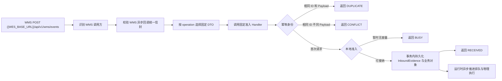
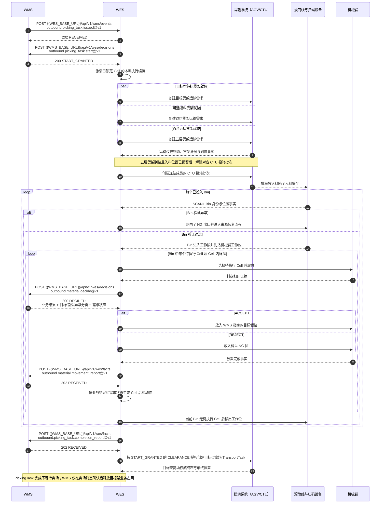
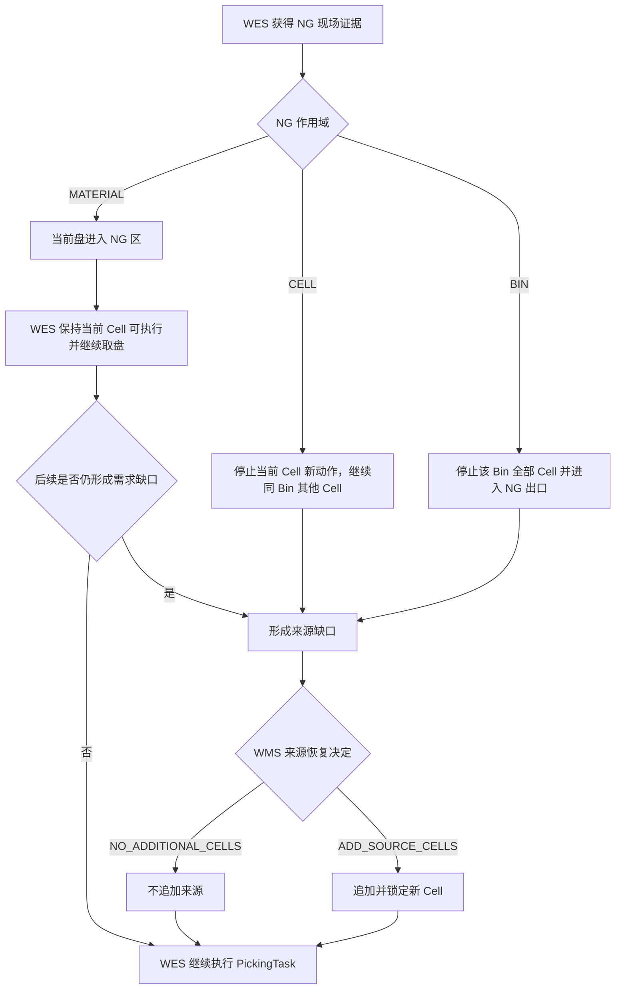
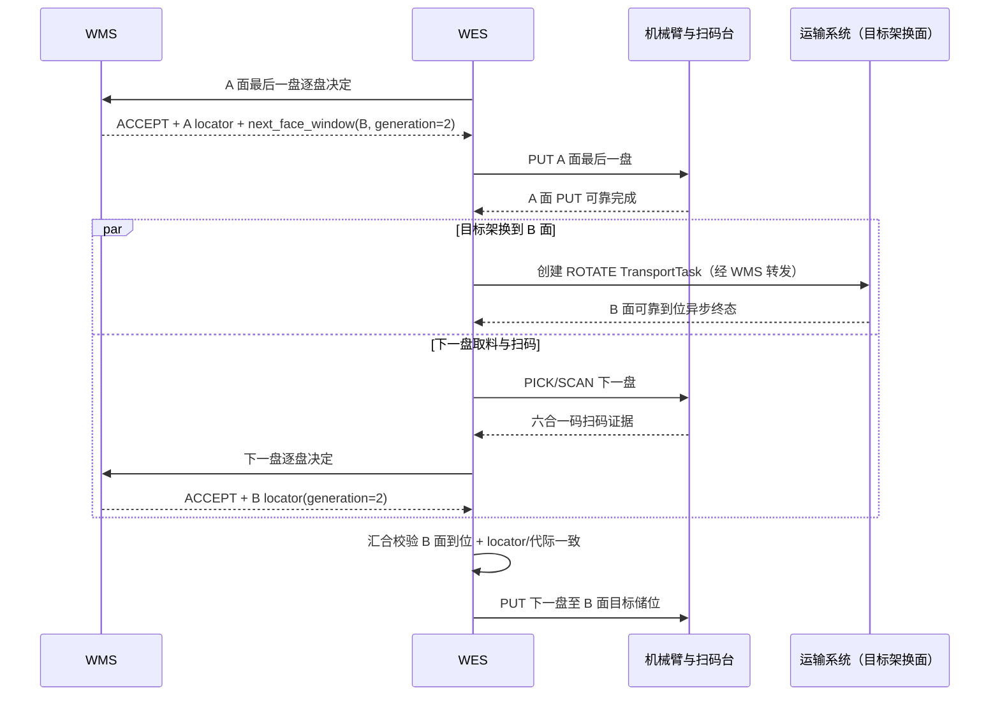

# WMS / WES 自动出库 PickingTask 交互要求

## 1. 文档定位

本文面向 WMS、WES 和联调开发人员，给出自动出库 PickingTask 的推荐 HTTP API、调用方向、JSON Payload、同步决定、
异步事实和异常恢复方式。WMS 内部继续自行负责订单、波次、库存校验和来源分配，WES 从本文定义的 PickingTask 开始执行。

本文初步冻结：

- 调用方、接收方、HTTP 方法和推荐路径。
- WMS → WES 异步事件复用的统一回调信封，以及其他方向由本文定义的信封、HTTP 状态和幂等规则。
- PickingTask、启动锁、逐盘决定、NG、补充来源和执行事实的上下文 Payload。
- 正常流程、NG 恢复、结果未知和联调验收方式。

本文所依赖的业务对象和权限边界已经确认，当前用于双方冻结 wire。推荐路径和 Payload 可直接用于接口评审；认证方式、
超时、Payload 上限、正式 JSON Schema、枚举闭集和部署地址由双方书面确认后进入实施。

## 2. 五分钟接入概览

双方按以下顺序完成一次 PickingTask：

1. WMS 向 WES 发布 PickingTask，WES 原子持久化入站事件与 PickingTask，并返回接收 ACK。
2. WES 在工作线可启动时请求 WMS 锁定完整来源 Cell，WMS 返回启动决定。
3. 自动化设备扫描完整六合一码后，WES 请求 WMS 返回业务校验结果、稳定异常分类、目标储位和当前 Cell 的需求状态。
4. WES 完成每盘放置后向 WMS 报告位置变化事实。
5. NG 发生时，WES 报告现场证据，WMS 决定不追加来源或追加新的来源 Cell。
6. 全部已接纳 Cell 闭合且全部所需物料移动（逐盘位置）事实已被 WMS 接收后，WES 报告 PickingTask 本地执行完成事实，并按启动决定中
   已冻结的 `CLEARANCE` 授权创建目标转运架离场 `TransportTask`；任务完成不等待货架离场。

### 2.1 参与方与职责

| 参与方 | 负责的事实 | 在本文中的动作 |
| --- | --- | --- |
| WMS | PickingTask、来源 Cell、来源锁、库存、六合一码业务资格、稳定异常分类、目标储位和需求状态 | 发布任务事件；响应启动、扫码和空取决定；接收执行事实 |
| WES | 工作线队列、执行对象、设备/位置证据、NG 作用域、资源仲裁和可靠外部义务 | 接收任务；请求业务决定；生成并执行跨设备逻辑动作链（cross-device logical action chain）；报告稳定事实 |
| RCS/AGV/CTU | AGV 负责完整货架搬运；CTU 负责货架内料箱搬运；RCS 负责相应运输调度和终态 | 通过独立 Transport 合同与 WES 协作 |
| ECS/PLC/设备 | 扫码、抓取、放置、输送、安全互锁和设备终态 | 向 WES 提供现场证据，由 WES 转换为 WMS 业务请求或事实 |

WMS 向 WES 交付可执行的 PickingTask 和来源 Cell；WES 依据这些权威事实驱动物理执行。出库单、波次单和库存重新分配
继续留在 WMS 内部。

Transport 请求不属于本文的 PickingTask operation。它由 Transport 合同定义提交入口和 DTO；CTU 成员位置事实、异步终态和
PickingTask Event 只共同复用 `docs/contracts/wms-async-callback-envelope-contract.md` 定义的 WMS 异步回调信封与
`POST {{WES_BASE_URL}}/api/v1/wms/events` 入口，并分别通过静态
`transport.task.member_position_changed@v1`、`transport.task.resulted@v1` 分发到独立 Transport evidence 应用端口。
普通 PickingTask Event 不得修改 Transport 位置或终结 `TransportTask`。

### 2.2 WMS Business Event 的处理模型

WMS 将业务事件发送到 `POST {{WES_BASE_URL}}/api/v1/wms/events`。该入口是强类型事件接入网关，按版本化 `operation`
选择固定 DTO 和准入 Handler。Handler 在同一事务内完成幂等、本地准入、入站证据和业务对象持久化后返回 ACK；后续
排队和物理执行由运行时异步推进。



`InboundEvidence` 只保存外部输入及其幂等接纳结果，不建立通用业务状态机。`operation` 同时表达业务动作和合同版本。例如
`outbound.picking_task.issued@v1` 唯一映射到
`PickingTaskIssuedV1` DTO 和 `PickingTaskIssuedHandler`。入口使用代码中显式声明的封闭映射，不根据 Payload 反射调用方法。

WMS 业务事件（business event）使用 `operation + data.event_id` 建立业务幂等身份。设备事件不属于本 WMS 合同，
其公共包络、部署级唯一身份和回调入口统一遵循第三方设备接入白皮书。`workline_code` 表达工作线路由，不承担设备身份职责。

## 3. 推荐 API 端点

### 3.1 端点矩阵

本文使用以下部署占位符表示接收方服务 Origin：

| 占位符 | 含义 | 示例 |
| --- | --- | --- |
| `{{WES_BASE_URL}}` | WES 在当前环境中的服务 Origin，末尾不带 `/` | `https://wes.example.com` |
| `{{WMS_BASE_URL}}` | WMS 在当前环境中的服务 Origin，末尾不带 `/` | `https://wms.example.com` |

占位符只用于文档、联调配置和部署 profile。FastAPI/OpenAPI 实际注册的仍是 `/api/v1/...` 相对路由。

- HTTP 消息使用 UTF-8 JSON；POST 设置 `Content-Type: application/json`，双方返回 `Content-Type: application/json`。
- 接收方通过部署地址、网络边界和批准的认证配置识别调用方；Payload 只承载协议和业务字段。
- 每个接收方独立配置超时和最大 Payload，具体值在部署 profile 中确认。

| 发起方 | 接收方 | 方法 | 推荐调用地址 | 交互模式 | 承载内容 |
| --- | --- | --- | --- | --- | --- |
| WMS | WES | `POST` | `{{WES_BASE_URL}}/api/v1/wms/events` | Event + 同步 ACK | PickingTask 发布、队列更新、来源恢复决定 |
| WES | WMS | `POST` | `{{WMS_BASE_URL}}/api/v1/wes/decisions` | 同步决定 | 启动授权、逐盘扫码决定、空取决定 |
| WES | WMS | `POST` | `{{WMS_BASE_URL}}/api/v1/wes/facts` | 可靠事实 + 同步 ACK | Bin NG、逐盘位置变化、PickingTask 本地执行完成 |

首版只使用三个 `POST` 入口，分别表达事件、同步决定和可靠事实。调用方通过重复提交同一不可变 POST 恢复未知响应，
不增加请求结果查询资源。

### 3.2 Operation 与端点路由

| operation | POST 端点 |
| --- | --- |
| `outbound.picking_task.issued@v1` | `{{WES_BASE_URL}}/api/v1/wms/events` |
| `outbound.picking_task.queue_changed@v1` | `{{WES_BASE_URL}}/api/v1/wms/events` |
| `outbound.picking_task.source_recovery_decided@v1` | `{{WES_BASE_URL}}/api/v1/wms/events` |
| `outbound.picking_task.start@v1` | `{{WMS_BASE_URL}}/api/v1/wes/decisions` |
| `outbound.material.decide@v1` | `{{WMS_BASE_URL}}/api/v1/wes/decisions` |
| `outbound.cell.empty_decide@v1` | `{{WMS_BASE_URL}}/api/v1/wes/decisions` |
| `outbound.bin.ng_report@v1` | `{{WMS_BASE_URL}}/api/v1/wes/facts` |
| `outbound.material.movement_report@v1` | `{{WMS_BASE_URL}}/api/v1/wes/facts` |
| `outbound.picking_task.completion_report@v1` | `{{WMS_BASE_URL}}/api/v1/wes/facts` |

### 3.3 HTTP 状态与业务结果

WMS → WES 异步 Event 的 HTTP 状态和接收应答以
`docs/contracts/wms-async-callback-envelope-contract.md` 为唯一真源。下表只定义 WES → WMS 的同步决定和可靠事实：

| HTTP 状态 | 使用场景 | 响应信封中的典型 `code` |
| --- | --- | --- |
| `200 OK` | 同步决定、Fact 重复请求 | `START_GRANTED`、`DECIDED`、`DUPLICATE` |
| `202 Accepted` | Fact 首次可靠接纳 | `RECEIVED` |
| `400 Bad Request` | JSON 或本文信封无法解析 | `REJECTED` |
| `409 Conflict` | 同一幂等 ID 对应不同 Payload，或请求违反业务唯一性/当前状态约束 | `CONFLICT` |
| `422 Unprocessable Entity` | operation、版本或专属 DTO 校验失败 | `REJECTED` |
| `429 Too Many Requests` | 接收队列瞬时背压 | `BUSY`，`data.retry_after_ms` 给出重试延迟 |
| `503 Service Unavailable` | 接收方暂时无法可靠处理 | `UNAVAILABLE` |

业务否决属于有效业务决定。例如物料 `REJECT` 使用 `200 OK`，调用方读取响应信封中的 `code` 和 `data` 执行后续动作。

### 3.4 POST 响应未知

POST 响应未知时，调用方使用相同 `request_id`、相同 operation 专属业务 ID 和完全相同的 Payload 重提原 POST：

- Event/Fact 已接纳时返回 `DUPLICATE`，不重复产生副作用。
- 同步决定已形成时返回首次产生的完整决定响应，包括原 `code`、`data` 和决定版本。
- 接收方尚未接纳时，按首次请求处理。
- 相同业务 ID 对应不同 Payload 时返回 `409 / CONFLICT`。

运行状态查询不属于首版交互面；需要人工恢复时，双方使用业务对账流程，不把诊断查询混入执行合同。

## 4. PickingTask 其他方向的 JSON 信封

WMS → WES 异步 Event 不在本节重复定义，统一遵循
`docs/contracts/wms-async-callback-envelope-contract.md`。本节只定义 WES → WMS 的同步决定和可靠事实信封，不能据此改变
Transport 提交合同或 WMS 异步回调统一信封。

### 4.1 请求信封

```json
{
  "request_id": "REQ-START-000001",
  "operation": "outbound.picking_task.start@v1",
  "timestamp": 1786060800000,
  "data": {}
}
```

| 字段 | 规则 |
| --- | --- |
| `request_id` | 一次 HTTP 提交的关联 ID；响应未知后重提原 POST 时继续使用原值 |
| `operation` | 接收方已声明支持的 operation 名和版本 |
| `timestamp` | UTC Unix 毫秒 |
| `data` | operation 专属闭集 DTO；所有业务字段均放在该对象内 |

请求 Payload 是闭集，顶层只允许上述四个字段。

### 4.2 响应信封

```json
{
  "request_id": "REQ-START-000001",
  "code": "START_GRANTED",
  "message": "Picking task start granted",
  "timestamp": 1786060800123,
  "data": {}
}
```

调用方同时读取 HTTP 状态与 `code`：HTTP 状态表达传输和协议处理结果，`code` 表达接收或业务决定。Fact 首次接纳返回
`202 / RECEIVED`；相同 ID 和相同 Payload 重放返回 `200 / DUPLICATE`，且不重复产生副作用。同步决定请求以对应
operation 的决定请求 ID 幂等；同 ID 和相同 Payload 重放时必须返回首次产生的完整决定响应（包括原 `code`、`data` 和
决定版本），不得降级为通用 `DUPLICATE` ACK。任一类型的同 ID 与不同 Payload 均返回 `409 / CONFLICT`。瞬时背压返回
`429 / BUSY`，调用方稍后使用原身份重试。

业务幂等身份由 `operation` 与 operation 专属 ID 组成：Decision 使用 `start_request_id | decision_request_id`，Fact 使用
`report_id | fact_id | completion_report_id`。`request_id` 只用于 HTTP
关联，不能绕过或替代业务幂等身份。

### 4.3 Fact 接收 ACK

| `code` | 含义 |
| --- | --- |
| `RECEIVED` | 首次可靠接收并持久化 |
| `DUPLICATE` | 相同业务 ID 和相同 Payload 已接收，不重复产生副作用 |
| `REJECTED` | envelope、operation 或 DTO 校验失败，本次消息未形成有效业务输入 |
| `CONFLICT` | 相同业务 ID 对应不同 Payload，或请求违反业务唯一性/当前状态约束 |
| `BUSY` | 瞬时背压，消息尚未接纳；返回 `retryable=true` 和 `retry_after_ms`，不使用 HTTP `Retry-After` |

## 5. Operation 总览

| operation | 方向 | 模式 | 作用 |
| --- | --- | --- | --- |
| `outbound.picking_task.issued@v1` | WMS → WES | Event + 同步 ACK | 提前发布一张可排队 PickingTask |
| `outbound.picking_task.queue_changed@v1` | WMS → WES | Event + 同步 ACK | 更新未开始任务的排队参数 |
| `outbound.picking_task.start@v1` | WES → WMS | 同步决定 | 原子锁定来源 Cell 并授权开始 |
| `outbound.material.decide@v1` | WES → WMS | 同步决定 | 根据完整六合一码返回接受、拒绝或等待；接受时返回目标和需求状态，拒绝时返回稳定业务异常分类 |
| `outbound.cell.empty_decide@v1` | WES → WMS | 同步决定 | 根据可靠空取证据决定重试、等待或结束 Cell |
| `outbound.bin.ng_report@v1` | WES → WMS | 可靠事实 + 同步 ACK | 报告整箱不可执行及受影响 Cell |
| `outbound.picking_task.source_recovery_decided@v1` | WMS → WES | Event + 同步 ACK | 决定不追加来源或追加并锁定新的补充 Cell |
| `outbound.material.movement_report@v1` | WES → WMS | 可靠事实 + 同步 ACK | 报告逐盘确定位置变化或 NG 落点 |
| `outbound.picking_task.completion_report@v1` | WES → WMS | 可靠事实 + 同步 ACK | 报告全部已接纳 Cell 的本地执行已闭合 |

所有 operation 使用 `POST`，并按第 3.2 节选择端点。WMS、WES 分别在自己的 ingress 中根据 `operation` 选择固定 DTO，
完成验证后交给具名业务 Handler。

## 6. 主要交互时序

### 6.1 正常执行



该时序只展开与 WMS 业务决定相关的执行关口。`TRANS`、`LINE` 和 `ARM` 是逻辑参与方，不代表 WMS 需要对接设备协议，
也不限定 WES 内部的具体命令端点。设备实际扫描的是 Bin 和料盘；WES 根据 Bin 身份、PickingTask 已接纳成员和本地执行状态
选择待执行 Cell，不要求设备提供独立的“Cell 扫码证据”。多个货架运输需求可以并行，CTU 批次仍必须等待对应五层货架的
权威到位事实，并取得具体入料位置预留后才能投入料箱。

### 6.2 NG 与来源恢复



### 6.3 目标架换面并行



并行范围止于 PUT 前：旋转未知、B 面未到位或 locator/代际不一致时，下一盘留在扫码台，不继续取第三盘。

## 7. PickingTaskIssued Event

调用：WMS → WES，`POST {{WES_BASE_URL}}/api/v1/wms/events`。

### 7.1 WMS 请求 Payload

```json
{
  "request_id": "REQ-PICK-000001",
  "operation": "outbound.picking_task.issued@v1",
  "timestamp": 1786060800000,
  "data": {
    "event_id": "EVT-PICK-000001",
    "task_id": "PICK-20260807-001",
    "task_version": 1,
    "dispatch_sequence": 1024,
    "issued_at": 1786060799000,
    "not_before": 1786064400000,
    "workline_code": "SMT_OUTBOUND_01",
    "pick_cells": [
      {
        "cell_execution_id": "CELL-EXEC-001",
        "source_locator": {
          "type": "BIN_CELL",
          "rack_id": "RACK-5F-001",
          "rack_face": "A",
          "bin_id": "BIN-001",
          "cell_id": "CELL-01"
        }
      },
      {
        "cell_execution_id": "CELL-EXEC-002",
        "source_locator": {
          "type": "RACK_SLOT",
          "rack_id": "RETURN-RACK-001",
          "rack_face": "A",
          "slot_id": "SLOT-03"
        }
      },
      {
        "cell_execution_id": "CELL-EXEC-003",
        "source_locator": {
          "type": "BIN_CELL",
          "rack_id": "RACK-5F-001",
          "rack_face": "A",
          "bin_id": "BIN-001",
          "cell_id": "CELL-02"
        }
      }
    ]
  }
}
```

任务发布 Payload 只携带任务身份、排队参数、工作线和来源 Cell。完整六合一码由扫码器在逐盘执行时产生，目标储位和
当前 Cell 的需求状态由 WMS 在逐盘决定阶段返回；
AGV/CTU 任务和缓存状态由 WES 本地执行对象管理。Cell 在启动授权阶段锁定，因此发布 Payload 不携带
`cell_lock_generation`。

`dispatch_sequence` 是 WMS 给出的同一工作线无歧义总序，WES 不再叠加本地优先级。`not_before` 可省略；存在时只表示
最早允许尝试启动，不是准点执行承诺。队首任务尚未到达 `not_before` 时保持等待；WMS 需要调整执行顺序时发布队列更新事件。

### 7.2 WES 接收 ACK

```json
{
  "request_id": "REQ-PICK-000001",
  "code": "RECEIVED",
  "message": "PickingTask persisted",
  "timestamp": 1786060800123,
  "data": {
    "event_id": "EVT-PICK-000001",
    "task_id": "PICK-20260807-001",
    "task_version": 1
  }
}
```

WES 同步校验信封、字段闭集、版本、身份唯一性、locator 结构、幂等冲突和本地工作线/队列容量。库存和来源业务资格沿用
WMS 已完成的校验结果，接收 ACK 即为该事件的准入结果。

接入网关识别 WMS provider 后按 `operation` 选择 PickingTask DTO，全程使用 WMS 业务上下文。真实设备上下文只在后续
创建并执行 `DeviceCommand` 时解析。

工作线队列已满时返回 `429 / BUSY`、`reason_code=WORKLINE_QUEUE_FULL`、`retryable=true` 和 `retry_after_ms`，不使用
HTTP `Retry-After`；该事件保持待提交，WMS 使用相同请求/事件 ID 和相同 Payload 重试。接收方只在事件转为 `RECEIVED` 后
建立稳定幂等结果。

## 8. 多任务队列与任务控制

队列更新调用：WMS → WES，`POST {{WES_BASE_URL}}/api/v1/wms/events`。

- WMS 可以提前向 WES 下发多张 PickingTask。
- 不同工作线可以并行执行不同任务。
- 同一工作线可以有多张 `QUEUED` 任务，但同一时刻只允许一张任务处于 `STARTING | EXECUTING`。
- WMS 使用 `dispatch_sequence` 为同一工作线提供无歧义总序；WES 处理总序中的首个未开始任务。
- 队首任务未到 `not_before` 或暂时无法启动时阻塞同线后续任务；WMS 通过队列更新事件调整未开始任务的顺序。
- 任务进入启动阶段后锁定 Cell；获得 `START_GRANTED` 后创建该任务的机械臂动作和 CTU 投箱动作。
- 下一任务仍需通过设备、缓存、目标架和活动运输对象的本地准入检查。

未开始任务的 `dispatch_sequence` 或 `not_before` 只通过
`outbound.picking_task.queue_changed@v1` 更新，并携带稳定 `event_id + queue_revision`。任务载荷本身保持不可变；队列更新
只作用于 `QUEUED` 任务，执行中的任务继续运行到闭合。

```json
{
  "request_id": "REQ-QUEUE-000001",
  "operation": "outbound.picking_task.queue_changed@v1",
  "timestamp": 1786061000000,
  "data": {
    "event_id": "EVT-QUEUE-000001",
    "task_id": "PICK-20260807-001",
    "task_version": 1,
    "queue_revision": 2,
    "dispatch_sequence": 900,
    "not_before": 1786062600000,
    "changed_at": 1786060999900
  }
}
```

## 9. Start 同步锁定与启动

WES 本地准备就绪后请求 WMS 原子锁定任务的完整初始 Cell 集合。成功响应既是来源锁事实，也是任务启动授权，不再额外发送
`picking_task.started` 回调。

调用：WES → WMS，`POST {{WMS_BASE_URL}}/api/v1/wes/decisions`。

### 9.1 WES 请求

```json
{
  "request_id": "REQ-START-000001",
  "operation": "outbound.picking_task.start@v1",
  "timestamp": 1786064500000,
  "data": {
    "start_request_id": "START-REQ-000001",
    "issued_event_id": "EVT-PICK-000001",
    "task_id": "PICK-20260807-001",
    "task_version": 1,
    "execution_id": "EXEC-PICK-000001",
    "workline_code": "SMT_OUTBOUND_01"
  }
}
```

`issued_event_id` 必须引用本任务已接纳的 `outbound.picking_task.issued@v1` 事件。设备回调使用的 `source_event_id` 属于独立
设备合同，不在 WMS 业务 Payload 中复用。

### 9.2 WMS 授权

```json
{
  "request_id": "REQ-START-000001",
  "code": "START_GRANTED",
  "message": "Source cells locked",
  "timestamp": 1786064500100,
  "data": {
    "start_request_id": "START-REQ-000001",
    "decision_id": "START-DECISION-000001",
    "decision_version": 1,
    "task_id": "PICK-20260807-001",
    "task_version": 1,
    "execution_id": "EXEC-PICK-000001",
    "cell_set_revision": 1,
    "lock_generation": 1,
    "locked_cell_execution_ids": ["CELL-EXEC-001", "CELL-EXEC-002", "CELL-EXEC-003"],
    "target_rack": {
      "rack_id": "TRANSFER-RACK-001",
      "capacity": 40,
      "face_sequence": ["A", "B"],
      "open_face": "A",
      "face_window_generation": 1
    },
    "transport_authorizations": {
      "rack_moves": [
        {
          "purpose": "STARTUP",
          "action": "MOVE",
          "rack_id": "RACK-5F-001",
          "source_location": "RACK_STORAGE_01",
          "target_location": "CTU_RACK_WORK_01"
        },
        {
          "purpose": "STARTUP",
          "action": "MOVE",
          "rack_id": "RETURN-RACK-001",
          "source_location": "RETURN_RACK_STORAGE_01",
          "target_location": "RETURN_SOURCE_WORK_01"
        },
        {
          "purpose": "STARTUP",
          "action": "MOVE",
          "rack_id": "TRANSFER-RACK-001",
          "source_location": "EMPTY_RACK_STORAGE_01",
          "target_location": "OUTBOUND_TARGET_WORK_01"
        },
        {
          "purpose": "CLEARANCE",
          "action": "MOVE",
          "rack_id": "TRANSFER-RACK-001",
          "source_location": "OUTBOUND_TARGET_WORK_01",
          "target_location": "TRANSFER_RACK_COMPLETED_01"
        }
      ],
      "bin_batches": [
        {
          "action": "MOVE",
          "source_rack_id": "RACK-5F-001",
          "members": [
            {
              "bin_id": "BIN-001",
              "source_location": "RACK-5F-001/BIN-001",
              "target_location": "SMT_OUTBOUND_01/INGRESS_BUFFER"
            }
          ]
        }
      ]
    },
    "granted_at": 1786064500050
  }
}
```

WES 只有收到 `START_GRANTED` 后才进入 `EXECUTING`，并创建任务专属运输和设备动作。`transport_authorizations` 必须给出
本次已批准运输对象的来源和目标；`rack_moves[].purpose` 是闭集 `STARTUP | CLEARANCE`，进入工作位的既有搬运均为
`STARTUP`。启动决定必须同时冻结目标转运架未来 `CLEARANCE` 搬运的完整 `rack_id`、来源工作位和 WMS 授权目标位置。
WES 收到 `START_GRANTED` 后立即按 `STARTUP` 授权创建对应 TransportTask；只有全部已接纳 CellExecution 完成且全部所需
物料移动（逐盘位置）事实已被 WMS 接收后，才按原启动 `decision_id` 创建目标架 `CLEARANCE` TransportTask。两类 TransportTask 都将授权
决定身份放入 `authority_refs`，不得只凭 rack/bin ID 推导目标；不新增决定 API 或事件。

暂时无法锁定时返回 `START_WAIT`，当前任务保持队首候选，后续任务继续等待：

```json
{
  "request_id": "REQ-START-000001",
  "code": "START_WAIT",
  "message": "Source cells temporarily unavailable",
  "timestamp": 1786064500100,
  "data": {
    "start_request_id": "START-REQ-000001",
    "decision_id": "START-DECISION-000001",
    "decision_version": 1,
    "reason_code": "SOURCE_LOCK_BUSY",
    "retry_after_ms": 5000
  }
}
```

首版启动结果只有 `START_GRANTED` 和 `START_WAIT`。同一 `start_request_id` 重复提交返回同一锁代际和同一决定；
`START_WAIT` 需要重新求值时使用新的 `start_request_id` 并通过 `previous_decision_id` 关联上一决定，原响应保持不可变。

收到 `START_WAIT` 后，WES 将任务从 `STARTING` 返回 `QUEUED`，持久化 `decision_id` 和 `retry_after_ms`，保持该任务为
队首候选且不创建设备命令。后续重新求值必须取得新的决定；WMS 如需先执行其他任务，发布队列更新事件调整总序。

### 9.3 业务锁释放

WMS 是来源 Cell 锁和目标架业务占用的唯一 owner；WES 提交执行事实，不调用通用 unlock API：

- 活动 PickingTask 的来源 Cell 锁不按超时自动释放。WMS 可根据自己给出的终局决定和已接收执行事实逐 Cell 释放：
  `SATISFIED` 的最后一盘位置事实已接收、空取返回 `CELL_DONE`，或 `SOURCE_CELL_MISMATCH`/Bin NG 的物理事实已接收且来源
  恢复事件已被 WES 接纳。`MATERIAL_REJECTED` 不单独释放当前 Cell 锁。
- 任务完成事实用于释放仍未逐 Cell 释放的剩余来源锁；无需 WES 再发送解锁列表。
- 目标架业务占用与 PickingTask 完成分离。只有原启动 `decision_id` 授权的 `CLEARANCE` TransportResult 确认目标架已离开
  工作位及最终位置后，WMS 才释放目标架占用。
- WES 重启或响应未知时，使用原任务、事实 ID 和 `lock_generation` 恢复提交；双方均不根据沉默时长推断锁已释放。

因此，来源锁可由 WMS 随 Cell 事实提前释放；PickingTask 完成只回答“所有 Cell 是否执行闭合”，目标架释放只回答
“目标架是否已物理离位并可重新分配”。

## 10. 逐盘扫码决定

调用：WES → WMS，`POST {{WMS_BASE_URL}}/api/v1/wes/decisions`。

### 10.1 WES 请求

```json
{
  "request_id": "REQ-MATERIAL-000001",
  "operation": "outbound.material.decide@v1",
  "timestamp": 1786065000000,
  "data": {
    "decision_request_id": "MAT-DECISION-REQ-000001",
    "task_id": "PICK-20260807-001",
    "task_version": 1,
    "execution_id": "EXEC-PICK-000001",
    "cell_execution_id": "CELL-EXEC-001",
    "lock_generation": 1,
    "active_face_window_generation": 1,
    "scan_evidence_id": "SCAN-EVIDENCE-000001",
    "six_in_one": {
      "HHPN": "HHPN-001",
      "MfrPN": "MFRPN-001",
      "Qty": "1200",
      "DateCode": "202631",
      "LotCode": "LOT-001",
      "PkgID": "PKG-000099"
    },
    "scanned_at": 1786064999900
  }
}
```

扫码器直接输出完整六合一码，六个字段均为必填非空字符串。WES 将其连同 `scan_evidence_id` 保存为不可变扫码证据，
不根据字段内容自行判断物料资格，也不额外维护与 `six_in_one.PkgID` 并列的身份字段。

`PkgID` 在一个包装身份生命周期内保持稳定。料盘拆封退料并经 X-Ray 重新点数、贴码后，WMS 生成不同于原值的新
`PkgID` 和新的 `Qty`；WES 将其视为新的不可变包装快照，不修改既有 `MaterialExecution`，也不追踪新旧包装血缘。
`PkgID` 生成约定和包装追溯完全属于 WMS 内部，WES 不推导编码规则。

### 10.2 接受结果

```json
{
  "request_id": "REQ-MATERIAL-000001",
  "code": "DECIDED",
  "message": "Material accepted",
  "timestamp": 1786065000100,
  "data": {
    "decision_request_id": "MAT-DECISION-REQ-000001",
    "decision_id": "MAT-DECISION-000001",
    "decision_version": 1,
    "result": "ACCEPT",
    "target_locator": {
      "type": "RACK_SLOT",
      "rack_id": "TRANSFER-RACK-001",
      "rack_face": "A",
      "slot_id": "SLOT-A-05",
      "face_window_generation": 1
    },
    "demand_state": "REMAINS",
    "next_face_window": {
      "rack_face": "B",
      "face_window_generation": 2
    }
  }
}
```

`result` 使用 `ACCEPT | REJECT | WAIT`。`ACCEPT` 必须携带唯一 `target_locator` 和当前 Cell 的
`demand_state=REMAINS | SATISFIED`。WES 把请求中的不可变 `six_in_one` 绑定到新建的 `MaterialExecution`；当前盘可靠
放置后，WES 根据 `demand_state` 继续当前 Cell 或将其闭合。WMS 不返回机械动作、NG 路由或 Cell 状态迁移命令。

### 10.3 目标面窗口与并行换面

`next_face_window` 只在当前盘是当前目标面最后一个已授权储位、且后续仍需使用下一面时返回。它是 WMS 对下一目标面的
业务预授权，不是旋转命令：

1. 当前 A 面最后一盘取得带 `next_face_window` 的 `ACCEPT`。
2. 该盘可靠 PUT 并在本地形成位置事实后，WES 激活 B 面窗口；不等待该事实的远端 ACK 才开始可并行准备动作。
3. WES 并行启动目标架旋转，以及下一盘 PICK/SCAN 和 WMS 逐盘决定；扫码台最多缓存一盘。
4. 下一盘逐盘请求携带 `active_face_window_generation=2`。只有目标架 B 面可靠到位，且返回的
   `target_locator.rack_face=B`、`face_window_generation=2` 与活动窗口一致时，才允许 PUT。

目标架 `ROTATE` TransportTask 的 `authority_refs` 同时引用初始启动 `decision_id` 和本次返回 `next_face_window` 的逐盘
`decision_id`，分别证明货架/工作位与目标面的 WMS 授权。

旧面最后一盘尚未可靠落位、换面结果未知、目标面未到位或 locator/代际不一致时，WES 保持下一盘在扫码台等待并失败关闭。

### 10.4 WAIT 与终局

`WAIT` 是不可变的非终局快照。恢复条件满足后，WES 使用新的 `decision_request_id`、同一 `scan_evidence_id` 和
`previous_decision_id` 请求下一版本。相同请求 ID 重发必须返回原快照。

同一 `scan_evidence_id` 对应一个不可变终局 `ACCEPT` 或 `REJECT`。结果缺失、迟到、版本倒退、无法关联或出现两个终局时，
WES 保持当前对象和资源未决，进入对账或人工处置。

## 11. 三类 NG

WMS 只返回业务校验结果和稳定 `business_exception_code`，不返回 `ng_scope`、机械动作、Cell 动作、Bin 动作或来源恢复
动作。WES 将 WMS 业务异常分类和本地设备证据映射为执行侧 NG 作用域，并独立生成跨设备逻辑动作链；ECS/PLC 仍拥有单台
设备内部的原子物理动作和安全互锁。

首版业务异常分类至少冻结以下两个值：

- `MATERIAL_REJECTED`：当前料盘不满足业务要求，但该事实不否定来源 Cell 的继续执行资格。
- `SOURCE_CELL_MISMATCH`：扫码物料与当前来源 Cell 的业务身份不一致，当前 Cell 不再具备执行资格。

新增分类由双方先约定稳定语义和 WES 映射规则，再进入正式 Schema；WES 收到未识别分类时保持当前对象未决并发起合同对账。

WES 对每个可形成来源缺口的 MATERIAL/CELL/BIN NG 生成稳定 `ng_evidence_id`。该 ID 关联 WMS 业务决定、设备证据、受影响
Cell 和最终物理落点，是后续位置事实与来源恢复决定的唯一因果引用；WMS 不生成 WES 的 NG 执行动作。

料盘/Cell 的业务校验沿用逐盘决定端点；Bin NG 由 WES 根据现场证据直接执行安全隔离，并使用 WES → WMS 的
`POST {{WMS_BASE_URL}}/api/v1/wes/facts` 报告。

| 业务异常或现场事实 | WES 派生作用域 | WES 当前对象动作 | 同 Bin 其他 Cell | Bin 最终去向 |
| --- | --- | --- | --- | --- |
| `MATERIAL_REJECTED` | `MATERIAL` | 当前盘进入 NG 区；可靠落位后当前 Cell 继续取盘 | 不受影响 | 正常退箱 |
| `SOURCE_CELL_MISMATCH` | `CELL` | 当前盘进入 NG 区；当前 Cell 停止新动作并等待来源恢复决定 | 继续执行 | 完成其他 Cell 后进入 NG 出口 |
| Bin 方向、条码或身份现场异常 | `BIN` | 整箱进入 NG 流程；全部 Cell 不可执行 | 全部不可执行 | 立即进入 NG 出口 |

### 11.1 料盘 NG

`outbound.material.decide@v1` 可以返回：

```json
{
  "request_id": "REQ-MATERIAL-000002",
  "code": "DECIDED",
  "message": "Material rejected",
  "timestamp": 1786065100100,
  "data": {
    "decision_request_id": "MAT-DECISION-REQ-000002",
    "decision_id": "MAT-DECISION-000002",
    "decision_version": 1,
    "result": "REJECT",
    "business_exception_code": "MATERIAL_REJECTED"
  }
}
```

WES 将 `MATERIAL_REJECTED` 映射为 `MATERIAL` NG：当前盘可靠进入 NG 区后，才允许同一 Cell 继续取下一盘。该同步响应
不要求 WMS 指示机械臂或修改 WES 的 Cell/Bin 状态。

### 11.2 Cell NG

```json
{
  "request_id": "REQ-MATERIAL-000003",
  "code": "DECIDED",
  "message": "Cell material mismatch",
  "timestamp": 1786065150100,
  "data": {
    "decision_request_id": "MAT-DECISION-REQ-000003",
    "decision_id": "MAT-DECISION-000003",
    "decision_version": 1,
    "result": "REJECT",
    "business_exception_code": "SOURCE_CELL_MISMATCH"
  }
}
```

WES 将 `SOURCE_CELL_MISMATCH` 映射为 `CELL` NG，并分别维护工作资格和最终出口，使同 Bin 其他 Cell 可以继续执行：

```text
work_eligibility = PARTIAL
exit_route = NG_EXIT
```

当前盘物理 NG 去向确定后，当前 Cell 停止新动作；同 Bin 其他未完成 Cell 继续执行，最后将 Bin 移入 NG 出口。当前 Cell
在来源恢复决定到达后再以 NG outcome 闭合。

### 11.3 Bin NG

方向错误、条码异常或身份冲突等设备证据使整个 Bin 不可信时，WES 不等待 WMS 才执行安全的 NG 路由，但必须可靠报告：

```json
{
  "request_id": "REQ-BIN-NG-000001",
  "operation": "outbound.bin.ng_report@v1",
  "timestamp": 1786065200000,
  "data": {
    "report_id": "BIN-NG-REPORT-000001",
    "task_id": "PICK-20260807-001",
    "task_version": 1,
    "execution_id": "EXEC-PICK-000001",
    "bin_execution_id": "BIN-EXEC-001",
    "bin_id": "BIN-001",
    "ng_evidence_id": "BIN-NG-EVIDENCE-001",
    "reason_code": "BIN_BARCODE_INVALID",
    "affected_cell_execution_ids": ["CELL-EXEC-001", "CELL-EXEC-003"],
    "work_eligibility": "NONE",
    "exit_route": "NG_EXIT",
    "occurred_at": 1786065199900
  }
}
```

WMS 返回通用接收 ACK。所有受影响 Cell 保持未闭合，直到 WMS 的来源恢复决定明确其关闭结果和替代来源。

## 12. 空取决定

设备对指定 Cell 给出可靠“无料”终态且没有产生扫码证据时，WES 调用
`outbound.cell.empty_decide@v1`，携带 `source_observation_id`、任务/Cell/锁代际、设备命令终态和发生时间。

调用：WES → WMS，`POST {{WMS_BASE_URL}}/api/v1/wes/decisions`。

WMS 只返回：

- `RETRY`：允许重新执行同一来源。
- `WAIT`：保持 Cell 和相关资源未决。
- `CELL_DONE`：允许在没有未决物料动作后关闭该 Cell。

WMS 只有在该 Cell 已无未决需求缺口时才能返回 `CELL_DONE`。若此前料盘拒绝导致需求仍未满足，WMS 返回 `WAIT`，先发布并
取得对应来源恢复事件的接收 ACK，再由 WES 使用新的 `decision_request_id` 请求下一决定；不得用 `CELL_DONE` 抢先关闭 Cell。

设备结果未知或无法关联时，WES 保持 Cell 未决并进入设备结果对账；获得可靠“无料”终态后再调用空取决定。

请求和响应示例：

```json
{
  "request_id": "REQ-EMPTY-000001",
  "operation": "outbound.cell.empty_decide@v1",
  "timestamp": 1786065250000,
  "data": {
    "decision_request_id": "EMPTY-DECISION-REQ-000001",
    "task_id": "PICK-20260807-001",
    "task_version": 1,
    "execution_id": "EXEC-PICK-000001",
    "cell_execution_id": "CELL-EXEC-001",
    "lock_generation": 1,
    "source_observation_id": "EMPTY-EVIDENCE-000001",
    "command_result_id": "CMD-RESULT-EMPTY-000001",
    "observed_at": 1786065249900
  }
}
```

```json
{
  "request_id": "REQ-EMPTY-000001",
  "code": "DECIDED",
  "message": "Cell may be closed",
  "timestamp": 1786065250100,
  "data": {
    "decision_request_id": "EMPTY-DECISION-REQ-000001",
    "decision_id": "EMPTY-DECISION-000001",
    "decision_version": 1,
    "result": "CELL_DONE"
  }
}
```

## 13. 来源恢复与追加式补料

当 MATERIAL NG 后续形成未满足需求，或 CELL/BIN NG 直接形成来源缺口时，WMS 通过
`outbound.picking_task.source_recovery_decided@v1` 给出来源恢复结果：

调用：WMS → WES，`POST {{WES_BASE_URL}}/api/v1/wms/events`。

- `NO_ADDITIONAL_CELLS`：不追加来源，当前 PickingTask 成员集合保持不变。
- `ADD_SOURCE_CELLS`：追加并锁定新的来源 Cell。

当前 PickingTask 内尚未执行的 Cell 本来就是已接纳成员，继续按原计划执行，不需要在来源恢复事件中再次引用。WMS 可在
内部判断这些成员是否足以覆盖需求，WES 只接收是否追加新 `CellExecution` 的结果。已接纳成员保持不可变；新增来源明确到
Cell，并形成新的成员和锁代际。

| `resolution` | 必填字段 | 约束 |
| --- | --- | --- |
| `NO_ADDITIONAL_CELLS` | `cause_ng_evidence_id` | 成员集合保持不变；WMS 已决定无需为该 NG 追加来源 |
| `ADD_SOURCE_CELLS` | `cause_ng_evidence_id`、`cell_set_revision`、`lock_generation`、`additional_cells` | 只允许追加全新 CellExecution |

新增来源示例：

```json
{
  "request_id": "REQ-RECOVERY-000001",
  "operation": "outbound.picking_task.source_recovery_decided@v1",
  "timestamp": 1786065300000,
  "data": {
    "event_id": "EVT-RECOVERY-000001",
    "task_id": "PICK-20260807-001",
    "task_version": 1,
    "execution_id": "EXEC-PICK-000001",
    "cause_ng_evidence_id": "BIN-NG-EVIDENCE-001",
    "resolution": "ADD_SOURCE_CELLS",
    "cell_set_revision": 2,
    "lock_generation": 2,
    "additional_cells": [
      {
        "cell_execution_id": "CELL-EXEC-NEW-001",
        "source_locator": {
          "type": "BIN_CELL",
          "rack_id": "RACK-5F-009",
          "rack_face": "A",
          "bin_id": "BIN-042",
          "cell_id": "CELL-03"
        }
      }
    ],
    "additional_transport_authorizations": {
      "rack_moves": [
        {
          "purpose": "STARTUP",
          "action": "MOVE",
          "rack_id": "RACK-5F-009",
          "source_location": "RACK_STORAGE_09",
          "target_location": "CTU_RACK_WORK_01"
        }
      ],
      "bin_batches": [
        {
          "action": "MOVE",
          "source_rack_id": "RACK-5F-009",
          "members": [
            {
              "bin_id": "BIN-042",
              "source_location": "RACK-5F-009/BIN-042",
              "target_location": "SMT_OUTBOUND_01/INGRESS_BUFFER"
            }
          ]
        }
      ]
    }
  }
}
```

追加规则：

- `event_id` 是该来源恢复事件的业务幂等 ID；同 ID 不同 Payload 必须冲突。
- 一个来源恢复事件只处理一个 `cause_ng_evidence_id`；多个独立 NG 原因分别发布事件，避免合并后无法确定闭合关系。
- 同一 `execution_id + cause_ng_evidence_id` 只允许接纳一个来源恢复终局。首次接纳时，关联 NG 及其受影响 Cell 必须仍未闭合，
  否则返回 `409 / CONFLICT`；后续不同 `event_id` 再次引用同一原因时也返回 `409 / CONFLICT`，不得改变 `resolution`、
  追加成员或创建新锁代际。
- `START_GRANTED` 接纳的初始成员集合固定为 `cell_set_revision=1`；每个被接纳的 `ADD_SOURCE_CELLS` 必须使用
  `current_cell_set_revision + 1`，追加内容形成新的不可变成员代际。
- 首个 `ADD_SOURCE_CELLS` 使用修订号 2；此后 WMS 只有在前一成员代际收到 `RECEIVED | DUPLICATE` 后，才能发布下一成员
  代际。交付未知或收到 `BUSY` 时，按第 16 节通用规则使用相同事件身份和 Payload 重试，不得越过该事件发布后续代际。
- 除同一已接纳事件按幂等规则返回 `DUPLICATE` 外，低于或等于当前值的旧代际，以及高于
  `current_cell_set_revision + 1` 的跳号代际，均稳定返回 `409 / CONFLICT`，且不得修改成员集合。
  `NO_ADDITIONAL_CELLS` 不创建新成员代际。
- WMS 发布 `ADD_SOURCE_CELLS` 前必须原子锁定新增 Cell，并返回仅属于该补充集合的 `lock_generation`。
- 在尚未明确收到 `REJECTED | CONFLICT`、等待稳定接收结果或人工对账期间，包括收到 `BUSY` 或交付未知时，WMS 必须
  保留本次新增 Cell 的原锁、原 `lock_generation`、原事件身份和 Payload，不得释放、替换或重新分配。
- 只有明确收到 `REJECTED | CONFLICT` 时，WMS 才解除本次未生效的新增锁；收到 `RECEIVED | DUPLICATE` 后，补充集合已被
  WES 接纳，其锁进入已接纳 Cell 的执行生命周期，并按第 9.3 节既有条件释放。
- 每个 CellExecution 始终使用自己所属的锁代际；新代际与旧 Cell 的在途响应并行有效。
- 已存在于任务中的 Cell 继续按原计划执行；新增成员使用全新的 `cell_execution_id`。
- 新增 Cell 使用任务内既有且未执行的运输授权时不重复下发；需要新货架或新 Bin 时，事件必须在
  `additional_transport_authorizations` 中给出完整来源和目标，WES 将本事件 `event_id` 放入 Transport `authority_refs` 后创建
  独立 TransportTask。PickingTask 本地执行完成继续只聚合 CellExecution。
- `MATERIAL_REJECTED` 不因来源恢复决定关闭当前 Cell；该 Cell 仍按后续逐盘决定或空取决定执行，新增 Cell 只补充来源。
- `SOURCE_CELL_MISMATCH` 或 Bin NG 关联的受影响 Cell，只有在物理 NG 去向确定且 WMS 恢复决定已到达后，才以 NG outcome
  闭合。WMS 返回恢复结果，不下发 Cell 状态迁移命令。

## 14. 逐盘位置事实

WES 每完成一盘的正常 PUT 或 NG 放置，就可靠发送 `outbound.material.movement_report@v1`：

调用：WES → WMS，`POST {{WMS_BASE_URL}}/api/v1/wes/facts`。

```json
{
  "request_id": "REQ-MOVE-000001",
  "operation": "outbound.material.movement_report@v1",
  "timestamp": 1786065500000,
  "data": {
    "fact_id": "MOVE-FACT-000001",
    "task_id": "PICK-20260807-001",
    "task_version": 1,
    "execution_id": "EXEC-PICK-000001",
    "cell_execution_id": "CELL-EXEC-001",
    "material_execution_id": "MAT-EXEC-000001",
    "scan_evidence_id": "SCAN-EVIDENCE-000001",
    "decision_id": "MAT-DECISION-000001",
    "pkg_id": "PKG-000099",
    "from_locator": {
      "type": "BIN_CELL",
      "rack_id": "RACK-5F-001",
      "rack_face": "A",
      "bin_id": "BIN-001",
      "cell_id": "CELL-01"
    },
    "to_locator": {
      "type": "RACK_SLOT",
      "rack_id": "TRANSFER-RACK-001",
      "rack_face": "A",
      "slot_id": "SLOT-A-05",
      "face_window_generation": 1
    },
    "command_result_id": "CMD-RESULT-000001",
    "occurred_at": 1786065499900
  }
}
```

`pkg_id` 只是对已保存 `six_in_one.PkgID` 的关联引用，必须与 `scan_evidence_id` 和 `decision_id` 指向的不可变扫码证据
完全一致，不能在位置事实中提供新的身份值。扫码器未形成完整六合一码时，WES 保持料盘和扫码台未决，不调用逐盘业务决定，
也不把不完整身份解释为业务 NG。WMS 返回通用接收 ACK；WES 本地位置事实继续以设备终态为依据。

`to_locator` 是闭集联合类型：正常 PUT 使用 `RACK_SLOT(rack_id, rack_face, slot_id)`；NG 放置使用
`NG_ZONE(zone_code)`，并额外携带稳定 `ng_evidence_id`。若该 NG 后续触发来源恢复，恢复决定的
`cause_ng_evidence_id` 必须引用同一 `ng_evidence_id`；未形成来源缺口时，该位置事实无需等待来源恢复决定。位置未知时
不发送已完成 movement fact。

NG 放置时，`data` 中的相关片段为：

```json
{
  "ng_evidence_id": "CELL-NG-EVIDENCE-001",
  "to_locator": {
    "type": "NG_ZONE",
    "zone_code": "MATERIAL_NG_01"
  }
}
```

## 15. PickingTask 本地执行完成

完成报告调用：WES → WMS，`POST {{WMS_BASE_URL}}/api/v1/wes/facts`。

PickingTask 的成员集合为：

```text
初始 START_GRANTED 锁定的 Cell
+ 后续 ADD_SOURCE_CELLS 接纳的 Cell
```

每个 CellExecution 使用统一 `COMPLETED` 状态和独立 outcome，例如：

```text
SUCCESS | NG_REPLACED | NG_CLOSED | UNAVAILABLE_BY_BIN_NG
```

本地完成条件为：

```text
ALL(已接纳 CellExecution.status == COMPLETED)
```

完成条件只聚合已接纳 CellExecution。`SOURCE_CELL_MISMATCH` 或 Bin NG 的受影响 Cell 在恢复决定到达前保持未完成；
恢复决定与这些 Cell 的闭合及可选新增 Cell 接纳原子处理。`MATERIAL_REJECTED` 不关闭当前仍可执行的 Cell，补充来源只追加成员。
条件满足后，WES 把任务执行投影置为
`EXECUTION_COMPLETED`，并让 Rack、Bin、AGV、CTU、工作位和清场对象继续由各自 owner 闭环。WMS 根据完成事实管理自己的
业务终态。

全部已接纳 CellExecution 完成且全部所需物料移动（逐盘位置）事实已被 WMS 接收后，WES 使用原 `START_GRANTED.decision_id` 作为
`authority_refs`，按启动时已冻结的 `CLEARANCE` 授权创建目标转运架离场 TransportTask。该创建条件与 PickingTask 本地
完成条件共享同一组已完成事实，但 `EXECUTION_COMPLETED` 和完成报告均不等待货架离场或其 TransportResult。

逐盘位置事实必须先被 WMS 接收，WES 才可靠发送 `outbound.picking_task.completion_report@v1`：

```json
{
  "request_id": "REQ-COMPLETE-000001",
  "operation": "outbound.picking_task.completion_report@v1",
  "timestamp": 1786066000000,
  "data": {
    "completion_report_id": "COMPLETE-REPORT-000001",
    "task_id": "PICK-20260807-001",
    "task_version": 1,
    "execution_id": "EXEC-PICK-000001",
    "final_cell_set_revision": 2,
    "execution_completed_at": 1786065999900,
    "cell_results": [
      {
        "cell_execution_id": "CELL-EXEC-001",
        "outcome": "UNAVAILABLE_BY_BIN_NG"
      },
      {
        "cell_execution_id": "CELL-EXEC-002",
        "outcome": "SUCCESS"
      },
      {
        "cell_execution_id": "CELL-EXEC-003",
        "outcome": "UNAVAILABLE_BY_BIN_NG"
      },
      {
        "cell_execution_id": "CELL-EXEC-NEW-001",
        "outcome": "SUCCESS"
      }
    ]
  }
}
```

WMS 对本地执行完成事实返回通用接收 ACK。后续任务和运输指令使用各自独立合同；WMS 自身的业务终态继续由 WMS 管理。

## 16. 幂等、版本与失败恢复

- 同一 Event/Fact ID 和相同 Payload 重发时，接收方返回 `DUPLICATE` 且不重复产生副作用。
- 同一同步决定请求 ID 和相同 Payload 重发时，接收方返回首次产生的完整决定响应，不得用通用 ACK 丢失决定内容。
- `BUSY` 表示消息仍在调用方一侧待提交；调用方按 `retry_after_ms` 使用原身份重试，直到获得稳定接收结果。
- 同一 ID 对应不同 Payload 时，接收方返回 `409 / CONFLICT` 并保留最初接纳的内容。
- PickingTask 同一 `task_version` 保持原始 Payload 不变；队列参数更新使用独立 `queue_revision`。
- `lock_generation` 只作用于它锁定的 Cell 集合，各代际按所属 Cell 并行关联。
- `WAIT` 后续求值创建新请求，并通过 `previous_decision_id` 关联原决定；每次响应都是不可变快照。
- 同一扫码证据或来源观察只形成一个不可变终局决定。
- 超时或交付未知时，WES 保持相关资源占用，并以相同 ID/Payload 重提原 POST；仍无法闭合时进入业务对账或人工处置。
- 明确 `400|422 / REJECTED` 时停止重试原 Payload，修正后使用新的业务 ID 提交；`409 / CONFLICT`、响应合同非法、版本
  倒退或无法关联时停止自动重试并进入合同对账，不能指望相同请求返回不同结果。
- `WmsClient` 每次只执行一次 HTTP/JSON 访问；可靠重试、Outbox、因果排序和状态推进由具体业务 owner 负责。

### 16.1 集中校验与拒绝规则

正文描述正常接入动作；以下表格集中定义协议边界：

| 输入情况 | HTTP / `code` | 接收方处理 |
| --- | --- | --- |
| WMS Event 携带 `device_code`、`command_code` 或 `task_type` | `422 / REJECTED`，`reason_code=WMS_EVENT_DEVICE_FIELD_FORBIDDEN` | 不建立 PickingTask 或设备上下文；WMS 修正后使用新的事件身份提交 |
| `operation` 未声明或版本未知 | `422 / REJECTED`，`reason_code=OPERATION_NOT_SUPPORTED` | 返回支持版本信息；调用方修正后使用新的业务身份提交 |
| Envelope 或 JSON 无法解析 | `400 / REJECTED` | 返回字段错误位置；调用方修正后使用新的请求和业务身份提交 |
| 同一幂等 ID 对应不同 Payload | `409 / CONFLICT` | 保留原请求和原响应快照 |
| 非重复事件的 `ADD_SOURCE_CELLS.cell_set_revision` 不是 `current_cell_set_revision + 1` | `409 / CONFLICT` | 旧代际或跳号代际均不修改成员集合；相同冲突事件重提仍返回相同冲突 |
| PickingTask 发送到设备 `{{WES_BASE_URL}}/api/v1/callback/event` | 设备入口按自身合同返回 `4xx` | WMS 使用 `{{WES_BASE_URL}}/api/v1/wms/events` 重新提交 |
| 接收队列达到容量上限 | `429 / BUSY` | 返回 `data.retry_after_ms`，调用方使用原身份重试 |
| POST 响应未知 | 无法确认 | 调用方使用相同 `request_id`、业务 ID 和 Payload 重提原 POST；接收方按幂等规则返回原结果或首次处理 |

## 17. 联调验收清单

| 场景 | 预期结果 |
| --- | --- |
| WMS 连续下发同线多任务 | WES 全部可靠排队，同线只启动一个任务 |
| WMS 下发不同工作线任务 | 不同工作线可并行启动 |
| 同线队首任务尚未到 `not_before` | 保持当前总序；WMS 如需调整顺序则发布队列更新事件 |
| 同一 Event 重复提交 | 返回 `DUPLICATE`，任务数量保持不变 |
| 同一同步决定请求重复提交 | 返回首次产生的完整决定响应，决定内容和版本不变 |
| 同一 ID 不同 Payload | 返回 `CONFLICT` |
| WMS Event 携带设备身份字段 | 返回 `422 / WMS_EVENT_DEVICE_FIELD_FORBIDDEN`；WMS 修正 Payload 后使用新的请求和事件 ID 提交 |
| PickingTask 误投 `{{WES_BASE_URL}}/api/v1/callback/event` | 设备入口返回 `4xx`，WMS 改投 `{{WES_BASE_URL}}/api/v1/wms/events` |
| 正常 WMS Event 接入 | 准入 Handler 建立 WMS 业务上下文并原子持久化 PickingTask，运行时随后异步推进执行 |
| 工作线接收队列瞬时已满 | 返回 `429 / BUSY` 和 `data.retry_after_ms`，WMS 使用原身份重试 |
| 启动前 Cell 可锁定 | 返回 `START_GRANTED` 后 WES 才创建设备命令 |
| 启动授权冻结目标架清场 | `transport_authorizations.rack_moves` 同时包含 `purpose=CLEARANCE` 的目标架、来源工作位和 WMS 授权目标位置 |
| 启动暂时等待 | 当前任务回到 `QUEUED` 并保持队首，不创建设备命令；重排使用队列更新事件 |
| 料盘 NG 且 Cell 可继续 | 当前盘进入 NG 区后继续当前 Cell |
| Cell NG | 当前 Cell 停止新动作并等待来源恢复决定；同 Bin 其他 Cell 继续；Bin 最终进入 NG 出口 |
| Bin NG | 整箱所有 Cell 停止执行并进入 NG 出口 |
| WMS 判断无需新增来源 | 返回 `NO_ADDITIONAL_CELLS`，成员集合保持不变，既有 Cell 继续按原计划执行 |
| 补充来源不在任务内 | 追加新成员代际和独立锁代际 |
| WMS 决定超时或交付未知 | 保持对象未决，以相同 ID/Payload 重提原 POST；仍无法闭合时进入对账或人工处置 |
| WMS 响应合同非法、版本倒退或无法关联 | 停止自动重试相同请求，保持对象未决并进入合同对账 |
| 扫码器上报完整六合一码 | WES 原样保存六个必填字段并提交逐盘决定；`PkgID` 不在请求中重复表达 |
| `ACCEPT + REMAINS` | 当前盘可靠放置后继续当前 Cell |
| `ACCEPT + SATISFIED` | 当前盘可靠放置后关闭当前 Cell |
| A 面最后一个 `ACCEPT` 携带 `next_face_window` | 当前盘可靠 PUT 后旋转与下一盘 PICK/SCAN 并行；下一盘 PUT 等待 B 面可靠到位及 locator/代际一致，扫码台最多缓存一盘 |
| X-Ray 点数后扫描新码 | WES 使用新的 `Qty` 和 WMS 新生成的不同 `PkgID` 形成新包装快照，不追踪新旧包装血缘或推导编码规则 |
| WMS 返回未知业务异常分类 | WES 保持当前对象未决并发起合同对账，不猜测 NG 作用域 |
| 全部已接纳 Cell 闭合 | 进入 `EXECUTION_COMPLETED` 本地执行投影，只聚合 CellExecution |
| 逐盘事实尚未被 WMS 接收 | 完成报告保持等待，逐盘事实接收后再发送 |
| 目标架清场授权可执行 | 全部 CellExecution 完成且全部所需物料移动（逐盘位置）事实已接收后，使用原启动 `decision_id` 创建 `CLEARANCE` TransportTask；PickingTask 完成不等待离场 |
| 目标架清场结果已确认 | WMS 仅在 TransportResult 确认物理离场和最终位置后释放目标架业务占用 |

## 18. 正式实施前双方确认项

- 第 3 节推荐的三个 POST relative path，以及每项 operation 的 HTTP 状态集合和响应 media type。
- 认证方式；当前隔离网络采用 `NONE` 时，在部署配置中明确记录。
- DTO 正式 JSON Schema、字符串长度、数组上限、Payload 上限和枚举闭集。
- 超时、可重试性、最大重试窗口，以及交付未知后重提原 POST 和进入人工对账的边界。
- 稳定 `business_exception_code` 与通用 `reason_code` 字典、WES 映射规则、人工处置流程和 SLA。
- 来源 Cell 逐项锁释放条件、目标架物理离位事实来源，以及 WMS 内部释放事务的审计字段。
- 双方共享的成功、WAIT、NG、冲突、迟到消息和来源补充 fixture。
- WMS ingress 合同测试覆盖：静态 operation 分发、设备字段拒绝、WMS 业务上下文、设备入口误投和幂等重提。

双方批准上述内容后，以正式 JSON Schema、具名 DTO、静态 operation 映射和合同 fixture 启动实现。
