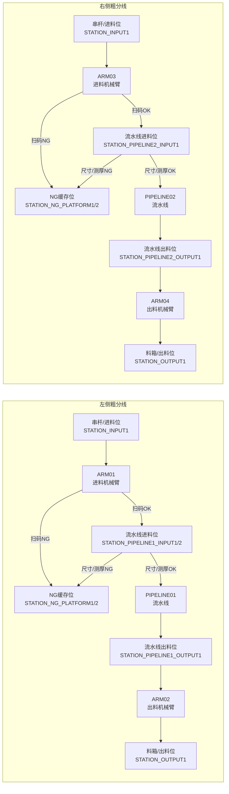
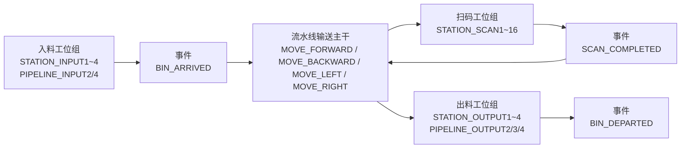
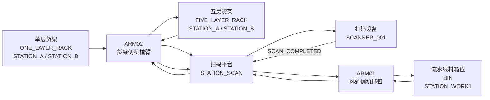

# 硬件工作线拓扑图

> 本文档用于统一整理 `docs/hardware/` 下各类设备与作业线的拓扑结构，便于架构设计、联调评审和插件建模。  
> 当前已整理：`SMT 粗分机`、`SMT 流水线`、`SMT 分拣机`。

## 1. SMT 粗分机工作线拓扑

参考文档：

- [SMT粗分机接口调用说明书20260321-v1.md](/Users/kaizhou/SynologyDrive/works/wes_backend/docs/hardware/SMT粗分机接口调用说明书20260321-v1.md)

### 1.1 总体说明

SMT 粗分机由左右两条并行作业线组成，每条作业线都遵循相同的基本结构：

1. 进料机械臂从串杆/进料位取料
2. 进行扫码、尺寸检测、测厚、NG 判定
3. NG 物料进入 NG 缓存位
4. OK 物料进入流水线进料位
5. 流水线将物料输送到出料位
6. 出料机械臂将物料放入目标料箱

左右两条线分别为：

- 左侧作业线：`ARM01 -> PIPELINE01 -> ARM02`
- 右侧作业线：`ARM03 -> PIPELINE02 -> ARM04`

### 1.2 拓扑图



### 1.3 主流程说明

#### 1.3.1 扫码 NG 流程

```text
串杆/进料位 -> 进料机械臂 -> NG 缓存位
```

#### 1.3.2 扫码 OK 且检测 OK 流程

```text
串杆/进料位 -> 进料机械臂 -> 流水线进料位 -> 流水线 -> 流水线出料位 -> 出料机械臂 -> 料箱
```

#### 1.3.3 扫码 OK 但尺寸/测厚 NG 流程

```text
串杆/进料位 -> 进料机械臂 -> 流水线进料位 -> 尺寸/测厚失败 -> NG 缓存位
```

### 1.4 角色划分

| 角色 | 设备 | 职责 |
| --- | --- | --- |
| 进料执行 | `ARM01`, `ARM03` | 取料、扫码、尺寸检测、测厚、NG 判定、放入流水线进料位或 NG 缓存位 |
| 输送执行 | `PIPELINE01`, `PIPELINE02` | 将 OK 物料从流水线进料位传输到流水线出料位 |
| 出料执行 | `ARM02`, `ARM04` | 从流水线出料位抓取物料并放入目标料箱 |
| 异常分流 | `STATION_NG_PLATFORM1/2` | 存放扫码 NG 或检测 NG 的物料 |

### 1.5 建模提示

从作业线插件建模角度，粗分机不应被视为单一设备，而应视为“两条并行 workline”或“一个 workline 模板下的左右两个实例”：

- 左侧实例：`PIPELINE01 + ARM01 + ARM02`
- 右侧实例：`PIPELINE02 + ARM03 + ARM04`

业务主链路应围绕“物料从进料到出料或 NG 分流”的流程建模，而不是围绕单个机械臂或流水线设备建模。

## 2. SMT 流水线工作线拓扑

参考文档：

- [SMT流水线接口调用说明书20260320-v1.md](/Users/kaizhou/SynologyDrive/works/wes_backend/docs/hardware/SMT流水线接口调用说明书20260320-v1.md)

### 2.1 总体说明

SMT 流水线不是“单机械臂执行链”，而是“多个工位节点 + 输送通道”组成的事件驱动作业线。其核心特点是：

1. 入料工位负责接收入线料箱
2. 扫码工位负责识别条码
3. 出料工位负责送出料箱
4. WES 通过移动命令控制料箱在各工位之间迁移
5. 设备通过 `BIN_ARRIVED`、`SCAN_COMPLETED`、`BIN_DEPARTED` 事件驱动后续业务

在建模上，它更像“多站点 conveyor line”，而不是传统“机器人 + 传送带”。

关键工位分组：

- 扫码工位：`STATION_SCAN1~16`
- 入料工位：`STATION_INPUT1~4`、`PIPELINE_INPUT2/4`
- 出料工位：`STATION_OUTPUT1~4`、`PIPELINE_OUTPUT2/3/4`

### 2.2 拓扑图



### 2.3 主流程说明

#### 2.3.1 入线流程

```text
入料工位 -> BIN_ARRIVED -> WES 决策 -> 下发移动命令
```

#### 2.3.2 扫码流程

```text
移动到扫码工位 -> SCAN_COMPLETED -> WES 获取 barcode -> 继续分流/转运
```

#### 2.3.3 出线流程

```text
移动到出料工位 -> BIN_DEPARTED -> 料箱离开当前作业线
```

### 2.4 角色划分

| 角色 | 设备/节点 | 职责 |
| --- | --- | --- |
| 入线入口 | `STATION_INPUT*`, `PIPELINE_INPUT*` | 料箱进入流水线并触发到达事件 |
| 识别节点 | `STATION_SCAN*` | 采集条码并上报 `SCAN_COMPLETED` |
| 输送执行 | 流水线主干 | 执行移动命令，将料箱在工位间迁移 |
| 出线出口 | `STATION_OUTPUT*`, `PIPELINE_OUTPUT*` | 料箱离开流水线并上报 `BIN_DEPARTED` |

### 2.5 建模提示

从 workline plugin 建模角度，SMT 流水线应建模为“事件驱动的多工位线体”：

- `BIN_ARRIVED` 是进入线体或进入特定阶段的信号
- `SCAN_COMPLETED` 是业务识别信号
- `BIN_DEPARTED` 是离开当前工位或离开线体的信号

业务主语不应是某个 `STATION_SCAN1` 或 `STATION_OUTPUT1`，而应是“料箱在流水线中的一次过线会话”。

## 3. SMT 分拣机工作线拓扑

参考文档：

- [SMT分拣机ECS接口调用说明书V1-20260318.md](/Users/kaizhou/SynologyDrive/works/wes_backend/docs/hardware/SMT分拣机ECS接口调用说明书V1-20260318.md)

### 3.1 总体说明

SMT 分拣机的核心不是并行双线，而是“货架 <-> 扫码台 <-> 料箱”之间的搬运链。其关键设备包括：

- `ARM02`: 更偏向货架侧搬运
- `ARM01`: 更偏向料箱侧搬运
- `SCANNER_001`: 扫码事件源
- `STATION_SCAN`: 扫码平台
- `STATION_WORK1`: 流水线料箱位
- `STATION_A` / `STATION_B`: 单层货架或五层货架位置

该系统至少覆盖三类业务：

1. 入库：单层货架 -> 扫码平台 -> 料箱
2. 出库：料箱 -> 扫码平台 -> 五层货架
3. 移库：五层货架 -> 扫码平台 -> 五层货架

### 3.2 拓扑图



### 3.3 主流程说明

#### 3.3.1 入库流程

```text
单层货架 -> ARM02 -> 扫码平台 -> SCANNER_001 -> ARM01 -> 料箱
```

#### 3.3.2 出库流程

```text
料箱 -> ARM01 -> 扫码平台 -> SCANNER_001 -> ARM02 -> 五层货架
```

#### 3.3.3 移库流程

```text
五层货架 -> ARM02 -> 扫码平台 -> SCANNER_001 -> ARM02 -> 另一货架位
```

### 3.4 角色划分

| 角色 | 设备/节点 | 职责 |
| --- | --- | --- |
| 货架搬运 | `ARM02` | 在单层/五层货架与扫码平台之间搬运物料 |
| 料箱搬运 | `ARM01` | 在扫码平台与流水线料箱之间搬运物料 |
| 识别节点 | `SCANNER_001` + `STATION_SCAN` | 采集扫码结果并上报事件 |
| 存储节点 | `ONE_LAYER_RACK`, `FIVE_LAYER_RACK`, `BIN` | 作为业务源位和目标位 |

### 3.5 建模提示

从 workline plugin 建模角度，SMT 分拣机应被建模成“围绕扫码平台汇聚的 hub-and-spoke 作业线”：

- 扫码平台是中心节点
- 货架、料箱是边缘存储节点
- 机械臂负责中心节点与边缘节点之间的双向搬运
- `SCANNER_001` 是独立事件源，不应和 `ARM01/ARM02` 混为同一设备角色

业务主链路更适合围绕“物料在扫码平台汇聚后再被分发到目标存储位”建模。

## 4. 后续扩展

后续可继续在本文件中补充：

- 各工作线之间的系统边界图
- WES / ECS / Scanner / Robot / Conveyor 的交互拓扑图
- callback / command / status 的时序图
