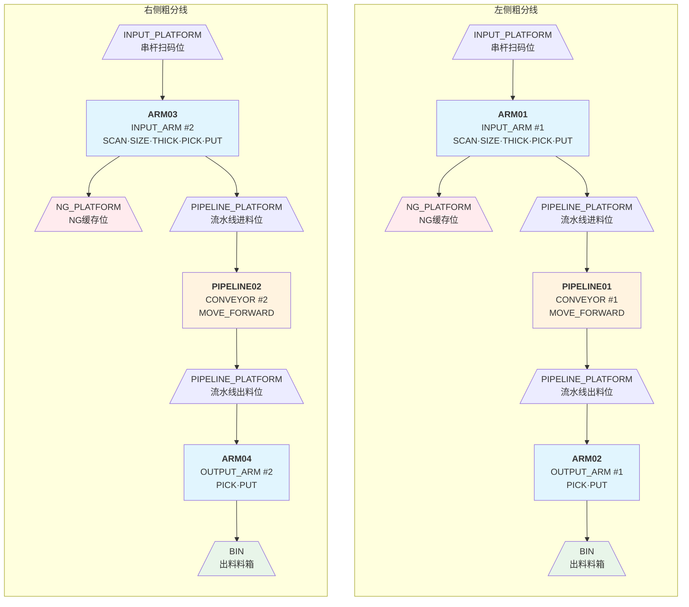
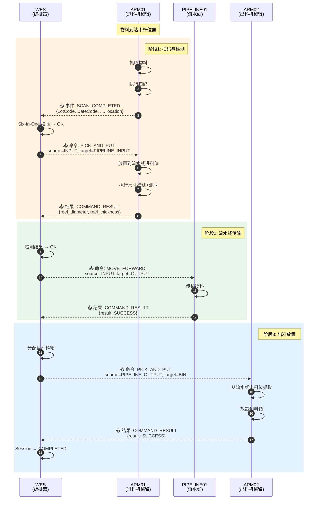
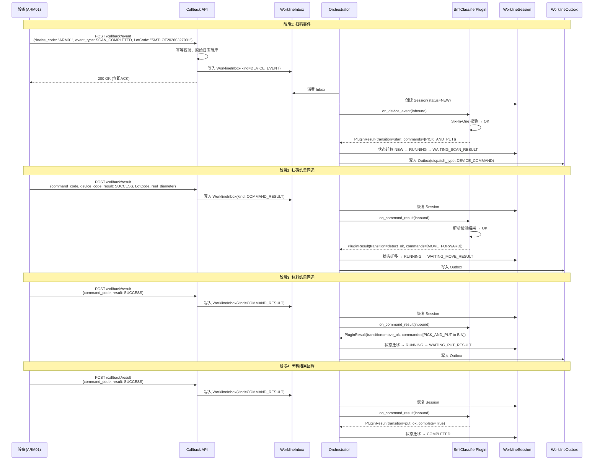
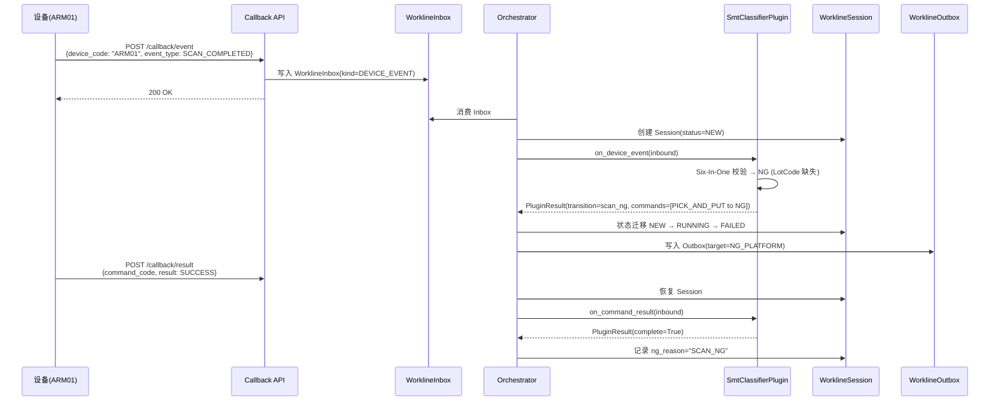
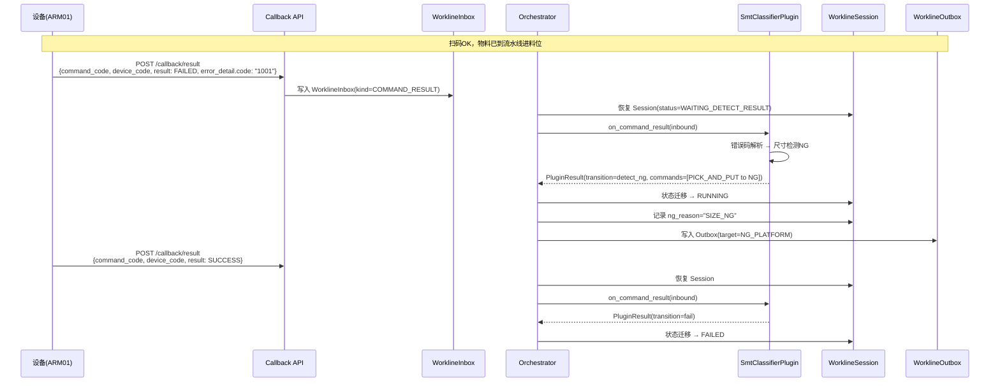
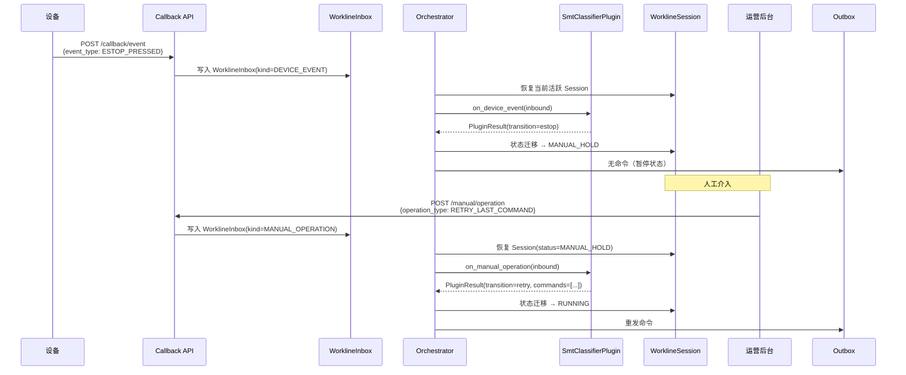
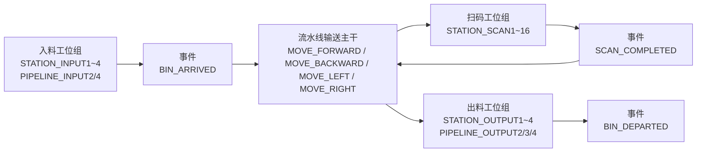
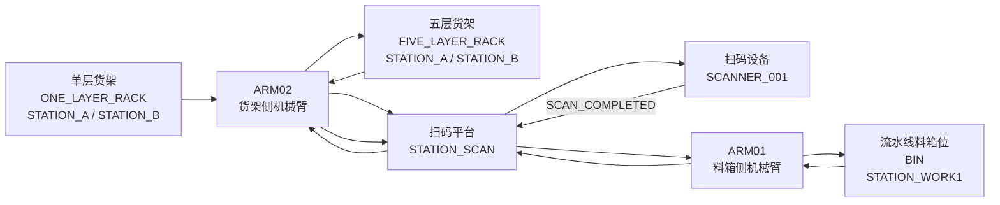

# 硬件工作线拓扑图

> 本文档用于统一整理 `docs/hardware/` 下各类设备与作业线的拓扑结构，便于架构设计、联调评审和插件建模。
> 当前已整理：`SMT 粗分机`、`SMT 流水线`、`SMT 分拣机`。
> 运行时语义 SSOT：`docs/business/workline_business_data_event_flow_spec.md`

> **口径修订（2026-03-25）**:
> 本文档用于描述硬件实例、设备角色、位置命名和样例时序，不直接定义运行时主链路语义。
> `LEFT/RIGHT` 在本文中表示两条独立 `WorkLine` 实例，不表示插件内部分支。
> 位置 ID 命名可作为设备协议样例，但不能作为运行时按前缀分线、按前缀推导拓扑的依据。

---

## 作业线拓扑建模模板

> 本节定义作业线拓扑文档的标准化结构，后续每种作业线类型应遵循此模板填写。

### 模板结构

| 章节 | 内容 | 目的 |
|------|------|------|
| **1. 总体说明** | 设备组成、业务目标、外部协同系统 | 理解业务背景 |
| **2. 设备角色定义** | 设备ID、角色、能力、上游关系 | 映射到 Device 表 |
| **3. 位置与路由** | 位置ID、类型、所属作业线、设备归属 | 映射命令的 source/target |
| **4. 事件类型映射** | 事件类型 → InboxKind → Session 影响 | 编排器入口逻辑 |
| **5. 命令类型映射** | 命令类型 → dispatch_type → Outbox | 编排器出口逻辑 |
| **6. 状态机定义** | 状态枚举、迁移规则、回调定义 | Session 状态管理 |
| **7. Session 上下文** | context_json 字段定义 | 业务数据载体 |
| **8. 时序图** | 典型场景的事件-决策-命令流转 | 开发和培训参考 |
| **9. 错误码映射** | 设备错误码 → 业务归因 → 恢复策略 | 排障和人工介入 |
| **10. 建模提示** | 与插件架构的对应关系 | 开发指南 |

---

## 1. SMT 粗分机工作线拓扑

> **模板版本**: v1.0
> **参考文档**: [SMT粗分机接口调用说明书20260321-v1.md](./SMT粗分机接口调用说明书20260321-v1.md)
> **插件 Key**: `smt_classifier`
> **作业线实例**: 左侧粗分线、右侧粗分线

### 1.1 总体说明

SMT 粗分机由**左右两条独立并行作业线**组成，每条作业线遵循相同的基本结构：

1. 进料机械臂从串杆/进料位取料
2. 进行扫码、尺寸检测、测厚、NG 判定
3. NG 物料进入 NG 缓存位
4. OK 物料进入流水线进料位
5. 流水线将物料输送到出料位
6. 出料机械臂将物料放入目标料箱

**作业线实例**:

| 实例名称 | 流水线 | 进料机械臂 | 出料机械臂 | 实例说明 |
|---------|--------|-----------|-----------|---------|
| 左侧粗分线 | `PIPELINE01` | `ARM01` | `ARM02` | 独立 `WorkLine` 实例 |
| 右侧粗分线 | `PIPELINE02` | `ARM03` | `ARM04` | 独立 `WorkLine` 实例 |

> **设计决策**:
> 左右作业线是两条独立 `WorkLine`，运行时按 `Device.work_line_id` 归线，
> 按 `Device.upstream_device_id` 推导拓扑；外部位置命名中的前缀只作为命名示例，不作为运行时分线依据。

### 1.2 设备流拓扑总图

#### 1.2.1 物理设备拓扑



#### 1.2.2 WES 与设备交互流程（左侧作业线为例）



**交互模式说明**:

| 交互类型 | 方向 | 触发方 | 数据内容 | 接口 |
|---------|------|--------|---------|------|
| **事件上报** | 设备 → WES | 设备主动 | 扫码完成、急停等 | `POST /callback/event` |
| **结果回传** | 设备 → WES | 命令执行后 | 成功/失败、Six-In-One、尺寸 | `POST /callback/result` |
| **命令下发** | WES → 设备 | WES 主动 | 抓取、放置、移动 | `POST /api/v1/command` |

#### 1.2.3 设备能力与交互对照表

| 设备 | 能力 | 主动上报事件 | 接收命令 |
|------|------|------------|---------|
| **ARM01/03**<br/>(进料机械臂) | SCAN, SIZE_DETECT,<br/>THICKNESS_DETECT,<br/>PICK, PUT | `SCAN_COMPLETED`<br/>检测结果(Six-In-One/尺寸/厚度) | `PICK_AND_PUT`<br/>(抓取+放置) |
| **PIPELINE01/02**<br/>(流水线) | MOVE_FORWARD,<br/>MOVE_BACKWARD | 命令执行结果 | `MOVE_FORWARD`<br/>`MOVE_BACKWARD` |
| **ARM02/04**<br/>(出料机械臂) | PICK, PUT | 命令执行结果 | `PICK_AND_PUT`<br/>(抓取+放置) |

#### 1.2.4 典型流程的交互序列

**扫码OK → 检测OK → 出料完整流程**:

| 步骤 | 交互类型 | 消息 | 发送方 | 接收方 |
|------|---------|------|--------|--------|
| 1 | 事件上报 | `SCAN_COMPLETED{LotCode, DateCode, ...}` | ARM01 | WES |
| 2 | 命令下发 | `PICK_AND_PUT{INPUT→PIPELINE_INPUT}` | WES | ARM01 |
| 3 | 结果回传 | `COMMAND_RESULT{LotCode, diameter, thickness}` | ARM01 | WES |
| 4 | 命令下发 | `MOVE_FORWARD{INPUT→OUTPUT}` | WES | PIPELINE01 |
| 5 | 结果回传 | `COMMAND_RESULT{SUCCESS}` | PIPELINE01 | WES |
| 6 | 命令下发 | `PICK_AND_PUT{PIPELINE_OUTPUT→BIN}` | WES | ARM02 |
| 7 | 结果回传 | `COMMAND_RESULT{SUCCESS}` | ARM02 | WES |

**扫码NG流程**:

| 步骤 | 交互类型 | 消息 | 发送方 | 接收方 |
|------|---------|------|--------|--------|
| 1 | 事件上报 | `SCAN_COMPLETED{LotCode 缺失}` | ARM01 | WES |
| 2 | 命令下发 | `PICK_AND_PUT{INPUT→NG_PLATFORM}` | WES | ARM01 |
| 3 | 结果回传 | `COMMAND_RESULT{SUCCESS}` | ARM01 | WES |

#### 1.2.5 图例说明

| 样式 | 含义 |
|------|------|
| 蓝色背景 | 机械臂设备 (INPUT_ARM, OUTPUT_ARM) |
| 橙色背景 | 流水线设备 (CONVEYOR) |
| 红色背景 | NG缓存位 |
| 绿色背景 | 出料料箱 |
| 📤 | 事件上报/结果回传 (设备→WES) |
| 📥 | 命令下发 (WES→设备) |

### 1.3 设备角色定义

| 设备ID | 设备角色 | 角色序号 | 能力列表 | 上游设备 | 说明 |
|--------|---------|---------|---------|---------|------|
| `ARM01` | `INPUT_ARM` | 1 | `SCAN`, `SIZE_DETECT`, `THICKNESS_DETECT`, `PICK`, `PUT` | - | 左侧进料机械臂 |
| `ARM02` | `OUTPUT_ARM` | 1 | `PICK`, `PUT` | `PIPELINE01` | 左侧出料机械臂 |
| `ARM03` | `INPUT_ARM` | 2 | `SCAN`, `SIZE_DETECT`, `THICKNESS_DETECT`, `PICK`, `PUT` | - | 右侧进料机械臂 |
| `ARM04` | `OUTPUT_ARM` | 2 | `PICK`, `PUT` | `PIPELINE02` | 右侧出料机械臂 |
| `PIPELINE01` | `CONVEYOR` | 1 | `MOVE_FORWARD`, `MOVE_BACKWARD` | `ARM01` | 左侧流水线 |
| `PIPELINE02` | `CONVEYOR` | 2 | `MOVE_FORWARD`, `MOVE_BACKWARD` | `ARM03` | 右侧流水线 |

**映射到 Device 表**:

```python
class SmtClassifierDeviceRoles(str, Enum):
    INPUT_ARM = “INPUT_ARM”      # 进料机械臂
    OUTPUT_ARM = “OUTPUT_ARM”    # 出料机械臂
    CONVEYOR = “CONVEYOR”        # 流水线
```

**设备能力枚举**:

```python
class SmtClassifierCapabilities(str, Enum):
    SCAN = “SCAN”                      # 扫码
    SIZE_DETECT = “SIZE_DETECT”        # 尺寸检测
    THICKNESS_DETECT = “THICKNESS_DETECT”  # 测厚
    PICK = “PICK”                      # 抓取
    PUT = “PUT”                        # 放置
    MOVE_FORWARD = “MOVE_FORWARD”      # 前进
    MOVE_BACKWARD = “MOVE_BACKWARD”    # 后退
```

### 1.4 位置与路由

#### 1.4.1 位置ID清单

> 以下位置 ID 仅用于描述左右两个 `WorkLine` 实例在设备协议中的命名示例，不表示插件内部按前缀分支，也不表示运行时依赖前缀进行归线。

| 位置ID | 位置类型 | 所属作业线 | 关联设备 | 说明 |
|--------|---------|-----------|---------|------|
| `LEFT_STATION_INPUT` | `INPUT_PLATFORM` | 左侧 | `ARM01` | 左侧串杆扫码位置 |
| `LEFT_STATION_NG` | `NG_PLATFORM` | 左侧 | `ARM01` | 左侧NG缓存位 |
| `LEFT_STATION_PIPELINE_INPUT` | `PIPELINE_PLATFORM` | 左侧 | `ARM01` | 左侧流水线进料位 |
| `LEFT_STATION_PIPELINE_OUTPUT` | `PIPELINE_PLATFORM` | 左侧 | `PIPELINE01` | 左侧流水线出料位 |
| `LEFT_STATION_OUTPUT` | `BIN` | 左侧 | `ARM02` | 左侧出料位（料箱） |
| `RIGHT_STATION_INPUT` | `INPUT_PLATFORM` | 右侧 | `ARM03` | 右侧串杆扫码位置 |
| `RIGHT_STATION_NG` | `NG_PLATFORM` | 右侧 | `ARM03` | 右侧NG缓存位 |
| `RIGHT_STATION_PIPELINE_INPUT` | `PIPELINE_PLATFORM` | 右侧 | `ARM03` | 右侧流水线进料位 |
| `RIGHT_STATION_PIPELINE_OUTPUT` | `PIPELINE_PLATFORM` | 右侧 | `PIPELINE02` | 右侧流水线出料位 |
| `RIGHT_STATION_OUTPUT` | `BIN` | 右侧 | `ARM04` | 右侧出料位（料箱） |

#### 1.4.2 位置类型枚举

```python
class SmtClassifierLocationType(str, Enum):
    INPUT_PLATFORM = “INPUT_PLATFORM”       # 进料平台
    NG_PLATFORM = “NG_PLATFORM”             # NG缓存位
    PIPELINE_PLATFORM = “PIPELINE_PLATFORM” # 流水线平台
    BIN = “BIN”                             # 料箱
```

#### 1.4.3 路由映射

**左侧作业线实例路由示例表**:

| 当前位置 | 条件 | 目标位置 | 下发设备 | 命令类型 |
|---------|------|---------|---------|---------|
| `LEFT_STATION_INPUT` | 扫码OK | `LEFT_STATION_PIPELINE_INPUT` | `ARM01` | `PICK_AND_PUT` |
| `LEFT_STATION_INPUT` | 扫码NG | `LEFT_STATION_NG` | `ARM01` | `PICK_AND_PUT` |
| `LEFT_STATION_PIPELINE_INPUT` | 检测OK | `LEFT_STATION_PIPELINE_OUTPUT` | `PIPELINE01` | `MOVE_FORWARD` |
| `LEFT_STATION_PIPELINE_INPUT` | 检测NG | `LEFT_STATION_NG` | `ARM01` | `PICK_AND_PUT` |
| `LEFT_STATION_PIPELINE_OUTPUT` | - | `LEFT_STATION_OUTPUT` | `ARM02` | `PICK_AND_PUT` |

### 1.5 事件类型映射

| 事件类型 | InboxKind | Session影响 | 处理逻辑 |
|---------|-------------|------------|---------|
| `SCAN_COMPLETED` | `DEVICE_EVENT` | 创建/恢复Session | 解析条码，判断OK/NG |
| `ESTOP_PRESSED` | `DEVICE_EVENT` | 中断当前Session | 进入MANUAL_HOLD |
| 命令结果 `SUCCESS` | `COMMAND_RESULT` | 推进Session状态 | 继续下一步或完成 |
| 命令结果 `FAILED` | `COMMAND_RESULT` | 触发错误处理 | 错误归因，恢复策略 |
| 超时 | `TIMEOUT` | 触发超时处理 | 重试或人工介入 |
| 人工操作 | `MANUAL_OPERATION` | 按操作类型处理 | 恢复/取消/标记 |

**事件数据结构映射**:

```python
# SCAN_COMPLETED 事件 payload
class ScanCompletedEvent(BaseModel):
    location: str                    # 位置ID
    LotCode: str | None = None       # 批次码
    DateCode: str | None = None      # 日期码
    Qty: str | None = None           # 数量
    ProductNo: str | None = None     # 产品PN码
    MfrPN: str | None = None         # 制造商PN码
    PONumber: str | None = None      # 订单码

# ESTOP_PRESSED 事件 payload
class EstopPressedEvent(BaseModel):
    data: None = None                # 无额外数据
```

### 1.6 命令类型映射

| 命令类型 | dispatch_type | 目标设备角色 | source字段 | target字段 |
|---------|--------------|-------------|-----------|-----------|
| `PICK_AND_PUT` | `DEVICE_COMMAND` | `INPUT_ARM`/`OUTPUT_ARM` | 源位置 | 目标位置 |
| `MOVE_FORWARD` | `DEVICE_COMMAND` | `CONVEYOR` | 流水线进料位 | 流水线出料位 |
| `MOVE_BACKWARD` | `DEVICE_COMMAND` | `CONVEYOR` | 流水线出料位 | 流水线进料位 |
| CANCEL | `DEVICE_COMMAND` | 任意 | command_code | - |

**命令数据结构映射**:

```python
class PickAndPutCommand(BaseModel):
    device_code: str                  # 设备编码
    command_code: str                 # 命令编码
    timestamp: str                    # 时间戳
    task_type: str = “PICK_AND_PUT”   # 任务类型
    priority: int = 1                 # 优先级
    timeout: int = 30000              # 超时(ms)
    source: PickAndPutLocationInfo    # 源位置
    target: PickAndPutLocationInfo    # 目标位置

class PickAndPutLocationInfo(BaseModel):
    location_id: str                  # 位置ID
    location_type: str                # 位置类型
    rack_id: str | None = None        # 料架编号(BIN类型必填)
    bin_id: str | None = None         # 箱体编号(BIN类型必填)
    bin_type: str | None = None       # 料箱类型: 三格箱/六格箱
    bin_cell_location: str | None = None  # 格子位置
    reel_layer: str | None = None     # 料盘层数
    reel_thickness: str | None = None # 料盘厚度(mm)
    reel_diameter: str | None = None  # 料盘直径(7inch/13inch/15inch)
    reel_totalthickness: str | None = None  # 料盘总厚度
```

### 1.7 状态机定义

#### 1.7.1 状态枚举

```python
class SmtClassifierStatus(str, Enum):
    “””SMT粗分机Session状态”””
    NEW = “NEW”                                    # 新建
    RUNNING = “RUNNING”                            # 运行中
    WAITING_SCAN_RESULT = “WAITING_SCAN_RESULT”    # 等待扫码结果
    WAITING_DETECT_RESULT = “WAITING_DETECT_RESULT”  # 等待检测结果
    WAITING_MOVE_RESULT = “WAITING_MOVE_RESULT”    # 等待移料结果
    WAITING_PUT_RESULT = “WAITING_PUT_RESULT”      # 等待出料结果
    MANUAL_HOLD = “MANUAL_HOLD”                    # 人工介入
    COMPLETED = “COMPLETED”                        # 已完成
    FAILED = “FAILED”                              # 已失败
    CANCELLED = “CANCELLED”                        # 已取消
```

#### 1.7.2 状态迁移图

```
┌─────────────────────────────────────────────────────────────────────────┐
│                  SmtClassifierStateMachine                               │
├─────────────────────────────────────────────────────────────────────────┤
│                                                                          │
│   ┌─────┐                    ┌─────────┐                                │
│   │ NEW │───── start ──────▶ │ RUNNING │                                │
│   └─────┘                    └────┬────┘                                │
│                                   │                                      │
│                ┌──────────────────┼──────────────────┐                  │
│                │                  │                  │                  │
│                ▼                  ▼                  ▼                  │
│   ┌──────────────────────┐ ┌─────────────────┐ ┌────────────────┐      │
│   │WAITING_SCAN_RESULT   │ │WAITING_DETECT_  │ │WAITING_MOVE_   │      │
│   └──────────┬───────────┘ │    RESULT       │ │   RESULT       │      │
│              │             └────────┬────────┘ └───────┬────────┘      │
│              │                      │                  │               │
│              │ scan_ok              │ detect_ok        │ move_ok        │
│              │ scan_ng → FAILED     │ detect_ng → NG   │                │
│              ▼                      ▼                  ▼               │
│   ┌─────────────────────────────────────────────────────────┐          │
│   │                      RUNNING                             │          │
│   └────────────────────────────┬────────────────────────────┘          │
│                                │                                        │
│                     ┌──────────┴──────────┐                            │
│                     │                     │                            │
│                     ▼                     ▼                            │
│          ┌─────────────────────┐   ┌───────────────┐                   │
│          │ WAITING_PUT_RESULT  │   │  MANUAL_HOLD  │                   │
│          └──────────┬──────────┘   └───────┬───────┘                   │
│                     │                      │                            │
│                     │ put_ok               │ retry / manual_ok         │
│                     ▼                      ▼                            │
│              ┌───────────┐          ┌─────────┐                         │
│              │ COMPLETED │◀─────────│ RUNNING │                         │
│              └───────────┘          └─────────┘                         │
│                                                                            │
│   ┌───────────┐          ┌───────────┐                                   │
│   │  FAILED   │◀─────────│    *      │  fail                            │
│   └───────────┘          └───────────┘                                   │
│                                                                            │
│   ┌───────────┐          ┌───────────────┐                               │
│   │ CANCELLED │◀─────────│ NEW, RUNNING  │  cancel                        │
│   └───────────┘          └───────────────┘                               │
│                                                                            │
└─────────────────────────────────────────────────────────────────────────┘
```

#### 1.7.3 迁移规则

```python
TRANSITIONS = [
    # 基础流程
    ['start', SmtClassifierStatus.NEW, SmtClassifierStatus.RUNNING],
    ['wait_scan', SmtClassifierStatus.RUNNING, SmtClassifierStatus.WAITING_SCAN_RESULT],
    ['wait_detect', SmtClassifierStatus.RUNNING, SmtClassifierStatus.WAITING_DETECT_RESULT],
    ['wait_move', SmtClassifierStatus.RUNNING, SmtClassifierStatus.WAITING_MOVE_RESULT],
    ['wait_put', SmtClassifierStatus.RUNNING, SmtClassifierStatus.WAITING_PUT_RESULT],

    # 结果处理
    ['scan_ok', SmtClassifierStatus.WAITING_SCAN_RESULT, SmtClassifierStatus.RUNNING],
    ['scan_ng', SmtClassifierStatus.WAITING_SCAN_RESULT, SmtClassifierStatus.FAILED],
    ['detect_ok', SmtClassifierStatus.WAITING_DETECT_RESULT, SmtClassifierStatus.RUNNING],
    ['detect_ng', SmtClassifierStatus.WAITING_DETECT_RESULT, SmtClassifierStatus.RUNNING],  # 触发NG流程
    ['move_ok', SmtClassifierStatus.WAITING_MOVE_RESULT, SmtClassifierStatus.RUNNING],
    ['put_ok', SmtClassifierStatus.WAITING_PUT_RESULT, SmtClassifierStatus.COMPLETED],

    # 异常处理
    ['estop', SmtClassifierStatus.RUNNING, SmtClassifierStatus.MANUAL_HOLD],
    ['estop', SmtClassifierStatus.WAITING_SCAN_RESULT, SmtClassifierStatus.MANUAL_HOLD],
    ['estop', SmtClassifierStatus.WAITING_DETECT_RESULT, SmtClassifierStatus.MANUAL_HOLD],
    ['estop', SmtClassifierStatus.WAITING_MOVE_RESULT, SmtClassifierStatus.MANUAL_HOLD],
    ['estop', SmtClassifierStatus.WAITING_PUT_RESULT, SmtClassifierStatus.MANUAL_HOLD],

    # 人工恢复
    ['retry', SmtClassifierStatus.MANUAL_HOLD, SmtClassifierStatus.RUNNING],
    ['manual_ok', SmtClassifierStatus.MANUAL_HOLD, SmtClassifierStatus.COMPLETED],

    # 终态
    {'trigger': 'fail', 'source': '*', 'dest': SmtClassifierStatus.FAILED},
    {'trigger': 'cancel', 'source': [SmtClassifierStatus.NEW, SmtClassifierStatus.RUNNING],
     'dest': SmtClassifierStatus.CANCELLED},
]
```

### 1.8 Session 上下文

#### 1.8.1 context_json 字段定义

```python
class SmtClassifierContext(BaseModel):
    “””SMT粗分机Session上下文”””

    # 条码信息
    barcodes: list[str] = Field(default_factory=list, description=”扫描到的条码列表”)
    primary_barcode: str | None = Field(None, description=”主条码（第一个有效条码）”)

    # 检测信息
    reel_diameter: str | None = Field(None, description=”料盘直径: 7inch/13inch/15inch”)
    reel_thickness: str | None = Field(None, description=”料盘厚度(mm)”)

    # 位置信息
    current_location: str | None = Field(None, description=”当前位置ID”)
    target_location: str | None = Field(None, description=”目标位置ID”)

    # 料箱信息（出料时）
    target_bin_id: str | None = Field(None, description=”目标料箱ID”)
    target_bin_cell: str | None = Field(None, description=”目标格子位置”)

    # 错误信息
    last_error_code: str | None = Field(None, description=”最后错误码”)
    last_error_message: str | None = Field(None, description=”最后错误信息”)

    # 流程追踪
    scan_result: str | None = Field(None, description=”扫码结果: OK/NG”)
    detect_result: str | None = Field(None, description=”检测结果: OK/NG”)
    ng_reason: str | None = Field(None, description=”NG原因: SCAN_NG/SIZE_NG/THICKNESS_NG”)

    # 重试计数
    retry_count: int = Field(0, description=”重试次数”)
```

#### 1.8.2 context_schema_version

当前版本: `1.0`

### 1.9 时序图

#### 1.9.1 扫码OK → 检测OK → 出料完整流程



#### 1.9.2 扫码NG流程



#### 1.9.3 检测NG流程



#### 1.9.4 急停恢复流程



### 1.10 错误码映射

#### 1.10.1 设备错误码 → 业务归因

| 错误码 | 设备含义 | 业务归因 | Session影响 | 恢复策略 |
|--------|---------|---------|------------|---------|
| `NONE`/`0` | 无错误 | 正常 | 继续流程 | - |
| `1001` | 料盘尺寸检测异常 | 检测NG | 触发NG流程 | 自动移到NG位，Session标记FAILED |
| `1002` | 料盘厚度检测异常 | 检测NG | 触发NG流程 | 自动移到NG位，Session标记FAILED |
| `2001` | 扫码异常 | 扫码失败 | 重试或人工 | 重试3次，失败后进入MANUAL_HOLD |
| `2002` | 搬运失败 | 机械臂异常 | 人工介入 | 进入MANUAL_HOLD，人工恢复 |
| `2003` | 料箱已满 | 出料位满 | 等待更换 | 等待料箱更换，超时告警 |
| `9999` | 未知错误 | 系统异常 | 人工介入 | 进入MANUAL_HOLD，日志告警 |

#### 1.10.2 超时场景映射

| 等待状态 | 超时时间 | 超时后动作 | 人工操作类型 |
|---------|---------|-----------|-------------|
| `WAITING_SCAN_RESULT` | 30s | 重试扫码，3次后人工 | `RETRY_LAST_COMMAND` |
| `WAITING_DETECT_RESULT` | 60s | 查询设备状态，超时人工 | `MARK_SUCCESS_AND_CONTINUE` |
| `WAITING_MOVE_RESULT` | 120s | 重发移动命令，3次后人工 | `RETRY_LAST_COMMAND` |
| `WAITING_PUT_RESULT` | 60s | 查询设备状态，超时人工 | `MANUAL_PUT_FINISHED` |

#### 1.10.3 人工操作类型

| 操作类型 | 适用状态 | 效果 | 权限要求 |
|---------|---------|------|---------|
| `RETRY_LAST_COMMAND` | `MANUAL_HOLD` | 重新发送上一个命令 | 操作员 |
| `MARK_SUCCESS_AND_CONTINUE` | `MANUAL_HOLD` | 标记当前步骤成功，继续下一步 | 操作员 |
| `MARK_NG_AND_CLOSE` | `RUNNING`, `MANUAL_HOLD` | 移到NG位，结束Session | 操作员 |
| `CANCEL_SESSION` | 非终态 | 取消Session，清理现场 | 管理员 |
| `MANUAL_PUT_FINISHED` | `WAITING_PUT_RESULT` | 人工确认放置完成 | 操作员 |

### 1.11 建模提示

#### 1.11.1 与插件架构的对应关系

| 架构层 | 粗分机实现 | 说明 |
|--------|-----------|------|
| **Device Access Layer** | `POST /callback/event`, `POST /callback/result` | 设备事件和结果回调 |
| **Workline Orchestration Layer** | `SmtClassifierOrchestrator` | 消费Inbox，调用插件，原子写入 |
| **Plugin Layer** | `SmtClassifierPlugin` | 业务决策，状态迁移 |
| **Dispatcher Layer** | `DeviceCommandDispatcher` | 发送命令到设备 |
| **Traceability Layer** | `WorklineTimeline`, `DecisionLog` | 追踪和审计 |

#### 1.11.2 插件开发清单

- [ ] 实现 `BusinessKeyResolver`（business_key = primary_barcode）
- [ ] 实现 `SmtClassifierStateMachine`（继承 `WorklineStateMachine`）
- [ ] 实现 `SmtClassifierPlugin`（实现 Protocol 接口）
- [ ] 定义 `SmtClassifierContext`（context_json Schema）
- [ ] 配置设备角色映射（Device → Role）
- [ ] 配置位置路由表（Location → Next Location）
- [ ] 编写单元测试（状态迁移、错误处理）

#### 1.11.3 业务主链路建模要点

- **Session 主语**: 一个 Session 代表一个物料的完整处理流程
- **business_key**: 使用 `primary_barcode` 作为业务键
- **状态机**: 显式定义所有状态和迁移，禁止隐式状态变更
- **错误处理**: 所有错误都进入统一恢复路径（MANUAL_HOLD 或 FAILED）
- **可追溯性**: 每个决策、命令、事件都记录 Timeline

#### 1.11.4 WorkLine 与 Session 层级关系

```
┌─────────────────────────────────────────────────────────────────────────────┐
│                         粗分机系统架构层次                                    │
├─────────────────────────────────────────────────────────────────────────────┤
│                                                                              │
│   ┌─────────────────────────────────────────────────────────────────────┐   │
│   │                        Plugin: SmtClassifierPlugin                  │   │
│   │                        (业务逻辑，全局唯一)                           │   │
│   └─────────────────────────────────────────────────────────────────────┘   │
│                                    │                                         │
│                          ┌─────────┴─────────┐                              │
│                          │                   │                              │
│                          ▼                   ▼                              │
│   ┌─────────────────────────────┐  ┌─────────────────────────────┐         │
│   │   WorkLine #1 (左侧粗分线)   │  │   WorkLine #2 (右侧粗分线)   │         │
│   │   ─────────────────────────  │  │   ─────────────────────────  │         │
│   │   workline_id: 1             │  │   workline_id: 2             │         │
│   │   plugin_key: smt_classifier │  │   plugin_key: smt_classifier │         │
│   │   ─────────────────────────  │  │   ─────────────────────────  │         │
│   │   devices:                   │  │   devices:                   │         │
│   │     PIPELINE01, ARM01, ARM02 │  │     PIPELINE02, ARM03, ARM04 │         │
│   │   ─────────────────────────  │  │   ─────────────────────────  │         │
│   │   Sessions:                  │  │   Sessions:                  │         │
│   │     Session#1 (LotCode:A)    │  │     Session#3 (LotCode:C)    │         │
│   │     Session#2 (LotCode:B)    │  │     Session#4 (LotCode:D)    │         │
│   │     ...                      │  │     ...                      │         │
│   └─────────────────────────────┘  └─────────────────────────────┘         │
│                                                                              │
│   层级关系: Plugin → WorkLine → Session                                      │
│   - Plugin: 业务逻辑模板，代码级唯一                                          │
│   - WorkLine: 编排边界，配置级实例                                            │
│   - Session: 业务上下文，运行级实例                                            │
│                                                                              │
└─────────────────────────────────────────────────────────────────────────────┘
```

**核心概念对照**:

| 概念 | 粒度 | 数量 | 生命周期 | 粗分机场景 |
|------|------|------|---------|-----------|
| **Plugin** | 业务模板 | 1（代码级） | 系统生命周期 | `SmtClassifierPlugin` |
| **WorkLine** | 编排边界 | N（配置级） | 系统生命周期 | 左侧线、右侧线 |
| **Session** | 业务上下文 | N（运行级） | 请求生命周期 | 每个物料一个 |

#### 1.11.5 水平扩展能力

**新增粗分机无需修改代码，仅需配置**：

```sql
-- 示例：新增三号线粗分机

-- 1. 新增 WorkLine
INSERT INTO work_lines (name, plugin_key, run_mode, status)
VALUES ('三号线粗分线', 'smt_classifier', 'INBOUND', 'ACTIVE');

-- 2. 新增设备（假设 workline_id = 3）
INSERT INTO devices (code, device_role, role_index, workline_id) VALUES
('PIPELINE03', 'CONVEYOR', 3, 3),
('ARM05', 'INPUT_ARM', 3, 3),
('ARM06', 'OUTPUT_ARM', 3, 3);

-- 3. 配置位置映射（略）
-- 完成！插件代码自动适配
```

**扩展成本对比**:

| 扩展方式 | 代码修改 | 测试回归 | 部署风险 |
|---------|---------|---------|---------|
| 传统方式（设备类型绑定） | 中 | 高 | 高 |
| 插件化方式（WorkLine配置） | **0** | 低 | **无** |

**role_index 的自动适配**:

```python
# 插件代码无需感知具体是哪条线
class SmtClassifierPlugin:
    async def on_device_event(self, ctx: PluginContext, inbox: WorklineInbox):
        # 自动获取当前 WorkLine 对应角色的设备
        input_arm = ctx.get_device_by_role(DeviceRole.INPUT_ARM)
        output_arm = ctx.get_device_by_role(DeviceRole.OUTPUT_ARM)
        conveyor = ctx.get_device_by_role(DeviceRole.CONVEYOR)

        # workline_id=1 → input_arm=ARM01, role_index=1
        # workline_id=2 → input_arm=ARM03, role_index=2
        # workline_id=3 → input_arm=ARM05, role_index=3
        # 业务逻辑完全相同，自动绑定到正确的设备
```

### 1.12 测试场景清单

#### 1.12.1 状态机测试

| 状态迁移 | Happy Path | Failure Path | Edge Case |
|---------|-----------|--------------|-----------|
| NEW → RUNNING | `start` 触发 | - | 重复 `start` |
| RUNNING → WAITING_SCAN_RESULT | `wait_scan` 触发 | - | 并发 `wait_*` |
| WAITING_SCAN_RESULT → RUNNING | `scan_ok` 触发 | `scan_ng` → FAILED | 超时 → 重试 |
| RUNNING → WAITING_DETECT_RESULT | `wait_detect` 触发 | - | - |
| WAITING_DETECT_RESULT → RUNNING | `detect_ok` / `detect_ng` 触发 | - | 超时 → 重试 |
| RUNNING → WAITING_MOVE_RESULT | `wait_move` 触发 | - | - |
| WAITING_MOVE_RESULT → RUNNING | `move_ok` 触发 | - | 超时 → 重试 |
| RUNNING → WAITING_PUT_RESULT | `wait_put` 触发 | - | - |
| WAITING_PUT_RESULT → COMPLETED | `put_ok` 触发 | - | 超时 → 重试 |
| * → MANUAL_HOLD | `estop` 触发 | - | - |
| MANUAL_HOLD → RUNNING | `retry` 触发 | - | 重复 `retry` |
| RUNNING → FAILED | `fail` 触发 | - | - |
| RUNNING → CANCELLED | `cancel` 触发 | - | - |

#### 1.12.2 业务流程测试

| 场景 | 前置条件 | 测试步骤 | 预期结果 |
|------|---------|---------|---------|
| **扫码OK → 出料** | 物料在串杆位置 | 1. 收到 SCAN_COMPLETED (LotCode 有效)<br>2. 发送 PICK_AND_PUT 到流水线进料位<br>3. 收到检测结果 OK<br>4. 发送 MOVE_FORWARD<br>5. 发送 PICK_AND_PUT 到料箱 | Session COMPLETED |
| **扫码NG** | 物料在串杆位置 | 1. 收到 SCAN_COMPLETED (LotCode 缺失)<br>2. 发送 PICK_AND_PUT 到 NG 位 | Session FAILED, ng_reason=SCAN_NG |
| **检测NG (尺寸)** | 物料在流水线进料位 | 1. 收到命令结果 (error_code=1001)<br>2. 发送 PICK_AND_PUT 到 NG 位 | Session FAILED, ng_reason=SIZE_NG |
| **检测NG (厚度)** | 物料在流水线进料位 | 1. 收到命令结果 (error_code=1002)<br>2. 发送 PICK_AND_PUT 到 NG 位 | Session FAILED, ng_reason=THICKNESS_NG |
| **急停恢复** | Session RUNNING | 1. 收到 ESTOP_PRESSED<br>2. Session → MANUAL_HOLD<br>3. 人工操作 RETRY_LAST_COMMAND<br>4. Session → RUNNING | Session 继续执行 |
| **超时重试** | Session WAITING_* | 1. 超过超时时间<br>2. 自动重试命令<br>3. 重试3次后人工介入 | Session MANUAL_HOLD 或继续 |
| **料箱满** | 出料阶段 | 1. 收到命令结果 (error_code=2003)<br>2. 等待料箱更换<br>3. 超时告警 | Session 等待或 MANUAL_HOLD |
| **设备离线** | 任意阶段 | 1. 命令发送失败<br>2. 重试3次<br>3. 告警 | Session MANUAL_HOLD |

#### 1.12.3 边界条件测试

| 边界条件 | 测试用例 | 预期处理 |
|---------|---------|---------|
| 重复扫码 | 同一条码在短时间内多次扫描 | 幂等处理，返回已有 Session |
| LotCode 缺失 | `LotCode` 为空或不存在 | 视为 NG，触发 NG 流程 |
| 检测值为 null | diameter=null / thickness=null | 使用默认值或记录警告 |
| 并发命令 | 同一设备同时收到多个命令 | 排队处理，拒绝重复命令 |
| Session 不存在 | 收到命令结果但无对应 Session | 创建日志记录，忽略或创建新 Session |
| 状态迁移无效 | WAITING_* 状态收到 `start` | 拒绝迁移，记录错误 |

### 1.13 Callback API 设计

WES 接收设备事件和结果的回调接口定义。

#### 1.13.1 设备事件上报

**接口**: `POST /api/v1/callback/event`

**请求 Schema**:

```python
from pydantic import BaseModel, Field
from typing import Literal

class DeviceEventCallback(BaseModel):
    """设备事件回调请求"""
    device_code: str = Field(..., description="设备编码")
    event_type: Literal["SCAN_COMPLETED", "ESTOP_PRESSED"] = Field(..., description="事件类型")
    timestamp: int = Field(..., description="事件时间戳(ms)")
    event_id: str = Field(..., description="事件唯一ID，用于幂等处理")
    data: dict | None = Field(None, description="事件负载数据")
```

**响应 Schema**:

```python
class CallbackResponse(BaseModel):
    """回调响应"""
    status: Literal["SUCCESS", "FAILED"] = Field(..., description="处理状态")
    message: str = Field("", description="附加信息")
    code: str = Field("200", description="响应码")
    trace_id: str | None = Field(None, description="追踪ID")
```

**校验规则**:

| 字段 | 校验规则 | 错误响应 |
|------|---------|---------|
| `device_code` | 必须为已注册设备编码 | 400, "Unknown device" |
| `event_id` | 5分钟内不能重复 | 200, "Duplicate event" (幂等返回) |
| `timestamp` | 不能超过当前时间 ±5分钟 | 400, "Invalid timestamp" |
| `event_type` | 必须为枚举值 | 400, "Invalid event_type" |

#### 1.13.2 命令结果回传

**接口**: `POST /api/v1/callback/result`

**请求 Schema**:

```python
class CommandResultCallback(BaseModel):
    """命令结果回调请求"""
    command_code: str = Field(..., description="命令编码（控制流主键）")
    device_code: str = Field(..., description="设备编码")
    result: Literal["SUCCESS", "FAILED"] = Field(..., description="执行结果")
    finish_time: int = Field(..., description="完成时间戳(ms)")
    message: str | None = Field(None, description="附加信息")
    data: dict | None = Field(None, description="业务数据")
    error_detail: dict | None = Field(None, description="错误详情(result=FAILED时必填)")
```

**校验规则**:

| 字段 | 校验规则 | 错误响应 |
|------|---------|---------|
| `command_code` | 必须命中已发送命令 | 400, "Unknown command" |
| `result` | 必须为枚举值 | 400, "Invalid result" |
| `error_detail` | result=FAILED 时必填 | 400, "Missing error_detail" |

#### 1.13.3 幂等处理机制

```python
# 使用 event_id + timestamp 实现幂等
IDEMPOTENT_WINDOW = 300  # 秒 (5分钟)

async def handle_event_callback(event: DeviceEventCallback) -> CallbackResponse:
    # 1. 检查是否在幂等窗口内重复
    cache_key = f"event:{event.event_id}"
    if await redis.exists(cache_key):
        return CallbackResponse(status="SUCCESS", message="Duplicate event (idempotent)")

    # 2. 写入幂等标记
    await redis.setex(cache_key, IDEMPOTENT_WINDOW, "1")

    # 3. 解析设备并写入 Inbox
    resolved_device = await device_service.get_by_code(event.device_code)
    await inbox_service.create(inbox=WorklineInbox(
        kind=InboxKind.DEVICE_EVENT,
        device_id=resolved_device.id,
        payload=event.model_dump(),
        raw_data=event.model_dump_json(),
    ))

    return CallbackResponse(status="SUCCESS", trace_id=generate_trace_id())
```

### 1.14 右侧粗分线位置映射表示例

右侧粗分线在设备协议示例中使用 `RIGHT_` 命名，与左侧实例对称；该命名仅为协议样例，不是运行时分线依据。

| 位置ID | 位置类型 | 关联设备 | 说明 |
|--------|---------|---------|------|
| `RIGHT_STATION_INPUT` | `INPUT_PLATFORM` | `ARM03` | 右侧串杆扫码位置 |
| `RIGHT_STATION_NG` | `NG_PLATFORM` | `ARM03` | 右侧NG缓存位 |
| `RIGHT_STATION_PIPELINE_INPUT` | `PIPELINE_PLATFORM` | `ARM03` | 右侧流水线进料位 |
| `RIGHT_STATION_PIPELINE_OUTPUT` | `PIPELINE_PLATFORM` | `PIPELINE02` | 右侧流水线出料位 |
| `RIGHT_STATION_OUTPUT` | `BIN` | `ARM04` | 右侧出料位（料箱） |

**右侧作业线实例路由示例表**:

| 当前位置 | 条件 | 目标位置 | 下发设备 | 命令类型 |
|---------|------|---------|---------|---------|
| `RIGHT_STATION_INPUT` | 扫码OK | `RIGHT_STATION_PIPELINE_INPUT` | `ARM03` | `PICK_AND_PUT` |
| `RIGHT_STATION_INPUT` | 扫码NG | `RIGHT_STATION_NG` | `ARM03` | `PICK_AND_PUT` |
| `RIGHT_STATION_PIPELINE_INPUT` | 检测OK | `RIGHT_STATION_PIPELINE_OUTPUT` | `PIPELINE02` | `MOVE_FORWARD` |
| `RIGHT_STATION_PIPELINE_INPUT` | 检测NG | `RIGHT_STATION_NG` | `ARM03` | `PICK_AND_PUT` |
| `RIGHT_STATION_PIPELINE_OUTPUT` | - | `RIGHT_STATION_OUTPUT` | `ARM04` | `PICK_AND_PUT` |

### 1.15 实现文件结构规划

```
src/
├── app/
│   └── workline/                          # WorkLine 模块目录
│       ├── __init__.py
│       ├── models/                         # 数据模型
│       │   ├── __init__.py
│       │   ├── session.py                  # WorklineSession 模型
│       │   ├── inbox.py                    # WorklineInbox 模型
│       │   └── outbox.py                   # WorklineOutbox 模型
│       │
│       ├── plugins/                        # 插件目录
│       │   ├── __init__.py
│       │   ├── base.py                     # Plugin Protocol 基类
│       │   └── smt_classifier/             # SMT粗分机插件
│       │       ├── __init__.py
│       │       ├── plugin.py               # SmtClassifierPlugin 实现
│       │       ├── state_machine.py        # 状态机定义
│       │       ├── context.py              # Session 上下文 Schema
│       │       ├── commands.py             # 命令生成逻辑
│       │       └── constants.py            # 设备角色、位置类型枚举
│       │
│       ├── services/                       # 服务层
│       │   ├── __init__.py
│       │   ├── orchestrator.py             # 编排器
│       │   ├── inbox_service.py            # Inbox 服务
│       │   └── outbox_service.py           # Outbox 服务
│       │
│       ├── repositories/                   # Repository 层
│       │   ├── __init__.py
│       │   ├── session_repository.py
│       │   ├── inbox_repository.py
│       │   └── outbox_repository.py
│       │
│       └── api/                            # API 层
│           ├── __init__.py
│           ├── callback.py                 # 设备回调 API
│           └── device.py                   # 设备命令 API
│
└── tests/
    └── workline/
        ├── test_state_machine.py           # 状态机测试
        ├── test_plugin.py                  # 插件逻辑测试
        ├── test_callback.py                # 回调 API 测试
        └── test_flows/                     # 流程集成测试
            ├── test_scan_ok_flow.py
            ├── test_scan_ng_flow.py
            ├── test_detect_ng_flow.py
            └── test_estop_flow.py
```

**关键文件职责**:

| 文件 | 职责 |
|------|------|
| `plugin.py` | 实现 Plugin Protocol，处理事件和命令结果 |
| `state_machine.py` | 定义状态枚举和迁移规则 |
| `context.py` | 定义 `SmtClassifierContext` Schema |
| `commands.py` | 封装命令生成逻辑（根据路由表） |
| `constants.py` | 设备角色、位置类型、错误码枚举 |
| `orchestrator.py` | 消费 Inbox，调用 Plugin，写入 Outbox |

---

## 2. SMT 流水线工作线拓扑

参考文档：

- [SMT流水线接口调用说明书20260320-v1.md](/Users/kaizhou/SynologyDrive/works/wes_backend/docs/hardware/SMT流水线接口调用说明书20260320-v1.md)

### 2.1 总体说明

SMT 流水线不是“单机械臂执行链”，而是“多个工位节点 + 输送通道”组成的事件驱动作业线。其核心特点是：

1. 入料工位负责接收入线料箱
2. 扫码工位负责识别条码
3. 出料工位负责送出料箱
4. WES 通过移动命令控制料箱在各工位之间迁移
5. 设备通过 `BIN_ARRIVED`、`SCAN_COMPLETED`、`BIN_DEPARTED` 事件驱动后续业务

在建模上，它更像“多站点 conveyor line”，而不是传统“机器人 + 传送带”。

关键工位分组：

- 扫码工位：`STATION_SCAN1~16`
- 入料工位：`STATION_INPUT1~4`、`PIPELINE_INPUT2/4`
- 出料工位：`STATION_OUTPUT1~4`、`PIPELINE_OUTPUT2/3/4`

### 2.2 拓扑图



### 2.3 主流程说明

#### 2.3.1 入线流程

```text
入料工位 -> BIN_ARRIVED -> WES 决策 -> 下发移动命令
```

#### 2.3.2 扫码流程

```text
移动到扫码工位 -> SCAN_COMPLETED -> WES 获取 LotCode / Six-In-One -> 继续分流/转运
```

#### 2.3.3 出线流程

```text
移动到出料工位 -> BIN_DEPARTED -> 料箱离开当前作业线
```

### 2.4 角色划分

| 角色 | 设备/节点 | 职责 |
| --- | --- | --- |
| 入线入口 | `STATION_INPUT*`, `PIPELINE_INPUT*` | 料箱进入流水线并触发到达事件 |
| 识别节点 | `STATION_SCAN*` | 采集条码并上报 `SCAN_COMPLETED` |
| 输送执行 | 流水线主干 | 执行移动命令，将料箱在工位间迁移 |
| 出线出口 | `STATION_OUTPUT*`, `PIPELINE_OUTPUT*` | 料箱离开流水线并上报 `BIN_DEPARTED` |

### 2.5 建模提示

从 workline plugin 建模角度，SMT 流水线应建模为“事件驱动的多工位线体”：

- `BIN_ARRIVED` 是进入线体或进入特定阶段的信号
- `SCAN_COMPLETED` 是业务识别信号
- `BIN_DEPARTED` 是离开当前工位或离开线体的信号

业务主语不应是某个 `STATION_SCAN1` 或 `STATION_OUTPUT1`，而应是“料箱在流水线中的一次过线会话”。

## 3. SMT 分拣机工作线拓扑

参考文档：

- [SMT分拣机ECS接口调用说明书V1-20260318.md](/Users/kaizhou/SynologyDrive/works/wes_backend/docs/hardware/SMT分拣机ECS接口调用说明书V1-20260318.md)

### 3.1 总体说明

SMT 分拣机的核心不是并行双线，而是“货架 <-> 扫码台 <-> 料箱”之间的搬运链。其关键设备包括：

- `ARM02`: 更偏向货架侧搬运
- `ARM01`: 更偏向料箱侧搬运
- `SCANNER_001`: 扫码事件源
- `STATION_SCAN`: 扫码平台
- `STATION_WORK1`: 流水线料箱位
- `STATION_A` / `STATION_B`: 单层货架或五层货架位置

该系统至少覆盖三类业务：

1. 入库：单层货架 -> 扫码平台 -> 料箱
2. 出库：料箱 -> 扫码平台 -> 五层货架
3. 移库：五层货架 -> 扫码平台 -> 五层货架

### 3.2 拓扑图



### 3.3 主流程说明

#### 3.3.1 入库流程

```text
单层货架 -> ARM02 -> 扫码平台 -> SCANNER_001 -> ARM01 -> 料箱
```

#### 3.3.2 出库流程

```text
料箱 -> ARM01 -> 扫码平台 -> SCANNER_001 -> ARM02 -> 五层货架
```

#### 3.3.3 移库流程

```text
五层货架 -> ARM02 -> 扫码平台 -> SCANNER_001 -> ARM02 -> 另一货架位
```

### 3.4 角色划分

| 角色 | 设备/节点 | 职责 |
| --- | --- | --- |
| 货架搬运 | `ARM02` | 在单层/五层货架与扫码平台之间搬运物料 |
| 料箱搬运 | `ARM01` | 在扫码平台与流水线料箱之间搬运物料 |
| 识别节点 | `SCANNER_001` + `STATION_SCAN` | 采集扫码结果并上报事件 |
| 存储节点 | `ONE_LAYER_RACK`, `FIVE_LAYER_RACK`, `BIN` | 作为业务源位和目标位 |

### 3.5 建模提示

从 workline plugin 建模角度，SMT 分拣机应被建模成“围绕扫码平台汇聚的 hub-and-spoke 作业线”：

- 扫码平台是中心节点
- 货架、料箱是边缘存储节点
- 机械臂负责中心节点与边缘节点之间的双向搬运
- `SCANNER_001` 是独立事件源，不应和 `ARM01/ARM02` 混为同一设备角色

业务主链路更适合围绕“物料在扫码平台汇聚后再被分发到目标存储位”建模。

## 4. 后续扩展

后续可继续在本文件中补充：

- 各工作线之间的系统边界图
- WES / ECS / Scanner / Robot / Conveyor 的交互拓扑图
- callback / command / status 的时序图
