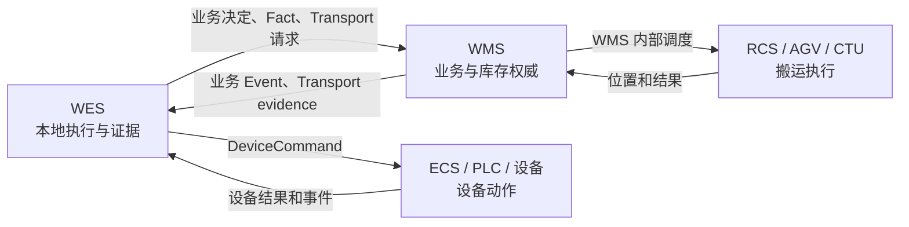

# WES - WMS 对接接口需求

## 文档版本

| 合同版本 | 日期 | 状态 | 主要变化 |
| --- | --- | --- | --- |
| `0.3.0` | 2026-08-31 | 待外发 | 货架任务增加 `rcs_template_id`；面向值改为普通不透明 string；`RACK_MOVE` 支持 `RACK/ZONE/RACK_POSITION`，最终结果统一返回精确 `RACK_POSITION` |
| `0.2.0` | 2026-08-20 | 待外发 | Transport 两族 DTO 保持不变；明确逐容器中间位置事件只在存在权威事实时可选发送；入线前由 TransportTask 负责，最终到位且实扫匹配后才创建 BinExecution |

`contract_version` 只用于双方确认拿到的是同一份外发合同，不进入任何 JSON 信封，也不产生旧版本兼容逻辑。正式外发时将
`published_at` 改为实际日期；在此之前，本版本不得用于宣称现场联调已经就绪。

本文按现场业务场景说明 WMS 和 WES 如何对接。主要读者是负责实现 WMS 对接接口的初级开发人员。旧资料使用过 MCS 这个名称，
重构后的正式名称是 WES。

每个场景都回答七个问题：

1. 现场发生了什么；
2. 谁先发起；
3. 哪个系统调用哪个接口；
4. 请求和响应包含哪些业务参数，这些参数从哪里来；
5. WMS 根据什么业务事实生成对外结果；
6. 是否需要 WMS 后续回调 WES，回调什么；
7. 什么证据出现后场景才算结束。

本文只定义两个系统共同遵守的交互语言和对外可验证结果，不规定 WMS 内部的代码结构、数据库表、事务技术、任务调度方式或
WMS/RCS 私有接口。本文是场景化对接入口；所有标为 `Approved` 的场景，其字段类型、条件必填、完整响应联合和错误码以该场景
链接的独立合同为准，本文只解释参数来源和处理流程。标为 `ReviewRequired` 的场景允许保留待联合评审项。禁止依据旧文档、
旧代码或示例自行增加兼容字段。

本文出现“可靠保存”“一致生效”等表述时，只要求成功响应已经具有可恢复、不可重复执行的对外效果。WMS 可以使用其现有技术能力
实现这些保证，WES 不要求 WMS 采用指定表结构、消息组件或后台任务框架。

## 0. 开发状态和阅读方法

### 0.1 当前实施边界

| 能力 | 合同生命周期 | WES 联调状态 | 当前动作 |
| --- | --- | --- | --- |
| 公共 HTTP/JSON Client | `Approved` | `ALIGNED` | WES 严格 JSON、HTTP 边界和响应联合已对齐；WMS 可按本文实现并准备联调 |
| WMS → WES 主动通知公共信封 | `Approved` | `ALIGNED` | WES 接收端和 OpenAPI 3.0.3 已对齐；仍需双方提供实际环境参数和联调证据 |
| WES 经 WMS 转发 AGV/CTU Transport | `Approved` | `ALIGNED` | WES、OpenAPI 和行为测试已对齐 0.3.0；backend `develop@fdfa4725` 与联调部署 revision `e7e3d6af` 具有相同 tree；WMS 实现和真实联调仍为 `NOT RUN` |
| 自动出库 | `ReviewRequired` | `NOT_READY` | 附录 A 的自动出库场景只用于联合评审，批准前禁止实现 |
| 粗分自动入库 | `Approved` | `FINAL_VALIDATION_PENDING` | `OLD_OUT/NEW_IN` 生产调用链和当前联调镜像已交付；历史 `f2129982` 镜像 E2E 已通过，但尚未对当前镜像重新执行完整粗分业务 E2E；真实联调与业务验收均为 `NOT RUN` |
| 满箱交换与自动上架 | `ReviewRequired` | `NOT_READY` | 附录 C 的自动上架场景只用于联合评审，批准前禁止实现 |
| 人工分拣 Bin 流转 | 仅业务设计 | `NOT_READY` | 尚未冻结 operation 和严格 DTO，不属于本文可实施接口；不得复用自动上架或自动出库字段表达 |

本文总状态仍为 `ReviewRequired`，因为仍包含未批准的业务附录，且正式外发日期、双方环境参数和现场联调证据尚未完成；其中
公共通信基础能力、搬运提交、容器中间位置事件、搬运最终结果和粗分入库场景的合同生命周期为 `Approved`，但容器中间位置事件
只在供应商能够提供权威逐容器中间事实时启用，当前 CTU/RCS 不实施；
Transport 0.3.0 的 WES 实现、OpenAPI 和行为测试已对齐并部署联调；粗分入库的 `OLD_OUT/NEW_IN` 当前生产调用链已交付，
但当前镜像仍缺完整粗分业务 Mock E2E。真实 WMS、供应商、现场联调和业务验收仍为 `NOT RUN`。基础通信或 Transport 验收不能证明
自动上架或自动出库已经通过，设备动作验收也不能替代 WMS 库存和业务验收。

### 0.2 当前 WMS 开发任务总览

当前开发放行只包含下表任务。表中分别列出 WMS 需要作为服务端提供的接口，以及 WMS 需要作为客户端访问的 WES 接口。
任务卡负责说明“要完成什么”，第 2～3 节负责说明“线上消息必须是什么”，两者共同构成验收依据。

| 任务名称 | 类型 | WMS 需要提供的接口 | WMS 需要访问的 WES 接口 | 当前任务 | 详细入口 |
| --- | --- | --- | --- | --- | --- |
| 公共通信基础能力 | 架构基础能力 | 为搬运提交服务端接口提供严格 JSON、公共响应和幂等冲突处理 | 为搬运最终结果及条件启用的容器中间位置事件调用提供不可变消息、响应分类和可靠重试 | 完成三个搬运环节共用的 HTTP/JSON 能力，不单独新增通用端点 | 第 2 节“公共通信基础能力开发任务卡” |
| 搬运提交 | Transport 业务能力 | `POST {{WMS_BASE_URL}}{{TRANSPORT_SUBMIT_PATH}}`<br>`operation=transport.task.submit@v1` | 无 | 接收并可靠接纳四种不可变搬运请求 | 第 3 节“搬运提交开发任务卡” |
| 容器中间位置事件 | 条件 Transport 能力 | 无 | `POST {{WES_BASE_URL}}/api/v1/wms/events`<br>`operation=transport.task.member_position_changed@v1` | 当前 CTU/RCS 不实施；未来供应商能提供权威逐容器中间事实时才启用 | 第 3 节“容器中间位置事件条件任务卡” |
| 搬运最终结果 | Transport 业务能力 | 无 | `POST {{WES_BASE_URL}}/api/v1/wms/events`<br>`operation=transport.task.resulted@v1` | 按连续 `outcome_revision` 回调完整搬运结果和各对象最终位置 | 第 3 节“搬运最终结果开发任务卡” |
| 联调交付 | 联调交付 | 无新增运行时接口 | 无新增运行时接口 | 提供 Approved 范围的 OpenAPI、固定 JSON、归一化表和联调证据 | 第 5 节 |

因此，当前 WMS 只需要**提供一个接口**：搬运提交的 `POST {{TRANSPORT_SUBMIT_PATH}}`；只需要**访问一个 WES 接口**：
搬运最终结果使用的 `POST /api/v1/wms/events`。容器中间位置事件与搬运最终结果共用该端点，但当前 CTU/RCS 不产生容器中间位置事件；未来启用时才通过不同 `operation`
区分中间位置事实和最终结果。WMS 如何调用 RCS 属于 WMS/RCS 内部接口，不在本文定义，也不需要向 WES 暴露。

公共通信基础能力和 Transport 业务任务必须分别验收：公共协议通过不能证明搬运业务正确，搬运提交、搬运最终结果以及条件启用的容器中间位置事件单个业务
样例通过，也不能证明所有公共幂等、冲突和重试规则正确。

当前 WMS **不要求开发** `/api/v1/wes/decisions`、`/api/v1/wes/facts`，也不要求为粗分入库新增专用 endpoint 或 operation。
粗分 `OLD_OUT/NEW_IN` 业务合同已批准并由 WES 生产调用链消费，但 WMS 侧只需实现上表共享的 Transport submit/result 接口。
自动出库、自动上架等未批准场景仍为 `ReviewRequired`，只能参加联合评审，不能创建临时 DTO、空实现或兼容入口。

### 0.3 WMS C# 技术基线

当前已知 WMS 运行时为 **.NET Framework 4.6**。在 WMS 团队提供实际编译器版本前，本文伪代码按 **C# 6** 基线表达：

- 不使用 `Guid.CreateVersion7()`、`record`、nullable reference type、现代模式匹配等新 .NET/C# 专属能力；
- `CreateUuidV7()` 是 WMS 需要提供的最小辅助能力，可以使用兼容 .NET Framework 4.6 的现有 UUID 库或自行封装，但输出必须符合
  RFC 9562 UUIDv7；本文不把某个第三方 UUID 库规定为跨系统依赖；
- JSON 示例以兼容 .NET Framework 4.6 的 Json.NET/Newtonsoft.Json 能力表达；WMS 可以使用等价 JSON 库，但必须达到第 2.2.1 节
  的严格校验结果；
- 如果 WMS 已经使用 Json.NET，应继续使用支持 `.NET Framework 4.6` 的受控版本，不为本文另外引入第二套 JSON 库；本文不锁定
  NuGet 包版本；
- 禁止直接依赖 Web API 默认 Model Binding 完成合同校验。WMS 必须先有界读取原始 Body、拒绝超限和重复 key，再进行严格 DTO
  反序列化；
- C# 示例中的辅助方法仍是行为名称，不要求 WMS 采用指定类名、项目结构、数据库或后台任务框架。

### 0.4 联调环境参数

| 参数 | 固定值或提供方 | WMS 开发要求 |
| --- | --- | --- |
| 协议 | `http` | 纯局域网通信，不实现 HTTPS、Token、HMAC 或 Nonce |
| `WMS_BASE_URL` | WMS 团队在联调前提供 | 包含协议、主机和端口，不以 `/` 结尾；不能硬编码在业务 DTO 中 |
| `TRANSPORT_SUBMIT_PATH` | WMS 团队在联调前提供 | 最长 2048 个字符；以 `/` 开头；不含 origin、query、fragment、反斜杠或 `.`/`..` 路径段；大小写必须与 WMS 路由一致 |
| `WES_BASE_URL` | WES 团队在联调前提供 | 包含协议、主机和端口，不以 `/` 结尾；由 WMS 运行配置读取 |
| JSON `Content-Type` | `application/json` | `charset` 可以省略，存在时只能是 `utf-8`；媒体类型、参数名和值按 HTTP 规则大小写不敏感；其它媒体类型或 charset 返回空响应体 `400` |
| `Content-Encoding` | `identity` | 禁止 gzip 等压缩编码；缺省等同 `identity`，其它值返回空响应体 `400` |
| 单次 HTTP 超时 | `10000` 毫秒 | 覆盖连接、完整请求发送和完整有界响应读取；WES → WMS 的搬运提交与 WMS → WES 的容器中间位置事件/搬运最终结果使用相同硬超时 |
| 请求/响应 Body 上限 | `262144` bytes | 按原始 UTF-8 bytes 计算，不按 C# 字符数计算 |
| 应用层认证 | `NONE` | 不预留空 Token 字段或认证兼容分支 |
| 时间 | UTC Unix 毫秒 | 双方主机应使用现场统一时间源；时间戳仅供审计，不因时钟偏差拒绝业务消息 |

具体主机、端口和搬运提交相对路径属于环境交付值，不写死在业务 DTO 中。联调开始前，双方必须交换实际 Base URL 与
`TRANSPORT_SUBMIT_PATH`，确认 WMS OpenAPI 中的实际路由，并完成双向连通性确认。WES 启动时校验并冻结搬运提交路径；修改后必须重启。

### 0.5 初级开发人员阅读顺序

1. 先阅读第 1～2 节，理解系统职责、公共端点、信封和数据来源术语。
2. WMS/RCS 团队实现搬运时阅读第 3 节的搬运提交、搬运最终结果；只有供应商能提供权威逐容器中间事实时才实施容器中间位置事件。
3. 按第 4～7 节确认实现边界、交付物、不提供的接口和文档治理规则。
4. WMS 出库团队按附录 A 的自动出库场景顺序参加联合评审；转为 `Approved` 后才实现。
5. WMS 入库团队按附录 B 的粗分入库场景及其链接的获批粗分合同实施与联调。
6. WMS 上架团队按附录 C 的自动上架场景顺序参加联合评审；转为 `Approved` 后才实现。

### 0.6 外发文档完整性

- WMS 团队只需要本文及其直接链接的独立合同即可实现标为 `Approved` 的交互，不依赖 WES 内部代码或测试。
- `Approved` 场景的完整字段、条件必填、响应联合和错误处理必须在其独立合同中完整定义；本文提供参数来源和场景顺序。
- `ReviewRequired` 场景可以保留业务流程和候选字段，但未冻结部分必须明确标记“待联合评审”，不能要求 WMS 根据内部引用补全。
- WES 项目内部合同只用于文档治理，不向 WMS 增加本文之外的义务；内部合同变更只有同步更新本文后才对 WMS 生效。
- 本文内部出现冲突时必须停止实现并先修正文档，不能在代码中建立双路径。

### 0.7 术语说明

本文保留接口字段名、operation 名称和代码对象名称。其他技术词尽量使用中文。下面这些词第一次遇到时，可以按右侧含义理解。

| 文档用词 | 含义 |
| --- | --- |
| `Approved` | 接口合同已经批准，可以按合同开发和联调 |
| `ReviewRequired` | 接口合同还在联合评审，不能作为正式开发依据 |
| `IMPLEMENTED` | 代码已经实现，不代表现场联调或业务验收已经完成 |
| operation | 接口动作编号。它决定本次请求使用哪套参数规则，例如 `transport.task.submit@v1` |
| 参数结构（DTO） | 某个 operation 允许接收和返回的 JSON 字段集合 |
| 消息信封 | 包括 `operation_id`、`operation`、`timestamp` 和 `data` 的完整 JSON 内容 |
| 接收确认（ACK） | 接收方确认消息已经保存。它不表示搬运、设备动作或业务已经完成 |
| 主动通知（Event） | WMS 主动发送给 WES 的消息，不是 WES 发起请求后的同步响应 |
| 事实报告（Fact） | WES 把已经发生且有证据的业务事实报告给 WMS，例如料盘已经放入目标 Cell |
| 原始证据（evidence） | ECS、RCS 或人工操作产生的原始结果。WES 必须先保存，再用于后续判断 |
| WES 现场位置记录（PositionProjection） | WES 在活动执行管辖期内根据可靠证据维护的确定位置或位置未知，只用于现场执行；执行关闭后的旧投影不是全局当前位置，不能替代 WMS 库存主账 |
| 参数规则（Schema） | 约束 JSON 字段、类型、必填条件和枚举的机器可读规则 |
| 固定 JSON 样例（fixture） | 双方共同确认的请求和响应样例，用于开发和联调 |
| `TransportTask` | WES 保存的一次可靠搬运任务 |
| `DeviceCommand` | WES 发给 ECS 的一条设备命令 |
| generation / revision | 连续递增的版本号，用来判断消息是否过期或乱序 |
| `outcome_revision` | WMS 在线上搬运最终结果中为同一搬运任务生成的 `1..Int64.MaxValue` 连续结果版本，用于排序多次完整结果 |
| `outcome_version` | WES 内部发布给业务使用方的搬运结果版本；与线上 `outcome_revision` 不是同一字段 |
| WMS 主账 | WMS 中已经提交的业务单据、库存和位置数据。发生冲突时以这些数据为准 |
| 幂等 | 同一条消息重复发送时，系统只执行业务动作一次，并按合同重放第一次结果或返回 `DUPLICATE` |
| 一致生效 | 成功响应所代表的业务结果、资源占用和消息身份已经共同生效，不会出现只完成其中一部分的对外状态 |
| 冻结 | 把字段和值保存下来，以后不再修改。文中出现“冻结”时都按这个含义理解 |
| 待发送记录（部分章节称“发送义务”） | 已经保存、但还没有取得明确回复的请求或主动通知。它不是新的 WMS 业务单据 |
| 不可变来源计划 | WMS 一次保存完整来源成员和业务资格，后续不允许追加、删除或覆盖；执行目标可以按已批准场景稍后确定 |
| 最终状态 | 普通重试不能再改变的确定结果。`UNKNOWN` 不是最终状态 |
| 对账 | 自动流程无法安全继续时，由人员核对实物、WMS 主账和原始证据 |

## 1. 系统职责和固定调用方向

### 1.1 谁对什么负责

| 系统 | 唯一责任 |
| --- | --- |
| WMS | PickingTask、GRN、`pkg_id`、库存、来源与目标分配、容量兼容、优先级、取消、恢复、全局位置和业务最终状态 |
| WES | WorkLine 启动条件、本地执行记录、扫码/设备/位置证据、搬运任务、设备命令、必须得到确认的外部请求和冲突隔离 |
| RCS/AGV/CTU | 车辆、路线、交通管理以及货架和 Bin 的物理搬运 |
| ECS/PLC/设备 | 扫码、测量、取放、输送、设备互锁和单设备物理最终状态 |

### 1.2 固定链路



硬边界：

- WES 不直连 RCS；WMS/RCS 内部接口不属于本文。
- WMS 不调用设备 callback 路径发送业务数据。
- 搬运任务、设备命令和对 WMS 的待确认请求是三个独立对象，不能共用一个状态机。
- WES 不通过查询 WMS 通用资源列表自行决定来源、目标或容量；WMS 必须在具名场景接口中返回封闭决定。

## 2. 所有场景共用的协议

### 公共通信基础能力 WMS 开发任务卡

- **开发目标：** 为当前 Approved 的搬运提交、搬运最终结果以及条件启用的容器中间位置事件提供统一、严格且可恢复的 HTTP/JSON 交互基础能力。
- **WMS 接口角色：** 搬运提交时作为 HTTP 服务端；搬运最终结果以及条件启用的容器中间位置事件时作为 HTTP 客户端。
- **必须完成：**
  1. 对请求和响应执行 `256 KiB` 上限、UTF-8、严格 JSON 和公共信封校验；
  2. 使用 `operation + operation_id` 识别消息，正确处理首次请求、重复消息和相同身份内容冲突；
  3. 对外返回本文定义的 HTTP 状态和 `code + data` 联合，不把技术成功与业务完成混为一谈；
  4. 主动通知首次形成时生成 UUIDv7，冻结完整消息，并在未取得明确接纳结果时可靠重试；
  5. 保证成功响应代表的首次结果、消息身份和相关对外效果已经一致生效。
- **禁止事项：**
  1. 不得提供任意 `action + data` 通用入口，不得忽略未知字段或增加扩展字段；
  2. 不得用全局 `operation_id` 代替 `operation + operation_id`，也不得在技术重试时更换身份或内容；
  3. 不得因搬运提交、搬运最终结果或条件启用的容器中间位置事件某个业务样例通过，就宣称全部公共协议能力已经通过；
  4. 不得为未批准 operation 建立空实现、默认成功或兼容分支。
- **完成证据：**
  1. 合法请求、重复请求、内容冲突、非法 JSON、超限和非法 DTO 均得到规定结果；
  2. 搬运提交只有请求明确未发出或收到 `503 / UNAVAILABLE` 时才使用原完整消息重试；请求可能已送达但响应未知时停止自动重提并进入
     对账；搬运最终结果及条件启用的容器中间位置事件主动通知在 `503 / UNAVAILABLE`、网络失败或响应未知后仍使用原完整消息继续履约；
  3. 进程重启后，已经形成但尚未明确接纳的主动通知仍可继续发送；
  4. 公共通信基础能力验收记录与搬运提交、搬运最终结果及条件启用的容器中间位置事件业务验收记录分开保存和判定。

### 2.1 端点全景和当前开发范围

| 方向 | 方法和路径 | 用途 | 当前 WMS 动作 |
| --- | --- | --- | --- |
| WMS → WES | `POST {{WES_BASE_URL}}/api/v1/wms/events` | WMS 主动通知业务数据、搬运位置和最终结果 | 实现容器中间位置事件、搬运最终结果调用；其它 operation 待评审 |
| WES → WMS | `POST {{WMS_BASE_URL}}/api/v1/wes/decisions` | WES 请求 WMS 给出同步业务决定，或可靠接纳耗时准备 | 暂不实现任何 operation |
| WES → WMS | `POST {{WMS_BASE_URL}}/api/v1/wes/facts` | WES 报告已经发生且有可靠证据支撑的业务事实 | 暂不实现任何 operation |
| WES → WMS | `POST {{WMS_BASE_URL}}{{TRANSPORT_SUBMIT_PATH}}` | WES 提交不可变 AGV/CTU 搬运请求 | 实现搬运提交接收 |

表中的四个路径是协议全景，不表示四个端点都已开发放行。首版只实现搬运提交接收以及容器中间位置事件/搬运最终结果主动通知；不得为空 operation 提前创建
通用端点或返回占位结果。

四个端点的原始请求正文和响应正文上限都是 `256 KiB`（`262144` bytes）。首版运行于隔离局域网，固定 HTTP、
`network_trust_mode=isolated_lan` 和应用层认证 `NONE`；不预建 Token、HMAC、Nonce 或公网安全框架。

### 2.2 请求和响应信封

公共请求信封样例（以搬运提交 `transport.task.submit@v1` 为例）：

```json
{
  "operation_id": "019fd985-0000-7b4d-a23a-1b90aa5d4472",
  "operation": "transport.task.submit@v1",
  "timestamp": 1786060800000,
  "data": {
    "transport_task_id": "TRANSPORT-000001",
    "kind": "RACK_MOVE",
    "rcs_template_id": "CTU01",
    "rack_id": "RACK-005-01",
    "source": {"kind": "ZONE", "location_code": "WAREHOUSE-A"},
    "target": {"kind": "RACK_POSITION", "location_code": "SORTING-LINE-01-RACK-A"},
    "target_face": "90"
  }
}
```

公共响应信封样例（以搬运提交首次接纳 `RECEIVED` 为例）：

```json
{
  "operation_id": "019fd985-0000-7b4d-a23a-1b90aa5d4472",
  "code": "RECEIVED",
  "timestamp": 1786060800123,
  "data": {"transport_task_id": "TRANSPORT-000001"}
}
```

| 字段 | 由谁生成 | 生成规则 |
| --- | --- | --- |
| `operation_id` | 当前消息发起方 | 为本次交互生成 UUIDv7；首次发送前保存，技术重试保持不变 |
| `operation` | 当前消息发起方 | 只能使用本文件场景表列出的固定值 |
| 请求 `timestamp` | 当前消息发起方 | 不可变请求首次形成时的 UTC Unix 毫秒；重试不刷新 |
| `data` | 当前消息发起方 | 来自场景表指定的数据源，按 operation 的参数结构组装 |
| 响应 `operation_id` | 接收方回显 | 必须与请求相同，不能生成新响应 ID |
| 响应 `timestamp` | 接收方 | 第一次形成完整响应时生成；重复请求返回第一次的值 |
| 响应 `code/data` | 接收方 | 根据场景业务事实和本次请求的确定结果生成 |

接收方始终使用 `operation + operation_id` 识别消息。发送方不得通过跨 operation 复用或比较 `operation_id` 表达业务关系；业务因果
必须使用 operation 专属字段。业务正文不使用 `request_id` 或 `event_id` 替代消息身份。

同一消息重试时按交互类型固定响应：

| 交互类型 | 首次成功 | 同一身份、同一完整消息重试 |
| --- | --- | --- |
| 同步业务决定 | `200 / DECIDED` | 重放第一次完整决定，不改为 `DUPLICATE` |
| 耗时准备接纳 | `202 / PREPARE_ACCEPTED` | 重放第一次完整接纳响应，不改为 `DUPLICATE` |
| WES 事实报告 | `200 / RECORDED` | `200 / DUPLICATE`，复用第一次响应的 `timestamp + data` |
| Transport 提交 | `202 / RECEIVED` | `200 / DUPLICATE`，复用第一次响应的 `timestamp + data` |
| WMS 主动通知和 Transport evidence | `202 / RECEIVED` | `200 / DUPLICATE`，复用第一次响应的 `timestamp + data` |

同一 `operation + operation_id` 对应不同完整消息时统一返回 `409 / CONFLICT`。比较完整消息时，JSON 空白和对象字段顺序不构成
内容变化；字段是否出现、字段值、数组顺序、`operation`、`operation_id`、`timestamp` 或 `data` 发生变化均视为不同消息。
字符串使用大小写敏感的序数比较，不做 Unicode 归一化；规范化消息必须保留 JSON number 的整数/浮点 token 区别，`1.0`、字符串
`"1"` 和整数 `1` 不相等；`SameCompleteMessage` 不得直接依赖会跨 number token 类型比较的宽松相等规则。首次消息在完成身份查询后
再按字段合同拒绝错误 number 类型。
接收方可以比较严格 DTO 或规范化 JSON，但不得比较原始 bytes 后把仅有空白或对象字段顺序变化的请求误判为冲突。发送方仍应保存并
重发首次形成的同一组 UTF-8 bytes，减少跨语言差异。摘要算法属于内部实现。

首版幂等记录不自动过期或清理。WMS 必须保留搬运提交的完整请求身份、内容摘要和首次终局响应；WES 必须保留容器中间位置事件/搬运最终结果的对应记录。开发或
测试数据只有在双方停止相关发送任务，并确认同时重置环境后才能清理。未来确需增加生产清理周期时，必须先修改本文，不能由单方
自行设置过期时间。

同一身份的并发首次请求必须串行收敛：只能有一次业务接纳和一份首次响应，其余相同消息返回对应重复结果，不得创建第二项搬运
义务。接收方使用锁、事务还是其它并发控制方式属于内部实现。

`503 / UNAVAILABLE` 是尚未接纳时的临时响应，不建立业务绑定，也不作为后续 `DUPLICATE` 的冻结响应。
`RECEIVED` 是首次接纳终局响应；`REJECTED` 是确定拒绝终局响应。取得合法消息身份的 `REJECTED` 必须保存请求摘要和首次拒绝
响应；同一身份、同一非法消息稳定重放首次拒绝，同一身份改换内容返回 `409 / CONFLICT`。无法安全建立消息身份的 `400/413`
不进入幂等记录。

#### 2.2.1 公共字段和严格 JSON 规则

| 项目 | 固定规则 |
| --- | --- |
| 编码与类型 | 无 BOM 的严格 UTF-8 `application/json`；非法字节不得替换后继续；顶层必须是 JSON object；错误 `Content-Type` 按预关联失败返回空响应体 `400` |
| 请求顶层字段 | 只能是 `operation_id + operation + timestamp + data`，四项全部必填 |
| 响应顶层字段 | 只能是 `operation_id + code + timestamp + data`，四项全部必填 |
| `operation_id` | RFC 9562 UUIDv7 小写 canonical 字符串，例如 `019fd985-0000-7b4d-a23a-1b90aa5d4472`；大写或其它文本形式非法 |
| `timestamp` | UTC Unix 毫秒整数，范围 `0..9223372036854775807`；只用于审计和诊断，不参与业务排序；不要求与 UUIDv7 内嵌毫秒完全相等 |
| `operation/code` | 大小写敏感，只接受本文明确列出的字面量 |
| `data` | operation 或 code 专属严格闭集 object；没有专属字段时使用 `{}`，不得省略或使用 `null` |
| 可选字段 | 无值时省略；除非字段表明确允许，否则禁止 `null`、空字符串、空 object 和空 array |
| 未知字段 | 顶层和 `data` 内都禁止；不得忽略、透传或保存为扩展字段 |
| 重复 JSON key | 任意层级都禁止；重复成员无法形成唯一规范化消息，统一返回空响应体 `400` 且不建立幂等记录，与成员顺序无关 |
| 字符串长度 | 按 Unicode code point 计数；必须是合法 UTF-8 |
| Body 上限 | 请求和响应原始正文均为 `256 KiB`；请求超限在 JSON 解码前返回空响应体 `413` |

##### 2.2.1.1 .NET Framework 4.6 严格 JSON 伪代码

严格接收分成两个阶段，不能把下面的完整 DTO 校验提前到身份查询之前：

1. 身份阶段只执行有界读取、拒绝 BOM 和非法 UTF-8、严格 JSON 语法、重复 key 和根 object 检查；任意重复 key 都按无法安全
   规范化的预关联失败返回空响应体 `400`。随后提取合法 `operation + operation_id` 并保留完整 `JObject`；未知字段、有限浮点 token
   和 operation 专属类型暂不拒绝；
2. 查询既有身份并比较完整消息后，只有首次出现的消息才执行闭集字段、精确 token 类型、字符串长度、DTO 转换和 operation 专属校验。

下面示例是第二阶段的完整 DTO 校验入口，必须验证所有嵌套 object，不能只检查顶层；第一阶段复用相同的严格 reader 和
`LoadObjectAndRejectDuplicateKeys`，但不得提前调用此方法中的字段与 DTO 校验：

```csharp
static T ValidateFirstMessageDto<T>(JObject root, ISet<string> requiredTopLevelFields, ISet<string> allowedTopLevelFields)
{
    // 字段名按序数、大小写敏感方式比较；未知字段、错误大小写和缺失必填字段都必须失败。
    ValidateExactClosedFields(root, requiredTopLevelFields, allowedTopLevelFields, StringComparer.Ordinal);

    // 必须在 DTO 转换前检查原始 JSON token 类型，避免把 1.0、"1" 或 true 自动转换成整数 1。
    // 同时递归检查所有 JSON 字符串，拒绝未配对的 UTF-16 surrogate，并按 Unicode code point 计算长度。
    ValidateExactTokenTypesAndStringLengths(root);

    JsonSerializerSettings settings = new JsonSerializerSettings
    {
        // Json.NET 默认忽略无法映射的字段，这里必须改为 Error。
        MissingMemberHandling = MissingMemberHandling.Error,
        CheckAdditionalContent = true,
        DateParseHandling = DateParseHandling.None,
        Culture = CultureInfo.InvariantCulture
    };

    // DTO 反序列化后仍要执行 operation 专属的类型、长度、枚举和条件必填校验。
    T value = root.ToObject<T>(JsonSerializer.Create(settings));
    ValidateOperationSpecificRules(value);
    return value;
}
```

Json.NET 的 `JsonTextReader` 会接受单引号字符串、无引号属性名、非 JSON 空白、十六进制/前导零整数和尾随逗号等扩展，而且递归读取时
看不到原始空白和逗号。下面的最小词法检查拒绝词法层扩展以及非法字符串转义，并正确忽略双引号 JSON 字符串内部的注释标记和逗号；
无引号属性名由后续 `PropertyName + QuoteChar` 检查拒绝，其它结构错误继续交给 reader：

```csharp
static void RejectJsonNetExtensions(string json)
{
    bool inString = false;
    bool escaped = false;

    for (int index = 0; index < json.Length; index++)
    {
        char current = json[index];
        if (inString)
        {
            if (escaped)
            {
                if (current != '"' && current != '\\' && current != '/' &&
                    current != 'b' && current != 'f' && current != 'n' &&
                    current != 'r' && current != 't' && current != 'u')
                {
                    throw new ContractValidationException("JSON 包含非法字符串转义");
                }
                if (current == 'u')
                {
                    if (index + 4 >= json.Length ||
                        !IsHexDigit(json[index + 1]) || !IsHexDigit(json[index + 2]) ||
                        !IsHexDigit(json[index + 3]) || !IsHexDigit(json[index + 4]))
                    {
                        throw new ContractValidationException("JSON 的 Unicode 转义必须包含四个十六进制数字");
                    }
                    index += 4;
                }
                escaped = false;
            }
            else if (current == '\\')
            {
                escaped = true;
            }
            else if (current == '"')
            {
                inString = false;
            }
            else if (current < 0x20)
            {
                throw new ContractValidationException("JSON 字符串禁止未转义控制字符");
            }
            continue;
        }

        if (current == '\'')
        {
            throw new ContractValidationException("JSON 字符串和属性名只能使用双引号");
        }

        if (current == '"')
        {
            inString = true;
            continue;
        }

        if (!IsJsonWhitespace(current) && (current < 0x20 || char.IsWhiteSpace(current)))
        {
            throw new ContractValidationException("JSON 包含原始控制字符或非标准空白字符");
        }

        if (current == '-' || current == '.' || (current >= '0' && current <= '9'))
        {
            int end = index + 1;
            while (end < json.Length && !IsJsonNumberDelimiter(json[end]))
            {
                end++;
            }

            string lexeme = json.Substring(index, end - index);
            // 完整 JSON number 文法；拒绝十六/八进制、前导零、.5、1. 和残缺指数等 Json.NET 扩展。
            if (!Regex.IsMatch(
                    lexeme,
                    @"^-?(0|[1-9][0-9]*)(\.[0-9]+)?([eE][+-]?[0-9]+)?$",
                    RegexOptions.CultureInvariant))
            {
                throw new ContractValidationException("JSON number 不符合标准文法");
            }

            if ((lexeme.IndexOf('.') >= 0 || lexeme.IndexOf('e') >= 0 || lexeme.IndexOf('E') >= 0) &&
                !TryParseDecimalExactly(lexeme))
            {
                // Decimal.TryParse 可能成功但发生舍入或下溢；这种 number 不能进入消息摘要。
                throw new PreAssociationContractException("JSON number 超出合同无损规范化域");
            }

            index = end - 1;
            continue;
        }

        // JSON 字符串外出现 // 或 /* 就是 Json.NET 宽松注释，合同必须拒绝。
        if (current == '/' && index + 1 < json.Length &&
            (json[index + 1] == '/' || json[index + 1] == '*'))
        {
            throw new ContractValidationException("JSON 禁止注释");
        }

        if (current != ',')
        {
            continue;
        }

        int next = index + 1;
        while (next < json.Length && IsJsonWhitespace(json[next]))
        {
            next++;
        }
        if (next < json.Length && (json[next] == '}' || json[next] == ']'))
        {
            throw new ContractValidationException("JSON 禁止尾随逗号");
        }
    }
}

static bool IsHexDigit(char value)
{
    return (value >= '0' && value <= '9') ||
           (value >= 'a' && value <= 'f') ||
           (value >= 'A' && value <= 'F');
}

static bool IsJsonWhitespace(char value)
{
    // JSON 只允许这四种空白字符，不能使用 char.IsWhiteSpace 扩大接受集合。
    return value == ' ' || value == '\t' || value == '\r' || value == '\n';
}

static bool IsJsonNumberDelimiter(char value)
{
    return IsJsonWhitespace(value) || value == ',' || value == ']' || value == '}';
}

static bool TryParseDecimalExactly(string lexeme)
{
    decimal parsed;
    if (!decimal.TryParse(lexeme, NumberStyles.Float, CultureInfo.InvariantCulture, out parsed))
    {
        return false;
    }

    // 两边都转为“符号 + 去除首尾零的十进制系数 + 十进制指数”后比较，不能比较格式化字符串。
    // 左侧只处理已经通过 JSON number 正则的 lexeme；右侧从 decimal.GetBits(parsed) 取得 96-bit 系数和 scale。
    // 这样 1.0、1e0 和 1.00 数学值相同，但 1e-29/2e-29 被 Decimal 下溢为 0M 时都会检测为不相等。
    return CanonicalizeJsonDecimal(lexeme) == CanonicalizeDecimalBits(parsed);
}
```

`DuplicateJsonKeyException` 必须归入 `PreAssociationContractException`：重复成员不存在可供幂等比较的唯一 object，不能根据已经读到的
局部 `operation/operation_id` 把它提升为已关联 `422`。

重复 key 必须在构造 `JObject` 前发现；下面是 `LoadObjectAndRejectDuplicateKeys` 的关键递归结构。它是伪代码，重点是解析顺序和
失败条件，不要求 WMS 使用相同方法名：

```csharp
static JToken ReadStrictToken(JsonTextReader reader)
{
    // 这里只拒绝非法 JSON 扩展；字段是否允许浮点数留到首次消息的 DTO 校验。
    if (reader.TokenType == JsonToken.Comment ||
        reader.TokenType == JsonToken.ConstructorStart ||
        reader.TokenType == JsonToken.Undefined)
    {
        throw new ContractValidationException("JSON 包含合同未允许的 token");
    }

    if (reader.TokenType == JsonToken.StartObject)
    {
        JObject result = new JObject();
        HashSet<string> names = new HashSet<string>(StringComparer.Ordinal);

        while (reader.Read())
        {
            if (reader.TokenType == JsonToken.EndObject)
            {
                return result;
            }

            if (reader.TokenType != JsonToken.PropertyName)
            {
                throw new ContractValidationException("object 中只能出现属性名");
            }

            // JsonTextReader 允许无引号属性名，并以 QuoteChar='\0' 暴露；合同只接受双引号属性名。
            if (reader.QuoteChar != '"')
            {
                throw new ContractValidationException("JSON 属性名必须使用双引号");
            }

            string name = (string)reader.Value;
            // 在读取属性值前检查，确保第二个同名属性不会覆盖第一个属性。
            if (!names.Add(name))
            {
                // 任意层级重复 key 都是预关联 400，不能因 operation/operation_id 的成员顺序改变响应分类。
                throw new DuplicateJsonKeyException(name);
            }

            if (!reader.Read())
            {
                throw new ContractValidationException("属性缺少值");
            }
            result.Add(name, ReadStrictToken(reader));
        }
        throw new ContractValidationException("JSON object 缺少闭合括号");
    }

    if (reader.TokenType == JsonToken.StartArray)
    {
        JArray result = new JArray();
        while (reader.Read())
        {
            if (reader.TokenType == JsonToken.EndArray)
            {
                return result;
            }
            result.Add(ReadStrictToken(reader));
        }
        throw new ContractValidationException("JSON array 缺少闭合括号");
    }

    if (reader.TokenType == JsonToken.Float)
    {
        // reader 必须使用 FloatParseHandling.Decimal；出现 double 表示 NaN/Infinity 等非合同 number。
        if (reader.Value is double)
        {
            throw new PreAssociationContractException("JSON number 超出合同规范化域");
        }

        // Decimal 无损参与完整消息比较；合同字段是否允许 Float 由首次消息的 DTO 校验决定。
        return new JValue(reader.Value);
    }

    // Null 是否允许、number 是否必须为整数或十进制字符串，由字段合同继续判断。
    if (reader.TokenType == JsonToken.String || reader.TokenType == JsonToken.Integer ||
        reader.TokenType == JsonToken.Boolean || reader.TokenType == JsonToken.Null)
    {
        return new JValue(reader.Value);
    }

    throw new ContractValidationException("JSON 结构不完整或 token 非法");
}
```

创建 `JsonTextReader` 时必须设置 `DateParseHandling=None` 和 `FloatParseHandling=Decimal`，并确认递归读取实际遇到匹配的
object/array 闭合 token，且一个根 object 后已经到达输入结尾。线上合同没有 Float 字段；身份阶段仅保留可由 .NET
`System.Decimal` 无损表示的有限 Float，以便先比较既有完整消息，再让首次 DTO 校验把 `1.0/1e0` 等类型错误归为 `422`。
`NaN/Infinity` 或超出 Decimal 表示域的 Float 无法形成双方稳定规范化值，统一按预关联空响应体 `400`，不建立幂等记录；不得转成
`double` 后比较。词法阶段必须用原始 number lexeme 执行无损检查：将 lexeme 与 `decimal.GetBits` 分别归一为十进制系数/指数后完全
相等才可接受；`Decimal.TryParse` 成功但发生舍入或下溢同样是预关联 `400`。Decimal 溢出产生的 `JsonReaderException` 也必须映射到
这个预关联 `400`。前置词法检查、reader、重复 key 检查、
属性名引号检查和 token 白名单共同拒绝截断 JSON、第二个根值、无引号属性名、
构造器和 `undefined`。联调负例至少包含 BOM/非法 UTF-8、单引号属性/字符串、无引号属性名、非法转义、字符串外原始 NUL、
非标准空白、非标准 number、`NaN/Infinity`、超出 Decimal 域或发生舍入/下溢的 Float（至少 `1e-29`、`2e-29` 和超长有效数字）、
注释、尾随逗号、缺少 object/array 闭合 token，以及在整数或十进制字符串字段中使用 `1.0/1e0`。
`ValidateExactClosedFields` 必须分别检查“全部 required 均存在”和“实际字段全部属于 allowed”；
随后根据 `operation/kind` 对每层 object 传入各自的 required/allowed 集合，不能依赖 Json.NET 大小写不敏感的 DTO 绑定来判断字段。

`.NET Framework 4.6` 的 `string.Length` 统计 UTF-16 code unit，不等于本文规定的 Unicode code point 数。字符串长度校验可以使用
下面的最小辅助方法：

```csharp
static int CountUnicodeCodePoints(string value)
{
    if (value == null)
    {
        throw new ContractValidationException("字符串不能为 null");
    }

    int count = 0;
    for (int index = 0; index < value.Length; index++)
    {
        char current = value[index];
        if (char.IsHighSurrogate(current))
        {
            // 高代理项必须紧跟低代理项；一对代理项表示一个 Unicode code point。
            if (index + 1 >= value.Length || !char.IsLowSurrogate(value[index + 1]))
            {
                throw new ContractValidationException("字符串包含未配对的 UTF-16 高代理项");
            }
            index++;
        }
        else if (char.IsLowSurrogate(current))
        {
            // 单独出现的低代理项同样不是合法 Unicode 字符串。
            throw new ContractValidationException("字符串包含未配对的 UTF-16 低代理项");
        }

        count++;
    }
    return count;
}
```

Json.NET 只是适配 `.NET Framework 4.6` 的示例选择，不属于线上合同。无论使用哪个库，验收只判断本节列出的严格输入和响应结果。

HTTP 控制器边界必须按以下顺序映射错误，不能把所有异常交给默认 Model Binding：

```csharp
async Task<HttpResult> ReceiveTransportRequestAsync(HttpRequest request, CancellationToken cancellationToken)
{
    // application/json 可不带 charset；存在 charset 时只能为 UTF-8。只接受缺省或 identity Content-Encoding。
    if (!HasAllowedJsonMediaType(request) || !HasIdentityContentEncoding(request))
    {
        return HttpResult.Empty(400);
    }

    byte[] rawBody = await ReadAtMostAsync(request, 262144, cancellationToken);
    if (rawBody == null)
    {
        return HttpResult.Empty(413);
    }

    try
    {
        // UTF-8、JSON 根结构或小写 canonical UUIDv7 operation_id 无法成立时，没有可安全关联的消息身份。
        return await ReceiveStrictTransportEnvelopeAsync(rawBody, cancellationToken);
    }
    catch (PreAssociationContractException)
    {
        // 包括任意层级重复 key；它无法形成唯一规范化消息，因此不建立幂等记录。
        return HttpResult.Empty(400);
    }
    catch (AssociatedContractException ex)
    {
        // 已取得合法 operation_id 后，必须按 operation + operation_id 和完整原消息持久化或重放确定拒绝：
        // 同身份同消息重放首次 REJECTED；同身份不同消息返回 CONFLICT。不能只临时构造一个未登记的响应。
        return await PersistOrReplayAssociatedRejectionAsync(rawBody, ex, cancellationToken);
    }
}
```

`ReadAtMostAsync` 必须在读到第 `262145` 个 byte 时立即返回超限，不能先把任意大 Body 全部读入内存。IIS 或反向代理的请求上限
不得小于合同上限，否则代理层 HTML 错误页会破坏空响应体 `413` 合同。

#### 2.2.2 公共 HTTP 和 `code`

| HTTP / `code` | 何时使用 | `data` 公共规则 | 发送方动作 |
| --- | --- | --- | --- |
| `200 / DECIDED` | 同步业务决定已经形成 | operation 专属结果联合 | 按 `data.result` 继续；只用于 `Approved` 后的业务场景 |
| `200 / RECORDED` | Fact 和对应业务结果已经一致生效 | operation 专属字段或 `{}` | 结束本次 Fact 义务 |
| `200 / DUPLICATE` | 相同身份和相同完整消息已经接纳 | operation 专属字段；复用第一次 `timestamp + data` | 视为本次义务已经完成 |
| `202 / RECEIVED` | Event、Transport 请求或 evidence 已可靠接纳 | operation 专属字段 | 只表示接纳，不表示物理或业务完成 |
| `202 / PREPARE_ACCEPTED` | 耗时业务准备义务已可靠接纳 | operation 专属字段或 `{}` | 等待后续 Event，不把 ACK 当作计划 |
| `400`，空响应体 | 错误 `Content-Type`、非法 UTF-8/JSON、number 超出合同规范化域，或无法提取合法 UUIDv7 `operation_id` | 无响应信封 | 停止原消息；修正后创建新身份 |
| `413`，空响应体 | 原始请求正文超过 `256 KiB` | 无响应信封 | 停止原消息；缩小合法业务请求后创建新身份 |
| `422 / REJECTED` | 已有合法 `operation_id`，但信封、operation 或 DTO 非法 | 必须携带稳定 `reason_code` | 停止原消息；修正后创建新身份 |
| `409 / CONFLICT` | 同一身份对应不同内容，或违反不可变业务约束 | operation 专属冲突信息 | 禁止换 ID 掩盖，进入对账 |
| `503 / UNAVAILABLE` | 接收方当前无法可靠接纳，且尚未接纳 | operation 专属字段或 `{}` | 使用原完整消息重试 |

`400/413` 以外的响应都必须使用公共响应信封并原样回显已解析的 `operation_id`。本合同不使用 HTTP `Retry-After`。
网络超时或无法确认响应内容时，不能假定对方没有收到消息。

#### 2.2.3 接收方幂等处理伪代码

下面使用 C# 风格伪代码说明跨系统可观察行为。辅助方法是行为名称，不限定 WMS 使用何种 ASP.NET Web API 控制器、数据库或
消息组件：

```csharp
async Task<HttpResult> ReceiveAsync(
    HttpRequest request,
    InteractionType interactionType,
    CancellationToken cancellationToken)
{
    // 必须在 JSON 反序列化前执行 256 KiB 限制，避免接收或处理部分超限消息。
    if (await IsBodyLargerThanAsync(request, 262144, cancellationToken))
    {
        return HttpResult.Empty(statusCode: 413);
    }

    // 先完成严格 JSON 语法和重复 key 检查；任意重复 key 都返回预关联 400。
    // 随后提取 operation + canonical UUIDv7 operation_id；
    // 暂时保留完整顶层和 data token，不在查询既有身份前拒绝未知字段或 operation 专属类型。
    // 非法 UTF-8/JSON，或无法取得合法消息身份时返回空响应体 400。
    Envelope envelope = await ParseStrictJsonAndExtractIdentityAsync(request, cancellationToken);

    // 严格语法解析先保留完整 data token；消息身份必须同时包含 operation 和 operation_id，不能只按 operation_id 去重。
    // 已存在身份的内容冲突必须优先于新消息的 operation/data 校验，否则换成非法 DTO 会被错误返回 REJECTED 而不是 CONFLICT。
    MessageIdentity identity = new MessageIdentity(envelope.Operation, envelope.OperationId);
    StoredExchange previous = await FindPreviousExchangeAsync(identity, cancellationToken);

    if (previous != null && SameCompleteMessage(previous.Request, envelope))
    {
        if (interactionType == InteractionType.Decision || interactionType == InteractionType.Prepare)
        {
            // 同步决定和耗时准备必须重放第一次完整响应，code、timestamp 和 data 都不能改变。
            return HttpResult.FromStoredResponse(previous.FirstResponse);
        }

        if (previous.FirstResponse.Code == "RECEIVED" || previous.FirstResponse.Code == "RECORDED")
        {
            // 只有首次成功接纳的 Event、Fact 和 Transport 才转换为 DUPLICATE，并复用首次 timestamp + data。
            return HttpResult.Duplicate(
                operationId: envelope.OperationId,
                timestamp: previous.FirstResponse.Timestamp,
                data: previous.FirstResponse.Data);
        }

        // 首次 REJECTED 或业务/资源 CONFLICT 是确定终局；同身份同消息必须原样重放，不能伪装成已接纳的 DUPLICATE。
        return HttpResult.FromStoredResponse(previous.FirstResponse);
    }

    if (previous != null)
    {
        // 相同身份却出现不同完整消息时必须冲突，禁止把新内容覆盖到旧消息上。
        return HttpResult.Conflict(operationId: envelope.OperationId);
    }

    // 只有首次出现的消息才执行其余信封字段和 operation 专属 data 闭集校验；校验失败由上层按已关联 REJECTED 原子登记并稳定重放。
    ValidateEnvelopeAndOperationData(envelope);

    // 首次业务结果、资源变化和完整响应必须一致生效后才能返回成功。
    // 该方法名只表达对外保证，不规定 WMS 内部使用何种事务或持久化方案。
    StoredResponse firstResponse =
        await ApplyBusinessResultAndKeepFirstResponseConsistentlyAsync(envelope, cancellationToken);

    return HttpResult.FromStoredResponse(firstResponse);
}
```

### 2.3 本文使用的 "参数来源"

| 来源名称 | 含义 | 典型字段 |
| --- | --- | --- |
| WMS 主账 | WMS 已提交的业务单据、库存、资源锁和全局位置 | `task_id`、`pkg_id`、来源、目标、优先级、generation |
| WES 执行对象 | WES 为一次现场执行持久化的稳定身份 | `execution_id`、`material_execution_id`、`bin_execution_id` |
| WES 配置 | 部署时确定的 WorkLine 和固定位置关系 | `workline_code`、固定工作位、缓存位 |
| ECS 原始证据 | ECS/PLC 已确定并由 WES 原样持久化的扫码、测量或动作结果 | `scan_evidence_id`、六合一码、测量值、`command_code` |
| 搬运结果 | 已确定搬运任务的成员位置和结果版本 | WMS接口契约使用 `transport_task_id + outcome_revision`；WES 业务结果另有内部 `outcome_version` |
| WES 现场位置记录 | WES 根据可靠设备和搬运证据形成的作业期现场位置 | `current_location`、`from_position`、`to_position` |
| WMS 前序响应 | WMS 已经返回并由 WES 保存的业务编号或版本号 | `target_assignment_id`、`route_decision_id`、`putaway_plan_id` |
| 人工对账 | 操作员核对实物、WMS 主账和原始证据后形成的批准结果 | `reconciliation_id`、权威位置、`CONTINUE/ABORT` |

### 2.4 WMS 主动通知必须满足什么外部结果

WMS 主动通知必须满足以下可联调验证的结果，具体如何实现由 WMS 自行决定：

1. 只有对应业务事实或决定已经确定后，才能形成主动通知。
2. 首次发送前生成新的 UUIDv7 `operation_id`，冻结 `operation + timestamp + data`；进程重启或网络失败不能丢失已形成的发送义务。
3. 调用 `/api/v1/wms/events` 时使用已经冻结的完整消息，技术重试不得重新读取当前主账并改写旧消息。
4. 当前容器中间位置事件/搬运最终结果收到 `RECEIVED/DUPLICATE` 后结束本次发送义务；收到 `UNAVAILABLE` 或没有取得明确响应时，使用原完整消息重试。
5. 收到 `400/413/422` 后停止重试原消息；修正内容后必须创建新的消息身份。收到 `CONFLICT` 后停止自动发送并进入合同对账。
6. 新出现的业务事实必须创建新消息身份，不能覆盖已经形成或已经发送的历史消息。
7. 每次 WMS → WES HTTP 访问使用 `10000` 毫秒硬超时，并限制响应原始 Body 不超过 `262144` bytes。
8. 超时、网络失败、响应 Body 超限、非法 JSON、响应信封不合法或未知 HTTP/code 组合都表示“没有取得明确合同响应”；WMS 必须
   保留原发送义务、记录协议告警，并在 `2000` 毫秒后使用原完整消息重试。
9. 技术重试没有最大次数，直到取得 `RECEIVED/DUPLICATE`、确定拒绝或冲突；不能因尝试次数耗尽而静默丢弃消息。
10. 应用正常停止时，不把取消异常记为发送失败或发送完成；重启后继续领取同一条冻结消息。

WMS 主动通知的最小 C# 风格伪代码：

```csharp
async Task<FrozenEvent> CreateEventAsync(
    string operation,
    object businessData,
    CancellationToken cancellationToken)
{
    // UUIDv7 只在这条业务通知首次形成时生成一次；后续任何重试都不得重新生成。
    string operationId = CreateUuidV7();

    // timestamp 表示不可变消息首次形成的时间，不是每次 HTTP 发送时间。
    long timestamp = DateTimeOffset.UtcNow.ToUnixTimeMilliseconds();

    // 先把 data 转成独立 JSON object，再构造完整信封。不能把 data 保存为 JSON 字符串后再次序列化，
    // 否则线上会变成 "data":"{...}"，不再是合同要求的 object。
    JToken frozenData = JToken.FromObject(businessData).DeepClone();
    JObject envelope = new JObject();
    envelope["operation_id"] = operationId;
    envelope["operation"] = operation;
    envelope["timestamp"] = timestamp;
    envelope["data"] = frozenData;

    // 首次形成时直接冻结完整、无 BOM 的 UTF-8 Body；所有 HTTP 重试原样发送这组 bytes。
    byte[] frozenRequestBody = EncodeUtf8WithoutBom(envelope.ToString(Formatting.None));
    string transportTaskId = ReadTransportTaskIdIfPresent(frozenData);
    FrozenEvent message = new FrozenEvent(operationId, operation, transportTaskId, frozenRequestBody);

    // 必须先可靠保存完整消息和待发送义务，再允许发起 HTTP 请求。
    // 此处只规定外部结果，不要求 WMS 必须使用某种表或消息队列。
    await ReliablyFreezeDeliveryObligationAsync(message, cancellationToken);
    return message;
}

async Task DeliverEventAsync(
    FrozenEvent message,
    CancellationToken cancellationToken)
{
    try
    {
        while (true)
        {
            AckResponse response;
            try
            {
                // 直接发送已经冻结的完整 Body；禁止重新序列化对象或查询主账拼装“最新消息”。
                response = await PostFrozenBodyAsync(
                    "/api/v1/wms/events",
                    message.FrozenRequestBody,
                    10000,
                    262144,
                    cancellationToken);
            }
            catch (Exception ex) when (IsNetworkFailureOrUnknownDelivery(ex))
            {
                // 网络异常或响应未知时，不能假定 WES 没有收到。
                await RecordDeliveryWarningAsync(message, ex, cancellationToken);
                await Task.Delay(TimeSpan.FromMilliseconds(2000), cancellationToken);
                continue;
            }

            // 400/413 只有“状态正确且 Body 为空”才是合同定义的预关联失败，不要求响应 operation_id。
            // 代理生成的 HTML 400/413 或其它非空 Body 不是明确合同响应，继续走未知响应分支。
            if (response.IsEmpty(400) || response.IsEmpty(413))
            {
                await StopAndReportContractErrorAsync(message, response, cancellationToken);
                return;
            }

            // 其余响应 operation_id 必须与请求一致；RECEIVED/DUPLICATE/CONFLICT 还必须回显冻结的 transport_task_id。
            // 关联不匹配不是成功或冲突，而是未知响应：保留义务、告警并重试原 Body。
            if (!ResponseMatchesFrozenMessage(response, message))
            {
                await RecordUnexpectedResponseWarningAsync(message, response, cancellationToken);
                await Task.Delay(TimeSpan.FromMilliseconds(2000), cancellationToken);
                continue;
            }

            if (response.Is(202, "RECEIVED") || response.Is(200, "DUPLICATE"))
            {
                await MarkDeliveryFinishedAsync(message.OperationId, cancellationToken);
                return;
            }

            if (response.Is(503, "UNAVAILABLE"))
            {
                await Task.Delay(TimeSpan.FromMilliseconds(2000), cancellationToken);
                continue;
            }

            if (response.Is(422, "REJECTED"))
            {
                await StopAndReportContractErrorAsync(message, response, cancellationToken);
                return;
            }

            if (response.Is(409, "CONFLICT"))
            {
                await StopAndStartReconciliationAsync(message, response, cancellationToken);
                return;
            }

            await RecordUnexpectedResponseWarningAsync(message, response, cancellationToken);
            await Task.Delay(TimeSpan.FromMilliseconds(2000), cancellationToken);
        }
    }
    catch (OperationCanceledException) when (cancellationToken.IsCancellationRequested)
    {
        // 外层捕获覆盖 HTTP、告警保存和所有重试延时；正常停机不改变待发送状态。
        return;
    }
}
```

伪代码中的 `ReliablyFreezeDeliveryObligationAsync`、`MarkDeliveryFinishedAsync` 和重试调度只是行为名称，WMS 可以用现有机制实现。
`.NET Framework 4.6` 基础类库没有 `Guid.CreateVersion7()`；`CreateUuidV7` 表示 WMS 封装的 RFC 9562 UUIDv7 生成能力，不要求
双方使用相同库。关键验收点是：重试的
`operation_id + operation + timestamp + data` 完全不变，且明确接纳前形成的发送义务不会丢失。

`PostFrozenBodyAsync` 必须先检查 `262144` bytes 响应上限；只有合同定义的空 Body `400/413` 可以跳过 JSON，其他响应都按
第 2.2.1 节严格解析响应信封。错误 `Content-Type`、超限、非法 JSON、未知字段、错误类型或未定义的 HTTP/code 组合都不能转换
成成功 ACK。

`.NET Framework 4.6` 生成 UUIDv7 的最小 C# 风格伪代码：

```csharp
static string CreateUuidV7()
{
    long unixMilliseconds = DateTimeOffset.UtcNow.ToUnixTimeMilliseconds();
    if (unixMilliseconds < 0 || unixMilliseconds > 0xFFFFFFFFFFFFL)
    {
        throw new InvalidOperationException("UTC 时间超出 UUIDv7 的 48 bit 毫秒范围");
    }

    byte[] bytes = new byte[16];

    // UUIDv7 前 48 bit 是 Unix 毫秒，按网络字节序（高位在前）写入。
    bytes[0] = (byte)(unixMilliseconds >> 40);
    bytes[1] = (byte)(unixMilliseconds >> 32);
    bytes[2] = (byte)(unixMilliseconds >> 24);
    bytes[3] = (byte)(unixMilliseconds >> 16);
    bytes[4] = (byte)(unixMilliseconds >> 8);
    bytes[5] = (byte)unixMilliseconds;

    // 剩余 80 bit 先使用密码学随机数填充，再覆盖版本位和 RFC 4122/9562 variant 位。
    using (RandomNumberGenerator random = RandomNumberGenerator.Create())
    {
        byte[] randomBytes = new byte[10];
        random.GetBytes(randomBytes);
        Buffer.BlockCopy(randomBytes, 0, bytes, 6, randomBytes.Length);
    }

    bytes[6] = (byte)((bytes[6] & 0x0F) | 0x70); // version = 7
    bytes[8] = (byte)((bytes[8] & 0x3F) | 0x80); // variant = 10xx

    // 按 UUID 规范字节顺序直接格式化 8-4-4-4-12；不要使用 new Guid(bytes)，其部分字段采用小端顺序。
    string hex = BitConverter.ToString(bytes).Replace("-", "").ToLowerInvariant();
    return hex.Substring(0, 8) + "-"
        + hex.Substring(8, 4) + "-"
        + hex.Substring(12, 4) + "-"
        + hex.Substring(16, 4) + "-"
        + hex.Substring(20, 12);
}
```

双方验收 UUIDv7 时只以小写 canonical 格式、版本 nibble 为 `7`、variant 为 `8/9/a/b` 作为拒绝条件。前 48 bit 还原的首次生成
时间只用于时钟诊断和告警，不因偏差拒绝消息；也不要求它与请求 `timestamp` 在并发生成时逐毫秒完全相等。

### 2.5 场景接口达到什么程度才能开发

一个场景只有同时具备以下内容，才允许交给初级开发人员正式实现：

| 必备内容 | 转为 `Approved` 的最低要求 | `ReviewRequired` 时的处理 |
| --- | --- | --- |
| 现场触发和结束条件 | 明确触发事实、完成证据和不可破坏的业务规则 | 标出尚未确认的触发或完成条件 |
| 调用方向、端点和 operation | 固定 HTTP 方法、路径、operation、状态码和 `code` | 不允许临时增加接口或 operation |
| 参数及其唯一来源 | 逐项确定字段路径、类型、长度、枚举和条件必填 | 用“待联合评审”标记，不由开发人员猜测 |
| WMS 判断和对外生效结果 | 固定输入、业务唯一约束、响应组合和冲突码 | 只描述业务用途，不编造响应字段 |
| WMS 主动通知 | 固定参数结构、生成依据、接收确认和重试语义 | 未冻结的通知参数暂不实现 |
| 开发样例 | 提供正确、错误及重复/冲突消息的完整 JSON | 可留空，批准时统一补齐 |

如果某个场景仍使用“本地门禁摘要”“失败证据”“当前可用集合”等概括词，但没有确定具体 JSON 字段，该场景仍是
`ReviewRequired`，不能由开发人员自行设计字段。

## 3. 搬运场景（Approved，可实施）

本节是当前可以直接交付 WMS 开发和联调的完整 Transport 合同，不需要再查阅 WES 内部文档。

本文直接使用业务语义名称描述三个搬运环节；接口的机器身份始终以完整 `operation` 字面量为准：

| 业务环节 | operation | 含义 |
| --- | --- | --- |
| 搬运提交 | `transport.task.submit@v1` | WES 向 WMS 提交不可变搬运任务 |
| 容器中间位置事件 | `transport.task.member_position_changed@v1` | WMS 向 WES 发送可选的逐容器中间位置事件 |
| 搬运最终结果 | `transport.task.resulted@v1` | WMS 向 WES 发送覆盖全部成员的搬运最终结果 |

### 3.1 Transport 公共数据类型

#### 3.1.1 标识和枚举

| 字段 | 类型与范围 | 规则 |
| --- | --- | --- |
| `transport_task_id` | 非空 UTF-8 string，`1..80` 字符 | WES 生成；贯穿搬运提交、容器中间位置事件和搬运最终结果；一个已接纳 ID 只能绑定一个搬运提交 `operation_id` |
| `rack_id` | 非空 UTF-8 string，`1..100` 字符 | 货架身份，精确比较，不根据前缀推断类型 |
| `container_id` | 非空 UTF-8 string，`1..100` 字符 | WES-WMS 接口契约中的物理料箱/容器身份；对应厂商 `containerId`，不是厂商表示仓位的 `binId` |
| `slot_id/location_code` | 非空 UTF-8 string，`1..100` 字符 | 由位置权威方提供；不得用空字符串或 `null` |
| `kind` | enum | `RACK_MOVE \| RACK_ROTATE \| BIN_MOVE \| BIN_EXCHANGE` |
| `rcs_template_id` | enum | `CTU01 \| CTU02 \| CTU03 \| F01`；货架任务始终发送规范化后的明确值 |
| `rack_face/target_face/arrival_face` | string 或 `null` | 是否允许 `null` 由具体上下文决定；提供时必须是非空且不含 NUL 的 UTF-8 string，内容不解释且原样传递；`rack_face` 是储位身份的一部分，不能从 `slot_id` 推断 |
| `milestone` | enum | `SOURCE_PICKED \| TARGET_PLACED \| POSITION_UNKNOWN` |
| `results[].status` | enum | `SUCCEEDED \| FAILED` |
| `failure_code` | 非空 UTF-8 string，`1..120` 字符 | WMS 将 RCS 原始失败归一化后的稳定码，不发送自由文本或供应商原始业务载荷 |

三个面字段没有业务词法或长度规则：按具体上下文可为 `null`，一旦提供，JSON value 必须是非空且不含 NUL 的 UTF-8 string；
空白、除 NUL 外的控制字符、U+FEFF 和任意长度内容均按普通 string 处理。该最小边界保证值可进入 PostgreSQL `TEXT`；
公共 HTTP Body 仍须符合第 2 章 UTF-8/JSON 信封规则。各方对 JSON 解析后的 string
原样传递并精确比较，不得 trim、case folding、Unicode normalization、A/B 转换、角度计算或容差。不同 JSON 转义解析为相同字符
序列时属于同一 string；组合字符与预组字符未经 normalization 时仍不相等。

#### 3.1.2 位置严格联合

位置 object 必须且只能匹配下表中的一种结构：

| `kind` | 完整字段 | 允许用途 |
| --- | --- | --- |
| `RACK` | `kind + location_code` | `RACK_MOVE` 的 `source/target`、`RACK_ROTATE` 的 `source/target`；值必须等于外层 `rack_id`，由 RCS 解析位置 |
| `ZONE` | `kind + location_code` | `RACK_MOVE` 的 `source/target`；值表示区域编号，不指定精确地码 |
| `RACK_POSITION` | `kind + location_code` | `RACK_MOVE` 的精确 `source/target`、`RACK_ROTATE` 的精确 `source/target` 和货架最终精确位置 |
| `RACK_BIN_SLOT` | `kind + rack_id + rack_face + slot_id` | Bin 所在货架储位、Bin 搬运最终结果最终位置；四个字段共同定位唯一物理储位 |
| `HANDOFF_POSITION` | `kind + location_code` | WorkLine 入料口、出料口或其它已批准交接位、Bin 搬运最终结果最终位置 |

`RACK` 出现在货架任务的 `source` 或 `target` 时，`location_code` 必须等于同一 `RackTransportData.rack_id`；不一致的请求无效。

**位置样例 1：按货架编号解析（`RACK`）**

```json
{
  "kind": "RACK",
  "location_code": "RACK-005-01"
}
```

**位置样例 2：按区域选址（`ZONE`）**

```json
{
  "kind": "ZONE",
  "location_code": "WAREHOUSE-A"
}
```

**位置样例 3：货架精确地码（`RACK_POSITION`）**

表示货架整体所在的仓储位置或工作位。

```json
{
  "kind": "RACK_POSITION",
  "location_code": "RACK-WORK-POSITION-A"
}
```

**位置样例 4：货架内 Bin 储位（`RACK_BIN_SLOT`）**

表示某个 Bin 位于指定货架的指定槽位。

```json
{
  "kind": "RACK_BIN_SLOT",
  "rack_id": "RACK-005-01",
  "rack_face": "90",
  "slot_id": "SLOT-03"
}
```

**位置样例 5：工作线交接位置（`HANDOFF_POSITION`）**

表示 Bin 与 WorkLine 或 CTU 进行交接的固定位置。

```json
{
  "kind": "HANDOFF_POSITION",
  "location_code": "SORTING-LINE-01-BIN-IN"
}
```

未知位置类型、混入其它类型字段、缺少必填字段或使用供应商私有位置结构，统一属于非法 DTO。

#### 3.1.3 WMS 最小 `data` 结构分族

搬运提交只需要两个 `data` Schema 族：

| 协议 Schema 族 | `kind` | 固定字段 |
| --- | --- | --- |
| `RackTransportData` | `RACK_MOVE \| RACK_ROTATE` | `transport_task_id + kind + rcs_template_id + rack_id + source + target + target_face` |
| `BinTransportData` | `BIN_MOVE \| BIN_EXCHANGE` | `transport_task_id + kind + moves[]`；成员固定为 `container_id + source + target` |

搬运最终结果同样只需要两个 `data` Schema 族：

| 协议 Schema 族 | `kind` | 固定字段 |
| --- | --- | --- |
| `RackTransportResultData` | `RACK_MOVE \| RACK_ROTATE` | `transport_task_id + kind + outcome_revision + rack_id + status`，以及结果条件字段 |
| `BinTransportResultData` | `BIN_MOVE \| BIN_EXCHANGE` | `transport_task_id + kind + outcome_revision + results[]`；成员使用 `container_id`，以及结果条件字段 |

上述 Schema 名只用于标识线上结构，不规定 WMS 的 C# 类名。货架结果直接展开唯一 `rack_id`，不套只有一项的 `results[]`；料箱结果
使用 `results[].container_id`。WMS 不需要四套搬运提交 DTO，不需要自定义多态 `JsonConverter`，也不需要 DTO 注册表。推荐先严格解析
公共信封并读取 `data.kind`，再进行一次显式分流：

```text
RACK_MOVE | RACK_ROTATE → RackTransportData Schema
BIN_MOVE  | BIN_EXCHANGE → BinTransportData Schema
```

WMS 可以用一个自行命名的普通 C# 位置类型承载 `kind/location_code/rack_id/rack_face/slot_id` 实现属性，但必须按 `kind` 校验严格
联合，并在 JSON 中省略不适用字段。WMS 面向 WES 的协议边界统一使用 `SnakeCaseNamingStrategy`；WMS 面向 RCS 的 camelCase
厂商 DTO 必须独立定义，不能与 WES DTO 共用同一 C# 类。

#### 3.1.4 Transport 稳定码闭集

搬运提交 `422 / REJECTED` 的 `reason_code` 只能使用：

| `reason_code` | 含义 |
| --- | --- |
| `INVALID_ENVELOPE` | 已取得合法 `operation_id`，但公共信封其余字段不合法 |
| `UNSUPPORTED_OPERATION` | operation 不属于当前 Approved 闭集 |
| `INVALID_DATA` | 搬运提交 `data` 的字段、类型、长度、枚举、成员数量或条件必填不合法 |
| `COORDINATED_BIN_EXCHANGE_UNSUPPORTED` | WMS/RCS 当前不具备将 `BIN_EXCHANGE` 作为一个协调任务整体执行的能力 |

已知容器中间位置事件/搬运最终结果 operation 的信封或 DTO 非法时，`422 / REJECTED` 固定使用 `INVALID_EVIDENCE`；未知 operation 使用
`UNSUPPORTED_OPERATION`。搬运最终结果成员失败时，`failure_code` 只能使用：

| `failure_code` | 使用条件 |
| --- | --- |
| `RCS_TASK_REJECTED` | WMS 已接纳搬运义务，但 RCS 后续明确拒绝实际任务 |
| `RCS_EXECUTION_FAILED` | RCS 已接纳任务，但执行动作失败；位置是否明确由位置字段单独表达 |
| `POSITION_UNKNOWN` | 已确认对象当前位置无法确定，必须同时使用 `position_unknown=true` |
| `MANUAL_ABORTED` | 操作员基于现场安全或人工处置明确终止搬运 |

WMS 必须把供应商私有码转换为上述固定值，不得透传新码。WES 不根据 `failure_code` 自动重试或创建替代搬运；是否允许后续动作只由
`status + final_position/position_unknown` 和业务场景共同决定。需要新增稳定码时必须先联合修改本文。

当 `position_unknown=true` 时，`failure_code` 固定为 `POSITION_UNKNOWN`，位置不确定优先于记录 RCS 的原始失败原因；其它三个
`failure_code` 只在能够同时给出合法 `final_position` 时使用。这样 WMS 开发人员不需要在“失败原因”和“位置是否可依赖”之间
猜测优先级。

RCS 请求或结果超时本身不能证明搬运失败，也不能证明对象位置。WMS 不得把 timeout 直接转换为搬运最终结果 `FAILED`；必须等待 RCS 的
确定证据或完成人工对账。若最终只能确认位置未知，按 `POSITION_UNKNOWN` 报告。WES 自身的等待超时与 WMS 的搬运最终结果是两个独立事实，
不能互相替代。

### 搬运提交：WES 请求 WMS 搬运货架或 Bin

触发条件：业务场景已经确定具体对象、来源和目标。WES 已经保存搬运任务，但尚未调用 RCS。

#### 搬运提交开发任务卡

- **开发目标：** 接收 WES 提交的不可变搬运请求，并把可靠接纳的请求转化为可追溯的 WMS/RCS 搬运义务。
- **WMS 接口角色：** HTTP 服务端，接收 `POST {{TRANSPORT_SUBMIT_PATH}}`。
- **必须完成：**
  1. 在 JSON 解码前检查 `256 KiB` Body 上限，再严格校验公共信封和搬运提交 `data`；
  2. 使用一次 rack/bin 分流严格解析两族 DTO；`BIN_EXCHANGE` 在现场协调能力未确认前可以按稳定码确定拒绝，禁止接受未定义字段；
  3. 使用 `operation + operation_id` 处理首次请求、重复请求和内容冲突；
  4. 保证一个已接纳的 `transport_task_id` 只关联一个不可变提交和一项实际搬运义务；
  5. 在可靠接纳和首次响应已经一致保存后，按搬运提交响应联合返回结果。
- **禁止事项：**
  1. 不得修改 WES 给出的对象、来源、目标或目标面；
  2. 不得把 `BIN_EXCHANGE` 拆成两个独立搬运任务；
  3. 不得在尚未可靠接纳时返回 `RECEIVED`，也不得用统一 `200`、空响应或自由文本代替合同响应。
- **完成证据：**
  1. 四种 `kind` 各有完整请求/响应；`BIN_EXCHANGE` 在现场能力未确认前验证严格解析和确定拒绝，确认支持后再补首次接纳记录；
  2. 首次 `RECEIVED` 后，同一完整消息重试返回 `DUPLICATE`；首次 `REJECTED/CONFLICT` 原样稳定重放；同一身份不同消息返回
     `CONFLICT`；
  3. 非法 JSON、超限、非法 DTO、冲突和不可用分别得到规定响应；
  4. 能用 `transport_task_id` 追溯到 WMS/RCS 实际搬运义务。

WES 调用 WMS：

```text
POST {{TRANSPORT_SUBMIT_PATH}}
operation = transport.task.submit@v1
```

`data` 首先固定包含 `transport_task_id + kind`，再根据 `kind` 严格选择货架或料箱结构：

| DTO 族 | `kind` | 其余必填字段 | 关键规则 |
| --- | --- | --- | --- |
| 货架 | `RACK_MOVE` | `rcs_template_id + rack_id + source + target + target_face` | 位置属于 `RACK \| ZONE \| RACK_POSITION` 且不同；`target_face` 是不透明 string token |
| 货架 | `RACK_ROTATE` | `rcs_template_id + rack_id + source + target + target_face` | 两个位置均为相同的 `RACK` 或相同的精确 `RACK_POSITION`；`RACK.location_code` 等于外层 `rack_id`；`target_face` 是不透明 string token 且不同于可信当前面 |
| 料箱 | `BIN_MOVE` | `moves[] {container_id + source + target}` | `moves` 为 `1..4`；`container_id` 唯一；每项来源与目标不同且至少一端是 `RACK_BIN_SLOT` |
| 料箱 | `BIN_EXCHANGE` | `moves[] {container_id + source + target}` | `moves` 只能为 `2` 或 `4`；`container_id` 唯一；所有位置是 `RACK_BIN_SLOT`；形成 1～2 个二元闭环 |

`target_face` 是业务调用方冻结的普通非空 string，WMS 原样传给 RCS；成功回调 `arrival_face` 必须与其精确相等。WMS 可以把 `RACK_MOVE`
分解为多个 RCS 子任务，但必须保存 WES `transport_task_id` 与全部厂商 `taskCode` 的关联。`RACK_POSITION` 目标要求最终地码相等；
`RACK` 目标要求最终位置是按冻结货架编号和模板解析出的结果；`ZONE` 目标要求最终位置属于冻结区域。回调统一返回精确
`RACK_POSITION`。

`rcs_template_id` 使用 RCS 真实模板：库位到工作位为 `CTU01`，工作位原地旋转为 `CTU02`，工作位返回库位为 `CTU03`。调用方未
指定时，WES 在冻结请求前规范化为 `F01`；Wire 始终携带明确值。WES 不根据位置编码反推模板，也不建立模板配置映射。

`BIN_MOVE` 中，精确 `RACK_BIN_SLOT(rack_id+rack_face+slot_id)` 在全部成员的 `source/target` 中不得重复出现；多个成员可以使用
同一个 `HANDOFF_POSITION`。`BIN_EXCHANGE` 的来源精确储位分别唯一、目标精确储位分别唯一，且来源储位集合必须等于目标储位集合。

同一 Bin 请求中，同一个 `rack_id` 只能出现一个 `rack_face`；不同货架可以使用不同的不透明面 token。`BIN_EXCHANGE` 只允许涉及一个
或两个 `rack_id+rack_face` 组：一个组时在该货架当前面的不同精确储位之间交换；两个组时每个成员都必须跨组移动。展开后的每个
`source=S,target=T` 必须且只能存在一个 `source=T,target=S` 的反向成员；四个成员只能形成两个互不重叠的二元闭环。需要操作
任一货架另一面时，先完成独立 `RACK_ROTATE`，再创建新的 Bin 任务。

WES 创建任务前检查可信的精确当前位置和当前工作面；WMS 返回 `RECEIVED` 前以自身主数据和可信 RCS 状态再次检查。对于
`RACK_ROTATE`，即使请求使用 `RACK` 宽引用，也必须先解析并确认精确当前位置；无法取得可信精确位置或当前面时返回
`503 / UNAVAILABLE`，`target_face` 等于可信当前面时返回 `409 / CONFLICT`。对于 Bin 请求，请求中的
`rack_face` 与已知当前面不一致时返回 `409 / CONFLICT`，无法取得必须的可信当前面时返回 `503 / UNAVAILABLE`。上述情况均不得
调用 RCS。除批准的 `rcs_template_id` 外，请求禁止携带货架类型、空/满箱、容量、车辆、路线、RCS 内部动作顺序、WES 工作线
调用方身份或供应商私有字段。

下表给出完整场景覆盖。`RACK` 和 `ZONE` 都是宽泛位置选择器；WMS/RCS 成功执行后仍须回调实际到达的精确
`RACK_POSITION/location_code`。

| 场景 | `kind` | `rcs_template_id` | `source.kind` | `target.kind` | 成功结果 |
| --- | --- | --- | --- | --- | --- |
| 区域内货架到工作位 | `RACK_MOVE` | `CTU01` | `ZONE` | `RACK_POSITION` | 精确工作位 |
| 指定货架到工作位 | `RACK_MOVE` | `CTU01` | `RACK` | `RACK_POSITION` | 精确工作位 |
| 精确库位货架到工作位 | `RACK_MOVE` | `CTU01` | `RACK_POSITION` | `RACK_POSITION` | 精确工作位 |
| 指定货架在当前工作位原地换面 | `RACK_ROTATE` | `CTU02` | `RACK` | `RACK` | 当前精确工作位及目标面 |
| 工作位原地换面 | `RACK_ROTATE` | `CTU02` | `RACK_POSITION` | `RACK_POSITION` | 原工作位及目标面 |
| 指定货架返回指定区域 | `RACK_MOVE` | `CTU03` | `RACK` | `ZONE` | 区域内的精确库位 |
| 工作位按货架编号返回库位 | `RACK_MOVE` | `CTU03` | `RACK_POSITION` | `RACK` | RCS 选定的精确库位 |
| 工作位返回指定区域 | `RACK_MOVE` | `CTU03` | `RACK_POSITION` | `ZONE` | 区域内的精确库位 |
| 工作位返回精确库位 | `RACK_MOVE` | `CTU03` | `RACK_POSITION` | `RACK_POSITION` | 请求指定的精确库位 |
| 其它精确位置搬运 | `RACK_MOVE` | `F01` | `RACK_POSITION` | `RACK_POSITION` | 请求指定的精确位置 |
| 批量搬运料箱 | `BIN_MOVE` | 不适用 | `RACK_BIN_SLOT` | `HANDOFF_POSITION` | 各成员请求指定的位置 |
| 协调交换料箱 | `BIN_EXCHANGE` | 不适用 | `RACK_BIN_SLOT` | `RACK_BIN_SLOT` | 各成员请求指定的位置 |

以下十个代表性请求与本节后文的成功结果样例逐一对应；其中失败结果另用独立任务展示。`RACK` 宽引用的自动联调完整请求另见
[Transport 自动联调联合验收](transport-joint-acceptance.md)。样例 3、9、10 使用现场分配的专用联调测试数据：
货架 `510056`、料箱 `A000001922/A000002653`、储位 `510056A3F2C101/510056A2F2C101`、精确工作位 `KT16`、仓储区域
`WH01` 和滚筒线投料口 `CNV0301`。由于当前 RCS→WMS→WES 回调链路尚未接通，后文对应结果是合同预期数据，不是现场抓取结果。

**样例 1：整架搬运（`RACK_MOVE`）**

将货架 `RACK-005-01` 从仓储位置搬运到分拣线货架工作位。

```json
{
  "operation_id": "019fd985-0000-7b4d-a23a-1b90aa5d4472",
  "operation": "transport.task.submit@v1",
  "timestamp": 1786060800000,
  "data": {
    "transport_task_id": "TRANSPORT-000001",
    "kind": "RACK_MOVE",
    "rcs_template_id": "CTU01",
    "rack_id": "RACK-005-01",
    "source": {"kind": "ZONE", "location_code": "WAREHOUSE-A"},
    "target": {"kind": "RACK_POSITION", "location_code": "SORTING-LINE-01-RACK-A"},
    "target_face": "90"
  }
}
```

**样例 2：货架原地换面（`RACK_ROTATE`）**

货架保持在当前工作位，将到达面调整为示例 string token `"270"`。

```json
{
  "operation_id": "019fd985-03e8-7b4d-a23a-1b90aa5d4472",
  "operation": "transport.task.submit@v1",
  "timestamp": 1786060801000,
  "data": {
    "transport_task_id": "TRANSPORT-000002",
    "kind": "RACK_ROTATE",
    "rcs_template_id": "CTU02",
    "rack_id": "RACK-005-01",
    "source": {"kind": "RACK", "location_code": "RACK-005-01"},
    "target": {"kind": "RACK", "location_code": "RACK-005-01"},
    "target_face": "270"
  }
}
```

**样例 3：批量搬运 Bin（`BIN_MOVE`）**

一次搬运两个专用联调料箱，从测试货架 `510056` 的不同储位送到滚筒线投料口 `CNV0301`。`rack_face="90"` 是当前 WMS/RCS
联调约定并由操作员/WMS 显式提供的不透明 string token，WES 不从储位编码中的字母推导该值，也不把它换算为 A/B。

```json
{
  "operation_id": "019fd985-07d0-7b4d-a23a-1b90aa5d4472",
  "operation": "transport.task.submit@v1",
  "timestamp": 1786060802000,
  "data": {
    "transport_task_id": "TRANSPORT-000003",
    "kind": "BIN_MOVE",
    "moves": [
      {
        "container_id": "A000001922",
        "source": {"kind": "RACK_BIN_SLOT", "rack_id": "510056", "rack_face": "90", "slot_id": "510056A3F2C101"},
        "target": {"kind": "HANDOFF_POSITION", "location_code": "CNV0301"}
      },
      {
        "container_id": "A000002653",
        "source": {"kind": "RACK_BIN_SLOT", "rack_id": "510056", "rack_face": "90", "slot_id": "510056A2F2C101"},
        "target": {"kind": "HANDOFF_POSITION", "location_code": "CNV0301"}
      }
    ]
  }
}
```

**样例 4：两个货架当前面协调交换两对、四个容器（`BIN_EXCHANGE`）**

该联调循环的后续阶段继续复用同一组测试资产：料箱经 `SCAN9 → SCAN10 → SCAN11 → SCAN12` 到达 `CNV0302` 后，再创建
`BIN_MOVE` 把两个料箱送回 `510056` 的原空储位，最后执行样例 10 的 `CTU03` 回库。SCAN 链属于 ECS 调试事件，不增加新的
Transport DTO；在回调链路接通前，人工确认只能形成明确标注的联调审计事实，不能冒充 WMS/RCS 权威回调。

在一个不可拆分的协调任务中，让两个货架当前面的四个确定容器形成两个二元闭环。`moves` 已按 `container_id` 升序排列，数组
顺序不代表 CTU 动作顺序。空储位不能代替 `container_id` 参与交换。

```json
{
  "operation_id": "019fd985-0bb8-7b4d-a23a-1b90aa5d4472",
  "operation": "transport.task.submit@v1",
  "timestamp": 1786060803000,
  "data": {
    "transport_task_id": "TRANSPORT-000004",
    "kind": "BIN_EXCHANGE",
    "moves": [
      {
        "container_id": "CONTAINER-0001",
        "source": {"kind": "RACK_BIN_SLOT", "rack_id": "RACK-SOURCE-01", "rack_face": "90", "slot_id": "SLOT-01"},
        "target": {"kind": "RACK_BIN_SLOT", "rack_id": "RACK-TARGET-01", "rack_face": "270", "slot_id": "SLOT-05"}
      },
      {
        "container_id": "CONTAINER-0002",
        "source": {"kind": "RACK_BIN_SLOT", "rack_id": "RACK-TARGET-01", "rack_face": "270", "slot_id": "SLOT-05"},
        "target": {"kind": "RACK_BIN_SLOT", "rack_id": "RACK-SOURCE-01", "rack_face": "90", "slot_id": "SLOT-01"}
      },
      {
        "container_id": "CONTAINER-0003",
        "source": {"kind": "RACK_BIN_SLOT", "rack_id": "RACK-SOURCE-01", "rack_face": "90", "slot_id": "SLOT-02"},
        "target": {"kind": "RACK_BIN_SLOT", "rack_id": "RACK-TARGET-01", "rack_face": "270", "slot_id": "SLOT-06"}
      },
      {
        "container_id": "CONTAINER-0004",
        "source": {"kind": "RACK_BIN_SLOT", "rack_id": "RACK-TARGET-01", "rack_face": "270", "slot_id": "SLOT-06"},
        "target": {"kind": "RACK_BIN_SLOT", "rack_id": "RACK-SOURCE-01", "rack_face": "90", "slot_id": "SLOT-02"}
      }
    ]
  }
}
```

**样例 5：指定货架搬运到工作位（`RACK_MOVE + CTU01`）**

直接指定货架 `RACK-005-08`，由 WMS/RCS 确认其当前精确位置后搬运到工作位。`RACK.location_code` 必须与外层
`rack_id` 相同。

```json
{
  "operation_id": "019fd985-0fa0-7b4d-a23a-1b90aa5d4472",
  "operation": "transport.task.submit@v1",
  "timestamp": 1786060804000,
  "data": {
    "transport_task_id": "TRANSPORT-000008",
    "kind": "RACK_MOVE",
    "rcs_template_id": "CTU01",
    "rack_id": "RACK-005-08",
    "source": {"kind": "RACK", "location_code": "RACK-005-08"},
    "target": {"kind": "RACK_POSITION", "location_code": "SORTING-LINE-01-RACK-B"},
    "target_face": "90"
  }
}
```

**样例 6：工作位按货架编号返回库位（`RACK_MOVE + CTU03`）**

目标只指定货架编号，不指定库位；WMS/RCS 根据冻结的 `rack_id + rcs_template_id` 选择实际库位。

```json
{
  "operation_id": "019fd985-1388-7b4d-a23a-1b90aa5d4472",
  "operation": "transport.task.submit@v1",
  "timestamp": 1786060805000,
  "data": {
    "transport_task_id": "TRANSPORT-000009",
    "kind": "RACK_MOVE",
    "rcs_template_id": "CTU03",
    "rack_id": "RACK-005-09",
    "source": {"kind": "RACK_POSITION", "location_code": "SORTING-LINE-01-RACK-C"},
    "target": {"kind": "RACK", "location_code": "RACK-005-09"},
    "target_face": "270"
  }
}
```

**样例 7：工作位返回指定区域（`RACK_MOVE + CTU03`）**

目标只指定区域 `WAREHOUSE-B`；WMS/RCS 选择该区域内的实际库位，并在最终结果中返回精确地码。

```json
{
  "operation_id": "019fd985-1770-7b4d-a23a-1b90aa5d4472",
  "operation": "transport.task.submit@v1",
  "timestamp": 1786060806000,
  "data": {
    "transport_task_id": "TRANSPORT-000010",
    "kind": "RACK_MOVE",
    "rcs_template_id": "CTU03",
    "rack_id": "RACK-005-10",
    "source": {"kind": "RACK_POSITION", "location_code": "SORTING-LINE-01-RACK-D"},
    "target": {"kind": "ZONE", "location_code": "WAREHOUSE-B"},
    "target_face": "90"
  }
}
```

**样例 8：其它精确位置搬运（`RACK_MOVE + F01`）**

该场景不属于前三种约定模板，调用方未指定模板时，WES 在冻结请求前将其规范化为 `F01`；因此 Wire 请求仍显式携带
`rcs_template_id=F01`。

```json
{
  "operation_id": "019fd985-1b58-7b4d-a23a-1b90aa5d4472",
  "operation": "transport.task.submit@v1",
  "timestamp": 1786060807000,
  "data": {
    "transport_task_id": "TRANSPORT-000011",
    "kind": "RACK_MOVE",
    "rcs_template_id": "F01",
    "rack_id": "RACK-005-11",
    "source": {"kind": "RACK_POSITION", "location_code": "BUFFER-01-RACK-A"},
    "target": {"kind": "RACK_POSITION", "location_code": "MAINTENANCE-01-RACK-A"},
    "target_face": "90"
  }
}
```

**样例 9：仓储区域内货架搬运到工作位（`RACK_MOVE + CTU01`）**

专用联调货架 `510056` 初始位于仓储区域 `WH01`，WMS/RCS 在该区域内定位货架并通过 `CTU01` 搬运到精确工作位 `KT16`。

```json
{
  "operation_id": "019fd985-1f40-7b4d-a23a-1b90aa5d4472",
  "operation": "transport.task.submit@v1",
  "timestamp": 1786060808000,
  "data": {
    "transport_task_id": "TRANSPORT-000012",
    "kind": "RACK_MOVE",
    "rcs_template_id": "CTU01",
    "rack_id": "510056",
    "source": {"kind": "ZONE", "location_code": "WH01"},
    "target": {"kind": "RACK_POSITION", "location_code": "KT16"},
    "target_face": "90"
  }
}
```

**样例 10：工作位返回仓储区域（`RACK_MOVE + CTU03`）**

专用联调货架 `510056` 从精确工作位 `KT16` 通过 `CTU03` 返回仓储区域 `WH01`；成功回调必须返回 WMS/RCS 实际选择的
精确 `RACK_POSITION/location_code`，不能把区域编码 `WH01` 直接当作精确点位。

```json
{
  "operation_id": "019fd985-2328-7b4d-a23a-1b90aa5d4472",
  "operation": "transport.task.submit@v1",
  "timestamp": 1786060809000,
  "data": {
    "transport_task_id": "TRANSPORT-000013",
    "kind": "RACK_MOVE",
    "rcs_template_id": "CTU03",
    "rack_id": "510056",
    "source": {"kind": "RACK_POSITION", "location_code": "KT16"},
    "target": {"kind": "ZONE", "location_code": "WH01"},
    "target_face": "90"
  }
}
```

样例 9～10 的 `TRANSPORT_DEBUG` consumer 已完成 repository alignment：前端和后端均使用固定 string payload
`target_face="90"`，不解释或转换其面语义；`WH01` 固定为 `ZONE`，`KT16` 固定为 `RACK_POSITION`，模板分别为 `CTU01` 和
`CTU03`。当前只完成仓内生成合同、前后端测试和本地 Mock 验证，状态仍为
`NOT PHYSICAL RUN / NOT BUSINESS AUTHORITATIVE`。

WMS 的对外处理结果必须满足：

1. 检查公共字段、重复消息，以及第 3.1 节规定的成员数量、容器唯一性、精确储位唯一性、端点组、工作面和位置结构。
2. 确认 `BIN_EXCHANGE` 的成员形成一至两个二元闭环、每个货架只使用当前面，并能由 RCS 作为一个协调任务整体接纳，不能拆成两个搬运。
3. 可靠接纳完整请求和首次响应，并保证 `transport_task_id` 可以追溯到实际搬运义务。
4. 首次可靠接纳后返回 `202 / RECEIVED`；同一消息重复请求返回 `200 / DUPLICATE` 并复用第一次响应的 `timestamp + data`。
5. `RECEIVED` 只表示 WMS 接纳搬运义务，不表示车辆出发或对象到位。

搬运提交的“可靠接纳”边界固定如下：WMS 已严格校验请求、确认自身具备该 `kind` 的执行能力，并可靠保存不可变请求、幂等身份、首次
响应和后续调用 RCS 的搬运义务后，即可返回 `RECEIVED`；不要求在同步响应前取得 RCS 任务号，也不等待车辆开始或完成。返回
`RECEIVED` 后，WMS 必须最终调用 RCS，并通过搬运最终结果 `transport.task.resulted@v1` 报告最终结果；只有上游实际形成权威中间位置事实时
才另外发送容器中间位置事件 `transport.task.member_position_changed@v1`。RCS 后续拒绝或执行失败不能撤销搬运提交 ACK，必须使用搬运最终结果 `FAILED` 和稳定
`failure_code` 闭合。

`BIN_EXCHANGE` 只有在 WMS/RCS 集成已经具备“一个请求对应一个协调任务”的确定能力时才能接纳。该判断是能力门禁，不要求在
搬运提交 HTTP 响应期间同步创建 RCS 任务。

搬运提交同步响应完整联合：

| HTTP / `code` | `data` 完整结构 | 说明 |
| --- | --- | --- |
| `202 / RECEIVED` | `transport_task_id` | 首次可靠接纳 |
| `200 / DUPLICATE` | `transport_task_id` | 相同身份和相同消息已经接纳；复用第一次 `timestamp + data` |
| `409 / CONFLICT` | `transport_task_id` | 身份内容冲突、同一任务更换提交身份或活动资源冲突 |
| `422 / REJECTED` | `reason_code + transport_task_id?` | 请求确定非法；只有能从请求中取得合法 `transport_task_id` 时才回显；`reason_code` 来自第 3.1.4 节闭集 |
| `503 / UNAVAILABLE` | `transport_task_id` | 无法可靠持久化，或无法取得必须的可信当前面；固定等待 2000 毫秒后使用原消息重试 |
| `400`，空响应体 | 无 | 错误 `Content-Type`、非法 UTF-8/JSON，或无法取得合法 `operation_id` |
| `413`，空响应体 | 无 | 原始请求正文超限 |

搬运提交失败分类不得混用：

| 情况 | 固定响应 | 是否允许原消息重试 |
| --- | --- | --- |
| 字段、枚举、长度、成员数量或固定能力不合法 | `422 / REJECTED` | 否；修正后创建新的 TransportTask 和消息身份 |
| WMS 当前无法可靠保存，或无法取得必须的可信当前面，且尚未接纳任何义务 | `503 / UNAVAILABLE` | 是；2000 毫秒后重试原完整消息 |
| 同一身份对应不同内容、同一 `transport_task_id` 更换提交身份，或对象已绑定另一个已接纳且未闭合的搬运任务 | `409 / CONFLICT` | 否；进入人工对账 |

活动资源冲突的最小公共范围固定为：任一未闭合 TransportTask 绑定的 `rack_id` 不能再属于另一个未闭合的货架或 Bin 任务；同一
`container_id` 不能同时属于两个未闭合的 Bin 任务。完整 `RACK_BIN_SLOT(rack_id+rack_face+slot_id)` 用于请求内位置唯一性、成员目标
校验和结果匹配，不另建活动资源绑定；Bin 任务必须绑定其所有来源和目标 `RACK_BIN_SLOT` 中出现的全部不同 `rack_id`，防止搬架与
在该架取放 Bin 并发。`HANDOFF_POSITION` 允许多个成员共享，其瞬时容量由 WMS/RCS 调度。所有搬运提交 ACK 中的 `transport_task_id` 都
回显本次请求中已解析的合法值，包括 `409`；不得替换成冲突方任务 ID。稳定身份、当前面不匹配或占用冲突使用 `409`。

`RECEIVED/DUPLICATE` 表示 `transport_task_id` 已经绑定本次提交；`UNAVAILABLE` 表示尚未接纳，WES 使用原消息重试；
`400/413/REJECTED` 表示确定未接纳，WES 不再使用该 `transport_task_id`。搬运提交 `reason_code` 必须来自第 3.1.4 节闭集；WES 对所有
`REJECTED` 都执行相同的终止处理，不根据诊断码增加自动业务分支。

WES 对每次搬运提交 HTTP 访问使用 `10` 秒硬超时，单个任务最多实际发送 `3` 次。只有请求明确未发出或收到 `503` 才使用原完整
消息重试，两者固定等待 `2000` 毫秒。如果请求可能已经
送达但没有取得确定响应，WES 不自动重提、不查询任务状态，直接把该任务置为待对账，防止同一物理搬运被执行两次。

搬运提交不提供 `429 / BUSY`，也不定义 `retry_after_ms`。RCS 或 WMS 内部调度容量不足时，WMS 应先可靠保存搬运义务并返回
`RECEIVED`，随后内部排队，不得把调度繁忙转换为未接纳响应。

`BIN_EXCHANGE` 如果不能作为一个协调任务整体接纳，必须返回
`422 / REJECTED`，并使用 `reason_code=COORDINATED_BIN_EXCHANGE_UNSUPPORTED`；不得拆成两个独立搬运。

`RACK_MOVE` 首次接纳响应样例：

```json
{
  "operation_id": "019fd985-0000-7b4d-a23a-1b90aa5d4472",
  "code": "RECEIVED",
  "timestamp": 1786060800123,
  "data": {"transport_task_id": "TRANSPORT-000001"}
}
```

`BIN_EXCHANGE` 不支持协调交换时的确定拒绝样例：

```json
{
  "operation_id": "019fd985-0bb8-7b4d-a23a-1b90aa5d4472",
  "code": "REJECTED",
  "timestamp": 1786060803123,
  "data": {
    "transport_task_id": "TRANSPORT-000004",
    "reason_code": "COORDINATED_BIN_EXCHANGE_UNSUPPORTED"
  }
}
```

### 容器中间位置事件（可选）：WMS 回调容器位置事实

只有 `BIN_MOVE/BIN_EXCHANGE` 在上游实际形成权威中间位置事实时才可以发送此 operation；它不是搬运必经步骤，货架不发送。
当前 CTU/RCS 只返回完整最终结果，因此目标 Bin 供给、退回和满箱交换均不发送容器中间位置事件。

#### 容器中间位置事件条件任务卡

- **启用条件：** 供应商能够在搬运最终结果形成前提供单个容器离开来源、到达目标或位置未知的权威事实。当前 CTU/RCS 不满足，
  因此本期不开发、不发送，也不伪造容器中间位置事件。
- **启用后的开发目标：** 把已经确认的单个容器中间位置事实可靠通知 WES。
- **WMS 接口角色：** HTTP 客户端，调用 `POST /api/v1/wms/events`。
- **启用后必须完成：**
  1. 从搬运提交保存的任务关联取得 `transport_task_id + container_id`，不得重新生成或替换业务身份；
  2. 只根据确定的 RCS 物理证据生成 `SOURCE_PICKED`、`TARGET_PLACED` 或 `POSITION_UNKNOWN`；
  3. 为每条新事实生成 UUIDv7 `operation_id`，在首次发送前冻结完整消息并可靠保存发送义务；
  4. 按里程碑处理 `final_position` 条件必填，并使用本文定义的位置严格联合；
  5. 按第 2.4 节处理接纳、重复、不可用、拒绝和冲突，技术重试保持完整消息不变。
- **禁止事项：**
  1. 不得为货架任务发送容器中间位置事件，也不得发送导航中、升降中或接近目标等内部过程；
  2. 不得根据预期目标推断 `TARGET_PLACED`，必须具有确定到位证据；
  3. 不得在重试时刷新 `operation_id`、`timestamp` 或重新读取主账改写 `data`。
- **启用后的完成证据：**
  1. 三种 `milestone` 各有一组完整请求及 WES 接纳响应；
  2. `TARGET_PLACED` 正确携带最终位置，其余两种不携带；
  3. 网络响应未知或 `UNAVAILABLE` 后仍发送原完整消息；
  4. `RECEIVED/DUPLICATE` 能结束发送义务，`REJECTED/CONFLICT` 能停止自动发送并报告。

```text
POST /api/v1/wms/events
operation = transport.task.member_position_changed@v1
```

| 回调字段 | 如何生成 |
| --- | --- |
| `transport_task_id` | 从搬运提交保存的 WMS/RCS 任务关联读取，禁止重新生成 |
| `container_id` | 从搬运提交已保存的请求成员读取，并与 RCS 实际搬运成员核对 |
| `milestone=SOURCE_PICKED` | RCS 给出容器已物理离开来源、不能再视为位于原槽位的确定证据 |
| `milestone=TARGET_PLACED` | RCS 给出容器已经放入搬运提交指定目标的确定证据 |
| `milestone=POSITION_UNKNOWN` | WMS/RCS 无法确定容器当前处于来源、目标还是中间位置 |
| `final_position` | 仅 `TARGET_PLACED` 必填；根据搬运提交指定目标和 RCS 实际到位结果生成 |

导航中、升降中、接近目标等 RCS 内部过程不回调 WES。`SOURCE_PICKED` 后 WES 不再把容器当作位于来源；
出现 `POSITION_UNKNOWN` 后，双方暂停使用相关资源并开始人工对账。

三个完整容器中间位置事件请求样例：

**样例 1：容器已离开来源（`SOURCE_PICKED`）**

容器已经从原货架储位取出，不能再把该储位中的容器视为仍在原位。

```json
{
  "operation_id": "019fd986-86a0-7b4d-a23a-1b90aa5d4472",
  "operation": "transport.task.member_position_changed@v1",
  "timestamp": 1786060900000,
  "data": {
    "transport_task_id": "TRANSPORT-000003",
    "container_id": "CONTAINER-0001",
    "milestone": "SOURCE_PICKED"
  }
}
```

**样例 2：容器已放入目标（`TARGET_PLACED`）**

容器已到达搬运提交指定的工作线交接位，因此必须同时提供 `final_position`。

```json
{
  "operation_id": "019fd986-8a88-7b4d-a23a-1b90aa5d4472",
  "operation": "transport.task.member_position_changed@v1",
  "timestamp": 1786060901000,
  "data": {
    "transport_task_id": "TRANSPORT-000003",
    "container_id": "CONTAINER-0001",
    "milestone": "TARGET_PLACED",
    "final_position": {"kind": "HANDOFF_POSITION", "location_code": "SORTING-LINE-01-BIN-IN"}
  }
}
```

**样例 3：容器当前位置未知（`POSITION_UNKNOWN`）**

WMS/RCS 无法确认容器位于来源、目标还是搬运途中，此时不得提供 `final_position`。

```json
{
  "operation_id": "019fd986-8e70-7b4d-a23a-1b90aa5d4472",
  "operation": "transport.task.member_position_changed@v1",
  "timestamp": 1786060902000,
  "data": {
    "transport_task_id": "TRANSPORT-000003",
    "container_id": "CONTAINER-0001",
    "milestone": "POSITION_UNKNOWN"
  }
}
```

`SOURCE_PICKED/POSITION_UNKNOWN` 禁止携带 `final_position`。`TARGET_PLACED` 必须携带与搬运提交冻结目标一致的
`RACK_BIN_SLOT` 或 `HANDOFF_POSITION`。

#### 容器中间位置事件的里程碑顺序

| 当前已确认事实 | 允许形成的新容器中间位置事件 | 说明 |
| --- | --- | --- |
| 尚无容器中间位置事件 | `SOURCE_PICKED`、`TARGET_PLACED` 或 `POSITION_UNKNOWN` | 如果 RCS 首个可靠事实已经是到位，可以直接报告 `TARGET_PLACED`，不得伪造补发 `SOURCE_PICKED` |
| `SOURCE_PICKED` | `TARGET_PLACED` 或 `POSITION_UNKNOWN` | 对象已经离开来源，后续事实不能让位置回退到来源 |
| `TARGET_PLACED` | 无 | 容器中间位置事件位置事实已经闭合；同一事实的 HTTP 重试必须使用原完整消息 |
| `POSITION_UNKNOWN` | 无 | 停止发送普通中间位置事件；当前任务仍发送位置未知的完整搬运最终结果，消歧后再发送新的完整权威结果 |

每个不同里程碑都是一条新的业务事实，必须使用新的 UUIDv7 `operation_id`。同一里程碑因网络未知或 `UNAVAILABLE` 重试时必须复用原消息，不能
生成新的 `operation_id`。`BIN_EXCHANGE` 中每个容器分别按自身物理事实发送容器中间位置事件。

### 搬运最终结果：WMS 回调完整任务结果

#### 搬运最终结果开发任务卡

- **开发目标：** 搬运已经形成确定结果或权威对账结果后，向 WES 报告搬运提交全部对象的最终状态和实际位置。
- **WMS 接口角色：** HTTP 客户端，调用 `POST /api/v1/wms/events`。
- **必须完成：**
  1. 从搬运提交不可变接纳记录读取 `transport_task_id + kind`，按货架或料箱结果族完整覆盖原请求对象；
  2. 将 RCS 结果归一化为 `SUCCEEDED/FAILED`，并按条件生成最终位置、位置未知、失败码和货架到达面；
  3. 失败码必须是稳定归一化码，不得向 WES 发送自由文本或供应商原始业务载荷；
  4. 为每条完整结果生成新的 UUIDv7 `operation_id`，并为同一任务分配连续递增的 `outcome_revision`，发送前冻结消息并按第 2.4 节
     可靠发送；
  5. `UNKNOWN` 经权威核对取得完整位置后，使用新的消息身份和更高版本重新发送完整搬运最终结果；已经确定的 `SUCCEEDED/FAILED`
     不得通过后续搬运最终结果改写，即使完成人工对账也只能形成独立审计与现场处置，不能伪装成普通结果重放。
- **禁止事项：**
  1. 料箱结果不得缺少、增加或重复成员，也不得分批发送可执行的部分结果；
  2. 料箱任务不得发送可由 `results[]` 推导的任务总状态；货架顶层 `status` 就是唯一对象结果；
  3. 不得把部分成功包装成整体成功，或在位置未知时伪造来源、目标和到达面；
  4. 不得同时发送 `final_position` 和 `position_unknown=true`。
- **完成证据：**
  1. 货架成功、料箱全部成功、位置明确的部分失败和位置未知分别有完整请求/响应；
  2. 每条搬运最终结果与对应搬运提交的 `kind`、对象集合和身份完全一致；
  3. 重复消息、内容冲突、非法成员覆盖和非法条件字段均按合同收敛；
  4. WES 返回 `RECEIVED/DUPLICATE` 后能结束发送义务，位置未知时能停止依赖该位置的后续动作。

```text
POST /api/v1/wms/events
operation = transport.task.resulted@v1
```

| 回调字段 | 如何生成 |
| --- | --- |
| `transport_task_id/kind` | 从搬运提交的不可变接纳记录读取 |
| `outcome_revision` | WMS 对同一 `transport_task_id` 的完整搬运最终结果从 `1` 开始连续递增；同一版本技术重试保持不变 |
| 货架 `rack_id/status` | `RACK_MOVE/RACK_ROTATE` 直接在 `data` 顶层表达唯一货架及结果，不使用 `results[]` |
| 货架 `final_position/position_unknown` | 成功必须位置明确；失败按证据严格二选一 |
| 货架 `arrival_face` | 位置明确时由 RCS 实际到达姿态生成；成功时必须等于搬运提交 `target_face` |
| 料箱 `results[]` | 完整覆盖搬运提交全部 `container_id`，按 `container_id` 升序输出，不能多、少或重复 |
| `results[].status` | RCS 最终结果归一化为 `SUCCEEDED` 或 `FAILED` |
| `results[].final_position/position_unknown` | 成功必须位置明确；失败按证据严格二选一 |
| `results[].failure_code` | 失败时由 WMS 将 RCS 原始失败码转换为双方已经确定的稳定码 |

搬运最终结果两族 DTO 必须满足：

- 货架结果直接携带搬运提交中的唯一 `rack_id`；料箱 `results[]` 完整覆盖搬运提交中的全部 `container_id`；
- `SUCCEEDED` 必须携带 `final_position`，禁止携带 `failure_code` 和 `position_unknown`；
- `FAILED` 必须携带 `failure_code`，并在 `final_position` 与字面量 `position_unknown=true` 之间严格二选一；
- `position_unknown=false`、同时携带最终位置和未知标记、或两者都缺少，均为非法 DTO；
- 货架位置明确时 `final_position.kind=RACK_POSITION` 且必须携带非空 string `arrival_face`；位置未知时禁止 `arrival_face`；
- 料箱位置明确时只能使用 `RACK_BIN_SLOT` 或 `HANDOFF_POSITION`，并禁止携带 `arrival_face`；
- `RACK_MOVE/RACK_ROTATE` 成功时实际到达面必须等于冻结 `target_face`。`RACK_POSITION` 目标还要求最终地码相等；`RACK` 目标
  要求最终位置是按冻结货架编号和模板解析出的结果；`ZONE` 目标要求最终位置属于冻结区域。结果必须返回精确 `RACK_POSITION`；
- `BIN_MOVE/BIN_EXCHANGE` 成功成员的最终位置必须等于该成员搬运提交 `target`；
- 失败但位置明确时可以报告来源、目标或其它已经在第 3.1.2 节建模的实际位置，禁止把预期目标当作实际位置；无法用本文位置联合
  准确表达时必须使用 `position_unknown=true + failure_code=POSITION_UNKNOWN`。

搬运最终结果版本只在同一 `transport_task_id` 内排序，不跨任务累计。WES 接纳更高版本并单调应用；低版本迟到时仍可靠 ACK，但不得让结果
或位置回退。同一版本、同一完整消息按重复处理；同一版本、不同消息返回 `409 / CONFLICT`。`UNKNOWN` 可以经人工核对或更可靠
证据修订为 `SUCCEEDED/FAILED`；已经确定的 `SUCCEEDED/FAILED` 不允许通过后续搬运最终结果修订，即使版本更高也按证据冲突处理。
人工对账只形成独立审计与现场处置，不能覆盖已经释放资源的确定终态。

十三个完整搬运最终结果样例，覆盖十个提交场景、两类失败位置以及协调交换部分失败：

**样例 1：货架搬运成功（`RACK_MOVE`）**

货架已经到达 RCS 选定的精确地码，并由 RCS 确认当前到达面为示例 string token `"90"`。

```json
{
  "operation_id": "019fd988-0d40-7b4d-a23a-1b90aa5d4472",
  "operation": "transport.task.resulted@v1",
  "timestamp": 1786061000000,
  "data": {
    "transport_task_id": "TRANSPORT-000001",
    "kind": "RACK_MOVE",
    "outcome_revision": 1,
    "rack_id": "RACK-005-01",
    "status": "SUCCEEDED",
    "final_position": {"kind": "RACK_POSITION", "location_code": "SORTING-LINE-01-RACK-A"},
    "arrival_face": "90"
  }
}
```

**样例 2：货架换面成功（`RACK_ROTATE`）**

货架保持在搬运提交指定位置，实际到达面与示例 string token `target_face="270"` 一致。

```json
{
  "operation_id": "019fd988-0f34-7b4d-a23a-1b90aa5d4472",
  "operation": "transport.task.resulted@v1",
  "timestamp": 1786061000500,
  "data": {
    "transport_task_id": "TRANSPORT-000002",
    "kind": "RACK_ROTATE",
    "outcome_revision": 1,
    "rack_id": "RACK-005-01",
    "status": "SUCCEEDED",
    "final_position": {"kind": "RACK_POSITION", "location_code": "SORTING-LINE-01-RACK-A"},
    "arrival_face": "270"
  }
}
```

**样例 3：指定货架搬运到工作位成功（`RACK_MOVE + CTU01`）**

WMS/RCS 根据 `RACK-005-08` 确认来源位置并完成搬运；回调只报告实际到达的精确工作位，不回传宽泛的 `RACK`。

```json
{
  "operation_id": "019fd988-1ee0-7b4d-a23a-1b90aa5d4472",
  "operation": "transport.task.resulted@v1",
  "timestamp": 1786061004000,
  "data": {
    "transport_task_id": "TRANSPORT-000008",
    "kind": "RACK_MOVE",
    "outcome_revision": 1,
    "rack_id": "RACK-005-08",
    "status": "SUCCEEDED",
    "final_position": {"kind": "RACK_POSITION", "location_code": "SORTING-LINE-01-RACK-B"},
    "arrival_face": "90"
  }
}
```

**样例 4：工作位按货架编号返回库位成功（`RACK_MOVE + CTU03`）**

请求目标是 `RACK-005-09`，WMS/RCS 选定实际库位后，回调返回该精确地码和实际到达面。

```json
{
  "operation_id": "019fd988-22c8-7b4d-a23a-1b90aa5d4472",
  "operation": "transport.task.resulted@v1",
  "timestamp": 1786061005000,
  "data": {
    "transport_task_id": "TRANSPORT-000009",
    "kind": "RACK_MOVE",
    "outcome_revision": 1,
    "rack_id": "RACK-005-09",
    "status": "SUCCEEDED",
    "final_position": {"kind": "RACK_POSITION", "location_code": "WAREHOUSE-A-RACK-005-09-P01"},
    "arrival_face": "270"
  }
}
```

**样例 5：工作位返回指定区域成功（`RACK_MOVE + CTU03`）**

请求目标是 `WAREHOUSE-B`。WMS 必须确认回调地码属于该区域，并将精确地码原样回传给 WES。

```json
{
  "operation_id": "019fd988-26b0-7b4d-a23a-1b90aa5d4472",
  "operation": "transport.task.resulted@v1",
  "timestamp": 1786061006000,
  "data": {
    "transport_task_id": "TRANSPORT-000010",
    "kind": "RACK_MOVE",
    "outcome_revision": 1,
    "rack_id": "RACK-005-10",
    "status": "SUCCEEDED",
    "final_position": {"kind": "RACK_POSITION", "location_code": "WAREHOUSE-B-RACK-005-10-P03"},
    "arrival_face": "90"
  }
}
```

**样例 6：其它精确位置搬运成功（`RACK_MOVE + F01`）**

请求已经给出精确目标，因此成功回调的 `final_position` 必须与请求目标完全相同。

```json
{
  "operation_id": "019fd988-2a98-7b4d-a23a-1b90aa5d4472",
  "operation": "transport.task.resulted@v1",
  "timestamp": 1786061007000,
  "data": {
    "transport_task_id": "TRANSPORT-000011",
    "kind": "RACK_MOVE",
    "outcome_revision": 1,
    "rack_id": "RACK-005-11",
    "status": "SUCCEEDED",
    "final_position": {"kind": "RACK_POSITION", "location_code": "MAINTENANCE-01-RACK-A"},
    "arrival_face": "90"
  }
}
```

**样例 7：仓储区域内货架搬运到工作位成功（`RACK_MOVE + CTU01`）**

请求已给出专用联调货架的来源区域 `WH01` 和精确目标 `KT16`；以下数据是合同预期回调，实际到达面与冻结 string token
`target_face="90"` 一致。

```json
{
  "operation_id": "019fd988-2e80-7b4d-a23a-1b90aa5d4472",
  "operation": "transport.task.resulted@v1",
  "timestamp": 1786061008000,
  "data": {
    "transport_task_id": "TRANSPORT-000012",
    "kind": "RACK_MOVE",
    "outcome_revision": 1,
    "rack_id": "510056",
    "status": "SUCCEEDED",
    "final_position": {"kind": "RACK_POSITION", "location_code": "KT16"},
    "arrival_face": "90"
  }
}
```

**样例 8：工作位返回仓储区域成功（`RACK_MOVE + CTU03`）**

专用联调货架从 `KT16` 返回 `WH01` 区域后，合同预期回调必须给出 WMS/RCS 实际选择的精确点位。下方
`WH01-RCS-SELECTED-01` 只是合同示例地码，不是现场抓包；WES 不从该地码推导区域成员关系。

```json
{
  "operation_id": "019fd988-3268-7b4d-a23a-1b90aa5d4472",
  "operation": "transport.task.resulted@v1",
  "timestamp": 1786061009000,
  "data": {
    "transport_task_id": "TRANSPORT-000013",
    "kind": "RACK_MOVE",
    "outcome_revision": 1,
    "rack_id": "510056",
    "status": "SUCCEEDED",
    "final_position": {"kind": "RACK_POSITION", "location_code": "WH01-RCS-SELECTED-01"},
    "arrival_face": "90"
  }
}
```

**样例 9：料箱全部成功（`BIN_MOVE`）**

搬运提交中的两个料箱都已经到达指定工作线交接位，结果必须一次完整覆盖两个成员。

```json
{
  "operation_id": "019fd988-1128-7b4d-a23a-1b90aa5d4472",
  "operation": "transport.task.resulted@v1",
  "timestamp": 1786061001000,
  "data": {
    "transport_task_id": "TRANSPORT-000003",
    "kind": "BIN_MOVE",
    "outcome_revision": 1,
    "results": [
      {
        "container_id": "A000001922",
        "status": "SUCCEEDED",
        "final_position": {"kind": "HANDOFF_POSITION", "location_code": "CNV0301"}
      },
      {
        "container_id": "A000002653",
        "status": "SUCCEEDED",
        "final_position": {"kind": "HANDOFF_POSITION", "location_code": "CNV0301"}
      }
    ]
  }
}
```

**样例 10：两个货架当前面两对交换全部成功（`BIN_EXCHANGE`）**

四个成员必须在一条搬运最终结果中完整覆盖；每个容器的最终位置就是搬运提交同一 `moves[]` 成员冻结的 `target`。

```json
{
  "operation_id": "019fd988-1320-7b4d-a23a-1b90aa5d4472",
  "operation": "transport.task.resulted@v1",
  "timestamp": 1786061001500,
  "data": {
    "transport_task_id": "TRANSPORT-000004",
    "kind": "BIN_EXCHANGE",
    "outcome_revision": 1,
    "results": [
      {
        "container_id": "CONTAINER-0001",
        "status": "SUCCEEDED",
        "final_position": {"kind": "RACK_BIN_SLOT", "rack_id": "RACK-TARGET-01", "rack_face": "270", "slot_id": "SLOT-05"}
      },
      {
        "container_id": "CONTAINER-0002",
        "status": "SUCCEEDED",
        "final_position": {"kind": "RACK_BIN_SLOT", "rack_id": "RACK-SOURCE-01", "rack_face": "90", "slot_id": "SLOT-01"}
      },
      {
        "container_id": "CONTAINER-0003",
        "status": "SUCCEEDED",
        "final_position": {"kind": "RACK_BIN_SLOT", "rack_id": "RACK-TARGET-01", "rack_face": "270", "slot_id": "SLOT-06"}
      },
      {
        "container_id": "CONTAINER-0004",
        "status": "SUCCEEDED",
        "final_position": {"kind": "RACK_BIN_SLOT", "rack_id": "RACK-SOURCE-01", "rack_face": "90", "slot_id": "SLOT-02"}
      }
    ]
  }
}
```

**样例 11：部分失败但位置明确（`BIN_MOVE`）**

独立任务 `TRANSPORT-000005` 中，`CONTAINER-0001` 已经成功到达目标；`CONTAINER-0002` 的 RCS 动作失败，但已确认仍位于原货架储位，因此
不能标记位置未知。

```json
{
  "operation_id": "019fd988-1510-7b4d-a23a-1b90aa5d4472",
  "operation": "transport.task.resulted@v1",
  "timestamp": 1786061002000,
  "data": {
    "transport_task_id": "TRANSPORT-000005",
    "kind": "BIN_MOVE",
    "outcome_revision": 1,
    "results": [
      {
        "container_id": "CONTAINER-0001",
        "status": "SUCCEEDED",
        "final_position": {"kind": "HANDOFF_POSITION", "location_code": "SORTING-LINE-01-BIN-IN"}
      },
      {
        "container_id": "CONTAINER-0002",
        "status": "FAILED",
        "final_position": {"kind": "RACK_BIN_SLOT", "rack_id": "RACK-005-01", "rack_face": "90", "slot_id": "SLOT-02"},
        "failure_code": "RCS_EXECUTION_FAILED"
      }
    ]
  }
}
```

**样例 12：部分失败且位置未知（`BIN_MOVE`）**

独立任务 `TRANSPORT-000006` 中，`CONTAINER-0001` 已经成功到达目标；`CONTAINER-0002` 的当前位置无法确认，因此必须使用
`position_unknown=true` 和
`failure_code=POSITION_UNKNOWN`。

```json
{
  "operation_id": "019fd988-18f8-7b4d-a23a-1b90aa5d4472",
  "operation": "transport.task.resulted@v1",
  "timestamp": 1786061003000,
  "data": {
    "transport_task_id": "TRANSPORT-000006",
    "kind": "BIN_MOVE",
    "outcome_revision": 1,
    "results": [
      {
        "container_id": "CONTAINER-0001",
        "status": "SUCCEEDED",
        "final_position": {"kind": "HANDOFF_POSITION", "location_code": "SORTING-LINE-01-BIN-IN"}
      },
      {
        "container_id": "CONTAINER-0002",
        "status": "FAILED",
        "position_unknown": true,
        "failure_code": "POSITION_UNKNOWN"
      }
    ]
  }
}
```

**样例 13：两个货架当前面两对协调交换部分失败且位置明确（`BIN_EXCHANGE`）**

独立任务 `TRANSPORT-000007` 中，第一对已经完成互换，第二对在任何成员移动前执行失败，因此第二对两个容器都仍位于各自来源。
四个成员仍必须在同一条搬运最终结果中完整报告；不能把第一对成功解释为整批成功，也不能为失败成员虚构反向搬回。

```json
{
  "operation_id": "019fd988-1aec-7b4d-a23a-1b90aa5d4472",
  "operation": "transport.task.resulted@v1",
  "timestamp": 1786061003500,
  "data": {
    "transport_task_id": "TRANSPORT-000007",
    "kind": "BIN_EXCHANGE",
    "outcome_revision": 1,
    "results": [
      {
        "container_id": "CONTAINER-0011",
        "status": "SUCCEEDED",
        "final_position": {"kind": "RACK_BIN_SLOT", "rack_id": "RACK-TARGET-02", "rack_face": "270", "slot_id": "SLOT-05"}
      },
      {
        "container_id": "CONTAINER-0012",
        "status": "SUCCEEDED",
        "final_position": {"kind": "RACK_BIN_SLOT", "rack_id": "RACK-SOURCE-02", "rack_face": "90", "slot_id": "SLOT-01"}
      },
      {
        "container_id": "CONTAINER-0013",
        "status": "FAILED",
        "final_position": {"kind": "RACK_BIN_SLOT", "rack_id": "RACK-SOURCE-02", "rack_face": "90", "slot_id": "SLOT-02"},
        "failure_code": "RCS_EXECUTION_FAILED"
      },
      {
        "container_id": "CONTAINER-0014",
        "status": "FAILED",
        "final_position": {"kind": "RACK_BIN_SLOT", "rack_id": "RACK-TARGET-02", "rack_face": "270", "slot_id": "SLOT-06"},
        "failure_code": "RCS_EXECUTION_FAILED"
      }
    ]
  }
}
```

每条搬运最终结果消息都必须完整覆盖全部请求成员，不发送可由成员推导的任务总状态。WES 返回接收确认后，本次结果消息的发送义务结束。
如果位置未知，双方必须暂停依赖该位置的后续动作；WMS/RCS 后续取得新的权威完整位置时，使用新的 `operation_id` 和连续的
`outcome_revision` 再发送一条完整搬运最终结果消息，使 `UNKNOWN` 收敛为确定结果。已经确定的 `SUCCEEDED/FAILED` 不允许被后续搬运最终结果自动
改写；不同的更高版本会形成证据冲突并进入人工处置。使用搬运结果的业务场景还要继续完成自己的业务步骤。

#### 容器中间位置事件与搬运最终结果的关系

以下关系只约束上游实际形成容器中间位置事件时的幂等和乱序处理，不要求每个 Bin 搬运必须产生该事件。当前 CTU/RCS
只返回完整最终到位结果，因此目标 Bin 供给、退回和满箱交换只等待搬运最终结果；不得从搬运提交 ACK 或最终结果反推并补造
历史中间位置事件。

1. `BIN_MOVE/BIN_EXCHANGE` 的容器中间位置事件和搬运最终结果是两个独立义务，不能互相替代：前者及时报告逐容器位置事实，后者完整闭合整项任务。
2. WMS 在对应物理事实出现时形成容器中间位置事件；在全部请求对象已经形成确定结果或位置未知结论时形成一条完整搬运最终结果。
3. WMS 不等待最后一条容器中间位置事件的 ACK 才形成或发送搬运最终结果。两个独立可靠发送任务可能因网络重试乱序到达，WES
   必须按事实单调合并，不能因最终结果先到而拒绝后到且不矛盾的中间位置事件。
4. 成功的搬运最终结果不免除已经形成的容器中间位置事件发送义务；但如果 WMS/RCS 首个可用证据直接是最终结果，不得伪造历史中间位置事件。
5. 只有上游在最终结果形成前已经独立产生权威位置未知事实时，WMS 才形成 `POSITION_UNKNOWN` 中间位置事件；如果首个可用证据
   就是完整最终结果，则只发送包含全部成员的搬运最终结果，不补造中间位置事件。
6. 搬运最终结果已形成后出现迟到但不矛盾的 RCS 过程通知，不再创建新的中间位置事件；出现矛盾证据时进入人工对账。只有原结果
   为 `UNKNOWN` 时，对账取得完整权威位置后才使用新 `operation_id` 和下一连续 `outcome_revision` 发送完整搬运最终结果；确定终态
   不通过后续结果改写。

### 3.2 容器中间位置事件与搬运最终结果的接收确认

容器中间位置事件和搬运最终结果使用相同 ACK 规则：

| HTTP / `code` | `data` 完整结构 | WMS 动作 |
| --- | --- | --- |
| `202 / RECEIVED` | `transport_task_id` | 结束本次消息发送义务；不等于 evidence 已经推进业务 |
| `200 / DUPLICATE` | `transport_task_id` | 视为已经接纳，结束发送义务 |
| `409 / CONFLICT` | 首次收据含合法任务 ID 时为 `transport_task_id`，否则为 `{}` | 停止自动重试并对账 |
| `422 / REJECTED` | 已知 operation 使用 `reason_code=INVALID_EVIDENCE`；未知 operation 使用 `UNSUPPORTED_OPERATION` | 停止原消息；修正后使用新 `operation_id` |
| `503 / UNAVAILABLE` | `{}` | 2000 毫秒后使用原完整消息重试 |
| `400`，空响应体 | 无 | 原消息非法，停止重试 |
| `413`，空响应体 | 无 | 原消息超限，停止重试 |

Transport 合同不使用 `429 / BUSY`，也不定义 `retry_after_ms`。WES 暂时不能可靠保存时只返回 `503 / UNAVAILABLE`。
隔离局域网部署固定认证 `NONE`，正常业务响应不包含 `401`；`401` 表示 WES 部署策略错误。WMS 收到 `401` 时
必须保留原发送义务、停止每 2 秒热重试并告警，等待配置修复后再恢复发送。HTML 或其它未定义组合仍按未知响应处理。

WMS 只有在严格校验响应 `operation_id` 等于请求值，且 `RECEIVED/DUPLICATE` 的 `data.transport_task_id` 等于冻结消息中的任务
ID 后，才能结束发送义务。`CONFLICT` 必须停止自动重试并进入对账；其 `data.transport_task_id` 存在时必须等于冻结任务 ID，
为空则表示同一消息身份的首份收据没有合法任务 ID。任何已返回关联字段不匹配都属于未知响应，绝不能结束发送义务。

容器中间位置事件/搬运最终结果首次接纳响应样例：

```json
{
  "operation_id": "019fd988-0d40-7b4d-a23a-1b90aa5d4472",
  "code": "RECEIVED",
  "timestamp": 1786061000123,
  "data": {"transport_task_id": "TRANSPORT-000001"}
}
```

容器中间位置事件位置事实 DTO 拒绝响应样例：

```json
{
  "operation_id": "019fd986-8e70-7b4d-a23a-1b90aa5d4472",
  "code": "REJECTED",
  "timestamp": 1786060902123,
  "data": {"reason_code": "INVALID_EVIDENCE"}
}
```

能够通过信封和 DTO 校验、但引用未知任务、错误成员或矛盾既有事实的 evidence，仍可能先取得 `RECEIVED`。ACK 只证明 WES 已可靠保存
原始 evidence；WES 随后冻结最小影响范围并进入诊断或对账，不以 ACK 证明搬运结果已经应用。

首版不增加异步冲突回调或状态查询接口。ACK 后发现上述冲突时，固定采用人工闭环：

1. WES 产生高优先级运维告警并冻结受影响的 `transport_task_id`、对象和位置；
2. 告警必须携带 `operation + operation_id + transport_task_id`，由现场联调/运维人员通知 WMS 共同核对；
3. WMS 已收到 `RECEIVED`，因此不得自动重发原 evidence，也不得通过更换 ID 掩盖冲突；
4. 双方根据 RCS 原始证据、现场实物和 WMS 主账形成一致结论；
5. 如果能够关联到有效搬运提交且任务仍为 `UNKNOWN/RECONCILING`，WMS 使用新的 `operation_id` 和下一连续 `outcome_revision` 发送一条
   覆盖该搬运提交全部成员的权威搬运最终结果，WES 接纳后解除或继续保持冻结；如果任务已经是确定 `SUCCEEDED/FAILED`，人工核对只形成
   独立审计和现场处置，不再发送用于改写终态的搬运最终结果；如果确认 WES 从未创建对应 TransportTask，则双方把原 evidence 记录为错误
   消息并人工关闭告警，禁止伪造搬运最终结果。

这是一条明确的人工运行边界，不代表已完成自动化双向冲突通知。若现场要求自动通知，必须另行批准新 operation，不能复用容器中间位置事件/搬运最终结果
或临时增加查询接口。

首版不冻结容器中间位置事件/搬运最终结果的毫秒级形成 SLA，只验收证据确定后消息最终可靠形成和送达。RCS timeout 只触发告警和人工核对，不能直接
形成失败或位置未知；联调 SOP 必须另行填写告警阈值、责任人和通知渠道。只有 RCS 给出明确失联结论，或人工核对确认无法确定
位置后，WMS 才能形成 `POSITION_UNKNOWN`。

### 3.3 规范 fixture 最小集合

下表的基准请求均引用本节给出的完整 JSON，“修改”是对基准请求的唯一变化。双方必须使用相同预期，WMS 不再自行定义错误结果。
这些 fixture 属于 Transport 0.3.0 目标合同，当前 WES 代码、OpenAPI 和仓内行为测试已对齐。双方仍须在实际联调环境运行 fixture
并保存证据，才能确认联调通过。

| Fixture | 基准与唯一修改 | 固定预期 |
| --- | --- | --- |
| `搬运提交-DUPLICATE` | 完整重发样例 1，不改变任何字段 | `200 / DUPLICATE`，复用首次 `timestamp + data` |
| `搬运提交-CONFLICT` | 复用样例 1 `operation_id`，只把 `target.location_code` 改为其它值 | `409 / CONFLICT`，回显本次 `transport_task_id` |
| `搬运提交-UNAVAILABLE` | 首次提交样例 1，WMS 无法可靠保存 | `503 / UNAVAILABLE`；原消息可以重试，临时响应不冻结 |
| `JSON-DUPLICATE-KEY` | 使用下方重复 `kind` 的完整请求 | 空响应体 `400`；不建立幂等记录 |
| `JSON-WRONG-CASE` | 样例 1 的 `operation_id` 改为 `operationId` | 无法取得合法身份，空响应体 `400` |
| `JSON-UNKNOWN-FIELD` | 样例 1 `data` 增加 `vehicle_id` | `422 / REJECTED + INVALID_DATA` |
| `member-position-missing-final-position` | 容器中间位置事件 `TARGET_PLACED` 省略 `final_position` | `422 / REJECTED + INVALID_EVIDENCE` |
| `搬运提交-CROSS-FACE-EXCHANGE` | 使用下方跨面请求 | `422 / REJECTED + INVALID_DATA`，不得创建部分任务 |
| `搬运最终结果-REVISION-CONFLICT` | 同一任务、同一 `outcome_revision`、相同成员但结果内容不同 | 第二条消息 `409 / CONFLICT` |
| `搬运最终结果-OLD-REVISION` | WES 已应用版本 2 后收到内容合法的版本 1 | 可靠 ACK，但不得回退结果和位置 |

以下是搬运提交其余带 Body 响应的完整结构。`DUPLICATE` 必须复用首次 `RECEIVED` 的 `timestamp + data`；其它样例的
`operation_id` 都回显各自请求，不能照抄为生产常量。

**相同消息重复：**

```json
{
  "operation_id": "019fd985-0000-7b4d-a23a-1b90aa5d4472",
  "code": "DUPLICATE",
  "timestamp": 1786060800123,
  "data": {"transport_task_id": "TRANSPORT-000001"}
}
```

**同一身份内容冲突：**

```json
{
  "operation_id": "019fd985-0000-7b4d-a23a-1b90aa5d4472",
  "code": "CONFLICT",
  "timestamp": 1786060800223,
  "data": {"transport_task_id": "TRANSPORT-000001"}
}
```

**尚未接纳且无法可靠保存：**

```json
{
  "operation_id": "019fd98a-03e8-7b4d-a23a-1b90aa5d4472",
  "code": "UNAVAILABLE",
  "timestamp": 1786061201123,
  "data": {"transport_task_id": "TRANSPORT-UNAVAILABLE-001"}
}
```

**请求中的 `transport_task_id` 缺失，确定拒绝：**

```json
{
  "operation_id": "019fd98a-07d0-7b4d-a23a-1b90aa5d4472",
  "code": "REJECTED",
  "timestamp": 1786061202123,
  "data": {"reason_code": "INVALID_DATA"}
}
```

**重复 JSON key 错误请求：** 该示例故意包含两个 `kind`，只用于验证解析器拒绝重复 key；预期为空响应体
`400`，不建立幂等记录。

```json
{
  "operation_id": "019fd989-0000-7b4d-a23a-1b90aa5d4472",
  "operation": "transport.task.submit@v1",
  "timestamp": 1786061100000,
  "data": {
    "transport_task_id": "TRANSPORT-INVALID-001",
    "kind": "RACK_MOVE",
    "kind": "BIN_MOVE",
    "rcs_template_id": "CTU01",
    "rack_id": "RACK-005-01",
    "source": {"kind": "ZONE", "location_code": "WAREHOUSE-A"},
    "target": {"kind": "RACK_POSITION", "location_code": "SORTING-LINE-01-RACK-A"},
    "target_face": "90"
  }
}
```

**同一货架跨面交换错误请求：** `RACK-SOURCE-01` 在同一任务中同时出现两个不同 token `"90"`、`"270"`，因此整条搬运提交非法。

```json
{
  "operation_id": "019fd989-03e8-7b4d-a23a-1b90aa5d4472",
  "operation": "transport.task.submit@v1",
  "timestamp": 1786061101000,
  "data": {
    "transport_task_id": "TRANSPORT-INVALID-002",
    "kind": "BIN_EXCHANGE",
    "moves": [
      {
        "container_id": "CONTAINER-0001",
        "source": {"kind": "RACK_BIN_SLOT", "rack_id": "RACK-SOURCE-01", "rack_face": "90", "slot_id": "SLOT-01"},
        "target": {"kind": "RACK_BIN_SLOT", "rack_id": "RACK-TARGET-01", "rack_face": "270", "slot_id": "SLOT-05"}
      },
      {
        "container_id": "CONTAINER-0002",
        "source": {"kind": "RACK_BIN_SLOT", "rack_id": "RACK-TARGET-01", "rack_face": "270", "slot_id": "SLOT-05"},
        "target": {"kind": "RACK_BIN_SLOT", "rack_id": "RACK-SOURCE-01", "rack_face": "90", "slot_id": "SLOT-01"}
      },
      {
        "container_id": "CONTAINER-0003",
        "source": {"kind": "RACK_BIN_SLOT", "rack_id": "RACK-SOURCE-01", "rack_face": "270", "slot_id": "SLOT-02"},
        "target": {"kind": "RACK_BIN_SLOT", "rack_id": "RACK-TARGET-01", "rack_face": "270", "slot_id": "SLOT-06"}
      },
      {
        "container_id": "CONTAINER-0004",
        "source": {"kind": "RACK_BIN_SLOT", "rack_id": "RACK-TARGET-01", "rack_face": "270", "slot_id": "SLOT-06"},
        "target": {"kind": "RACK_BIN_SLOT", "rack_id": "RACK-SOURCE-01", "rack_face": "270", "slot_id": "SLOT-02"}
      }
    ]
  }
}
```

### 3.4 WMS 到厂商协议的最小映射

WMS 建议将 WES 到 RCS 的转换集中为货架、料箱两个明确映射职责，具体类和方法名由 WMS 自定。WES DTO 与厂商 RCS DTO
必须独立定义，不能继承或共用同一 C# 类；前者固定使用 `snake_case`，后者按厂商协议使用 `camelCase`。

| WES 字段或语义 | WMS/RCS 处理 |
| --- | --- |
| `transport_task_id` | WMS 为每个厂商子任务生成符合厂商限制的 `taskCode`，并保存一个 WES 任务到一个或多个厂商任务的关联 |
| `rack_id` | 通过 WMS 主数据解析为厂商 `podCode`，并校验厂商字段限制 |
| `container_id` | 通过 WMS 主数据解析为厂商 `containerId`，并校验厂商字段限制 |
| `RACK.location_code` | 必须等于外层 `rack_id`，作为货架编号交给 RCS 解析位置 |
| `ZONE.location_code` | 作为区域编号交给 RCS 选址 |
| `RACK_POSITION.location_code` | 作为精确地码映射为 `positionCodePath[].positionCode` |
| `RACK_BIN_SLOT` | 通过 WMS 主数据映射厂商仓位 `binId`，不得从字符串格式猜测 |
| `target_face` | 普通非空 string，WMS 原样传给 RCS |
| `arrival_face` | RCS 回传的同类 string token，成功时与冻结 `target_face` 精确相等 |
| `rcs_template_id` | 直接调用同名 RCS 模板；只允许 `CTU01 | CTU02 | CTU03 | F01` |

厂商 `sideA/sideB` 是 WMS 根据自身库存和货架主数据形成的整架容器上报，不进入 WES 搬运提交。WES 不复制 WMS 已拥有的两面容器
全集，也不参与厂商短时 `taskCode + podCode` 幂等规则。

WES `transport_task_id` 长度为 `1..80`，`rack_id`、`container_id` 为 `1..100`；厂商文档中的 `taskCode`、`podCode`、
`containerId`、`binId` 上限均为 64。WMS 必须经过主数据解析并按厂商出站合同校验长度，不能承诺字符串直接复用。现场主数据
恰好映射为相同值，也不改变这一边界。

厂商资料中的 `podDir` 尚未形成可依赖语义，必须由 WMS 按现场联调结果维护映射。容器上报文档对列表上限同时出现“最大 50 条”
和“≤10”两种描述，该矛盾由 WMS/RCS 联调确认，不改变 WES 料箱批次 `1..4` 的合同。

## 4. WMS 对接实现边界

### 4.1 本文规定什么

WMS 对接实现必须遵守以下跨系统合同：

- 固定 HTTP 方法、路径、请求正文上限和公共信封；
- 已批准 operation 的严格参数结构、响应联合和错误码；
- `operation + operation_id` 消息身份、重复消息响应和内容冲突规则；
- 技术重试、业务重新求值、版本顺序和人工对账边界；
- 成功响应所代表的业务决定、资源占用、库存或位置结果已经一致生效；
- 主动通知在首次形成后保持不变，并能在未取得明确接收结果时继续履行发送义务。

未知 operation 固定返回 `422 / REJECTED + UNSUPPORTED_OPERATION`。不得提供任意 `action + data` 接口，也不得为旧路径、旧字段或
未批准场景增加兼容入口。

### 4.2 本文不规定什么

WMS 可以根据自身现有架构决定以下内部事项，WES 不对其作技术假设：

- 代码目录、类、函数、模块划分和使用的框架；
- 数据库表、索引、事务技术和消息存储方式；
- 后台任务、并发、批量、重试调度和运行监控方式；
- WMS 与 RCS 之间的私有接口、任务模型和原始错误码；
- 内部日志、链路追踪、运维查询和人工操作界面。

内部实现可以不同，但不能改变本文规定的线上消息、可观察结果和失败边界。

### 4.3 WMS 接收请求的可观察结果

1. 原始请求正文超过 `256 KiB` 时，必须在 JSON 解码前拒绝。
2. 合法请求必须按公共信封和 operation 专属参数结构严格校验；未知字段和错误类型不能被静默忽略。
3. 接收方以 `operation + operation_id` 识别消息，并按第 2.2 节处理重试和内容冲突。
4. 返回成功响应前，响应代表的业务结果和相关资源变化必须已经一致生效；进程随后退出不能让成功结果消失。
5. 接收确认、业务决定和事实记录必须使用各自规定的响应，不能用统一 `200` 或空响应代替。

### 4.4 重试和重新求值必须分开

| 情况 | 身份规则 | 动作 |
| --- | --- | --- |
| 搬运提交 Transport submit 明确未发送或收到 `503` | 原冻结 `operation_id + timestamp + 完整消息` | 固定等待 2000 毫秒，并在最多实际发送 3 次的预算内按搬运提交规则重试 |
| 容器中间位置事件/搬运最终结果主动通知收到 `503` 或没有取得明确响应 | 原主动通知完整消息 | 按第 2.4 节继续履行发送义务，直到取得确定接纳、拒绝或冲突 |
| Transport submit `DELIVERY_UNKNOWN` | 原 `transport_task_id` | 禁止自动重提，进入 `UNKNOWN/RECONCILING` |
| `DECIDED.result=WAIT/NO_BATCH/NOT_COMPLETED` | 使用新 `operation_id`；是否引用 `previous_operation_id` 由具体业务合同决定 | 等待新事实或到期后，根据当前现场数据重新请求决定；现有 `outbound.*` operation 不传请求链字段，尚未获批的共同 drain operation 以最终审批为准 |
| `409 / CONFLICT` | 禁止换 ID 掩盖 | 暂停最小影响范围并开始人工对账 |

## 5. WMS 交付物和场景验收

### 5.1 WMS 团队必须交付

当前合同放行范围包含公共通信基础能力、搬运提交、容器中间位置事件、搬运最终结果和粗分入库场景；是否已经进入具体实现迭代以实施计划为准。当前 Transport 实施范围是
搬运提交、搬运最终结果，容器中间位置事件只保留已批准合同，待供应商能够提供权威逐容器中间事实时再启用。自动出库和自动上架场景只进入待评审清单，不提交实现、
OpenAPI 或占位 JSON 样例。

| 交付物 | 最低要求 |
| --- | --- |
| 当前场景接口矩阵 | 对公共通信基础能力、搬运提交、容器中间位置事件、搬运最终结果和粗分入库场景标明负责人、路径、operation 和实现状态，并把容器中间位置事件标为当前供应商未启用；自动出库和自动上架场景只列为 `ReviewRequired` |
| 搬运提交 OpenAPI | WMS 提供其服务端 `POST {{TRANSPORT_SUBMIT_PATH}}` 的 OpenAPI 3.0.3 权威文件，以货架/料箱两个 DTO 分支完整表达四种 `kind`、位置联合和响应联合；Swagger 2.0 只能作为旧工具的非权威导出文件 |
| 容器中间位置事件/搬运最终结果 OpenAPI | WES 提供 [独立 OpenAPI 3.0.3 权威文件](../contracts/openapi/wes-wms-transport.openapi.json)，固定接口为 `POST /api/v1/wms/events`；WMS 当前按搬运最终结果 operation 实现客户端，未来启用容器中间位置事件时仍使用该权威定义，不由 WMS 另建不同定义；Swagger 2.0 仅可作为非权威导出 |
| 参数语义与来源 | 每个请求/响应字段对应 WMS 业务事实、WES 前序字段、ECS/搬运证据或配置，不要求披露 WMS 内部表字段 |
| 规范 fixture | 由本文提供并冻结正确和错误预期，至少覆盖每种请求、`DUPLICATE/CONFLICT/UNAVAILABLE`、重复 key、字段大小写错误、未知字段、缺少条件字段、同面约束和搬运最终结果版本冲突 |
| WMS 运行证据 | WMS 使用本文规范 fixture，提交实际请求、响应和日志；不得由实现方自行发明合同预期 |
| Transport 对外归一化表 | WMS 提供 RCS 私有码到第 3.1.4 节稳定 `failure_code` 闭集的映射；不得新增线上码或包含供应商原始业务载荷 |
| 联调环境参数表 | 双方提供实际 `WMS_BASE_URL/TRANSPORT_SUBMIT_PATH/WES_BASE_URL`、端口和网络连通结果；超时、Body 上限和认证模式使用第 0.4 节固定值 |
| ACK 后冲突 SOP | 双方共同确认告警联系人、通知方式和以 `operation + operation_id + transport_task_id` 检索证据的方法；不新增状态查询接口 |
| 联调证据 | 能证明首次请求、重复请求、内容冲突、可靠通知和确定业务结果符合合同的完整请求与响应 |
| 待评审清单 | 列明未冻结的场景、字段和响应联合；没有批准结论时保持空缺，不用临时字段占位 |

### 5.2 每个场景的验收模板

每个场景都必须独立回答并验证：

- [ ] 触发条件可以由确定事实判断，不依赖模糊人工时序。
- [ ] 每个入参都有唯一来源；前序身份只引用原值，不重新生成。
- [ ] WMS 的决定只读取 WMS 主账和本次完整请求，不依赖 WES 复制的库存或业务主数据。
- [ ] 成功响应返回时，业务结果和相关资源变化已经一致生效。
- [ ] 需要主动通知时，已经形成的完整消息不会因进程重启或发送失败而丢失或改变。
- [ ] 接收确认、业务决定、事实报告、搬运最终结果和设备最终结果没有互相替代。
- [ ] 同一身份、同一完整消息不会重复扣库存、占目标、创建 RCS 任务或执行取消。
- [ ] 位置未知、不可逆动作和身份冲突不会触发自动改计划或反向动作。
- [ ] 场景结束条件明确，且不会把 "消息已接收" 误判为 "业务已完成"。

### 5.3 分层验收不能替代

| 层次 | 验证内容 | 不能证明 |
| --- | --- | --- |
| 公共协议 | JSON、请求正文上限、消息身份、重复消息处理和响应分类 | 搬运或库存业务正确 |
| 搬运 | 搬运提交、搬运最终结果以及条件启用的容器中间位置事件请求、位置、最终结果和 `UNKNOWN` | 入库、出库、容量与目标分配正确 |
| 出库业务 | 自动出库场景的计划、决定、事实报告和完成裁决 | 入库或上架正确 |
| 入库业务 | 粗分入库场景的 GRN、目标、入库记账和释放 | 上架位置迁移正确 |
| 上架业务 | 自动上架场景的不可变来源计划、逐批交换、目标 Bin 和库存位置迁移 | 设备安全或 RCS 路线正确 |
| ECS/RCS 现场 | 真实设备动作、车辆路线和硬件安全 | WES/WMS 幂等及主账业务正确 |

## 6. 明确不提供的旧式接口

首版不提供 `/materials`、`/zones`、`/racks`、`/bins`、`/grn` 等通用资源查询接口。当前场景需要的业务数据，应由 WMS 在对应
决定或回调中一次返回满足当前场景所需的最少字段。否则 WES 必须通过多次查询拼装来源、目标和容量。查询之间数据可能已经变化，
WES 也会逐步复制出一套不完整的 WMS 业务逻辑。

同样不提供：

- WES 直连 RCS 的接口；
- 状态轮询、自动取消、自动改派和自动反向搬回；
- PDA、打印和未批准的人工业务接口；
- 旧路径、旧字段别名、双写、双读和历史数据迁移；
- 供应商私有设备参数结构或 WMS/RCS 内部车辆协议。

## 7. 文档治理

本文是交付 WMS 团队的场景化入口；每个场景链接的独立合同是字段和接口规则的唯一依据。修改公共接口时，先由 WMS/WES 联合评审并更新
独立合同，再同步本文的流程、参数来源和场景说明。任何内部文档或代码与获批合同冲突时，不能据此要求对方兼容；应先修正合同
并重新确认版本。未发布系统直接切换新合同并清理开发/测试数据，不保留兼容路径。

WES 项目内部保留了一份 2026-03 的 WMS 交互约定初稿，保存其原始命名、样例和当时假设，但它不是当前实施真源。WMS 团队
不需要取得或查阅该内部资料；当前 Approved 对接要求只来自本文链接的当前合同，不来自历史初稿。

本文只记录接口是否开发放行，以及 WES 是否达到当前合同的实施对齐门禁；不记录测试数量、具体代码进度、部署证据或现场上线进度。
这些易变化的实施明细由计划、验收报告和 Runbook 维护。

## 附录 A. 自动出库场景（ReviewRequired）

> 本附录只说明调用顺序。字段、状态值、错误码和 JSON 示例以
> [《WMS 自动出库 PickingTask 对接需求》](../contracts/wms-outbound-picking-task-integration-requirements.md) 为准。
> WMS 开发时不要从本附录复制数据结构。

WMS C# 代码应为每个 `operation` 使用独立的 DTO 和 Handler。本附录只帮助开发人员理解什么时候会调用这些 Handler，以及 WMS 应该
根据哪些已保存数据返回结果。

### WMS 发布出库任务

WMS 通过 `outbound.picking_task.issued@v1` 发布任务；排队顺序变化时，通过
`outbound.picking_task.queue_changed@v1` 通知 WES。此时只处理 `task_id` 和排队信息，不下发来源货架、Bin、Cell 或目标货架。

### WES 请求出库准备，WMS 下发计划

WES 选中工作线后，以 `task_id + workline_code` 调用 `outbound.picking_task.prepare@v1`。WMS 接收后，通过
`outbound.picking_task.plan_delta@v1` 连续下发计划。

计划增量只包含初始目标货架、直接取料来源和五层来源货架面，不提前下发五层货架上的 Bin。双方使用 `task_id + plan_revision`
判断计划顺序，不增加 `execution_id`、`prepare_operation_id` 或其他版本字段。更高版本只能追加当前任务尚未发布的正常来源，不能撤销或
修改已经接收的来源和 Bin，也不能替换空取、NG 或 Transport 确定失败的任务明细。没有满足的需求由新的 PickingTask 处理。

计划中可以有多个五层来源货架面，`added_bin_source_racks[]` 的每一项只表示一个 `rack_id + rack_face`。同一货架的 A、B 面都有当前
任务需要取出的 Bin 时，WMS 必须返回两项；只用于承接退箱的货架面不进入来源计划。CTU 工作位一次只能有一个货架，WES 只选择一个
当前来源面并创建货架搬运任务。同一货架切换到另一面时使用 `RACK_ROTATE`；更换货架时先移出旧架，再移入新架。

### CTU 循环供箱，Bin 到位后返回 Cell 计划

每条 WorkLine 只有一台 CTU，所以入站和退箱必须串行。同一时刻最多存在一个尚未结束的批次请求或 CTU Transport。多个事件同时到达时，
WES 会在一个数据库事务中只选择一个下一动作。WMS 不需要为 WES 的缓存位增加预留或租约字段。

`inbound_batch` 返回 `READY` 后，所选 Bin 不再撤销或改选。Bin 到达 SCAN2 时，WMS 通过 `work_plan READY | NO_WORK | WAIT`
给出结果；如果已经没有取料需求，返回 `NO_WORK`，Bin 继续正常退箱。`READY.cell_ids[]` 首次接收后不可撤销、删减或改写。

五层来源货架到位后，WES 检查当前面能否为 `RETURN_BUFFER` FIFO 队首形成可执行批次：

- 有可执行批次：先调用 `outbound.bin.return_batch@v1`；
- 没有可执行批次：取 CTU 空闲背篓数和入料缓存空闲数的较小值，作为 `max_bin_count` 调用
  `outbound.bin.inbound_batch@v1`。

`return_batch.return_candidates[]` 是本 Epoch 的跨任务 FIFO，每个候选增加本次请求内从 1 连续递增的 `sequence_no`。WMS 只为连续前缀分配目标，
并在 `moves[]` 中原样返回 `sequence_no + bin_id`。每个目标必须位于请求中的当前 `rack_id + rack_face`，但不要求原货架、原面或原储位。顺序号只在当前
`operation_id` 内有效；新请求根据当时的队首候选重新从 1 编号。

WMS 返回不超过 `max_bin_count` 的 Bin 和精确来源。WES 再选择本地入料位置，组成 Transport `BIN_MOVE`。WMS 返回 `READY` 只表示
本批 Bin 已经选定；对应 Transport 确定成功并保存完整位置后，本批才完成。WES 随后重新判断下一动作。

入站 `NO_BATCH` 表示当前来源面暂时没有可取 Bin，货架面保持开放。`RACK_FACE_DONE` 表示不会再从当前面选择新 Bin，但不表示货架可以
立即离场，也不表示以前选中的 Bin 已经退回。WES 需要切换来源时，只能从已经接收的 `added_bin_source_racks[]` 中选择下一面；同架换面
使用 `RACK_ROTATE`，不同货架先移出旧架、再移入新架。CTU 不携带 Bin、没有未结束搬运或位置未知、没有以当前面为冻结目标的退箱决定后即可切换；已可靠进入 `RETURN_BUFFER` 且尚未冻结目标的 Bin 可跨面等待。`inbound_batch` 不返回新的
来源货架方案。入站 `NO_BATCH` 到期前，WES 不重复请求，也不据此换面；期间当前面有可执行批次时仍优先处理退箱。

`return_batch` 不返回换面或换架方案。WMS 暂时不能分配当前面合格空位，包括当前面已没有合格空位时，均返回 `NO_BATCH`。这是正常等待，不转 NG 或 `STATE_CONFLICT`；新入站需求可以驱动换面或换架。
只要 Bin 仍位于入料缓存、工作区、CTU 或 Transport 中，位置结果未知，或已经以当前面为冻结目标，相关货架面就必须保持在工作位；已可靠进入 `RETURN_BUFFER` 且尚未冻结目标的 Bin 不再锁定原来源面。

正常运行时只有新入站需求驱动货架切换。停止或切换已请求时，目标合同允许 WMS 为排空既有 FIFO 选择有合格空位的货架面；但候选 `workline.return_buffer.drain_rack_decide@v1` 的 operation 字面量、插件执行身份、请求事实、旧架离场去向、新架可靠来源/工作位/到达面和幂等规则尚未冻结，当前为 `ReviewRequired/BLOCKED`。获批前 WES 停止接纳新任务和新 Bin，Epoch 保持 `ACTIVE`，不创建货架切换或退箱 Transport；全部清场义务闭合后才关闭 Epoch。

Bin 到达 SCAN2 并完成扫码后，WES 以 `task_id + bin_id + scanned_at` 调用
`outbound.bin.work_plan@v1`。WMS 核对 Bin 后返回需要处理的 Cell。

实际 Bin 可识别但不是 `inbound_batch` 选中的预期 Bin 时，WES 不调用 `work_plan`，保存预期/实际身份和位置证据；该 Bin 不进入 NG，
也不替代预期成员。WES 将其冻结在当前安全位置，等待独立恢复 wire 获批；现有 `return_batch` 不能授权它进入 `RETURN_BUFFER`。

### WMS 逐盘决定目标，WES 上报实际位置

料盘到达扫码位后，WES 以 `task_id + source_locator + PkgID` 调用 `outbound.material.decide@v1`。
`PkgID` 来自硬件扫码结果，在本项目中是料盘的唯一编号。请求同时携带六合一码和扫码时间，但不再生成
`scan_evidence_id`、`source_lock_generation` 或 `face_window_generation`。

WMS 返回精确的目标货架、货架面和目标格。物理放置完成后，WES 调用
`outbound.material.movement_report@v1` 上报实际来源、实际目标、设备命令和发生时间。

### 设备确认来源没有料盘

`空取` 是指设备按计划到来源位置取料，但设备的确定结果表明该位置没有料盘。WES 以
`task_id + source_locator + observed_at` 调用 `outbound.source.empty_decide@v1`。WMS 根据库存主账返回
`RETRY`、`WAIT` 或 `SOURCE_DONE`。设备结果不确定时不能按空取处理。

### Bin 到达 NG 出口

Bin 因条码无法识别、方向异常、CELL NG 后续路由或 WMS 明确业务 NG 而实际到达 NG 出口后，WES 调用
`outbound.bin.ng_exit_report@v1`。WMS 记录实际 Bin、NG 原因、出口位置和设备发生时间。可识别但非预期 Bin 不调用本接口；
各原因对应的必填字段以自动出库合同为准。

### 退箱、货架离场与任务完成

| 场景 | WES 处理 | WMS 处理 |
| --- | --- | --- |
| 退箱 | 按本 Epoch 跨任务 FIFO 取不超过 CTU 空闲背篓数的队首候选，按本次请求从 1 设置 `sequence_no`，调用 `outbound.bin.return_batch@v1` | 在请求的当前 `rack_id + rack_face` 为连续前缀分配任意合格精确空位，并原样返回 `sequence_no + bin_id`；不返回换面或换架方案 |
| 货架离场 | 调用 `outbound.rack.departure_decide@v1` | 返回下一目的地 `rack_destination` |
| Transport 为 `UNKNOWN/RECONCILING` | 暂停受影响的任务明细，保留资源，不创建替代 TransportTask | 等待 RCS 的确定结果或完成人工核对，再发送同一 `transport_task_id` 的更高版本结果 |
| Transport 确定失败 | 结束失败对象对应的任务明细；已经成功和不受影响的明细继续执行 | 根据自己已经掌握的 Transport 结果统计没有满足的需求，创建新的 PickingTask；不等待 WES 再次上报失败 |
| 任务状态确认 | 所有已接收明细都有处理结果后，调用 `outbound.picking_task.completion_confirm@v1` | 根据已经保存的逐盘、空取、NG 和 Transport 结果返回任务状态 |

Transport 请求不增加 `task_id`。WES 在本地保存任务明细与 `transport_task_id` 的对应关系。WMS 使用任务分配、批次结果以及 Transport
中的货架或 Bin 编号找到受影响的任务明细。

WMS 不能把同一个正在搬运的货架或 Bin 同时分配给两个未结束的 PickingTask 或批次。否则 WMS 无法判断 Transport 结果属于哪张任务。
这个限制不需要增加接口字段或跨系统锁。

PickingTask 不设置 `FAILED` 状态。`COMPLETED` 只表示当前任务的明细都已处理完，不表示订单需求全部满足。空取、NG 和 Transport
确定失败造成的未满足需求，都由新的 PickingTask 处理。任务完成后的退箱和货架离场继续按各自流程执行。

## 附录 B. 粗分自动入库场景（Approved）

> 本附录面向联调人员说明场景顺序；严格字段、结果联合和失败门禁以
> [`wms-rough-sorter-inbound-integration-requirements.md`](../contracts/wms-rough-sorter-inbound-integration-requirements.md) 为唯一真源。

### 料盘扫码和测量完成后请求 GRN 准入

触发条件：ECS 已完成六合一码、直径、厚度和外形检测，WES 已保存原始证据，而且保存后不再修改。

```text
POST /api/v1/wes/decisions
operation = inbound.material.admission_decide@v1
```

| 请求参数 | 来源 |
| --- | --- |
| `material_execution_id` | WES 为当前实物创建的本地执行身份 |
| `material_trace_id/six_in_one/measurements/shape_result` | ECS `SCAN_COMPLETED` 被 WES 持久化并校验后的证据 |
| `line_run_epoch_id/workline_code` | WES 当前粗分线运行实例和部署配置 |
| `source_position` | WES 可靠位置投影中的实际扫码交接位 |
WMS 根据主账匹配 GRN、建立或读取 `pkg_id` 并验证业务准入，但此时不分配目标 Cell：

- `ACCEPT`：`pkg_id + inbound_admission_id`；
- `REJECT`：稳定原因和 NG 目的地；
- `WAIT`：暂不能形成决定的原因和等待时间。

`ACCEPT` 只授权进入正常设备链，不代表目标或入库完成。

### 料盘到达流水线出口后请求目标 Cell

```text
POST /api/v1/wes/decisions
operation = inbound.material.target_decide@v1
```

| 请求参数 | 来源 |
| --- | --- |
| `material_execution_id/material_trace_id/inbound_admission_id` | 入库准入 请求和 WMS 响应原值 |
| `source_position` | ECS 已确认的流水线出口位置 |
| `source_rack` | 当前实际到位的单层货架 |

WMS 根据最新主账返回 `ASSIGNED/NO_AVAILABLE_CELL/REJECT/WAIT`。只有 `ASSIGNED` 携带唯一精确 Cell；无 Cell 时 WES 不下发
出料命令，并进入入库换架与人工核验场景中的换架计划请求。

### 料盘完成正常 PUT 或 NG 到位后报告最终事实

| 物理结果 | WES → WMS 接口 | 参数来源 | WMS 对外结果 |
| --- | --- | --- | --- |
| 正常 PUT 到单层货架 Cell | `inbound.material.placement_report@v1` | 严格字段为 `material_execution_id`、`material_trace_id`、`pkg_id`、`inbound_admission_id`、`target_assignment_id`、`target_position`、`placement_sequence`、`command_code`、`placed_at`；来源依次为 入库准入、入库目标分配 与 ECS 确定 PUT 结果 | 验证准入、trace 和目标，写入最终位置，完成该盘 GRN 入库，返回 `RECORDED/DUPLICATE` |
| 料盘到粗分 NG 交接位 | `inbound.material.ng_placement_report@v1` | 严格字段为 `material_execution_id`、`material_trace_id`、可选非空 `pkg_id`、`ng_evidence_id`、`ng_position`、`reason_code`、`business_context=ROUGH_SORT_INBOUND`；来源为 入库准入、WMS 拒绝与 ECS 到位证据 | 记录业务拒绝和实际 NG 位置，返回 `RECORDED/DUPLICATE` |

设备命令成功只生成 WES 可以报告的物理证据，不能替代 WMS 的 `RECORDED`。NG 后续人工处置由 WMS 管理，不再回调 WES。

### 请求换架计划或接收单盘人工核验结果

无可用 Cell 时，WES 请求：

```text
POST /api/v1/wes/decisions
operation = inbound.source_rack.replacement_plan_decide@v1
```

| 响应参数 | 如何生成 |
| --- | --- |
| `rack_replacement_id` | WMS 生成；同一计划重试返回原身份和原内容 |
| `old_loaded_rack` | 旧架 `rack_id + source + target + target_face`；WES 创建 `OLD_OUT` 时使用 `rcs_template_id=CTU03` |
| `new_empty_rack` | 新架 `rack_id + source + target + target_face`；WES 创建 `NEW_IN` 时使用 `rcs_template_id=CTU01` |

WES 在旧架 release gate 闭合后，以 `(rack_replacement_id, OLD_OUT)` 和 `(rack_replacement_id, NEW_IN)` 作为两条腿的业务
幂等键，分别持久化映射到不同的全局唯一 UUIDv7 `client_request_id`，再创建两个独立 `RACK_MOVE`。同一业务键重试复用原
UUIDv7；两任务可以同时提交，实际顺序由 RCS 控制；新架搬运最终结果成功、返回精确 `RACK_POSITION`，且身份和 `arrival_face`
匹配后可以重新执行入库目标分配，不等待旧架。冻结目标本身为精确 `RACK_POSITION` 时，最终地码还必须相等。

单盘现场核验完成后，WMS 主动通知 WES：

```text
operation = inbound.execution.recovery_decided@v1
```

WMS 操作员核对 WMS 主账、现场扫码和 WES 提供的原始证据后，对一个 `MaterialExecution` 严格发送 `recovery_id`、
`material_execution_id`、`material_trace_id`、`reconciling_evidence_id`、`authoritative_position`、
`decision=CONTINUE|ABORT` 和 `reason_code`。`CONTINUE` 要求 `authoritative_position` 非 `null`；实物缺失时位置为 `null` 且只能
`ABORT`。多个 execution 必须分别发送不同 `recovery_id + operation_id`，WES 不建立人工对账单或批量恢复任务。首次持久化返回
`RECEIVED`，相同 Payload 重放返回 `DUPLICATE`；只有 execution 当前冻结 evidence 与 `reconciling_evidence_id` 一致时才应用，
否则返回 `CONFLICT` 并保持冻结。该回调不能改写历史设备命令或搬运任务结果。

## 附录 C. 满箱交换和自动上架场景（ReviewRequired）

> **待联合评审：** 本节只用于确认业务流程和候选交互语言，不构成开发放行。未冻结的字段、响应联合和场景必须保持待补，
> WMS 开发人员不得自行补充 operation、字段或兼容分支。

自动上架流程按四段理解，不能把接口接纳、业务完成和物理清场混为一件事：

| 分段 | 对应场景 | 完成标志 |
| --- | --- | --- |
| 执行任务驱动 | 上架执行任务驱动场景 | WMS 以 `putaway_plan_id` 冻结来源成员，WES 以 `putaway_execution_id` 绑定当前 WorkLine/Epoch；不新增 WMS `InboundTask` |
| 机械臂执行 | 上架机械臂执行场景 | 北向机械臂取盘复扫，WMS 晚绑定目标，南向机械臂可靠 PUT；正常料盘的位置 Fact 被 WMS 接纳 |
| 业务完成 | 上架完成裁决 | 全部来源成员以正常 PUT 或其他明确终态闭合，WMS 返回 `COMPLETED` |
| Bin/货架独立清场 | 目标 Bin 清退与退回、来源货架离场 | 目标 Bin、NG Bin、来源货架和 Transport 分别到达确定终态后，WorkLine 才能释放或切换插件 |

因此，正常料盘的“机械动作成功”还不是业务完成；只有位置 Fact 被 WMS 返回 `RECORDED | DUPLICATE` 才关闭该正常子任务。
反过来，上架业务 `COMPLETED` 也不表示目标 Bin 已退回、来源货架已搬走或 WorkLine 已清线。
满箱交换成员属于同一上架执行中的独立 Transport 分支，在位置 Fact 闭合后结束，不进入机械臂逐盘执行。

### 单层货架状态固定后请求不可修改的来源计划

```text
POST /api/v1/wes/decisions
operation = putaway.source_rack.plan_decide@v1
```

| 请求参数 | 来源 |
| --- | --- |
| `rack_release_id` | WES 在入库换架与人工核验的释放水位内所有请求、设备命令和事实报告都完成后，为固定现场记录生成的身份 |
| `rack_id/rack_slot_code` | 入库换架与人工核验的释放决定和现场复核结果 |
| `occupied_cells[]` | WES 固定现场记录中的实际占用 Cell；每项必须带来源 Bin 的不透明 string `rack_face`，由扫码、WES 现场位置记录和已经记录的事实报告交叉确认 |

WMS 将固定现场记录逐项与库存主账核对，并一致生成 `putaway_plan_id` 和完整来源成员：满足满箱交换资格的 Bin 进入冻结的
`exchange_sources`，其余料盘进入 `source_executions`。每个物理占用 Cell 必须恰好覆盖一次。该计划冻结“哪些来源必须处理”和
业务资格，不提前冻结所有右侧五层货架、空 Bin 或交换对；这些目标必须按货架面、按批次晚绑定。计划没有 revision，不允许追加、
删除或覆盖来源成员。WMS 返回 `READY/REJECT/WAIT`。待联合评审：来源成员完整结构、响应联合和 JSON 样例尚未冻结。

### WMS 按货架面决定交换批次，WES 执行并逐 Bin 报告位置

上架来源计划不包含可执行交换对。当前没有活动交换批次、上一批全部业务 Fact 已记录，且相关货架位置明确时，WES 请求 WMS 计算下一批。
该具名 operation 和完整 DTO 仍待联合评审，批准前不得实现。结果语义必须冻结为：

| 结果 | 最小语义 |
| --- | --- |
| `READY` | 返回当前面 `1..2` 个精确交换对；每对包含稳定 `exchange_execution_id`、来源满 Bin、目标空 Bin 和双方最终位置 |
| `TARGET_RACK_REPLACEMENT_REQUIRED` | 当前右侧五层货架无法完整满足该面需求；WMS 返回经主账批准的替换货架准备要求，不直接创建 Transport |
| `WAIT` | 当前没有能够完整满足该面需求的合格空 Bin 或货架；保持来源冻结，以新消息身份重新求值 |
| `COMPLETED` | 上架来源计划冻结的全部交换来源已经取得 WMS 已记录的业务终局 |

“空 Bin”必须具有明确 `right_bin_id + right_location`，没有 Bin 的空储位不能参与交换。WMS 选择目标货架时先满足库存资格、
冷热区、锁定和 RCS 可达性，再优先选择能完整满足当前面的货架，并优先选择能覆盖全部剩余面的同一货架。某面实际剩余两对而
当前货架只有一个合格空 Bin 时，禁止自动缩成一对；应优先换架，没有合格货架则返回 `WAIT`。

`READY` 一批必须满足搬运提交的同面约束：所有 Left Bin 来自同一来源 `rack_id+rack_face`，所有 Right Bin 来自同一目标
`rack_id+rack_face`。WES 为这一至两对创建一个 `BIN_EXCHANGE` TransportTask。搬运最终结果给出全部成员的确定最终位置后，WES 对每个
成员调用：

```text
POST /api/v1/wes/facts
operation = putaway.bin_exchange.movement_report@v1
```

| 请求参数 | 来源 |
| --- | --- |
| `putaway_plan_id/exchange_execution_id` | `putaway_plan_id` 来自不可变上架来源计划；`exchange_execution_id` 来自当前满箱交换批次 |
| `bin_id/movement_role/from_position/to_position` | 当前满箱交换批次确定的交换成员；`movement_role` 为满 Bin 入库或空 Bin 补到来源货架 |
| `transport_task_id/transport_outcome_version/placed_at` | 搬运提交/搬运最终结果同一个 `BIN_EXCHANGE` 搬运任务及其确定成员结果和到位时间 |

WMS 逐成员记录最终位置并返回 `RECORDED`。只有本批搬运最终结果全部成员成功且位置明确、全部 movement report 取得
`RECORDED/DUPLICATE`、WMS 主账完成位置迁移后，本批才闭环并允许重新计算。任一成员失败或位置未知时，停止换面、换架和下一批，
进入人工恢复；不能自动反向搬回。

两面都需要交换时，流程固定为：当前面交换闭环 → WMS 重新计算 → 对下一面仍需使用的每个货架分别创建 `RACK_ROTATE` → 所有
换面搬运最终结果成功且 `arrival_face` 正确 → 请求并创建下一面新的 `BIN_EXCHANGE`。如果需要更换右侧五层货架，则先完成旧货架搬离和新
货架可靠到位，再决定下一批。后续 TransportTask 只能在前一步成功后创建，不能提前形成搬运提交或 RCS 义务。

**两面各两箱的分批示例：** 来源单层货架 A 面有 2 个待交换满 Bin、B 面也有 2 个；当前目标五层货架 A 面有 3 个合格空 Bin、
B 面有 2 个。WMS/WES 必须按下表推进：

| 顺序 | 已确定条件 | 允许创建的任务 |
| --- | --- | --- |
| 1 | 当前可操作面为 A；两侧 A 面都能完整满足 2 对 | 只创建交换任务 1：来源 A 面 2 个满 Bin 与目标 A 面 2 个空 Bin 的一个 `BIN_EXCHANGE` |
| 2 | 交换任务 1 的搬运最终结果全成功且位置明确，四个 movement report 均被 WMS 记录并更新主账 | 不直接创建 B 面交换；先请求 WMS 重新计算 |
| 3 | WMS 仍确认 B 面 2 对需要执行 | 分别为仍需换面的来源货架和目标货架创建 `RACK_ROTATE`；每个货架一个任务 |
| 4 | 所有换面任务搬运最终结果成功且到达面为 B | 创建交换任务 2：来源 B 面 2 个满 Bin 与目标 B 面 2 个空 Bin 的一个新 `BIN_EXCHANGE` |

A 面多出的第 3 个空 Bin 不进入任务 1，也不提前预留给任务 2。若步骤 2 重算时目标 B 面只剩 1 个合格空 Bin，WMS 不得把原本
需要的两对缩成一对；应优先返回换架要求，没有能完整满足 B 面的合格替换货架时返回 `WAIT`。

### 请求目标 Bin 投入 WorkLine 并报告实际到线位置

WES 请求 WMS 提供目标 Bin：

```text
POST /api/v1/wes/decisions
operation = putaway.target_bin.supply_batch@v1
```

| 请求参数 | 来源 |
| --- | --- |
| `putaway_execution_id` | WES 为当前 `putaway_plan_id` 在当前 WorkLine 创建的本地执行身份 |
| `workline_code/line_run_epoch_id` | WES 配置和当前入库模式运行实例 |
| `ingress_reserved_positions` | WES 已经预留且当前确实可用的投料缓存位 |
| `ctu_free_slots` | CTU 当前可靠可用背篓位证据 |
| `max_bins` | WES 计算 `min(预留投料位数, CTU 空位数)` |

WMS 根据库存主账选择具有可分配 Cell 的具体 Bin，生成 `READY.bins[]`。每项包含 `bin_id`、五层货架来源和可用 Cell 简要信息。
当前无批次或暂不能决定时生成 `NO_BATCH/WAIT`，不能返回未在主账确认的候选。

WES 持久化 `READY` 后冻结精确 Bin 和交接位，再创建对应 `BIN_MOVE` TransportTask。当前 CTU/RCS 只能返回
`transport.task.resulted@v1` 完整最终结果，不提供可靠的逐容器中间位置事件；提交、接纳、失败、位置未知和资源围栏均由
TransportTask 负责，搬运最终成功前不创建 `BinExecution`。

最终结果确认 Bin 成功到达 `HANDOFF_POSITION`，且现场扫码身份与冻结 `bin_id` 一致后，WES 创建唯一活动 `bin_execution_id`，再调用
`putaway.target_bin.movement_report@v1` 报告 `movement_kind=SUPPLY_PLACED`。Bin 和来源来自供给响应，目标来自实际投料缓存位置，
搬运身份来自最终结果。WMS 返回 `RECORDED` 后才允许进入 SCAN1。

### Bin 经过 SCAN1/SCAN2 后请求 WMS 决定路线和可用性

| 扫描点 | WES → WMS operation | 请求参数来源 | WMS 如何生成结果 |
| --- | --- | --- | --- |
| SCAN1 | `putaway.target_bin.route_decide@v1` | 执行/Bin 身份来自目标 Bin 供给与到线场景；`scan1_evidence_id` 来自 ECS 扫码；WorkLine/epoch 来自配置；当前位置来自 WES 现场位置记录 | 根据生产需求和 Bin 业务状态生成 `ENTER_PRODUCTION/NO_PRODUCTION_TASK/MARK_NG/WAIT`，并为最终路由生成 `route_decision_id` |
| SCAN2 | `putaway.target_bin.work_admission_decide@v1` | 引用 SCAN1 `route_decision_id`；`scan2_evidence_id` 来自 ECS；其余引用实际 Bin 执行 | 根据 WMS 当前可分配 Cell 生成 `AVAILABLE/PASS_THROUGH/WAIT`，不在此时分配具体 Cell |

SCAN3 和 SCAN4 是 WES/设备物理分流，不调用 WMS。`NO_PRODUCTION_TASK` 不是 NG；只有 WMS 返回 `MARK_NG` 才按 NG 路线执行。

### 来源料盘复扫后请求精确目标，PUT 后报告位置迁移

WES 请求 WMS 决定目标：

```text
POST /api/v1/wes/decisions
operation = putaway.material.decide@v1
```

| 请求参数 | 来源 |
| --- | --- |
| 计划、上架执行和来源成员身份 | 计划和来源成员来自不可变上架来源计划；上架执行身份来自 WES 当前执行 |
| `material_execution_id/scan_evidence_id/实际编码` | WES 本地执行和 ECS 复扫证据 |
| 计划 `pkg_id`、来源位置 | 上架来源计划中的来源成员和 WES 可靠位置投影 |
| 当前可用目标 Bin 集合 | 仅包含目标 Bin 供给与到线已 `RECORDED`、Bin 路由与可用性决定得到 `AVAILABLE` 且尚未清退的实际 Bin 执行 |

WMS 根据库存主账在请求集合内晚绑定精确 `bin_id + bin_cell_id`，生成 `ACCEPT + target_assignment_id + placement_sequence`；
业务拒绝或暂不能决定时生成 `REJECT/WAIT`。

不可逆 PUT 前，如果有明确证据证明目标无法执行，WES 调用 `putaway.material.target_recovery_decide@v1`。请求引用原来源、
`pkg_id`、失败目标和当前仍可用集合；WMS 生成新的 `REASSIGNED` 目标，或 `REJECT/WAIT`。

PUT 成功后，WES 报告位置迁移事实：

```text
POST /api/v1/wes/facts
operation = putaway.material.placement_report@v1
```

计划/来源/`pkg_id` 来自上架来源计划，目标和序号来自 WMS 决定，起终位置来自 WES 投影，`command_code/placed_at` 来自 ECS 确定 PUT。
WMS 只有在已有库存从来源 Cell 到目标 Cell 的迁移已经一致生效后才返回 `RECORDED`；不得重复执行 GRN 入库。

### 上架料盘 NG 到位或来源 Cell 可靠空取

| 现场结果 | WES → WMS operation | 参数来源 | WMS 生成结果 |
| --- | --- | --- | --- |
| WMS 拒绝的料盘可靠到达 NG | `putaway.material.ng_placement_report@v1` | 计划/来源/`pkg_id` 来自上架来源计划；原因和 NG 位置来自 WMS 决定；`ng_evidence_id` 来自 ECS 到位证据 | 记录 NG 位置和业务异常，返回 `RECORDED/DUPLICATE` |
| 设备确定来源 Cell 无料 | `putaway.source.empty_decide@v1` | 计划来源和预期 `pkg_id` 来自上架来源计划；`source_observation_id` 和设备证据来自 WES/ECS | 对照库存主账生成 `RETRY/SOURCE_ABSENT/WAIT`；`SOURCE_ABSENT` 表示来源成员已经关闭 |

设备结果未知不属于空取，不能调用 `source.empty_decide`。WES 应暂停使用该来源并开始人工对账。

### 目标 Bin 清退、退回货架或到达 NG 出口

| 子场景与 operation | 请求参数及来源 | WMS 如何生成结果 |
| --- | --- | --- |
| 是否清退：`putaway.target_bin.clearance_decide@v1` | `putaway_execution_id/bin_execution_id/bin_id` 来自目标 Bin 供给与到线场景；最后 `placement_sequence` 来自已记录的目标分配与位置迁移事实；本地占用观察和触发原因来自 WES | 根据库存主账、剩余 Cell 和业务策略生成 `KEEP/RETURN/WAIT`；`RETURN` 只授权离开工作位，不分配货架目标 |
| 请求退回：`putaway.target_bin.return_batch@v1` | WorkLine/epoch 来自配置；`putaway_execution_id` 来自 WES 当前上架执行；当前 `rack_id+rack_face` 来自可靠到位事实；`return_buffer_bins[]` 是该上架执行 FIFO 的实际队首；CTU 空位来自可靠设备证据 | 在当前面为连续前缀分配任意合格精确空位，生成 `READY/NO_BATCH/WAIT`；不要求原货架面 |
| 退回到位：`putaway.target_bin.movement_report@v1` | `movement_kind=RETURN_PLACED`；Bin 执行来自目标 Bin 供给与到线场景；目标来自退回决定；实际位置和 Transport 身份来自 `transport.task.resulted@v1` 最终结果 | Bin 全局位置已经一致记录后返回 `RECORDED/DUPLICATE`；WES 随后关闭 BinExecution 并释放管辖权 |
| NG 出口：`putaway.target_bin.ng_exit_report@v1` | Bin/路由身份来自目标 Bin 供给与到线、Bin 路由与可用性决定场景；NG 原因来自 WMS 路由决定；`ng_evidence_id`、整线 NGZone 出口位置和发生时间来自 ECS/WES 到位证据 | NG 出口位置和处置已经一致记录后返回 `RECORDED/DUPLICATE`；BinExecution 保持活动直到人工扫码取走 |

### 上架完成、来源货架离场和人工对账

#### 上架完成裁决

```text
POST /api/v1/wes/decisions
operation = putaway.execution.completion_confirm@v1
```

请求引用上架来源计划的 `putaway_plan_id` 和 WES 的 `putaway_execution_id`。WMS 只能根据自己保存的不可变来源计划、逐批交换决定、
满箱交换、目标分配与位置迁移、上架 NG 与来源空取、目标 Bin 清退与退回事实报告和成员最终状态
生成 `COMPLETED/NOT_COMPLETED`，不能接受 WES 提交一份可篡改的成员完成数组。

> **待联合评审：** 当前定义只写了“本地门禁摘要”，还没有确定具体 JSON 字段。上架完成与清场转为 `Approved` 前必须补齐这部分
> 参数规则。开发人员不得自行增加 `completed_members`、计数或布尔字段。

#### 来源货架离场决定

```text
POST /api/v1/wes/decisions
operation = putaway.source_rack.clearance_decide@v1
```

| 请求参数 | 来源 |
| --- | --- |
| 货架、槽位、计划和上架执行身份 | 计划来自不可变上架来源计划；上架执行身份来自 WES 当前执行 |
| 当前工作位 | 搬运最终结果和 WES 现场位置记录 |
| 本地空架观察 | 待联合评审；具体字段尚未确定，批准前不得实现 |

这里的“离场”是指来源货架已经完成本次上架工作，可以离开当前工作位；不是清空库存，也不表示货架已经搬走。
WMS 根据全局位置、货架业务状态和后续用途生成 `CLEAR_TO_DESTINATION/HOLD/REJECT/WAIT`。返回目的地后由 WES 另建搬运提交。

#### 上架人工对账回调

多对象位置或身份冲突经人工核对后，WMS 回调 `putaway.execution.reconciliation_decided@v1`。`reconciliation_id` 由 WMS 对账单
生成；`putaway_plan_id` 引用上架来源计划；受影响执行身份来自暂停处理的对象范围；每个 `pkg_id/bin_id/rack_id` 的权威位置来自 WMS 主账和现场扫码
确认；`CONTINUE/ABORT` 和原因来自人工审批结果。WES 返回接收确认后，只修正后续准入，不改写历史设备结果或搬运结果。

业务 `COMPLETED` 不等于 WorkLine 已清线。货架最终搬运仍经过搬运提交和搬运最终结果；只有搬运、设备命令、WES 现场位置记录和业务义务分别完成后，
WES 才允许关闭当前 Epoch，并为目标插件创建新 Epoch 或开始下一执行。
