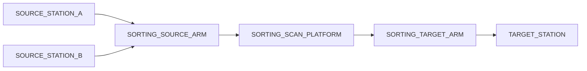

# Workline Plugin Manifest YAML 化与物理拓扑合同收敛 SPEC

> 日期：2026-06-17
> 状态：SPEC 修订稿，暂不实施；正式编码前必须完成 GitNexus 门禁
> 类型：插件 manifest 合同收敛 / YAML authoring / 前后端静态拓扑合同
> 范围：manifest 运行时模型清理、YAML manifest authoring、SMT 分拣机和粗分机静态拓扑、API/OpenAPI/前端 generated types 同步、插件文档和模板更新
> 非范围：设备 PLC 协议、插件 flow 业务编排、数据库迁移、设备真实配置、前端视觉重设计、启动期插件置灰隔离、冷启动缓存平台化

## 1. 背景

当前 Workline 插件 manifest 已经从早期 callable 混合体收敛为纯数据合同，但仍存在三类问题：

1. manifest 仍写在 Python 代码中，插件开发者需要理解多个 dataclass、helper 和字段之间的隐含关系，心智成本偏高。
2. `CommandBinding.rack_position_args`、`payload_schema_ref`、`result_bindings` 容易让开发者误以为平台会理解 command payload，并据此推导拓扑、源/目标或资源调度。
3. `smt_sorting_inbound` 的静态 topology 不能完整表达真实物理流程。它当前更像资源/货架位流向，而不是现场视角的设备间动作链路。

本系统尚未发布，因此本次 SPEC 不保留向后兼容包袱。目标是一次性把 manifest 收敛为“静态能力与拓扑合同”，并把旧的 payload 语义绑定从运行时模型、API、OpenAPI、前端 generated types、插件模板和测试中清理掉。

### 1.1 已验证当前状态

验证日期：2026-06-17。

| 位置 | 当前状态 | 对本 SPEC 的影响 |
| --- | --- | --- |
| `src/workline_runtime/plugin_manifest.py` | `RackPositionArgSourceKind` 仍包含 `COMMAND_PAYLOAD` | 需要删除 payload 语义绑定，避免 manifest 被误用为设备协议解释器 |
| `src/workline_runtime/plugin_manifest.py` | `TopologySpec` 注释约定 `MATERIAL_FLOW` 只描述货架位之间流动 | 保持该语义，设备相关物理连线统一使用 `OPERATION` |
| `src/workline_runtime/plugin_manifest.py` | `CommandBinding` 仍包含 `rack_position_args`、`payload_schema_ref`、`result_bindings` | 未发布系统不做兼容保留，目标模型直接删除这些字段 |
| `src/workline_runtime/plugin_manifest.py` | `WorklinePluginManifest` 已具备 `devices`、`rack_positions`、`topology`、`commands`、`events`、`resource_boundaries` | 顶层合同基本可用，重点是清理 command 子模型并新增 YAML loader |
| `src/workline_plugins/smt_sorting_inbound/plugin.py` | SMT manifest 写在 Python 代码中 | 需要迁移到 `manifest.yaml` |
| `src/workline_plugins/smt_sorting_inbound/plugin.py` | SMT 当前 topology 缺失 `SOURCE_ARM -> SCAN_PLATFORM -> TARGET_ARM` 物理链路 | 需要修正为现场物理流程视角 |
| `src/workline_plugins/rough_sorter/plugin.py` | 粗分机 manifest 写在 Python 代码中 | 需要迁移到 `manifest.yaml` |
| `src/workline_plugins/rough_sorter/plugin.py` | 粗分机 topology 已接近设备链路视角 | 可作为物理流程视角参考 |
| `wes_frontend/src/utils/runtime-scene.ts` | 前端从 `manifest.topology.flow_edges` 构建 scene topology | 前端合同方向正确，不应改为读取 command payload |
| `wes_frontend/src/utils/runtime-topology.ts` | 前端已支持 `DEVICE_ROLE` fan-out 到实际设备，`RACK_POSITION` 映射到货架位 | 后端只要给出完整拓扑，CANVAS 有条件渲染设备间连接 |

## 2. 目标

本次变更作为一个清爽收敛任务实施，不再拆出“先兼容、后清理”的两阶段任务。

必须达成：

- manifest 只表达四类静态事实：设备角色及 COMMAND/EVENT 能力、货架位、物理拓扑、资源边界。
- manifest 从 Python 内联对象迁移为插件目录下的 `manifest.yaml`。
- `CommandBinding` 收敛为最小能力目录，只保留 `command` 和 `target_device_role`。
- 删除 `rack_position_args`、`RackPositionArg*`、`CommandResultBinding`、`result_bindings`、command/event payload schema 引用。
- 命令结果事件作为普通 `EventBinding` 声明，使用 `category: COMMAND_RESULT`，不再通过 command result binding 维护映射。
- 前端 CANVAS 只依赖 `manifest.topology` 渲染物理流程，不读取 commands、events、payload schema 或 command payload 推导连线。
- SMT 分拣机拓扑表达真实流程：
  - `SOURCE_STATION_A/B -> SORTING_SOURCE_ARM`
  - `SORTING_SOURCE_ARM -> SORTING_SCAN_PLATFORM`
  - `SORTING_SCAN_PLATFORM -> SORTING_TARGET_ARM`
  - `SORTING_TARGET_ARM -> TARGET_STATION`
- 粗分机拓扑保持设备链路视角：
  - `ROUGH_SORTER_INPUT_ARM -> ROUGH_SORTER_CONVEYOR`
  - `ROUGH_SORTER_CONVEYOR -> ROUGH_SORTER_OUTPUT_ARM`
  - `ROUGH_SORTER_OUTPUT_ARM -> POSITION_WORK_SINGLE_LAYER`
- 后端 API、OpenAPI 和前端 generated types 同步更新为新合同，不保留旧字段。
- 插件开发指南和模板改为 YAML authoring，不再展示旧 Python manifest 和 payload binding 示例。

### 2.1 plan-eng-review 审计结论

本次工程审计后，SPEC 以“清爽收敛、一次性同步”为准，不再保留旧 API 兼容层。

审计确认的关键优化点：

- `EventBinding.payload_schema_ref` 也属于 payload schema 引用，必须和 `CommandBinding.payload_schema_ref` 一起移除，避免只清 command 不清 event 的半截合同。
- YAML loader 不能只做宽松 dict 投影，必须显式拒绝旧字段、未知字段、重复 command、冲突 event、重复 rack position、未知 enum 和跨段引用错误。
- `DeviceRequirement.hardware_capabilities` 与 `RackPositionCarrierCapability.allowed_slot_kinds` 属于静态能力声明，继续作为 YAML 可选字段保留；它们不涉及 payload 解释，不属于本次删除范围。
- 同一 event 跨多个设备角色出现时，只允许 `category` 完全一致，并由 loader 合并为一个 `EventBinding.source_device_roles`；同一 event 的 category 冲突必须失败。
- YAML topology edge 的 `from` / `to` 只属于 authoring 简写，loader 必须投影为 runtime/API 的 `from_node` / `to_node`；API、OpenAPI 和前端 generated types 不新增第二套 `from` / `to` 字段。
- 前端验证命令已可从 `wes_frontend/package.json` 锁定，不应继续写成“以前端仓库实际脚本为准”。
- `pyyaml` 必须作为后端直接依赖写入 `pyproject.toml` 并同步 `uv.lock`，不得依赖测试或其它库的传递依赖。
- 插件开发指南、模板、sandbox 示例和模板测试会直接影响后续插件作者心智模型；严格无兼容模式下，旧 payload binding 示例必须作为 P1 同批清理，不能降级为后续任务。
- 本计划触达后端 runtime、API schema、两个插件、模板、测试、OpenAPI 和前端 generated types，复杂度较高，但拆成“兼容阶段 + 清理阶段”会保留错误抽象并制造二次迁移；在系统未发布前一次性收敛是更低长期成本方案。
- 文档必须补数据流图、失败模式、并行实施策略和任务清单，确保后续实施者不需要重新做架构判断。

## 3. 非目标

本 SPEC 不做以下事情：

- 不修改 PLC/设备硬件协议。
- 不让平台从 command payload 或 event payload 推导 topology、source、target、resource boundary 或设备防呆。
- 不把设备真实编码、IP、端口、PLC 私有参数放进 manifest。
- 不把当前货架、当前料箱、当前物料、当前占用状态放进 manifest。
- 不把插件 flow 的业务分支逻辑放进 YAML。
- 不新增数据库表。
- 不引入 `PHYSICAL_POINT` 节点类型。扫码平台按 `DEVICE_ROLE` 表达。
- 不在本 SPEC 中重命名粗分机现有 `POSITION_WORK_SINGLE_LAYER`。
- 不强制本次实现 CANVAS 连线 label/COMMAND 展示。若后续需要，必须在 topology edge 上显式增加 `label` 或 `action` 字段，不从 command payload 或 command list 反推。
- 不新增 manifest JSON Schema 生成脚本、启动期全插件置灰隔离、冷启动预加载缓存等平台化能力。
- 不保留旧 manifest API 兼容层，不保留旧前端 generated types。

## 4. Manifest 职责边界

### 4.1 Manifest 必须表达的静态事实

| 能力 | 说明 | 示例 |
| --- | --- | --- |
| 设备角色及能力 | 每个设备角色支持的 COMMAND/EVENT | `SORTING_SOURCE_ARM` 支持 `SORTING_SOURCE_PICK` 和 `SORTING_SOURCE_PICK_RESULT` |
| 货架位 | WES 管理的货架停靠位/库存事实锚点 | `SOURCE_STATION_A`, `TARGET_STATION` |
| 物理拓扑 | 前端 CANVAS 可以直接渲染的静态边 | `SORTING_SOURCE_ARM -> SORTING_SCAN_PLATFORM` |
| 资源边界 | 货架位调度、租约、WMS operation、snapshot 声明 | `SORTING_INBOUND_SOURCE`, `SORTING_INBOUND_TARGET` |

### 4.2 Manifest 不理解设备 payload

设备 command payload 已经由设备硬件 PLC、设备 profile 或插件 command builder 确定源和目标。平台 manifest 不再理解这些字段。

允许：

- 在运行时记录、转发、展示设备 payload。
- 插件 flow 或 command builder 根据业务上下文构造 payload。
- device profile/PLC 使用 payload 做设备级执行和防呆。

不允许：

- 平台通用层从 payload 字段推导物理拓扑。
- 平台通用层从 payload 字段推导货架位资源边界。
- 平台通用层从 payload 字段判断设备间源/目标合法性。
- manifest authoring 要求开发者填写 payload path binding 才能完成拓扑或调度声明。
- API summary 暴露旧 payload binding 字段，让前端或插件开发者误以为这是推荐能力。

### 4.3 RuntimeIntent payload 与设备 command payload 的边界

`RuntimeIntent.payload_json` 是平台内部标准意图合同，可被 runtime executor、resource wait、handling/resource 服务理解。

设备 command payload 是插件与设备协议之间的执行证据和下发内容，只由插件、device profile、设备网关和 PLC 理解。

这两个 payload 不能混成 manifest 语义来源。

## 5. 目标运行时模型

### 5.1 WorklinePluginManifest

`WorklinePluginManifest` 保持以下顶层字段：

| 字段 | 作用 |
| --- | --- |
| `plugin_key` | 插件唯一标识 |
| `contract_version` | 插件合同版本 |
| `devices` | 设备角色和数量约束 |
| `rack_positions` | WES 管理货架位 |
| `topology` | 静态物理拓扑 |
| `commands` | 设备角色可执行命令目录 |
| `events` | 设备角色可上报事件目录 |
| `resource_boundaries` | 货架位调度边界 |

### 5.2 CommandBinding

目标形态：

| 字段 | 说明 |
| --- | --- |
| `command` | 命令编码 |
| `target_device_role` | 接收该命令的设备角色 |

必须删除：

- `rack_position_args`
- `payload_schema_ref`
- `result_bindings`
- `RackPositionArgRole`
- `RackPositionArgSourceKind`
- `RackPositionArgSource`
- `RackPositionArg`
- `CommandResultBinding`

### 5.3 EventBinding

目标形态：

| 字段 | 说明 |
| --- | --- |
| `event` | 事件编码 |
| `source_device_roles` | 可能产生该事件的设备角色 |
| `category` | 事件分类，例如 `ENTRY_DEVICE`、`COMMAND_RESULT`、`OPERATOR`、`INTERNAL`、`SAFETY` |

必须删除：

- `payload_schema_ref`

事件 payload schema 引用不进入本次目标模型。若后续确需协议文档引用，应作为独立文档能力或 schema 工具设计，不进入平台通用调度语义。

### 5.4 TopologySpec

保持现有语义：

- `MATERIAL_FLOW` 只描述 `RACK_POSITION -> RACK_POSITION`。
- 涉及 `DEVICE_ROLE` 的物理动作连线必须使用 `OPERATION`。
- topology 是显式渲染合同，不从 commands/events 自动推导。

### 5.5 目标数据流

```text
插件目录 manifest.yaml
        |
        v
WorklinePluginManifest.from_yaml_file()
        |
        v
YAML dict strict validation
        |
        v
WorklinePluginManifest dataclass
        |
        +--> plugin registry / assignment validation
        |
        +--> WorkLineService manifest summary
                 |
                 v
          OpenAPI / generated types
                 |
                 v
          runtime monitor CANVAS
                 |
                 v
          topology.flow_edges 渲染物理流程
```

关键约束：

- YAML loader 负责 authoring shape 到 runtime dataclass 的唯一投影。
- Service summary 只做 dataclass 到 API schema 的格式转换，不重新解释 payload。
- 前端只消费 `topology.flow_edges`、`devices`、`rack_positions` 渲染物理连接。
- `commands` 和 `events` 是能力目录，不是拓扑推导输入。

## 6. YAML Authoring 合同

### 6.1 文件位置

每个插件维护一个静态 YAML：

```text
src/workline_plugins/<plugin_key>/manifest.yaml
```

插件 Python 入口只负责：

- 加载 `manifest.yaml`。
- 注册 plugin class、flow service、event/command handler。
- 保留业务方法，例如 `resolve_business_key`、`classify_result`、`get_context_model`、`resolve_material_identity`、`list_ng_reasons`。

### 6.2 Loader 入口

新增明确入口：

- `WorklinePluginManifest.from_yaml_file(path)`
- `WorklinePluginManifest.from_yaml_dict(data)`

插件类加载 manifest 时使用插件目录相对路径，例如通过当前文件所在目录定位 `manifest.yaml`。不得依赖进程工作目录。

### 6.3 YAML 顶层结构

YAML authoring 以 `device_roles` 为中心，降低 `devices + commands + events` 分散维护的心智成本：

```yaml
plugin_key: smt_sorting_inbound
contract_version: "2026-06-01.p0"

device_roles:
  SORTING_SOURCE_ARM:
    min_count: 1
    max_count: 1
    hardware_capabilities: []
    commands:
      - SORTING_SOURCE_PICK
    events:
      - event: SORTING_SOURCE_PICK_RESULT
        category: COMMAND_RESULT

rack_positions:
  - code: SOURCE_STATION_A
    role: SOURCE
    station_code: SOURCE_STATION_A
    carrier_capability:
      allowed_rack_kinds: [SINGLE_LAYER]
      allowed_slot_kinds: []
      min_capacity: 1
      max_capacity: 1

topology:
  flow_edges:
    - from: {kind: RACK_POSITION, ref: SOURCE_STATION_A}
      to: {kind: DEVICE_ROLE, ref: SORTING_SOURCE_ARM}
      type: OPERATION

resource_boundaries:
  - rack_position_code: SOURCE_STATION_A
    rack_kind: SINGLE_LAYER
    business_demand_type: SORTING_INBOUND_SOURCE
    wms_operation_type: SUPPLY_SINGLE_LAYER_RACK
    snapshot_kind: ACTIVE_SOURCE_BIN_RACK
    lease_scope: STATION
```

约束：

- `device_roles` 必须是对象，key 为设备角色编码。
- `device_roles.<role>.min_count` 默认值为 `1`；`max_count` 默认值为 `null`；`hardware_capabilities` 为可选字符串数组，默认空数组。
- `commands` 可省略，默认空数组；出现时必须是字符串数组。
- `events` 可省略，默认空数组；出现时必须是对象数组，每项只允许包含 `event` 和 `category`。
- `rack_positions[].carrier_capability.allowed_slot_kinds` 为可选字符串数组，默认空数组。
- `rack_positions`、`topology.flow_edges`、`resource_boundaries` 必须显式声明，不从 command payload 或 event payload 推导。
- `topology.flow_edges[]` 在 YAML 中只允许 `from`、`to`、`type` 三个字段；`from` 和 `to` 是 YAML-only authoring 字段，分别投影为 runtime/API 的 `from_node` 和 `to_node`。
- YAML 中禁止使用 `from_node` / `to_node`，避免把 authoring shape 和 API shape 混在一起。
- YAML 任意层级出现 `rack_position_args`、`payload_schema_ref`、`result_bindings`、`result`、`classification`、`terminal`、`next_event` 等旧 payload/result binding 字段应直接校验失败。
- YAML 顶层仅允许 `plugin_key`、`contract_version`、`device_roles`、`rack_positions`、`topology`、`resource_boundaries`；顶层 `devices`、`commands`、`events` 也应失败，因为它们只属于 runtime/API 投影，不属于 YAML authoring 输入。
- `plugin_key`、`contract_version`、role、command、event、rack position code、station code、enum 值都必须是字符串；unknown enum 必须失败。
- `category` 仅允许当前 `EventCategory` 枚举值：`ENTRY_DEVICE`、`INTERNAL`、`COMMAND_RESULT`、`OPERATOR`、`SAFETY`。
- 每个 `device_roles.<role>.commands` 内 command 不得重复；全插件 command 编码不得重复绑定到多个 target role，除非未来另开 SPEC 明确允许多设备同名 command。
- 每个 `device_roles.<role>.events` 内 event 不得重复；同一 event 跨 role 出现时，只有 category 完全一致才允许合并为单个 `EventBinding.source_device_roles`；category 冲突必须校验失败。
- `rack_positions.code` 必须全局唯一。
- `resource_boundaries.rack_position_code` 必须引用已声明货架位。
- `topology.flow_edges` 引用必须指向已声明 device role 或 rack position。
- 涉及 `DEVICE_ROLE` 的 `flow_edges` 必须使用 `OPERATION`；`MATERIAL_FLOW` 只允许 `RACK_POSITION -> RACK_POSITION`。
- YAML 解析错误、结构错误和跨引用错误都应抛出包含插件文件路径和字段路径的可读异常。

### 6.4 YAML 到运行时模型投影

loader 是唯一投影入口，规则固定如下：

| YAML authoring | Runtime model |
| --- | --- |
| `device_roles.<role>` | 一个 `DeviceRequirement(role=<role>, min_count, max_count, hardware_capabilities)` |
| `device_roles.<role>.commands[]` | 一个 `CommandBinding(command=<command>, target_device_role=<role>)` |
| `device_roles.<role>.events[]` | 按 event 合并为 `EventBinding(event, source_device_roles, category)` |
| `rack_positions[]` | 原样投影为 `RackPosition` 和 `RackPositionCarrierCapability` |
| `topology.flow_edges[].from/to/type` | 投影为 `FlowEdge(from_node=<from>, to_node=<to>, type)`，并执行 node ref 和 edge type 校验 |
| `resource_boundaries[]` | 原样投影为 `ResourceBoundary`，并校验 rack position 引用和 rack kind 能力 |

投影后 API summary 继续输出顶层 `devices`、`commands`、`events`、`rack_positions`、`topology`、`resource_boundaries`，不把 `device_roles` 作为新的 API 字段暴露给前端。

API summary、OpenAPI 和前端 generated types 中的 `FlowEdge` 继续只包含 `from_node`、`to_node`、`type`；`from` / `to` 不得出现在 runtime/API 合同中。

### 6.5 事件目录边界

manifest events 表达设备、操作员、安全或命令结果等能力目录。

插件内部 handoff 事件不要求进入 manifest。以 SMT 为例，`EVENT_SOURCE_PICK_REQUESTED` 属于内部 flow 编排事件，不是前端能力展示或物理拓扑渲染所需事实，不进入 YAML manifest。

## 7. SMT 分拣机 Manifest 目标形态

### 7.1 设备角色

| 设备角色 | COMMAND | EVENT |
| --- | --- | --- |
| `SORTING_SOURCE_ARM` | `SORTING_SOURCE_PICK` | `SORTING_SOURCE_PICK_RESULT` |
| `SORTING_SCAN_PLATFORM` | 无 | `WORKING_BIN_SCAN` |
| `SORTING_TARGET_ARM` | `SORTING_TARGET_PLACE`, `SORTING_NG_PLACE` | `SORTING_TARGET_PLACE_RESULT`, `SORTING_NG_PLACE_RESULT` |
| `SORTING_WORKSTATION` | 无 | `SESSION_COMPLETE_REQUESTED` |

### 7.2 货架位

| 货架位 | 角色 | 货架类型 |
| --- | --- | --- |
| `SOURCE_STATION_A` | `SOURCE` | `SINGLE_LAYER` |
| `SOURCE_STATION_B` | `SOURCE` | `SINGLE_LAYER` |
| `TARGET_STATION` | `TARGET` | `FIVE_LAYER` |

### 7.3 物理拓扑



关键约定：

- `SOURCE_ARM` 从 `SOURCE_STATION_A/B` 取料。
- `SOURCE_ARM` 放到扫码平台。
- `TARGET_ARM` 从扫码平台取料。
- `TARGET_ARM` 放入流水线目标料箱或 NG 目标。
- `TARGET_STATION` 是 WES 管理的目标货架位，不代表具体料箱格口。
- 目标料箱/格口仍由插件 flow、资源调度、设备 command payload 或 PLC 处理，不进入 manifest 拓扑节点。
- 上述五条边均使用 `OPERATION`。

### 7.4 资源边界

| rack_position_code | rack_kind | business_demand_type | wms_operation_type | snapshot_kind | lease_scope |
| --- | --- | --- | --- | --- | --- |
| `SOURCE_STATION_A` | `SINGLE_LAYER` | `SORTING_INBOUND_SOURCE` | `SUPPLY_SINGLE_LAYER_RACK` | `ACTIVE_SOURCE_BIN_RACK` | `STATION` |
| `SOURCE_STATION_B` | `SINGLE_LAYER` | `SORTING_INBOUND_SOURCE` | `SUPPLY_SINGLE_LAYER_RACK` | `ACTIVE_SOURCE_BIN_RACK` | `STATION` |
| `TARGET_STATION` | `FIVE_LAYER` | `SORTING_INBOUND_TARGET` | `ALLOCATE_SORTING_TARGET_BIN` | `ACTIVE_TARGET_BIN_RACK` | `STATION` |

## 8. 粗分机 Manifest 目标形态

### 8.1 设备角色

| 设备角色 | COMMAND | EVENT |
| --- | --- | --- |
| `ROUGH_SORTER_INPUT_ARM` | `PICK_AND_PUT`, `MOVE_TO_NG` | `SCAN_COMPLETED` |
| `ROUGH_SORTER_CONVEYOR` | `MOVE_FORWARD` | 无 |
| `ROUGH_SORTER_OUTPUT_ARM` | `PUT_TO_BIN` | `ROUGH_SORTER_STORAGE_RETRY` |

### 8.2 货架位

| 货架位 | 角色 | 货架类型 |
| --- | --- | --- |
| `POSITION_WORK_SINGLE_LAYER` 当前实现值为 `SINGLE_LAYER_A` | `CLASSIFIER_WORK` | `SINGLE_LAYER` |

### 8.3 物理拓扑


三条边均使用 `OPERATION`。

### 8.4 资源边界

| rack_position_code | rack_kind | business_demand_type | wms_operation_type | snapshot_kind | lease_scope |
| --- | --- | --- | --- | --- | --- |
| `POSITION_WORK_SINGLE_LAYER` | `SINGLE_LAYER` | `ROUGH_SORTER_BIN_ALLOCATION` | `REPLACE_CLASSIFIER_WORK_RACK` | `ACTIVE_CLASSIFIER_BIN_RACK` | `STATION` |

## 9. 前端 CANVAS 渲染合同

前端 runtime monitor 的 CANVAS 必须只依赖 manifest 拓扑渲染静态流程：

- 输入：manifest summary 中的 `topology.flow_edges`、`devices`、`rack_positions`。
- 允许边类型：
  - `RACK_POSITION -> DEVICE_ROLE`
  - `DEVICE_ROLE -> DEVICE_ROLE`
  - `DEVICE_ROLE -> RACK_POSITION`
  - `RACK_POSITION -> RACK_POSITION`
- `DEVICE_ROLE` 在前端布局层 fan-out 到当前 workline 下匹配的实际设备节点。
- `RACK_POSITION` 映射到 manifest 声明的货架位节点。
- 缺失设备或货架位时，前端可显示诊断，但不得用 command payload 补推连线。
- 前端不得从 `commands`、`events`、payload schema 或 command payload 推导物理连线。

连线 label：

- 本 SPEC 不强制实现 label 字段。
- 后续如要显示 `SORTING_SOURCE_PICK` 这类 COMMAND，使用 topology edge 显式 `label` 或 `action` 字段，不从 command list 或 command payload 反推。

## 10. 实施建议

### 10.1 后端

1. 在 `plugin_manifest.py` 中新增 YAML loader，将 role-centered YAML 转换为 `WorklinePluginManifest`。
2. 同步清理 manifest runtime 模型：
   - 删除 `RackPositionArg*`。
   - 删除 `CommandResultBinding`。
   - 删除 `CommandBinding.rack_position_args`、`payload_schema_ref`、`result_bindings`。
   - 删除相关 `__all__` export。
3. 调整 `WorklinePluginManifest` 校验：
   - command 只校验 `command` 和 `target_device_role`。
   - event 负责表达命令结果事件目录。
   - topology 引用仍校验已声明 role 或 rack position。
   - 涉及设备的边必须为 `OPERATION`。
   - `MATERIAL_FLOW` 只允许 `RACK_POSITION -> RACK_POSITION`。
4. 迁移 `smt_sorting_inbound` 和 `rough_sorter` 两个插件 manifest 到 YAML。
5. 插件 Python 文件只保留业务代码、handler、flow service 接入和 manifest 加载。
6. 更新 `WorkLinePluginManifestSummary` 相关 Pydantic 模型和 Service summary 构建逻辑，移除旧字段。
7. 重新生成 OpenAPI，并同步前端 generated types。
8. 使用 PyYAML 解析 YAML；必须在 `pyproject.toml` 直接声明 `pyyaml` 并同步 `uv.lock`，不依赖传递依赖。
9. manifest 文件在插件模块导入时加载为类属性，行为与当前 Python 内联 manifest 一致；不新增启动期全插件扫描、缓存或置灰隔离机制。
10. 删除或改写所有旧字段相关测试、模板断言和示例，避免旧合同在测试中继续复活。
11. 后端需启动并提供 `http://127.0.0.1:8001/api/openapi.json`，供前端 `generate:types`、`generate:zod` 和 `contract:verify` 消费；若使用文件源，必须显式设置 `OPENAPI_SPEC_PATH` 或 `OPENAPI_SPEC_URL`。

### 10.2 前端

1. 同步更新 generated OpenAPI types 和 zod schemas，删除旧 `RackPositionArg*`、`CommandResultBinding` 和 command 旧字段。
2. 保持从 `manifest.topology.flow_edges` 构建 runtime scene。
3. 验证混合边在 layout 中能正常展开：
   - rack position 到 device role。
   - device role 到 device role。
   - device role 到 rack position。
4. 不从 commands、events、payload schema 或 command payload 推导物理连线。
5. 明确验证命令：
   - `pnpm run generate:types`
   - `pnpm run generate:zod`
   - `pnpm run contract:verify -- --require-backend`
   - `pnpm run type:check`
   - `pnpm run test -- runtime-topology`
   - `pnpm run test -- runtime-scene`

### 10.3 文档和模板

1. 更新插件开发指南，明确 manifest 四类职责和非职责。
2. 更新插件模板，改为 YAML manifest authoring。
3. 从开发模板、README、sandbox 示例和测试模板中删除 `RackPositionArg*`、`payload_schema_ref`、`result_bindings` 推荐用法。
4. 明确设备间防呆由 PLC/设备硬件控制，平台 manifest 只声明静态拓扑与调度资源。

## 11. 验收标准

1. SMT 插件 manifest 从 YAML 加载，API summary 中包含完整物理流程：
   - `SOURCE_STATION_A -> SORTING_SOURCE_ARM`
   - `SOURCE_STATION_B -> SORTING_SOURCE_ARM`
   - `SORTING_SOURCE_ARM -> SORTING_SCAN_PLATFORM`
   - `SORTING_SCAN_PLATFORM -> SORTING_TARGET_ARM`
   - `SORTING_TARGET_ARM -> TARGET_STATION`
2. 粗分机插件 manifest 从 YAML 加载，API summary 中包含：
   - `ROUGH_SORTER_INPUT_ARM -> ROUGH_SORTER_CONVEYOR`
   - `ROUGH_SORTER_CONVEYOR -> ROUGH_SORTER_OUTPUT_ARM`
   - `ROUGH_SORTER_OUTPUT_ARM -> POSITION_WORK_SINGLE_LAYER`
3. API summary 中 `CommandBinding` 只包含 `command` 和 `target_device_role`。
4. 后端 runtime 模型、Pydantic API schema、OpenAPI、前端 generated types 中不存在 `RackPositionArg*`、`rack_position_args`、`CommandResultBinding`、`result_bindings`、`payload_schema_ref`。
5. YAML manifest 与插件开发模板不包含旧 payload binding 字段。
6. YAML topology edge 只使用 `from` / `to`；runtime dataclass、Pydantic API schema、OpenAPI、前端 generated types 中 `FlowEdge` 只包含 `from_node`、`to_node`、`type`，不出现 YAML-only `from` / `to`。
7. 前端 runtime monitor CANVAS 在 SMT 分拣机场景中能显示设备间连接。
8. 平台通用代码不读取 command payload 来推导 topology、source、target、rack position 或 resource boundary。
9. SMT 和粗分机现有 flow 行为不因 manifest YAML 化发生业务变化。
10. `device_roles` 只存在于 YAML authoring 层；API summary 不新增 `device_roles` 字段，仍输出现有顶层 `devices`、`commands`、`events` 等运行时合同字段。
11. YAML 中同名 event 跨 role 且 category 一致时合并为单个 `EventBinding`；category 不一致时 loader 失败。
12. `pyproject.toml` 直接声明 `pyyaml` 依赖，`uv.lock` 与之同步。

## 12. 测试计划

### 12.1 后端 unit tests

| 测试 | 目标 |
| --- | --- |
| YAML loader happy path | SMT、粗分机 manifest 可加载 |
| YAML loader legacy fields rejected | YAML 任意层级出现 `rack_position_args`、`payload_schema_ref`、`result_bindings`、`classification` 等旧字段时失败 |
| YAML loader unknown keys rejected | YAML 顶层或嵌套对象出现未知字段时失败 |
| YAML loader duplicate command rejected | 重复 command 或同一 command 绑定多个 target role 时失败 |
| YAML loader event merge/reject | 同名 event 同 category 跨 role 合并；同名 event 不同 category 失败 |
| YAML loader edge shape | YAML `topology.flow_edges[].from/to` 投影为 runtime `from_node/to_node`；YAML 使用 `from_node/to_node` 时失败 |
| YAML loader invalid role | topology 或 command/event 引用未知 device role 时失败 |
| YAML loader invalid rack position | topology 或 resource boundary 引用未知 rack position 时失败 |
| topology edge type validation | 涉及 `DEVICE_ROLE` 的边不能使用 `MATERIAL_FLOW` |
| SMT topology test | 断言 5 条真实物理流程边存在且均为 `OPERATION` |
| Rough sorter topology test | 断言 3 条设备/货架位流程边存在且均为 `OPERATION` |
| payload non-semantic test | 断言通用拓扑/资源调度不依赖 command payload binding |

### 12.2 后端 API tests

| 测试 | 目标 |
| --- | --- |
| manifest summary SMT | 返回 devices、commands、events、rack_positions、topology、resource_boundaries |
| manifest summary rough sorter | 返回粗分机完整拓扑和资源边界 |
| command schema cleanup | command summary 不返回旧字段 |
| event schema cleanup | event summary 不返回 `payload_schema_ref` |
| authoring/runtime boundary | API summary 不暴露 YAML-only `device_roles` 字段 |
| OpenAPI schema cleanup | OpenAPI 中不存在旧 `RackPositionArg*`、`CommandResultBinding` 和 `payload_schema_ref` schema 字段 |
| OpenAPI FlowEdge boundary | OpenAPI `FlowEdge` 只暴露 `from_node`、`to_node`、`type`，不暴露 YAML-only `from` / `to` |

### 12.3 前端 tests

| 测试 | 目标 |
| --- | --- |
| generated types sync | 前端 generated types 与新 OpenAPI 一致 |
| generated FlowEdge boundary | generated types 中 `FlowEdge` 只包含 `from_node`、`to_node`、`type`，不包含 YAML-only `from` / `to` |
| runtime scene SMT fixture | 断言 rack-to-device、device-to-device、device-to-rack 边展开成功 |
| runtime scene rough sorter fixture | 断言粗分机链路展开成功 |
| diagnostics | 缺失设备或货架位时只报 manifest/ref 诊断，不从 payload 补推 |

前端实施前需检查 `wes_frontend/package.json`，锁定实际 typecheck/test 命令。若当前仓库没有对应测试脚本，至少运行可用的类型检查和相关 fixture 单测。

当前已确认可用命令：

```bash
cd /Users/kaizhou/SynologyDrive/works/wes_backend
uv run uvicorn main:app --host 0.0.0.0 --port 8001

cd /Users/kaizhou/SynologyDrive/works/wes_frontend
pnpm run generate:types
pnpm run generate:zod
pnpm run contract:verify -- --require-backend
pnpm run type:check
pnpm run test -- runtime-topology
pnpm run test -- runtime-scene
```

### 12.4 覆盖图

```text
CODE PATHS                                                USER FLOWS
[PLAN] src/workline_runtime/plugin_manifest.py            [PLAN] 插件开发者 authoring manifest.yaml
  ├── from_yaml_file()                                      ├── [GAP] 正确 YAML 加载为 manifest
  │   ├── [GAP] 文件不存在                                  ├── [GAP] 旧字段被拒绝并提示字段路径
  │   ├── [GAP] YAML 语法错误                               └── [GAP] 引用未知 role/rack position 时失败
  │   └── [GAP] 非 mapping root
  ├── from_yaml_dict()                                    [PLAN] 后端 manifest summary
  │   ├── [GAP] device_roles 投影 devices/commands/events    ├── [GAP] SMT 返回 5 条物理边
  │   ├── [GAP] duplicate command/event                     ├── [GAP] 粗分机返回 3 条物理边
  │   ├── [GAP] legacy fields rejected                      └── [GAP] command/event 旧字段不存在
  │   ├── [GAP] flow_edges from/to -> from_node/to_node
  │   └── [GAP] topology/resource refs
  └── _validate_topology_refs()
      ├── [GAP] DEVICE_ROLE edge must be OPERATION        [PLAN] 前端 runtime monitor CANVAS
      └── [GAP] MATERIAL_FLOW only rack-to-rack             ├── [GAP] rack -> device 展开
                                                            ├── [GAP] device -> device 展开
[PLAN] src/app/workline/models/workline.py                 ├── [GAP] device -> rack 展开
  ├── [GAP] CommandBinding schema cleanup                   ├── [GAP] generated FlowEdge 无 YAML-only from/to
  ├── [GAP] EventBinding schema cleanup                     └── [GAP] 缺失引用只显示诊断，不从 payload 补边
  └── [GAP] FlowEdge keeps from_node/to_node only

[PLAN] src/workline_plugins/*/manifest.yaml
  ├── [GAP] SMT YAML exact topology
  └── [GAP] Rough sorter YAML exact topology

COVERAGE TARGET: 上述 GAP 在实施时全部补测试；无旧字段 smoke-only 断言。
QUALITY TARGET: 后端 loader/API 以行为断言为主；前端 topology 以 fixture + exact edge 断言为主。
```

## 13. 风险与控制

| 风险 | 影响 | 控制 |
| --- | --- | --- |
| `WorklinePluginManifest` 影响面高 | 后端注册、校验、API、测试多处受影响 | 实施前运行 GitNexus impact analysis；HIGH/CRITICAL 先汇报 |
| 破坏 API/OpenAPI/前端 generated types | 前后端必须同 PR 或同批次同步 | 系统未发布，允许破坏旧合同；验收以新合同为准 |
| 旧测试依赖 `rack_position_args` 或 `result_bindings` | 测试会失败 | 同步删除旧断言，改为验证新模型和事件目录 |
| `MATERIAL_FLOW` 误用于设备链路 | 会触发校验失败或拓扑语义混乱 | 设备相关连线统一使用 `OPERATION` |
| YAML schema 过度设计 | 插件开发者心智成本反而上升 | 第一版只覆盖四类静态事实，不引入表达式、条件或业务 DSL |
| 前端合同漂移 | runtime monitor 断线或类型生成失败 | OpenAPI/generated types 与后端模型同步，前端 fixture 覆盖混合边 |
| command payload 语义回流 | 平台职责再次膨胀 | 模型删除旧字段，YAML loader 拒绝旧字段，文档和模板不再展示 |
| YAML 配置静态拼写与缩进错误 | 插件模块导入时解析失败 | loader 输出明确错误信息；JSON Schema 自动生成作为后续能力，不进入本期 |
| YAML 文件损坏导致插件导入失败 | 与当前 Python manifest 写错时类似，会影响对应插件注册 | 本期接受显式失败，不新增置灰隔离平台能力 |
| 静态拓扑与绑定事实一致性匹配缺失 | 声明拓扑与实际 workline 设备绑定不一致时缺少后端诊断 | 本阶段拓扑仅作为前端渲染合同；一致性诊断后续单独规划 |

### 13.1 失败模式审计

| 新路径 | 真实失败模式 | 本 SPEC 是否覆盖 | 用户可见结果 |
| --- | --- | --- | --- |
| YAML 文件读取 | 文件缺失、路径依赖 cwd、权限错误 | 通过 `from_yaml_file(path)`、插件目录相对路径和 loader tests 覆盖 | 启动或导入阶段显式失败，日志包含路径 |
| YAML 解析 | 缩进错误、root 不是 mapping、字段类型错误 | 通过 strict validation tests 覆盖 | 显式错误，不进入半初始化 manifest |
| YAML 旧字段 | 旧模板残留 `rack_position_args` 或 `result_bindings` | 通过 legacy fields rejected 覆盖 | 显式失败，阻止旧合同回流 |
| YAML/API 字段漂移 | loader/API 混用 `from` / `to` 与 `from_node` / `to_node` | 通过 YAML edge shape、OpenAPI FlowEdge boundary 和 generated FlowEdge boundary 覆盖 | 类型生成或合同测试失败，避免前端读取双字段 |
| role-centered 投影 | command/event 重复、event 多 role 合并错误 | 通过 duplicate tests 和 event 投影测试覆盖 | manifest summary 不重复、不丢 role |
| topology 校验 | `DEVICE_ROLE` 边误用 `MATERIAL_FLOW` | 通过 edge type validation 覆盖 | 显式失败，避免前端渲染语义漂移 |
| API summary | Service 仍输出旧字段 | 通过 command/event schema cleanup 覆盖 | 前端 generated types 与 API 一致 |
| OpenAPI/codegen | 后端 schema 更新但前端未生成 | 通过 `generate:types`、`generate:zod`、`contract:verify` 覆盖 | CI/typecheck 失败，不让错合同进入 UI |
| CANVAS 拓扑 | 缺失设备绑定导致 fan-out 为空 | 前端 diagnostics test 覆盖 | 用户看到诊断，不静默断线 |
| 插件 flow | manifest 清理误删 handler 或业务方法 | 插件单测和现有 flow 测试覆盖 | flow 行为保持，失败在测试阶段暴露 |

## 14. 回滚策略

- 本 SPEC 不涉及数据库迁移。
- 如果 YAML loader 或 manifest 迁移出现问题，回滚本次 PR 即可恢复 Python 内联 manifest 和旧 API。
- 如果前端拓扑渲染异常，可先回滚 topology 边声明或前端 fixture 变更，不影响 runtime flow 执行。
- 因本次目标是不保留旧兼容层，回滚以代码版本回退为主，不设计运行时双轨兼容。

## 15. 文件参考

| 文件 | 预期变化 |
| --- | --- |
| `src/workline_runtime/plugin_manifest.py` | 增加 YAML loader；清理 `RackPositionArg*`、`CommandResultBinding` 和 command 旧字段；保持 topology 校验语义 |
| `src/workline_runtime/__init__.py` | 删除旧 manifest 类型 export |
| `src/workline_plugins/smt_sorting_inbound/plugin.py` | 从 Python 内联 manifest 改为加载 YAML，移除 manifest helper |
| `src/workline_plugins/smt_sorting_inbound/manifest.yaml` | 新增 SMT 静态 manifest |
| `src/workline_plugins/rough_sorter/plugin.py` | 从 Python 内联 manifest 改为加载 YAML，移除 manifest helper |
| `src/workline_plugins/rough_sorter/manifest.yaml` | 新增粗分机静态 manifest |
| `src/app/workline/models/workline.py` | API summary 模型删除旧 command 字段和旧 schema |
| `src/app/workline/services/workline_service.py` | summary 构建逻辑删除旧字段投影 |
| `tests/workline_runtime/*` | 更新 manifest/model/topology 测试，删除旧字段断言，新增 YAML loader 测试 |
| `tests/workline_plugins/*` | 更新插件模板和现有插件测试，锁定 YAML manifest 目标形态 |
| `tests/test_workline_routes.py` / `tests/test_workline_service_plugin_validation.py` | 更新 API summary 断言，确认旧字段不返回 |
| `pyproject.toml` / `uv.lock` | 直接声明 `pyyaml` 并同步 lock，不依赖传递依赖 |
| `docs/plugin_development_guide.md` | 更新 manifest 职责和 YAML authoring 指南 |
| `docs/templates/workline_plugin/*` | 更新插件模板为 YAML manifest，删除旧 payload binding 示例 |
| `wes_frontend/src/api/generated/*` | 同步新 OpenAPI generated types |
| `wes_frontend/src/types/generated/*` | 同步新 zod/generated types |
| `wes_frontend/src/utils/runtime-scene.ts` | 补充或验证从 manifest topology 构建拓扑的 fixture 测试 |
| `wes_frontend/src/utils/runtime-topology.ts` | 补充或验证混合边展开测试 |

## 16. 实施前门禁

正式实施前必须完成：

1. 对 `WorklinePluginManifest`、`CommandBinding`、`EventBinding`、`SmtSortingInboundPlugin`、`RoughSorterPlugin`、`WorkLineService` 相关 summary 构建方法运行 GitNexus impact analysis。
2. 如任何目标返回 HIGH 或 CRITICAL 风险，实施前向用户报告影响面并获得确认。
3. 先写失败测试，再实现 loader、模型清理和插件迁移。
4. 实施期间不得修改 `AGENTS.md`、`CLAUDE.md` 等无关用户改动。
5. 先跑后端 targeted tests，再跑 OpenAPI/generated types，再跑前端 type/contract checks。

## 17. 实施任务清单

- [ ] **T1 (P1, human: ~2h / CC: ~20min)** — manifest runtime — 清理 `CommandBinding` / `EventBinding` 旧 payload 语义字段
  - Surfaced by: Architecture Review — `plugin_manifest.py` 和 API schema 仍同时暴露 `rack_position_args`、`result_bindings`、`payload_schema_ref`
  - Files: `src/workline_runtime/plugin_manifest.py`, `src/workline_runtime/__init__.py`, `src/app/workline/models/workline.py`, `src/app/workline/services/workline_service.py`
  - Verify: `uv run pytest tests/workline_runtime/test_plugin_manifest_and_topology.py tests/test_workline_service_plugin_validation.py`
- [ ] **T2 (P1, human: ~2h / CC: ~25min)** — YAML loader — 实现 role-centered YAML strict loader
  - Surfaced by: Architecture Review — SPEC 需要唯一 authoring 入口和严格字段/引用校验
  - Files: `src/workline_runtime/plugin_manifest.py`, `pyproject.toml`, `uv.lock`, `tests/workline_runtime/test_yaml_loader.py`
  - Verify: `uv run pytest tests/workline_runtime/test_yaml_loader.py`
- [ ] **T3 (P1, human: ~3h / CC: ~30min)** — plugins — 迁移 SMT 与粗分机 manifest 到 YAML 并锁定物理拓扑
  - Surfaced by: Architecture Review — 两个插件仍为 Python 内联 manifest，SMT 缺真实物理链路
  - Files: `src/workline_plugins/smt_sorting_inbound/`, `src/workline_plugins/rough_sorter/`, `tests/workline_runtime/`
  - Verify: `uv run pytest tests/workline_runtime/test_smt_sorting_inbound_plugin.py tests/workline_runtime/test_plugin_manifest_and_topology.py`
- [ ] **T4 (P1, human: ~2h / CC: ~20min)** — OpenAPI/frontend contract — 重新生成 OpenAPI 与前端 generated types
  - Surfaced by: Test Review — 后端破坏性 schema 清理必须和前端类型同批次同步，且 `FlowEdge` 不能暴露 YAML-only `from` / `to`
  - Files: `src/app/workline/models/workline.py`, `wes_frontend/src/api/generated/*`, `wes_frontend/src/types/generated/*`
  - Verify: 后端运行 `uv run uvicorn main:app --host 0.0.0.0 --port 8001` 并暴露 `http://127.0.0.1:8001/api/openapi.json`；前端运行 `pnpm run generate:types && pnpm run generate:zod && pnpm run contract:verify -- --require-backend && pnpm run type:check`
- [ ] **T5 (P1, human: ~2h / CC: ~20min)** — frontend topology — 补前端 runtime topology/scene fixture 测试
  - Surfaced by: Test Review — CANVAS 目标依赖 rack-device、device-device、device-rack 混合边展开
  - Files: `wes_frontend/tests/unit/utils/runtime-topology.test.ts`, `wes_frontend/tests/unit/utils/runtime-scene.test.ts`
  - Verify: `pnpm run test -- runtime-topology && pnpm run test -- runtime-scene`
- [ ] **T6 (P1, human: ~1h / CC: ~10min)** — docs/templates — 更新插件开发指南和模板，删除旧 payload binding 示例
  - Surfaced by: Code Quality Review — 旧模板和文档仍会把新插件作者带回旧模型；严格无兼容模式下，模板清理必须与 runtime/API 清理同批完成
  - Files: `docs/plugin_development_guide.md`, `docs/templates/workline_plugin/*`, `tests/workline_plugins/test_plugin_template_assets.py`
  - Verify: `uv run pytest tests/workline_plugins/test_plugin_template_assets.py`

## 18. 并行实施策略

| Step | Modules touched | Depends on |
| --- | --- | --- |
| T1 runtime/API model cleanup | `src/workline_runtime/`, `src/app/workline/` | — |
| T2 YAML loader | `src/workline_runtime/`, `tests/workline_runtime/` | T1 |
| T3 plugin YAML migration | `src/workline_plugins/`, `tests/workline_runtime/` | T1, T2 |
| T4 OpenAPI/frontend contract | `src/app/workline/`, `wes_frontend/src/api/`, `wes_frontend/src/types/` | T1 |
| T5 frontend topology tests | `wes_frontend/src/utils/`, `wes_frontend/tests/unit/utils/` | T4 可并行前置准备，最终需对齐新 types |
| T6 docs/templates | `docs/`, `tests/workline_plugins/` | T1, T2 |

推荐执行：

- Lane A：T1 -> T2 -> T3。共享 runtime 和插件测试，必须顺序做。
- Lane B：T6。可在 T1/T2 合同稳定后并行做，主要碰 docs/templates；必须随本次清理同批完成，避免旧模板复活旧模型。
- Lane C：T4 -> T5。后端 schema 清理完成后在前端仓库同步生成和补测试。

冲突提示：

- T1/T2 都触碰 `src/workline_runtime/plugin_manifest.py`，不要并行。
- T4 与 T1 都触碰 `src/app/workline/`，T4 应等待 T1。
- T5 可以先准备 fixture，但最终必须在 T4 generated types 更新后跑完整验证。

## 19. 后续独立任务池

以下任务不进入本次实施：

| 任务 | 触发条件 | 说明 |
| --- | --- | --- |
| Manifest JSON Schema 自动生成 | YAML shape 稳定后 | 提供 IDE 校验和独立校验命令，不改变 runtime 行为 |
| 启动期全插件扫描与置灰隔离 | 插件数量增加或现场需要隔离坏插件 | 单个插件 YAML 错误不影响其他插件查询/启动 |
| 冷启动预加载缓存 | 有测量数据证明 YAML I/O 或构建影响启动性能 | 明确缓存生命周期和失效策略 |
| topology 与实际设备绑定一致性诊断 | runtime monitor 需要解释拓扑断联原因 | 输出缺失 role、未解析 rack position、fan-out 为空等诊断 |
| CANVAS 连线 label/action | 用户明确需要显示命令或动作名称 | 在 topology edge 显式声明，不从 command list 或 payload 反推 |

## 20. NOT in scope

| 工作 | 延后原因 |
| --- | --- |
| Manifest JSON Schema / IDE hints | YAML shape 先随两个插件落稳，再生成 schema，避免过早固化错误 authoring 形态 |
| 插件启动期置灰隔离 | 当前 Python manifest 写错也会导入失败，本次不花平台能力预算 |
| 冷启动 manifest 缓存 | YAML 在模块导入时读取一次，无请求期 I/O；无测量数据前不做缓存层 |
| topology 与实际设备绑定一致性诊断 | 这属于运行时诊断能力，不阻塞静态拓扑合同收敛 |
| CANVAS 连线 label/action | 需要 UI/交互确认；当前目标是先保证物理边完整 |
| 设备 payload schema 文档系统 | 与平台调度语义无关，未来如需要应独立设计协议文档能力 |

## 21. What already exists

| 已有能力 | 复用方式 |
| --- | --- |
| `WorklinePluginManifest` 顶层 dataclass | 保留顶层合同，只清理 command/event 子模型并增加 YAML loader |
| `TopologySpec` / `_validate_topology_refs` | 复用已有引用校验和 `MATERIAL_FLOW` 语义，补强设备边必须 `OPERATION` |
| WorkLineService manifest summary | 保留 summary 出口，删除旧字段投影，不新增平行 API |
| 前端 `runtime-topology.ts` | 已支持 manifest edge 展开和 role fan-out，补 fixture 锁定 SMT/粗分机场景 |
| 前端 `runtime-scene.ts` | 已从 manifest topology 构建 scene model，补测试而不是重写 CANVAS |
| 插件 registry | 继续通过插件类的 `manifest` 类属性注册，不新增扫描/隔离框架 |

## 22. 决策记录

1. 系统未发布，本次不保留旧 manifest API、OpenAPI 或前端 generated types 兼容层。
2. manifest 是静态合同，不是设备协议解释器，也不是 runtime flow DSL。
3. `devices + commands + events` 在 YAML authoring 层按 `device_roles` 合并表达，后端投影为运行时 manifest。
4. `CommandBinding` 只保留 `command` 和 `target_device_role`。
5. 命令结果事件进入 `events`，使用 `category: COMMAND_RESULT`，不再使用 `result_bindings`。
6. 货架位调度能力由 `rack_positions + resource_boundaries` 表达，不从 command payload 或 `rack_position_args` 推导。
7. 拓扑渲染能力由 `topology.flow_edges` 显式表达，不从 commands/events 列表反推。
8. SMT 扫码平台按 `DEVICE_ROLE` 表达，不新增 `PHYSICAL_POINT`。
9. 涉及设备的 topology edge 使用 `OPERATION`，`MATERIAL_FLOW` 继续只允许纯货架位连线。
10. 设备间防呆、实际源/目标合法性由 PLC/设备硬件和插件业务编排兜底，不上升为平台通用 manifest 语义。
11. YAML topology edge 使用 `from` / `to` 作为 authoring 简写；runtime/API/OpenAPI/frontend generated types 继续使用 `from_node` / `to_node`，不引入双字段合同。
12. `pyyaml` 必须作为后端直接依赖声明，不依赖传递依赖。
13. 插件指南、模板、sandbox 示例和模板测试属于本次 P1 清理范围，必须与 runtime/API 旧字段删除同批完成。
14. 本 SPEC 仅优化文档，暂不进入代码实施。

## GSTACK REVIEW REPORT

| Review | Trigger | Why | Runs | Status | Findings |
|--------|---------|-----|------|--------|----------|
| Eng Review | `/plan-eng-review` | Architecture & tests | 2 | CLEAR WITH STRICT SPEC UPDATES | 9 issues folded into SPEC: event schema cleanup, recursive strict YAML validation, static capability fields, event merge/reject rule, executable OpenAPI/frontend commands, coverage/failure/parallelization detail, YAML-only `from`/`to` projection to `from_node`/`to_node`, direct `pyyaml` dependency, docs/templates P1 cleanup |

- **VERDICT:** ENG REVIEW CLEAR — SPEC 可进入后续实施准备；正式编码前仍需 GitNexus impact analysis。
- **Implementation posture:** 系统未发布，按严格约束一次性删除旧合同；不要回退到兼容层、双字段 API 或两阶段清理。

NO UNRESOLVED DECISIONS
