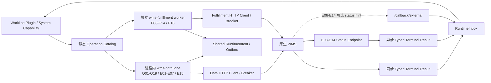
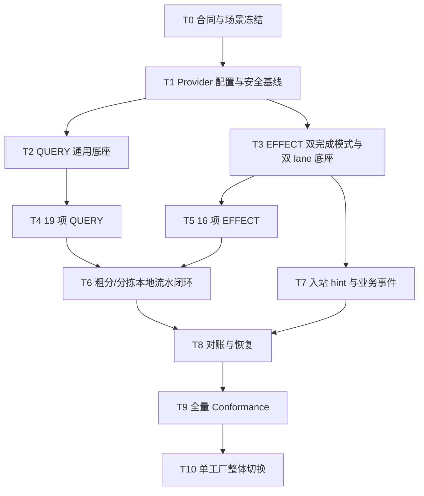

# WMS 全场景配置化接入实施 SPEC

## 1. 文档定位

本文把已评审通过的 WMS/RCS 顶层蓝图收敛为可实施、可验收、可整体切换的工程规格。

本文是旧三 operation 北向合同向 35 operation 全场景合同切换期间的唯一冲突裁决主真源。凡
`docs/business/wms_rcs_interface_requirements.md`、`docs/contracts/wms-northbound-interaction-contract.md`、
现有 typed model、Mock fixture 与本文在 operation 数量、EFFECT 完成模式、认证、E11 资源选择、E12/E13 批次、
callback 或 wire 语义上冲突，均以本文为准。T1 必须一次性更新这些合同资产并删除旧语义；35 项静态 manifest
冻结前，不得启动 T2–T10 的生产实现。

目标工厂的原生 WMS 被假定为**完全兼容本文冻结的标准合同**。部署新工厂时，交付人员只提供 Provider
身份、一个 WMS server 地址、35 个 operation path、超时/SLA 和可选认证配置，不修改 WES 代码、不增加工厂分支，也不部署
Factory WMS Adapter。

本文中的“仅配置即可接入”是指：

1. WES 构建制品包含完整、固定、类型化的 WMS Operation Catalog。
2. 工厂部署只绑定一个 active WMS Provider profile。
3. Profile 只配置一次 `server_url`；每个 operation 配置合同约束的相对 path，启动时编译为绝对 endpoint。
4. 同步 EFFECT 只冻结 submit endpoint；异步 EFFECT 一起冻结 submit/status endpoint。
5. 配置通过启动校验和全量 conformance 后，一次性开放全部业务能力。
6. 配置不能改变字段映射、状态语义、错误分类、幂等规则或业务流程。

## 2. 已确认决策

| 决策项           | 冻结结论                                                                                                                       |
| ------------- | -------------------------------------------------------------------------------------------------------------------------- |
| 接入拓扑          | `wms_integration` 作为 WES 内部 WMS Gateway 子系统，直接连接原生 WMS                                                                     |
| 合同假设          | 对方完全兼容 WES 标准合同，不在 WES 内做工厂字段映射                                                                                            |
| Provider 数量   | 单个 WES 部署只允许一个 active WMS Provider                                                                                         |
| endpoint      | 每个 operation 独立配置，不使用请求期路由                                                                                                 |
| Adapter       | 本阶段不规划、不实现、不部署 Factory WMS Adapter                                                                                         |
| 启用策略          | 新工厂全场景一次性启用；不得以生产流量方式分批开放 operation                                                                                        |
| 安全下限          | 允许完全依赖局域网隔离，应用层认证可为 `NONE`                                                                                                 |
| 安全增强          | 保留可选 `HMAC_SHA256`，但不作为所有工厂上线前提                                                                                            |
| EFFECT 执行模式   | E01–E07/E15/E16 使用同步 typed terminal result；E08–E14 使用 ACK + status，callback 只提示立即查询                                        |
| 部署隔离          | 数据能力在现有 WES 进程内以 `wms-data` 逻辑 lane 执行；仅 `wms-fulfillment` 使用同一构建制品独立部署 worker；两条 lane 隔离 HTTP client、连接池、breaker、限流、预算和指标 |
| 物理事实          | 已发生的本地物理事实永久保留；WMS 拒绝不得伪造物理回滚                                                                                              |
| 本地完成口径        | 设备 result 成功且 WES 原子提交对应物理事实后，本地流程即完成；不为 WMS 同步另建第二套业务完成状态                                                                 |
| 失败处置          | 本地实物已经发生时，WMS 未确认只表示外部同步未完成；复用 EFFECT 状态并按需对对应对象建立 scoped Hold，重试或对账                                                       |
| 资源权威边界        | WES 负责工作线内部料格选择、临时预占和设备执行投影；WMS 负责库存账务、WMS 预留、WMS 管理的仓储储位分配及 RCS 调度                                                        |
| RCS 边界        | WES 只向 WMS 提交搬运/交换需求，WMS 负责 RCS 调度闭环                                                                                       |
| 粗分准入          | WES 将六合一码与测量摘要提交 WMS；WMS 以无副作用 QUERY 返回匹配 GRN 和准入结论                                                                        |
| 粗分准入传输        | Q19 固定为无副作用 POST QUERY；完整六码/测量放 JSON body，evidence 只保留允许摘要与 canonical hash                                                 |
| CTU 边界        | E12 提交冻结成员，E13 提交有界 FIFO 候选并由 WMS ACK 冻结接纳前缀；箱级执行仅发生在 WMS↔CTU 内部，WMS 任务终结后再提示 WES 查询完整结果                                  |
| 扫码平台流水        | 南向取料命令 ACK 后立即下发下一北向取料；取料 result 后执行扫码，WES 根据扫码 result 决策并下发投放命令；正常格/NG 位通过投放参数区分；扫码平台空闲和南北向防呆由机械臂/PLC控制 |
| 工程原则          | 严格遵循 DRY/KISS/SOLID/YAGNI；不保留旧版本、旧配置、旧数据或旧测试兼容路径                                                                           |
| QUERY 缓存      | 本期不做跨请求缓存；单次执行只复用同一 authority snapshot                                                                                     |
| 发布方式          | 停止 admission 后协调冷启动；不建设滚动 revision 协调器                                                                                     |
| 上线前 EFFECT 验收 | 16 项均要求真实 TCP 协议黑盒；不要求在 GO 前完成 E08–E14 七项异步物理任务实机演练                                                                        |
| 外部验收环境责任      | WES 只调用验收 profile 配置的 endpoint；环境/租户隔离、RCS 开关及避免真实物理调度由 WMS 方负责，WES 不建模也不控制                                                        |

### 2.1 `wms_integration` 的 Gateway 含义

`src/app/wms_integration/` 可以理解为 WES 的 WMS Gateway 子系统，但不是通用 API Gateway，也不是业务编排层。
它负责：

- WMS typed Port、wire model 和封闭 outcome。
- Provider endpoint/auth binding 与 HTTP transport。
- 请求/响应规范化、预算、重试、熔断和 evidence。
- 同步数据变更的 typed terminal result 归约。
- 异步调度任务的 ACK/status、入站提示 normalizer 和对账查询。

它不负责：

- Workline 业务决策和跨步骤编排。
- 直接修改 Session、库存主账或设备状态。
- 工厂字段映射、脚本转换或协议适配。
- 运行时选择多个 WMS 或自动切换 endpoint。

依赖方向保持：

```text
API / Runtime Inbox
        ↓
Workline Plugin / System Capability
        ↓
WMS Gateway Port (`src/app/wms_integration`)
        ↓
Provider Transport / Evidence Service
        ↓
Repository
        ↓
Database / Remote WMS
```

`wms_integration` 内部固定分成两条执行 lane：

- `wms-data`：Q01–Q19、E01–E07、E15；在现有 WES API/runtime/Celery 进程内逻辑隔离，返回同步 typed result。
- `wms-fulfillment`：E08–E14、E16；使用独立 Celery queue/worker 部署，E08–E14 使用 ACK/status，E16
  同步返回取消裁决。这里的 `SYNC_RESULT` 表示 WMS 单次调用的完成语义，不表示调用方进程直接阻塞等待。

两条 lane 共用构建制品、operation registry、RuntimeIntent/Outbox/Inbox、evidence、Hold/Reconciliation 和
PostgreSQL，不新增内部 HTTP/RPC、服务发现、第二套消息总线或可靠性账本。QUERY 始终由调用方进程通过 typed
Query Port 直接执行，不经过 Celery/Outbox。EFFECT 由 operation Definition 静态确定 lane：E08–E14/E16 只允许
`wms-fulfillment` 专用 dispatcher claim，E01–E07/E15 只允许 `wms-data` dispatcher claim，非 WMS Outbox
只允许通用 system dispatcher claim。三者复用同一 Engine/Repository 实现，并形成静态、两两互斥的 claim scope：
通用 system dispatcher 排除全部 WMS EFFECT identities，`wms-data` dispatcher 精确包含 E01–E07/E15 且仍运行在
现有通用 Celery worker/queue，`wms-fulfillment` dispatcher 精确包含 E08–E14/E16 并运行在专用 queue/worker。
Provider profile 不得配置或覆盖 lane。通用 Outbox claim scope 接受精确的 include/exclude operation identity 集合，
由 Celery task 装配层从唯一 Operation Registry 派生并注入；SYS Repository 保持领域无关，不反向 import WMS registry，
也不新增可由 Definition 推导的 `execution_lane` 持久化字段。两个 WMS lane 使用独立 HTTP client/连接池、breaker、
并发/限流预算和指标，
`wms-fulfillment` 另有独立 queue/worker/readiness。隔离的是长周期调度任务的执行故障域，不取消业务依赖：
某一步需要另一 lane 结果时只等待对应 RuntimeIntent，不得伪造回滚已发生事实或停止另一 lane 的恢复任务。

即时派发使用瞬时 `OutboxDispatchTarget`（`SYSTEM`、`WMS_DATA`、`WMS_FULFILLMENT`）选择 Celery task：
Outbox preparation 从静态 Operation Definition 派生 target，事务提交后只把本次实际创建 Outbox 的唯一 target 集合
交给 `TaskQueueGateway`，每个 target 最多唤醒一次。target 不进入 Provider profile 或数据库，Gateway 不提供隐式默认值，
各业务入口不得自行比较 operation identity。Beat 独立周期性唤醒三个 scope，仅作为遗漏/重试兜底；不得由 system task
转发 fulfillment task，也不得对每次业务提交无条件广播三个 task。

## 3. 当前状态与目标差距

截至 2026-07-28，当前 active Provider profile 只注册 4 个 operation：

| Operation                               | 模式     | 当前状态                                             |
| --------------------------------------- | ------ | ------------------------------------------------ |
| `wms.inventory.query_inventory@v1`      | QUERY  | 已实现 typed transport、分页、预算、evidence、熔断            |
| `wms.inventory.confirm_inbound@v1`      | EFFECT | 当前为 submit + status；目标改为同步 typed terminal result |
| `wms.fulfillment.full_box_exchange@v1`  | EFFECT | 已实现 typed submit 和 status query                  |
| `wms.fulfillment.notify_pkg_binding@v1` | EFFECT | 当前为 submit + status；目标改为同步 typed terminal result |

当前已有并应复用的基础：

- 单部署唯一 Provider profile 和静态 operation index。
- QUERY 通用执行器、封闭 outcome、有限重试、响应预算和 evidence。
- EFFECT Intent/Outbox、幂等键、冻结 submit binding 和状态确认 worker。
- `ACCEPTED / PROCESSING / COMPLETED / REJECTED / NOT_FOUND` 五态查询合同。
- 状态单调版本、typed terminal result、可见性宽限期和保留期约束。
- 数据库型 circuit breaker、脱敏 evidence 和 conformance/replay 基础。
- `/api/v1/callback/external` 与 RuntimeInbox 接入路径。

当前主要缺口：

| 缺口                                                                     | 目标                                                                    |
| ---------------------------------------------------------------------- | --------------------------------------------------------------------- |
| active operation 只有 4 个                                                | 扩展为 35 个全场景 operation                                                 |
| endpoint 主要由代码共享 base URL 派生                                           | Profile 配置一个 `server_url` 和 35 个合同约束 path                             |
| EFFECT 共用一个 status URL                                                 | E01–E07/E15/E16 只冻结 submit endpoint；E08–E14 冻结 submit/status endpoint |
| operation/auth 合同强制 HMAC，生产强制 HTTPS                                    | 允许 `isolated_lan + NONE + HTTP`                                       |
| EFFECT status parser 写死局部 operation 子集                              | 为 E08–E14 建立静态 status registry；同步 EFFECT 禁止进入 scanner                  |
| Master Data、Document、Transaction、Event、Reconciliation 多为 deferred Port | 建成真实 typed capability                                                 |
| 历史回调可携带终态业务含义                                                          | 异步任务 callback 统一降为 status hint；同步 EFFECT 不注册 status hint              |
| 真实外部 WMS 仍未全量验收                                                        | 建立 35 operation 的全量 conformance 与 GO 门禁                               |

### 3.1 What already exists

本实施复用而不重建：

| 已有能力                                                         | 处理方式                                                               |
| ------------------------------------------------------------ | ------------------------------------------------------------------ |
| QUERY 通用 executor、预算、分页、breaker、evidence                     | 扩展 endpoint 编译与 `NONE` 认证，不复制 per-operation transport              |
| RuntimeIntentLog / SystemOutbox / DispatchAttempt            | 继续作为 EFFECT 唯一双账本与派发路径                                             |
| 五态 EFFECT status worker、scanner、受控重提                         | 仅扩展到 E08–E14；E01–E07/E15/E16 复用 Outbox 原键重放并直接归约 typed result      |
| Provider profile、静态 operation index、conformance manifest     | 扩展为 35 项，禁止另建运行时 catalog                                           |
| Callback / RuntimeInbox admission                            | 替换 WMS 旧执行终态类型，只保留普通事件和 E08–E14 status hint                        |
| Pydantic Settings 与 PyYAML                                   | 使用内建类型化 YAML source，不编写通用配置模板引擎                                    |
| RuntimeCapabilityPlan 与外层数据库工作单元                             | 保持投格事实、同步 Hold、E07/E03 Intent/Outbox 原子准备，不拆成事后补偿流程                |
| DeviceCommand 唯一 `command_code` 与 runtime effect preparation | 复用为南向取料 ACK 因果驱动下一北向命令的 exactly-once 支点                            |
| ConveyorQueueMembership 与 PostgreSQL 行锁能力                    | 扩展 SCAN3 FIFO 字段、E13 candidate lease/accepted membership 和专用部分复合索引 |
| CeleryAsyncRuntime / `run_async`                             | 所有新增 WMS Celery 路径复用每 child 唯一 Runner，不建立 WMS 私有事件循环               |
| ReconciliationCase `decision_json`                           | 继续作为裁决存储，只增加共享 typed resolution 读写边界，不新增表或工作流                      |

## 4. 目标架构



`wms-data` 不是独立应用或部署角色，而是现有 WES 进程内的逻辑执行 lane；`wms-fulfillment` 是同一镜像的独立
Celery worker 部署。两者拥有独立 HTTP client/连接池、breaker、并发预算和指标，履约 lane 另有专用 queue、
worker 和 readiness。每个 WES 进程或 Celery prefork child、每条 lane 恰好拥有一个长期 `httpx.AsyncClient`：
API 由 lifespan 创建/关闭，Celery 由现有 `CeleryAsyncRuntime` 在 child 生命周期内创建/关闭；禁止跨 fork、
跨 event loop 或模块级懒单例共享。共享内核不构成新的内部服务，也不得复制数据库表、消息账本或引入跨进程
QUERY RPC。

### 4.1 唯一调用路径

QUERY：

```text
typed request
→ operation binding
→ configured endpoint
→ bounded HTTP call
→ typed response validation
→ evidence
→ Success / BusinessReject / TechnicalFailure / ContractFailure
```

同步 EFFECT（E01–E07、E15、E16）：

```text
idempotency claim
→ RuntimeIntent / Outbox
→ freeze submit binding
→ submit
→ operation-specific typed terminal result
→ RuntimeInbox
→ Plugin 决策 EFFECT 所属业务完成或下游放行、Hold、Reconciliation
```

异步 EFFECT（E08–E14）：

```text
idempotency claim
→ RuntimeIntent / Outbox
→ freeze submit + status binding
→ submit
→ WmsEffectAck
→ status query
→ operation-specific typed COMPLETED / REJECTED
→ RuntimeInbox
→ Plugin 决策任务完成、Hold、Reconciliation
```

### 4.2 不变量

1. 同一 EFFECT 的所有 submit attempt 必须使用 Intent 中冻结的 endpoint、operation identity、credential reference
   和 binding revision；只有 E08–E14 冻结并使用 status endpoint。
2. 配置热更新只影响新 Intent；在途 Intent 不回查 active profile，不迁移 endpoint。
3. callback 不携带、也不写入业务终态；E08–E14 status hint 只定位既有 EFFECT、持久化 evidence 并唤醒
   通用 status worker。实际 HTTP 查询必须先取得既有 `status_check_lease_token` claim；已被 claim 或已终态时
   本次唤醒 no-op。同步 EFFECT 不注册 status hint。
4. QUERY 不得产生远端业务效果；全部 EFFECT 必须有幂等键。E01–E07/E15/E16 必须同步返回 typed terminal result，
   E08–E14 必须返回 ACK 并具备状态查询能力。
5. WMS 是库存账务、WMS 库存预留/扣减、WMS 管理的仓储储位分配和 RCS 调度的唯一权威；五层货架目标储位等
   WMS 管理位置只能消费 WMS typed result，不得由 WES 推导。
6. WES 是工作线内部料格选择和临时 CellReservation、本地设备动作、执行 evidence、资源关系投影和 RuntimeHold
   的权威；粗分机及分拣机工作位内的目标料格不增加逐件 WMS 授权调用。
7. WMS 拒绝发生在本地物理动作之后时，保留本地事实并进入对账，不做反事实回滚。
8. 粗分准入 QUERY 只能校验并返回结论，不得预留、扣减、绑定或产生其他 WMS 副作用；物理投格后的绑定和入库仍由 E07/E03 完成。
9. E12 在 submit 前冻结精确批次成员；E13 在 submit 前冻结有序 FIFO 候选窗口，实际批次成员由 WMS ACK
   的 `accepted_scope` 冻结，且只能是候选列表的有序前缀。
10. CTU 批次是任务维度，料箱是操作对象维度。WES 只消费批次 ACK、状态查询与 typed terminal result；
    重试和任务终结，料箱状态只由本地 SCAN/设备事实及可信终态结果沿 route instance 单向推进。两者关联但不得互相覆盖。
11. WES 不查询、不维护扫码平台 `FREE/BUSY` 作为调度条件；机械臂/PLC 对单位置扫码平台的互锁和防碰撞负责。
12. 同一本地投格事实产生的 E07/E03 共享 `execution_work_item_id + correlation_id + fact_version`；两项可并行执行。
    每项同步义务只能由对应 RuntimeIntent `COMPLETED`，或明确解决该项义务的已关闭 ReconciliationRecord 满足；
    两项义务均满足后才能解除该料盘的 WMS 同步 Hold，且不得把原 RuntimeIntent 改写为 `COMPLETED`。
13. 料箱位置在同一 `route_instance_id` 内只能沿冻结路线单向前进。晚到、重复的前序设备事件或 WMS 搬运终态只能
    补充 evidence/关闭对应批次预约，不得回退当前投影；不可能的跳转进入对应料箱和位置的 scoped Reconciliation。
    同一料箱完成 E13 后再次被新 E12 投入时创建新的 route instance，不视为旧路线逆行。
14. `completion_mode` 是 operation version 的静态代码合同：E01–E07/E15/E16 固定为 `SYNC_RESULT`，E08–E14
    固定为 `ASYNC_TASK`。Provider profile 不得覆盖或动态选择。
15. `wms-data` 与 `wms-fulfillment` 不得互调实现层；静态 operation Definition 是 lane 归属唯一真源，
    task 装配层必须把精确 identity include/exclude 集合注入通用 claim scope；claim、过期租约恢复、bucket 统计和
    backlog 指标必须使用同一 scope。履约 worker 技术故障不得耗尽数据 lane 的 HTTP 连接、breaker 或并发预算，
    也不得停止数据 lane 已持久化任务的恢复。
16. 同一货架补给需求只能选择一个根 EFFECT：WES 未知具体货架、由 WMS 选架并送达时使用 E08；WES 已知
    `rack_id + source + destination`、只要求搬运时使用 E09。同一 station demand generation 禁止并发创建 E08/E09。
17. SCAN2 的有效工作任务是本地 material-flow work item 与料箱 route instance 的唯一 active 绑定，不等同于后续
    单物料 CellReservation。绑定必须在 SCAN2 路由决策前持久化；流出命令冻结后不得迟到补绑。
18. 满箱交换只允许发生在单层货架已从粗分机移出并由设备 result 提交到 WorkLine manifest 冻结的
    `full_box_exchange_station_code + rack_face`、尚未调度到 STATION A/B 的中间阶段。该阶段同一货架、料箱
    及其占用集合只能由 `FULL_BOX_EXCHANGE`、`STATION_TRANSPORT`、`PIECE_SORTING` 中一个 active flow owner
    持有；E11 未终结或结果不明确时不得把货架推进到分拣机。
19. STATION A/B 的对侧 ready 时必须优先切换对侧；对侧不 ready 时允许选择任一 ready station 维持生产。
    Hold 本身不满足整架完成，物料必须逐件完成、随 E11 箱级完成，或经显式隔离并人工移出后才能退出货架完成屏障。
20. SCAN1 只持久化 NG 标记并使异常料箱旁路工作位流向 SCAN3；SCAN3 对每个经过料箱读取该标记并决定进入
    NG 线或退料线。WES 不推测 NG 线容量、位置预约或人工清退状态；NG 料箱不得进入 E13 候选。
21. Q19 `REJECT` 不得下发进入粗分流水线的正常命令，但必须下发入料机械臂投入 NG 的命令；只有机械臂 result
    成功并提交料盘 NG 位置事实后才释放入口。目标使用 WorkLine manifest 冻结的
    `rough_input_ng_position_code`；修正后重新投料使用新的 handling session/correlation。
22. 扫码平台不是独立执行设备。北向机械臂投放后，WES 依次驱动南向机械臂完成“取料、扫码、投放”三个基础动作；
    本文以 `PICK/SCAN/PUT` 表示动作语义槽位，不冻结硬件 `task_type`、参数名或报文结构。实际命令由硬件厂商合同
    提供；Plugin Definition 只声明三个必需语义槽位及目标设备角色，`WorklinePluginBinding.typed_config_json`
    经插件 `config_model` 校验后，只保存语义槽位对应的厂商 `task_type` 和 timeout、固定目标代码等普通配置值。
    typed 参数投影、request/result model 和 result reducer 由冻结的 Plugin Definition/contract version
    代码持有，不允许配置字段映射模板、表达式或归约 DSL。配置缺失、重复、命令不受该合同版本支持或设备不可达时
    workline 不得 ready；配置不得合并动作或改变本条因果关系。在途命令始终使用激活时冻结的 binding
    identity/version/hash，不回查当前配置。
23. 南向取料命令 ACK 只触发下一北向命令，不提交取料或平台空闲事实；取料 result 提交“南向持料”后创建扫码命令。
    扫码 result 只提交原始扫码结果并触发 WES 决策：校验通过时预约目标格，失败时使用 manifest 冻结的
    `sorter_material_ng_position_code`；两条路径都创建同一“投放”语义命令，并以 typed target 参数区分
    `CELL/NG`。只有投放 result 才能提交物料最终位置。所有 Device Event Push 的 HTTP 响应保持固定 ACK，
    不得携带后续投放动作。
24. 南向取料 ACK 后创建的下一北向命令具有独立 DeviceCommand 生命周期。南向随后失败、超时或结果不明确时，
    只按既有单命令规则收敛该南向命令及其物料，不取消、冻结、Hold 或重解释下一北向命令，也不建设扫码平台
    级联状态、跨命令补偿或物理一致性推断。下一北向命令继续仅由自身 ACK/result 推进；机械臂/PLC 对单位置
    互锁、排队、防碰撞和不可执行命令的处置负责。

## 5. 标准 Operation Catalog

所有 operation identity 固定使用 `wms.<domain>.<action>@v1`。新增或改变 wire 字段、状态含义或错误语义必须发布
新的 operation version，不能通过部署配置改变。

### 5.1 QUERY：19 项

QUERY 默认使用 `GET`；Q19 因请求包含完整六码、测量摘要和 correlation identity，固定使用无副作用 `POST` body。
HTTP method、path/query/body projection 由 operation contract 冻结，配置只提供包含既定 path template 的相对
path，不能改变参数名或 method。库存、预留、任务快照和 drift 对账结果必须携带单调 `source_version`；主数据、GRN
和普通文档查询允许不携带版本，由 WES 保存 canonical response hash、查询时间和 evidence。列表结果必须携带
`items` 和 cursor，cursor 必须绑定同一 Provider 快照，禁止跨版本拼页。

|   # | Operation identity                                | 业务用途              | 蓝图/必要场景               |
| --: | ------------------------------------------------- | ----------------- | --------------------- |
| Q01 | `wms.master_data.get_material@v1`                 | 查询单物料属性           | PKG、尺寸、MSD、高值、路由校验    |
| Q02 | `wms.master_data.list_materials@v1`               | 批量查询物料            | 分箱预计算、波次              |
| Q03 | `wms.master_data.list_zones@v1`                   | 查询区域              | 任务路由、初始化              |
| Q04 | `wms.master_data.list_locations@v1`               | 查询区域地码            | 起止位置与工作站              |
| Q05 | `wms.master_data.get_rack@v1`                     | 查询货架              | 类型、位置、面、容量证据          |
| Q06 | `wms.master_data.list_racks@v1`                   | 按类型/状态查询货架        | 空架、冷热区、退料架            |
| Q07 | `wms.master_data.get_bin@v1`                      | 查询料箱与格位           | 分箱、发料、退料              |
| Q08 | `wms.document.get_grn@v1`                         | 查询 PO 行级 GRN 到货记录 | 收货与 PKG 校验            |
| Q09 | `wms.document.list_grn_packages@v1`               | 查询 GRN 料盘         | 六合一码归属与进度             |
| Q10 | `wms.document.get_pick_order@v1`                  | 查询拣货单             | 自动/人工发料               |
| Q11 | `wms.document.get_outbound_order@v1`              | 查询出库单             | 出库与交付追踪               |
| Q12 | `wms.document.get_wave@v1`                        | 查询波次              | 滚动波次与补料               |
| Q13 | `wms.document.get_task_snapshot@v1`               | 查询 WMS/RCS 任务     | 重启恢复、人工确认             |
| Q14 | `wms.inventory.query_inventory@v1`                | 查询库存权威快照          | 发料、FEFO、可用量           |
| Q15 | `wms.inventory.get_reservation@v1`                | 查询预留状态            | 重启恢复、释放与对账            |
| Q16 | `wms.reconciliation.check_bin_drift@v1`           | 查询料箱 drift        | 料箱/格位对账               |
| Q17 | `wms.reconciliation.check_rack_drift@v1`          | 查询货架 drift        | 位置/面/挂载对账             |
| Q18 | `wms.reconciliation.check_full_drift@v1`          | 查询全量 drift        | 切换前、事故后全量对账           |
| Q19 | `wms.document.validate_rough_sorter_admission@v1` | 粗分机 GRN 与测量准入     | 六合一码、GRN 归属、卷盘直径/厚度校验 |

GRN 本身就是 WMS 从 SAP 获取的一条 PO 行到货记录，不存在 GRN header → item 的第二层行明细：

- `get_grn` 直接返回 `grn_id`、`po_number`、`po_item`、`material_code`、计划/已收/剩余数量、批次和质检状态。
- 一个 GRN 可以关联多个实收料盘，因此 `list_grn_packages` 保留。
- 删除 `WmsGrnItem`、`list_grn_items`、`item_count` 及其测试，不保留兼容 alias。

Q19 是独立、无副作用的 `POST` QUERY，不能塞入 Q08/Q09，也不能在 WMS 侧产生绑定、预留、扣减或收货进度变更。
它的 typed request 必须冻结：

- `raw_code` 与 canonical `six_in_one`：`HHPN`、`MfrPN`、`Qty`、`DateCode`、`LotCode`、`PkgID`。
- 测量摘要：decimal string `reel_diameter_mm`、`reel_thickness_mm`。
- `station_code`、`workline_id`、`session_id`、`correlation_id`。

typed result 必须冻结：

- `decision=ADMIT|REJECT`。
- 匹配身份：`grn_id`、`po_number`、`po_item`、`material_code`、`pkg_id`。
- WMS 校对结果：`measurement_decision=PASS|REJECT`、decimal string 标准值/容差、`rule_version`。
- `source_version`；WES 以其冻结本次 admission evidence，replay 不重新查询并改写首次结论。
- `REJECT` 时必须返回闭集 reason code：`GRN_NOT_FOUND`、`PACKAGE_NOT_FOUND`、`PACKAGE_GRN_MISMATCH`、
  `MATERIAL_MISMATCH`、`QUANTITY_MISMATCH`、`MEASUREMENT_OUT_OF_TOLERANCE`、`PACKAGE_NOT_ADMISSIBLE`。

WES 必须在下发后续设备命令前，把 Q19 首次有效结果持久化为粗分业务准入事实。该事实复用
`RoughSorterContext` 和 typed `RoughSorterInventoryAdmissionDecision`，至少包含 request canonical hash、
decision/reason、匹配 GRN/PO/物料/PKG 身份、测量结论、`rule_version/source_version` 和 evidence reference；
不得另建通用 QUERY 结果表，也不得继续以无约束 `dict[str, Any]` 作为领域读取接口。进程崩溃或消息 replay
必须复用已落库结论，不得因 WMS 当前数据变化重新改写首次准入决定。

Q19 `ADMIT` 只允许 WES进入后续设备流程，不代表 WMS 已完成 PKG 绑定或入库。出料机械臂物理投格成功后，
WES仍必须通过 E07 和 E03 完成绑定与库存确认。

QUERY 通用合同：

- 请求/结果模型必须由 `wms_integration.ports` 拥有，`extra="forbid"`。
- 通用 QUERY executor 必须按 operation contract 发送 `GET params` 或 `POST JSON body`，不得按 operation identity
  分支；`POST` 只改变 wire projection，不改变 QUERY 的无副作用、重试和 evidence 语义。
- 列表类 QUERY 必须声明 cursor、items 字段、最大页数和最大行数。
- 总 deadline 覆盖全部 attempts、分页和 backoff；默认基线为 10 秒、最多 3 次。
- 只对网络错误、超时、429 和明确可重试 5xx 重试。
- 业务拒绝、4xx 参数错误、畸形响应、预算超限不得重试。
- 本期不实现跨请求缓存、TTL、失效事件或并发合并；单次 execution 只查询一次并复用同一 authority snapshot。
- GO 前从目标工厂 workload envelope 验证实际 QPS、Provider latency、429 和结果规模；未来若数据证明需要缓存，
  再单独评审缓存 ADR。

### 5.2 EFFECT：16 项

所有 EFFECT，包括释放库存预留，统一使用 `POST`。请求必须包含 WES `dispatch_key` 和 operation-specific 业务身份；
结果必须回显 `dispatch_key`、原业务身份、WMS `provider_reference` 与 `source_version`，使 WES 能拒绝串单结果。
`completion_mode` 属于静态 Definition，不允许 Provider profile 覆盖。

|   # | Operation identity                                | completion\_mode / lane         | 业务用途                         | 关键结果                                        |
| --: | ------------------------------------------------- | ------------------------------- | ---------------------------- | ------------------------------------------- |
| E01 | `wms.inventory.reserve_inventory@v1`              | `SYNC_RESULT / wms-data`        | 发料前预留                        | reservation reference、expiry、source version |
| E02 | `wms.inventory.release_reservation@v1`            | `SYNC_RESULT / wms-data`        | 完成/取消/失败后释放；替代蓝图中的 DELETE 接口 | release reference、最终预留状态                    |
| E03 | `wms.inventory.confirm_inbound@v1`                | `SYNC_RESULT / wms-data`        | 正常入库确认                       | WMS 单据/库存版本                                 |
| E04 | `wms.inventory.confirm_outbound@v1`               | `SYNC_RESULT / wms-data`        | 发料/出库确认                      | issue/outbound reference                    |
| E05 | `wms.inventory.transfer_inventory@v1`             | `SYNC_RESULT / wms-data`        | 库存账务转移；不得隐式调度物理搬运            | transfer reference                          |
| E06 | `wms.inventory.confirm_return_putaway@v1`         | `SYNC_RESULT / wms-data`        | 退料检测后回库确认                    | return reference、新 PKG、库存版本                 |
| E07 | `wms.fulfillment.notify_pkg_binding@v1`           | `SYNC_RESULT / wms-data`        | PKG 与箱/格/架绑定通知               | binding reference                           |
| E08 | `wms.fulfillment.request_rack_supply@v1`          | `ASYNC_TASK / wms-fulfillment`  | 空架/退料架补给                     | WMS/RCS task reference、到位结果                 |
| E09 | `wms.fulfillment.request_rack_transport@v1`       | `ASYNC_TASK / wms-fulfillment`  | 货架搬运                         | 起点、终点、最终位置                                  |
| E10 | `wms.fulfillment.change_rack_face@v1`             | `ASYNC_TASK / wms-fulfillment`  | A/B 面切换                      | 授权面、最终面                                     |
| E11 | `wms.fulfillment.full_box_exchange@v1`            | `ASYNC_TASK / wms-fulfillment`  | 满箱/空箱交换                      | 交换后关系、箱内物料确认、WMS inventory version          |
| E12 | `wms.fulfillment.move_bins_to_conveyor_entry@v1`  | `ASYNC_TASK / wms-fulfillment`  | CTU 批量投箱到流水线入口               | 完整批次成员、逐箱最终位置、task outcome                  |
| E13 | `wms.fulfillment.move_bins_from_conveyor_exit@v1` | `ASYNC_TASK / wms-fulfillment`  | CTU 批量从退料线回架                 | 完整批次成员、逐箱最终储位、task outcome                  |
| E14 | `wms.fulfillment.request_load_unit_transport@v1`  | `ASYNC_TASK / wms-fulfillment`  | 栈板、Magazine 等非货架载具搬运         | 载具类型、最终位置                                   |
| E15 | `wms.fulfillment.publish_manual_task@v1`          | `SYNC_RESULT / wms-data`        | 向 WMS/PDA 发布人工降级任务           | manual task reference、发布状态                  |
| E16 | `wms.fulfillment.cancel_request@v1`               | `SYNC_RESULT / wms-fulfillment` | 取消尚未终结的搬运/交换/人工任务            | `CANCELLED/ALREADY_TERMINAL/TOO_LATE`       |

E05 只表达 WMS 库存账务转移；需要货架、料箱、栈板或 Magazine 发生物理移动时，必须另行使用 E09 或 E14，
不得在 E05 实现中隐式调度 RCS。

E15 的同步终态只证明人工任务已持久化发布并返回 `manual_task_reference`，不表示人工操作完成。人工执行结果由
`WMS_PDA_OPERATION_RECORDED` 及对应库存 EFFECT 表达，不为 E15 建立 status scanner。

E16 同步返回取消裁决。只有 `CANCELLED` 才表示 WMS 已持久化保证原任务不会再产生新的物理动作；
`ALREADY_TERMINAL` 与 `TOO_LATE` 不回滚任何事实，WES 继续以原 E08–E14 任务 status 和已观察物理 evidence 收敛。

E08 同一工作位的补架需求必须合并，禁止并发物料重复调度 AGV：

- 业务身份固定为 `station_code + rack_type + demand_generation`。
- 同一 `station_code + rack_type` 同时最多一个 active demand；后续对象复用该 fulfillment 并各自等待。
- active demand 必须由 PostgreSQL 可验证的唯一约束和原子 get-or-create 维护；不得依赖 service 先查后写、
  单 worker 或进程内锁。首次尚无记录时的并发创建也必须只有一个事务成功创建，其余事务复用胜出的 demand。
- terminal result 必须返回实际 `rack_id`、最终 `station_code`、到位关系和 `source_version`。
- 只有上一 demand 已终结且 active projection 仍证明资源不足时，才能递增 `demand_generation` 创建下一请求。
- E08 自身已经表达“由 WMS 选择货架并送达工作位”，WES 不得在同一 demand generation 下再创建 E09。
- 只有 WES 已持有确定 `rack_id`、确定源位置和确定目标工作位，且该货架未被其他 active flow owner 占用时，
  才直接创建 E09；E08 与 E09 的选择、active demand 和 flow ownership 必须在同一数据库事务中冻结。

E11 必须以一个满箱交换需求为最小物理单元，并且只能在单层货架从粗分机移出的设备 result 已把货架提交到
manifest 冻结的 `full_box_exchange_station_code + rack_face`、该货架不再有粗分 CellReservation/在途设备命令、
且尚未创建进入 STATION A/B 的搬运任务后触发阈值检查。请求只冻结 WES 权威的交换工作位、单层货架/货架面、
达到阈值的满箱、原储位、箱内
`BinCellOccupancy` 集合和交换约束，不携带由 WES 选择的五层货架空箱或目标储位。WMS 原子选择并预留空箱、
满箱目标储位和空箱回补储位；terminal typed result 必须返回 WMS 选中的空箱、满箱新储位、空箱新储位、两组最终
`rack-bin-slot` 关系、`task_outcome` 和 `inventory_source_version`。WES 不为 WMS 管理的空箱或五层目标储位建立
本地授权锁，只按 terminal result 收敛投影。已完成箱级入库的物料不得再次进入分拣机逐件流程，未满箱物料继续保留
在单层货架流程。

创建 E11 前必须在一个短数据库事务中锁定处于上述中间阶段的候选货架、满箱及其冻结占用集合，并取得
`active_flow_owner=FULL_BOX_EXCHANGE`。如果同一资源已由 `STATION_TRANSPORT`、`PIECE_SORTING` 或另一 E11
持有，则本次不创建 Intent；反向地，E09 入站搬运和北向机械臂创建取料命令前也必须拒绝
`FULL_BOX_EXCHANGE` owner。owner 与 E11 Intent/Outbox 同事务准备，终态收敛或明确对账关闭后才按事实释放；
ACK 不明确、部分失败或未知位置期间不得释放后让逐件流程接管。

阈值检查无命中时可直接把该单层货架推进到 STATION 调度；有命中时必须等待全部 E11 终结。成功交换后，原满箱
及其冻结物料按 WMS 返回关系进入五层货架并完成箱级入库，换入单层货架的空箱按返回的 `rack-bin-slot` 关系重建空格
投影；随后该单层货架才能进入 STATION A/B，且逐件分拣只选择剩余未满箱物料。E11 拒绝、部分失败或结果不明确时
不得将该货架推进到 STATION，必须保持精确 Hold/对账。

E11 本地收敛必须保持批次持久化边界：按冻结 object/cell identity 一次或按冻结上限有界分块加载全部物料、
occupancy 和 mount，在内存中校验集合完全一致后，于一个事务内更新并统一 flush。允许为每个物料生成独立审计
event/evidence，但不得在循环内重新查询物料、occupancy、mount 或逐对象 commit。

E12/E13 是批次 EFFECT，不允许退化为 WES 逐箱调用：

- WorkLine manifest 冻结正整数 `ctu_basket_capacity`；上线 conformance 必须由 WMS/设备 owner 确认不超过现场 CTU
  实际容量。
- E12 数量固定为 `min(已预约入口空位数, ctu_basket_capacity, 可用料箱数)`，submit 前冻结精确成员。
- submit 前冻结 `batch_id`、方向、起止工作位、容量 snapshot version，以及有序
  `items[{sequence_no, route_instance_id, bin_id, source_rack_id, source_slot_id, reserved_queue_position}]`。E12 为每个
  料箱创建新的 `route_instance_id`；E13 候选必须沿用 SCAN3 退料队列中已有的 route instance，不得重新生成或按
  E12 顺序推导。
- E12 的入口位置由 WES 提交前预约，使 SCAN1 在 CTU 批次尚未终结时也能用冻结的 `bin_id` 集合完成授权校验。
- E13 的候选集合只来源于 SCAN3 路由完成后维护的退料线队列；不得按 E12 的批次成员、`sequence_no` 或投料顺序推导
  E13 候选顺序。稳定并列键固定为 `scan3_enqueued_at + queue_position + bin_id`。
- E13 operation binding 必须配置正整数 `max_candidate_count`。WES 每次只选择 FIFO 队首的有界候选窗口，且上线
  conformance 必须证明该值不小于现场 CTU 最大背篓容量；不得把整个积压队列放入一次 HTTP 请求。
- E13 scheduler 必须在一个短数据库事务中，以 `FOR UPDATE SKIP LOCKED` 等价语义跳过其他 worker 已占用候选，
  持久化 `batch_id/idempotency_key/candidate_items/candidate_digest/source queue position/lease` 后立即提交，
  不得跨 HTTP 持有行锁。同一料箱和源队列位置同时最多属于一个未终结或 ACK 不明确的 E13 提交。
- WMS 按 `min(候选料箱数, 当前工作线上五层货架工作面已空储位数, CTU 背篓容量)` 选择实际批次成员。ACK
  `accepted_scope.object_keys` 必须是候选列表的有序前缀；WMS 随后为每个已接纳料箱一对一分配储位并指派 CTU。
  未接纳候选立即解除本次提交占用并继续留在 E13 队列；接纳数为 0 时返回稳定业务拒绝码
  `NO_DESTINATION_CAPACITY`，不创建空任务。
- WES 不查询、不选择、不预留 E13 的五层货架目标储位。WMS 在任务创建时原子校验并预留目标容量，具体
  `final_rack_id/final_slot_id` 在 terminal result 中逐箱返回。
- E13 候选查询必须有一个与过滤和稳定 FIFO 排序一致的 PostgreSQL 部分复合索引：以前缀
  `workline_id + queue_code` 定位退料队列，后接 `scan3_enqueued_at + queue_position + bin_id`，且只包含 active、
  尚未加入 E13 active/ACK-unknown 提交的候选记录。具体列名随最终模型冻结，但不得退化为单列索引拼接假设。
- E13 由退料线队列变化、前一提交 ACK/终态和租约恢复独立驱动；不得要求等待某个 E12 批次结束，也不得依赖 WES
  的五层货架空储位投影触发。
- E12 必须整批接受或在任何物理动作发生前整批 `REJECTED`；E13 只允许通过 ACK 的有序前缀缩小候选窗口，ACK
  冻结实际成员后不得静默增删、替换或重排。
- WMS↔CTU 自行处理箱级取放、内部阶段和恢复。WES 只消费批次级权威结果，也不在任务执行中推断实时位置。
- CTU 批次任务状态与料箱对象位置是两个投影。批次保持 `ACCEPTED/PROCESSING` 时，本地 SCAN 事实仍可推进料箱
  route instance；批次终态只能补充任务 evidence、关闭占用和填充尚未知的最终事实，不得覆盖更后的本地路线节点。
- terminal typed result 必须回显 `batch_id`、ACK 冻结成员和
  `items[{sequence_no, route_instance_id, bin_id, item_outcome, final_rack_id, final_slot_id, final_queue_position}]`，不得只返回父任务成功。
- terminal result 的 `task_outcome` 闭集为 `SUCCESS|PARTIAL_FAILURE|FAILED_AFTER_EXECUTION`。部分或执行后失败必须
  给出每个成员最终事实；未知位置使用 `item_outcome=UNKNOWN` 并使 WES冻结该料箱及相关位置进入对账。
- 若 ACK 丢失或 WES 在 ACK 落库前崩溃，候选集合中的本地物理事件仍可先行落库，批次保持
  `ACK_UNKNOWN/PROCESSING`。WES 必须以原幂等键重放提交；返回的 `accepted_scope` 必须包含所有已观察到物理动作的
  候选且 digest 一致，否则进入批次级 `AmbiguousEffect` 对账，不回滚料箱路线。
- E13 ACK 收敛必须在一个短数据库事务中完成：锁定提交记录和候选 lease，校验 `candidate_digest`、有序前缀及
  已观察物理事实，持久化 ACK/`provider_reference`/`accepted_scope`，将接纳项提升为不可变任务成员，并释放
  未接纳项 lease。事务失败必须整体回滚并继续用原幂等键重放；状态查询只能在该事务提交后触发。

EFFECT 通用合同：

- 每项必须声明 operation-specific request/result model、稳定拒绝码集合，以及代码级不可配置的
  `completion_mode=SYNC_RESULT|ASYNC_TASK`。
- HTTP submit 只发送 typed 业务 payload；operation identity 和 idempotency key 使用标准 header。
- WMS 以 `operation_identity + idempotency_key` 原子幂等；同 key 同 fingerprint 返回原请求状态/结果，同 key 不同
  fingerprint 返回 `422 + IDEMPOTENCY_CONFLICT`。
- 未知 HTTP status、稳定码或二者组合一律 fail closed，不得靠 HTTP status 猜测受理或完成。
- 16 项都复用 RuntimeIntent/Outbox、frozen binding、evidence 与对账内核，但按照静态 completion mode 进入两条互斥的
  完成路径；Profile 不得覆盖 completion mode。

`SYNC_RESULT` 合同仅适用于 E01–E07、E15、E16：

- 首次成功或同 key 同 fingerprint 重放成功，必须直接返回 operation-specific typed terminal result；校验通过后直接
  归约 RuntimeIntent 终态并投递 RuntimeInbox。
- 不使用 `WmsEffectAck`、`WmsAcceptedScope`、status endpoint、status scanner 或
  `WMS_EFFECT_STATUS_HINT`，不得为了形式统一把同步结果包装成伪任务。
- submit timeout、连接中断或响应丢失时，保持原 key、payload、fingerprint 和 frozen binding 重放同一 submit；不得
  创建新业务请求，也不得转入异步 status 查询。
- `409 + IDEMPOTENCY_REQUEST_IN_PROGRESS` 只表示原同步请求仍在处理。WES 按同步 transport 重试预算和退避再次提交
  同一请求；它不是 ACK，也不得推进 RuntimeIntent。
- 稳定业务拒绝直接返回 operation-specific typed reject；`422 + IDEMPOTENCY_CONFLICT` 为不可重试
  `ContractFailure`。超过重试/恢复预算仍无 terminal result 时进入 `UNKNOWN/RECONCILING`。
- E16 的 typed terminal disposition 闭集为 `CANCELLED|ALREADY_TERMINAL|TOO_LATE`。只有 `CANCELLED`
  保证 WMS 不再发起新的物理动作；后两者不改写原任务，WES继续以原 E08–E14 status 和物理 evidence 收敛。

`ASYNC_TASK` 合同仅适用于 E08–E14：

- 七项共用 `WmsEffectAck`。严格响应判别矩阵为：
  - `202` 只表示首次受理，归一为 ACK。
  - `409` 只有稳定码为 `IDEMPOTENCY_REQUEST_IN_PROGRESS`，且返回身份与 frozen request 一致时才归一为重放 ACK。
  - `200` 只有同 key、同 fingerprint 的既有请求重放才能归一为 ACK；即使远端任务已完成，submit 也不得携带或采纳
    operation-specific terminal result。
  - `422 + IDEMPOTENCY_CONFLICT` 是不可重试的合同冲突，立即进入 `ContractFailure`/精确对账，绝不能归一为 ACK。
    ACK 至少包含 `operation_identity`、`idempotency_key`、`provider_reference` 和 `submission_state`，且不得直接完成
    RuntimeIntent。
- 批量任务可在同一 ACK 外壳中携带不可变 typed `WmsAcceptedScope(object_keys, scope_digest)`；它只确认任务成员，
  不表示任务成功。共享模型校验字段形状、非空、无重复和 digest 格式；operation-specific validator 校验候选身份、
  canonical digest 与成员规则。E13 必须返回该字段，且 `object_keys` 必须是请求候选列表的有序前缀。不得为单项
  EFFECT 复制独立 ACK 模型或从 submit 响应采纳 operation-specific terminal result。
- submit timeout 或连接中断属于结果不明确，先查询状态，不得直接创建新业务请求。
- 只有“从未观察到可见状态、超过 NOT\_FOUND grace、保持原 key/payload/frozen binding”时允许一次受控重提。
- 观察过可见状态后再次 `NOT_FOUND`，立即进入 `AmbiguousEffect` 对账。
- `COMPLETED` 必须带 operation-specific typed result；`REJECTED` 必须带冻结的 reason code。
- Fulfillment `REJECTED` 只允许表示物理执行尚未开始；一旦可能发生物理动作，WMS 必须保持 `PROCESSING` 完成内部恢复，
  或以 `COMPLETED` 返回 `SUCCESS|PARTIAL_FAILURE|FAILED_AFTER_EXECUTION` typed result。这里的 `COMPLETED`
  表示 WMS 不再继续执行该任务，不等于 WES 业务成功。
- 任一批次成员已有 SCAN、设备 result 或其他不可逆物理事实后，晚到的 WMS `REJECTED` 是合同矛盾，不走普通业务
  拒绝路径。WES 保留任务与料箱两类事实，将 RuntimeIntent 标记为 `AmbiguousEffect/RECONCILING`，只冻结受影响
  批次、料箱和位置并创建 ReconciliationRecord；不得回滚路线或把任务自动改写为成功。

### 5.3 异步 EFFECT 状态协议

状态查询仅是 E08–E14 共用的**协议能力**，不计入 35 项业务 operation。Profile 只配置一次
`effect_status_path`；启动时只为 E08–E14 分别冻结由 `server_url + submit_path/effect_status_path` 编译出的
submit/status 绝对 endpoint。E01–E07、E15、E16 只能冻结 submit endpoint，启动门禁必须拒绝为其创建 status
binding、scanner 记录或 hint 路由。

状态闭集：

| 状态           | 终态   | WES 处理                                                   |
| ------------ | ---- | -------------------------------------------------------- |
| `ACCEPTED`   | 否    | 保持等待，按退避继续查询                                             |
| `PROCESSING` | 否    | 保持等待，记录单调版本                                              |
| `COMPLETED`  | 是    | 校验 typed result、关联键和版本后投递 RuntimeInbox                   |
| `REJECTED`   | 是    | 无物理事实时进入业务拒绝路径；已有不可逆物理事实时转 `AmbiguousEffect/RECONCILING` |
| `NOT_FOUND`  | 否/异常 | 宽限期内重查；越界后按可见历史决定受控重提或对账                                 |

状态名称必须带所属层解释，禁止把下列三层合并成一套枚举：

| 所属层                       | 精确状态闭集                                                                                  | 责任与映射                                                                    |
| ------------------------- | --------------------------------------------------------------------------------------- | ------------------------------------------------------------------------ |
| WMS async status snapshot | `ACCEPTED / PROCESSING / COMPLETED / REJECTED / NOT_FOUND`                              | 仅描述 E08–E14 远端任务可见状态；由 status service 校验后归约到 RuntimeIntent               |
| WES RuntimeIntent         | `PROPOSED / ACCEPTED / COMPLETED / REJECTED / TECHNICAL_FAILED / UNKNOWN / RECONCILING` | 表达 WES 对 EFFECT 的语义判断、技术失败和对账过程；不得新增 `PENDING`、`PROCESSING` 或泛化 `FAILED` |
| 粗分本地流程                    | 现有唯一 `COMPLETED` 及现有非终态                                                                 | 只由设备 result 与本地物理事实推进；WMS 同步不得新增第二套粗分完成状态                                |

同步 EFFECT 的有效 typed response 直接映射 RuntimeIntent 终态，不生成 WMS status snapshot。异步 WMS
`PROCESSING` 只更新远端 snapshot 和下一次查询计划，不要求 RuntimeIntent 增加同名状态。WMS
`NOT_FOUND` 经可见性宽限和历史判断后，映射为保持当前状态、受控重提，或 RuntimeIntent
`UNKNOWN/RECONCILING`；不得映射为业务 `REJECTED`。WMS `COMPLETED/REJECTED` 只有经过 identity、版本、
typed result/reason 校验后，才能归约为对应 RuntimeIntent 终态。

所有可见状态必须包含：

- `provider_reference`
- offset-aware UTC `updated_at`
- 单调递增 `source_version`

只有 `COMPLETED` 可包含 `result_payload`，只有 `REJECTED` 可包含 `reason_code`。

## 6. 入站合同

### 6.1 普通业务事件

下列事件进入 `/api/v1/callback/event`，落原始日志和 RuntimeInbox 后立即 ACK：

| Event type                   | 用途                    | 是否可完成 EFFECT |
| ---------------------------- | --------------------- | ------------ |
| `WMS_GRN_RECEIVED`           | 新 GRN/收货事实通知          | 否            |
| `WMS_PALLET_ARRIVED`         | WMS 主导流程中的栈板到达通知      | 否            |
| `WMS_INVENTORY_UPDATED`      | 提示触发按需重读或 drift query | 否            |
| `WMS_PDA_OPERATION_RECORDED` | 人工/PDA 操作结果与证据        | 否            |

普通事件包络必须包含 `source_system`、`source_event_id`、`source_version`、`occurred_at` 和 `request_id`；
能关联既有业务链路时还必须包含 `correlation_id`。业务字段由 event-specific model 校验。

`WMS_GRN_RECEIVED` 的业务身份是 `grn_id + po_number + po_item + material_code`，不得包含虚构的
`item_count` 或 `items[]`。

入站幂等键为 `source_system + source_event_id`。重复同 hash 返回成功且不重复消费；同键异 hash 进入冲突审计。

### 6.2 异步 EFFECT 状态提示

`WMS_EFFECT_STATUS_HINT` 仅供 E08–E14 使用，进入 `/api/v1/callback/external`，只允许以下关联字段：

- `operation_identity`
- `idempotency_key`
- `dispatch_key`
- `source_event_id`
- `occurred_at`

`source_event_id` 表示一次逻辑提示的稳定身份：同一次提示的网络重试必须复用相同 ID 和相同 payload；同一 EFFECT
后续产生的不同提示必须使用不同 ID。重复同 hash 只触发一次查询，同键异 hash 进入冲突审计；不得用 EFFECT
`idempotency_key` 代替所有提示的事件 ID，也不得由 WES 在接收时生成随机 ID。

接收成功后只做两件事：持久化 hint evidence、唤醒通用 status worker。hint 唤醒与周期 scanner 必须进入同一
status claim 路径；只有成功取得对应 RuntimeIntent 的既有 `status_check_lease_token` 才能执行 HTTP status query，
已被其他 worker claim 或已终态时直接 no-op。不同 hint 不增加 debounce/coalescing 状态、缓存、时间窗口或新表；
scanner 仍是 callback 丢失时的兜底。

顶层蓝图中已删除的执行终态事件，在目标合同中由对应 EFFECT 的 typed status result 取代。
不得保留一条能直接完成 Session 的平行入口。

CTU 箱级动作和内部阶段是 WMS/RCS 实现细节，不进入 WES event 合同。E12/E13 整个批次终结后，WMS只发送
`WMS_EFFECT_STATUS_HINT`；WES随后查询 typed terminal result，并一次消费完整 `items[]` 更新资源关系投影。
即使 status hint 丢失，scanner 仍必须能够取回同一结果。

### 6.3 Callback 层边界

Callback API 只负责：

1. 包络和接入策略校验。
2. 原始 payload 有界落库与幂等。
3. 写 RuntimeInbox。
4. 快速 ACK。

它不得直接改 Session、资源投影、库存 evidence 结论或业务状态。

## 7. 全业务场景覆盖

| 业务场景               | 需要的 QUERY              | 需要的 EFFECT/事件              | 本地流程完成                                          | 端到端闭环/下游放行                                                |
| ------------------ | ---------------------- | -------------------------- | ----------------------------------------------- | --------------------------------------------------------- |
| 收货/GRN 校验          | Q01、Q02、Q08–Q09、Q19    | `WMS_GRN_RECEIVED`、E03     | Q19 准入 evidence 已持久化并形成确定结论                     | 需要入库时 E03 已确认                                             |
| 栈板到达与分流            | Q01、Q03、Q04、Q08        | `WMS_PALLET_ARRIVED`、E14   | 本地到达/分流事实已提交                                    | WMS 返回并校验最终位置                                             |
| SMT 智能装箱/粗分机入库     | Q01、Q05–Q09、Q19        | E03、E07、E08 或 E09          | 出料机械臂 result 成功且投格物理事实原子提交，粗分流程标记唯一 `COMPLETED` | E07/E03 同步屏障完成；互斥选择的 E08 或 E09 补架任务已收敛且 scoped Hold 解除 |
| 混合入库/分拣机入库         | Q05–Q07、Q14            | E03、E07–E13                | 对应设备 result 与本地物理事实已原子提交                        | 批次搬运/交换 typed 终态和 WMS 库存确认均收敛，相关 Hold 解除                  |
| 自动发料               | Q10–Q15                | E01、E04、E09、E12、E13        | 设备取料物理事实已提交                                     | E04 为 RuntimeIntent `COMPLETED`，搬运任务和资源投影已收敛              |
| 特殊料/人工发料           | Q01、Q10–Q15            | E01、E04、E14、E15、PDA event  | PDA/本地操作 evidence 已提交                           | WMS 出库确认和相关搬运终态均收敛                                        |
| 生产退料               | Q01、Q05–Q07、Q15        | E06、E08–E10、E15、PDA event  | 检测、贴标及本地回收事实已提交                                 | E06 为 RuntimeIntent `COMPLETED`，相关补架/搬运任务已收敛              |
| 机构件/栈板/Magazine 搬运 | Q03、Q04、Q13            | E14                        | 本地搬运需求及关联事实已提交                                  | WMS/RCS typed final position 已校验并投影                       |
| 空架/空栈板回流           | Q05、Q06、Q13            | E08、E09、E14                | 本地回流需求及资源冻结已提交                                  | WMS/RCS typed terminal result 已校验并投影                      |
| 人工降级               | Q01、Q05–Q15            | E15、PDA event、对应库存 EFFECT  | 人工事实 evidence 已提交                               | WMS 账务确认完成且相关 Hold 解除                                     |
| 取消、超时与重启恢复         | Q13、Q15、E08–E14 status | E16、E08–E14 status hint 可选 | 本地取消意图或恢复检查点已持久化                                | E16 同步裁决后继续收敛原异步任务；重启后同步原键重放、异步沿 frozen status binding 收敛 |
| 差异对账               | Q16–Q18                | 无新业务 effect                | 差异和 evidence 已持久化                               | ReconciliationRecord 有证据地关闭并按 scope 解除 Hold               |

### 7.1 粗分机入库

| 业务步骤         | WES 本地责任                                                                                               | WMS 合同          | 释放/完成条件                                                        |
| ------------ | ------------------------------------------------------------------------------------------------------ | --------------- | -------------------------------------------------------------- |
| 入口感应、扫码和测量   | RuntimeInbox 接收设备事实，归一六合一码和卷盘测量摘要                                                                      | 无               | evidence 持久化后进入准入                                              |
| GRN 与测量准入    | 冻结 Q19 request/evidence；`ADMIT` 进入正常流程，`REJECT` 只允许准备入料机械臂 NG 命令                              | Q19             | typed 决策已持久化，且只下发与决策匹配的机械臂命令                                  |
| 入料机械臂投入 NG | Q19 `REJECT` 后向 manifest 冻结的 `rough_input_ng_position_code` 下发 NG 指令，关联同一料盘/session；不得伪造正常粗分到位 | 无               | 机械臂 result 成功后提交料盘 NG 位置并释放入口；修正后重投使用新 session/correlation |
| 入料机械臂移入粗分流水线 | 设备命令、ACK、result correlation                                                                            | 无               | 入料机械臂 result 成功后即可处理下一料盘，同时下发粗分流水线命令                           |
| 粗分流水线移至出料口   | 设备命令和物理到位事实                                                                                            | 无               | 流水线 result 成功后释放该设备并进入出料分配                                     |
| 出料位资源不足      | 合并同工作位 active demand，只 Hold 当前出料对象并按缓冲容量反压；未知具体货架用 E08，已知确定货架/起止位置才用 E09，同一 demand 二选一             | Q05–Q07、E08 或 E09 | 货架到位 typed result 与本地投影一致                                      |
| 计算并预约目标料格    | WES按六合一码和当前投影选择格位，创建唯一 CellReservation                                                                 | 无               | 预约成功且未被竞争占用                                                    |
| 出料机械臂投格      | 设备命令和投格物理事实                                                                                            | 无               | result 成功并原子消费预约、更新物料/料箱/料格投影后，粗分流程统一标记 `COMPLETED`            |
| WMS 同步       | 复用 Intent/Outbox 并行执行；按同一 work item、correlation 和 fact version 关联，失败时保留粗分完成事实并进入同步 Hold/Reconciliation | E07、E03         | E07/E03 两项同步义务分别由对应 `COMPLETED` 或明确解决该义务的已关闭对账满足；两项均满足后解除 Hold |

粗分机采用对象级流水，不用单个料盘的全流程 Session 作为整线锁。入料机械臂、粗分流水线和出料机械臂分别在当前
对象的本设备 result 成功后释放；料盘 N 尚未完成投格时，入料机械臂可处理料盘 N+1。

粗分业务只维护一个 `COMPLETED` 口径，不新增 `ROUGH_PHYSICAL_COMPLETED`、`ROUGH_BUSINESS_COMPLETED` 等平行状态。
E07/E03 使用 RuntimeIntent 的精确状态闭集表达；`PROPOSED/ACCEPTED/TECHNICAL_FAILED/UNKNOWN/RECONCILING/REJECTED`
本身均不得放行。material-flow capability 复用 RuntimeIntentLog 已有 `execution_work_item_id`、`correlation_id`、
`fact_version` 和 `capability_key`，分别维护 E07、E03 两项固定同步义务：对应 RuntimeIntent `COMPLETED`，或一个
已关闭且明确声明解决该 `operation_identity + fact_version` 义务的 ReconciliationRecord，才能满足该项。对账不得
反向改写原 RuntimeIntent 终态；两项义务均满足后只解除一次 scoped Hold，不新增通用工作流引擎或第二套领域状态。
ReconciliationRecord 继续复用现有 `decision_json` 存储，但关闭和读取必须经过唯一的 typed resolution model；
该模型至少冻结 `resolved_operation_identity`、`resolved_fact_version`、`resolution`、稳定 `source_event_id`
和证据引用。关闭时必须校验其与关联 RuntimeIntent 一致；同步屏障不得直接读取自由字典，也不得用 E07 裁决满足
E03、用其他 fact version 裁决满足当前义务。

### 7.2 分拣机入库

| 业务步骤                            | WES 本地责任                                                                    | WMS 合同          | 释放/完成条件                                          |
| ------------------------------- | --------------------------------------------------------------------------- | --------------- | ------------------------------------------------ |
| STATION A/B 与 FIVE STATION 资源检查 | 持续读取工作位、货架、料箱、料格和队列投影；A/B 同时有架时只选择一个 active station，按整架处理后切换另一站；已完成站移出/补架与另一站作业并行；补给未知货架用 E08，已知货架搬运用 E09 | Q05–Q07、E08 或 E09 | 所需货架到位，或对应对象进入 scoped 等待；同一工作位 active demand 不重复创建且 E08/E09 二选一 |
| CTU 从五层货架批量投箱                   | 按入口预约、固定 CTU 容量和候选箱冻结精确批次                                                   | E12             | WMS整批接受；终态后按完整 `items[]` 收敛                      |
| SCAN1 校验与路由                    | 校验箱号、该箱是否属于 CTU 已搬到入口的有效 E12 成员以及朝向；准备路由命令，只有设备 result 才提交实际路线事实              | 无               | 三项均通过则进入工作位队列；任一不通过则持久化 NG 并旁路工作位去往 SCAN3       |
| SCAN2 工作位控制                    | 检查 route instance 是否已绑定唯一 active material-flow work item；有任务则保持工作位，任务完成/取消后重新判定；无任务则下发继续流出命令，不在 SCAN2 判定或写入 NG | 无               | 设备 result 提交“停留”或推进到 SCAN3 的事实                    |
| SCAN3 末端路由                     | 对每个经过料箱读取该 route instance 已持久化的 NG 标记并下发末端路由；只有设备 result 才提交实际路线事实              | 无               | NG 料箱进入 NG 线；非 NG 料箱进入退料线并成为 E13 候选                |
| 北向机械臂取料并放到扫码平台                  | 根据初拣事实选择对象并下发设备命令                                                           | 无               | 北向 result 成功后创建南向“取料”语义 DeviceCommand               |
| 南向机械臂取料                         | 取料命令 ACK 后立即且仅一次下发下一北向取料；取料 result 提交“南向持料”中间事实并创建“扫码”语义 DeviceCommand             | 无               | ACK 只释放下一北向命令；取料 result 不提交平台空闲或最终位置              |
| 南向机械臂扫码                         | 执行厂商合同映射的“扫码”基础命令并回传原始扫码结果                                                | 无               | 扫码 result 终结扫码命令并进入 WES 决策，不提交最终位置               |
| WES 扫码决策                          | 校验扫码 result；通过时要求目标箱位于工作位并创建 CellReservation；失败时选择 manifest 物料 NG 位；两条路径均创建“投放”语义 DeviceCommand | Q05–Q07 按需      | 决策、typed target（`CELL/NG`）和投放 command identity 同事务冻结；Event Push 响应仍为固定 ACK |
| 南向机械臂投格/投入 NG                   | 执行厂商合同映射的“投放”基础命令，目标由 typed target 参数确定                                     | 无               | 投放 result 成功后提交上一物料的投格或 NG 最终位置事实                 |
| 扫码平台防呆                          | 不维护、不查询 `FREE/BUSY`，不以平台状态阻止上述流水                                            | 无               | 单位置访问互锁、防碰撞和等待由南北向机械臂/PLC负责                      |
| WMS 同步                          | 保留逐件本地物理事实                                                                  | E07、E03         | typed terminal result 成功；否则只冻结对应对象               |
| CTU 从退料线批量回架                    | 按 SCAN3 入队 FIFO 提交有界候选窗口，不继承 E12 批次或投料顺序；WMS按工作面空储位和 CTU 容量接纳有序前缀、分配目标储位并调度 | E13             | ACK 冻结实际成员；终态完整 `items[]` 收敛；部分/未知进入精确对账         |

南向取料命令 ACK 只是下一北向命令的派发门，不被解释为当前物料已经离开扫码平台、扫码通过或已经投格。
取料 result、扫码 result 和投放 result 分别提交“南向持料”、原始扫码结果和最终位置；WES 是正常/NG 决策以及
正常目标格预约的权威，必须通过投放命令的 typed target 下发决策。机械臂不得自行选择目标格或把验证失败物料
投入正常料箱。南、北向机械臂允许并行，WES 不推导扫码平台空闲状态；单位置互锁、防碰撞及物料尚未取走时的
等待继续由南北向机械臂/PLC负责。南向取料在 ACK 后失败或不明确，不得反向修改已创建的下一北向命令；两条
DeviceCommand 各自依据自己的 ACK/result 收敛，WES 不增加跨命令级联控制。

`PICK/SCAN/PUT` 仅是本 SPEC 的动作语义名称，不是冻结的 `task_type` 枚举。Plugin Definition 必须静态声明
三个槽位及目标设备角色，并以 contract version 固定 typed 参数投影、request/result model 和 result reducer；
版本化 `WorklinePluginBinding.typed_config_json` 只配置各槽位对应的厂商命令类型和普通配置值，并在 ready
preflight 校验完整性及合同支持范围。业务编排、幂等键和测试断言绑定语义槽位，不绑定任一厂商命令字符串；
不得从 WorkLine manifest、Device 表或全局映射表读取第二份命令映射，也不得建设配置驱动的设备协议 DSL。

SCAN2 工作任务复用现有 material-flow work item 与 ConveyorQueueMembership，不新增通用任务表或第二套状态机：

- SCAN1 通过后以及 active station/待处理物料变化时，本地分拣调度器可以在料箱到达 SCAN2 决策前，为具有可用格的
  route instance 选择一个未被其他 flow owner 持有的 active station 物料集合，在同一事务中取得或复用该源货架的
  `PIECE_SORTING` owner，并原子建立唯一 active 绑定；不得在绑定后、取得 owner 前留下 E11/E09 竞争窗口。
- 该绑定只表示“此料箱承担当前工作位装箱”，不提前选择具体物料目标格；南向扫码 result 携带扫码结果且
  WES 判定通过后，才由 CellReservation 冻结单物料目标格。
- SCAN2 到位时必须锁定 route instance、active 绑定和流出命令后做一次决策。有绑定则保持；无绑定则冻结流出。
  同一 route instance 最多一个 active 绑定，且 active 绑定与流出命令互斥。
- 料箱无可用格、主动换箱、active station 已无可处理物料或任务取消时停止创建新 CellReservation；待该箱已有
  CellReservation 和南向设备命令全部终结后关闭绑定，重新触发 SCAN2 决策并流出。正在扫码平台等待目标箱的物料
  只保持对象级等待，由后续料箱绑定承接，不把平台状态作为调度条件。

同一料箱 route instance 的允许路线是不可逆有向图：

```text
FIVE_RACK
  → CTU_INBOUND_IN_FLIGHT
  → CONVEYOR_ENTRY
  → SCAN1
      ├→ SCAN3 [NG 已持久化，旁路工作位]
      └→ SCAN2_WORK [有有效工作任务则停留]
            → SCAN3 [无有效工作任务则流出]
                ├→ NG_LINE [route instance terminal]
                └→ RETURN_QUEUE
                      → CTU_RETURN_IN_FLIGHT
                      → FIVE_RACK [route instance terminal]
```

SCAN 到位、路由决策、路由命令和设备 result 是不同事实：到位或命令 ACK 不代表料箱已经完成物理分流，只有对应
result 才推进路线节点。SCAN2 的“绑定工作任务”和“无任务流出”必须由同一料箱 route instance 的串行化决策保护；
一旦已冻结流出命令，不得再为该实例补绑工作任务。SCAN2 不产生 NG，SCAN1 的无效判定先持久化 NG 并旁路
SCAN2，SCAN3 是唯一物理末端分流点，对每个经过料箱只消费此前已经持久化的 NG 标记，不得重新推导箱号、
E12 成员或朝向。
SCAN1 的“箱号正确”指扫码值可解析且唯一映射到一个 `bin_id`；“有效搬运成员”指该箱属于当前入口提交前冻结且
未被整批拒绝/取消的 E12 成员，并且该 route instance 尚未消费 SCAN1。SCAN1 到位事件本身就是料箱已到入口的
本地物理证据，不依赖 WMS/CTU 箱级进度；E12 ACK/terminal 尚未到达时仍按该冻结集合判断，后到矛盾结果进入对账。

WES 不维护 NG 线容量、位置预约或人工清退投影。SCAN3 下发 NG 路由后，仅对应设备 result 可以把该 route instance
推进到 `NG_LINE` 终点；NG 料箱不得创建退料线 membership 或进入 E13。命令失败、重复/迟到 result 和设备阻塞按
既有 DeviceCommand/RuntimeHold 恢复，不新增 NG 专用状态机。修复后的料箱再次投线必须由新 E12 创建新
route instance，不能把旧 NG 路线改写为正常路线。

E12 terminal result 证明 `FIVE_RACK → CONVEYOR_ENTRY` 搬运段，E13 terminal result 证明
`RETURN_QUEUE → FIVE_RACK` 搬运段。result 到达时，如果本地 SCAN 事实已经把同一 route instance 推进到更后节点，
只追加搬运段 evidence 并关闭对应批次预约，不覆盖当前位置。完成 E13 后，同一料箱未来再次投入滚筒线必须由新 E12
创建新的 route instance。

STATION A/B 采用整架交叉调度，不做逐物料轮转：已有 active station 时持续处理该站货架；当前站完成后，对侧
station ready 时必须优先对侧，对侧不 ready 时才从任一 ready station 选择，多个候选按
`rack_ready_at + station_code` 稳定排序以避免整线空转。仅当该货架每个源占用均已逐件入库完成、已由 E11 完成箱级
入库，或已通过显式异常处置完成隔离和人工移出，且不存在该架关联的在途取料、预约和设备命令时，才提交货架完成；
单纯 RuntimeHold 不满足完成屏障。切换后，已完成货架的移出和空工作位后续补架按“未知货架用 E08、已知货架搬运用
E09”的互斥规则执行，可与另一 station 的取料并行；同一 station generation 只能存在一个移出需求和一个补架
active demand。

只有目标角色为 STATION A/B 的 E08 terminal result 首次明确 `rack_id` 时，WES 才在投影到位关系的同一事务中取得
该货架的 `PIECE_SORTING` owner；粗分机出料位或 FIVE STATION 的 E08 使用各自既有资源投影，不得写成
`PIECE_SORTING`。目标为 STATION A/B 的已知货架 E09 Intent/Outbox 必须与 `STATION_TRANSPORT` owner
同事务准备；入站 E09 terminal result 与 `STATION_TRANSPORT → PIECE_SORTING` owner 交接原子提交后，才允许
创建 SCAN2 work-item/北向命令。整架完成时，
必须原子停止新的逐件任务并将 owner 交回 `STATION_TRANSPORT` 后创建移出 E09；移出 terminal result 或明确对账
关闭后释放。任一 ACK 不明确、部分失败、未知位置或交接事务失败都保持当前 owner 和精确 Hold，不允许另一流程抢占。

### 7.3 满箱交换

| 业务步骤        | WES 本地责任                                    | WMS 合同        | 完成条件                                     |
| ----------- | ------------------------------------------- | ------------- | ---------------------------------------- |
| 交换阶段准入      | 只选择粗分机移出 result 已提交到 manifest 的 `full_box_exchange_station_code + rack_face`、无粗分预约/命令且尚未调度到 STATION 的单层货架 | 无             | 固定交换工作位、货架和货架面投影一致后才执行阈值检查；否则不得创建 E11 |
| 满箱阈值判断      | 基于本地 BinCellOccupancy 冻结达到阈值的满箱和剩余未满箱集合     | 无             | 无命中则直接推进 STATION 调度；有命中才创建交换                  |
| 交换资源校验      | 原子取得 `FULL_BOX_EXCHANGE` flow owner，冻结交换工作位、单层货架面、满箱/原储位、箱内占用和交换约束；不选择 WMS 管理的空箱/目标储位 | Q05–Q07、Q14   | WES 源位置事实与本地投影一致且不存在 E09/机械臂竞争             |
| CTU 满箱/空箱交换 | WES 只保持满箱和本地源关系 `IN_FLIGHT`；WMS选择并预留空箱及目标储位 | E11；跨面时另用 E10 | terminal result 返回 WMS 选择的空箱、两组最终关系和库存版本 |
| 箱内物料入库收敛    | 按提交前冻结的箱内物料集合批量写本地物理完成，再消费 WMS confirmation | E11           | 满箱内物料不再进入逐件分拣                            |
| 剩余物料继续分拣    | E11 全部成功后重建换入空箱关系，只选择未满箱、未箱级入库的对象          | E09 按需搬运货架    | 单层货架进入 STATION A/B 或等待区                  |

CTU 在 E11 内部的逐箱/逐阶段执行仍由 WMS负责，WES只消费最终交换关系。单个交换失败只冻结对应货架、货架面、料箱和
储位，不默认停止其他粗分机或分拣机对象。

打印边界不新增 WMS operation：

- 码头栈板标签由 WMS 自主管理，WES 不参与。
- 自动线标签由 WES 通过 ECS/打印设备合同下发。
- 退料重打标签的生成、打印和验证事实由 WES/ECS 持有；WMS 只通过 E06 接收最终回库证据。

## 8. Provider 配置合同

### 8.1 配置载体

新增一个部署拥有、启动时只读的结构化 Provider profile。环境变量只保存 profile 文件位置和敏感凭据引用，
不为 35 个 operation 创建 35 组散落的业务 Settings。

启动入口固定为 `WMS_PROVIDER_PROFILE_FILE`；其值是当前部署可读的绝对文件路径。profile 内容由部署系统提供，
不提交工厂地址或凭据到仓库。HMAC secret 继续通过版本化 credential reference 解析，不写入 profile。

最小示意：

```yaml
profile:
  provider_code: WMS
  contract_version: 2026-07-28.full-factory
  environment: production
server_url: http://factory-wms
effect_status_path: /api/wms/operations/status
network_trust_mode: isolated_lan
outbound_auth:
  scheme: NONE
inbound_auth:
  scheme: NONE
operations:
  wms.master_data.get_material@v1:
    path: /api/wms/master-data/materials/{material_code}
  wms.inventory.confirm_inbound@v1:
    submit_path: /api/wms/inventory/confirm-inbound
  wms.fulfillment.move_bins_from_conveyor_exit@v1:
    submit_path: /api/wms/fulfillment/conveyor-exit-batches
    max_candidate_count: 12
```

示意只表达结构，不是可直接部署的完整 profile。真实 profile 必须包含 35 项 operation，且由 typed Settings
模型校验，不接受未知字段。

`server_url` 是唯一部署级参数，不实现 `{{wms_server}}`、Jinja、环境变量递归替换或任意模板语言。
Operation contract 声明允许的 path 参数；启动时必须编译并验证 path template，运行时只从 typed request
取值并对每个 path segment 做 percent-encoding，禁止 `str.format` 或自由 `Mapping` 替换。

### 8.2 启动时 fail-closed 校验

应用和 Celery worker 在接收流量前必须验证：

1. profile contract version 与构建制品支持版本完全一致。
2. 35 个 operation identity 全部且只出现一次。
3. `server_url` 是无 userinfo/query/fragment 的合法 HTTP(S) origin；QUERY 有 `path`，EFFECT 有 `submit_path`。
4. Path template 的占位符与 operation contract 声明精确一致，无缺失、额外、重复或非法占位符。
5. `server_url + path` 编译为合法绝对 endpoint，且不能逃逸 configured origin。
6. operation mode、HTTP method、预算、分页和 result model 来自代码合同，配置不可覆盖；Q19 必须编译为
   `QUERY + POST`，其他 18 项必须编译为 `QUERY + GET`；E01–E07/E15/E16 必须是
   `SYNC_RESULT`，E08–E14 必须是 `ASYNC_TASK`。
7. `NONE` 不带 credential；`HMAC_SHA256` 必须解析到版本化 credential reference。
8. `network_trust_mode=isolated_lan` 才允许 `NONE`。
9. WMS retention 不小于 WES 最大确认期加安全余量。
10. WMS visibility SLA 不大于 WES `NOT_FOUND` grace。
11. 生成 profile digest 和 operation endpoint digest，写入启动日志与验收报告。
12. E13 `max_candidate_count` 为正整数，且现场 conformance 证明不小于 CTU 最大背篓容量。
13. 9 项同步 EFFECT 只编译 submit endpoint，禁止创建 status binding；7 项异步 EFFECT 必须同时编译
    submit/status endpoint。`effect_status_path` 缺失或被同步 operation 覆盖均拒绝启动。
14. 现有 WES 进程内的 `wms-data` lane 与独立 `wms-fulfillment` worker 使用同一构建制品、
    contract/profile digest 和数据库 schema；必须校验静态 lane 路由、独立 HTTP client/连接池、
    breaker namespace、并发/限流预算和指标标签，以及 fulfillment 专用 queue/worker route/readiness。
    每个进程或 prefork child、每条实际存在的 lane 只能创建一个长期 AsyncClient，并使用 lane 独立的
    `max_connections/max_keepalive_connections/keepalive_expiry`；client 必须在所属 event loop 上关闭。
15. 全部署数据库连接预算满足
    `现有 API/通用 Celery 副本预算 + wms-fulfillment/Beat 副本预算 + migration/运维保留
    ≤ PostgreSQL 可用连接上限`；同时各进程预算也必须满足其 pool size 和 overflow 上限。异步 status worker 的
    `status_max_in_flight` 不得超过 `wms-fulfillment` 独立会话预算。
16. status 批次最坏执行预算至少覆盖
    `ceil(status_scan_batch_size / status_max_in_flight) × 单次请求 deadline + 最大限流等待 + 数据库归约/清理余量`；
    `claim_lease > 批次预算`，且 Celery `hard_time_limit > soft_time_limit > 批次预算`。任一不变量不满足时应优先
    缩小 batch，不引入 lease 心跳或续租协议。

任一通用检查失败时现有 WES 进程和 fulfillment worker 均不进入 ready；本地数据检查失败只阻断对应 WES 进程，
fulfillment 专属检查失败只阻断 fulfillment worker。fulfillment 不可用不得耗尽数据 lane 的连接池、breaker
或恢复预算，但依赖其业务结果的具体流程仍须等待或进入 scoped Hold。

### 8.3 endpoint 更新

- 本系统尚未发布，不建设滚动 revision 协调器，也不保留旧配置 fallback。
- 关闭 WMS admission，停止所有可创建新 Intent 的 API/Celery 进程后替换 profile。
- 现有 WES 进程和独立 fulfillment worker 以同一构建/profile 冷启动，核对
  contract/profile/endpoint digest 一致；由部署 preflight 验证各进程本地 readiness、fulfillment worker
  可消费专用队列及 smoke 均通过后再开放全量 admission。API 请求期不得依赖 Celery control plane 探活。
- 已创建的 EFFECT 仍使用数据库中的 frozen binding 完成崩溃恢复；这是当前合同的执行正确性，不是旧版本兼容。
- 不允许运行时 endpoint fallback、轮询多个 endpoint 或按 payload 分流。

## 9. 安全基线

### 9.1 最低安全模式

当 `network_trust_mode=isolated_lan` 时，允许：

- WES→WMS 使用 HTTP。
- 出站 `auth.scheme=NONE`。
- WMS→WES callback 使用 `auth.scheme=NONE`。
- 安全边界完全由 VLAN/防火墙/反向代理访问控制承担。

即使采用最低模式，以下要求不能取消：

- 请求/响应大小、JSON 深度、字段长度和 deadline。
- EFFECT 幂等键、fingerprint 和保留期；E08–E14 另保留状态版本。
- Callback `source_event_id` 幂等。
- evidence 脱敏和敏感字段禁记日志。
- circuit breaker、告警、RuntimeHold 和 reconciliation。

`NONE` 不是 WMS adapter 特例，而是共享 EXTERNAL\_HTTP 冻结合同中的封闭认证模式：

- Frozen binding 同时保存 `auth_scheme=NONE` 与 `network_trust_mode=isolated_lan`，credential 必须为空。
- SystemOutbox 数据库约束必须验证上述组合；无需兼容旧 HMAC-only 开发数据，测试库可重建。
- 发送时仍携带 content hash、operation identity 和幂等键，但不得生成 credential、nonce、timestamp 或签名 header。
- QUERY、EFFECT submit、E08–E14 status 和 callback admission 使用同一 profile 安全结论，不得各自维护开关。
- 其他 callback 域的认证规则不因 WMS profile 关闭；`NONE` 只作用于当前 WMS Provider 合同。

### 9.2 可选增强模式

`HMAC_SHA256` 沿用现有版本化 credential reference 和 nonce/timestamp 机制。认证是 Provider profile
配置，不进入 operation 业务模型。本文不引入 Bearer、OAuth、mTLS 或证书生命周期平台。

## 10. 数据与状态语义

### 10.1 通用数据约定

- ID 是大小写敏感 opaque string；WES 不重新编码业务 ID。
- 数量、重量、厚度等精确值使用 decimal string，不使用 JSON 浮点数。
- 时间统一使用 offset-aware RFC 3339 UTC。
- 枚举采用冻结的大写字符串闭集；未知值是合同失败。
- 请求和响应拒绝未知字段，除非对应 operation version 明确声明扩展区。
- 列表使用 cursor pagination，不以页码稳定性推断数据一致性。

### 10.2 四类封闭失败

| 分类                 | 含义                   | 自动重试 | 业务动作                |
| ------------------ | -------------------- | ---- | ------------------- |
| `BusinessReject`   | WMS 理解请求但业务拒绝        | 否    | Plugin 决定替代路径或 Hold |
| `TechnicalFailure` | 超时、断网、429、可重试 5xx    | 有界   | 保持同一请求身份            |
| `ContractFailure`  | schema、枚举、预算、认证配置不合法 | 否    | 阻断 operation 并告警    |
| `AmbiguousEffect`  | EFFECT 可能已发生但无法确认    | 否    | 冻结精确资源并对账           |

HTTP 状态码只参与分类，不能直接代表业务完成。

### 10.3 本地完成与外部同步

| 本地物理事实 | WMS 结果      | WES 结论                                                 |
| ------ | ----------- | ------------------------------------------------------ |
| 未发生    | `REJECTED`  | 正常业务拒绝，可选择替代方案                                         |
| 未发生    | 技术失败/不明确    | 保持等待、重试或对账                                             |
| 已发生    | `COMPLETED` | 保持本地流程完成，标记外部同步完成，解除对应同步 Hold                          |
| 已发生    | `REJECTED`  | 视为合同矛盾并进入 `AmbiguousEffect`；保持任务、路线和本地物理事实，只冻结受影响对象并对账 |
| 已发生    | 长期不明确       | 保持本地流程完成和物理事实；禁止重复物理动作，冻结对应对象的下游资格并进入对账                |

本地流程状态与 RuntimeIntent 分别使用各自现有模型，不为同步/异步完成路径增加领域平行状态。RuntimeHold 必须声明
对象/设备/资源/队列的精确 scope；单对象异常不得默认冻结整条 Workline，也不得重新占用已经释放的设备。

## 11. 持久化与观测

### 11.1 复用现有持久化

优先复用：

- RuntimeIntentLog / SystemOutbox / DispatchAttempt。
- WMS call evidence。
- circuit breaker state。
- RuntimeInbox / callback log。
- ResourceStateEvent / 当前关系投影。
- RuntimeHold / ReconciliationRecord / ExternalReference。

不得为每个 operation 创建独立请求表，也不得复制 WMS 主数据或库存快照形成影子主账。

### 11.2 必须保存的最小 evidence

- Provider profile identity、revision 和 digest。
- operation identity、target code、binding revision。
- 哈希/截断后的业务关联键和 idempotency key。
- request canonical hash，不保存未脱敏完整请求。
- Q19 transport evidence 只保存 `station_code/workline_id/session_id/correlation_id`、六码字段存在性/长度摘要、
  测量字段存在性、request canonical hash 和 typed outcome；不得保存 `raw_code`、完整六码字段值或把 POST body
  拼回 URL。粗分业务上下文另以 typed admission decision 保存首次业务结论、匹配身份、规则/来源版本和 evidence
  reference；两者职责不得合并为通用 QUERY 结果表。
- attempt、HTTP status、稳定 reason code、耗时。
- E08–E14 的 status state/source version/provider reference 脱敏引用；同步 EFFECT 不生成伪 status evidence。
- typed result hash、RuntimeInbox id、ReconciliationRecord id。

### 11.3 观测指标

至少提供：

- 每 operation、execution lane 请求量及成功/拒绝/技术失败/合同失败计数。
- QUERY、同步 EFFECT terminal response、异步 EFFECT submit/status 延迟，以及同步原键重放次数。
- `wms-data`/`wms-fulfillment` 独立 breaker 状态、打开次数和连接池；另记录 fulfillment 专用队列 backlog、
  worker readiness。
- E08–E14 status backlog、最老未确认 age、NOT\_FOUND age。
- status batch duration、claimed count、实际 in-flight、限流等待时间、Provider 429 和 lease recovery count。
- callback hint 接收/重复/拒绝/唤醒失败，以及 hint/scanner 竞争同一 status claim。
- `AmbiguousEffect`、RuntimeHold 和未关闭 reconciliation 数量。

## 12. 实施分解

虽然生产必须一次性全量启用，开发按依赖顺序分批完成；任何中间阶段都不能作为目标工厂生产接入。

T1 是编码前合同冻结门，不是可与其他任务并行的普通文档工作：必须先同步顶层业务蓝图、北向交互合同、35 项
typed request/result/Definition、Provider manifest 和 Mock validator/fixture，并证明旧三 operation 合同语义
引用为 0。只有该门通过，T2–T10 才能以同一合同主真源开始实现。



### T0：合同与业务覆盖冻结

- 为 35 个 operation 定义 request/result、错误码、预算、分页和拒绝码。
- 每项 typed Definition 是唯一 operation 声明；各业务域显式导出静态 `OPERATIONS` 元组，顶层
  `operation_registry.py` 只组合这些元组。Provider catalog、manifest、conformance 和覆盖测试均从该注册表派生；
  不提交生成源码、不使用反射自注册或代码生成器。
- 修订顶层蓝图：GRN 为 PO 行级记录，释放预留改为 POST；E01–E07/E15/E16 终态来自同步 typed result，
  E08–E14 终态只来自 status query。
- 冻结 Q19 无副作用准入及拒绝后的入料机械臂 NG 本地分支、E08 demand 合并、粗分移出到固定交换工作位后的 E11 阶段门和
  E12/E13 批次终态合同。
- 冻结南向“取料 ACK 触发下一北向取料 → 取料 result → 扫码 result → WES 决策 → 投放 result”的因果链；
  `PICK/SCAN/PUT` 仅为语义槽位；Plugin Definition/contract version 声明槽位/设备角色并持有 typed
  参数投影与 result 归约代码，版本化 `WorklinePluginBinding.typed_config_json` 只配置厂商 `task_type`
  和普通配置值并冻结；
  禁止引入扫码平台传感器、空闲状态或 WES 防呆假设。
- 建立业务场景到 operation 的机器可校验 manifest。
- 更新北向合同文档，删除 callback 终态权威的旧口径。
- 冻结旧 `wms.transport.rack@v1`、`wms.transport.handling@v1` 到 E08–E14 的生产者迁移清单；不提供
  facade、alias、双写或 fallback。
- 验收：operation identity 无重复、无缺失、无未归属业务场景；旧 transport identity 不得出现在目标合同
  manifest。

### T1：Provider 配置与安全基线

- 引入结构化 Provider profile Settings。
- 支持 `server_url + operation path` 编译、profile revision/digest 和严格 path placeholder 校验。
- 将 `NONE` 认证从非法状态改为 `isolated_lan` 下的合法配置。
- 扩展共享 EXTERNAL\_HTTP frozen binding、SystemOutbox 约束和发送器；移除生产环境一律 HTTPS/HMAC 的硬编码，
  保留可选 HMAC。
- 验收：缺一 endpoint、未知 operation、非法 NONE、SLA 冲突均拒绝启动。

### T2：QUERY 通用底座

- 让通用 executor 使用启动时编译的绝对 endpoint。
- 抽取统一 request projection、path/query 编码、pagination 和 outcome。
- QUERY executor 借用所属 WES 进程中 data lane 的长期 AsyncClient，不在 execution/attempt/page 热路径创建或关闭
  client；测试通过依赖注入提供 `MockTransport` 或测试 client。
- 保持 budget、evidence、breaker、429 和 deadline 行为。
- 不新增跨请求缓存、TTL 或失效策略。
- 验收：新增 QUERY 不要求在 transport executor 增加 identity 分支。

### T3：EFFECT 通用底座

- 将 completion mode、lane、identity/result/rejection map 收敛为静态 registry，并以门禁锁定 9 项
  `SYNC_RESULT` 与 7 项 `ASYNC_TASK`；Provider profile 不得改写分类。
- 同步模式只冻结 submit endpoint并直接校验 typed terminal result；异步模式冻结 submit/status 双 endpoint。
- 同步模式以原 key 重放 submit，`409 + IDEMPOTENCY_REQUEST_IN_PROGRESS` 只进入有界 transport 重试；
  异步模式统一 `WmsEffectAck` 和可选 typed `WmsAcceptedScope`，只有 202、合格 409/200 可更新提交 evidence
  和状态查询计划。两种模式的 422 conflict 与未知 status/code 均 fail closed。
- 将现有重复 Gateway/Handler/IntentAdapter 收敛为共享静态 EFFECT 执行管线，统一完成幂等键校验、
  frozen binding、DispatchEnvelope 构造和 preparation；完成阶段按静态 mode 分派，不复制两套可靠性账本。
- `wms-data` 保持现有 WES 进程内逻辑 lane；E08–E14/E16 通过 Celery 原生命名 queue 和 `-Q` 限定的独立
  `wms-fulfillment` worker 执行。两条 lane 隔离 HTTP client/连接池、breaker、限流、预算和指标；
  不新增内部 RPC、Service/Repository 跨进程调用或第二套可靠性账本。
- API lifespan 与现有 `CeleryAsyncRuntime` 分别管理 data/fulfillment lane 的长期 AsyncClient；每个进程或
  prefork child、每条实际 lane 恰好一个 client 和独立 `httpx.Limits`。禁止请求/attempt 热路径创建 client，
  禁止 client 跨 fork/event loop 共享，也不新增 WMS 私有 Runner。
- 通用 system、`wms-data` 与 `wms-fulfillment` 三个 dispatcher 装配复用同一 claim/dispatch 实现，但必须按静态
  operation Definition 派生两两互斥的 operation identity scope：通用 system 排除全部 WMS EFFECT，
  `wms-data` 精确包含 E01–E07/E15，`wms-fulfillment` 精确包含 E08–E14/E16；三者不得 claim、恢复或统计
  其他 scope 的 Outbox。identity 集合由 task 装配层注入，SYS Repository 不 import WMS registry。
  Provider profile 不得出现 lane 路由字段，SystemOutbox 不新增 `execution_lane` 列；QUERY 不进入 Celery/Outbox。
- 新增 data 与 fulfillment 各自的即时派发任务和 Beat 兜底任务；data 任务仍路由到现有通用 Celery queue/worker，
  fulfillment 任务路由到 fulfillment queue，现有通用 system 任务显式排除全部 WMS EFFECT identities。
  三类入口只做静态 scope/sender/client 装配，共享 dispatcher/repository 实现，不复制 Service、队列部署或账本。
- Outbox preparation 返回本次创建记录对应的瞬时 `OutboxDispatchTarget` 集合；事务提交后
  `TaskQueueGateway.enqueue_outbox` 必须显式接收该集合并对每个唯一 target 最多发送一个对应任务。
  Gateway 无默认 target，不查询数据库、不 import WMS registry；业务调用点不比较 identity。Beat 分别直接调度
  system、data、fulfillment 三个任务，禁止即时入口无条件三路广播或由 system task 中转 fulfillment。
- 每项 EFFECT 只保留 typed request/result、Definition 和静态注册元数据；只有存在真实 wire/domain
  差异时才提供显式 projector 或 validator hook。
- 不引入运行时反射 DSL、动态脚本或代码生成器。
- 统一 typed terminal result 到 RuntimeInbox 的转换；同步 response 与异步 status result 共享 result validator，
  但只有异步模式使用可见性、NOT\_FOUND grace、status scanner 和受控重提规则。
- 将 Rack、Handling、单层货架编排等现有生产者原位迁移到 E08–E14；迁移完成后删除
  `transport_contract.py`、legacy transport profile/binding 及旧兼容测试。
- 将现有逐条串行 `check_due_batch` 改为短事务批量 claim 后的有界并发查询：claim 后立即提交，每条查询和状态归约
  使用独立数据库会话；静态 `status_max_in_flight` 同时限制本进程远端请求数，禁止无界 `gather`。
- Profile/preflight 必须仅为 E08–E14 校验 `status_scan_batch_size`、`status_max_in_flight`、单次 timeout、扫描周期和 WMS
  允许 status QPS 的组合不会突破 Provider 限额；Celery/Beat 重叠不得成为隐式并发控制手段。
- 部署 preflight 必须按 API、Celery/Beat 副本数、pool size、overflow 和运维保留计算 PostgreSQL 全局连接预算；
  HTTP 等待不得持有 claim 事务，Beat 只触发扫描，不持有与任务数成比例的会话。预算超限必须拒绝 ready。
- 验收：无业务差异的新增 EFFECT 不需要新增 Gateway/Handler/IntentAdapter 类；共享管线由静态 registry
  驱动，类型检查和架构门禁阻止通用流程被逐操作复制；旧 transport identity、profile 和调用路径引用为 0；
  9/7 分类不可配置且同步项零 status/hint/scanner 记录；通用 system、data、fulfillment 三个 claim scope
  两两互斥且覆盖全集，两个 WMS lane 的 sender/client 与非 WMS sender/client 不串用，故障预算互不侵占；
  慢 WMS 压测下实际并发和连接数不超过 lane 上限，client 创建数等于进程/child-lane 数且无跨 loop 错误，
  租约不重复消费，backlog age 满足冻结 SLO。

### T4：实现 19 项 QUERY

- 按 Master Data、Document、Inventory、Reconciliation 四组实现。
- 每项拥有独立 typed request/result 和 System Capability identity；只有存在真实 wire/domain 映射差异时才新增
  operation adapter，不机械复制 transport 或 handler。
- 删除 `WmsGrnItem/list_grn_items/item_count`，GRN 直接建模为 PO 行级到货记录。
- Q19 使用 canonical SixInOne 与卷盘直径/厚度摘要，由 WMS返回匹配 GRN 和准入结论。
- Q19 首次有效结果在设备命令前写入 typed 粗分业务准入事实；崩溃/replay 复用已落库结论，不重新查询并改写。
- 验收：19 项全部通过静态注册表驱动的参数化
  success/empty/reject/timeout/429/malformed/pagination/budget/evidence case。

### T5：实现 16 项 EFFECT

- 按 9 项同步数据操作和 7 项异步履约任务实现；E16 虽由 `wms-fulfillment` worker 执行，仍使用单次 WMS
  调用同步返回的取消裁决。
- 每项接入 RuntimeIntent/Outbox，不允许业务 Service 直接 HTTP。
- 每项冻结 rejection code 与 result identity。
- E08 合并同工作位 active demand；E11 由 WMS 选择空箱/目标储位并返回完整交换关系；E12 冻结精确成员，E13
  提交有界 FIFO 候选并由 ACK `accepted_scope` 冻结有序前缀成员。
- 每个 EFFECT 保留独立 typed contract/Definition，通过共享 Gateway/Handler/IntentAdapter 静态执行管线接入
  preparation、dispatcher 和 registry；只有 E08–E14 接入 status worker，仅真实差异使用显式 hook。
- 现有 Rack、Handling、单层货架编排不得继续调用旧聚合 transport contract，必须直接请求相应 typed EFFECT。
- 验收：9 项同步操作全部通过 typed terminal result、原键重放、409 in-progress、冲突、超时和零 status 路径；
  7 项异步任务全部通过 ACK、状态单调、typed terminal result 和回放；
  `wms.transport.rack@v1`、`wms.transport.handling@v1`、`legacy_transport_profile_identity`、
  `freeze_legacy_transport_binding` 和 `WmsTransportContractService` 引用为 0；E11 本地收敛通过批量读取/统一 flush
  statement budget，箱内对象数增长不得产生读取 N+1。

### T6：粗分/分拣本地流水闭环

- 粗分机各设备在本设备 result 成功后释放，不等待同一物料全流程完成。
- 出料机械臂 result 成功并提交本地投格事实后，粗分流程统一标记 `COMPLETED`；E07/E03 只维护同步 EFFECT 结果，
  不新增第二套粗分完成状态。
- 同一投格事实的 E07/E03 共享现有 work item/correlation/fact version 并行执行；material-flow capability
  以固定二项同步义务控制下游放行；每项由对应 `COMPLETED` 或明确关闭该义务的对账满足，不新增通用编排抽象。
- Q19 拒绝只允许入料机械臂投入 NG，result 成功后释放入口，修正后重新投料使用新 session/correlation。
- 分拣机在南向取料命令 ACK 后，立即且只创建一次下一北向取料命令。
- 南向取料 result 后创建扫码命令；扫码 result 由 WES 校验并完成正常目标格预约或 NG 目标选择，再以统一投放
  语义命令和 typed `CELL/NG` target 下发动作；投放 result 才提交最终位置，Event Push 响应不得携带动作。
- 三个基础动作的具体 `task_type` 和普通配置值由硬件厂商合同提供，只通过版本化
  `WorklinePluginBinding.typed_config_json` 配置；Plugin Definition/contract version 声明语义槽位/设备角色
  并以 typed 代码实现参数投影和 result 归约。实现和测试不得硬编码示意动作名、引入第二配置源或建设映射 DSL。
- WES不查询或维护扫码平台空闲状态；南北向机械臂/PLC持有互锁、防碰撞和单位置控制责任。
- SCAN1 校验箱号、E12 有效成员和朝向，失败时持久化 NG 并旁路工作位；SCAN2 使用完整 work-item 生命周期决定
  停留、换箱或流出；SCAN3 对每个料箱只读持久化 NG 标记后分流，WES 不维护 NG 线容量/预约/清退。
- STATION A/B 保持单 active station，按对侧优先、无对侧时 work-conserving 的整架规则调度；Hold 不算整架完成，
  完成架移出/补架与另一 ready station 作业并行。
- 同一补架 demand 只选 E08/E09 之一；E11 只在粗分移出后、STATION 调度前执行，未终结不得推进分拣机。
- 验收：`AC-BF-01`、`AC-BF-02` 及启用时的 `AC-BF-02-FULL-BOX` 完成端到端回放；N/N+1 对象级流水、
  ACK/replay 幂等、乱序 result、局部失败与精确 Hold 全部通过。

### T7：入站事件与提示

- 激活 4 类普通 WMS 业务事件 normalizer。
- 将 E08–E14 执行类回调统一收敛为 `WMS_EFFECT_STATUS_HINT`；同步 EFFECT 不注册 hint。
- 不建立 CTU 箱级进度入口；箱级执行只存在于 WMS/RCS 内部。
- 保留 scanner，使 callback 完全丢失时仍能完成。
- 验收：callback 不含终态 payload，不直接推进 Session；同键异 hash 进入冲突审计。

### T8：对账与恢复

- 激活 3 项 drift QUERY。
- 将物理事实/WMS 结果组合映射到精确 RuntimeHold 与 ReconciliationRecord。
- 覆盖重启、迟到、乱序、已见状态后丢失、物理事件早于 ACK、物理动作后晚到 `REJECTED` 和人工解除。
- 验收：任何路径都不能回滚已发生物理事实或重复不可逆动作。

### T9：全量 Conformance 与发布门禁

- 生成绑定当前 profile digest 的 35 operation manifest。
- 对目标原生 WMS 执行真实 TCP 黑盒验收。
- WMS 方负责其 endpoint 所在环境/租户、数据隔离、RCS 开关和物理调度安全，并在执行前确认可运行 16 项 EFFECT
  题库；WES 不识别外部环境类型，不发送 `dry_run`，也不管理外部测试数据清理。
- 形成双方确认、脱敏 evidence 和 GO/NO-GO 报告。
- 验收：35 项协议题库全部通过，报告绑定 endpoint digest、WMS build/version、合同版本、profile digest 和
  WMS 责任人确认；任何一项失败或 WMS 未确认执行安全均为 NO-GO。
- 本阶段不要求在 GO 前驱动 E08–E14 七项真实物理任务；协议 PASS 不得表述为物理全场景已验收。

### T10：单工厂整体切换

- 关闭 WMS admission，停止全部新 Intent producer；不处理旧版本或旧开发/测试数据。
- 以同一构建/profile 冷启动现有 WES 进程和独立 `wms-fulfillment` worker，核对 digest 后执行
  QUERY/数据 EFFECT smoke、fulfillment EFFECT/status worker 和 callback smoke。
- 确认 WMS 侧零残留测试 effect 后，一次性开放全场景 admission。
- 首批生产物理 EFFECT 同时承担现场验收；首个真实 EFFECT 后进入 forward-fix 边界，不允许降级 schema 或清空
  在途账本。

## 13. 预计文件边界

| 路径                                                                                | 变更职责                                                                                                                                                                                  |
| --------------------------------------------------------------------------------- | ------------------------------------------------------------------------------------------------------------------------------------------------------------------------------------- |
| `src/core/conf.py`                                                                | Provider profile 文件位置；复用 Pydantic Settings 内建 YAML source                                                                                                                             |
| `src/app/runtime/system_capabilities/wms/contracts.py`                            | 配置级 auth/binding 规则                                                                                                                                                                   |
| `src/app/runtime/system_capabilities/wms/provider_catalog.py`                     | 35 operation 代码合同与部署 profile 组合                                                                                                                                                       |
| `src/app/runtime/system_capabilities/wms/operation_registry.py`                   | 组合各域显式 `OPERATIONS` 元组的唯一静态索引；不生成源码                                                                                                                                                   |
| `src/app/runtime/system_capabilities/wms/<domain>/`                               | 每项独立 typed contract/Definition；仅真实差异保留显式 projector/validator hook                                                                                                                     |
| `src/app/runtime/system_capabilities/wms/effect_runtime.py`                       | 共享静态 Gateway/Handler/IntentAdapter 执行管线                                                                                                                                               |
| `src/app/wms_integration/services/transport_contract.py`                          | 生产者迁移后删除，不保留兼容 facade                                                                                                                                                                 |
| `src/app/wms_integration/ports/`                                                  | typed request/result/Definition、closed outcome、共享泛型 `WmsQueryExecutionPort` 与 `WmsEffectPreparationPort`                                                                              |
| `src/app/wms_integration/adapters/`                                               | 只实现真实 wire/domain 映射差异，不为每项复制通用 adapter                                                                                                                                               |
| `src/app/wms_integration/services/query_transport.py`                             | 通用 QUERY transport、编译后的 endpoint 与 typed 参数编码                                                                                                                                         |
| `src/app/wms_integration/services/http_transport.py`                              | NONE/HMAC transport 认证策略                                                                                                                                                              |
| WMS HTTP client lifecycle                                                         | FastAPI lifespan 与 `CeleryAsyncRuntime` 按进程/child-lane 装配和关闭长期 AsyncClient；共享 transport primitives 不拥有全局 client                                                                       |
| `src/app/wms_integration/services/callback_normalizer.py`                         | 普通事件和 status hint                                                                                                                                                                     |
| `src/app/wms_integration/runtime_factory.py`                                      | 从 frozen binding 装配 attempt-scoped Port                                                                                                                                               |
| Celery task / route / worker 配置                                                   | 复用同一制品；装配通用 system、data、fulfillment 三个静态且两两互斥的 claim scope，data task 复用现有通用 queue/worker，E08–E14/E16 使用 fulfillment 专用 task route、命名 queue、`-Q` worker 和 readiness；不新增 data 应用入口或独立部署 |
| `src/core/task_queue_gateway.py` 与 Outbox preparation/commit hook                 | 使用显式瞬时 `OutboxDispatchTarget` 集合精确唤醒对应 task；无默认 target、无数据库查询、无 WMS registry 反向依赖、无三路广播                                                                                               |
| `src/celery_app/async_runtime.py`                                                 | fulfillment WMS Celery 任务复用每 child 唯一 Runner；任务模块禁止私有 loop/Runner 和 `asyncio.run`                                                                                                     |
| `src/app/runtime/capabilities/material_flow/`                                     | Q19 准入/拒绝 NG、粗分设备释放、E11 阶段门、E12/E13 结果收敛和分拣机械臂流水                                                                                                                                      |
| WorkLine manifest / DeviceCommand orchestration                                   | manifest 冻结 CTU 容量与 `full_box_exchange_station_code`；Plugin Definition/contract version 声明取料/扫码/投放语义槽位并持有 typed 投影/归约代码，`WorklinePluginBinding.typed_config_json` 唯一配置厂商 `task_type` 和普通值；取料 ACK 幂等触发北向，三动作 result 分阶段提交持料、扫码和最终位置；不建扫码平台空闲门 |
| `src/app/callback/`                                                               | 入站 admission、ACK 和 RuntimeInbox                                                                                                                                                       |
| `src/app/sys/external_http_binding.py`、`canonical_dispatch.py`、`models/outbox.py` | 共享 NONE/HMAC frozen binding、请求构造和数据库约束                                                                                                                                                |
| Runtime Intent/Outbox/sync reducer/status service                                 | 冻结 mode-specific binding、派发、同步结果归约、异步状态恢复与静态 result registry                                                                                                                          |
| Alembic revision                                                                  | 直接替换 HMAC-only 约束；增加 E08 active-demand 唯一约束、E13 candidate lease/accepted membership 唯一约束和 FIFO 部分复合索引；不做旧开发/测试数据回填                                                                    |
| `tests/contracts/wms_integration/`                                                | 静态注册表驱动的 35 项参数化合同矩阵、typed fixture、conformance、架构门禁                                                                                                                                   |
| `tests/wms_integration/`                                                          | transport、normalizer、breaker、evidence 单元测试                                                                                                                                            |
| `tests/workline_runtime/`                                                         | 粗分 N/N+1/Q19 拒绝 NG、SCAN1 提前授权、南向三动作/厂商 binding/WES 决策、满箱阶段门和 CTU 结果收敛                                                                                                                       |
| `tests/integration/`                                                              | 真实 HTTP/数据库/Celery 联调                                                                                                                                                                 |
| `docs/contracts/`、`docs/operations/`                                              | 对外合同、验收和切换记录                                                                                                                                                                          |

任何函数、类或方法的实现变更前，必须按仓库规则执行 GitNexus upstream impact analysis；HIGH/CRITICAL
风险先向用户确认。

现有 `WmsMasterDataPort`、operation-specific document QUERY、`WmsReconciliationQueryPort`、
`WmsInventoryTransactionPort`、旧粗粒度 fulfillment family Protocol 及 operation-specific 单方法
Protocol 在共享泛型 Port 落地后直接删除；同步删除只验证旧 Port 数量、旧方法数量或兼容入口的测试。
业务能力通过明确 typed Definition 调用两个共享 Port，不建立第三套聚合 facade。

## 14. 测试与验证

### 14.1 测试金字塔

| 层级                   | 覆盖                                                                                  |
| -------------------- | ----------------------------------------------------------------------------------- |
| Model/contract unit  | 字段、枚举、decimal、UTC、unknown field、拒绝码                                                 |
| Transport unit       | timeout、429、5xx、断连、响应预算、NONE/HMAC                                                   |
| Contract             | 35 operation manifest、静态 index、typed result、幂等和状态序列                                 |
| Runtime integration  | Intent→Outbox→同步 result 或异步 status→Inbox→Plugin/Hold，以及粗分/分拣对象级流水                   |
| Reconciliation       | 物理事实/WMS 拒绝、乱序、迟到、重启和人工解除                                                           |
| External conformance | 对配置 endpoint 执行目标原生 WMS 的真实 TCP 黑盒合同；外部环境与物理调度安全由 WMS 方负责                         |
| Cutover smoke        | 配置、QUERY、同步 EFFECT、异步 EFFECT status、callback、现有 WES/fulfillment worker readiness、观测 |

本 SPEC 新增或实质修改的 WMS 接入模块以 **100% branch coverage** 为合并门禁。T0 必须冻结本次 coverage target
文件清单，至少包含新增/修改的 Provider catalog、QUERY/EFFECT shared runtime、35 项 operation contract/hook、
status reducer、callback normalizer，以及本次修改的 material-flow capability。现有无关遗留模块不纳入本次阈值；
目标文件不得临时 omit，也不得用 `pragma: no cover`、删除失败分支或弱化断言通过门禁。覆盖率只证明代码分支被执行，
不能替代下述业务矩阵、PostgreSQL 并发和真实 TCP conformance。

### 14.2 每个 QUERY 的必测题

- 静态注册表驱动的参数化矩阵必须遍历 19 项 QUERY；缺 operation fixture 或重复 identity 时测试收集即失败。
- success、empty、not found、business reject。
- timeout、connect failure、429 + `Retry-After`、可重试 5xx。
- malformed JSON、未知字段、非法 decimal/UTC/enum。
- pagination、重复 cursor、最大页数/行数/响应体。
- evidence 成功与 evidence 写失败。
- breaker open/half-open/recovery。
- `server_url + path` 编译、占位符精确匹配、segment percent-encoding、origin escape 拒绝。
- 主数据/GRN 无 `source_version` 成功；状态型 QUERY 缺失/回退/同版本异 payload 失败。
- Q19 覆盖六合一码六字段、直径/厚度 decimal、全部稳定拒绝码、`source_version`、同 attempt replay 零新查询。
- Q19 测试证明 WMS 准入调用不会产生 Intent/Outbox、预留、绑定、扣减或其他远端副作用。
- Q19 覆盖“有效结果落库后、设备命令前崩溃”和消息 replay；重启后必须读取同一 typed admission decision，
  即使 WMS 当前数据已变化也不得发起第二次准入查询或改写首次结论。
- Q19 `REJECT` 的本地流水测试证明只创建入料机械臂 NG 命令；NG result 原子写料盘位置并释放入口，重复 result
  零重复迁移，重新投料必须使用新 handling session/correlation。
- QUERY transport 共享矩阵覆盖 18 项 `GET params` 与 Q19 `POST JSON body`；架构门禁证明 method 来自静态合同、
  transport 不包含 Q19 identity 分支，Q19 URL/evidence/access-log fixture 不出现 raw code 或完整六码字段值。
- 权威边界测试证明粗分机/分拣机工作位料格只走 WES CellReservation，五层货架目标储位只消费 WMS typed result；
  不存在同一位置由 WES/WMS 双方同时分配的路径。
- 架构门禁证明不存在跨请求 cache、TTL、失效 listener 或 operation-specific transport 分支。

### 14.3 每个 EFFECT 的必测题

- 静态注册表驱动的参数化矩阵必须遍历 16 项 EFFECT；每项提供合法 request/result、拒绝码与 identity mismatch fixture。
- 静态门禁精确断言 E01–E07/E15/E16 为 9 项 `SYNC_RESULT`，E08–E14 为 7 项 `ASYNC_TASK`；Profile
  不存在 completion mode 字段，任一分类漂移、缺失或重复均使测试收集失败。
- 16 项共同覆盖首次请求、处理中/已完成同 key 同 payload 重放、同 key 异 fingerprint 冲突、真实 deadline
  中断、typed result identity mismatch、NONE/HMAC frozen binding 和未知 status/code fail closed。
- 9 项同步矩阵覆盖：首次 `200/201` typed terminal result、已完成原结果重放、处理中
  `409 + IDEMPOTENCY_REQUEST_IN_PROGRESS` 后原 key submit 重试、业务拒绝、422 conflict 和恢复预算耗尽。
  有效 typed response 可直接完成 RuntimeIntent；同步 operation 必须零 `WmsEffectAck`、`WmsAcceptedScope`、
  status binding/scanner/hint 记录。
- E05 只验证库存账务释放，不携带或触发物理移动；E15 成功只表示人工处理任务已发布；E16 覆盖
  `CANCELLED|ALREADY_TERMINAL|TOO_LATE`，后两者继续以原异步任务 status/evidence 收敛。
- 7 项异步参数化响应判别矩阵覆盖：`202` 首次 ACK、`409 + IDEMPOTENCY_REQUEST_IN_PROGRESS` 重放 ACK、`200`
  同 key/同 fingerprint 既有请求 ACK、`422 + IDEMPOTENCY_CONFLICT` 不可重试合同失败。只有前三者可归一为
  `WmsEffectAck`，且不得直接把 RuntimeIntent 推进到终态；operation-specific terminal payload 只能由 status
  reducer 接受。
- 批量 ACK 使用共享 typed `WmsAcceptedScope`；覆盖同键重放一致、空/重复对象、digest 格式、canonical digest
  不一致和未知对象失败。E13 还必须验证它是候选有序前缀。
- 仅 E08–E14 覆盖 visibility SLA 与 NOT\_FOUND grace 精确边界。
- `ACCEPTED→PROCESSING→COMPLETED` 单调版本。
- WMS 五态到 RuntimeIntent 七态的映射矩阵；`PROCESSING` 不创建同名 RuntimeIntent 状态，`NOT_FOUND` 不得直接映射
  为业务拒绝，RuntimeIntent 不得新增 `PENDING/PROCESSING/FAILED`。
- `REJECTED` 稳定 reason code。
- 仅 E08–E14 覆盖 callback 缺失、重复、迟到和 enqueue 失败，以及受控重提和已见状态后丢失。
- 本地物理完成后 WMS 拒绝/长期不明确。
- `NONE + isolated_lan` 与 `HMAC_SHA256` 的 frozen binding、数据库约束、请求 header 正反例。
- E02 使用 POST，仓库和合同文档不存在旧 DELETE route。
- GRN 入站事件使用 PO 行身份，不存在 `item_count/items[]`。
- E08 覆盖同一工作位 active demand 合并、重复对象复用、终态后新 generation 和实际货架到位关系；PostgreSQL
  双事务测试必须覆盖首次并发创建、唯一约束竞争者复用、创建者提交/回滚，以及 worker 在创建提交边界崩溃后的恢复。
- E08/E09 覆盖同一 station demand generation 的互斥选择：未知货架只生成 E08，已知
  `rack_id + source + destination` 只生成 E09；双 worker、回滚和重启均不得同时存在两个根 Intent。
- 只有目标角色为 STATION A/B 的 E08 terminal 才覆盖“到位投影 + `PIECE_SORTING` owner”原子提交；
  粗分出料位和 FIVE STATION 断言零 `PIECE_SORTING` owner。对应 E09 覆盖
  `STATION_TRANSPORT → PIECE_SORTING` 入站交接及整架完成后的反向交接。
- E11 覆盖 WES 请求不包含预选空箱/五层目标储位、WMS 返回所选空箱及两组 `rack-bin-slot` 关系、箱内物料批量
  完成、剩余物料继续分拣和跨面 E10 独立履约；并发交换不得复用同一 WMS 空箱或目标储位。
- E11 与 E09/逐件分拣覆盖同一货架、料箱和占用集合的 flow-owner PostgreSQL 竞争；只有一个 owner 胜出。
  E11 ACK 不明确、部分失败或未知位置期间不得释放 owner，终态收敛或明确对账关闭后才允许后续路径取得。
- E11 覆盖阶段门：粗分移出 result 前、result 未提交 manifest 冻结的交换工作位/货架面、存在粗分预约/命令时或
  已创建 STATION 搬运时均不得创建；请求必须携带冻结的
  `station_code + rack_face + rack_id + full_bin/source_slot`；阈值无命中直接推进 STATION，有命中则等待全部
  交换终态，成功后重建换入空箱格位且只把剩余未满箱物料交给逐件分拣。
- E11 使用不同箱内物料数执行 SQL statement budget 测试；物料/occupancy/mount 读取语句数量必须保持常数或只随
  冻结分块数增长，不得随物料数逐项增长；集合缺失/多余时整批回滚且不产生部分本地完成。
- E12 覆盖容量最小值、精确冻结成员、整批拒绝和禁止成员漂移；E13 覆盖
  `min(候选窗口, WMS工作面空储位, CTU背篓容量)`、有序前缀接纳、未接纳候选释放、零接纳不创建任务。
- E12/E13 覆盖 `SUCCESS/PARTIAL_FAILURE/FAILED_AFTER_EXECUTION` 及逐箱最终位置。
- E12/E13 覆盖 route instance identity 回显、允许边、非法跳转、晚到前序 terminal、重复 SCAN、E12 terminal 晚于
  SCAN3、E13 完成后新 E12 创建新 route instance；任何路径不得回退当前料箱位置。
- E13 覆盖候选成员只来自 SCAN3 维护的退料线队列、排序独立于 E12、相关投影变化可触发调度且无需等待 E12 终结。
- E13 覆盖 `max_candidate_count` 启动校验、确定性 FIFO、两个 scheduler 并发 `SKIP LOCKED` 选择有界窗口、
  active/ACK-unknown lease 唯一约束、事务回滚后可重新选择，以及 worker 在冻结/提交边界崩溃后以原幂等键恢复。
- E13 覆盖 ACK 收敛事务的逐故障点注入：ACK/`provider_reference`/typed `accepted_scope` 持久化、接纳成员提升、
  未接纳 lease 释放和 status 调度边界。commit 前任一点失败必须整体回滚；commit 后重放必须复用相同任务成员，
  不得重复提交或永久占用未接纳料箱。
- E12/E13 覆盖“物理事件早于 ACK 落库”：候选内事件先行推进料箱，任务保持 ACK 不明确；重放 ACK
  `accepted_scope` 必须包含已动作料箱，否则只隔离该批次/料箱进入 `AmbiguousEffect`。
- E12/E13 覆盖 CTU 任务状态与料箱路线状态正交：批次 `PROCESSING` 时 SCAN 可继续推进，批次终态不得覆盖更后路线；
  任一不可逆物理事实后晚到 `REJECTED` 必须进入对账而非普通业务拒绝。
- E13 migration/performance 测试使用代表性 active/history 队列数据执行 `EXPLAIN (ANALYZE, BUFFERS)`；候选查询必须
  使用上述部分复合索引，不得出现 membership 全表扫描或额外 sort，锁定行数不得显著超过请求批量。
- E12/E13 覆盖 status hint 丢失后的 scanner 恢复，并以门禁证明 WES 只消费批次级权威结果。
- status scanner 覆盖批量 claim 短事务、每条独立数据库会话、有界并发、部分查询异常隔离、租约过期恢复和多个
  scanner task 重叠；慢 WMS 时实际并发不得超过 `status_max_in_flight`，不得形成无界 Beat 任务积压。
- 所有 WMS Celery task 必须通过现有 `src/celery_app/async_runtime.py` 的 `run_async` 执行；静态门禁禁止 task
  模块调用 `asyncio.run` 或创建私有 loop/Runner，连续多任务和 prefork 子进程集成测试证明 Runner/HTTP client
  生命周期稳定。
- dispatcher scope 合同测试从唯一 Operation Registry 派生全集，断言通用 system 排除全部 WMS EFFECT、
  data 精确包含 E01–E07/E15、fulfillment 精确包含 E08–E14/E16，三个 scope 两两无交集且无遗漏；
  claim、过期 lease recovery、backlog/失败指标均不得跨 scope，非 WMS `EXTERNAL_HTTP` 不得使用 WMS data sender/client。
- 即时派发测试覆盖单 target、同 target 多 Outbox 去重、同事务多 target、commit 前回滚、commit 后发送失败及 Beat 接管；
  断言 Gateway 必须显式接收 target 集合且每个唯一 target 只发一个 task，业务调用点零 identity 分支，
  system task 零 fulfillment 转发，普通 system Outbox 不触发 WMS data/fulfillment 空 claim。
- 部署 preflight 覆盖 API/通用 Celery/fulfillment Celery/Beat 多副本、进程 pool size/overflow 和运维保留的
  全局连接预算；
- HTTP client 生命周期测试覆盖 FastAPI 多进程、Celery prefork child init/shutdown、连续多任务与 worker 重启；
  断言每个进程/child-lane 恰好一个 client、lane 独立 Limits、无热路径 client 构造、无跨 fork/loop 复用。
  fulfillment worker 的 `status_max_in_flight` 不得超过其独立会话预算，超限必须拒绝 ready。
- 部署 preflight 和慢 WMS 负载测试覆盖 status 批次预算、限流等待、claim lease、Celery soft/hard time limit
  的严格不变量；soft timeout 必须完成有界清理，任务执行期间不得因 lease 提前过期被重复 claim。
- E08–E14 status hint 覆盖：同一次逻辑提示的网络重试复用同一 `source_event_id` 且只唤醒一次；同一异步
  EFFECT 的不同提示使用不同 ID 并分别保留 evidence/执行唤醒。hint worker 与 scanner 并发时只有一个
  `status_check_lease_token` claim 可执行 HTTP 查询，未取得 claim 或已终态的唤醒 no-op；同 ID 异 payload
  进入冲突审计。门禁证明未新增 debounce/coalescing 字段、缓存、时间窗口或表。
- WMS RuntimeInbox handler 的未知异常必须脱敏归类为可重试 `UNKNOWN`，恢复后能够成功消费；只有明确 schema、
  identity、重放验真冲突才不可重试。覆盖自动重试恢复和预算耗尽进入 `DEAD_LETTER`。
- lane 架构门禁证明：operation Definition 静态归属且 profile 不可覆盖；task 装配层派生完整且互斥的 identity
  集合；system、data 与 fulfillment dispatcher 的 claim、lease recovery、bucket/backlog 集合互斥；SYS Repository
  不 import WMS registry，SystemOutbox 无 `execution_lane` 字段；HTTP client/连接池、breaker、限流和指标独立；
  fulfillment 使用专用 queue/worker/readiness，不存在 data 独立应用入口或内部 QUERY RPC。
- Celery 路由集成测试证明：通用 worker 无法消费 fulfillment task，fulfillment worker 无法消费通用 task；
  commit hook 按本次实际 target 集合精确即时触发，Beat 分别直接兜底三个 scope；无无条件三路广播或
  system→fulfillment 中转，任一 lane 崩溃恢复后不 claim 或 fence 另一 lane 的租约。
- 集成测试同时证明：现有 WES 进程和 fulfillment worker 加载同一构建、profile digest、PostgreSQL schema 和
  共享可靠性账本；恢复后不重复 RuntimeIntent/Outbox/Inbox，也不引入内部业务服务或第二套消息总线。

### 14.4 本地流水必测题

- T6 开工前，硬件厂商必须为南向取料、扫码、投放三个动作交付实际 `task_type`、`params` 字段/必填性/示例、
  同步 ACK 示例、成功/失败 result callback 字段/错误码，以及至少一组可提交到测试目录的脱敏 JSON fixture。
  任一动作缺失时禁止使用占位命令、猜测字段或宽松 `dict` 先行实现，T6 保持 blocked。
- 粗分机料盘 N 的入料机械臂 result 成功后，在 N 尚未投格时可以创建料盘 N+1 的入料命令。
- 入料机械臂、粗分流水线和出料机械臂分别按本设备 result 释放，不存在全对象串行锁。
- 出料机械臂 result 成功并原子提交投格事实后粗分状态为唯一 `COMPLETED`；E07/E03 待处理、失败或长期不明确均不
  回滚该状态、不重新占用设备，只通过各自同步 RuntimeIntent 结果和对应料盘的 scoped Hold 控制下游资格。
- **CRITICAL regression guardrail**：保持现有 RuntimeCapabilityPlan/外层工作单元语义，投格事实、同步 Hold、
  E07 Intent 和 E03 Intent 必须在同一数据库事务中准备并共同提交；不得改成事实提交后再以两个独立任务补建 Intent。
  在任一写入点或 commit 前故障必须整体回滚，commit 后 dispatcher 崩溃则由既有 Outbox 恢复。
- E07/E03 并行、乱序、重复终态的组合矩阵必须证明：任一单项义务满足时仍保持对象级 Hold；同一
  `execution_work_item_id + correlation_id + fact_version` 下，两项分别通过 RuntimeIntent `COMPLETED` 或明确
  关闭对应义务的 ReconciliationRecord 满足后，才恰好解除一次。对账关闭不得改写原 RuntimeIntent 终态。
- Runtime admission、manifest、模型和测试 fixture 不包含
  `ROUGH_PHYSICAL_COMPLETED`、`ROUGH_BUSINESS_COMPLETED` 或语义相同的平行状态。
- WorkLine manifest 必须冻结非空且属于对应设备可达范围的 `rough_input_ng_position_code` 和
  `sorter_material_ng_position_code`；缺失、重复映射或设备不可达时不允许相关 workline ready。
- Q19 拒绝只产生入料机械臂 NG 命令；NG result 前不释放入口，命令失败/不明确只冻结当前料盘和入口，修正后重投
  使用新 handling session/correlation。
- 分拣机南向取料命令首次 ACK 后创建且只创建一条下一北向取料命令；重复 ACK、replay 和乱序 result
  均为零重复命令。
- 下一北向命令必须使用由南向命令/ACK 因果身份确定的稳定 `command_code`/idempotency key；命令准备与 ACK
  RuntimeInbox 消费必须处于同一数据库工作单元，提交前失败整体回滚，提交后 replay 由唯一键复用既有命令。
- PostgreSQL 集成测试必须覆盖两个 worker 并发消费同一 ACK、命令提交前回滚、命令已提交但 worker 在 inbox
  完成边界中断，以及重启 replay；所有路径均断言恰好一条下一北向命令且不存在漏发。
- 南向取料在 ACK 后返回失败、超时或不明确时，只触发既有单命令/单物料失败处理；测试必须断言已创建的下一北向
  命令状态、重试、Hold 和 result 归约均未被南向结果改写，也没有新增扫码平台状态、级联取消或跨命令
  reconciliation。下一北向命令只由其自身 ACK/result 测试用例推进。
- 南向取料命令 ACK 不写“已离开扫码平台”“扫码通过”或“已投格”事实；取料 result 只提交“南向持料”并
  原子准备唯一扫码命令。扫码 result 只提交原始扫码结果并由 WES 形成唯一 typed 决策；正常投放必须绑定
  CellReservation，NG 投放必须绑定 manifest 冻结的 NG 位。投放 result 分别提交正常投格或物料 NG 最终位置。
- 取料、扫码或投放 result 重复到达必须复用各自首次归约和下一 command identity；同一扫码 command identity
  异 payload 进入冲突 Hold，不得同时生成两个不同 target 的投放命令。Event Push/扫码上报响应始终固定 ACK。
- `WorklinePluginBinding` ready preflight 覆盖 Definition 声明的取料、扫码、投放三个语义槽位：厂商命令映射
  缺失、重复、不在冻结合同版本支持闭集或设备不可达均 fail closed；测试使用厂商 fixture 验证静态 typed
  参数投影和 result 归约，不把 `PICK/SCAN/PUT` 示意名断言为真实 `task_type`。
- E07/E03 对账裁决必须通过共享 typed resolution model 写入/读取现有 `decision_json`；覆盖 operation 交叉误用、
  fact version 不匹配、字段缺失、同 `source_event_id` 异裁决和重复解除，任何非法裁决均不得满足同步义务。
- Runtime admission、manifest 和测试 fixture 不包含 `scanner_platform_state`、`source_arm_prefetch_capacity`、
  `prefetch_buffer_capacity` 或 `SCANNER_PLATFORM_CLEARED`。
- SCAN1 在 E12 批次仍处于 `PROCESSING` 时，可使用 submit 前冻结的 `bin_id` 集合完成授权；覆盖箱号、
  E12 有效成员和朝向的真假组合，全部通过才进入工作位队列，否则持久化 NG 并旁路工作位去往 SCAN3。
- SCAN2 覆盖“有有效工作任务则停留、无任务则流向 SCAN3”，不得产生 NG；工作任务绑定与流出命令并发时只能
  有一个决策胜出，流出命令冻结后不得迟到补绑任务。
- SCAN2 覆盖完整任务生命周期：SCAN1 后、SCAN2 决策前创建唯一 work-item 绑定；绑定不提前创建
  CellReservation；满箱、换箱、无可处理物料和取消时停止新预约，等待已有预约/南向命令终结后关闭绑定并流出；
  扫码平台等待物料可由下一料箱绑定承接。
- SCAN3 覆盖“已持久化 NG 状态进入 NG 线、非 NG 进入退料线”；仅路由 result 创建一次退料队列 membership，
  重复 ACK/result 不得提前或重复入队。
- 架构门禁证明不存在 WES 侧 NG 线容量、位置预约、人工清退或专用状态机；NG result 零退料线 membership/E13
  候选，修复后重新投线必须使用新 E12 和新 route instance。
- STATION A/B 覆盖整架交叉调度：同一 active rack 未完成前不逐物料切站；对侧 ready 时强制优先对侧，对侧
  不 ready 时保持 work-conserving；逐件完成、E11 完成、显式隔离移出分别满足源占用终结，单纯 Hold 不满足；
  完成架移出/原站补架与另一 ready station 作业并行，双 worker、重复事件和重启不得重复创建 E08 或 E09。

### 14.5 业务级端到端验收场景

以下场景是 §7 业务设计的可执行验收基线，不重复定义 operation 字段。测试 fixture、外部 WMS 联调脚本和上线回放记录
必须引用场景 ID，并按本文 operation 合同构造请求和结果。每次回放至少归档：

- 输入事件、设备命令、ACK/result、Intent/Outbox、WMS status 和 RuntimeInbox 的 correlation trace。
- 关键时点的物料、料箱、料格、货架、队列、预约和 scoped Hold 投影。
- 最终本地事实、EFFECT 终态、未关闭 Hold/Reconciliation 及幂等 replay 结果。
- 同一场景内允许并行的步骤不得被测试脚本强制串行化；断言使用因果关系和对象归属，不依赖全局时间先后。

#### AC-BF-01：粗分机入库

**Given**

- 工厂 profile 已激活，粗分机设备、工作位和 WMS Gateway ready。
- 料盘 N 与 N+1 具有不同 correlation identity；设备能上报各自的六合一码、直径和厚度。
- 至少覆盖“当前有可用料格”和“无单层货架或无可用料格”两组资源初态。

**When**

| Step | 刺激/动作                       | 必须产生的结果                                                                                             |
| ---- | --------------------------- | --------------------------------------------------------------------------------------------------- |
| R01  | 入料机械臂上报料盘 N 的扫码和测量 evidence | WES 持久化 evidence，并以同一对象身份执行 Q19                                                                     |
| R02  | Q19 返回 `ADMIT`              | WES 先持久化 typed admission decision，再下发 N 的入料机械臂命令；Q19 不产生 Intent/Outbox 或远端库存副作用                     |
| R02N | Q19 返回 `REJECT`             | WES 持久化首次拒绝结论，只下发 N 的入料机械臂投入 NG 命令；不得下发进入粗分流水线的正常命令                                             |
| R02R | N 的入料机械臂 NG result 成功    | 提交料盘 NG 位置事实并释放入口；重复 result 不得重复迁移，修正后重新投料使用新 handling session/correlation                               |
| R03  | N 的入料机械臂 result 成功          | 释放入料机械臂，下发 N 的粗分流水线命令；允许开始 N+1 的 R01/R02                                                            |
| R04  | N 的粗分流水线 result 成功          | 释放流水线，按六合一码计算并预约目标料格                                                                                |
| R05  | 无可用目标料格                     | 只 Hold N 并合并补架需求；未知具体货架时创建 E08，已知确定货架/起止位置时创建 E09，同一 demand generation 只能二选一；到位后恢复同一对象预约 |
| R06  | 目标料格预约成功                    | 下发 N 的出料机械臂投格命令                                                                                     |
| R07  | N 的出料机械臂 result 成功          | 在同一外层数据库事务中消费预约，更新物料/料箱/料格事实、标记粗分唯一 `COMPLETED`、建立同步 Hold，并准备同一同步组的 E07/E03 Intent/Outbox；任一步失败整体回滚 |
| R08  | R07 事务提交                    | dispatcher 可并行发送已持久化的 E07/E03；提交后崩溃由 Outbox 恢复，每项由对应 `COMPLETED` 或明确关闭该义务的对账满足，两项均满足后解除同步 Hold      |

**Then**

- 同一料盘内保持 `R01→R02→R03→R04→R06→R07` 因果关系；不同料盘允许交叠，N+1 不等待 N 的 R07/R08。
- Q19 `REJECT` 时只能产生入料机械臂 NG 命令；NG result 成功前入口不得被逻辑释放，失败/不明确只 Hold 当前料盘和入口。
- Q19 有效结论落库后发生崩溃或 replay，必须复用同一 typed admission decision，不重新查询 WMS 或改变首次结论。
- R05 的重复资源不足事件只复用同工作位 active demand，不重复申请货架，也不得为同一 generation 同时创建 E08/E09。
- R07 重复、迟到或乱序 callback 不得重复消费预约、重复投格或生成第二个粗分完成事实。
- E07/E03 待处理、拒绝或长期不明确不得回滚 R07，也不得重新占用任何设备；只冻结 N 的下游资格。
- E07/E03 任一单项成功不得解除 N 的同步 Hold；两项均完成或各自对账成功后才放行。其他料盘和不相关工作位持续运行。

#### AC-BF-02：分拣机入库

**Given**

- STATION A/B、FIVE STATION、滚筒线、SCAN1–3、南北向机械臂和扫码平台均已注册并 ready。
- 粗分完成物料、单层货架、五层货架料箱/料格、入口空位、CTU 背篓容量具有确定投影。
- 场景数据包含正常料箱、SCAN 异常料箱、需要退回的料箱，以及至少两个可验证 E12/E13 顺序解耦的料箱。

**When**

| Step | 刺激/动作              | 必须产生的结果                                                                                                          |
| ---- | ------------------ | ---------------------------------------------------------------------------------------------------------------- |
| S01  | 分拣机开工及持续资源检查       | 缺少单层/五层货架时合并 active demand；未知具体货架由 E08 请求 WMS 选架并送达，已知确定货架/起止位置才用 E09，同一 generation 二选一                      |
| S02  | 入口、CTU 和五层货架资源可用   | 以 `min(已预约入口空位数, ctu_basket_capacity, 可用料箱数)` 冻结并提交 E12                                                          |
| S03  | WMS 执行 E12         | CTU 箱级取放和内部阶段仅存在于 WMS↔CTU；WES 只消费整批 status hint/terminal result                                                |
| S04  | 料箱到达 SCAN1         | 检查箱号、有效 E12 搬运成员和朝向；三项均通过则进入工作位队列，任一不通过则只持久化 NG 并旁路工作位去往 SCAN3；只有设备 result 推进路线事实                 |
| S05  | 料箱到达 SCAN2         | 调度器必须已在此前创建唯一 active work-item 绑定；有绑定则停留，关闭后重新判定；无绑定则流向 SCAN3；绑定与流出按同一 route instance 串行化                |
| S06  | 料箱到达 SCAN3         | 对每个经过料箱读取已持久化 NG；有 NG 则下发进入 NG 线，否则下发进入退料线；只有退料线 result 写入 E13 候选队列                                   |
| S07  | STATION A/B 存在可取物料 | 按对侧优先规则选择 active station，取得或复用 `PIECE_SORTING` owner；北向机械臂将指定物料放至扫码平台，result 成功后按厂商 binding 创建南向“取料”命令         |
| S08  | 南向取料命令首次 ACK       | 立即且仅一次下发下一北向取料命令；ACK 不写平台空闲、已取料、扫码通过或当前物料最终位置事实                                                            |
| S09  | 南向取料 result         | 提交“南向持料”并终结取料命令，原子创建且只创建一条厂商 binding 对应的“扫码”命令；不提交扫码或最终位置事实                                                     |
| S10  | 南向扫码 result         | 提交原始扫码结果并终结扫码命令；WES 校验结果，正确且目标格可用时原子创建 CellReservation 和 `CELL` target 投放命令，验证失败创建 manifest NG 位的 `NG` target 投放命令；无可用格时只 Hold 当前物料 |
| S11  | 南向投放 result 成功      | `CELL` target 更新上一物料及目标料箱/料格并驱动 E07/E03；`NG` target 更新物料 NG 最终位置；北向可并行处理下一物料                              |
| S12  | active station 货架完成 | 每个源占用均逐件完成、随 E11 完成或显式隔离移出，且无在途动作后才完成；对侧 ready 时优先对侧，否则选择任一 ready 站；移出/补架与另一站作业并行                    |
| S13  | 退料线存在可退料箱          | WES 按 SCAN3 入队 FIFO 持久化有界候选窗口并提交 E13；WMS按候选数、工作面空储位数和 CTU 背篓容量取最小值，ACK 返回有序前缀 `accepted_scope`，为成员一对一分配储位并调度 CTU |
| S14  | WMS 返回 E12/E13 终态  | 按 ACK 成员和完整 `items[]` 关闭任务/候选占用；同 route instance 已有更后 SCAN 事实时只补 evidence、不回退位置；部分失败或未知位置只冻结对应料箱和位置              |

**Then**

- S02–S06 的滚筒线/CTU 分支与 S07–S12 的机械臂/双工位分支允许并行，不存在分拣机全局对象锁。
- 只有目标为 STATION A/B 的 E08 到位结果才与 `PIECE_SORTING` owner 原子提交；对应 E09 入站必须从
  `STATION_TRANSPORT` 原子交接到 `PIECE_SORTING`。粗分出料位和 FIVE STATION 不得误用该 owner。
- SCAN1 可在 E12 尚为 `PROCESSING` 时使用提交前冻结成员授权，不等待整批终态。
- SCAN1 无效箱号、非本次有效搬运成员或朝向错误均持久化 NG 并旁路工作位；SCAN2 只做“有任务停留/无任务流出”，
  不得产生 NG；SCAN3 作为唯一末端分流点，只按已持久化 NG 状态选择 NG 线或退料线。
- SCAN2 流出命令一旦冻结，不得由并发 worker 再为同一 route instance 绑定工作任务；到位、ACK 和 result 不得
  混写为同一物理事实。
- SCAN2 work-item 绑定与单物料 CellReservation 是两个维度；关闭绑定前必须先停止新预约并等待既有预约/南向命令终结。
- SCAN1 不预约 NG 位置，SCAN3 才根据持久化标记分流；NG result 不得创建退料线 membership 或 E13 候选。
- WES 只消费 CTU 批次级权威结果，也不根据中间阶段推断料箱实时位置。
- E13 候选只来自 SCAN3 维护的退料线队列；E13 成员和顺序不继承 E12 的批次、`sequence_no` 或投料顺序。
- 多 worker 并发触发 E13 时按 `scan3_enqueued_at + queue_position + bin_id` 确定性选择有界候选窗口；同一料箱和
  源位置同时最多属于一个 active/ACK-unknown 提交，WMS只能接纳候选有序前缀，未接纳成员继续留队。
- E13 由退料线队列、前一提交状态或租约恢复触发，不要求等待某个 E12 批次结束，也不依赖 WES 空储位投影。
- CTU 批次任务和料箱对象分别维护状态；SCAN 事实可以在批次 `PROCESSING` 时推进料箱，后到任务终态不得回退位置。
- ACK 丢失时，候选内物理事件可以先落库；原 key 重放后的 `accepted_scope` 必须包含已动作料箱，否则进入精确对账。
- 每个料箱在同一 route instance 内只允许沿冻结有向图前进；E12 terminal 晚于 SCAN1/2/3 时不得覆盖更后位置，
  E13 完成后再次投箱必须使用新的 route instance。
- 南向取料 ACK replay 或取料/扫码/投放 result 重复、乱序时，不得重复创建下一北向命令或任一后续南向命令；
  扫码结果只能由 WES 归约为带 typed `CELL/NG` target 的投放 DeviceCommand，机械臂不得自行决定正常目标格；
  WES 不维护扫码平台 `FREE/BUSY`。
- 南向取料在 ACK 后失败、超时或不明确，不得取消、冻结、Hold 或重解释 S08 已创建的下一北向命令；后者继续
  只按自身 ACK/result 收敛。测试不得构造扫码平台级联状态机或跨命令补偿器来判定硬件是否可以执行。
- STATION A/B 不做逐物料交替；当前 active station 的整架完成且无关联在途动作后才切换，对侧 ready 时必须优先；
  对侧不 ready 时允许处理任一 ready 站，避免整线空转。Hold 不满足货架完成，重复事件和重启不得重复创建移出/补架需求。

**AC-BF-02-FULL-BOX 分支**

- 单层货架从粗分机移出的 result 已提交到 manifest 冻结的 `full_box_exchange_station_code + rack_face`、
  无粗分预约/命令且尚未调度 STATION 时才检查 manifest 阈值；
  无命中直接进入 STATION 调度，有命中才以 E11 满箱/空箱交换替代该箱的逐件 S07–S10。
- E11 请求冻结一个满箱交换需求，由 WMS 选择空箱和目标储位并返回两组最终 `rack-bin-slot` 关系；成功后以提交前
  冻结的箱内占用集合批量完成入库。
- E11 必须先取得 `FULL_BOX_EXCHANGE` flow owner；与 E09 的 `STATION_TRANSPORT`、逐件分拣的
  `PIECE_SORTING` 互斥，竞争失败不得创建第二条 Intent。
- E11 全部成功后，原满箱及其物料已在五层货架完成箱级入库，换入单层货架的空箱重建空格投影；随后才允许
  调度该单层货架进入 STATION。任一 E11 未终结、部分失败或不明确时不得推进 STATION。
- 已由 E11 完成箱级入库的物料不得再次进入逐件分拣；同一单层货架的未满箱物料继续执行 S07–S11。
- E11 拒绝、部分或不明确结果不得伪造交换完成，只冻结交换涉及的箱、储位和物料并进入精确对账。

#### 场景通过标准

- `AC-BF-01`、`AC-BF-02` 和启用满箱交换时的 `AC-BF-02-FULL-BOX` 必须同时通过正常路径、业务拒绝、重复/乱序、
  网络中断、worker 重启和本地物理已发生/WMS 未确认。
- E12 必须覆盖整批拒绝；E13 必须覆盖候选有序前缀接纳、零接纳和未接纳释放；两者均覆盖
  `PARTIAL_FAILURE`、`FAILED_AFTER_EXECUTION`、成员 `UNKNOWN`、ACK 前物理事件和物理事实后晚到 `REJECTED`。
- 同一回放还必须证明 Q19 拒绝的入料机械臂 NG 闭环、E08/E09 根任务二选一、粗分移出到固定交换工作位后的 E11 阶段门、
  SCAN2 work-item 创建到换箱关闭、南向取料/扫码/投放三动作及 WES typed `CELL/NG` 目标决策、厂商命令 binding
  preflight，以及 A/B 对侧优先完成屏障。
- 自动化验收不得调用 Mock WMS 以替代目标 WMS conformance；本地 Runtime 集成测试可以使用 typed fixture，
  但上线记录必须绑定实际 profile/endpoint digest。

### 14.6 测试覆盖图

```text
Provider profile
├── [MATRIX] 35 identities exact coverage / duplicate / unknown / missing
├── server_url + relative path compile
│   ├── valid fixed path
│   ├── valid typed placeholder + percent-encoding
│   └── missing / extra / repeated / origin-escape → startup reject
├── NONE + isolated_lan
│   ├── QUERY / submit / status unsigned request
│   ├── credential or signature header present → reject
│   └── non-isolated network + NONE → startup reject
└── HMAC_SHA256 → existing credential/signature cases

19 QUERY operations
├── [SHARED MATRIX] success / empty / reject / timeout / 429 / 5xx
├── [SHARED MATRIX] malformed / wire+decoded budget / pagination / evidence failure
├── Q19 POST body + admission / typed first-decision persistence / crash replay / redacted evidence / zero side effect
├── stateless data → source_version optional, response hash retained
├── stateful data → source_version required and monotonic
└── [GUARDRAIL] no cross-request cache and no identity branch in transport

16 EFFECT operations
├── [GUARDRAIL] static 9 SYNC_RESULT / 7 ASYNC_TASK; profile cannot override
├── [SHARED MATRIX] idempotency / fingerprint conflict / typed identity / frozen binding
├── 9 SYNC_RESULT
│   ├── typed terminal response / same-key submit replay / in-progress retry
│   ├── E05 ledger-only / E15 published / E16 cancellation disposition
│   └── [GUARDRAIL] no ACK / accepted_scope / status binding / scanner / hint
├── 7 ASYNC_TASK
│   ├── 202 / qualified 409 / qualified 200 → common ACK only
│   ├── 422 conflict + unknown status/code → fail closed, never ACK
│   ├── typed accepted_scope identity + digest / status-only terminal authority
│   ├── timeout ambiguity / NOT_FOUND / controlled resubmit
│   └── monotonic status / typed terminal identity / stable reject
├── E08 active-demand atomic get-or-create + PostgreSQL concurrency [INTEGRATION]
├── E11 WMS-selected empty bin/targets + bulk box-content convergence + SQL statement budget [PERFORMANCE]
├── E12 exact batch / E13 bounded FIFO candidates → atomic accepted prefix convergence / per-item terminal result
├── CTU task state ⟂ bin route state / event-before-ACK / reject-after-physical reconciliation
├── RuntimeIntent + SystemOutbox + sync response|async status → RuntimeInbox [INTEGRATION]
├── status batch claim + bounded checks + shared Celery Runner + lease/time-limit budget [PERFORMANCE/INTEGRATION]
└── physical fact + WMS conflict → precise Hold/Reconciliation [INTEGRATION]

Execution lanes
├── same artifact / profile digest / PostgreSQL / reliability kernel
├── in-process wms-data lane → Q01-Q19 + E01-E07/E15
├── dedicated wms-fulfillment worker → E08-E14/E16
├── independent clients / pools / breakers / budgets; fulfillment-only queue / worker / readiness
├── system / data / fulfillment static disjoint claim + recovery + metrics scopes
├── commit hook actual target set → one wake-up per unique scope; rollback → zero wake-up
├── independent Beat fallback per scope; no broadcast or system→fulfillment relay
└── [GUARDRAIL] no internal QUERY RPC; non-WMS sender/client cannot mix with WMS; fulfillment failure cannot exhaust data resources

Inbound
├── GRN PO-line event / pallet / inventory / PDA
├── duplicate same hash / same key different hash
├── [GUARDRAIL] no CTU per-bin progress callback/event contract
├── hint logical-emission ID lifecycle / lost / duplicate / conflict → shared status claim → scanner recovery [INTEGRATION]
├── hint burst + scanner overlap → at most one concurrent HTTP query per EFFECT; no debounce state [PERFORMANCE]
└── unknown handler failure → retryable UNKNOWN → recovery or bounded dead-letter [INTEGRATION]

Local material-flow
├── AC-BF-01 rough-sorter full trace + N/N+1 device pipeline
├── Q19 reject → infeed-arm NG command/result → input release + new-session re-entry
├── [CRITICAL REGRESSION] putaway fact + Hold + E07/E03 atomic commit / Outbox crash recovery [INTEGRATION]
├── E07/E03 per-obligation completed-or-reconciled barrier / no RuntimeIntent rewrite
├── E08/E09 one-root-task demand selection + post-rough E11 phase gate + E11/E09/piece-sort exclusion
├── AC-BF-02 E12 + SCAN1 member/orientation route + SCAN2 work-item lifecycle + SCAN3 persisted-NG route
├── [GUARDRAIL] no WES conveyor-NG capacity/reservation/clearance model
├── STATION A/B opposite-first whole-rack schedule + exception closure + concurrent remove/replenish + arm pipeline
├── independent E13 queue
├── AC-BF-02-FULL-BOX exchange branch
├── south PICK ACK → next north; PICK result → SCAN result → WES decision → PUT(CELL/NG) result [INTEGRATION]
├── [MATRIX] semantic slots → binding vendor task_type/literals + contract-version typed projection/result reducer
└── [GUARDRAIL] no scanner-platform availability or sensor assumption

Cutover
├── WES processes / wms-fulfillment worker report identical digest
├── QUERY/sync EFFECT/async status/callback/dual-worker smoke
└── protocol-only GO; first production physical EFFECT starts monitored acceptance
```

实现时建议在以下复杂状态文件保留紧凑 ASCII 注释并随行为同步更新：

- `src/app/sys/external_http_binding.py`：`NONE/HMAC` 冻结组合与数据库不变量。
- `src/app/runtime/orchestration/services/wms_effect_status_service.py`：状态查询、受控重提和对账分支。
- 参数化 conformance matrix：静态 operation registry、共享题库与 operation fixture 的组合关系。

### 14.7 仓库验证命令

实现阶段至少执行：

```bash
uv run pytest tests/contracts/wms_integration -q
uv run pytest tests/wms_integration -q
uv run pytest tests/workline_runtime -q
uv run pytest <本次覆盖率测试集合> --cov=<冻结的目标模块> --cov-branch --cov-report=term-missing --cov-fail-under=100
uv run pytest tests/architecture/test_test_suite_topology_guardrail.py -q
uv run pytest --collect-only -q -o addopts='' | tail -5
uv run ruff format .
uv run ruff check .
uv run bandit -r src/
./scripts/git-quality-gate.sh --profile quality
```

涉及真实 HTTP、数据库或 Celery 的工作项还必须显式运行对应 `tests/integration/`，不能依赖默认 pytest 收集。
容量验收还必须显式运行目标工厂 workload 对应的 `tests/load/`，归档命令、数据基数、运行时长、资源配置和报告；
默认 pytest 不会收集该目录。

### 14.8 生产失败模式

| Codepath                   | 真实失败                                                                 | 测试                                                                | 错误处理                                                                              | 现场可见性                                                     |
| -------------------------- | -------------------------------------------------------------------- | ----------------------------------------------------------------- | --------------------------------------------------------------------------------- | --------------------------------------------------------- |
| Profile load               | 文件缺失、未知 operation、角色 digest 不同                                       | startup/config contract                                           | 不进入 ready                                                                         | 启动错误 + digest 日志                                          |
| Endpoint compile           | placeholder 拼错或 ID 逃逸 path                                           | unit + parameterized matrix                                       | 启动拒绝/ContractFailure                                                              | operation diagnostic                                      |
| QUERY transport            | GET/POST projection 错配、timeout、429、畸形/超大响应                           | shared matrix                                                     | 启动拒绝或有界重试/fail closed                                                             | evidence + breaker + Hold                                 |
| QUERY pagination           | cursor 循环、跨版本拼页                                                      | shared matrix                                                     | ContractFailure，不返回部分结果                                                           | evidence + alert                                          |
| NONE transport             | 非隔离网络误配、残留签名 header                                                  | model + PostgreSQL integration                                    | 启动/持久化拒绝                                                                          | config diagnostic                                         |
| Sync EFFECT submit         | deadline 断连、409 误判 ACK、同键异 fingerprint                               | 9-operation contract + integration + resilience                   | 原 key submit 重放；409 in-progress 有界退避；422 conflict 不重试                             | lane/operation retry、UNKNOWN/reconciliation               |
| Async EFFECT submit        | deadline 断连、409 业务错误误判 ACK、同键异 fingerprint                           | 7-operation contract + integration + resilience                   | 严格 status/code 判别；先查状态；422 conflict 不重试                                           | UNKNOWN/contract failure/status backlog                   |
| Async EFFECT status        | callback 丢失、状态版本倒退                                                   | scanner + status matrix                                           | scanner 接管或对账                                                                     | backlog/NOT\_FOUND/reconciliation                         |
| EFFECT status throughput   | 慢 WMS 使逐条 HTTP 串行阻塞，任务未结束但 lease 过期                                  | bounded-concurrency load + lease/time-limit integration           | 短事务批量 claim；共享 Celery Runner；独立会话有界并发；预算门禁                                        | in-flight、batch duration、lease recovery、backlog age       |
| Lane bulkhead              | fulfillment 慢响应、队列积压或 breaker open 拖垮 data lane                      | lane fault/load                                                   | 独立 client/pool/breaker/budget；fulfillment 专用 queue/worker/readiness；静态 lane claim | lane readiness、queue、pool、breaker                         |
| Outbox 精确唤醒                | commit hook 遗漏 target、回滚后误发、同 scope 重复唤醒或 system task 中转 fulfillment | target-set unit + transaction/Celery integration                  | preparation 返回实际 target 集合；commit 后按唯一 target 发送；失败由对应 Beat 接管                    | target/task enqueue metric + scope backlog age            |
| HTTP connection churn      | 每次 QUERY/EFFECT 创建 client，连接池无法复用或 client 跨 fork/loop 共享             | lifecycle integration + sustained load                            | lifespan/Celery child 持有长期 lane client；独立 Limits；有序关闭                             | client create/close、pool connection、connect latency/error |
| Database connection budget | API/通用 Celery/fulfillment Celery/Beat 多副本叠加耗尽 PostgreSQL 连接          | deployment preflight + load                                       | 进程级与全局 pool/overflow/保留预算；超限不 ready                                               | process/global pool used/wait/timeout                     |
| 本地可靠性历史增长               | RuntimeIntent/Outbox/Inbox/evidence 长期累积使索引和容量失控                   | retention-horizon representative load + GO preflight              | 不建 WMS 专用清理器；服从项目统一保留策略/运维方案；active/不明确/Hold/Reconciliation 关联记录禁止普通清理       | table/index size、history rows、capacity headroom          |
| RuntimeInbox/status hint   | enqueue 失败、提示 ID 误复用、同键异 hash、未知 handler 异常、多个 hint 与 scanner 重复查询同一 EFFECT | integration + concurrency                                         | 逻辑提示 ID 合同；冲突审计；未知异常有界重试；所有唤醒共享既有 status claim，未 claim/已终态 no-op                    | callback metric + retry/dead-letter + claim/no-op          |
| E08/E09 补架选择              | 两个 worker 同时发现缺架，或同一 demand 同时创建 E08 和 E09                            | PostgreSQL 双事务 + effect integration                            | active-demand 唯一约束；未知货架 E08/已知货架 E09 互斥选择；竞争者复用胜出 demand                         | station/rack demand/root-effect diagnostic                |
| 满箱交换阶段门/owner          | 粗分移出 result 未落固定交换工作位、E11 未终结即进 STATION、同一货架同时进入 E11/E09/逐件路径          | PostgreSQL concurrency + restart replay                          | manifest 工作位/货架面准入；`FULL_BOX_EXCHANGE/STATION_TRANSPORT/PIECE_SORTING` 单 owner；不明确结果禁止推进 | station/rack/bin/occupancy owner + phase diagnostic       |
| E11 箱内收敛                   | 循环内逐物料查询/flush 导致 N+1 和长事务                                           | statement budget + representative full-box integration            | 批量/有界分块读取、内存校验、单事务统一 flush                                                        | batch size、SQL count、transaction duration                 |
| CTU 批次创建/结果                | E13 并发重复选箱、ACK 落库中断、事件早于 ACK、晚到拒绝/终态回退位置、成员漂移、部分失败、未知最终位置            | PostgreSQL concurrency + fault injection + route-state + contract | ACK 原子收敛；原 key 重放；任务/料箱双投影；route 单向推进；矛盾进入对账                                      | batch/item diagnostic + Hold                              |
| E13 候选查询                   | 历史 membership 增长导致 FIFO 排序、全表扫描和锁等待放大                                | representative-data `EXPLAIN (ANALYZE, BUFFERS)`                  | active/unreserved FIFO 部分复合索引                                                     | query duration、rows scanned/locked                        |
| SCAN 路由/任务控制            | 到位/ACK 被误作物理分流；SCAN1 NG 标记丢失、SCAN2 绑任务与流出竞争、SCAN3 把 NG 箱加入 E13         | route/work-item matrix + PostgreSQL concurrency + device replay | 决策与 result 分离；work-item 完整生命周期；SCAN3 只读持久化 NG；NG result 零 E13 membership      | scan/route/work-item correlation + queue diagnostic        |
| 粗分准入拒绝                  | Q19 拒绝后仍进正常线、NG result 前误释放入口、重复 result 重复迁移                             | device-command replay + workline runtime                       | 只创建入料机械臂 NG 命令；result 后原子写 NG 位置/释放入口；重投新 session                          | pallet/session/input-position diagnostic                  |
| STATION A/B 交叉调度          | 未完成切站、对侧 ready 未优先、Hold 被误作完成、重复创建移出/补架、换站后崩溃                     | scheduler concurrency + restart replay                         | 单 active；对侧优先且无对侧时 work-conserving；逐占用完成屏障；station generation 幂等 E08/E09    | active station/rack generation/exception diagnostic       |
| 分拣机械臂流水                    | 取料 ACK 与三动作 result 重复/乱序、扫码 payload 冲突、后续命令重复/漏建、厂商 binding 错配、南向 ACK 后失败误级联北向、Event Push 偷渡动作 | PostgreSQL concurrency + workline runtime                         | 取料 ACK 幂等派发北向；各命令独立收敛且南向失败零跨命令写；取料/扫码/投放 result 分阶段提交；WES 原子准备后续命令；binding preflight；事件响应固定 ACK | command/scan/decision correlation + scoped Hold           |
| 粗分事实/同步准备                  | 投格事实已提交但 E07 或 E03 Intent 缺失；commit 后 dispatcher 崩溃                  | PostgreSQL fault injection + Outbox recovery regression           | 事实、Hold、E07/E03 同事务准备；提交后仅恢复派发                                                    | correlation diagnostic + outbox backlog                   |
| Physical/WMS conflict      | 设备已动作但 WMS 拒绝、对账裁决误匹配另一 operation/version                            | integration replay + typed resolution matrix                      | 保留事实、精确 Hold、类型化裁决                                                                | RuntimeHold + runbook                                     |
| Cold cutover               | API/Celery 加载不同 profile                                              | deployment smoke                                                  | admission 保持关闭                                                                    | process/digest mismatch                                   |
| 首批生产物理 EFFECT              | 协议通过但真实 RCS/设备链路失败                                                   | GO 前无实机 E2E；已显式接受                                                 | 关闭新 admission，保持恢复 worker                                                         | 现场值守 + 告警                                                 |

除最后一项是 D5 明确接受的发布剩余风险外，其余失败均要求测试、命名错误处理和可观测结果，不允许静默失败。

### 14.9 目标工厂容量验收

本阶段只建立目标工厂的一份 workload envelope，不建设通用容量规划平台。GO 前必须由业务、设备/WMS、网络和 WES
共同冻结真实值，禁止保留占位数字：

- 工作线数量、各设备最短节拍、每条线最大并行对象及最大在途对象。
- CTU 背篓容量、入口/退料队列容量、E12 最大批量、E13 `max_candidate_count`/实际接纳数和同时 active batch 数。
- 由上述事实分别推导的 QUERY/同步 EFFECT、异步 EFFECT submit/status、callback/RuntimeInbox 峰值和持续速率。
- WMS 正常及降级延迟、允许 status QPS/429 门槛、API/通用 Celery/fulfillment Celery/Beat 副本数、各自
  pool size/overflow、运维保留连接与 PostgreSQL 可用连接上限。
- 代表性数据基数：RuntimeIntent/Outbox/Inbox history、queue membership history、active Hold 和 reconciliation。
- 有限容量规划周期、周期末 RuntimeIntent/Outbox/Inbox/evidence 预计行数与索引大小，以及项目统一保留策略或
  运维方案的 owner/reference。active、结果不明确、Hold 或 Reconciliation 关联记录不得计入普通可清理集合。
- 经现场 owner 确认的持续峰值时长、短时突发系数和恢复安全余量。

`tests/load/` 必须显式执行四组场景：

1. 持续峰值：在冻结容量规划周期末端的代表性历史数据量上，全部业务 lane 同时运行，设备按最短节拍产生对象。
2. 短时突发：callback、status hint 和设备 result 在冻结突发系数内集中到达；同一 EFFECT 多 hint 与 scanner
   重叠时最多一个并发 HTTP status query，总并发仍受 `status_max_in_flight` 约束，未取得 claim 的唤醒 no-op。
3. 慢 WMS：分别让 `wms-data` 与 `wms-fulfillment` 达到冻结的降级延迟和 429 门槛，验证 lane 级有界并发、
   breaker、对象级反压以及另一 lane 不受 HTTP/worker 资源侵占。
4. 恢复积压：任一或两条 lane 短时不可用后恢复，验证各自 backlog 在冻结时限内清空且不饿死新到实时任务。

验收报告必须记录并满足冻结门槛：端到端设备步骤 p95/p99、QUERY/EFFECT/status p95/p99、status/Inbox/Outbox
最老 backlog age、数据库连接池使用峰值/等待/超时、E08/E13 锁等待、E13 候选/接纳/释放数量、每分钟 retry/429、
Celery queue depth 和进程内存峰值。
任何门槛缺失、压测使用空数据库、超出 Provider QPS，或通过增加无界并发掩盖积压，均为 NO-GO。

## 15. 全量上线验收

只有全部条件同时满足才允许 GO：

1. active profile 精确包含 35 个 operation，profile/endpoint digest 已归档。
2. 19 项 QUERY 和 16 项 EFFECT 的目标 WMS 协议 conformance 全部 PASS；报告绑定 endpoint/profile digest、
   WMS build/version 与合同版本，且 WMS 责任人已确认该 endpoint 的环境隔离和物理调度安全。
3. 4 类普通事件和仅面向 E08–E14 的 `WMS_EFFECT_STATUS_HINT` admission、幂等和 RuntimeInbox 测试通过。
4. `NONE` 模式已由网络 owner 确认 VLAN/防火墙/反向代理隔离范围。
5. WMS retention、visibility SLA、deadline、响应上限已填写真实值并满足不变量。
6. 通用 system、`wms-data`、`wms-fulfillment` 三个 Outbox claim scope 两两互斥且覆盖全集；commit hook
   按本次实际瞬时 target 集合精确唤醒且 Beat 独立兜底；两个 WMS lane 各自 client/pool/breaker/预算均通过，
   非 WMS 请求不使用 WMS client；fulfillment 专用 queue/worker/readiness、E08–E14 status scanner、
   告警和 reconciliation 均 ready，故障隔离测试通过。
7. `AC-BF-01`、`AC-BF-02` 及启用满箱交换时的 `AC-BF-02-FULL-BOX` 完成端到端回放，包含正常、E12 整批拒绝、
   E13 有序前缀/零接纳、Q19 拒绝投入 NG、E08/E09 根任务互斥、粗分移出到固定交换工作位后的 E11 阶段门、SCAN2 换箱、
   南向取料/扫码/投放三动作、厂商命令 binding 及 WES typed `CELL/NG` target、A/B 对侧优先与异常物料移出、
   部分失败、成员未知、重复/乱序、网络中断、
   重启、事件早于 ACK 和物理已完成/WMS 拒绝；三个南向动作均使用厂商已交付的真实合同 fixture，不允许占位合同。
8. 没有 active operation 指向 Mock、localhost、占位域名或未批准 endpoint。
9. 没有 Adapter、工厂分支、请求期路由或 callback 终态旁路。
10. 现有 WES 进程与 `wms-fulfillment` worker 冷启动后报告相同 build/contract/profile/endpoint digest，
    且 lane 路由和 9/7 completion mode 分类门禁通过。
11. WES/WMS/网络/业务四方确认同一 GO 时间窗，并接受“物理 EFFECT 未在 GO 前实机验收”的剩余风险。
12. 目标工厂 workload envelope 无占位值，四组容量场景全部达到已签字的 p95/p99、backlog-age、锁等待、
    Provider QPS 和资源使用门槛。
13. 项目统一数据保留策略或运维方案已冻结 owner、保留周期、执行责任和容量证据；未实现统一清理能力时，数据库
    已证明可覆盖完整容量规划周期。active、结果不明确、Hold 或 Reconciliation 关联记录不存在普通清理路径。

任一项失败即 NO-GO，不允许只开放通过的 operation。

这里的 PASS 只证明标准协议、恢复和 WES 运行时链路，不证明目标工厂 E08–E14 七项异步物理任务已经实机闭环。
首批生产物理 EFFECT 必须加强观测和现场值守；异常时立即关闭新 admission，保持异步 status/reconciliation
worker 运行。

## 16. 切换与回退

### 16.1 不可逆点之前

首个真实 EFFECT 离开 WES 边界前，如果双方能证明 WMS 零 receipt，可以：

- 关闭 admission。
- 回退构建或 profile。
- 修正配置后重新执行全量 preflight。

### 16.2 不可逆点之后

首个真实 EFFECT 已被 WMS 接收或结果不明确后：

- 立即关闭**新** EFFECT admission。
- 保持同步原键恢复、E08–E14 status query/callback hint/scanner、租约恢复和 reconciliation 运行。
- 保留当前 schema、Intent、Outbox、evidence 和 frozen binding。
- 只允许 forward-fix。
- 禁止清空在途记录、切换 endpoint、重用 key、伪造失败或回滚物理事实。

QUERY 可在确认不会产生业务效果的前提下继续用于诊断和对账。

## 17. 风险与控制

| 风险                    | 控制                                                                                      |
| --------------------- | --------------------------------------------------------------------------------------- |
| 35 项一次性范围较大           | 开发分阶段、生产单门禁；机器化 coverage manifest 防漏项                                                   |
| 对方“看似兼容”但语义不同         | 真实 TCP conformance，不接受口头兼容                                                              |
| NONE 认证误暴露到非可信网络      | `isolated_lan` 显式门禁 + 网络 owner 签字                                                       |
| endpoint 更新影响在途任务     | 同步 submit 与异步 submit/status frozen binding，不回查 active profile                           |
| 异步 callback 丢失        | E08–E14 status scanner 为权威兜底                                                            |
| WES 不接收 CTU 逐箱进度      | E12 冻结成员、E13 ACK 冻结接纳前缀；本地 SCAN 独立推进料箱，WMS终态返回完整逐箱结果                                    |
| 南向取料 ACK 后北向立即取下一件   | 南北向机械臂/PLC承担单位置互锁、排队和防碰撞；WES仅做一对一幂等命令派发，南向后续失败不级联改写北向命令                               |
| submit timeout 导致重复效果 | 稳定 key/fingerprint；同步原键 submit 重放，异步先查 status 并严格受控重提                                   |
| 调度故障拖垮 WMS 数据交互       | 两条 lane 隔离 client/pool/breaker/budget；fulfillment 专用 queue/worker/readiness；共享账本不共享执行预算 |
| WMS 拒绝但物理已完成          | 保留事实、精确 Hold、Reconciliation                                                             |
| 多副本耗尽数据库连接            | preflight 校验全局 pool/overflow/保留预算；status 并发受独立会话预算限制                                    |
| 本地可靠性历史无限增长           | 不建 WMS 专用清理器；GO 前冻结统一保留/运维责任与有限容量周期，压测使用周期末历史基数；未落清理能力时预留足额数据库容量                  |
| 大响应或畸形数据拖垮进程          | wire/decoded/chunk/row/page/depth/field 全预算                                             |
| 工厂需求诱发分支代码            | 合同不兼容即 NO-GO；本阶段不在 WES 内适配                                                              |
| conformance 触发外部真实业务    | WMS 方确认验收 endpoint 可安全执行全部题库并负责环境/租户/RCS 隔离；WES 不推断或控制外部环境                          |
| GO 前未执行物理实机演练         | 四方显式接受剩余风险；首批生产 EFFECT 现场值守，异常立即关闭新 admission                                           |

## 18. 明确非目标

本阶段不做：

- Factory WMS Adapter 的入口、工程、数据库、映射规则或部署方案。
- 旧 4-operation profile、旧 endpoint Settings、旧 GRN item、旧 callback 终态的兼容 alias、双读或 fallback。
- `wms.transport.rack@v1`、`wms.transport.handling@v1` 或 `WmsTransportContractService` 的兼容 facade；
  相关生产者必须直接迁移到 E08–E14。
- 旧开发/测试数据回填；涉及约束变化时直接重建数据。
- `DIRECT/ADAPTER` route enum。
- 请求期 Provider 选择、自动 fallback、多 WMS 并行路由。
- WMS 外部环境/租户识别、RCS 开关、测试数据准备/清理和 `dry_run` 控制字段；这些均由 WMS 方负责。
- WMS 专用 RuntimeIntent/Outbox/Inbox/evidence 清理、归档任务或第二套 retention 配置；本地可靠性记录服从
  项目统一数据保留策略/运维方案。
- `{{variable}}`、JSONPath、Jinja、脚本或递归环境变量字段映射。
- QUERY 跨请求缓存、TTL、缓存失效 listener 和缓存一致性协议。
- 数据库 active-profile revision 协调器、滚动 profile 切换和进程心跳。
- status claim lease 心跳或续租协议；通过 batch/timeout/time-limit 启动不变量避免执行中到期。
- 请求/attempt/page 热路径创建 HTTP client，或跨进程、跨 prefork child、跨 event loop 共享 client。
- GO 前 E08–E14 七项异步物理任务实机演练；选择协议黑盒验收并显式接受相应剩余风险。
- 硬件厂商模拟器、通用设备 conformance 平台，以及南向取料/扫码/投放的本阶段实机 FAT；本阶段只要求厂商
  真实合同和脱敏 fixture 驱动 typed contract/runtime 测试。
- 将 `wms-data` 拆成独立应用/微服务，或为两条 lane 拆分代码库、数据库、可靠性账本、引入内部 RPC/消息总线。
- 在 SystemOutbox 持久化可由静态 Operation Definition 推导的 `execution_lane` 字段。
- 在 Provider profile 中配置或覆盖 EFFECT completion mode。
- 通用工作流引擎或可编程协议 DSL。
- 工厂专属 WES 分支或 operation 内 `if factory_code`。
- callback 直接写 EFFECT 终态。
- CTU 逐箱进度进入 WES；逐箱交互由 WMS/RCS 内部闭环。
- 扫码平台传感器、`FREE/BUSY` 状态、WES侧机械臂防碰撞或预取容量配置。
- WES 库存主账、空箱授权主账或 WMS 数据全量同步。
- 物理动作的反事实回滚。
- Bearer、OAuth、mTLS、PKI 或证书管理平台。

如果未来某工厂的 WMS 不兼容某项标准合同，应先把该工厂判定为不满足本 SPEC 的接入前提。后续如单独批准
外部适配服务，该服务必须在 WES 边界之外实现同一标准合同；WES 仅把对应 operation endpoint 配置到该服务。
这一可能性不构成本阶段 Adapter 的实施内容。

## 19. 并行实施策略

| Step           | Modules touched                                                           | Depends on                   |
| -------------- | ------------------------------------------------------------------------- | ---------------------------- |
| 合同与 profile 基座 | WMS contracts/config、SYS external HTTP binding、database migration         | —                            |
| QUERY catalog  | WMS query ports/adapters/capabilities/tests                               | 合同与 profile 基座               |
| EFFECT catalog | WMS effect ports/shared runtime、9 项同步 reducer、7 项异步 status registry/tests | 合同与 profile 基座               |
| 入站事件           | callback、RuntimeInbox normalizer、event contracts/tests                    | 合同与 profile 基座               |
| 本地物料流水         | material-flow Runtime、DeviceCommand correlation、WorkLine tests            | QUERY/EFFECT typed contracts |
| 全量集成与发布        | provider catalog/static registry、integration/conformance、operations docs  | 前四条业务 lane                   |

- Lane A：合同/profile → shared EXTERNAL\_HTTP `NONE/HMAC`（顺序执行，共享模型与迁移）。
- Lane B：19 项 QUERY typed contract/capability。
- Lane C：16 项 EFFECT typed contract 和共享 Gateway/Handler/IntentAdapter runtime；内部先完成 9 项同步路径，再完成
  7 项异步 status registry 与有界并发 scanner，避免并行修改同一 registry/runtime。
- Lane D：4 类普通事件与仅面向 E08–E14 的 status hint。
- Lane E：粗分 N/N+1、CTU 批次消费、SCAN1 授权和南向取料 ACK→北向命令的本地 Runtime 闭环。
- A 完成后可在独立 worktree 并行启动 B/C/D；E 在 Q19、E11、E12、E13 typed contract 冻结后启动；最后合并并由
  单一集成 lane 组合静态 registry、派生 manifest 并运行全量参数化矩阵。
- 冲突提示：B/C 都会引用 `provider_catalog.py`、`operation_registry.py` 和公共 `ports/__init__.py`。并行 lane
  分别维护域级显式 `OPERATIONS` 元组，顶层静态组合和公共导出冲突在合并前集中处理；不生成或手改派生源码。

## 20. Implementation Tasks

Synthesized from this review's findings. Each task derives from a specific finding above. Run with Claude Code or
Codex; checkbox as you ship.

- [x] **T1（P1，human: \~1d / CC: \~2h）** — contracts — 冻结 35 项合同并修订顶层蓝图
  - Surfaced by: Architecture / Business acceptance — 删除虚构 GRN item 层级、增加 Q19、统一 E02 POST，
    冻结 E11/E12/E13 批次和部分失败语义；当前 SPEC supersede 旧三 operation 北向合同，必须先消除主真源分叉。
  - Files: `docs/business/`、`docs/contracts/`、WMS typed request/result/Definition/static registry、
    Provider manifest、Mock WMS validator/fixture。
  - Verify: 35 identity 无缺失/重复；Q19 为无副作用 QUERY；`list_grn_items/WmsGrnItem/item_count`、
    旧 DELETE route、旧 E12/E13 单箱 identity、旧 E11 必填 `empty_box_id` 及三 operation-only manifest
    引用为 0；T1 未通过时 T2–T10 的实现任务必须 fail closed。
  - Completed: 2026-07-29，提交范围 `6944d92e..6b2a3a23`。35 项静态 registry、typed request/result、
    Mock 合同、GRN PO 行、Q19、E11/E12/E13、同步/异步完成模式及旧 callback/transport/兼容端口移除均已闭合。
  - Evidence: 最终合并批次分组回归 contract `146 passed`、runtime `64 passed`、legacy `61 passed`、
    assets/guards `209 passed`；默认全集 `4201 passed, 5 skipped`，其余 2 项为同一生成矩阵 stale entry，
    正式重生成后架构守卫 `24 passed`；topology、Ruff、Bandit、quality profile、GitNexus detect 均通过。
  - Review: 独立增量验收 `382 passed`，结论 `Spec Compliance ✅`、Critical/Important/Minor 均无、
    `Task quality: Approved`。
- [x] **T2（P1，human: \~2d / CC: \~4h）** — provider config — 实现 typed profile 与 endpoint 编译器
  - Surfaced by: Architecture / Code Quality — 一个 `server_url`、相对 path、严格 placeholder 闭集和 origin 约束。
  - Files: `src/core/conf.py`、WMS provider contracts/catalog、query transport。
  - Verify: profile 缺失/未知/非法模板/逃逸 origin 均拒绝启动；现有 WES 进程与 fulfillment worker digest
    一致，lane-specific endpoint/readiness 集合精确。
  - Completed: 2026-07-29，提交范围 `68f0b837..a3470f32`。已实现严格 typed profile、单一 YAML parser、
    35 identity 精确覆盖、origin/path/placeholder 安全编译、segment 编码、稳定 profile/endpoint digest，
    以及 WES/fulfillment 双 lane readiness；compiled profile 是 catalog/conformance/status/repository 唯一 active 真源。
  - Evidence: profile/endpoint/startup 及受影响域回归通过；最终默认全集 `4269 passed, 5 skipped, 0 failed`
    （`4274 collected`）；完整 quality profile、pre-commit hook、Ruff、Bandit、import-linter、architecture
    `0 violations / 0 warnings`、topology 均通过。
  - Review: 独立复审确认旧 endpoint settings/fallback 与孤立 facade 已物理删除，未实现 T3 sender/transport；
    结论 `Spec Compliance ✅`、Critical/Important/Minor 均无、`Task quality: Approved`。
- [x] **T3（P1，human: \~3d / CC: \~6h）** — transport security — 扩展共享 EXTERNAL\_HTTP `NONE/HMAC`
  - Surfaced by: Architecture — `NONE` 必须由 frozen `isolated_lan` 事实证明，不能形成 WMS 专用 dispatcher。
  - Files: SYS external HTTP binding/canonical dispatch/outbox、WMS query/status transport、Alembic revision。
  - Verify: 应用模型和 PostgreSQL constraint 正反例、unsigned header 集、HMAC 回归、重启恢复。
  - Completed: 2026-07-29，提交范围 `8fc4785e..0a37aa4d`。共享 frozen binding、SystemOutbox、
    canonical dispatcher 支持 `NONE | HMAC_SHA256` 与 `GET | POST`；NONE 仅允许
    `isolated_lan + empty credential`，HMAC 保持版本化 credential/nonce/timestamp/signature 合同。
  - Evidence: Alembic revision `36aa187238cc` 的 fresh upgrade、PostgreSQL constraint 正反例、
    downgrade/re-upgrade `2 passed`；GET/POST/NONE/HMAC 聚焦回归 `72 passed`；19 QUERY 与 7 个异步
    status frozen binding 结构映射通过；默认全集 `4314 passed, 5 skipped`，其余 2 项为生成矩阵漂移，
    正式重生成后 matrix 合同 `24 passed`；完整 quality profile 通过。
  - Review: 独立复审确认同一 dispatcher 处理 GET/POST 与 NONE/HMAC，frozen recovery 不读取 live profile，
    且未实现 T4/T5 runtime 或 WMS 专用 sender；结论 `Spec Compliance ✅`、无 findings、`Approved`。
- [x] **T4（P1，human: \~5d / CC: \~1d）** — QUERY — 接入 19 项 QUERY 并保持 transport 无 identity 分支
  - Surfaced by: Scope / Performance — typed operation 完整覆盖；Q19 由 WMS返回 GRN/测量准入，不复制 transport，
    不恢复跨请求缓存。
  - Files: WMS query ports/adapters/capabilities、query transport、evidence。
  - Verify: 19 项静态注册表驱动的参数化 QUERY 题库全过；Q19 全拒绝码、落库后崩溃/replay 零新查询、零副作用；
    18 项 GET 与 Q19 POST 由 method contract 驱动；Q19 URL/evidence 零 raw code/完整六码值；
    cache/TTL/operation identity transport switch guardrail 全过。
  - Completed: `31f6f9bf`、`4f8fbaa6`、`234a5888`。19 项 QUERY 统一使用
    `WmsQueryExecutionPort` 与 registry executor；18 GET/Q19 POST、长期 data-lane client、预算/分页/breaker、
    evidence 与 source-version 原子 compare-and-record 均已落地，旧 Q14 专用 Port/Adapter/executor 与粗分
    admission fallback 已物理删除。
  - Business evidence: Q19 在 `SCAN_COMPLETED` 产生物理命令前完成首次事实锁定；ADMIT 唯一正常入料，
    七类 REJECT 唯一 NG，异常稳定 Hold。PostgreSQL 覆盖同 Session 并发单查询、hash 漂移零 HTTP/零物理命令、
    同载荷重放零 HTTP 同命令，以及 source-version 并发一成功一合同失败。
  - Quality evidence: 核心 13 模块 `795 statements / 228 branches / 100%`；PostgreSQL Q19/replay/outbox
    `12 passed`；默认全集 `4530 passed, 5 skipped`（`4535 collected`）；完整 quality profile 与
    architecture `0 violations / 0 warnings` 通过；最终 GitNexus detect 为 LOW、0 affected processes。
  - Review: 三轮独立复审逐项关闭 Repository/并发原子性、5xx allowlist、coverage、SCAN 前置顺序、Q14
    fallback 与 crash-window hash 漂移问题；最终结论 `Spec Compliance ✅`、无 findings、`Approved`。
- [ ] **T5（P1，human: \~5d / CC: \~1d）** — EFFECT — 接入 9 项同步 EFFECT、7 项异步 EFFECT 与双 WMS lane
  - Surfaced by: Architecture D1–D2 / DRY / Business acceptance — 共享静态 Gateway/Handler/IntentAdapter 执行管线和
    静态 completion mode；异步项使用 `WmsEffectAck`/`WmsAcceptedScope`；每项保留 typed contract/Definition 并仅为
    真实差异增加显式 hook；system/data/fulfillment 三个静态 claim scope 复用同一引擎，commit 后按实际 target
    精确唤醒；E11 由 WMS 选择空箱/目标储位，E12 冻结成员，E13 使用有界 FIFO 候选与 ACK 接纳前缀。
  - Files: WMS shared effect runtime、effect contracts/capabilities、同步 reducer、异步 status registry/service、
    Runtime Intent/Outbox、TaskQueueGateway/commit hook、system/data/fulfillment Celery task/route/worker。
  - Verify: 16 项静态注册表驱动题库精确锁定 9 `SYNC_RESULT`/7 `ASYNC_TASK`；同步路径 typed terminal
    response、原键重放、409 in-progress 和零 ACK/status/hint 全过；异步路径
    RuntimeIntent→Outbox→status→RuntimeInbox 全过，202、合格 409/200 只形成 ACK，422 conflict 和未知
    status/code fail closed，只有 status reducer 写异步远端终态；
    typed `accepted_scope` 重放稳定，E13 ACK 收敛事务通过逐故障点注入；
    E08 active-demand 唯一约束、E08/E09 根任务互斥选择、原子 get-or-create、双事务竞争/回滚/崩溃恢复全过；
    E11/E09/逐件分拣 flow-owner 竞争与不明确 owner 保持全过；E11 箱内收敛通过批量读取/统一 flush
    statement budget，E12 整批拒绝、E13 有序前缀/零接纳、
    事件早于 ACK、物理事实后晚到拒绝、部分失败/未知位置全过；
    status scanner 批量 claim、有界并发、独立会话、共享 Celery `run_async`、租约/time-limit、Provider QPS
    和全局数据库连接预算门禁全过；
    两个 WMS lane 的 HTTP client/pool、breaker、budget、metrics 隔离，fulfillment 专用 queue/worker/readiness
    生效；task 装配层派生的 identity include/exclude 集合完整互斥，claim/recovery/metrics 同 scope，
    Outbox commit hook 按实际瞬时 target 集合精确唤醒、每 target 最多一次且回滚零唤醒，Beat 独立兜底；
    SYS Repository 无 WMS registry 反向依赖且 SystemOutbox 无 lane 冗余列；每进程/child-lane 恰好一个长期
    AsyncClient、Limits 独立且无跨 fork/loop 共享；fulfillment 故障不侵占 data lane 资源；
    无差异操作不得新增 Gateway/Handler/IntentAdapter 类，禁止运行时反射 DSL 和代码生成器；
    旧聚合/单操作 Protocol、Rack/Handling/单层货架编排旧生产者、旧 transport service/profile/binding/identity
    引用为 0。
  - Progress（2026-07-29，T5 尚未整体完成）：共享 EFFECT 双完成模式、异步状态归约、data/fulfillment
    双 lane、严格异步提交拒绝、履约关系持久化，以及 E08/E09 demand/owner 边界已分别在
    `884e92ef..aea0a774`、`04aea865`、`79b06f8e`、`fa0380eb` 检查点完成并验证。
  - Verified checkpoint — G4.3 / E11 满箱交换：复用 handoff demand + RuntimeIntent/Outbox 作为唯一 root；
    首个 root 持久冻结 REQUIRED/PREFERRED 阈值，后续 root 只从 parent 派生；WMS 独立返回空箱和目标储位，
    WES 在 destination master 锁后重读 active mount，并按冻结 occupancy/material/source 精确集合投影交换结果。
    `BinSlotTemplate.bin_slot_index` 是模板格权威序号，`(bin_type_code, bin_slot_index)` 唯一且大于零；
    usage 按实例 `bin_cell_index` 一一映射全部 active 模板格，未映射、重复、失活或集合漂移均 fail closed。
  - G4.3 evidence：PostgreSQL preparation/terminal `55 passed`，包含二次交换、跨货架、双事务同目标竞争、
    未映射 occupancy、source identity/数量漂移和 statement budget；相关 WMS contract/status/projector
    `468 passed`，独立终审定向 `27 passed`；Alembic upgrade/downgrade/re-upgrade、Ruff、Bandit、
    import-linter、architecture `0 violations / 0 warnings`、topology 与 quality profile 均通过，独立终审
    `Approved`、无 P0–P2。GitNexus impact/detect 因本地 LadybugDB 文件 v42 与工具存储 v40 不兼容未能给出风险级别。
  - Verified checkpoint — G4.4a / E12–E13 合同与工厂配置：批次队列位置统一为 1-based；E13 以解析后的
    RFC 3339 UTC instant、queue position、bin id 形成稳定 FIFO；E12 terminal 位置必须逐项等于冻结预约，
    E13 known terminal 目标 rack-slot 必须一一唯一。工厂参数只通过
    `WorkLine.config → SmtSortingInboundConfig → immutable WorklinePluginBinding` 冻结，运行时不得读取可变
    WorkLine config 或静态 Definition summary；配置仅包含 CTU 背篓容量、入口队列 code/capacity/FIFO 和退料
    队列 code/FIFO，退料线 capacity 因 WES 不管理而明确不建模。CTU 容量上限直接读取 E13 typed
    Operation Definition，E12/E13 capability admission 已进入 SMT binding。
  - G4.4a evidence：RED 精确暴露 8 项批次合同缺口和 12 项工厂配置缺口；最终 batch/status/operation
    `175 passed`，配置/binding/batch 聚焦回归 `330 passed`，独立终审 `232 passed`；generator check、
    Ruff 与 diff check 通过，独立终审 `Approved`、无 P0–P2。
  - Verified checkpoint — G4.4b / E12 submit 与 preparation：只从当前
    `smt_sorting_inbound@v1` immutable binding 读取 CTU 背篓容量和入口队列配置；单批稳定选择
    `TARGET_STATION` 上首个 active 五层货架且不跨架，可用料箱必须至少存在一个空格或
    `OCCUPIED + remaining_depth > 0` 的 active 模板格，并排除 active/reconciling 的格位预占、route、
    queue membership 和 BIN flow owner。批量固定为入口 member 预约与 ENTRY membership 位置集合并集后的
    空位、CTU 容量、可用料箱数三者最小值；无候选时不创建 Intent/Outbox。
  - G4.4b preparation 以 `RuntimeIntentLog` 为唯一批次根，在同一事务中冻结新 `batch_id`、每箱新
    `route_instance_id`、入口位置和完整 request，并原子写入 route/member/outbox。route 初始物理事实保持
    `FIVE_RACK + source rack/slot`，不得因 submit 或 ACK 臆断 CTU 已开始逐箱搬运。ENTRY
    ACTIVE/RECONCILING membership 增加完整 shape 和
    `(workline_id, queue_code, queue_position)` PostgreSQL 部分唯一约束；同工作线入口批次通过事务锁串行重读，
    双 worker 不重箱、不重位置。ACK、terminal 和 reconciliation 收敛仍属于后续 G4.4c，在完成前显式
    fail closed，不静默吞结果。
  - G4.4b evidence：纯合同、domain projection、受影响 WMS 合同/状态回归 `98 passed`；真实 PostgreSQL
    reserve/preparation、双 worker、逐故障点回滚及 migration upgrade/downgrade/re-upgrade `11 passed`；
    topology `6 passed`，默认收集 `5039 tests`，完整 quality profile、Ruff、Bandit、architecture 和
    `git diff --check` 通过。独立终审另行验证 focused `42 passed`、PostgreSQL `11 passed`，结论
    `Approved`、无 P0–P2。
  - Verified checkpoint — G4.4c / E12 ACK 与终态收敛：首次 ACK 和 status-first 恢复 ACK 只推进批次
    member 接纳，不推进料箱路线；整批 submit/status 拒绝、明确 `NOT_SENT` 重试耗尽和已存在物理事实的晚到
    拒绝分别收敛为释放、已知终态或 OPEN 对账，不覆盖更后的本地位置。`SUCCESS` 在同一入口锁和事务内完成
    member reservation 到精确 ENTRY membership 的 handoff；部分失败和未知结果逐箱收敛，已知终态释放入口
    预约，`FIVE_RACK` 且无后续位置事实的 `UNKNOWN` 继续占用预约，已到 SCAN/NG/RETURN_QUEUE 的
    `UNKNOWN` 则释放旧预约并冻结当前位置。批次任务终态与料箱路线事实保持正交；晚到 terminal、reject 或
    矛盾结果只补充 evidence/OPEN case，不回退 SCAN 路线、不重开 `CLOSED@NG_LINE`，也不改写既有
    `TERMINAL/SUCCESS`。
  - G4.4c evidence：受影响 WMS unit/model `123 passed`；真实 PostgreSQL preparation/convergence/
    reconciliation `24 passed`，覆盖并发预约交接、事务回滚重放、晚到事实、终态矛盾和 UNKNOWN 位置占用；
    Alembic upgrade/downgrade/re-upgrade、topology `6 passed`、默认收集 `5053 tests`、targeted Ruff 与
    `git diff --check` 通过。独立终审复跑 focused `28 passed`、PostgreSQL `13 passed` 和 migration
    round-trip，结论 `Approved`、无 P0–P2。
  - Verified checkpoint — G4.4d A+B / E13 candidate preparation：E13 已绑定独立
    `CONVEYOR_RETURN_BATCH` 投影类型；只从指定 workline/queue 的
    `ACTIVE + RETURN_QUEUE + unclaimed + ACTIVE@RETURN_QUEUE route` 读取候选，按
    `scan3_enqueued_at + queue_position + bin_id` 使用 PostgreSQL `FOR UPDATE SKIP LOCKED` 冻结有界 FIFO
    窗口，沿用既有 route identity 并生成稳定 candidate digest。reserve、RuntimeIntent、Outbox、
    source membership claim 和 `RETURN/CANDIDATE` member 在调用方同一短事务内落库；ACK 前候选不是实际成员，
    不读取 WES 五层货架容量，不选择或预留 rack-slot，也不修改物理 route。未实现的 E13 ACK、terminal 和
    reconciliation 路径继续显式 fail closed，禁止误落通用 rack-demand 投影或静默吞结果。
  - G4.4d A+B evidence：E13 unit `9 passed`，合同/既有投影回归 `76 passed`；真实 PostgreSQL
    preparation `2 passed`，覆盖混合无效候选过滤、双 worker `SKIP LOCKED` 不重叠，以及
    claim/member/Intent/Outbox 原子回滚后原 FIFO 可重选；topology `6 passed`、targeted Ruff 和
    `git diff --check` 通过。独立增量复审结论 `Approved`、无 P0–P2。
  - Verified checkpoint — G4.4d C / E13 ACK prefix：首次 typed ACK 与 status-first 恢复 ACK 复用同一
    E13 投影；只允许非空有序接纳前缀，前缀 member 提升为 `ACCEPTED` 并保留 source claim，后缀 member
    `RELEASED`、清理 claim 并立即回到可调度 FIFO，不等待本批 terminal。`NO_DESTINATION_CAPACITY` 作为稳定
    BusinessReject 全量释放候选且不创建空任务、不调度 status。物理事实早于 ACK 时，accepted scope 必须覆盖
    已动作候选；route/membership 仅为 `RECONCILING` 不视为物理动作，明确节点变化或 `LEFT + left_at` 才是离队
    evidence。ACK 漂移、漏接已动作候选和 ACK 丢失后原键重放返回拒绝均只开 OPEN reconciliation，保留既有
    route/member/source claim；相同 ACK 重放由 reducer `state_changed` 门控为零投影。E13 terminal 与
    rack-slot 收敛仍显式 fail closed。
  - G4.4d C evidence：E13 ACK unit `18 passed`，真实 PostgreSQL preparation/ACK `10 passed`，覆盖
    prefix/suffix、下一批立即调度、零容量、LEFT 后 claim 清理、事务故障回滚和同事件重放；共享
    E12/status/contracts/topology 回归 `125 passed`，E12 convergence PostgreSQL `10 passed`，完整 quality
    profile、Ruff format/check 和 `git diff --check` 通过。独立终审结论 `Approved`、无 P0–P2。
  - Verified checkpoint — G4.4d D1 / E13 direct terminal convergence：direct domain projector 只消费
    persisted ACK 的 provider reference、accepted scope/digest 与精确 member prefix；known terminal 在独立
    E13 aggregate 内按固定顺序锁定 root/member/source membership/route、当前 workline
    `TARGET_STATION` 的 active FIVE_LAYER rack、RackType、BIN_SLOT 和 active mount，先全量校验再统一变更并
    single flush。`SUCCESS` 批量关闭旧 mount、创建 WMS 返回的 authoritative mount、source membership
    `LEFT` 并清 claim、旧 route `CLOSED@FIVE_RACK`；FAILED-known 同样收敛明确 rack-slot 和 source 离队事实，
    但 route 在 `FIVE_RACK` 冻结为 `RECONCILING`；UNKNOWN 不伪造 target/mount，只冻结当前精确事实。
    RETURN_QUEUE 上同槽 stale mount 仍按新到达事实 close+recreate；physical-first 同目标只补 evidence，异目标
    保留首次位置并进入对账，任何晚到 terminal 均不得回退 route 或覆盖 mount。
  - G4.4d D1 evidence：direct/unit/contracts `49 passed`；真实 PostgreSQL terminal `8 passed`，
    preparation/ACK 回归 `10 passed`，覆盖 ACK scope/provider drift 零写、stale 同槽 authoritative
    close+new、partial 三态、目标占用整体回滚及 physical-first 同/异目标；Ruff format/check 和
    `git diff --check` 通过。独立终审结论 `Approved`、无 P0–P2。此检查点尚未接入 transport bridge/status，
    对应生产入口继续 fail closed。
  - Approved design — G4.4d E / E13 production convergence wiring：复用 D1 direct terminal APIs，
    由 `WmsFulfillmentDomainProjector` 作为唯一 E13 delegate；`EffectTransportBridge` 与
    `WmsEffectStatusService` 只编排 reducer、OPEN case 和事务顺序，不重复解释 E13 资源事实。typed
    `SUCCESS` 必须先通过 ACK/result identity 校验，再走既有 success；typed partial/failed 必须先创建或复用
    OPEN case，再走 reconciliation；generic ambiguity 没有 typed result 时不得 terminalize member 或伪造
    rack-slot，只把仍 ACTIVE 的 route/source membership 绑定到现有 OPEN case 并保留 claim，LEFT 和首次终态
    事实不回退。`STATUS_REJECTED` 与明确 `TRANSPORT_NOT_SENT + retry_exhausted` 仅在 C 组 pristine
    preflight 通过时释放候选，已有 ACK 或物理 evidence 时只进入对账。首次 transport terminal、status scanner、
    status-first recovered ACK 和原 dispatch key 重放必须复用同一 delegate；status hint 只提前查询，
    不作为 terminal authority。不得新增模型、状态或 migration，E12 既有收敛语义必须保持不变。
  - G4.4d E acceptance：unit 与真实 PostgreSQL 覆盖 bridge/status 的 all-success、partial/unknown、
    generic ambiguity、pristine reject/not-sent、ACK/physical 后拒绝、duplicate/late status 和事务回滚；
    校验 reducer/case/domain 顺序、同键零回退、single transaction rollback，并完成 E12 targeted regression、
    默认回归、quality profile 与独立终审。
  - Verified checkpoint — G4.4d E / E13 production convergence wiring：status scanner 是 terminal
    authority，transport bridge 只处理首次提交边；两条入口均由唯一 E13 domain delegate 收敛。terminal reducer
    前冻结 typed ACK，并强制其 provider reference/digest 与 append-only `TRANSPORT_ACCEPTED` evidence
    一致；status-first recovered ACK 先补齐同一 reducer/domain ACK 链，再执行终态。`SUCCESS` 走唯一终态投影；
    partial/failed 先创建或复用 OPEN case；无 typed result 的 generic ambiguity 只冻结仍 ACTIVE 的
    route/source membership 并保留 claim，不回退 LEFT 或首次物理事实。pristine
    `STATUS_REJECTED`/`TRANSPORT_NOT_SENT` 释放候选，已有 ACK 或物理 evidence 时只开对账。重复 dispatch
    通过公开入口返回 `SKIPPED`，旧 worker 继续由 fence 拒绝；bridge 同事件重放保持资源投影幂等。
  - G4.4d E evidence：最终简化后 E13 focused unit `29 passed`，加共享 E12/status 的 7 个测试文件合计
    `104 passed`；实现阶段真实 PostgreSQL ACK/terminal/status `18 passed`，最终变更再定向复跑 status
    公开重放 `3 passed`、physical-first generic freeze `2 passed`，独立 E12 PostgreSQL 回归
    `13 passed`。实现阶段默认回归通过并收集 `5084 tests`；最终 diff 的 topology `6 passed`、完整
    quality profile、Ruff format/check、Bandit、architecture 与 `git diff --check` 通过。实现未新增
    模型、状态或 migration。
  - Verified checkpoint — G4.5a / EFFECT preparation Port production wiring：RuntimeInbox attempt 的 QUERY 与
    EFFECT typed Port 独立注册；Stage 3 只为当前 attempt 构造带 `get_effect_port` resolver 的
    `RuntimeIntentEffectApplier`，不缓存 registry 或 DB session，因而 WMS `WmsEffectPreparationPort`
    可在既有事务内完成 Intent/Outbox preparation。API 与 Celery 均从一次已校验的 `startup.catalog`
    发布同一 deployment runtime；未初始化时保持 fail closed，关闭仅校验 owner 后解绑，不新增资源回收。
    未改动 QUERY、状态机、HTTP transport、models/migration 或旧 Rack/Handling producer。
  - G4.5a evidence：RED 先确认 EFFECT-only/combined registration 缺失，以及 Stage 3 没有 attempt resolver；
    GREEN 后 runtime/startup 定向组合 `70 passed`，Ruff format/check 与 `git diff --check` 通过。
    `test_runtime_inbox_attempt_profile.py` 全文件有 1 项既有 fixture 仍返回旧 `WriteDisposition`，而当前
    production contract 已为 `RuntimeInboxWriteBackResult`；该 T5 final blocker 未在本检查点混修。
  - G4.5a lifecycle review fix：解绑同时验证 candidate runtime 与 owner event loop；API/Celery 只在成功 bind 后
    保存 candidate，回滚/关闭均按该 candidate 解绑，bind 失败不能影响既有 owner。生命周期顺序明确为
    WMS data → EFFECT preparation → WMS effect。跨 loop、bind-failure 和 owner-only cleanup 覆盖的
    deployment/startup 组合 `67 passed`，Ruff、diff check 与 quality profile 通过。
  - Verified checkpoint — G4.5b1 / E11 runtime domain authority：唯一 System Capability pipeline
    新增与 plugin authority 互斥的 `RUNTIME_DOMAIN_SERVICE + DOMAIN_CAPABILITY_ALLOWLIST` 分支；runtime
    静态 allowlist 只允许 `SMT_INBOUND_HANDOFF → wms.fulfillment.full_box_exchange@v1`，并要求已持久化、
    `execution_session_id = NULL` 的 ExecutionCorrelation、稳定 business owner 和当前 workline。domain
    claim 的 session/work-item/plugin/binding identity 均为空，producer 与 operation identity 冻结进入既有
    RuntimeIntentLog，幂等键固定为
    `system-capability:<capability>@<version>:domain:<producer>:<operation_key>`；plugin admission 未放宽。
    `RuntimeIntentLog.execution_session_id` 仅放宽 nullability，FK 保留，未新增 intent/outbox/dispatcher。
  - G4.5b1 evidence：authority/model/migration 与既有 plugin coordinator 定向覆盖 `71 passed`，真实
    PostgreSQL cold-start effect 文件 `5 passed`，覆盖 nullable FK、持久 correlation、首次 claim、同 hash
    MATCH 与异 hash conflict；目标模型 `100%`、目标 service 总体 line/branch `88%`（本检查点新增 domain
    分支全覆盖），topology `6 passed`、默认收集 `5110 tests`、完整 quality profile、Ruff 与 diff check
    通过。T5 仍未整体完成，scanner、handoff、FullBoxExchange、Celery 及 Handling/Rack producer 未在本
    检查点修改。
- [ ] **T6（P1，human: \~3d / CC: \~6h）** — material-flow runtime — 固化粗分和分拣对象级流水
  - Surfaced by: Business acceptance — Q19 拒绝由入料机械臂投入 NG；设备完成自身步骤即可处理下一对象；
    SCAN1/2/3 分点路由；南向机械臂扫码、WES 决策；STATION A/B 对侧优先；满箱交换位于粗分移出和 STATION
    之间的 manifest 固定交换工作位。
  - Entry gate: 厂商已交付取料/扫码/投放三个实际 `task_type`、完整 `params` 合同、ACK、成功/失败 result
    callback/错误码及脱敏 JSON fixture；任一缺失时 T6 不开工，不以占位值或推测 schema 代替。
  - Files: material-flow Runtime capability、DeviceCommand correlation、Plugin Definition/config model、
    `WorklinePluginBinding` ready preflight、WorkLine manifest、端到端验收文档与 runtime tests。
  - Verify: 粗分 N/N+1 流水、南向重复 ACK 零重复北向命令、北/南 result 归属不同物料；
    南向取料 ACK 双 worker 并发、提交前回滚、命令提交边界中断及重启 replay 均恰好一条确定性北向命令且不漏发；
    **CRITICAL regression**：投格事实、同步 Hold、E07/E03 Intent/Outbox 任一点故障均整体回滚，commit 后
    dispatcher 崩溃由同一 Outbox 记录恢复且不补建新业务请求；
    E07/E03 二项同步义务的并行/乱序/完成或明确对账组合矩阵；单项满足零下游放行；两项满足只解除一次 Hold；
    typed reconciliation resolution 拒绝 operation/fact-version 错配、字段缺失和同事件异裁决；
    Q19 拒绝只创建入料机械臂 NG 命令，NG result 后释放入口且修正重投使用新 session；
    SCAN1 箱号/有效 E12 成员/朝向组合及 NG 标记旁路、SCAN2 work-item 创建/关闭/换箱/无任务流出且零 NG、
    SCAN3 只读持久化 NG 分流，到位/ACK/result 分离且 NG result 零 E13 membership；
    取料 ACK 幂等释放下一北向，取料/扫码/投放 result 依次提交持料、扫码和最终位置；WES typed 决策原子创建
    带 `CELL/NG` target 的投放命令，且 Event Push 响应零 command-like 字段；
    南向取料 ACK 后的失败/超时/不明确矩阵只收敛当前命令和物料，对已创建下一北向命令的状态、重试、Hold、result
    归约和 outbox 零写入；不新增扫码平台级联状态、跨命令补偿或物理一致性推断；
    厂商命令 binding 完整性、合同支持闭集、设备可达性和 contract-version typed 参数投影/result 归约矩阵通过；
    配置中不存在字段模板、表达式或归约 DSL；冻结后 replay 使用原 binding identity/version/hash，业务代码和
    测试不硬编码 `PICK/SCAN/PUT` 为真实 `task_type`，WorkLine manifest、Device 表和全局配置不存在第二份
    命令映射；三个动作的 request/ACK/result/error fixture 全部来自厂商已交付合同且占位合同引用为 0；
    粗分移出 result 提交固定交换工作位/货架面后的 E11 阶段门、请求源位置完整、无命中直通 STATION、命中时等待
    全终态并重建换入空箱关系；
    STATION A/B 单 active、对侧优先、无对侧 work-conserving、异常物料显式移出完成屏障、移出/补架与另一站
    并行及 station generation 幂等；
    E13 确定性 FIFO、多 worker 有界候选 lease、ACK 接纳前缀及 active/unreserved 部分复合索引执行计划；
    `scanner_platform_state/source_arm_prefetch_capacity/prefetch_buffer_capacity/SCANNER_PLATFORM_CLEARED` 引用为 0。
- [ ] **T7（P1，human: \~2d / CC: \~4h）** — inbound — 替换 WMS 普通事件与 status hint
  - Surfaced by: Data flow — GRN 使用 PO 行身份；Rack/Transport 等旧终态 callback 不得推进 Session。
  - Files: callback admission、WMS event contracts/normalizer、RuntimeInbox tests。
  - Verify: 4 类事件、E08–E14 hint 逻辑事件 ID 生命周期、丢失/重复/冲突/enqueue failure/scanner 接管全过；
    hint 只保留 evidence 并唤醒，hint worker/scanner 共享 `status_check_lease_token` claim；同一 EFFECT
    并发唤醒最多一个 HTTP 查询，未 claim/已终态 no-op，零 debounce/coalescing 新状态；
    同步 EFFECT 零 hint 路由；未知 handler
    异常保持 retryable UNKNOWN 并覆盖恢复/dead-letter；已删除的 WMS 终态入口和 CTU 箱级进度入口引用为 0。
- [ ] **T8（P1，human: \~4d / CC: \~1d）** — conformance — 建立 35 项静态注册表驱动的参数化合同矩阵
  - Surfaced by: Test Review — 共享题库参数化覆盖全部 operation，每项仅维护最小 typed fixture。
  - Files: `tests/contracts/wms_integration/`、`tests/wms_integration/`、conformance manifest/runner/fixtures。
  - Verify: 35 项无 skip/xfail；缺 fixture 时测试收集失败；真实 TCP 协议报告绑定 endpoint/profile digest、
    WMS build/version、合同版本和 WMS 责任人执行安全确认；WES profile/model/request 不增加外部
    environment/tenant/RCS switch/`dry_run` 字段；
    T0 冻结的新增/实质修改模块达到 100% branch coverage，零临时 omit/`pragma: no cover`。
- [ ] **T9（P1，human: \~3d / CC: \~6h）** — recovery/observability — 关闭状态恢复和对账门禁
  - Surfaced by: Failure modes — callback 丢失、已见状态后 NOT\_FOUND、ACK 前物理事件和物理事实后晚到拒绝必须
    可恢复或精确冻结。
  - Files: effect status service、RuntimeHold/Reconciliation bridge、metrics/runbook。
  - Verify: PostgreSQL/Celery integration 与 resilience case；CTU 任务/料箱双投影不互相覆盖；E07/E03
    completed-or-reconciled 同步义务只读取 typed resolution 且不改写原 Intent；`wms_effect.*` 真实信号映射可观测。
- [ ] **T10（P1，human: \~2d + 外部联调 / CC: \~4h）** — cutover — 执行单 revision 冷启动与协议 GO
  - Surfaced by: Deployment / Test Review — 无滚动兼容；物理实机未预验收的风险必须由四方显式接受。
  - Files: deploy profile、acceptance/cutover docs、smoke scripts、目标工厂 workload envelope 与 `tests/load/`。
  - Verify: WES 进程与 fulfillment worker digest 相同、35 项协议 PASS、零 Mock endpoint、四组容量场景达到签字门槛、首批生产 EFFECT
    现场值守和 stop-admission 演练；API/通用 Celery/fulfillment Celery/Beat 的进程级及全局数据库连接预算、status
    lease/time-limit 不变量通过 preflight；统一数据保留策略/运维方案具有 owner、周期和执行责任，负载数据量
    达到容量周期末端，未落清理能力时数据库容量覆盖该周期，且 active/不明确/Hold/Reconciliation 记录零普通清理路径。

## 21. 完成定义

本 SPEC 的实现完成不是“35 个接口能连通”，而是：

- 新工厂只提交一份完整 Provider profile 即可启动。
- 35 个 operation 和 5 类入站合同全部通过目标 WMS 协议 conformance。
- 所有业务场景都只走 typed Operation Catalog 和 Runtime 标准链路。
- EFFECT 在网络中断、重启、重复、迟到和物理/WMS 冲突下仍可恢复或有证据地进入对账。
- 全量 GO 门禁通过后一次性启用，且仓库中没有 Adapter、工厂分支、旧合同兼容或跨请求 QUERY cache。

## GSTACK REVIEW REPORT

| Review        | Trigger               | Why                             | Runs | Status | Findings                                               |
| ------------- | --------------------- | ------------------------------- | ---- | ------ | ------------------------------------------------------ |
| CEO Review    | `/plan-ceo-review`    | Scope & strategy                | 0    | STALE  | Backend integration SPEC；本轮未扩大产品范围                     |
| Codex Review  | `/codex review`       | Independent 2nd opinion         | 3    | CLEAR  | 既有北向合同复核已清理 9 项问题                                      |
| Eng Review    | `/plan-eng-review`    | Architecture & tests (required) | 12   | CLEAR  | 12 项工程问题均已裁决并写入 SPEC；0 项 unresolved，0 项 critical gap      |
| Design Review | `/plan-design-review` | UI/UX gaps                      | 0    | —      | Backend-only SPEC                                      |
| DX Review     | `/plan-devex-review`  | Developer experience gaps       | 0    | —      | 本轮无独立 DX 范围                                            |

- **Scope Challenge：** 数据能力保留在现有 WES 进程内 typed Port 逻辑 lane；仅 E08–E14/E16 使用独立
  `wms-fulfillment` worker，避免为 QUERY 建设内部 RPC。
- **Architecture：** task 装配层从唯一 Operation Registry 派生通用 system、data、fulfillment 三个静态且
  两两互斥的 identity scope；三者 claim、lease recovery 和 backlog 指标互不串扰，data 复用现有通用
  Celery 部署；commit hook 按实际瞬时 target 集合精确唤醒，不新增 `execution_lane` 数据库列。
- **Code Quality：** 已冻结南向机械臂基础动作与厂商命令合同的边界：Plugin Definition/contract version
  声明取料/扫码/投放三个语义槽位及设备角色，并以 typed 代码持有参数投影和 result 归约；版本化
  `WorklinePluginBinding.typed_config_json` 只提供厂商 `task_type` 和普通配置值，不建设映射 DSL；
  瞬时 `OutboxDispatchTarget` 只承担
  显式任务路由，不成为第二套领域分类或持久化字段；继续复用静态 registry、共享 EFFECT pipeline 和现有可靠性账本。
- **Tests：** 第 14.4–14.8 节已补充 Q19 拒绝投入 NG、粗分移出到固定交换工作位后的 E11 阶段门、SCAN2 work-item 生命周期、
  南向三动作/厂商 binding/WES 决策、南向取料 ACK 后失败零跨命令级联、SCAN3 NG 标记分流和 A/B 完成屏障；
  T6 以厂商真实命令/ACK/result 合同及脱敏 fixture 为开工门禁，不要求模拟器或实机 FAT；WMS 方对真实 TCP
  验收 endpoint 的环境/租户/RCS 隔离和执行安全负责，WES 不建模外部环境；文档内已知业务回放 gap 为 0。
- **Performance：** status hint 与周期 scanner 统一复用既有 `status_check_lease_token` claim；不同 hint
  保留独立 evidence，但未 claim/已终态的唤醒 no-op，不增加 debounce/coalescing 状态。精确 target 去重避免
  每次提交三路广播和无关空 claim。每个 WES 进程或
  Celery prefork child、每条实际 WMS lane 恰好一个长期 AsyncClient，独立 Limits，禁止热路径创建及跨
  fork/event loop 共享。本期不建 WMS 专用历史清理器；GO 前以统一保留/运维方案和容量周期末历史基数完成容量门禁。
- **NOT in scope：** 见第 18 节；继续排除 Factory Adapter、内部 RPC/消息总线、data 独立应用、
  SystemOutbox lane 冗余列、跨请求 QUERY cache 和旧合同兼容。
- **What already exists：** 见第 3.1 节；复用 RuntimeIntent/Outbox/Inbox、FairDispatchScheduler、
  CeleryAsyncRuntime、circuit breaker、evidence、Hold/Reconciliation 和 PostgreSQL 锁能力。
- **TODOS.md：** 0 项新增；统一数据保留策略/运维方案直接作为 T10 GO 前置项跟踪，不另建模糊 TODO；现有统一
  运维可观测 TODO 已覆盖后续仪表盘工作。
- **Failure modes：** 第 14.8 节覆盖全部新增路径；当前无“无测试、无错误处理且静默失败”的已知 critical gap。
- **Parallelization：** 第 19 节共 5 条 lane；A 完成后 B/C/D 可并行，E 等待关键 typed contract 冻结，
  顶层 registry 冲突由单一集成 lane 收口。
- **Outside voice：** `claude auth status` 报告已登录，但 `/claude` 技能要求的凭证文件/API key 静态门禁返回
  `AUTH_MISSING`，因此未执行外部调用；本轮没有可采纳或拒绝的外部 finding。
- **Lake Score：** 11/12 项采用推荐完整方案；南向取料 ACK 后失败选择 KISS 方案，不引入跨命令级联补偿。
- **VERDICT:** ENG CLEARED，SPEC 已达到实施就绪；T6 厂商合同、T8 真实 WMS conformance 和 T10
  容量/保留策略仍是既定开工或 GO 门禁，不是未决设计。

NO UNRESOLVED DECISIONS
