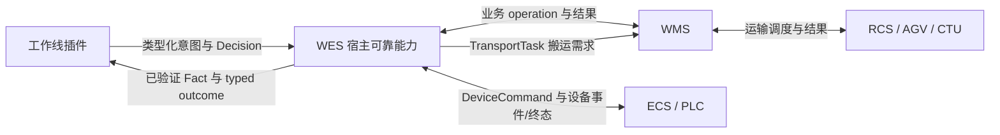

# WES 最小执行架构收敛设计

## 1. 文档定位

`docs/architecture/SRS.md` 是产品范围、参与方职责和功能/非功能需求的唯一依据；本文在该需求边界内定义 WES
产品的最终目标架构。产品售卖给不同客户，每个工厂独立部署；各工厂使用相同北向 WMS
业务边界，差异主要来自南向设备合同附录以及入库、出库工作线流程；所有供应商共同遵循同一顶层设备接口。

本文主要供 WES 架构和开发人员使用。WMS C# 开发人员只需要阅读 §11.3 了解自动出库流程，不需要实现本文中的 WES 内部对象。
接口 URL、DTO、枚举和错误码以 `docs/contracts/wms-outbound-picking-task-integration-requirements.md` 为准。

阅读顺序为：SRS 定义“需要什么”，本文定义“目标架构如何满足”，Master Plan 定义“按什么顺序实施”。
如本文与 SRS 的业务范围或权责发生冲突，必须先显式修订其中一方，不得用实施计划静默覆盖需求。

本系统尚未发布，不存在必须兼容的生产旧版本或必须迁移的历史业务数据。开发和测试数据可以清空，
架构收敛采用直接替换：

- 当前经确认的设备统一接口、WMS 和 RCS 业务合同继续作为目标合同，不为旧 API、旧字段或旧 Payload 别名保留兼容入口。
- 幂等、持久化证据、ACK/CALLBACK 分离、设备状态和资源投影作为最终业务正确性保留，不继承旧 Runtime 抽象。
- 建立最小、具体、面向工作线对象推进的执行内核，用代码插件承载客户和工作线差异。
- WES 核心仓库的 `tests/` 只验证最小执行内核、通用 WorkLine 能力、外部合同和可靠性不变量；
  具体 WorkLine 执行插件以仓库根目录下的独立二次开发包交付，并由插件包自带测试和 fixture。
- 删除旧 Runtime、兼容 shim、re-export、双写、双读、旧路径 fallback 和仅服务迁移的配置。
- 最终模型稳定后清空开发/测试数据库，并由 Alembic generator 创建单一干净基线，不实现旧数据转换。
- 测试以本文为基线：通用 WES 行为改写到核心测试后保留；具体工作线/插件行为从核心 `tests/` 移出，
  随对应二次开发插件重新实现；只验证旧架构、旧迁移和兼容路径的测试直接删除。
- 基础能力、设备统一接口、供应商一致性与业务能力必须有独立测试所有者：核心测试不得以具体供应商、工作线或业务成功路径证明
  基础能力；核心统一接口合同测试只验证固定路径和公共包络；供应商一致性验收只验证设备附录与 ECS/网关行为；WMS
  Adapter 测试验证业务结果合同；插件测试只验证业务结果到执行 Decision 的映射和对象推进。后四者都不得
  替代核心持久化、幂等、传输和可靠性不变量测试。

提交 `ee1f3b670c5ed33cfd5be1fd0370b53570790e73` 只作为平台化前的历史行为参照，不作为代码回退或新分支基线。
该提交已经存在 Manifest、RuntimeIntent、RuntimeHold、Reconciliation、CellReservation、
Service Locator 和插件模板，不是简洁内核。实现从最新 `develop` 开始，但历史实现、迁移链和测试资产
都不构成兼容约束；只有经本文确认的目标业务合同和可靠性不变量可以进入最终系统。

## 2. 核心架构结论

WES 只承担以下职责：

1. 工作线本地设备调度。
2. 工作线内对象、位置、队列、设备忙闲的实时投影。
3. ECS 设备命令、ACK、CALLBACK 的持久化证据和幂等处理。
4. 通过抽象搬运端口提交 AGV/CTU 业务搬运目标，接收 CTU 逐箱位置事实和任务级终态结果。
5. 消费 WMS 给出的封闭业务结果，并在其授权范围内决定设备发送、等待、暂停、隔离和对账等本地执行动作。
6. 向 WMS 同步物理执行结果；WMS 不可用时保存待确认事实并受控暂停。

WMS 继续负责业务单据、业务授权、库存、主数据、来源分配、人工业务和全局仓内位置权威。

目标执行闭环按外部义务分为三类，三者分别拥有状态和重试策略，不共享一个含混的 Callback 生命周期：

```text
DEVICE EVENT
→ 持久化并返回 ACK
→ 请求或匹配 WMS 封闭业务结果
→ 工作线插件校验关联并映射为执行 Decision
→ ECS COMMAND
→ ACK
→ CALLBACK
→ 回传物理结果并取得 WMS 后续业务结果
→ 下一条 COMMAND 或流程结束
```

```text
WMS 单据或同步业务输入
→ WMS 给出来源、目标、优先级、路线或处置等封闭业务结果
→ 工作线插件映射为执行 Decision
→ TransportTask 持久化
→ Transport Adapter 提交
→ 类型化 ACK
→ WMS/RCS 执行运输
→ WMS 可靠异步回传类型化 TransportResult
→ InboundEvidence 持久化后 ACK
→ 类型化终态
→ 结果判定并继续流程
```

```text
WMS 确认义务
→ WmsConfirmation 持久化
→ 同步发送
→ Success：确认义务完成
→ WmsBusinessReject：保存 WMS 封闭业务结果并按其语义执行，不进入依赖重试或本地改判
→ WmsDependencyFailure：仅逐 operation 合同批准安全重提且 retryable=true 时，由可靠对象保留内部 dispatch_key 重提；
  否则依赖暂停或人工对账
→ WmsContractFailure：记录合同告警并封闭失败，不进入依赖重试
```

普通 WMS 同步 HTTP 调用不进入设备异步 ACK 协议。Transport 提交采用同步接纳 ACK，最终结果由 WMS 可靠异步回传；
两者都不需要通用“工作线执行引擎”解释外部内部进度。

## 3. 范围与非目标

### 3.1 范围

- 单工厂、独立部署的 WES 产品。
- 相同北向 WMS 业务能力。
- 不同客户的 ECS 设备、工作线拓扑和出入库执行插件。
- 粗分机、自动分拣线、人工分拣线、满箱交换及复杂出库来源执行。
- AGV/CTU 通过 Transport Port 调用；当前适配器由 WMS 转发。
- ECS 命令使用同步接纳 ACK 和异步终态 CALLBACK；普通 WMS 业务决定使用同步 HTTP，经具体业务合同批准的长时操作可以使用
  持久化后 ACK 和异步终局回调；Transport 使用同步接纳 ACK 和异步终态结果。WMS 回调不复用 ECS 协议语义。

上述具体工作线流程是二次开发插件的执行验收范围，不进入 WES 核心测试套件。WES 核心只为插件提供稳定
SPI/SDK、封闭 Decision、注入端口和通用执行保障；每个具体插件在自己的独立包内验证 WMS 业务结果到物理执行的映射。

### 3.2 非目标

- 总部与分工厂的多级管理。
- WES 自建库存台账、货架主数据或 WMS 单据系统。
- AGV/CTU 车辆位置、路径规划、交通管制和设备级调度。
- WES 软件实现机械安全互锁、防撞或设备间防呆。
- MQTT、OPC UA、WebSocket 等未确认的南向协议。
- 由 WES 核心定义跨所有设备的 `task_type`、`event_type` 全集或 ECS 内部步骤；具体允许值由获批设备合同附录拥有。
- Vendor Manifest、通用工作流 DSL、低代码流程引擎或运行时动态插件发现。
- 自动重新执行物理动作、自动清线、根据猜测重放请求或自动创建反向动作。
- 为未来客户预建可复用执行插件模板。
- 四条串联分拣线之上的 `SorterCorridor` 领域对象或跨线执行引擎。

## 4. 权威边界

### 4.1 WMS 权威数据

WMS 是以下数据和决策的唯一业务权威：

- GRN、入库单、出库单、退料单、转运单、波次、工单、盘点等业务单据。
- 库存台账、可用量、冻结量、预留、库存事务和最终入出库确认。
- 物料、料盘、料箱、料格、仓库区域、仓位等主数据。
- 单层货架、五层货架、退货货架、转运货架及其储位主数据和全局位置。
- 出库来源分配、目标货架或目标储位授权。
- 全部业务资格、优先级、业务路线、业务异常分类、替代来源、取消、恢复和业务终态结果。
- AGV/CTU 搬运业务目标、货架分配和全局运输业务状态。
- 人工作业任务、PDA 扫码、人工入库目标格、人工出库来源和人工库存变更。
- SAP 等上游系统的业务同步。

WES 只可保存完成工作线执行所需的 WMS 结果引用和作业期投影，不得跨请求缓存原始事实用于业务判定，也不得把投影
升级为库存、主数据或业务决策权威。

### 4.2 WES 权威数据

WES 是以下本地执行事实的权威：

- WorkLine、设备角色绑定、位置节点、队列容量和活动流程模式。
- `WorkLine`：保存当前插件、运行配置和实际资源绑定；运行期间不可修改，完全收敛清线后才允许切换。
  同一工作线可以依次执行多张 PickingTask，不另建运行代际。
- 设备是否可以接收下一条命令的忙、闲和故障投影。
- 物料、料箱在当前工作线位置和队列中的瞬时执行投影。
- 每一条设备命令、`TransportTask`、WMS 确认义务和对应结果证据。
- 自动工作线对 WMS 已授权结果作出的设备等待、发送、暂停、隔离和对账等即时执行决定。
- NG 原因、来源工作线和物理流转证据。

### 4.3 ECS 权威边界

设备厂商 ECS 负责：

- 实现第三方设备统一接口的固定路径和公共包络，并在设备合同附录中给出真实支持的事件类型、命令类型和 JSON Payload。
- 接收 WES 的长命令并同步返回 ACK。
- 命令执行完成后异步回调最终结果。
- 设备内部步骤、PLC 顺序、机械安全互锁、防撞和硬件防呆。
- 硬件故障、急停、安全门、光栅等物理事实。

WES 只能调用 ECS 已提供的命令，不能要求 ECS 把长命令拆成 WES 设计的内部步骤。

### 4.4 RCS、AGV 与 CTU 边界

WES 只提交 WMS 已给出的搬运目标并跟踪任务级事实：

- 搬运对象。
- 来源和目标业务位置。
- 提交时冻结的批次成员。
- 批次级同步接纳 ACK 和异步终态。
- 批次终态中可携带的成员最终事实。

WES 不关心该请求由 WMS、RCS、MCS 或其他系统最终承接。它们通过同一个 Transport Port 隔离。
当前产品只实现 WMS 转发适配器。Transport 可以接纳上游已经具备的标准化成员位置事实，但当前 CTU/RCS 只能返回完整最终到位
结果，Phase 13 自动上架业务不得依赖或伪造 `SOURCE_PICKED`、`TARGET_PLACED` 等中间事实。同步接纳 ACK 后只能确认搬运义务可能已经开始，
不能据此推断 Bin 仍在来源或已经离架；只有通过 Transport evidence 应用端口校验并持久化的可靠异步终态才能终结任务，普通 WMS
业务事件不能终结任务。

## 5. 集成协议

### 5.1 ECS 事件

ECS 事件采用持久化后 ACK（ACK-after-persist）：

1. 校验最小传输合同、部署级唯一 `source_event_id`、`contract_key`/`contract_version` 和规范化载荷摘要。
2. 首次观察时，在现有入站幂等记录中保存事件身份与摘要，按设备有效绑定校验合同并关联 WorkLine。
3. 持久化原始 Payload、设备身份、事件类型、接收时间及已确定的关联；普通事件无有效工作线关联时留存拒绝证据，不返回成功 ACK。
4. 合法接纳的证据事务提交后同步返回 ACK。
5. 后续处理校验 WorkLine 当前准入、设备绑定及具体业务关联后，才交给显式装配的插件；不能仅凭设备编码路由到任意当前插件。

重复事件相同 Payload 返回首次接纳结果；同一稳定身份、不同 Payload 必须拒绝并保存冲突证据。`source_event_id` 在整个 WES
部署范围内跨供应商、设备、结果和事件回调永久不复用。迟到或重复事件不得改写已有证据关联；不满足当前业务准入时记录错误并拒绝推进。

### 5.2 ECS 命令

设备命令是厂商定义的长命令：

1. 每个独立命令资源 `device_code` 最多存在一个已接纳且未终态的命令；WES 只在可信状态为 `AUTO + IDLE`、无活动命令且状态返回的
   合同身份与当前已校验的 WorkLine 设备绑定一致时发送；既有命令始终使用自身冻结合同。
2. WES 在 `DeviceCommand` 中冻结 `contract_key`/`contract_version` 和规范化载荷摘要，持久化后调用 ECS。
3. ECS 原子检查实际加载合同、设备状态和活动命令后返回 ACK；竞争失败返回 `429`，ACK 只表示接纳，不表示物理完成。
4. 最终 CALLBACK 必须携带原命令合同身份；每个 `command_code` 只接受一个终态结果，只有匹配结果才能推进物理位置和对象状态。

WES 不实现设备间安全互锁。不同 `device_code` 可以同时处理不同对象；同一 `device_code` 有活动命令、设备不是 `AUTO + IDLE` 或目标位置被占用
时等待。

### 5.3 WMS 调用

WMS HTTP 访问由 Phase 3 `WmsClient` 薄封装提供：

- Client 只统一 WMS origin、GET/POST、query、headers、JSON 编解码、传输事实和资源关闭。
- 具体业务模块在真实需求出现时定义自己的 method/path、request/response DTO 和结果解释。
- 当前 WMS outbound 合同无认证，不存在认证配置或预留 seam；真实合同明确要求时再由最窄 owner 实现。
- 工作线插件不直接访问 HTTP；它只消费对应业务模块提供的类型化业务结果。
- WMS 结果是业务事实，不伪装成 ECS ACK/CALLBACK。

WMS 普通业务事件通过 `/api/v1/wms/events` 接收，必须按 operation 声明的接收模式提交 `InboundEvidence` 及必要业务事实后再 ACK，
由对应业务 owner 消费；全局任务输入不强制进入工作线插件队列，参见 §7.9。`WMS_EFFECT_STATUS_HINT` 的当前 successor 为 `NONE`；Phase 5 只删除旧 route、payload、OpenAPI 和测试，
不建立新 hint 路径。普通事件不得直接充当外部任务终态。

每项具体 WMS 业务 API 在对应业务开发中采用一个显式纵切片：业务 owner 定义具名方法、固定 path、request/response DTO、
业务结果解释和合同测试，并复用 `WmsClient.get/post`。Phase 3 不预建业务 Port、Gateway、normalizer、operation registry、
动态发现、配置驱动 API 或 WMS codegen。只有真实重复出现后才提取业务 helper。

`docs/hardware/wms_rcs_interface_requirements.md` 是 WMS 交互约定初稿，作为业务输入只读保留；具体 API 开发时再逐项确认。
任何具体业务接口未确认只阻断该业务 API，不阻断 Phase 3 共享 Client。

当前由 WMS 转发的 AGV/CTU 操作不属于 Phase 3。Phase 4 通过 Transport Port 和复用 `WmsClient` 的 WMS 转发 Adapter
调用 WMS，并由 `TransportTask` 统一拥有任务持久化、提交、同步接纳 ACK、可选逐箱位置事实、异步终态、超期对账和
批次成员最终事实。首版不提供状态查询、取消或任意外部内部进度；上游实际提供中间位置事实时才接纳
`SOURCE_PICKED / TARGET_PLACED`，当前 CTU/RCS 只提供最终结果，业务流程不得把容器中间位置事件作为准入或推进前提。

WMS 业务写操作和 Transport 请求都可在各自可靠对象内部保留 `dispatch_key`，但对外接口只发送对应外部合同批准的唯一
幂等/关联字段，不自动暴露内部字段名。WMS 原子幂等、回显、安全重提、Transport submit ACK 与异步结果关联规则，
必须分别写入对应业务合同和 Phase 4 Transport 合同，不能由 WES 单方面推定。

Phase 3 Client 行为无状态，只复用 Phase 2 Transport 执行一次有界请求/响应并完成 JSON 编解码；不打开数据库事务，
不持久化 evidence，不拥有 breaker、retry、分页或业务终态。具体 API 的字段、items 和尺寸约束由该业务合同负责。

只有发生 `WmsDependencyFailure` 时才进入以下依赖暂停：

- 停止接纳新的 WMS 依赖对象。
- 已下发的设备命令继续等待并消费最终 CALLBACK。
- 已完成的物理事实写为待 WMS 确认义务。
- WMS 恢复后，只有逐 operation 合同明确批准安全重提且对象显式 `retryable=true` 时，可靠对象才保留内部原
  `dispatch_key`，映射为唯一获批的对外字段后重提；否则保持暂停并进入人工对账。

这属于依赖暂停，不属于 NG，也不属于硬件故障。`WmsBusinessReject` 交由插件按 9.1 节处理；
`WmsContractFailure` 记录合同告警并封闭失败。两者都不得进入依赖重试。

## 6. 最小执行内核

### 6.1 核心对象

目标内核只保留具体执行对象：

| 对象 | 职责 |
| --- | --- |
| `WorkLine` | 工作线身份、当前插件与运行配置、设备和位置资源绑定 |
| `MaterialExecution` | 单个完整料盘或单个可执行物料单位的推进证据 |
| `PositionProjection` | 位置和队列的当前占用 |
| `DeviceRuntimeProjection` | 单设备忙、闲、故障和当前命令 |
| `DeviceCommand` | ECS 命令、ACK、CALLBACK 和幂等事实 |
| `TransportTask` | AGV/CTU 搬运请求、批次状态和终态中的成员最终事实 |
| `WmsConfirmation` | 待提交或已完成的 WMS 业务确认 |
| `InboundEvidence` | ECS 事件、WMS 输入和回调的持久化原始证据 |

WorkLine 管理当前插件与配置；`MaterialExecution` 保存物料推进，具体命令和外部义务各自拥有生命周期。
料箱使用实际 `bin_code`，不建立贯穿供箱、线内作业、退箱和 NG 的全程执行实体。插件只保存正常业务所需的工位等待、
任务与料箱关联、作业进度和 FIFO；位置事实由 `PositionProjection` 及匹配的设备、搬运证据承接。

WMS 冻结精确供给成员后，WES 创建 TransportTask；提交、接纳、失败、位置未知和资源围栏均由该搬运对象负责。
后续作业必须校验可靠搬运结果、实际扫码与当前任务/工位关联，不能根据条码或预期成员猜测到位。
NG 结束正常业务分支，不附加人工取走作为业务完成门禁；未决命令和物理占用仍须以匹配的权威结果独立闭合。

### 6.2 最小执行路径

```text
ECS Event / WMS Input / External Result
                │
                ▼
        InboundEvidence
                │
                ▼
       WorkLine Plugin Handler
                │
                ▼
       封闭的执行 Decision
        │       │       │
        ▼       ▼       ▼
DeviceCommand  TransportTask  WmsConfirmation
 ACK/Callback   ACK/Async Terminal   Sync Outcome
        └───────┴───────┘
                │
                ▼
    对象与位置投影更新并继续判定
```

不保留通用 `RuntimeIntent → Generic Effect → System Capability` 热路径。可靠投递仍然存在，但分别落在
`DeviceCommand`、`TransportTask` 和 `WmsConfirmation` 的具体状态与重试策略中。

### 6.3 Decision 边界

插件只能返回以下封闭 Decision 类别，具体 SDK 使用可判别类型表达：

- 等待目标设备、位置或新的业务输入。
- 请求一个逻辑设备动作并创建 `DeviceCommand`。
- 使用 WMS 已批准的对象、来源、目标和约束请求一个供应商无关的 `TransportTask`。
- 创建一次需要可靠提交的 WMS 确认义务。
- 按 WMS 封闭结果将对象执行到指定下一步或 NG 分支。
- 暂停当前对象或停止新的依赖型准入，并保留可靠对象身份。
- 按类型化设备故障隔离指定对象、设备或配置范围。
- 请求进入人工对账或人工清线，冻结不确定对象和位置。
- 完成本次对象执行。

`TransportTask` 不选择 AGV/CTU、车辆、供应商、路线或调度策略；人工对账或清线 Decision 也不得自行宣告现场已恢复。

当前步骤所需的同步 WMS 业务决策或事实查询通过对应业务模块执行；业务模块内部复用 `WmsClient` 并返回类型化结果，
插件不接触 HTTP，也不得组合原始事实重算业务结果。
会改变 WMS 业务状态的确认不在插件内直接发送，而是由 Decision 创建 `WmsConfirmation`，以便持久化和重试。每次
`WmsConfirmation` 提交仍取得当前 HTTP 的同步业务结果；业务合同没有明确批准异步终局时，不得把同步确认改成接纳 ACK 加
后续回调。

纯 Decision 层不能直接写数据库、发 HTTP、调用 Repository 或自行启动后台任务。确需业务持久化的插件 Application
层使用宿主提供的基础端口和受控事务；两层边界见 §7.7，不复制可靠执行机制。

<a id="workline-plugin-top-level"></a>

## 7. WorkLine 与插件扩展

本章是 WorkLine 执行插件的顶层设计入口，汇总截至 2026-09-09 已确认的能力边界。§7.1–7.5 定义扩展方式，
§7.6 定义资源装配，§7.7–7.12 定义系统关系、代码所有权、交互、生命周期和验收责任，§7.13 定义声明先行与渐进业务接入。
本章记录目标合同，不声明具体插件已实现、已部署或通过现场验收。

阅读时先确定三个问题：业务决定由谁作出、物理事实由谁提供、可靠执行由谁承担。插件拥有本地业务执行编排；
WMS 拥有业务权威；ECS/RCS 提供各自执行范围的物理事实；宿主负责把插件意图转为有证据、可追踪的可靠义务。
接口字段、路径及错误码仍以各领域合同为准，本章不另建 wire 合同或通用工作流平台。

### 7.1 代码插件

不同客户、设备和工作线流程通过代码插件扩展，不使用声明式工作流 DSL。

插件职责：

- 解释已经按统一接口和设备合同附录验证并映射到设备角色的事件。
- 读取注入的只读工作线投影，并通过对应业务模块取得 WMS 封闭业务结果。
- 校验结果的关联、版本、时效和物理可执行性，不改变其业务语义。
- 将 WMS 业务结果映射为等待、发送、暂停、隔离或对账等封闭执行 Decision。

插件不负责的公共机制与外部权威：

- 公共事务框架、通用 Repository、幂等、重试和 Outbox；必要的插件业务持久化按 §7.7 分层实现。
- 设备安全互锁。
- WMS 库存和单据业务。
- 来源、目标、优先级、业务路线、业务异常分类、替代来源、取消、恢复或业务终态裁决。
- RCS 车辆调度。

具体插件不放入 WES 核心 `src/`。仓库内二次开发插件使用独立包结构：

```text
workline_plugins/<plugin_key>/
├── pyproject.toml
├── src/
├── tests/
└── fixtures/
```

每个插件包只声明 WES SDK 和业务侧依赖，独立维护测试入口。根项目使用 uv workspace 管理核心与已交付插件，
客户镜像在构建期通过显式 package 列表安装所需插件，并在 Composition Root 显式绑定；不建设运行时动态发现、
私有包 registry 或按字符串扫描目录。删除插件时同时移除 workspace member、镜像安装项、装配绑定及该包，核心无需
保留 tombstone 或兼容入口。

### 7.2 装饰器与依赖注入

- 装饰器只表达静态 Handler 元数据，例如事件角色、事件类型和适用流程。
- 显式依赖注入提供具体业务能力、`ProjectionReader` 和 Decision Factory；插件不直接注入 `WmsClient`。
- 禁止 Service Locator、运行时全局容器查找和任意字符串动态 import。

### 7.3 设备统一接口合同

所有供应商必须适配
[`docs/integration/third_party_integration_whitepaper.md`](../../integration/third_party_integration_whitepaper.md)
定义的统一接口。供应商可以在 ECS 或局域网网关内适配其内部协议，但不得要求 WES 增加私有路径、DTO 别名、
认证分支或供应商 Adapter。

`docs/hardware/` 原样保留供应商提供的协议与联调资料；即使资料较旧或与目标接口存在差异，也不得按历史设计移出项目或
反向改写。同目录人工转写和供应商联调说明属于可检索派生资料，必须与原始 PDF 明确区分，也不得作为当前设备合同或
WES 架构真源。每种实际设备通过获批合同附录明确允许的 `task_type`、`event_type`、`params`、`data`、错误和时限。

共享固定路径、公共包络、身份、重复和冲突语义由 WES 核心合同测试证明；具体供应商实现由一致性验收证明；插件只消费
类型化角色事件、WMS 业务结果与逻辑动作，并在插件包内验证工作线执行推进。三者不得相互替代验收。

运行配置只绑定工厂实际设备 ID、统一 Endpoint、工作线角色和现场容量；当前目标协议不存在应用层凭据配置。系统不要求
供应商维护 WES Manifest，也不把设备合同附录中的命令提升为 WES 核心全局枚举。

### 7.4 Convention over Configuration

基础能力统一设备忙闲判定、命令证据和资源绑定规则；业务角色、插槽数量与流程模式由具体插件声明。
SCAN1～SCAN4、退料缓存、机械臂等属于具体工作线插件的业务定义，不是宿主的固定角色清单。

现场资源实例、Endpoint、位置容量和实际物理拓扑由基础资源管理维护；插件通过工作线装配绑定资源，见 7.6。

### 7.5 不建设执行插件模板

平台只提供最小 SDK、脚手架、合同测试工具和一个最小示例。粗分机、自动分拣、人工分拣和满箱交换都是
真实执行插件，不作为“可复制执行模板”。

最小示例只证明 SPI/SDK 可用，不承载任何真实工作线规则。核心 `tests/` 可以使用最小 fake 验证插件接口、
依赖注入、封闭 Decision 和禁止数据库/HTTP 访问等边界，但不得包含粗分机、自动分拣、人工分拣、满箱交换
或其他具体客户流程的 handler、fixture、参数组合和期望结果。

具体插件测试由对应 `workline_plugins/<plugin_key>/tests/` 唯一拥有，通过插件包自己的 CI 或显式命令执行；
未通过自身测试的插件不得进入部署包。插件测试不进入 WES 核心默认回归、核心 HEAVY selector 或核心覆盖率。

相似逻辑在出现三次且语义稳定前允许局部重复。满足 Rule of Three 后，只抽取小型技术库，不抽取通用
工作流框架。

### 7.6 插件插槽与工作线资源绑定

本节为 2026-09-08 用户确认的通用目标设计。它扩展设备角色绑定为工作位、设备两类插槽；设计确认不表示实现、部署或现场验收完成。

#### 所有权与最小声明

| 对象 | 拥有的信息 | 不拥有的信息 |
| --- | --- | --- |
| 插件定义 | 插件身份、版本、支持的工作线类型；工作位插槽与设备插槽；业务编排 | 具体工作线的现场编码和 ECS 服务地址 |
| 工作线基础资源 | 实际工作位、位置类型、容量、外部位置编码及设备归属、必要的物理关联 | 插件业务插槽的含义 |
| 工作线插件装配 | 当前插件及其插槽到本线实际资源的绑定 | 设备通信和供应商私有协议 |
| 设备接入 | 独立 device_code、服务地址、已批准通信合同及状态访问 | 插件业务角色和流程 |

MVP 中每个插槽声明稳定代码、展示名称、资源类别及实际需要的类型约束；所有已声明插槽在启动前必须绑定，
不提供可选插槽开关。设备实时能力校验沿用现有插件启动路径。插槽代码在该插件的对应类别内唯一；
默认一个插槽关联一个实际资源，多个同类需求声明为多个插槽，不预建多重绑定或动态工作流 Schema。
设备插槽的业务职责就是插件设备角色，不再并行维护另一套角色定义。
工作位插槽可表达货架位、投料口、出料口等实际位置需求，不能把所有工作位都建模为货架位；容量语义随资源类型明确。
工作线实际工作位统一存储为 `workline_positions`，模型为 `WorkLinePosition`；已有货架位表通过原地改名迁移保留 ID、数据与设备关联，不另建兼容表或别名。

基础宿主只理解上述声明、资源和校验规则，不内置某种工作线的插槽数、扫码器数、现场编码或事件业务含义。
设备是否允许重复参与由明确的绑定约束决定，当前保持已有设备绑定去重规则；不为假设的共享需求新增配置开关。

MVP 只交付两类插槽声明、单资源绑定、必要校验和运行时解析。不新增数据字典、可配置规则、多重绑定或动态表单框架；
只有真实业务需求出现后才扩展。具体插件的完整业务流程仍按其独立范围实施。

#### 装配与维护

首次装配顺序为：选择已安装插件 → 展示该插件所需插槽 → 关联本线已有资源或补建实际资源 → 校验并保存。
基础资源也可提前录入和独立维护。前端由同一通用界面消费插件声明，不安装前端业务插件，不为每种工作线写专属表单。

绑定保存实际资源的明确身份，不按显示名称、列表顺序或 ECS 地址推断对应关系。校验未知插槽、资源存在性、工作线归属、
类型/能力匹配及重复绑定。草稿可缺项，但启动必须满足全部必填插槽和当前设备准入条件；保存配置不等于启动。
切换或解除插件保留实际工作位和设备，旧绑定不能自动当作新插件的有效绑定。删除或解除仍被使用的资源须先处理相应绑定。
基础配置与装配共享 WorkLine 版本校验，并继续执行停用、可靠义务闭合和现场清线约束。

#### 运行时解析

插件编排引用工作位或设备插槽代码。宿主根据当前已校验的工作线装配，把工作位插槽解析为实际工作位及对接合同要求的
位置标识，把设备插槽解析为实际 device_code；设备接入层据设备配置选择 ECS 服务地址。该过程是类型明确的资源解析，
不是任意字符串替换，也不能用设备编码代替位置编码。

WES 解析到 WMS/RCS/ECS 合同可使用的位置标识；设备内部坐标、动作分解和物理控制仍归 ECS/PLC。
插件不直接发 HTTP，不读取供应商私有配置；宿主不解释具体插件的业务编排。事件通过实际设备身份及有效绑定关联插件职责，
还须遵守既有事件、命令和业务关联校验，不能仅凭设备编码把回调交给任意当前插件。

复用 WorkLine 启动校验和可靠对象的冻结身份、载荷与资源围栏，不恢复 LineRunEpoch 或新增另一套运行身份。
配置变化不得改变已发出动作的目标、身份或重试载荷；未知物理结果仍走既有对账路径，不根据新绑定换址重发。

#### 示例与复用边界

人工分拣线的一个装配实例可以包含两个五层货架位 KT16、KT17，转运货架位 OUT65，退料货架位 RETURN53，
投料口 CNV0301 和出料口 CNV0302；RETURN53 是工作位编码，不是货架编号。该插件还可声明四个扫码设备插槽，
分别绑定不同 device_code。四台设备可以使用同一个或不同的 ECS 地址，地址数量不是装配约束。

上述位置、数量和扫码职责仅属于该具体插件与工作线实例。其他插件自行声明所需设备和工作位，通用能力不要求四个扫码器。
具体扫码事件、扫描对象及人工编排合同在对应插件设计中确定，不阻塞基础插槽能力的抽象。

#### 验收与实现边界

基础能力用 fake 插件验证不同数量和类型的插槽、两条线复用同一插件但绑定不同资源、非法/缺失绑定、设备去重、
相同 ECS 地址下不同设备的合法绑定、位置解析和插件切换保留资源；具体业务编排测试由各插件拥有。
UI 验证选择插件后按声明生成绑定界面、草稿缺项提示和保存失败保留输入。冻结与对账验证复用既有可靠执行测试。

实施跟踪归总控计划的通用插件装配补充项，交付证据绑定相应代码和环境快照。
配置界面的完成不表示具体插件业务实现完成；历史后端、前端通过记录不作为当前现场验收证据。

### 7.7 插件与宿主的能力所有权

| 参与方 | 拥有的职责 | 对插件的约束或提供的能力 |
| --- | --- | --- |
| 插件 | 本线业务步骤、事件解释、资源角色、必要业务关联、等待及物理队列顺序 | 消费已验证事实与 WMS 授权，返回封闭 Decision；不能改变业务授权或伪造物理结果 |
| WorkLine | 工作线身份、当前插件、运行配置、工作位和设备归属及装配 | 把插件声明绑定到本线实际资源，启动与维护统一执行准入检查 |
| Device | 物理设备身份、类型/能力、合同、Endpoint、状态访问 | 提供可绑定的独立设备资源，不保存插件业务角色 |
| WES 宿主 | 证据接收、事务、幂等、可靠派发、重试、命令/搬运生命周期、位置投影与资源围栏 | 校验并可靠执行插件意图，不读取插件业务表补全意图或替插件选择业务步骤 |
| WMS | 任务、库存、分配、业务来源/目标、优先级、路线及最终业务处置 | 返回封闭授权和业务结果；插件只在授权内判断本地可执行性 |
| ECS / PLC | 设备长命令执行、内部步骤、坐标、安全互锁、防撞、急停、设备终态 | 通过统一接口提供事实和结果，供应商私有实现留在 ECS/网关边界 |
| RCS / AGV / CTU | 运输执行、机器人路径和车辆控制 | 当前由 WMS 统一调度；WES 跟踪任务级运输事实，不直接下发车辆任务 |

插件包分为两个职责层，只在真实需要时建立 Application 层：

| 层 | 输入与输出 | 允许依赖及副作用边界 |
| --- | --- | --- |
| 纯 Decision | 输入不可变类型化 Fact、只读快照、typed WMS outcome；输出封闭 Decision / intent | 只依赖公开 SDK 和纯逻辑能力；不访问数据库、HTTP、Repository、Celery 或全局容器 |
| 业务 Application | 构造业务 Fact，维护本插件必要状态，协调基础端口 | 可使用宿主注入的基础端口、Service、Repository 和模型；在明确的宿主事务中完成关联和持久化，不另建可靠派发/重试/锁框架 |

宿主只依赖 SDK/基础端口的抽象，部署装配注入具体插件实现。事件应用和结果发布涉及同一事务时，插件 Application
复用宿主传入的事务，提交业务状态与证据后由宿主唤醒后续处理；不能另开事务、直接 enqueue 或在提交前执行外部动作。
具体开发方式见[插件开发指南](../../plugin_development_guide.md#3-目标文件结构)。

料箱只使用实际 `bin_code`。插件可以保存当前工位等待、task 与 bin 的关联、作业进度和 FIFO；这些状态各自有明确的
创建条件、消费人和关闭事实。不能为了共享便利重建全程 BinExecution、通用 Session、业务状态全集或历史条码永久索引。
已有业务记录足够时直接复用；业务记录关闭不删除其尚未完成的 DeviceCommand、TransportTask 或 WMS 确认义务。

### 7.8 设备、工作位与工作线实例

插件定义可以被多条兼容 WorkLine 复用，各线独立绑定自己的资源和业务状态。同一 WorkLine 的当前插件选择、运行配置、
实际资源及绑定共同决定可运行流程；安装插件、保存配置和启动工作线是三个不同动作。

| 标识 | 表达的身份 | 不能代替 |
| --- | --- | --- |
| `plugin_key` / 插件版本 | 业务实现及其合同版本 | WorkLine、现场设备或运行代际 |
| 插槽代码 | 插件内稳定的业务职责或位置需求 | 实际资源编码；不以列表顺序隐式绑定 |
| `workline_code` | 实际工作线 | WMS 任务、料箱或 Endpoint |
| 工作位编码及外部位置标识 | 实际位置及合同使用的位置引用 | `device_code`、货架编号、PLC 坐标 |
| `device_code` | 可独立识别、判断忙闲及按合同交互的设备资源 | ECS 地址、PLC 数量或业务角色 |
| `rack_id` / `bin_code` | 货架和实际料箱身份 | 工作位编码或一次命令身份 |
| Endpoint | 通信服务地址 | 设备数量、插槽数量或工作线身份 |

设备插槽与工作位插槽分别绑定；如设备和位置存在物理关联，由 WorkLine 基础资源记录并校验，不从编码相似性推导。
四个扫码职责只是某类分拣插件的声明；其他插件可声明不同数量和类型。多个独立 `device_code` 可以使用同一 ECS
Endpoint，也可以分布在不同 Endpoint。硬件能力中的 role 只用于能力描述，不能自动成为插件业务角色。

默认每个插槽绑定一个实际资源；多个同类需求声明多个插槽。未参与当前插件的本线资源可以保留，设备重复绑定按既有
去重规则拒绝；不为假设的共享场景预建多对多拓扑、可选插槽开关或动态 Schema。

### 7.9 与 WMS、ECS、RCS 的交互



**WMS 业务链路。** 插件决定何时触发获批业务 operation，通过单一 `wms_operations` facade 的固定 typed methods
一次性提供完整业务数据，创建不可变 intent。宿主在同一事务冻结 operation identity、规范化 payload、owner 及可靠
义务；Adapter 执行一次有界收发并翻译封闭响应，宿主先可靠保存响应，再构造 typed outcome 交给对应业务上下文的插件。
插件不得传任意 operation 字符串、裸 `dict` 或直接使用 `WmsClient`；宿主不得查询业务表补齐请求。

WMS→WES 通过唯一 Event route 按 operation 静态校验并保存 Evidence。每个 operation 明确自己的 ACK 模式：
需要同时保存业务事实的，在同一事务提交后 ACK；异步应用的，Evidence 提交后 ACK，再由后续事务处理。
全局任务输入可以由对应业务 owner 消费，并非所有 WMS Evidence 都进入 WorkLine 插件队列。共享入口不查询具体插件
业务表，也不按当前插件或默认 owner 猜测路由。

Operation 基础能力与插件消费者解耦，允许零、一或多个静态消费者。插件安装、卸载不动态注册或注销 operation。
插件缺席时禁止新业务触发；既有可靠义务和迟到结果继续保留。处理需要的冻结插件版本不可用时进入既有对账，
不得转交任意当前插件或默认消费者。

**设备作业链路。** ECS 事件经统一入口、设备合同与资源绑定校验后成为 Evidence/Fact；插件解释该事件在本线的业务
意义，返回逻辑动作意图。宿主解析插槽、检查设备与位置准入、冻结 DeviceCommand 并在提交后派发。
ECS 同步 ACK 仅表示接纳；匹配原命令的最终回调由宿主校验并保存后，插件才能据其推进相应步骤。
扫码器提供读码/到位事实，不能决定 task、库存或业务路线；插件不能把预期料箱码冒充实际扫码结果。

**运输链路。** 插件使用 WMS 已批准的对象、来源、目标及成员提出搬运意图；宿主创建 TransportTask，经当前 WMS
转发 Adapter 提交，由 WMS 调度 RCS/AGV/CTU。WES 不直接访问 RCS，也不选车辆、路径或拆解机器人内部步骤。
普通业务事件不能终结 TransportTask，只有 Transport evidence 应用端口接受并持久化的匹配异步终态才能终结任务。
DeviceCommand 与 TransportTask 各自维护生命周期，二者不能互相替代。

公开幂等、字段及最终结果以[WMS 公共交互合同](../../contracts/wms-northbound-interaction-contract.md)、
[设备命令合同](../../architecture/device-command-contract.md)及[Transport 合同](../../contracts/transport-fulfillment-contract.md)
为准。WES 不定义供应商内部协议，供应商一致性验收在 ECS/网关边界完成。

### 7.10 运行、切换与异常约束

| 时机或状态 | 必须满足的规则 |
| --- | --- |
| 安装与显式装配 | 只从构建期明确安装集合选择兼容插件；无动态扫描、热发现、默认业务插件或 no-op consumer |
| 配置草稿 | 可暂缺绑定；保存必须校验未知插槽、资源归属、类型及重复绑定，不能用草稿成功代表启动成功 |
| START | 全部必需插槽齐全，资源及未完成义务满足适用准入；不以 handler 非空或整线业务全部实现为门禁，具体动作校验自己的真实依赖，见 §7.13 |
| 运行期间 | 当前插件及运行配置不可修改；执行根据有效装配解析资源，命令和请求自行冻结身份、合同、目标、载荷及围栏 |
| 停用或切换 | 停止新接纳，闭合既有业务及物理义务并确认清线，再修改配置、重新校验和启动；不创建 LineRunEpoch 或替代代际实体 |
| 迟到或重复事实 | 保留首次身份、摘要及已确定关联；不满足当前业务准入时拒绝推进，不按最新绑定重投给其他插件 |
| WMS 不可用 | 停止需要新 WMS 决定的动作，保留当前业务等待；技术重试由可靠对象按合同使用原身份和内容执行 |
| 已接纳但结果未知 | 保留原执行身份、Evidence、物理占用和资源围栏，进入既有对账；禁止换身份重发、换址或推定完成 |
| 业务 NG | 按获批业务结果或设备事实走插件独立分支，保存原因及证据；正常业务结束不等于分流动作或现场取走完成 |
| 硬件故障与重启 | 故障按证据隔离实际范围；重启遵循 §9.3，不凭数据库状态重放物理动作或自动宣布恢复 |

插件定义其物理队列的作用域、FIFO/LIFO 纪律、冻结顺序、阻塞状态与权威退出证据；宿主提供可靠执行保障。
任务完成或取消不能删除未闭合队列成员；UNKNOWN、RECONCILING、急停、重试或人工处理不能自动成为越序理由。
清线所需业务授权或设备事实不足时，保留阻塞并按现有路径处理，不新增跨插件接管或通用自动恢复机制。

### 7.11 代码、配置与交付组织

| 目录 | 唯一职责 | 依赖边界 |
| --- | --- | --- |
| `src/` | 宿主基础能力与已批准的共享领域合同 | 不导入具体插件；API → Service → Repository → Database |
| `src/wes_plugin_sdk/` | 可独立安装的公开 SPI、不可变 Fact/Decision、typed WMS intent/outcome 与纯 facade 合同 | 不含数据库、HTTP、Celery、Repository、OpenAPI/wire DTO 或具体业务流程 |
| `workline_plugins/<plugin_key>/` | 具体工作线业务、必要 Application、插件专属测试和 fixture | 纯 Decision 依赖 SDK；Application 使用宿主基础端口；禁止反向依赖 |
| `deployment/` | 显式关联已安装插件及基础端口 | 不承载业务实现，不作为动态 registry 或被宿主内部导入 |

这是两个实现根与一个关联目录，SDK 位于宿主实现根内部。独立插件包不意味着复制宿主 HTTP、Evidence、事务或派发框架。
插件固定业务不变量由代码合同维护；实际资源由 §7.6 的 WorkLine/Device 唯一配置入口管理；确有可调参数时使用所属能力
的配置入口并声明合法范围和生效时机。不因实现方便新增全仓常量中心、私有表单或第二套默认值。

新增 WMS operation 按同一业务域分别进入 `wms_adapter/<domain_key>/` 和有持久化需求时的
`wms_integration/<domain_key>/`，复用公共可靠机制；具体触发、业务结果解释、因果恢复及顺序仍由插件拥有。
新增插件只增加该插件所需的业务实现、声明、测试和显式部署装配；发现公共能力缺口时单独归属对应基础 owner，
不把具体插件拓扑、设备数量或供应商私有命令上升为宿主全局规则。

### 7.12 设计验收与证据边界

| 验收层 | 主要证明什么 | 不证明什么 |
| --- | --- | --- |
| 宿主/SDK | 零插件独立运行、不同槽位声明、资源绑定/解析、封闭类型和依赖边界 | 某个真实工作线业务正确 |
| 公共可靠能力 | Evidence 提交后 ACK、幂等冲突、事务原子性、重试保留身份、命令/搬运终态与围栏 | 供应商已执行物理动作 |
| Operation 域 | 固定 DTO、方向、ACK 模式及接入公共机制的差异 | 具体插件完整流程或 WMS 联合确认 |
| 插件 Decision / Application | 业务结果到动作映射、必要状态、关联、FIFO/LIFO、NG 与异常分支 | 真实 ECS/RCS 已符合协议 |
| 前端装配 | 按声明绑定资源、草稿提示、保存校验与失败保留输入 | START、整线运行或现场验收 |
| 部署集成 | 安装集合、显式装配、运行进程及公共入口形成相应闭环 | 供应商一致性和现场物理/业务验收 |
| 供应商与现场 | ECS/网关满足批准接口；实际设备和运输终态与现场一致；业务方确认流程结果 | 不能由 Mock、健康检查或历史测试代替 |

核心测试用最小 fake 验证通用边界，具体插件测试归 `workline_plugins/<plugin_key>/tests/`；不复制公共可靠机制的完整
测试矩阵，不把插件测试加入核心默认测试、覆盖率或 HEAVY selector。真实 worker、数据库、外部系统与物理设备的验证
按相应变更和合同单独选择，设计记录本身只做文档审阅、引用和结构检查。

评审或交付时至少能回答：角色与资源是否唯一归属，意图是否完整且受授权约束，业务关联是否可证明，动作与结果是否保持
原身份，未知物理结果是否保留围栏，插件缺席是否拒绝新业务，切换是否真正满足清线门禁，以及结论属于哪一层验收。

### 7.13 声明先行与渐进业务接入

本节为 2026-09-09 用户确认的开发与联调原则：**插件声明描述整线需要什么；handler 表达当前参与哪些业务；
未参与的节点保持 PLC 原有行为，已参与的业务由 WES 可靠执行。** 不要求 SCAN1～SCAN4 同时开发或同时上线。

静态声明与运行实现分离。声明只依赖 SDK 的不可变类型，包含插件身份、支持线型、设备与工作位插槽；
读取声明不得实例化业务 handler、启动 builder 或访问数据库/设备。部署仍显式装配，前端通过现有 API 读取声明，
现场绑定仍由 WorkLine 保存。声明不从运行绑定反向取得身份，不维护第二套身份或资源定义。

#### 声明对象直接复用（已确认）

插件在 `definition.py` 中为设备角色和工作位分别定义有名称的不可变对象，例如 `SCAN2`、`INLET`，
再将这些对象组成 `DEFINITION.device_roles` 与 `DEFINITION.position_slots`。后续 handler 和 Application
直接导入同一声明对象，不重复构造等价对象，不重复手写角色/插槽字符串，也不按元组下标查找。

SDK 业务接口优先接收类型化声明对象；确需代码值的接口使用对象的 `role_key` 或 `slot_key`。
声明类型由 SDK 唯一维护，现有类型按职责收敛，不增加并行定义或兼容转换链。
对象只是逻辑资源需求，不包含现场资源或运行上下文；宿主根据当前 WorkLine 的有效绑定解析实际 `device_code`
和位置标识。同一插件用于不同工作线时复用声明，各线分别解析资源，不修改声明或把已解析资源缓存到声明对象中。

声明对象不提供 `send()`、数据库查询、设备连接或后台任务方法；解析与可靠执行继续由宿主基础能力负责。
`SCAN2`、`INLET` 仅为示例名称，不定义宿主固定角色。这是声明与消费的目标合同，不表示相应 SDK 接口已经实现。

#### 渐进接入阶段

| 阶段 | 可以做什么 | 不作为前提 |
| --- | --- | --- |
| 仅有声明 | 展示插件、绑定实际设备/工作位、保存草稿或完整配置、执行静态校验 | 业务 handler、事实工厂或业务启动 builder 已完成 |
| 声明及有效资源装配 | 按基础准入启用事件接入与观察；handler 集合允许为空，不产生业务指令 | 整线业务全部实现或存在占位 handler |
| 已接入部分 handler | 运行和联调这些 handler 对应的业务，例如 SCAN1，再扩展到 SCAN1+SCAN2 | 未参与节点也必须实现业务逻辑 |
| 完整业务验收 | 按具体插件合同验证全部必要业务、异常和物理闭环 | 不能用部分联调或基础能力通过代替 |

资源装配完整性与业务实现完整性独立判断；本节不取消已声明必填资源的绑定规则。基础准入只检查对应基础条件，
已接入业务只检查当前动作的真实依赖，不把缺少其他节点 handler 视为启动失败或整线故障。
若当前步骤需要前序任务、料箱或工位关联，由该业务步骤验证；缺少事实时不得猜测，也不将局部依赖升级为整线开发门禁。

运行时以显式装配的 handler 集合表达已接入职责，不另建节点开发状态表、半成品模式、接管开关矩阵或通用能力 registry。
没有 handler 的合法设备事件经过基础合同及关联校验后保存证据，不触发业务动作；不能因没有消费者而无限重试，
也不能把观察事件标记成业务已完成。后续增加 handler 不自动重放历史观察事件。

必须区分三类情况：

- **未接入：** 合法事件没有对应 handler，仅留证；该节点继续由既有 PLC 逻辑执行，WES 不自动补发 `MOVE_FORWARD`。
- **已接入但失败：** handler 报错、业务事实不足或结果未知，沿用已有错误、等待及对账路径；不得降级成未接入或默认放行。
- **命令结果与可靠义务：** 无论业务接入进度如何，原 DeviceCommand、TransportTask 和 WMS 确认义务仍按自身合同接收结果、
  保留身份和围栏；不能因当前 handler 缺席而忽略已发出动作的回调。

未接入节点的 PLC 默认行为是现场既有控制，不是 WES 新建的 fallback。普通观察也不复用会自动创建放行命令的
`is_debug=true` 调试路径。事件接收 ACK 只证明其合同声明的接收事实，不代表业务已处理或物理已完成。

每次迭代验证本轮新增业务及其真实依赖，复用基础能力的已有证据；允许按 SCAN1、SCAN1+SCAN2、SCAN1+SCAN2+SCAN3
逐步接入，但不把节点数量固定成宿主规则。渐进开发不等于运行时代码热替换，更新仍遵守既有发布、配置变更及未完成义务约束。

本节是目标设计；声明/运行对象解耦、空 handler 准入和未消费事件处理须分别核对实现，不能由文档更新宣称已支持。

## 8. 工作线并发与版本

### 8.1 对象级流水并发

工作线上的设备独立推进不同对象：

```text
对象 A：出料设备
对象 B/C：输送设备或队列
对象 D：扫描设备
对象 E/F/G：等待入料
```

设备完成当前长命令后即可处理下一对象，不等待前一个对象走完整条工作线。

软件只校验：

- 目标设备是否空闲。
- 目标位置或队列是否有容量。
- 当前对象是否满足本步骤业务条件。

设备间物理互锁由 ECS/PLC 完成。

### 8.2 单线活动流程

自动 WorkLine 可以同时具备自动上架和自动拣货插件，但一条 WorkLine 同时只激活其中一个流程。人工 WorkLine 只激活统一
`manual_bin_processing` 插件；人工上架或拣货由 WMS/PDA 完成，不触发 WorkLine 插件切换。自动线不降级运行人工插件，人工线不伪造机械臂角色运行自动插件。

切换要求：

- 工作分支、位置和本线缓存中没有对象。
- 本线设备全部空闲。
- 没有已经承诺给本线、尚未完成的对象。
- 没有待完成的人工或自动作业。

清线并闭合可靠义务后才允许更新 WorkLine 的插件、配置和流程模式，重新校验后启动。结构拓扑变更同样要求清线。

模式不匹配时：

- WMS 单据同步拒绝。
- ECS 事件先持久化证据并提交，再返回 ACK。
- 不执行不匹配流程并产生告警；不得因模式不匹配自动启动另一流程。

## 9. 异常、NG 与恢复

### 9.1 业务 NG

以下属于由 WMS 给出的正常业务分支：

- WMS 判定条码或扫码业务资格不通过。
- 测量结果不通过。
- WMS 以稳定拒绝码明确给出的 NG 业务结果。
- 没有符合条件的目标料格。
- 人工扫码或物料校验失败。
- 来源或目标业务授权不满足。

具体业务模块返回的 WMS 拒绝结果必须携带稳定业务异常分类；插件只校验关联，并结合现场证据映射为物理 NG、等待、暂停
或对账动作。插件不得根据未约定或未知的 `reason_code` 猜测业务分类或替代来源；结果缺失、过期、矛盾或物理不可执行时
fail closed 并暂停当前对象。

业务 NG 不创建 RuntimeHold，也不冻结无关对象和设备。

### 9.2 硬件故障

只有 ECS 明确报告的设备、急停、安全或机械故障属于执行异常。默认隔离当前对象和相关设备；
现场可以按设备或工作线配置更严格的停止策略。WES 不自动解除硬件故障，也不推测物理状态。

### 9.3 重启恢复

采用“持久化证据 + 人工清线恢复”：

1. 重启后停止工作线新对象接纳。
2. 保留所有 InboundEvidence、DeviceCommand、ACK、CALLBACK 和位置投影。
3. 未明确终态的在途对象标记为需要现场清线。
4. 迟到 CALLBACK 继续保存，但不自动恢复物理编排。
5. 既有可靠义务闭合、操作员完成物理清线并确认后，按 WorkLine 当前配置重新校验并启动。

不实现自动恢复、自动重放物理命令或根据数据库状态猜测现场位置。

## 10. 资源与物料模型

### 10.1 物理承载关系

- 五层货架储位容量为 1，直接存放一个料箱。
- 单层货架储位容量为 1，直接存放一个料箱。
- 料箱料格可以存放多个完整料盘，按后进先出队列管理。
- 退货货架和转运货架的储位直接存放料盘。
- 退货货架和转运货架的单个储位容量为 1 个完整料盘。

WES 保存当前工作线需要的活动投影；货架、储位、料箱、料格和库存的全局权威仍在 WMS。

### 10.2 料盘与包装数量语义

ECS 每次物理搬运一个完整料盘。设备扫码形成一个不可变六合一码证据，其中唯一 `PkgID` 对应一个料盘级
`MaterialExecution`。SixInOne 中的 `Qty` 表示该包装内的物料数量，不用于展开多个料盘执行；物料、厂商和批次等明细
均来自本次扫描的完整六合一码。

### 10.3 出库来源

`PkgID` 是完整料盘的唯一业务身份，不定义其他身份字段或兼容别名。排队任务只保存任务身份和排队信息；WMS 在异步准备阶段
按连续 `plan_revision` 分批发布不可变计划增量，增量中的直接取料 SLOT 建立 `DirectPickExecution`，五层来源货架面到位后由
`inbound_batch` 分批选择 Bin 并建立 `BinWorkExecution`。WES 持久化首批满足执行前提的增量后即可开始相关运输和取料，不等待 WMS 完成整单资源运算。Cell 在实际
Bin 到达 SCAN2 后由工作计划创建，不提前绑定逐盘六合一码或 `PkgID`。退料货架来源以单储位、单料盘的 `RACK_SLOT`
表达，WES 校验并建立作业期执行，不自行分配来源、选择物料或重排料盘。

### 10.4 自动线即时目标位置执行

自动设备投放前由 WMS 返回唯一目标料箱和料格；WES 不提前预留、不在授权范围内二次选址：

1. 目标机械臂准备执行 PUT 前读取最新本地投影。
2. 请求或消费 WMS 返回的唯一目标位置；WMS 返回等待或拒绝时，WES 不创建设备动作。
3. WES 只校验目标与当前设备、拓扑及本地物理投影是否可执行；冲突时暂停并重新请求 WMS，不自行替换目标。
4. 把 WMS 目标和本次执行关联写入 `DeviceCommand` 证据。
5. ECS 成功 CALLBACK 后更新本地投影并同步确认 WMS。
6. PUT 失败时保留旧投影，后续目标仍由 WMS 决定。

每条自动工作线同一目标投放段只绑定一台投放设备，由工作线拓扑和设备忙闲保证本地物理执行串行化。人工分拣线的目标料箱
和料格同样由 WMS 作业指引决定。

## 11. 业务流程

Phase 8 粗分逐盘入库由 `docs/contracts/wms-rough-sorter-inbound-integration-requirements.md` 集中定义并已获批；满箱交换和自动
上架由 `docs/contracts/wms-inbound-putaway-integration-requirements.md` 定义，仍为 `ReviewRequired`。本节只保留顶层流程和
基础对象边界；不得把 Phase 8 授权扩大为 Phase 12/13 业务插件授权。

### 11.1 粗分机

1. 操作员将完整料盘放入入口。
2. ECS 上报完整身份与测量证据；WES 先保存不可变 `InboundEvidence`，再请求 WMS 业务准入。
3. WMS 原子完成 GRN 绑定和业务准入，但不分配目标 Cell；WES 不重算业务资格、容量或目标。
4. `ACCEPT` 后依次完成入料 `PICK_AND_PUT` 和流水线 `MOVE_FORWARD`；可靠到达出口后才向 WMS 请求精确目标 Cell。
5. WES 只在目标与当前拓扑、位置投影和设备状态一致时创建出料 `PICK_AND_PUT`；ACK 后失败、交付未知或位置未知禁止改址或
   重发等价动作，进入对账。
6. ECS 可靠 PUT 后，WES 保存位置证据并向 WMS 报告；只有 WMS 原子记录最终位置后，该盘进入 `CLOSED`。
7. 无可用 Cell 时不下发出料命令。WMS 返回稳定换架计划，WES 通过既有 Transport Port 创建旧架移出与新架移入两个独立
   `RACK_MOVE`；新架匹配搬运最终结果成功后可重新请求 Cell，不等待旧架结果。
8. 生命周期固定为 `CREATED | RUNNING | HOLD | CLOSED | RECONCILING`；设备结果未知、身份冲突或现场事实不符时冻结最小安全
   范围并进入人工对账。

粗分入库不建立顶层 `InboundTask`。设备可以并行推进，但同一料盘必须以 `MaterialExecution` 和不可变证据串起完整闭环。

### 11.2 自动分拣线入库

自动分拣线包含：

- 单层货架位置 A、B。
- 五层货架位置。
- CTU 入料口、退料口和各自缓存段。
- 滚筒线及 SCAN1、SCAN2、SCAN3、SCAN4。
- 北向机械臂、物料扫码平台、南向机械臂。

流程按四段闭合：

1. **执行任务驱动**：自动上架不新增 WMS `InboundTask`。WMS 根据粗分释放快照形成不可变 `putaway_plan_id`，WES 在已激活
   `automatic_putaway` 的 WorkLine 中创建 `putaway_execution_id`。两者共同冻结一次执行的来源成员和本地上下文；满箱交换
   目标按面、按批次晚绑定，目标 Bin 按缓存容量供给，WES 不按本地阈值增加、删除或改判成员。
2. **机械臂执行**：实际 Bin 到位并通过 SCAN1/SCAN2 准入后，北向机械臂从冻结来源取盘并在平台复扫；WMS 从当前可用 Bin
   集合晚绑定唯一目标 Cell。南向机械臂可靠 PUT 后形成位置 Fact；ACK、命令下发或设备空闲都不代表 PUT 完成，身份或位置不符时冻结对账。
3. **业务完成**：正常料盘只有在可靠 PUT 且位置 Fact 被 WMS 接纳后才完成；Material NG、可靠空取和满箱交换成员按各自明确终态
   闭合。全部来源成员和外部业务 Fact 闭合后，WES 请求 WMS 裁决 `COMPLETED | NOT_COMPLETED`；WMS 原子迁移料盘位置，不重复 GRN 入库确认。
4. **Bin/货架独立清场**：业务 `COMPLETED` 不等待目标 Bin 退回、NG Bin 人工取走或来源货架搬离。SCAN3/SCAN4、退料缓存、CTU、
   NG 出口、来源货架清场和 Transport 继续按各自生命周期闭合；仍有物理对象、未知结果或外部义务时，WorkLine 不满足释放门禁，
   不得切换插件或修改运行配置。

北向机械臂的厂商 ECS 命令是一个长命令。WES 不要求 ECS 上报命令内部的抓取、移动和放置步骤。

### 11.3 自动分拣线出库

1. WMS 根据订单、波次、库存和产线需求形成执行级 `PickingTask`；任务发布只负责进入自动出库任务池，不指定具体 WorkLine，
   也不分配来源和目标资源。
2. WES 从多条同构分拣机工作线中选择一条就绪线，并以任务池当前最高优先级的可执行任务请求 WMS 准备执行。WMS 先返回
   接收 ACK，再根据实际 WorkLine 及其关联 STATION 执行耗时资源运算，并按连续 `plan_revision` 分批回调直接取料来源和五层来源货架面
   等不可变计划增量；首批必须且只能定义一个初始目标货架和货架面，后续精确目标只由逐盘终局 `ACCEPT` 返回。WES 必须先持久化增量再
   ACK；首批满足局部执行前提的增量即可冻结 WorkLine 并驱动相关货架进场。后续增量继续追加，不等待整单计算完成。
3. `PickingTask` 的业务成员是 `DirectPickExecution` 和 `BinWorkExecution`。WMS 可以在任务执行中通过更高
   `plan_revision` 追加来源，但不能改写已经接纳的来源或 Bin。Cell 在实际 Bin 到达 SCAN2 后由 WMS
   工作计划创建。五层来源按 `rack_id + rack_face` 逐面记录；同一货架的 A、B 面都有来源时记录两项。每条 WorkLine 只有一台 CTU，
   入站和退箱批次串行。自动出库业务模块在计划、缓存、重试或 Transport 结果变化后，
   通过同一个入口原子声明一个下一动作。当前面存在可执行退箱批次时先退箱；FIFO 有候选但 WMS 暂无法在当前面
   分配合格精确空位时，候选留在 `RETURN_BUFFER`，允许无资源冲突的新入站需求推动换面或换架。没有可执行退箱批次时，
   WES 报告 CTU 空闲背篓数和入料缓存空闲数的较小值，WMS 选择本批 Bin，WES 再补充本地目标并创建 Transport。WMS `READY`
   只冻结决定；Transport 确定成功且位置保存后才完成批次。这个流程不建立缓存位预留、租约或基础层业务锁。
   退箱目标只能位于当前 CTU 工作位的 `rack_id + rack_face`，但不要求是原货架、原面或原储位。`return_batch` 自身不触发换面或换架；
   当前面暂无合格空位是正常等待，不是 `STATE_CONFLICT` 或 NG。CTU 仍携带 Bin、存在未结束搬运或位置未知，或存在以当前面为冻结目标的退箱决定时，禁止换面、换架或让货架离场。
   正常运行时只有新入站需求驱动货架切换。停止或切换已请求时停止接纳新任务和新 Bin，保持当前插件与资源绑定；目标合同允许 WMS 为排空既有 FIFO 选择有合格空位的货架面，但共同排空货架面决定 wire 获批前该路径为 `ReviewRequired/BLOCKED`，不得创建货架切换或退箱 Transport。全部清场义务闭合后才允许停用或切换插件。
4. 设备取盘并扫描完整六合一码后，WMS 返回业务资格、稳定异常分类和精确目标 SLOT；目标需要换面或换架时，同一终局
   `ACCEPT` 还返回完整目标准备方案。WES 不选料、不计算转运货架容量，也不自行决定换面或换架。
5. 目标架、退料架和五层货架允许并行调度。退料直接取料优先，但不阻塞没有资源冲突的 CTU 和 Bin 流。
6. WMS 为可执行来源分配目标货架和货架面。精确 SLOT 仍在逐盘扫码决定中返回；实际尺寸只能在扫码后确认时，当前盘
   可以在扫码台等待换面或换架完成。达到本地技术超时后，WES 只暂停、告警并进入对账。两个机械臂按不同 `device_code`
   独立推进，扫码台交接、防撞和动作互锁由 ECS/PLC 硬件锁负责。没有安全暂存位时，硬件锁必须在下一盘离开来源前确认扫码台
   交接路径可用；WES 不增加扫码台中间事件、资源锁或跨机械臂软件互锁，也不要求当前 PUT 完成后才允许另一机械臂接纳下一条
   命令。
7. WES 根据业务异常分类和设备证据决定料盘、Cell 或 Bin 的物理 NG 路由。CELL NG 当前盘位置事实确认后关闭当前 Cell。空取和 NG
   造成的需求缺口不再通过当前任务的后续计划补充，由 WMS 创建新的 PickingTask。实际 Bin 可识别但不是本批预期成员时不属于 NG；
   WES 保存预期/实际身份和位置证据，不请求工作计划、不替代或关闭预期成员，并将实际 Bin 冻结在当前安全位置，等待独立恢复 wire 获批；
   现有 `return_batch` 不能授权它进入 `RETURN_BUFFER`。
8. 每盘物理完成后形成独立位置变化事实并可靠提交 WMS；任一物理结果未知时保持相关资源未决并暂停依赖动作。
9. Transport 为 `UNKNOWN/RECONCILING` 时，WES 只暂停受影响的任务明细，等待同一 `transport_task_id` 的更高版本结果或人工核对。
   Transport 确定失败时，WES 根据本地对应关系结束失败对象的任务明细，其他明细继续。WMS/RCS 产生并发送 Transport 结果，因此 WMS
   可以直接统计没有满足的需求并创建新的 PickingTask。双方不增加 Transport 失败上报或 PickingTask 恢复接口，Transport 请求也不接收
   `task_id`。
10. 当前任务所有已接收明细都有成功、已确认 NG 或确定无法完成的结果，而且 WMS 已确认所有必须上报的逐盘结果后，WES 携带
    `last_applied_plan_revision` 请求 WMS 确认 PickingTask 状态。尚无首批计划时该字段为 `0`。WMS 返回
    `COMPLETED | PLAN_REVISION_STALE | BUSINESS_IN_PROGRESS`，WES 不重复发送所有历史明细。`COMPLETED` 只表示当前任务结束，不表示
    订单需求全部满足。PickingTask 不设置 `FAILED` 状态。Rack、Bin、Transport、目标架移出和下一任务启动条件分别处理。

### 11.4 满箱交换

满箱交换只在粗分机出料货架整体移出粗分机工作位后判断：

1. 粗分机释放整台单层货架并冻结该时点快照。
2. 新空货架补入粗分机，与旧货架的后处理相互独立。
3. 旧货架通过 AGV 移至独立满箱交换位置。
4. WMS 根据冻结快照独占判断满箱资格、空箱资格和交换成员，并把决定纳入完整上架计划。
5. WES 只在来源单层货架和 WMS 指定五层货架均可靠到位后，通过 Transport Port 执行已批准成员。
6. TransportTask 拥有搬运中间事实；业务层只在实际身份和最终位置确定后向 WMS 报告库存位置事实，避免双写。
7. 全部交换成员的最终位置都已确定后，交换批次才成功；任一成员失败或 `UNKNOWN` 时停线等待人工处理，不自动创建替代或反向搬运。
8. 剩余逐盘来源成员进入获选自动 WorkLine，继续位置迁移，不再次执行入库确认。

满箱交换不在粗分机持续装料期间并发判断，也不与自动分拣线货架位混用。

## 12. 四条串联分拣线

### 12.1 现场结构

现场有四条并排且滚筒线物理联通的分拣线：

- 自动线 1。
- 自动线 2。
- 人工线 1。
- 人工线 2。

每条 WorkLine 都有自己的：

- CTU 入料口和入料缓存。
- CTU 退料口和退料缓存。
- SCAN1、SCAN2、SCAN3、SCAN4 扫码设备。
- 工作分支段。

SCAN1 承接 WMS 业务路由；SCAN2 只确认当前 Bin 是否可服务；SCAN3 按已持久化处置选择 NG 路径或正常分支；
SCAN4 把正常 Bin 送入当前 WorkLine 的退料缓存。

不建立 `SorterCorridor`。物理串联、滚筒线输送方向和段间互锁由 ECS/PLC 完成。WES 通过下一台
SCAN1 的 EVENT 自然接续料箱位置，不配置跨线执行引擎、父子 Session 或 `next_workline_id`。

### 12.2 NG 透传

料箱执行投影至少保存：

- `disposition: NORMAL | NG`。
- `ng_reason_code`。
- `ng_origin_workline_id`。
- `ng_source_event_id`。
- `ng_marked_at`。

下游 SCAN1 首先检查 NG：

- 已带 NG 标识：直行，不进入 SCAN2，不重新绑定 WorkLine。
- 非 NG：请求 WMS 返回进入生产、无生产任务、标记 NG 或等待；WES 不得自行改判业务 NG。

下游 SCAN3 同样检查 NG：

- 已带 NG 标识：继续直行。
- 非 NG 且本线不进入生产或作业完成：进入本线 SCAN4，再进入退料缓存。
- 本线退料缓存满：等待，不改为 NG。

硬件故障不得把料箱标记为 NG。

### 12.3 非 NG 同线进出不变量

非 NG 料箱必须同线进、同线作业、同线出：

```text
disposition != NG
⇒ ingress_workline_id = work_workline_id = return_workline_id
```

插件按可靠供给结果和实际工位扫码建立当前业务所需的 `owner_workline_id`、任务及料箱关联；不能仅凭条码猜测任务或来源。
该关联只服务于当前工位/业务处理，不建立全程料箱生命周期，未决物理动作仍保持原身份和资源围栏。

校验点：

1. SCAN1：非 NG 的 `owner_workline_id` 必须等于当前 WorkLine。
2. SCAN3/SCAN4：非 NG 只允许通过当前 WorkLine 的 SCAN4 进入退料缓存。
3. CTU 退料：实际退料口所属 WorkLine 必须等于 `owner_workline_id`。

正常料箱即使本线设备或退料缓存忙，也只能等待，不能借用其他工作线出口。

非 NG 料箱出现在其他 WorkLine 时：

- 禁止静默重新绑定。
- 禁止进入该线工作分支。
- 禁止从该线正常退料。
- 保存位置冲突证据。
- 根据实际来源判定为错误投料业务 NG 或 ECS 物理路由故障。

### 12.4 人工分拣线

人工线没有北向机械臂、南向机械臂和物料扫码平台。人工不是虚拟设备，PDA 不进入 ECS 命令模型。

WES 负责：

- 料箱在 SCAN1、SCAN2、SCAN3、SCAN4 和缓存中的位置。
- 滚筒线 ECS 命令和结果。
- SCAN2 人工工作位占用。
- WMS 人工作位到位事实和 Bin 级释放决定的可靠交互。

WMS 负责：

- 人工入库、出库任务。
- 操作员扫码和业务校验。
- 入库目标料箱和料格。
- 出库来源物料和料格。
- 库存事务和人工任务完成。

人工入库与人工出库对 WES 使用同一 `manual_bin_processing` 插件：

```text
Task 驱动货架和 Bin 入站
→ SCAN1/SCAN2 确认实际 Bin 到达人工工作位
→ 操作员通过 WMS PDA 放入或拣出物料
→ WMS 持久化物料子任务和 Bin 释放决定
→ Bin 进入本 WorkLine 跨任务 RETURN_BUFFER FIFO
→ WMS 在当前工作位货架面原子预留精确空位
→ WES 通过 BIN_MOVE 回库
```

入站 Task 驱动当前工作位货架的换面或换架。退料 Bin 不绑定原货架面，只使用当前面由 WMS 分配的精确空位；正常运行时不为自己触发换面或换架。退料 FIFO 可包含多个
`task_id`，原任务完成或取消不删除未闭合的 Bin 位置执行。

人工物料子任务在物料已正确放入 Bin 或从 Bin 拣出，并由 WMS/PDA 确认时完成。全部应完成子任务完成且 WMS 确认不再追加后，业务任务才完成；
取消或失败由 WMS 裁决为独立终态。业务任务完成不等待 Bin 回到货架；Bin 回库和 WorkLine 清场是独立物理义务。

等待人工完成是正常对象状态，不是设备忙、RuntimeHold 或硬件故障。WMS 不可用时料箱停留在 SCAN2，
插件保留当前工位等待和业务关联，停止创建依赖新 WMS 决定的动作；不新增运行代际或通用 Session。进程重启按 §9.3 的证据与清线门禁恢复。

### 12.5 三种工作插件的统一边界与差异

业务对象和完成点统一如下；不得用物理清场反向延迟已经满足的业务完成，也不得用业务完成删除物理义务：

| 插件 | 执行任务身份 | 正常物料完成点 | 业务完成点 |
| --- | --- | --- | --- |
| `automatic_putaway` | WMS `putaway_plan_id` + WES `putaway_execution_id` | 南向机械臂可靠 PUT，位置 Fact 被 WMS `RECORDED \| DUPLICATE` | 全部来源成员以正常或明确终态闭合，WMS 返回 `COMPLETED` |
| `automatic_picking` | WMS `task_id`；`plan_revision` 只表达连续计划版本 | 目标机械臂可靠 PUT，位置结果被 WMS `RECORDED \| DUPLICATE` | 全部已接收明细有确定结果且版本一致，WMS 返回 `COMPLETED` |
| `manual_bin_processing` | WMS 既有且全局唯一的 `task_id` | 物料正确放入 Bin 或从 Bin 拣出，并由 PDA/WMS 持久化 | 全部应完成子任务完成且 WMS 确认不再追加；取消/失败使用独立终态 |

Bin 离开工作位后统一使用 WorkLine 级物流策略，但不合并插件业务合同或 operation：

| 插件 | 正常 Bin 回流 | 可识别但非预期 Bin | NG |
| --- | --- | --- | --- |
| `automatic_putaway` | 当前 `putaway_execution_id` 的 FIFO；WMS 在当前工作货架面为连续前缀预留精确空位 | 冻结预期/实际身份和位置，等待独立恢复 wire；不替代预期成员 | WMS 稳定业务 NG、无法识别或明确物理隔离要求 |
| `automatic_picking` | 本 WorkLine 跨任务 FIFO；WMS 在当前工作货架面为连续前缀预留精确空位 | 冻结预期/实际身份和位置，等待独立恢复 wire；预期成员保持未完成 | 无法识别、方向异常、CELL NG 后续路由或 WMS 稳定业务 NG |
| `manual_bin_processing` | 本 WorkLine 跨任务 FIFO；WMS 在当前工作货架面为连续前缀预留精确空位 | 不进入人工业务；冻结预期/实际身份和位置，等待独立恢复 wire | 无法识别、明确物理隔离要求或 WMS 稳定业务 NG |

三种插件都遵守相同的 WorkLine 级规则：

- 业务完成不等待 Bin、货架或 Transport 清场；物理义务仍按对象生命周期继续闭合。
- 正常 Bin 不返回原货架、原货架面或原储位；退料自身不触发换面或换架，下一入站 Bin 需求才是正常运行时的切换驱动。
- 已声明的 CTU/Transport 先收口；当前面有可执行空位时优先消耗 FIFO。当前面无合格空位时，候选在各插件批准的 FIFO 作用域内等待，不转 NG、不作为冲突，也不阻止无资源冲突的入站需求推动切换。
- 插件保留自己的 Task、机械臂、物料完成和 operation 合同；不增加通用回流插件或新的 WMS 业务键。自动上架中的真实满箱交换仍使用 `BIN_EXCHANGE`。
- 只有设备、工作位、缓存、现场对象、Transport 和可靠外部义务全部闭合，WorkLine 才能释放或切换插件。
- WMS 不可用时不新增 WorkLine 状态：保留当前插件与资源绑定，停止创建依赖新 WMS 决定的动作，既有 Outbox 以冻结身份重试；
  已被设备或 Transport 接纳的动作只接收和保存确定结果。查询层可显示 `WAITING_WMS`，底层仍使用现有等待外部语义。
- WES 进程重启不同于 WMS 暂不可用：保留证据、停止自动物理编排，可靠义务闭合且现场清线后重新校验并启动 WorkLine。

停线或切换时排空既有 FIFO 还缺少共同的 WMS→WES 货架面决定合同，这是三个插件的实施硬门禁。候选 operation 为
`workline.return_buffer.drain_rack_decide@v1`，但其字面量和严格 DTO 尚未获批，不得实现。联合评审至少必须冻结：

| 合同要素 | 最小要求 |
| --- | --- |
| 消息身份 | 顶层 `operation_id` 标识一次不可变决定请求；业务 `WAIT` 后重求值使用新 ID，并以 `previous_operation_id` 引用直接前序请求 |
| 执行边界 | `workline_code + plugin_key + drain_reason`；自动上架还必须绑定当前 `putaway_execution_id`，不得把 FIFO 扩到其他执行 |
| 请求事实 | 当前货架/货架面、CTU 空且无未结束搬运或未知位置、尚未冻结目标的 FIFO 连续前缀，以及 WES 已可靠确认的候选货架来源位置 |
| `READY` 决定 | 如需换架，返回旧架完整离场去向、新架 `rack_id`、可靠来源、工作位目标和到达面；如仅换面，返回精确 `rack_id + rack_face`。WMS 必须在同一事务中把目标 rack/face 绑定到该 `workline_code`，并保留足以容纳非空 FIFO 连续前缀的合格空位，直到既有 `return_batch` 消耗或获批合同定义的明确释放；其他任务不得使用该容量。绑定直接关联当前决定 `operation_id`，不新增业务键；决定持久化后不可换目标 |
| 等待 | `WAIT + reason_code + retry_after_ms`；WES 不自选货架、货架面、空位或替代 Transport |
| 幂等 | 同一 `operation_id`、正文和时间戳重试返回首次完整响应；同 ID 不同正文冲突；Transport 仅在决定与当前物理门禁仍一致时创建一次 |

在该 operation、严格 Schema、正反 fixture 和联合审批证据冻结前，停线/切换时遇到当前面持续 `NO_BATCH` 的 FIFO 排空为
`ReviewRequired/BLOCKED`：保留当前插件与资源绑定，停止新任务和新 Bin，不创建货架切换或退箱 Transport，也不得宣称能够自动清场。

## 13. 当前系统收敛范围

### 13.1 保留

- 当前经确认的 HTTP/JSON EVENT、COMMAND、ACK、CALLBACK 目标合同。
- 入站先持久化再 ACK。
- 幂等键、Payload Hash 和冲突证据。
- DeviceCommand 的接纳与最终结果区分。
- WMS 类型化 DTO、HTTP Adapter 和同步调用证据；当前不保留 outbound 认证能力或配置 seam。
- RCS/AGV/CTU Transport Port。
- 位置、队列、货架、料箱和料格活动投影。
- 可观测性、安全和测试治理规则。
- 能直接证明通用 WES 合同、执行对象和可靠性不变量的断言；测试代码按最终对象重写，不保留旧实现结构。
- 插件 SPI/SDK、封闭执行 Decision、依赖注入以及插件不能直接访问数据库或 HTTP 的边界。
- 具体工作线执行映射断言只作为插件二次开发包的测试资产保留，不属于核心 `tests/`。

### 13.2 简化

| 当前概念 | 目标概念 |
| --- | --- |
| `ExecutionSession` | WorkLine 当前配置、插件必要业务关联及具体可靠对象 |
| 通用 `RuntimeInbox` | 有限类型 `InboundEvidence` |
| `RuntimeIntent + Effect + Outbox` | `DeviceCommand`、`TransportTask`、`WmsConfirmation` |
| Binding/Profile Snapshot | WorkLine 运行期间配置不可变；动作自行冻结身份、合同和载荷 |
| `RuntimeHold/Reconciliation` | 业务 NG、硬件故障、依赖暂停、人工清线 |
| 投影 God Service | 按物料、料箱、位置和设备拆分的窄服务 |
| 动态 Provider/Catalog | 部署时显式 Adapter 绑定 |

### 13.3 删除

- 通用 System Capability 平台和生成索引。
- WorkLine Manifest、Vendor Manifest 和动态能力 Catalog。
- Generic Intent/Effect 业务热路径。
- 业务 NG 的 RuntimeHold 和 Reconciliation。
- 自动物理恢复、自动 replay 和推测式状态修复。
- 提前目标料格预约及其 TTL 恢复。
- AGV/CTU 车辆实时位置和路径投影。
- 可复用执行插件模板。
- `SorterCorridor` 或四线跨线调度引擎。
- 未由当前 HTTP 需求支持的协议扩展点。

## 14. 收敛实施策略

### 14.1 未发布系统直接替换

从最新 `develop` 创建独立收敛分支，保留 Git 历史，但不保留应用层或数据库层的向后兼容。工作包只是
开发和验证边界，不是两套运行时共存方案；只有全部收敛门禁通过后，最终结果才合并回 `develop`。

禁止：

- 将 `develop` reset 到历史提交或从旧提交重新建设产品。
- 兼容 shim、旧名称 alias、re-export、deprecated wrapper、双写、双读或旧路径 fallback。
- 让旧 Runtime 继续服务部分 WorkLine，或按 WorkLine 保留两套活动执行路径。
- 为现有开发/测试数据编写转换、回填、桥接表或旧 schema downgrade。
- 为通过测试而保留旧类、旧字段、旧状态、旧配置、旧 fixture 或旧迁移断言。

收敛过程允许出现“核心与已交付基础能力全部通过，但没有安装任何业务插件”的稳定中间态。此时系统不得接纳插件业务事件、
创建业务执行对象或用空插件/no-op consumer 伪造执行闭环；后续真实插件必须按当前合同完整重写并通过显式 Composition Root
安装。该中间态是删除旧业务能力后的受控停靠点，不是最终产品验收态。

### 14.2 依赖顺序

实施顺序：

1. 总控基线冻结与测试治理确认：接受本文、冻结最新 `develop` 实施基线，并确认测试所有权、重量和延后承接边界。
2. Outbound HTTP 传输基础能力收敛：全新增量交付框架无关 request/result、每外部系统由各运行时/事件循环 owner 持有
   一个 Client、单次发送、
   有界响应读取、传输事实分类和显式生命周期；不切换生产消费者，不建设 outbound 认证、重试、业务解释、registry 或 fake。
3. WMS HTTP Client 薄封装：消费 Phase 2 Transport，在独立应用包 `src/app/wms_adapter/` 中只交付
   `request/get/post/aclose`、统一 JSON 编解码、最小 factory 和开发示例；当前 outbound 无认证。本阶段不包含任何具体
   WMS 业务 API、业务 Port、数据库、evidence、breaker 或可靠生命周期，不接入生产、不修改旧实现和旧测试。
4. AGV/CTU Transport 基础能力建设：只暗构建 `TransportTask`、member-position/result evidence、位置投影、
   `Transport Port` 和 WMS 转发 RCS/AGV/CTU Adapter；不建设 DeviceCommand、统一设备 Adapter、ECS、WorkLine、
   通用执行对象或插件 SDK，不修改当前生产 Composition Root、旧表、旧实现和旧测试。
5. 旧工作线插件执行闭包退役：删除嵌入核心的具体插件、generated index、registry、dispatcher 及其专属
   Runtime/Intent/Effect/SystemCapability/SystemOutbox 调用闭包；允许核心全绿但业务插件安装清单为空，不把 Phase 4
   Transport 接到旧插件，也不提供空插件、默认插件或 no-op consumer。
6. Transport 正式基础基线与旧 owner 收敛：完成 Transport 最终对象、WMS Adapter、member-position/result evidence、
   PostgreSQL 可靠性测试所有权和直接旧 owner 删除；零插件时保持可安装但未绑定业务 consumer 的状态。
7. DeviceCommand/ECS 通用能力生产收敛：独立交付命令可靠生命周期、设备状态/事件/结果证据、固定统一接口、
   ACK/CALLBACK、命令冻结合同与资源围栏、唯一生产装配和旧 Device owner 删除；不包含供应商私有 DTO 或插件业务。
8. 粗分机参考插件优化：消费 Phase 6/7 基础能力，从真实业务合同重新实现首个独立插件，并以本机分层测试、Mock 验收和
   GitLab PUSH 生成可追溯后端镜像关闭后端 RC；前端在独立仓库关闭自己的 RC，不搬运 Phase 5 已删除的旧插件源码。
9. 最小执行基础闭合：交付活动管辖期 `PositionProjection`、WorkLine 未完成义务检查和 Phase 10 必需 successor；
   不交付人工或自动业务插件，也不为其预建 operation、空包或兼容路径。
10. 旧平台代码最终闭环清理：扫描并删除跨阶段残留，证明最终生产运行态只有一套最小执行架构。
11. 旧数据模型与迁移链清理：最终模型稳定后删除历史 schema/revision，生成单一干净 Alembic 基线。
12. `manual_bin_processing` 教学式开发：用户亲自完成生产代码、测试、migration 和 Composition，Agent 负责指导、Review 与诊断。
13. 自动插件开发：按真实合同分别交付 `automatic_putaway` 与 `automatic_picking`，不建设通用工作流。
14. 当前交付范围系统验收：从空库分别验证核心、Adapter、设备统一接口、实际交付插件、质量、部署装配和旧架构缺席门禁。

任何可靠性不变量都必须先在最终具体对象上有实现和测试，才能删除旧实现；这只是同一收敛分支内的
依赖顺序，不允许通过兼容层、双路径或旧数据迁移完成过渡。

测试治理贯穿阶段 1 到 14；阶段 3/4 只建立新测试 owner，阶段 5 处置旧插件执行闭包，阶段 6/7/9 分别承接
Transport 与 Device/ECS 的最终测试 owner 和直接旧 owner，阶段 10 只做跨阶段残留闭环；目标数据模型按最终对象建立，
历史 migration 只在阶段 11 一次性重建。十四阶段的详细入口、交付物和退出门禁由
`docs/superpowers/plans/2026-08-03-wes-architecture-convergence-master-plan.md` 统一控制。

### 14.3 实施范围分解

本文是全局架构约束，不把多个独立子系统展开成一个巨型实施脚本。十四个总控阶段分别形成经批准的详细实施
计划和测试范围；同一阶段内仍可按最终对象、Adapter 或真实插件拆成可独立审查的任务，但不得改变 §14.2 的
依赖顺序和退出门禁。

现有
`docs/superpowers/plans/2026-07-31-wes-test-semantics-and-weight-convergence.md`
是阶段 1 的权威计划，
其中直接绑定旧插件平台的测试在阶段 5 完成 successor/`NONE`，Transport 测试在阶段 6 收尾，DeviceCommand 及设备统一
接口测试在阶段 7 收尾；Task 7 按所有权分段完成：阶段 6/7 承接核心基础能力测试，阶段 8/9 重建具体插件测试，阶段 11/12
完成迁移链和最终收集验收。Phase 2 已完成，详细实施计划已归档到项目外
`../archive_docs/wes_backend/docs/superpowers/plans/2026-08-04-wes-outbound-http-transport-convergence.md`，不再是当前实施入口；其余阶段的计划路径、
入口条件、交付物和
验收归属由
`docs/superpowers/plans/2026-08-03-wes-architecture-convergence-master-plan.md`
固定。

插件阶段不得把具体业务测试重新写入核心 `tests/`；后续阶段不得反向扩张最小执行内核。最终合并态不得
包含任何仅为旧版本、旧数据或迁移过程存在的代码。

### 14.4 测试与数据库基线

测试以本文目标行为为唯一基线：

- 当前测试若直接证明通用 WES 合同、执行对象或可靠性不变量，改写到最终对象后保留在核心 `tests/`。
- 当前测试若证明粗分机、自动分拣、人工分拣、满箱交换、复杂出库或其他具体插件业务行为，从核心
  `tests/` 移出；不把旧 Runtime/Manifest 测试原样搬入新插件包。对应插件二次开发时，按最终插件代码、
  业务验收和已验证的设备统一接口输入重新建立测试。
- 当前测试若证明具体供应商内部 DTO、私有路径、原始码或转换逻辑，从核心 `tests/` 删除且标记 `NONE`；目标状态由
  供应商直接实现统一接口，不在 WES 仓库重建供应商 Adapter 测试。核心只保留统一公共包络和可靠性合同测试。
- `workline_plugins/<plugin_key>/tests/` 与插件代码、fixture 同步交付，由插件包自己的测试入口和 CI 负责，
  不进入核心默认 pytest、核心 HEAVY selector 或核心覆盖率。
- 供应商一致性验收独立验证其 ECS/网关实现，不进入核心默认 pytest、核心 HEAVY selector、核心覆盖率或插件测试。
- 只验证旧 Runtime、Manifest、Capability、Intent/Effect、Hold、Recovery、Reservation 或兼容入口的测试删除。
- 不保留旧行为 characterization、旧 schema upgrade/downgrade、旧 revision chain 或数据回填测试。
- 新增机器缺席门禁，禁止生产代码、测试和机器可读配置重新引入旧架构 import、配置键、别名和 fallback；
  人类阅读文档通过引用审查、原路径缺席和外部归档检查收敛，不进入 pytest 或质量门禁的正文解析。
- 新增核心测试所有权门禁：核心 `tests/` 不得包含或导入具体工作线插件；通用 WorkLine 身份、拓扑、
  当前配置与资源绑定、设备/位置投影和可靠性测试不受此限制。
- 测试删除按语义判断，不能按 `replay`、`reconciliation` 等关键词批量处理；每个旧测试必须记录
  `REWRITE`、`DELETE → successor` 或 `DELETE → NONE + 理由`，且 successor 先通过、旧测试后删除。合同样例
  回放和可靠确认重试若属于最终行为，必须使用最终领域名称继续覆盖。

数据库以最终 SQLModel metadata 为真源。所有目标模型稳定后，删除未发布 revision，使用 Alembic generator
创建新的随机 revision ID，再验证空库建库、约束、索引、schema、TimescaleDB 扩展对象及 metadata 一致性。

## 15. 验收标准

### 15.1 架构

- API → Service → Repository → Database 分层不变。
- 插件无 Repository、数据库 Session、HTTP Client 或 Service Locator。
- 生产热路径中不存在通用 System Capability 和 WorkLine Manifest 依赖。
- 新供应商接入只增加获批设备合同附录、现场配置和必要的 WorkLine 插件，不修改最小执行内核或统一公共协议代码。
- 新增、优化或删除 WMS 能力只修改单个垂直能力模块、显式端口/Gateway 方法和同名测试；生产运行时无
  capability registry、动态发现或 codegen。
- WES 核心 `tests/` 不包含或导入任何具体工作线插件；只保留 SPI/SDK 边界和通用 WorkLine 能力测试。
- 每个已交付插件位于 `workline_plugins/<plugin_key>/`，代码、测试和 fixture 同包交付且独立通过测试。
- 供应商 ECS/网关独立通过白皮书与设备合同附录的一致性验收，不以插件或核心测试替代。
- uv workspace、客户镜像安装清单和 Composition Root 对已选择插件保持一致，并由构建期显式装配。

### 15.2 协议

- ECS EVENT 持久化后 ACK，重复事件幂等。
- COMMAND ACK 与最终 CALLBACK 明确分离，每个设备最多一个活动命令，每个命令最多一个已接纳终态结果。
- 命令、结果、事件和状态携带可校验的 `contract_key`/`contract_version`；回调使用部署级唯一 `source_event_id`。
- 所有供应商使用白皮书固定路径和公共包络，具体设备差异只存在于获批设备合同附录。
- 普通 WMS 决定保持同步；只有具体业务合同批准的长时操作使用持久化后 ACK 和异步终局回调，且不得复用 ECS
  ACK/CALLBACK 的设备语义。
- Transport Port 可在不修改插件的情况下替换 WMS 转发适配器。

### 15.3 并发

- 同一工作线上至少覆盖多个对象分别位于入口、扫描、输送和出料设备的并行场景。
- 单设备有活动命令或不是 `AUTO + IDLE` 时只阻止该设备的新命令；原子接纳竞争不得形成供应商内部待执行队列。
- 目标位置满只阻止相关对象。
- 不存在 WES 设备间软件互锁或工作线级全局锁。

### 15.4 资源

本节与 §15.5 中绑定具体工作线业务的验收项由对应二次开发插件包及其独立测试证明；WES 核心只验证位置
容量、对象占用、投影更新和 Decision 执行等通用机制，不在核心 `tests/` 重复具体业务场景。

- 出库任务发布只携带身份和排队信息。WMS 同步 ACK 准备请求，再按连续 `plan_revision` 异步发布计划增量。`plan_revision=1`
  必须且只能定义一个初始 `target_rack`，可以同时新增来源成员；后续增量只能追加直接取料来源或五层来源货架面，不能新增
  目标货架或携带货架动作。每盘的精确目标格只由逐盘 `ACCEPT` 返回，Cell 在 Bin 到达 SCAN2 后创建，`PkgID` 和六合一码在
  逐盘扫码后绑定。WMS 计算进度不进入 WES 计划增量。
- 每条 WorkLine 只有一台 CTU。入站和退箱共用一个串行通道，同一时刻最多一个 WMS 请求或 Transport 尚未结束。业务模块通过事务
  处理并发触发，只声明一个下一动作；这不是缓存位预留或租约。当前面存在可执行退箱批次时退箱优先；只有候选但当前面无合格空位时，允许新入站需求驱动换面或换架。入站时 WES
  提交可取数量，WMS 选择 Bin；退箱时 WES 提交 FIFO 队首候选，WMS 只在当前工作位货架面分配目标储位。Transport 核心不理解 PickingTask、FIFO、
  批次数量或下一动作判断。
- 计划中的多个五层来源货架面按 `rack_id + rack_face` 逐面记录，并形成待执行集合。WES 一次只选择一个当前来源面；同架不同面使用
  `RACK_ROTATE`，不同货架先移出
  旧架再移入新架。Transport 确定成功和完整位置是批次完成的唯一物理依据；CTU 非空、存在未结束搬运或位置未知，或者存在以当前面为冻结目标的退箱决定时，禁止换面、换架和下一批。已确认进入 `RETURN_BUFFER` 且尚未冻结目标的 Bin 可跨面继续等待，不再锁定原来源面。
- WES 持久化局部完整的计划增量后，即可根据可靠位置投影和 WorkLine 固定工作位组织货架进场。版本跳号、同版本不同内容或
  缺少 `target_rack` 必须失败关闭。
- 单面目标不执行空面动作；只有目标面确实变化时才创建旋转任务。目标准备和扫码台单盘预取可以并行，PUT 在目标货架、
  货架面和精确 SLOT 全部可靠一致处汇合。每盘位置事实独立提交；最终只请求 WMS
  确认任务状态，不重复提交完成项。未知物理结果保持相关资源未决。
- `inbound_batch` 返回 `READY` 后，所选 Bin 不再撤销或改选。Bin 到达 SCAN2 时，WMS 通过 `work_plan READY | NO_WORK | WAIT`
  给出结果；`READY.cell_ids[]` 首次接收后不可撤销、删减或改写，后续通过逐 Cell、空取、NG 和结果确认流程闭合。
- `return_batch` 的 FIFO 候选在每次请求中从 1 连续设置 `sequence_no`；WMS 只处理连续前缀，并在响应中原样返回
  `sequence_no + bin_code`。该顺序号不跨请求延续。目标只能位于当前 `rack_id + rack_face`，不要求原来源面；退箱不自动换面或换架。
- 正常计划增量只追加当前任务尚未发布的来源。空取、NG 或确定的 Transport 失败只结束受影响的任务明细。WMS 使用新的 PickingTask
  处理没有满足的需求。`UNKNOWN/RECONCILING` 表示受影响的任务明细还没有处理完。WES 不上报 Transport 失败，WMS 不发送恢复方案。
- 两个机械臂通过 ECS/PLC 硬件锁防撞和完成扫码台交接。没有安全暂存位时，硬件锁必须在料盘离开来源前取得扫码台交接许可。
  WES 只维持每个 `device_code` 至多一条已接纳未终态命令，不建立扫码台释放事件、扫码台资源锁或跨设备软件互锁。
- PickingTask 最后一次业务交互是状态确认。当前任务所有已接收明细都有处理结果，而且没有待发送的逐盘结果时，WES 携带
  `last_applied_plan_revision` 请求 WMS。WMS 根据自己已经保存的结果返回 `COMPLETED | PLAN_REVISION_STALE | BUSINESS_IN_PROGRESS`。
  请求不携带成员结果、完成数量或本地完成时间。版本字段只用于检查是否漏了计划增量。`COMPLETED` 不表示上游需求全部满足。
- 退货、转运货架单储位只能有一个完整料盘。
- 一个扫码证据只关联一个完整六合一码快照和一个 `MaterialExecution`；`Qty` 只表示包装内物料数量。
- 自动线目标格由 WMS 在 PUT 前返回；WES 只校验物理可执行性，失败后的目标仍由 WMS 决定。
- 人工线目标格始终由 WMS 决定。

### 15.5 四线

- 两条自动线可激活 `automatic_putaway` 或 `automatic_picking`，一条 WorkLine 同时只运行其中一个。
- 两条人工线都使用 `manual_bin_processing`；人工上架和拣货不切换插件。
- 自动线不降级运行人工插件，人工线不运行自动插件；当前部署不使用 `HYBRID`。
- NG 料箱在后续 SCAN1/SCAN3 只直行、不进入 SCAN4，并最终到达统一 NG 区。
- 非 NG 料箱只能从其 `owner_workline_id` 对应退料口离开。
- 本线忙或退料缓存满时正常料箱等待，不转投其他线。
- 非 NG 错线时禁止重新绑定和错误出料，并保存冲突证据。

### 15.6 故障与恢复

- WMS 判定为 NG 的业务结果进入 NG；WMS 给出的容量不足等待结果保持当前对象等待，不创建 RuntimeHold。
- 硬件故障只隔离配置范围内的对象、设备或工作线。
- WMS 不可用停止新接纳但不丢失已完成物理事实。
- 进程重启后不自动下发物理恢复命令。
- 可靠义务闭合、人工清线后重新校验并启动 WorkLine。

### 15.7 零兼容与干净基线

- 生产代码中不存在兼容 shim、旧名称 alias、re-export、deprecated wrapper、双写、双读或旧路径 fallback。
- 测试套件中不存在只验证旧架构、旧数据迁移或旧 revision chain 的测试。
- 核心 `tests/` 中不存在具体工作线/插件行为测试；插件测试只存在于对应二次开发包。
- 当前态文档和 active TODO 不再把 Runtime、Manifest、System Capability、Hold、Recovery 或 CellReservation
  作为未来目标依赖。
- 收敛完成时 `migrations/versions/` 只包含最终模型的干净基线及其后真实新增的 revision。
- 清空开发/测试数据库后，`alembic upgrade head` 可以从空库建立完整最终 schema。
- 全仓架构扫描、默认快速回归、受影响重测试和质量门禁全部通过。

## 16. 风险与控制

| 风险 | 控制 |
| --- | --- |
| 删除通用 Runtime 时丢失可靠投递 | 在同一收敛分支先把可靠性落入三个具体执行记录并通过测试，再删除旧实现；不建立兼容层 |
| 过早重建数据库基线导致反复漂移 | 最终模型和 metadata 稳定后只生成一次干净基线，并从空库验收 |
| 按关键词删除测试误伤目标合同 | 使用一次性逐文件处置矩阵：核心不变量改写保留，插件行为移交所有权，旧实现断言明确 successor 或 NONE 后删除 |
| WMS evidence 失败导致重复写操作 | 发送前证据失败则不发送；发送后证据失败标记远端结果未知，并由可靠对象使用同一 `dispatch_key` 恢复 |
| 旧通用实现把未经厂商合同证明的分页带入新 Adapter | 列表能力固定一次有界请求/响应且无 cursor；真实合同出现后再整体修订，不预留 seam |
| 具体插件测试继续污染核心套件 | 核心测试所有权门禁禁止具体插件路径和 import；插件包自带 tests 并独立运行 |
| 先删插件测试后永久失去执行验收依据 | 删除提交标记插件所有权；插件代码、测试、fixture 必须同工作包重新交付，未通过测试不得进入部署包 |
| WMS 权威与 WES 投影漂移 | 每个物理成功即时写本地证据并提交 WMS 确认义务 |
| 长命令重试造成重复物理动作 | 命令 ID 幂等、ACK 与 CALLBACK 分离，不自动重放未知物理结果 |
| 供应商 Payload 差异污染核心 | 供应商 ECS/网关适配统一接口；WES 只接受白皮书公共包络和获批设备附录 |
| 四线串联被过度抽象 | 不建 Corridor；依靠 NG 标识和下一 SCAN1 EVENT 接续 |
| 正常料箱错误跨线 | 不可变 `owner_workline_id`，SCAN1、SCAN3、CTU 退料三重校验 |
| 插件复制演变成平台 | Rule of Three 后只抽小型技术库，不建设 DSL 或通用执行引擎 |
| 当前文档目标态相互矛盾 | 显式同步修订当前 SRS、ADR、插件指南和合同引用；仅将被取代的历史 SPEC/PLAN 移出项目归档 |

## 17. 最终设计原则

1. WMS 管业务和库存，WES 管工作线本地执行，ECS 管设备物理动作。
2. 具体执行记录优先于通用 Intent、Effect 和 Capability 平台。
3. 代码插件优先于声明式工作流。
4. 显式依赖注入优先于 Service Locator。
5. 约定优先于配置，现场事实必须配置。
6. 业务 NG 是正常流，硬件故障才是异常。
7. 持久化证据和人工清线优先于自动恢复猜测。
8. 对象级并发优先于工作线级串行。
9. 即时目标格计算优先于提前预留。
10. 当前真实需求优先于推测性的通用平台。
11. 最终单一路径优先于迁移兼容；未发布系统不保留旧版本或旧数据负担。
