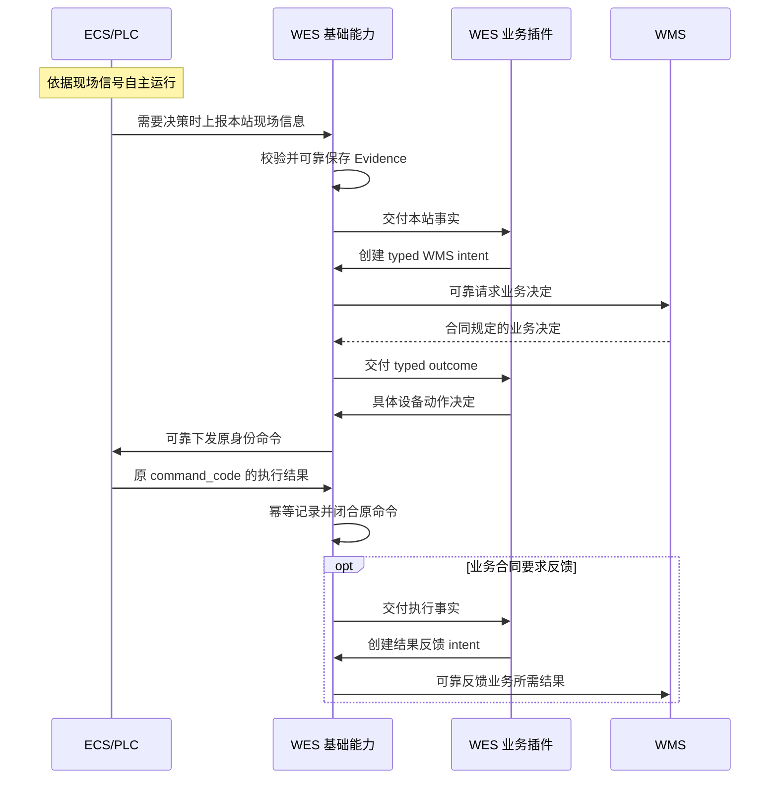

# 点位事件驱动、执行恢复与 WMS 对账顶层设计

日期：2026-09-10

状态：用户已确认职责边界与两条恢复目标，CEO 与工程方案评审已收敛；具体机器合同及实施切片按[实施计划](../plans/2026-09-10-station-driven-execution-recovery-implementation-plan.md)推进。不是代码交付、供应商符合性或现场验收证据。

CEO 顶层评审完成（HOLD_SCOPE）：D1 采用现有能力内统一收敛全部相关消费者的 B 方案；D2 保持范围；D3 已确认双方校验本站请求与指令适用性；D4 已确认精确归类旧异常；D5 已确认同轮闭合 WMS 可靠异常反馈；D6 已确认本站请求触发命令由 ECS 接纳接口裁决动态执行条件；D7 已确认明确可重试且未接纳时统一原身份有界重试。以上为设计决定，不表示具体合同已闭合或实施就绪。

## 1. 目标与适用范围

ECS 自主控制现场运行。需要业务决策时，ECS 向 WES 上报本站现场信息；WES 通过插件获取 WMS 的业务决定，并可靠下发具体指令；ECS 执行后上报原指令结果，WES 可靠记录并完成合同要求的业务反馈。最终业务数据对账由 WMS 负责。

WES 不因历史异常、原任务无响应或未完成业务对账，成为同一 ECS 交互点的新事件和后续正常任务的阻塞点。ECS 负责现场执行互斥，WES 负责本次必要业务授权和消息一致性；旧动作未知时禁止重发该旧动作，但不能仅据此封锁该交互点。

第一阶段只解决两条路径：

1. 排障后继续同一个 `task_id／command_code` 所指的原任务，正常结果到达后自动衔接。
2. 原任务异常或无响应，后续任务仍可进入同一 ECS 交互点并执行；后续任务正确执行后，原任务自动作为历史异常保留，最终业务对账交 WMS，不要求先取得原任务结束回调。

`task_id` 与 `command_code` 分别服从所属接口合同，不增加同义字段，也不把 WMS 业务任务和 DeviceCommand 合并成一个生命周期。

本设计主要针对点位事件与 DeviceCommand，不将流水线清障规则直接推广到 TransportTask、货架搬运或多对象交换。

## 2. 系统职责

| 系统/层级 | 拥有的职责 | 不承担的职责 |
| --- | --- | --- |
| ECS/PLC | 光感与现场信号处理、输送步进、设备互锁、原动作执行及恢复、设备状态和执行结果上报 | 自主创建 WES 业务任务、裁决库存和业务结果 |
| WES 基础能力 | 可靠接收、严格合同校验、幂等、证据保存、可靠义务、命令记录和唤醒；按所属能力合同管理资源 | PLC 逻辑、用旧任务异常锁住 ECS 交互点、具体业务判断和最终业务对账 |
| WES 业务插件 | 根据本站事实调用已批准 WMS operation，把封闭业务决定映射为具体动作，保存必要的本站业务关联 | 重建 HTTP、outbox、重试或锁框架；替 WMS 决定库存、替代路径及业务终态 |
| WMS | 业务单据、库存、分配、全局位置、业务决策、异常处置和最终数据对账 | 代替 ECS 提供物理动作完成事实 |

基础能力可独立部署、运行和测试；插件依赖基础端口与 SDK，宿主及 SDK 不导入具体插件。WES 保留技术诊断与可靠义务修复能力，但不建设第二套业务对账中心。

“记录结果”包括可靠落库、幂等及合同规定的 WMS 反馈，不等于仅写日志后丢弃业务反馈义务。

## 3. 正常交互



图中省略接收 ACK；ACK 的提交边界和同步/异步模式仍按各 operation 合同执行。自主输送段不额外创建 WES 逐箱推进命令。

## 4. 点位独立触发与最小关联

- 本站新事件以本站实际现场信息进入业务判断，不以“上一点任务正常结束”作为默认前置条件。
- 不重建全程 BinExecution、BinSession、运行代际或跨站执行链来追踪清障物料。
- 保留同一请求、同一命令的幂等关联及本站当前业务等待所必需的关联。重复事件不能产生重复物理动作；同一料箱合法再次到达不能被永久条码去重拦截。
- 不把历史 NG、历史失败或未完成对账直接套用到新到位对象。旧命令结果及旧 WMS 决定不能释放或改变新对象的动作。
- 点位决策确实需要业务信息时，必须在该点位获批的 WMS 交互或明确批准的业务合同中取得，不能猜测或默认放行。
- 既有跨点 NG 处置承接等依赖逐项评审：不符合目标的依赖删除；必要的信息来源先确定再实施，不能仅删除关联检查而保留依赖该信息的动作。
- 实际物理缓存 FIFO/LIFO 与点位业务触发分开建模。不能用点位独立作为越过未闭合物理队首的理由，也不能用整个业务任务的状态代替物理队列事实。

### 4.1 本站请求与指令适用性（D3 已确认）

命令身份幂等只证明同一命令不重复执行，不能证明首次到达的旧命令仍适用于本站当前对象。允许后续请求独立处理后，须覆盖旧 WMS 决定迟到，以及命令已发送但在网络或队列中延迟到达的情况。

- WES 在生成和派发动作前排除已知失效的本站请求对应的业务决定；失效决定保留证据，不转用于新对象。
- ECS 在接纳时按外部合同确认指令仍适用于其对应的本站请求；不适用时明确拒绝且不执行。执行互斥不能代替适用性判断。
- 请求关联优先复用现有身份；具体载体、失效判据和明确未接纳响应在设备合同细化时冻结，不在本文臆造字段或错误码。无法用已有合同表达时，只增加必要信息。
- 同一请求、同一载荷的技术重试保留原身份，不因网络重传而被视为新对象。不同请求乱序到达不能仅凭 WES 接收时间判定现场先后。
- 此规则只涉及本站请求与具体指令，不建立跨点料箱追踪，不要求人工确认，不规定 ECS 内部如何判断。

```text
ECS 本站请求 --> WES Evidence --> 插件 / WMS 业务决定
                                      |
                            WES 排除已知失效决定
                                      |
                          原身份命令 --> ECS 接纳校验
                                           |          |
                                        仍适用      已失效
                                           |          |
                                         执行      拒绝且不执行
                                           |          |
                                           +--> WES 可靠记录
```

本站事件或决定缺失、为空、不符合合同，不生成猜测性指令；WMS 调用失败由现有可靠义务处理，迟到决定仍须通过适用性检查。拒绝失效命令不能阻断本站其他有效请求。

#### 工程 D1：统一公开事件身份（已确认）

ECS 事件公共包络使用必填 `source_event_id`；同一设备来源下，每次新事件使用不同身份，同一事件重传保留身份和完整合同内容，设备重启不复用旧身份。WES 以设备来源与事件身份识别重复，校验同身份内容漂移并返回冲突；内容摘要只用于内容校验，不再替代该路径的事件身份。统一修订目前把该字段描述成已有公共字段的设备附录，删除被替换的摘要身份路径，不保留缺字段兼容。

本站事件触发的命令冻结并回传对应 `source_event_id`，ECS 在接纳时核对原请求仍适用。`task_id`／`command_code` 仍由 WES 创建，命令重试保留原身份与原内容；ECS 标识事件不等于自主创建 WES task。该关联属于公共基础合同，业务插件消费已验证的关联，不自行实现身份生成、摘要或传输机制。

不另建 `request_id`、BinSession 或跨点执行链。普通观察事件与非事件触发命令按其明确合同处理，不能给手工命令伪造来源事件；具体 DTO 联合及调用点迁移在工程切片中闭合。`source_event_id` 仅作身份，不根据其字面值、时间或大小推导事件先后、替代关系、物理完成或 WMS 对账完成。

验收覆盖同事件重传、同身份内容冲突、同料箱再次到达的新身份、设备重启不复用身份、旧指令首次迟到、命令重试关联不变。供应商边界验证与 WES 基础测试分别进行；本段是批准的目标合同，不表示当前 ECS 已符合。

#### 工程 D2：显式本站请求替代关联（已确认）

ECS 在新本站业务请求中，通过 `supersedes_source_event_id` 引用它明确替代的旧请求。该字段仅在存在真实替代关系时提供，随事件内容冻结；同一事件重传不得改变引用。关联必须指向同一交互点的业务请求，不能跨点、引用自身或形成循环。普通观察事件不凭此字段获得业务请求语义。

该事实表示旧请求不再适用于新的业务决定或指令，不证明旧动作失败、物料物理退出或库存变化。WES 保存新事件时保留替代依据，用于排除已知失效的旧决定；后续命令收到匹配的成功结果后，才将明确被替代的旧异常归为历史，并保存后续成功 Evidence 关联。旧结果接收及 WMS 反馈义务仍按原身份继续。

无替代引用时正常处理有效新请求，不要求人工确认，不按时间、条码、事件身份字面顺序或所有未完成记录推断替代。引用的旧事件尚未到达时保留关联事实，原事件后来到达仍须检查适用性；不能因为本地未找到旧记录就遗忘已收到的替代依据。一次引用不自动证明其他旧请求失效，关联不明的记录保留且不阻塞新请求。

复用已持久化事件及其关联，不新增全局序号、跨点执行链或清线平台。供应商负责自动给出真实关系；WES 验收覆盖新旧事件乱序、重复、无引用、同点有效并行请求、跨点或循环冲突，以及旧结果晚到。具体存储与事务校验随基础切片闭合。

#### 工程 D3：原命令保存历史归类依据（已确认）

采用原命令上的可空 `historical_success_evidence_id` 保存后续成功依据，结合工程 D2 的替代关联解释历史归类。原命令保留自己的执行状态及结果，不增加 HISTORICAL 终态或独立异常表。尚未归类不构成新请求准入条件；归类与迟到原结果的事务竞争必须验证，不能覆盖或遗失其中任一事实。

### 4.2 ECS 接纳时裁决动态条件（D6 已确认）

对于本站有效业务请求产生的指令，WES 不再以发送前查询 ECS 状态并验证 AUTO、IDLE、无活动命令或状态新鲜度作为额外派发前置条件。状态查询保留观察与诊断用途，其失败或旧快照不能单独阻止这条路径发送。

ECS 命令接纳接口负责在接纳时确认本站请求适用性、设备模式、执行互斥和现场互锁等动态条件；不可执行时按明确合同拒绝且不执行。WES 保留本次业务授权、命令身份和内容幂等、设备/合同绑定、派发期限及本地明确停用限制。取消预查询不是取消 ECS 互锁，也不是把请求发送视为已经执行。

现行设备白皮书和 `device_dispatch_service.py` 的强制预查询要求须同步替换。先逐项确定调用者归属，再修改共用准入路径；手工调试及其他动作按自身合同审查，不能直接套用本站事件触发规则。ECS 接纳行为必须由供应商边界验证，不能以 WES Mock 成功代替。不新增永久模式开关或兼容双路径，也不推广到 Transport。

### 4.3 明确未接纳时统一有界重试（D7 已确认）

ECS 明确返回合同约定的“可重试且未接纳”时，调试与正式执行复用同一基础重试语义：保留原 `task_id`／`command_code` 和指令内容，使用既有 `next_attempt_at`、派发期限及并发领取机制有界重试。不能把暂时忙且明确未接纳直接当成物理执行失败，也不另建重试队列。

每次尝试仍须满足 D3 的本站请求适用性；已知请求失效、明确不可重试或期限耗尽时停止发送并记录实际原因。到期未获接纳不能伪装成执行失败。已接纳、交付未知以及只有网络超时而没有明确未接纳事实的指令均不进入此重发路径。异常反馈按 D5 处理，不封锁无关有效请求。具体拒绝分类和重试期限沿用或修订唯一合同与配置入口，不新增调试专用语义。

## 5. 两条恢复路径

### 5.1 原任务继续

临时卡料、等待清障和暂停不构成最终执行失败。ECS 排障后继续原执行身份，WES 不换身份重发，不自行改变目标。原结果到达后复用 Evidence 应用与提交后唤醒完成处理。

命令已超时或交付未知时，WES 保留原身份和未知事实，禁止盲目重发该动作，仍接收合同允许的迟到结果；不将其转成同一 ECS 交互点的长期准入锁。不能因本地已经告警就拒绝有效原结果，也不能把所有对账记录无差别重新执行。

ECS 暂时故障却先报终态 FAILED、随后再报 SUCCESS 的语义必须在供应商接口处纠正；不为此增加终态覆盖或通用结果修订机制。

### 5.2 原对象待对账，后续正常处理

工人只按现场流程清障或取走物料，不增加 WES 的“对象退出确认”操作，也不要求先在 WES 登记异常位置。

纯自主输送段由 ECS/PLC 根据现场条件恢复。无论旧任务在 WES 中为 FAILED、RECONCILING 或无响应，后续有效业务请求均按本次现场事实和 WMS 决定处理；不先等待旧任务回调、人工关闭或对账。ECS 自行保证所接纳动作的执行互斥，WES 不绕过 ECS 明确的拒绝或互锁。

同一交互点后续任务正确执行后，WES 仅将能够通过本站请求关联确定属于已被替代处理的旧异常任务收敛为历史异常记录，不再作为该点位的当前阻塞。这里的“正确执行”以匹配后续任务身份的有效执行结果为依据，仅收到新事件或 ACK 不等于执行成功；新任务准入本身不等待这个成功结果，避免形成循环等待。

D4 已确认：历史异常归类不得仅按回调到达时间、本地任务创建时间或“所有未完成任务”批量处理。不得归类更新任务、其他交互点或仍有效的并行动作；无法确认对应关系的记录继续保留，但不阻塞新的有效请求。保存归类依据与后续成功证据关联，重复回调不重复归类；原任务结果接收与 WMS 反馈义务不因归类而停止。具体请求关联复用 D3 的本站合同，不增加跨点追踪或人工退出确认。

原任务已有 FAILED 结果时保留原失败；没有结果时保留“原结果未知、已观察到后续任务正常执行”的事实及关联证据，不伪造 ECS 的 FAILED 或 SUCCESS。异常记录从当前处理退出不等于原物理结果已确定，也不等于 WMS 已对账。

原业务异常按正式合同可靠反馈 WMS，由 WMS 处理最终去向、库存及单据。原结果迟到时仍按原身份保存和校验；不得影响新任务，不覆盖已确定终态，不重新触发旧动作。

D5 已确认：异常发生或按照既定期限确定结果缺失时，立即可靠保存并形成 WMS 异常反馈义务，不等待后续任务成功。后续成功只触发历史归类，不能成为 WMS 获知末件、停线或长期无后续任务异常的前提。

反馈明确区分“收到确定失败”和“尚未获得结果”，不以失败、到位或 NG 事实代替未知。迟到真实结果按批准的业务合同补充；同一消息身份不可修改载荷，不把补充事实伪装成原消息技术重试。WMS 接收 ACK 不等于完成业务对账。

未知事实、重复反馈与迟到补充的 WMS 合同是本轮交付必需项，优先复用已有所属业务交互；确实不能表达时才做最小补充，不新增通用异常平台。反馈继续复用 WmsConfirmation 等可靠基础能力，独立于本站当前任务和历史归类；WMS 暂不可用时保留义务并按合同重试，不锁住无关新任务。重试耗尽或合同拒绝必须可见并保留待处理义务，不静默视为已送达。

这里的“对象失效”仅表示原业务处理不能继续，不表示料箱被删除、库存为零或原动作成功。异常记录与交互点运行准入分离，不要求新增通用恢复引擎。

## 6. 异常恢复与状态展示

以下是三类不同语义，不要求新增三个状态机或通用状态表：

| 语义 | 更新依据 | 恢复规则 |
| --- | --- | --- |
| 当前设备/点位运行状态 | ECS 对该点位的最新有效状态 | 对应故障已解除时自动更新；仅另一点位正常不能证明本点设备恢复 |
| 原命令执行记录 | 原命令结果；同一交互点后续任务成功证据只用于历史异常收敛 | 保留原失败或结果未知，不以新任务成功推定旧任务结果 |
| 原对象业务对账状态 | WMS 的权威处置及合同规定反馈 | WMS 决定是否关闭；WES 无反馈来源时不得自行显示“已对账” |

下一个点位正常时，正常处理它自己的事件，不推定前一点位设备恢复。同一交互点新的有效业务请求不受旧任务异常或无响应阻塞；该点后续任务成功可使原未解决任务转为历史异常，但新任务结果不能充当旧命令结果。已有未解除的显式设备故障按 ECS 状态处理，不因单个成功结果一并清空所有告警。

后续业务事实可能使 WMS 判断原业务异常已经消除，该判断仍归 WMS。WES 不通过跨点事件推测对账完成。

界面不使用单一“异常/正常”同时代表设备、命令与业务状态。设备恢复后，历史失败仍可查询，但不继续作为当前设备故障展示；必要的未解决执行冲突仍明确可见。

## 7. WES 不成为无关阻塞点

允许阻塞本次动作的条件限于本次业务授权缺失、本次身份或内容冲突、ECS 明确拒绝或互锁，以及另有明确合同的物理队列约束。旧任务 FAILED、RECONCILING 或无响应本身不构成该 ECS 交互点的准入阻塞。

历史对象待 WMS 对账、其他独立点位失败、无关结果反馈尚在可靠重试，均不能直接成为本次动作的阻塞条件。确有共享业务资源或前序反馈依赖时，必须在具体插件合同中说明，不能统一假设完全无依赖。

基础层复用已有持久化及事务工具，保证：

- 请求明确未接纳时按合同原身份有界重试；交付未知不得换身份或自动重复物理动作。
- Evidence 已保存但尚未应用时，重启后继续处理。
- 事务提交后主动唤醒，后台补扫恢复遗漏，不以人工刷新作为正常入口。
- 取消“必须先关闭旧异常命令才处理新事件”的交互点准入条件；已有待处理事件只在仍适用于当前现场时重评，不直接重放旧动作。
- 重评必须确认本站当前业务关联和动作适用性；旧到位事件不能因解除阻塞而错误作用于后来到位的对象。
- WMS 反馈失败保留可靠义务并重试，不丢失；是否阻塞某个新动作由明确业务依赖决定。

WES 不能承诺在缺少必要 WMS 决策时仍自动产生指令，也不能仅凭光感变化或设备 IDLE 猜测原命令已终止。

## 8. 复用边界与协议补齐

复用 `DeviceCommand`、`InboundEvidence`、`WmsConfirmation`、typed WMS facade、现有事务工具、提交后唤醒和恢复扫描。已有 FAILED 不占命令槽只能覆盖部分场景；当前 RECONCILING 仍占 device_code 唯一槽，与本次目标冲突，不能声称已有实现满足要求。

实施前须统一修订 DeviceCommand 的准入服务、数据库唯一约束、派发并发与事件消费合同，将“同一命令不重复发送”和“旧异常记录不封锁后续请求”分开。不能仅删除数据库索引；ECS 对新动作的接纳及执行互斥责任必须明确。具体状态表示在工程评审时选取最小方案，不建立兼容双路径，不放宽 Transport 等其他能力的资源合同。

当前明确发现的阻塞事件重评缺口位于设备调试路径；各正式插件必须独立核对，不能用调试能力的修复代替业务验收。

协议细化必须闭合以下事项，本文不臆造 operation、字段或结果枚举：

| 项目 | 需要明确的合同事实 | 验证方式 |
| --- | --- | --- |
| 暂停与失败 | 临时故障不提前报不可修改终态；原动作恢复继续原身份 | 同一命令的正常恢复报文时间线 |
| 异常与后续执行 | 原任务无结果也可接纳后续任务；ECS 保证执行互斥，后续成功触发历史异常收敛 | 旧结果缺失、新请求、后续成功及原结果迟到的完整时间线 |
| 乱序与旧事件 | 新事件先到、原结果后到时，如何确认待处理事件仍适用于当前对象 | ECS 事件合同、现有身份字段及对应聚焦验收 |
| 迟到决定和指令（D3） | WES 排除已知失效决定，ECS 接纳时拒绝不适用于本站请求的指令；明确复用身份及拒绝响应 | 旧 WMS 决定晚于新到位、旧指令在途迟到、重复重试及请求乱序的供应商边界验收 |
| 动态接纳（D6） | 本站请求命令不依赖状态预查询；ECS 接纳时负责动态条件校验，明确拒绝响应和不执行保证 | 状态接口故障而命令接口正常、ECS 忙/互锁/模式不符、接纳时请求失效；本地停用与 WMS 授权仍受验证 |
| 明确未接纳的重试（D7） | 调试与正式执行统一原身份、原内容、有界重试；不混同交付未知或已经接纳 | 临时忙后恢复、期限耗尽、重试前请求失效、重复 worker 领取及响应丢失 |
| WMS 异常闭环（D5） | 同轮明确异常及时反馈、未知事实、重复接收及迟到结果补充；不等待后续成功，不混同接收与对账完成 | WMS operation 合同评审与独立接收验收，缺失则最小补齐；不以成功到位/NG 上报承接未知 |
| 业务信息来源 | 删除跨点关联后，本点分流等业务决定从何取得 | 逐点业务决定输入清单和 WMS 合同 |

ECS 的光感组合、内部步骤、PLC 程序和私有协议不进入 WES 实现。供应商可以内部调整，但必须满足外部结果及事件合同。

## 9. 与现有真源的关系及归档

本文是点位事件驱动与恢复职责的目标设计补充，不替换全部最小执行架构。用户已确认的职责目标用于后续设计收敛；下列具体合同在细化时同步替换冲突条款，未完成前不得宣称当前接口已经符合目标。

| 当前文档 | 收敛范围 |
| --- | --- |
| [最小执行架构](2026-07-31-wes-minimal-execution-architecture-convergence-design.md) | 异常隔离范围、WES 技术诊断与 WMS 业务对账的边界；其余有效基础架构保留 |
| [站点驱动 SPEC](2026-09-06-bin-code-and-station-driven-flow-design.md) | 保留全程实体退役；审查跨点依赖与本站待处理动作生命周期 |
| [人工出库合同](../../contracts/wms-manual-outbound-picking-integration-requirements.md) | 保留 ECS/PLC 自主步进；审查 point2→point3 处置依赖及新事件准入 |
| [设备统一白皮书](../../integration/third_party_integration_whitepaper.md) | 原命令结果、事件、状态及重试的严格外部语义 |
| [稳定性总计划](../plans/2026-09-09-stability-recovery-master.md) | 复用可靠机制与证据；本次新增的业务恢复目标不能被历史通过记录代替 |

Transport 保持自身确定结果、成员位置和资源围栏合同，本次不修改或推定放宽。当前已有未提交的 Transport 变更不属于本次文档整理。

上述文档仍承担其他有效范围，本次不整篇归档。后续完全替代的过程文档在更新引用后，保留原名和完整内容移至 `../archive_docs/wes_backend/`，不覆盖重名文件，项目内不留副本、占位或软链接。`docs/hardware/` 原始资料保留。

## 10. 验收标准与实施顺序

| 验收场景 | 必须观察到的结果 | 主要所有者 |
| --- | --- | --- |
| 原动作排障恢复 | 同一身份完成，无等价重复动作；无需 WES 手工恢复点击 | 基础命令机制；ECS 边界另做真实验收 |
| 原对象清除或旧任务无响应 | 不等待旧命令回调，新对象完成业务决策及执行；原任务自动作为历史异常保留并可靠反馈 WMS | 基础准入、插件与 WMS/ECS 联调分别验收 |
| 同点后续任务成功 | 旧 FAILED 保持失败、旧未知保持未知；二者退出当前任务阻塞，不伪造旧终态 | 基础命令记录及展示消费者 |
| 迟到成功回调触发归类（D4） | 只归类有本站请求依据的旧异常，不影响更新任务、其他点位或有效并行动作；关联不明不阻塞新请求，重复归类幂等 | 基础关联及插件消费者分别验收 |
| 旧结果晚于后续成功 | 只保存和处理原任务证据，不重发旧动作、不影响新任务或覆盖确定终态 | 基础身份、结果合同及插件消费者 |
| 旧决定或旧指令迟到（D3） | 已知失效决定不派发；已在途的失效指令由 ECS 拒绝；重复技术重试保持原身份，新对象不执行旧决定 | 插件、基础派发和供应商边界分别验收 |
| 状态查询故障与动态拒绝（D6） | 状态查询失败不阻断有效本站命令；ECS 不满足动态条件时明确拒绝且不执行，WES 正确保存接纳事实；本地停用仍有效 | 基础派发、插件授权与供应商边界分别验收 |
| 明确未接纳后重试（D7） | 调试与正式入口均在期限内使用原身份原内容重试；失效或到期停止；交付未知不自动重发，旧重试不阻塞无关新请求 | 基础派发与供应商接纳边界分别验收 |
| 旧业务长期未对账 | 只保留相关异常，不阻塞无关正常请求 | 插件 |
| 末件或停线异常（D5） | 没有后续任务也可靠形成 WMS 反馈义务；未知不伪造成失败或 NG | 插件事实解释与基础可靠反馈分别验收 |
| WMS 未接收或迟到补充（D5） | 失败保留义务且可见；重试同身份同内容，真实迟到结果依合同补充；历史归类不取消反馈 | 基础可靠义务、业务合同与 WMS 边界分别验收 |
| 下一点正常 | 处理本站事件，不伪造上一点恢复、旧命令成功或业务对账完成 | 插件及展示消费者 |
| 同一点恢复 | 最新有效状态恢复展示；历史失败可查，无历史异常永久封锁 | 状态基础能力与展示消费者分别验收 |
| 重复、乱序、迟到事件 | 不重复动作，不把旧指令/决定作用到新对象；必要阻塞解除后自动重评 | 基础幂等与插件关联分别验收 |
| WES 中断重启 | 已保存的 Evidence 和可靠义务恢复，未知物理动作不盲目重发 | 基础能力 |
| WMS 暂不可用 | 结果反馈可靠保留；需要新业务决定的动作等待，无关自主输送不被 WES 新增锁阻断 | 基础可靠义务与插件准入分别验收 |

先细化冲突合同及两条供应商时序，再冻结生产符号、调用点、测试所有权和变更风险，随后按内聚切片实施基础恢复、插件准入和界面状态语义。

实现遵循 DRY、KISS、SOLID、YAGNI；不新增全程生命周期、通用站点引擎、WES 对账平台、兼容路径或推测性状态。替换旧路径时一次性迁移全部消费者并删除无用代码。

本次纯文档只做内容、链接、结构和 diff 检查，不创建或修改测试代码。后续高风险行为变更按 TDD，优先完善现有测试。基础测试不依赖具体业务插件；插件测试不代替基础能力独立验收。代码通过、部署成功、供应商符合性及现场业务验收分别记录。

## 11. 资料依据与适用限制

- [Interroll ZoneControl 官方说明](https://www.interroll.com/products/controls/zonecontrol)：区域控制及上下游通信支持输送层自主运行；不证明现场 ECS 已实现指定接口。
- [SEW ECDriveS 官方手册，§2.6，第 19–24 页](https://download.sew-eurodrive.com/download/pdf/33094179.pdf)：分区传感与驱动、区域流转及堵料控制，为设备控制职责提供参考；不把其中的控制参数或算法移植到 WES。
- [OPC Foundation PackML 状态模型](https://reference.opcfoundation.org/specs/OPC-30050/6)：暂停、恢复执行与完成是不同语义；只借鉴语义区分，不引入完整 PackML 状态机。
- [厂商流水线接口资料](../../hardware/SMT流水线接口调用说明书20260320-v1.md)：分别描述原命令结果与到达、离开、扫码事件；人工清障后的原命令结束保证尚须供应商证据确认。

外部资料支持职责划分；具体实现以批准的 WES 合同和供应商边界验收为准。本设计不声称现有现场系统已满足全部恢复目标。

## 12. CEO 评审收敛记录

### 范围、复用与目标差距

本轮不纳入：ECS 内部控制算法（供应商所有）、WMS 对账平台（WMS 所有）、跨点物料全生命周期（超出本站决策目标）、新队列或恢复框架（已有可靠机制）、Transport 资源合同放宽（不同能力）、兼容双路径（未发布系统）。未提出额外延期 TODO，不修改无关 `TODOS.md`。

复用 `DeviceCommandService` 的原身份与内容校验、命令仓储的单条领取及 `skip_locked`、Evidence 持久化与迟到结果处理、提交后唤醒及既有恢复扫描、`WmsConfirmation` 可靠反馈，以及前端持久化历史与 SSE 合并。D1 要求逐个闭合实际消费者；这些基础能力的存在不等于插件已经满足新设计。

目标是现场人员清障后正常生产能够继续，WES 保存可解释的执行事实，WMS 完成最终业务对账。当前差距是第 8 节列出的合同、基础准入约束及消费者尚未按新目标改造；本轮不预建未来一年可能需要的平台能力。

### 错误与恢复登记

下表覆盖本次改变的执行边界，描述目标处理方式；“已有”只表示存在机制，所有新增语义仍须实施验收。异常类型不是拟新增状态或错误码。

| 路径与异常/结果 | 现状与设计处理 | 可观察结果与验证所有者 |
| --- | --- | --- |
| `DeviceCommandService.create`：`DeviceNotFoundError`、`DeviceContractMismatchError`、`DeviceCommandDeadlineError` | 保留严格绑定及期限校验；拒绝本请求，不猜测动作 | 有明确拒绝原因；基础服务测试 |
| 命令创建：`DeviceCommandIdentityConflictError`；Evidence：`DeviceEvidenceConflictError` | 同身份内容漂移拒绝，不覆盖原记录 | 原身份可追溯；基础幂等测试 |
| 命令创建：`DeviceCommandCapacityError`；事件重评：`EventCommandBlockConflictError` | D1/D4 替换旧异常占用整设备的条件；实际本地停止及必要业务依赖保留 | 后续有效请求继续，旧异常可查；基础、插件分别测试 |
| `dispatch_one` 状态查询：`EcsStatusUnavailableError`；准入：`DeviceCommandAdmissionError` | D6 取消本站请求命令的强制动态预查询；本地绑定、停用等仍有效 | 状态服务故障不单独阻止命令；基础及供应商验收 |
| ECS 提交：`RETRYABLE_NOT_ACCEPTED` | D7 消除调试直接失败、正式入口重试的语义分叉 | 原身份有界重试；失效/到期可见；基础派发测试 |
| ECS 提交：合同拒绝、在途断网或无可信响应 | 不可重试拒绝停止；交付未知保留事实，不重复动作 | 明确拒绝与未知分开展示、按 D5 反馈；基础及供应商验收 |
| ECS 解码：`UnicodeDecodeError`、`JSONDecodeError`、`TypeError`、`ValueError`、`ValidationError` | 复用适配器校验；不能由响应解析失败推定未接纳 | 保存合同/交付诊断；适配器合同测试 |
| `accept_result`：`UnknownDeviceCommandError`、`DeviceResultConflictError`、`DeviceResultOutOfOrderError` | 保留原命令关联及冲突处理，不用新任务身份接收旧结果 | 原结果证据可查，不覆盖确定终态；Evidence 测试 |
| WMS 反馈：`WmsConfirmationIdentityConflictError`、`WmsConfirmationResponseConflictError` | D5 复用可靠义务；原消息内容不可变，迟到补充按合同另行表达 | 未送达义务和冲突可见；基础、operation、插件分别测试 |
| 提交后唤醒/SSE 发布失败，worker 中断 | 既有边界捕获 `Exception` 并 `logger.exception`；持久化事实不依赖通知成功，复用恢复扫描和历史读取 | 重启不丢义务、页面可刷新；持久化/真实 worker 与前端分别验证 |

派发端点异常、WMS Adapter 异常中的宽泛捕获属于工程审查点：修改所覆盖路径时确认提交前后阶段、实际异常及持久化结果，不能把未知异常统一映射为“未接纳”。不以本次文档评审宣布现有所有异常分支已通过测试。

### 数据流、状态与故障路径

```text
本站请求 -> 严格校验/幂等 -> Evidence 提交 -> 插件/WMS 决策
   无效 --------> 拒绝          |                | 失败/无响应
   重复 --------> 原记录        |                v
                               |          原可靠义务等待/恢复
                               v
                      D3 适用性 -> 原命令持久化 -> ECS 接纳
                          失效 -> 停止            | 未接纳可重试 -> D7
                                                  | 交付未知 -> 留证，不重发
                                                  v
                                              原命令结果
                                                  v
                              Evidence/业务事实 -> WMS 可靠反馈
                                                    未送达 -> 保留义务

原命令：已接纳 -> 暂停/未知 -> 同身份真实结果 -> 确定终态
独立新请求：有效 -> 决策 -> 接纳 -> 结果（不等待旧命令闭合）
旧异常：当前异常 -> 有 D4 依据的历史异常（失败/未知事实不变）
WMS 对账：由 WMS 决定；不由上述分类转换推导
```

主要失败模式已映射到第 10 节验收：旧指令迟到（D3）、错误归类（D4）、末件异常未反馈（D5）、状态快照阻塞（D6）、暂时未接纳直接失败（D7）、重复/乱序/崩溃恢复（既有可靠机制）。均有目标救济、证据展示和测试所有者，当前没有以“静默忽略”为方案的分支；不宣称这些验收已执行。

### 工程检查边界

| 评审面 | 结论及实施核验 |
| --- | --- |
| 安全 | 局域网范围不引入新认证平台或安全项目；沿用严格 DTO、对象关联、权限和拒绝机制。无新增顶层问题 |
| 数据流与代码质量 | D1、D3、D4、D7 已覆盖并发、乱序及重复语义；基础机制只实现一次，插件拥有业务解释。无额外设计决定 |
| 测试 | 第 10 节为行为矩阵；复用现有基础与插件测试，数据库约束/事务和 worker wiring 分别用实际环境验证。本轮纯文档不写、不跑测试 |
| 性能 | 复用单条领取、有限批次、分页与期限；工程评审须核对替换索引后的查询计划。主要慢路径为 WMS 决策、ECS 接纳、积压义务恢复；无实测数据，不编造 p99 或提前加缓存 |
| 可观察性 | 用原请求、命令、Evidence 和反馈义务关联重建经过；当前设备状态、历史异常、WMS 对账分开。沿用日志和诊断页，不增仪表盘平台 |
| 发布 | 新旧合同与数据库约束混用是切换风险；依项目未发布规则整体切换，不建兼容模式。真实未知动作不得随开发数据清理而丢弃 |
| 长期维护 | 文档决定可逆性 4/5；实际命令发出不可视为可逆。删除替代的分支及无用代码，文档随实际适用范围归档；没有新增延期债务项 |
| 界面 | 复用诊断页及 `DESIGN.md`；历史未知不展示为当前设备持续故障，也不展示为已对账。加载、空列表、错误、部分实时记录继续沿用既有处理 |

```text
验收所有权
  基础命令/Evidence/重试 -> 单元 + 数据库事务/并发测试
  WMS wire/可靠义务      -> operation 合同 + 持久化测试
  插件本站决定/反馈      -> 插件自己的行为测试
  worker 恢复/唤醒       -> 仅触及 wiring 时运行真实 worker
  ECS 适用性/接纳/恢复   -> 供应商边界真实验收
  WMS 最终对账           -> WMS 联调验收
  界面历史与当前状态     -> 前端聚焦测试 + 浏览器 QA

诊断页 -> 加载 -> 当前设备状态 + 命令/Evidence 列表 -> 原身份详情
              -> 空记录 / 加载失败可重试 / 实时部分记录可刷新
         历史分类变化只改变归类，不把未知结果改成成功

切换：合同冻结 -> 停止新触发并核清在途事实 -> 停旧相关进程
     -> 迁移约束/部署同一合同版本 -> 重启相关进程 -> 分层验收
失败：停止新触发 -> 保留在途事实 -> 数据/合同是否允许旧版？
                                  是 -> 恢复匹配版本并验证
                                  否 -> 修复前进，禁止盲启旧版
```

上述切换仅给出原则，具体命令由实施/发布计划确定，本次没有部署授权。图示检查：本文架构及适用性图与 D1–D7 一致；两份旧设计仅加适用范围提示，未改动仍有效的历史图，不按旧图约束新本站执行语义。

## Implementation Tasks

以下为评审发现对应的任务边界，具体合同未冻结前不是可直接执行的补丁计划。估时仅含工程工作，不含供应商/WMS 等待。

- [ ] **T1（P1，人类团队约 1–2 天 / Agent 约 2–4 小时）**：闭合 D3、D5、D6、D7 外部合同。文件范围为设备白皮书、所属 WMS operation 合同和第 8 节冲突文档；验证两条恢复时序、失效拒绝、未知反馈及重试分类，禁止猜测字段。
- [ ] **T2（P1，人类团队约 2–3 天 / Agent 约 4–8 小时）**：按 D1/D4 收敛基础准入、命令约束和原结果处理。范围为 `src/app/device/`、对应迁移及 `tests/runtime/device_command/`；验证同点独立新请求、精确归类、重复和乱序，闭合实际数据库/HEAVY 所有权。
- [ ] **T3（P1，人类团队约 1–2 天 / Agent 约 3–5 小时）**：按 D6/D7 统一派发与恢复。范围为现有派发、适配器及对应测试；验证无强制状态预查询、明确未接纳有界重试、未知不重发、崩溃恢复，复用现有 worker。
- [ ] **T4（P1，人类团队约 2–3 天 / Agent 约 4–8 小时）**：按 D1/D3/D5 闭合全部实际插件消费者与 WMS 反馈。范围为 `workline_plugins/`、所属 `wms_adapter/` 和 `wms_integration/`，仅在所需方向/持久化范围修改；验证末件异常、WMS 不可用、迟到结果及无关任务继续。
- [ ] **T5（P1，人类团队约 1 天 / Agent 约 2–4 小时）**：落实 D4 的当前/历史展示并完成分层验收。范围为前端设备诊断消费者、对应测试及当前合同引用；验证错误/空/部分记录和迟到更新，分别记录基础、插件、供应商与 WMS 结果，退出被替换的旧代码及过程文档。

安全、性能、长期维护检查未新增独立任务；相应必要约束由上述任务验收，避免重复建设。

## 13. 工程评审结论与实施入口

用户逐项接受工程 D1、D2，并以“全部接受你的推荐”授权采用工程 D3 及同一范围后续推荐，未授权本轮修改生产代码或部署。

已形成[本站驱动执行恢复实施计划](../plans/2026-09-10-station-driven-execution-recovery-implementation-plan.md)，按 S0–S6 顺序闭合合同、基础事件、命令、观察反馈、实际插件、界面与分层验收。工程 D4–D8 的核心决定为：

- 按初始事件关联独立本站执行，取消未关闭物料 trace 作为跨点准入唯一锁；真实物理队列和 Transport 资源围栏不随之放宽。
- 本地未知/未接纳以独立 `DEVICE_OBSERVATION` 事实可靠持久化，不伪造 ECS 结果；新增最小粗分观察反馈 operation，继续复用 WmsConfirmation。迟到真实结果形成独立反馈义务。
- 明确临时未接纳可在原身份下重新评估，已 ACK 的接纳事实不回退；失效与执行禁止有封闭拒绝分类，不把不可信响应当作未接纳。
- 粗分出口使用自己的有效到位请求，WMS 按本站物料事实提供业务决定；不因上一点异常拒绝请求，也不由上一点结果驱动纯自主输送。
- 同步数据库、SDK、正式插件和诊断消费者；以已有测试承接新语义，真实 PostgreSQL/worker 与供应商/WMS 分开验收。其他两类插件当前没有已实现设备业务 Handler，不虚报完成。

完整工程检查覆盖架构、代码质量、测试及性能。8 项工程决定均已纳入计划；测试缺口有明确 owner 和失败验收，不代表测试已通过。未新增延期 TODO 或通用平台；当前相关文档仍承担执行或合同职责，不提前整份归档，硬件资料保留。

## GSTACK REVIEW REPORT

本轮：2026-09-10，`develop` / `138b299b`，目标为本文未提交的文档快照。HOLD_SCOPE，D1–D7 均由用户明确选择；0 个范围扩张，0 个新增 TODO。CEO 的 11 个评审面及工程的 4 个评审面已检查；T1–T5 已细化为关联计划的 S0–S6。具体机器合同在 S0 冻结，供应商及 WMS 实现另行验收。文档检查不代替行为测试。

| Review | Trigger | Why | Runs | Status | Findings |
| --- | --- | --- | --- | --- | --- |
| CEO Review | `/plan-ceo-review` | 范围及职责边界 | 1 | CLEAR（顶层） | 7 项决定已记录；无未处理的顶层缺口 |
| Outside Voice | 技能默认预检 | 独立意见 | 0 | SKIPPED | 当前运行于 Codex，按技能跳过嵌套同系统评审；无跨模型结论 |
| Eng Review | `/plan-eng-review` | 合同、事务、测试及切片 | 1 | CLEAR（方案） | 工程 D1–D8 纳入 S0–S6；实施前冻结机器合同与实际影响清单 |
| Design Review | `/plan-design-review` | 当前状态与历史异常展示 | 0（本文） | NOT RUN | 界面语义需纳入前端实施评审 |
| DX Review | `/plan-devex-review` | 二次开发可读性 | 0（本文） | NOT RUN | 本轮已检查职责、复用及简单性，未执行独立 DX 评审 |

**VERDICT:** CEO 与工程方案评审完成，按关联实施计划推进；尚未实施、提交或部署，不构成供应商符合性或现场业务验收。

NO UNRESOLVED DECISIONS
