# 系统能力 vs 插件能力边界

## 核心原则

**插件开发者只关注业务逻辑，框架提供所有系统级能力。**

---

## 能力分层图

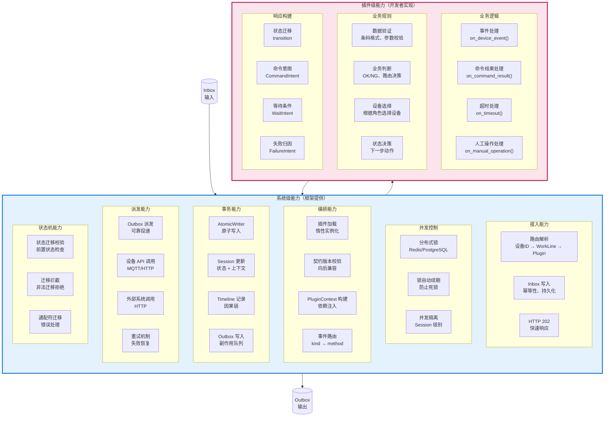

---

## 详细对比表

| 能力维度 | 系统级能力（框架） | 插件级能力（开发者） |
|---------|------------------|-------------------|
| **接入** | ✅ 路由解析、Inbox 写入、HTTP 202 | ❌ 不关心 |
| **并发** | ✅ 分布式锁、自动续期、Session 隔离 | ❌ 不关心 |
| **事务** | ✅ AtomicWriter、原子写入、因果链 | ❌ 不关心 |
| **派发** | ✅ Outbox 派发、设备 API、重试 | ❌ 不关心 |
| **状态机** | ✅ 状态校验、迁移拦截 | ⚠️ 声明迁移意图（transition） |
| **设备拓扑** | ✅ 解析设备角色 → 设备 ID | ⚠️ 选择设备角色 |
| **事件路由** | ✅ Inbox.kind → 插件方法 | ❌ 不关心 |
| **Payload 解析** | ✅ 自动解析、Pydantic 验证 | ⚠️ 定义 Schema |
| **日志** | ✅ 自动注入 session_id、correlation_id | ⚠️ 调用 ctx.logger |
| **业务逻辑** | ❌ 不关心 | ✅ 条码验证、OK/NG 判断 |
| **业务规则** | ❌ 不关心 | ✅ 路由决策、设备选择 |
| **异常处理** | ✅ 框架异常捕获、Inbox 失败标记 | ⚠️ 业务异常返回 FailureIntent |

**图例**：
- ✅ 完全由框架提供
- ⚠️ 开发者声明/使用，框架实现
- ❌ 不关心/不负责

---

## 插件开发者需要做的 vs 不需要做的

### ✅ 需要做的（业务逻辑）

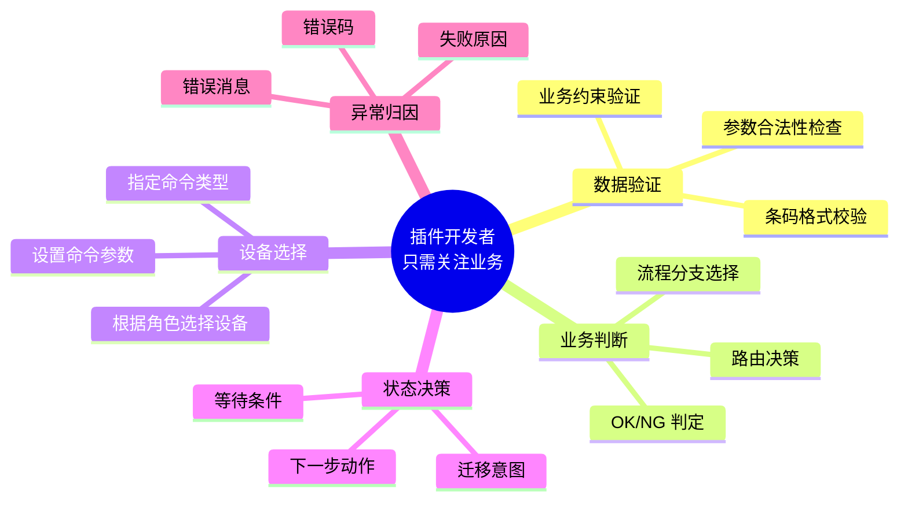

### ❌ 不需要做的（系统能力）

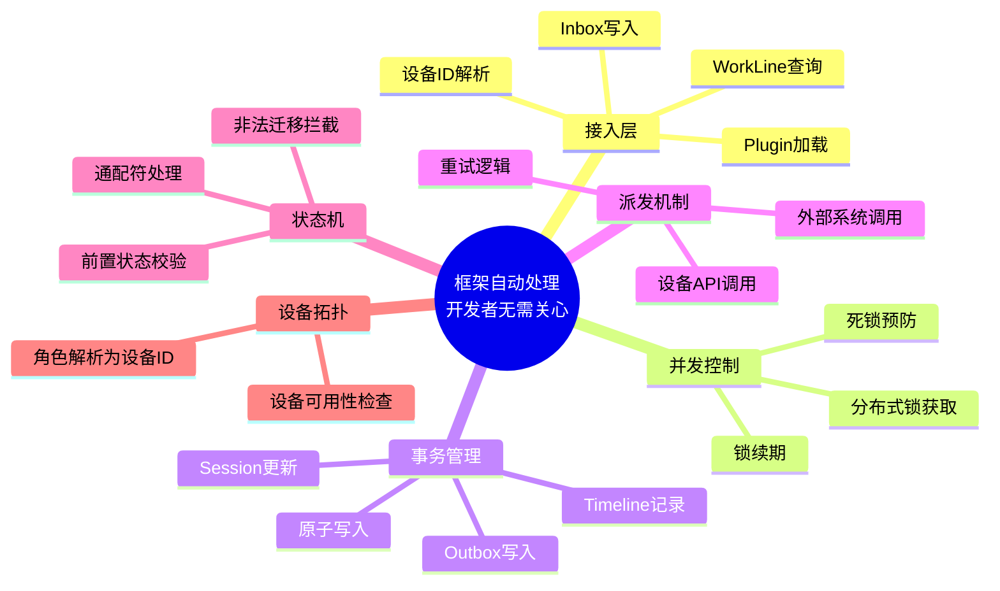

---

## 代码对比：传统方式 vs 简化方式

### 传统方式（需要关心系统级细节）

```python
class SmtClassifierPlugin:
    async def on_device_event(self, ctx, inbox):
        # ❌ 开发者需要关心：Payload 解析
        payload = inbox.payload_json or {}
        device_code = payload.get("device_code")
        barcode = payload.get("barcode") or payload.get("data", {}).get("barcode")
        
        if not device_code or not barcode:
            # ❌ 需要手动构建错误响应
            result = PluginResult()
            result.failure = FailureIntent(
                domain="DATA",
                code="MISSING_FIELD",
                message="缺少必要字段"
            )
            return result
        
        # ✅ 业务逻辑：验证条码
        if not self._validate_barcode(barcode):
            result = PluginResult()
            result.transition = "scan_ng"
            result.failure = FailureIntent(
                domain="DATA",
                code="BARCODE_NG",
                message=f"条码格式错误: {barcode}"
            )
            return result
        
        # ❌ 需要关心：设备拓扑解析
        devices_by_role = ctx.devices_by_role
        input_arm = devices_by_role.get("INPUT_ARM", [])
        if not input_arm:
            result = PluginResult()
            result.failure = FailureIntent(
                domain="ORCHESTRATION",
                code="DEVICE_NOT_FOUND",
                message="未配置 INPUT_ARM 设备"
            )
            return result
        
        device = input_arm[0]
        
        # ❌ 需要关心：设备 ID 解析
        result = PluginResult()
        result.transition = "scan_ok"
        result.commands = [
            CommandIntent(
                target_device_id=device.id,  # 手动解析
                action="PICK_AND_PUT",
                parameters={"barcode": barcode}
            )
        ]
        result.context_patch = {"last_barcode": barcode}
        return result
```

**问题**：
- ❌ 大量系统级细节（Payload 解析、设备拓扑、设备 ID）
- ❌ 样板代码过多（~40 行中只有 5 行是业务逻辑）
- ❌ 容易出错（手动解析、错误处理）

### 简化方式（只关心业务逻辑）

```python
class SmtClassifierPlugin(WorklinePlugin):
    @on_event("SCAN_COMPLETED")
    @step("IDLE", "WAITING_INSPECTION")
    async def handle_scan(self, ctx, event: ScanEventPayload) -> PluginResult:
        # ✅ Payload 自动解析和验证（Pydantic）
        # ✅ 设备拓扑已注入 ctx.devices_by_role
        # ✅ 状态校验自动完成
        
        # ✅ 业务逻辑：验证条码（核心逻辑）
        if not self._validate_barcode(event.barcode):
            return (
                PluginResultBuilder(ctx)
                .transition("scan_ng")
                .failure(domain="DATA", code="BARCODE_NG", 
                        message=f"条码格式错误: {event.barcode}")
                .build()
            )
        
        # ✅ 业务逻辑：派发命令（设备角色自动解析）
        return (
            PluginResultBuilder(ctx)
            .transition("scan_ok")
            .command(
                device_role="INPUT_ARM",  # 框架自动解析为设备 ID
                command_type="PICK_AND_PUT",
                parameters={"barcode": event.barcode}
            )
            .context({"last_barcode": event.barcode})
            .build()
        )
```

**改进**：
- ✅ 只关注业务逻辑（验证条码、选择设备角色）
- ✅ 代码减少 70%（40 行 → 12 行）
- ✅ 类型安全（Pydantic 自动验证）
- ✅ 声明式（装饰器 + Builder）

---

## 系统能力注入机制

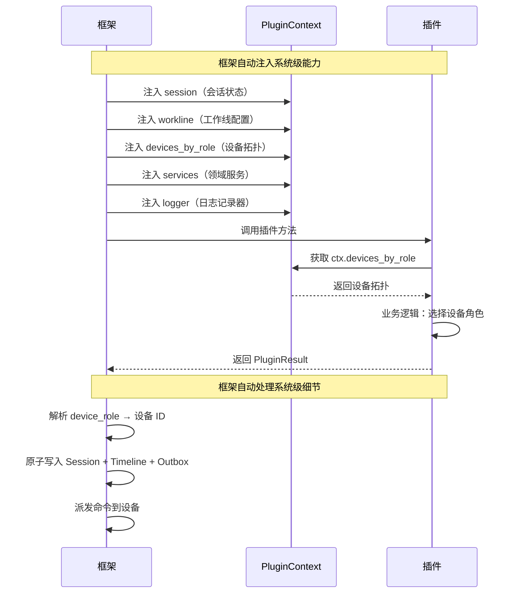

---

## 标准能力清单

### 系统级标准能力（框架必须提供）

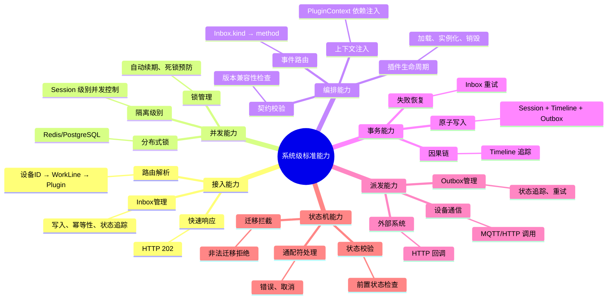

### 插件级业务能力（开发者实现）

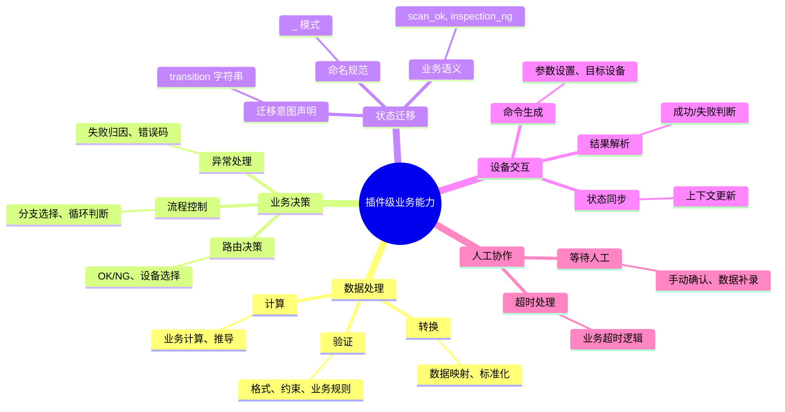

### Transition 字符串命名规范

**⚠️ 重要说明**：插件通过 `.transition(name)` 声明**迁移意图**，但**不直接操作状态机**。

#### 设计理念

```python
# ✅ 插件：声明业务意图（解耦）
.transition("scan_ok")        # "扫码成功"
.transition("inspection_ng")  # "检测失败"

# ❌ 不需要：引用状态机枚举（强耦合）
.transition(SmtClassifierStageMachine.Triggers.SCAN_OK)
```

#### 为什么使用字符串？

| 优势 | 说明 |
|------|------|
| **解耦** | 插件不需要知道状态机实现 |
| **灵活** | 可自由命名，支持业务语义 |
| **简洁** | 比枚举更易读、更直观 |
| **自主** | 插件开发者定义，无需注册中央列表 |

#### 推荐命名模式

| 模式 | 示例 | 使用场景 |
|------|------|----------|
| `<event>_ok` | `scan_ok`, `inspection_ok` | 事件处理成功 |
| `<event>_ng` | `scan_ng`, `inspection_ng` | 事件处理失败/NG |
| `<event>_<action>` | `pick_after_ng`, `conveyor_move` | 特定操作 |
| `<event>_timeout` | `scan_timeout`, `wait_timeout` | 超时处理 |

#### 命名最佳实践

```python
# 1. 小写 + 下划线
.transition("scan_ok")    # ✅ 清晰
.transition("SCAN_OK")    # ❌ 避免全大写

# 2. 体现业务语义
.transition("scan_ok")    # ✅ 自解释
.transition("t1")         # ❌ 无意义

# 3. 保持一致性
@on_event("SCAN_COMPLETED")
async def handle_scan(self, ctx, event):
    return PluginResultBuilder(ctx).transition("scan_ok")  # 对应

@on_event("INSPECTION_COMPLETED")
async def handle_inspection(self, ctx, event):
    return PluginResultBuilder(ctx).transition("inspection_ok")  # 对应

# 4. 特殊流程使用描述性名称
.transition("pick_after_ng")    # ✅ NG后的抓取
.transition("conveyor_ok")      # ✅ 流水线传输成功
```

#### 框架如何处理 transition 字符串

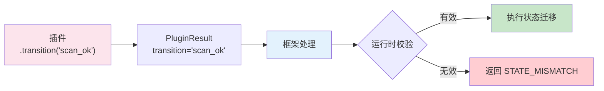

**关键点**：
1. **插件声明**：`.transition("scan_ok")` 只是声明意图
2. **框架验证**：运行时检查该触发器在当前状态下是否有效
3. **状态机执行**：如果有效，状态机执行迁移；否则返回错误
4. **解耦设计**：插件不知道状态机内部，只声明"我想触发 scan_ok"

---

## 框架设计的核心目标

### 1. 降低插件开发复杂度

| 维度 | 传统方式 | 简化方式 | 改善 |
|------|---------|---------|------|
| **代码量** | ~40 行/事件 | ~12 行/事件 | **-70%** |
| **样板代码** | ~35 行（Payload解析、设备拓扑、错误处理） | ~3 行（装饰器声明） | **-91%** |
| **学习曲线** | 需要理解 Inbox/Outbox、锁、事务 | 只需理解装饰器和 Builder | **大幅降低** |
| **错误率** | 高（手动解析、错误处理遗漏） | 低（自动验证、类型安全） | **显著降低** |

### 2. 提高代码可维护性

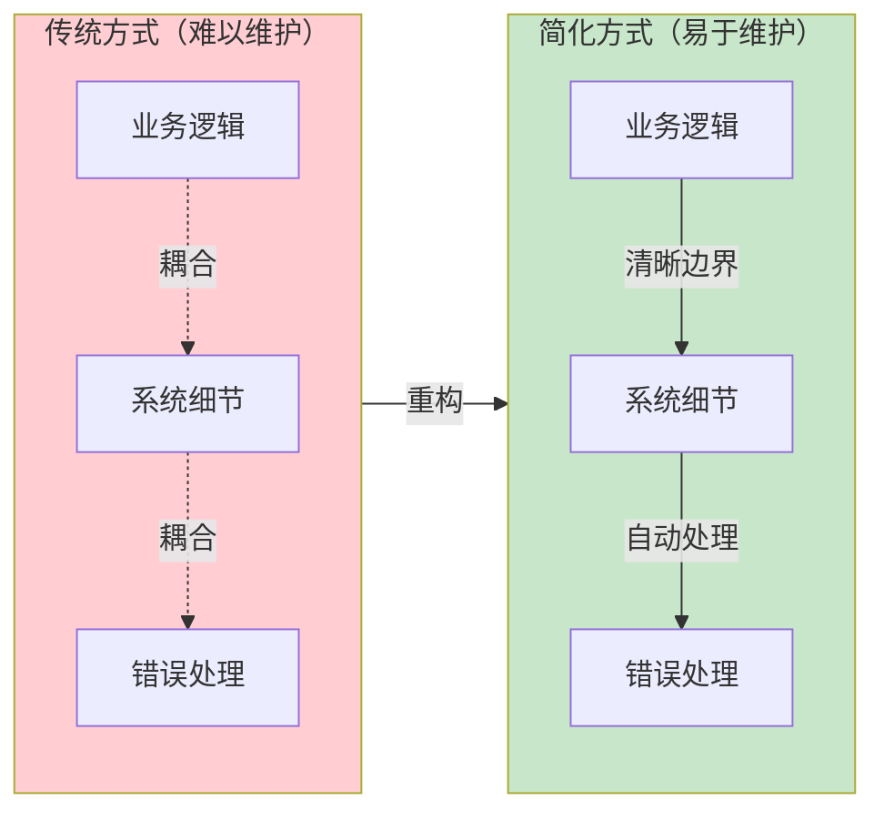

### 3. 提升开发效率

```mermaid
gantt
    title 插件开发时间对比
    dateFormat X
    axisFormat %s
    
    section 传统方式
    学习系统架构     :0, 3
    理解 Inbox/Outbox :3, 5
    实现业务逻辑     :5, 8
    调试系统问题     :8, 12
    
    section 简化方式
    学习装饰器      :0, 1
    实现业务逻辑     :1, 3
    单元测试        :3, 4
```

**时间节省**：12 天 → 4 天 = **-67%**

---

## 实施建议

### 1. 标准能力抽象清单

| 序号 | 能力 | 抽象方式 | 优先级 |
|------|------|---------|--------|
| 1 | 事件路由 | `@on_event()` 装饰器 | 🔴 高 |
| 2 | Payload 解析 | Pydantic 自动验证 | 🔴 高 |
| 3 | 状态机集成 | `@step()` 装饰器 | 🔴 高 |
| 4 | 响应构建 | `PluginResultBuilder` | 🔴 高 |
| 5 | 设备拓扑注入 | `PluginContext` | 🟡 中 |
| 6 | 分布式锁 | 框架自动管理 | 🟡 中 |
| 7 | 原子写入 | 框架自动处理 | 🟡 中 |
| 8 | 契约版本校验 | 框架自动校验 | 🟢 低 |

### 2. 渐进式迁移策略

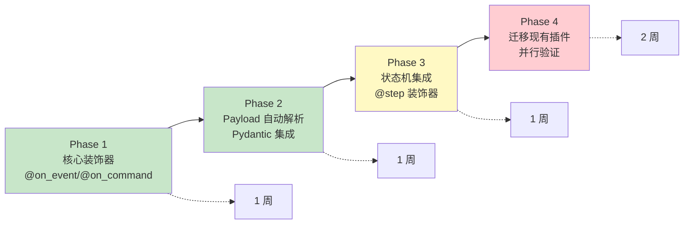

---

## 总结

### 核心原则

```
系统级能力 = 框架提供（开发者无需关心）
插件级能力 = 开发者实现（框架不干涉）
```

### 能力边界

| 系统级 | 插件级 |
|--------|--------|
| 路由、锁、事务、派发、状态机 | 验证、判断、决策、归因 |
| 基础设施 | 业务逻辑 |
| 通用能力 | 领域知识 |

### 最终目标

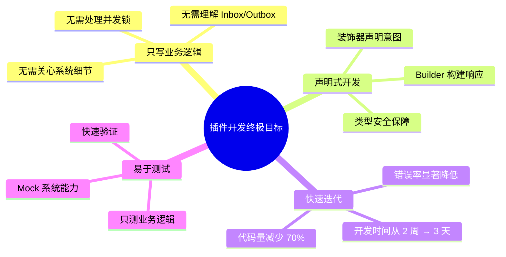

**您的理解完全正确！这正是插件框架设计的核心目标。**