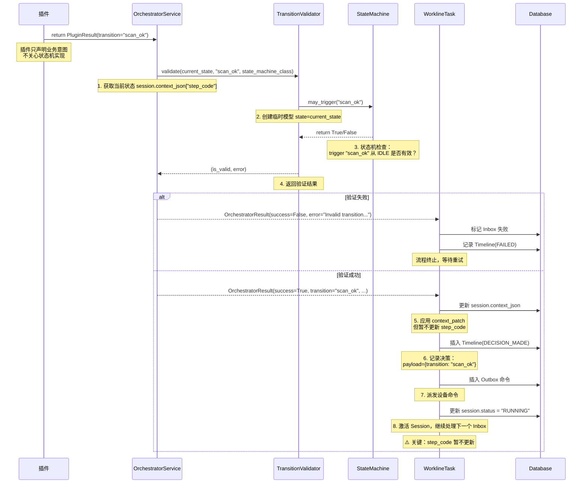
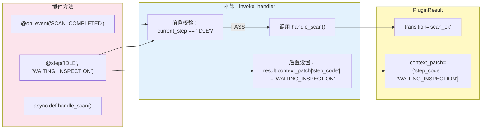
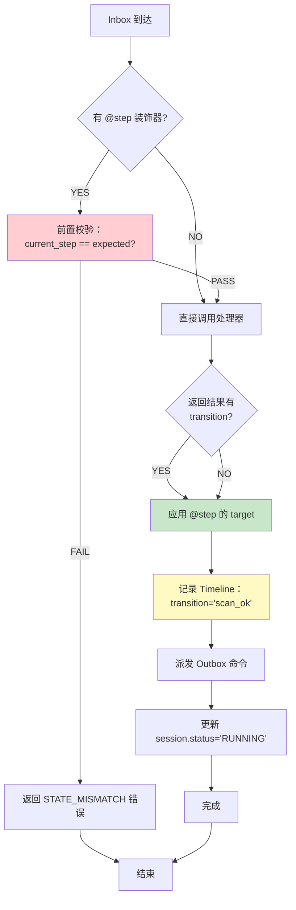

# Transition 字符串处理流程详解

## 完整调用链路

从插件返回 `.transition("scan_ok")` 到状态机完成迁移的完整流程：



## 关键发现

### ⚠️ 重要：简化插件框架不直接触发状态机

**传统插件**（使用状态机）：
```python
# 传统方式：状态机直接管理 step_code
state_machine.trigger("scan_ok")  # IDLE → WAITING_INSPECTION
# session.context_json["step_code"] 自动更新为 "WAITING_INSPECTION"
```

**简化插件**（装饰器框架）：
```python
# 简化方式：只声明意图，框架不调用 trigger()
.transition("scan_ok")  # 只是字符串，不直接触发状态机
# session.context_json["step_code"] 由 @step() 装饰器管理
```

### 简化插件的状态管理



**关键点**：
1. **`@step(expected, target)` 装饰器**：
   - `expected`：前置校验（IDLE）
   - `target`：目标状态（WAITING_INSPECTION）
   - 框架自动设置 `result.context_patch["step_code"] = target`

2. **`transition` 字段**：
   - 只是声明业务语义（"扫码成功"）
   - 不直接调用状态机
   - 用于 Timeline 记录追溯

3. **状态更新的实际来源**：
   ```python
   # src/workline_runtime/plugin_base.py:452-453
   target_step = getattr(handler, "_target_step", None)
   if target_step and not result.transition:
       result.transition = target_step  # ⚠️ 但这只是设置 transition 字符串

   # 真正的状态更新在 context_patch 中
   result.context_patch["step_code"] = target_step
   ```

## 为什么不直接调用 state_machine.trigger()？

| 设计选择 | 原因 |
|---------|------|
| **解耦** | 插件不需要知道状态机实现 |
| **灵活性** | 不同插件可使用不同状态机，或不用状态机 |
| **简化** | 装饰器 + Builder 比直接操作状态机更直观 |
| **追溯** | transition 字符串用于 Timeline 记录，保持业务语义 |

## 实际状态迁移流程



## 代码示例

### 插件代码

```python
@on_event("SCAN_COMPLETED")
@step("IDLE", "WAITING_INSPECTION")  # 期望: IDLE, 目标: WAITING_INSPECTION
async def handle_scan(self, ctx, event: ScanEventPayload):
    return (
        PluginResultBuilder(ctx)
        .transition("scan_ok")  # 业务语义声明
        .command(...)
        .context({"barcode": event.barcode})
        .build()
    )
```

### 框架处理

```python
# src/workline_runtime/plugin_base.py:_invoke_handler

# 1. 前置校验
if expected_step == "IDLE":
    current_step = ctx.session.context_json.get("step_code")
    if current_step != "IDLE":
        return PluginResult(failure=FailureIntent(...))  # 状态不匹配

# 2. 调用处理器
result = await handler(ctx, event)
# result.transition = "scan_ok"
# result.context_patch = {"barcode": "ABC123"}

# 3. 后置处理
if target_step := "WAITING_INSPECTION":
    # ⚠️ 关键：状态在 context_patch 中更新
    if not result.context_patch:
        result.context_patch = {}
    result.context_patch["step_code"] = target_step

# 4. 返回结果
# result.transition = "scan_ok"
# result.context_patch = {"barcode": "ABC123", "step_code": "WAITING_INSPECTION"}
```

### Task 应用结果

```python
# src/celery_app/tasks/workline.py:_apply_orchestrator_effects

# 1. 应用 context_patch
if orch_result.context_patch:
    session_ctx = _session_context(session)
    session_ctx.update(orch_result.context_patch)
    # session_ctx["step_code"] = "WAITING_INSPECTION" ✅
    _set_session_context(session, session_ctx)

# 2. 记录 Timeline
if orch_result.transition:
    await _add_timeline(db, timeline_generator.generate(
        payload={"transition": "scan_ok", ...}  # 用于追溯
    ))

# 3. 派发命令
for command in orch_result.commands:
    db.add(WorklineOutbox(...))

# 4. 更新状态
session.status = "RUNNING"
```

## 总结

### transition 字符串的作用

1. **业务语义声明**：`"scan_ok"` 表示"扫码成功"
2. **Timeline 追溯**：记录决策过程，便于调试和审计
3. **文档作用**：代码自解释，不需要额外的状态机文档

### 状态更新的实际来源

```python
# ❌ 错误理解：transition 直接触发状态机
state_machine.trigger("scan_ok")  # 简化插件不这样做

# ✅ 正确理解：@step 装饰器管理状态
@step("IDLE", "WAITING_INSPECTION")
# 框架自动设置 context_patch["step_code"] = "WAITING_INSPECTION"
```

### 设计优势

| 优势 | 说明 |
|------|------|
| **解耦** | 插件不需要导入状态机类 |
| **简化** | 装饰器比直接操作状态机更直观 |
| **灵活** | 可以使用任何状态机，或不用状态机 |
| **类型安全** | @step 在编译时声明状态迁移 |
| **追溯** | transition 字符串保留业务语义 |

## 进一步阅读

- **插件开发指南**：`plugin_development_guide.md` - @step 装饰器使用
- **系统能力边界**：`system_vs_plugin_capabilities.md` - transition 设计理念
- **状态机定义**：`src/workline_plugins/smt_classifier/state_machine.py` - SmtClassifierStageMachine
- **编排器源码**：`src/workline_runtime/orchestrator.py` - OrchestratorService
- **验证器源码**：`src/workline_runtime/transition_validator.py` - TransitionValidator
