# 工作线插件化编排完整流程

## 您的理解 vs 实际流程

### 您的理解

1. 【系统级】工作线设备上报事件, 通过设备获取所属工作线, 并获取该工作线关联的 plugin
2. 【系统级】ACK 流程, Inbox 流程
3. 【插件级】处理上报事件, 并通过设备拓扑获取下游设备
4. 【系统级】Outbox 流程, ACK 流程
5. 【插件级】处理 Outbox 事件
6. 如有需要, 重复 2~6

---

## 核心流程图（Mermaid）

### 1. 完整编排流程

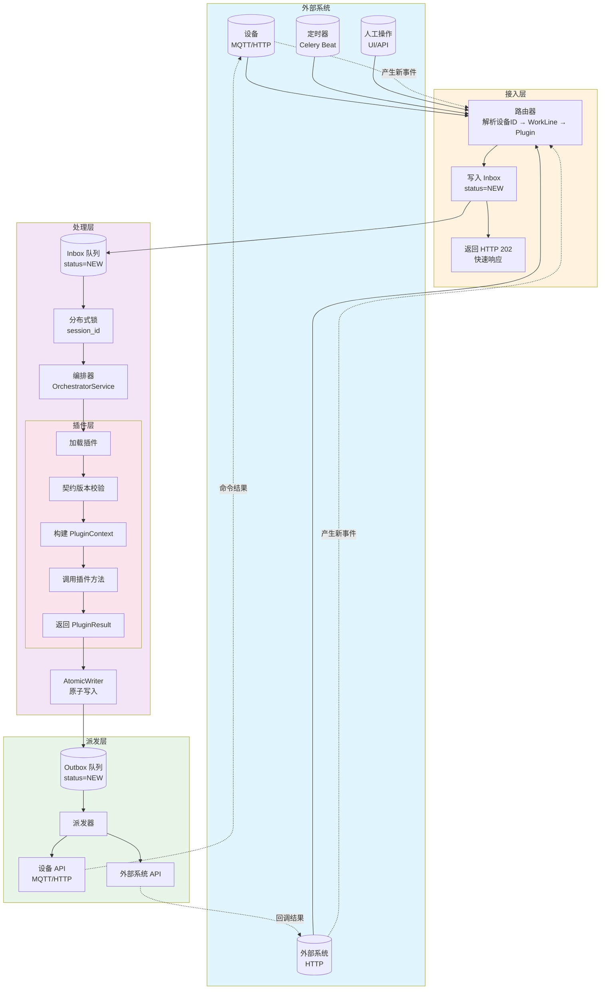

### 2. Inbox/Outbox 数据流向

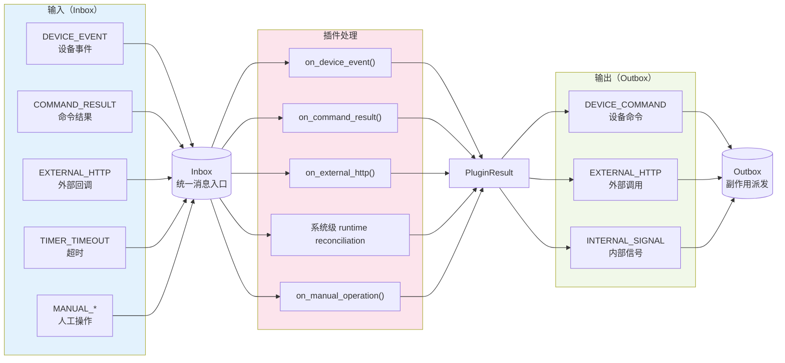

### 3. 完整时序图（SMT 扫码示例）

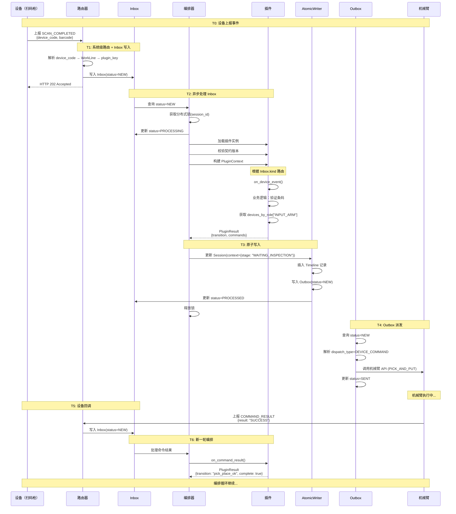

---

## 设备触发的两种来源（核心理解）

### 触发来源分类

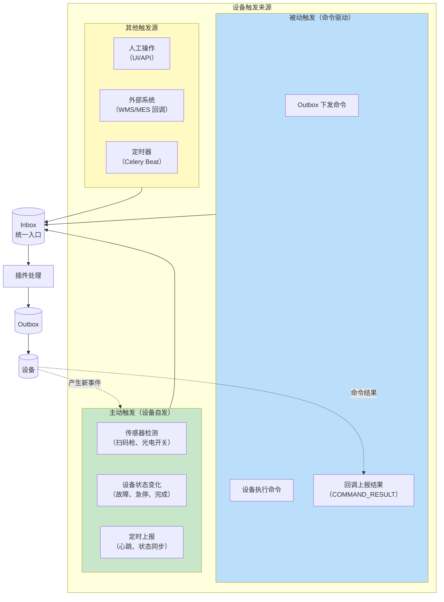

### 两种触发来源的详细对比

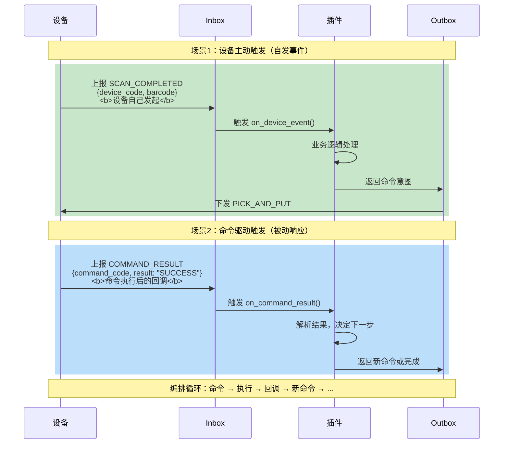

### 详细示例：SMT 粗分机的完整触发链

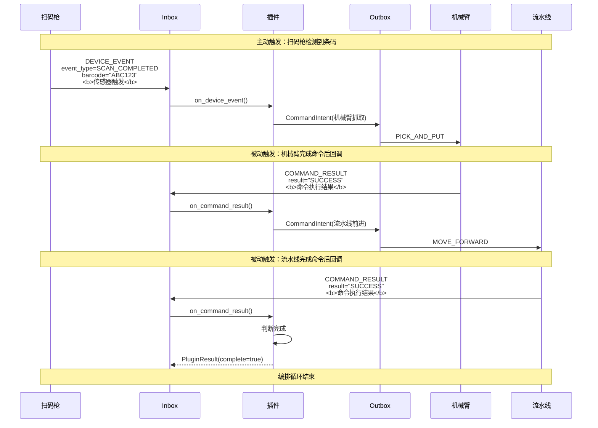

### 触发来源分类表

| 触发类型 | 来源 | Inbox.kind | 示例 | 插件方法 |
|---------|------|-----------|------|---------|
| **主动触发** | 设备自发 | `DEVICE_EVENT` | 扫码完成、急停、故障 | `on_device_event()` |
| **被动触发** | 命令驱动 | `COMMAND_RESULT` | 机械臂完成、流水线到位 | `on_command_result()` |
| **外部系统** | WMS/MES | `EXTERNAL_HTTP` | AGV 到站、上层系统指令 | `on_external_http()` |
| **定时器** | 系统定时 | `TIMER_TIMEOUT` | Callback deadline 对账隔离 | 系统级 runtime reconciliation |
| **人工操作** | UI/API | `MANUAL_*` | 人工暂停、恢复、取消 | `on_manual_operation()` |

### 关键设计：编排循环

```mermaid
stateDiagram-v2
    [*] --> ActiveEvent: 设备主动触发
    
    state ActiveEvent "主动事件<br/>(SCAN_COMPLETED)"
    state Plugin "插件处理"
    state Command "下发命令"
    state Execute "设备执行"
    state Callback "命令结果回调<br/>(COMMAND_RESULT)"
    
    ActiveEvent --> Plugin
    Plugin --> Command: 返回 CommandIntent
    Command --> Execute: Outbox 派发
    Execute --> Callback: 执行完成
    
    state choice <<choice>>
    Callback --> choice
    
    state NewCommand "下发新命令"
    state Complete "完成"
    
    choice --> NewCommand: 还有下一步
    choice --> Complete: 流程结束
    
    NewCommand --> Execute
    
    Complete --> [*]
    
    note right of ActiveEvent
        触发类型1：设备自发
        - 传感器检测
        - 状态变化
    end note
    
    note right of Callback
        触发类型2：命令驱动
        - Outbox 下发
        - 设备执行后回调
    end note
```

### 核心洞察

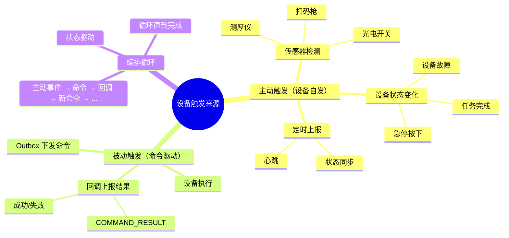

**核心要点**：

1. **主动触发** = 设备自发事件
   - 来源：传感器、状态机、定时器
   - Inbox.kind = `DEVICE_EVENT`
   - 触发 `on_device_event()`

2. **被动触发** = 命令驱动回调
   - 来源：Outbox 下发命令的执行结果
   - Inbox.kind = `COMMAND_RESULT`
   - 触发 `on_command_result()`

3. **编排循环** = 主动 + 被动交替
   ```
   主动事件 → 下发命令 → 被动回调 → 下发新命令 → ... → 完成
   ```

---

## 关键修正点

### 1. Inbox 不是"系统级"，是**统一消息入口**

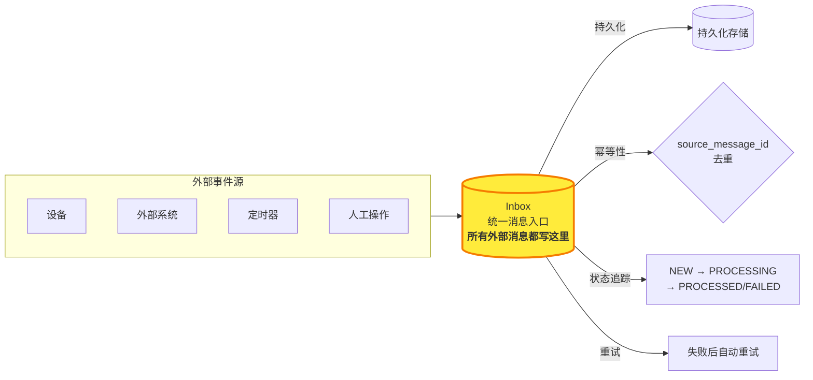

### 2. 两个不同层次的 ACK

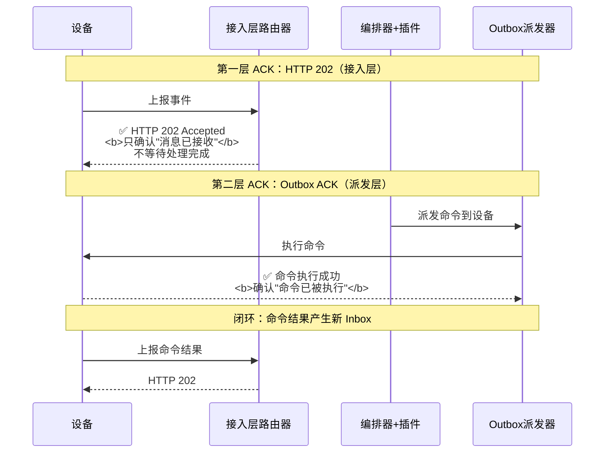

### 3. 插件不"处理 Outbox 事件"

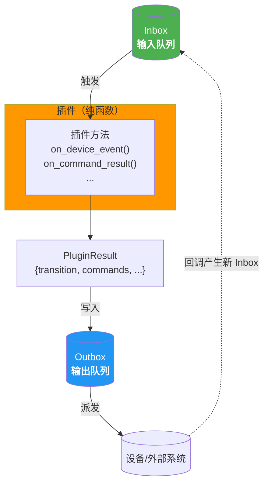

**关键理解**：
- ✅ **Inbox = 输入**：插件读取 Inbox
- ✅ **Outbox = 输出**：插件写入 Outbox
- ❌ **错误**：插件处理 Outbox（Outbox 是单向输出）

### 4. 设备拓扑获取流程

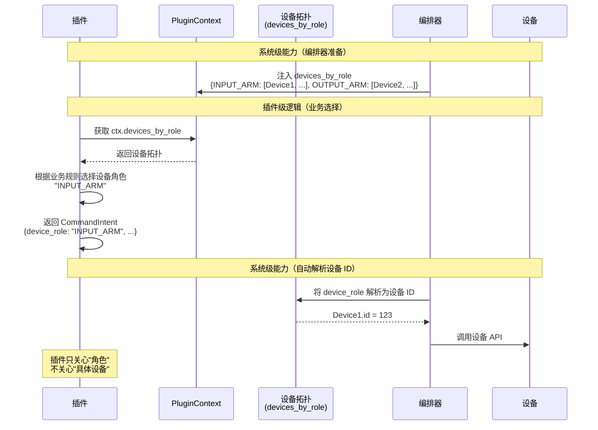

---

## 完整流程示例：SMT 粗分机扫码流程

### 场景：扫码枪上报扫码完成事件

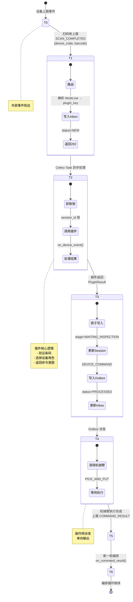

---

## 架构层次图

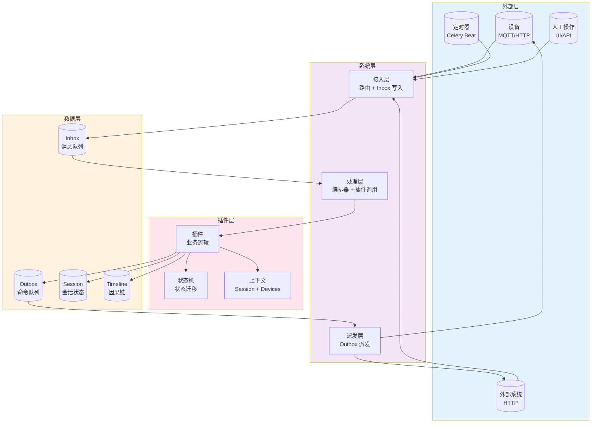

---

## 关键设计决策

### 1. 为什么用 Inbox/Outbox 模式？

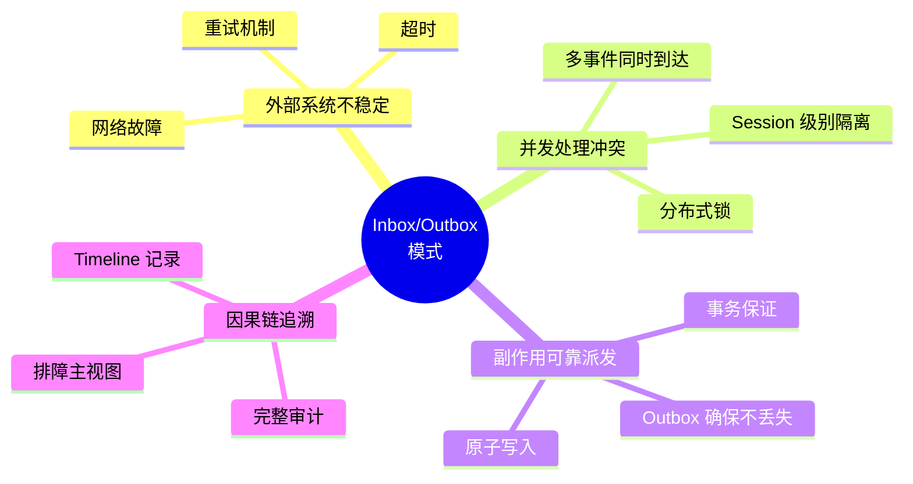

### 2. 为什么插件不直接操作设备？

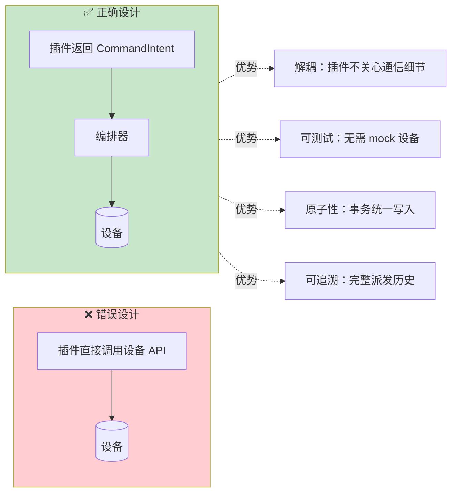

### 3. PluginContext 的作用

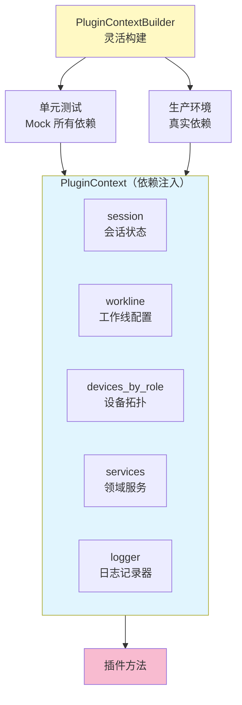

---

## 总结：您的理解 vs 实际设计

| 您的理解 | 实际设计 | 评价 |
|---------|---------|------|
| 1. 【系统级】设备上报 → 获取工作线和插件 | ✅ 正确 | 接入层路由逻辑 |
| 2. 【系统级】ACK 流程，Inbox 流程 | ⚠️ 部分正确 | Inbox 是统一消息入口，HTTP 202 只是快速响应 |
| 3. 【插件级】处理上报事件，获取下游设备 | ✅ 正确 | 插件核心逻辑 |
| 4. 【系统级】Outbox 流程，ACK 流程 | ⚠️ 部分正确 | Outbox 是副作用派发，单向输出 |
| 5. 【插件级】处理 Outbox 事件 | ❌ 不正确 | 插件处理 Inbox，Outbox 是输出 |
| 6. 重复 2~6 | ✅ 正确 | 编排循环 |

**准确率**：**70%**（核心概念正确，细节需要补充）

### 核心要点

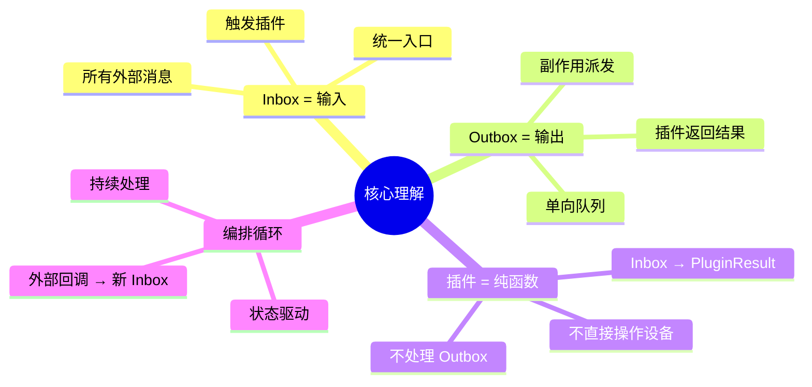

**建议**：
- 区分 Inbox（输入）和 Outbox（输出）
- 理解两个不同层次的 ACK
- 插件是**纯函数**：Inbox → PluginResult → Outbox
